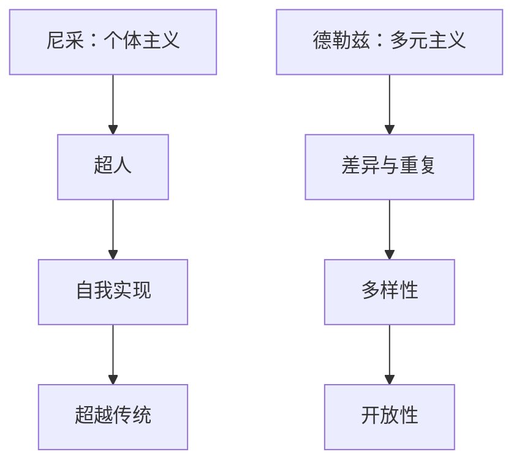
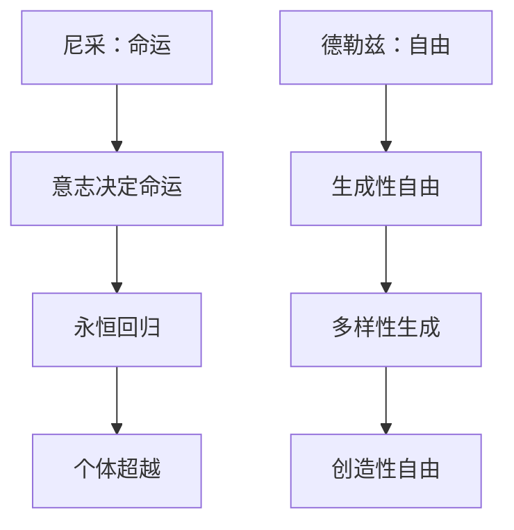
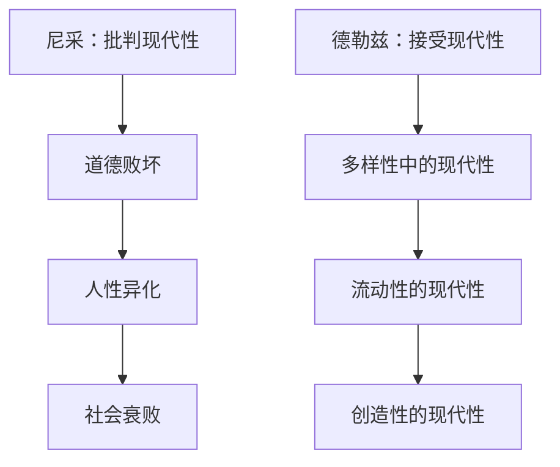

                 

### 尼采与德勒兹：差异哲学的谱系

> 关键词：尼采、德勒兹、差异哲学、尼采哲学、德勒兹哲学、谱系分析、现代哲学、思想流派

尼采与德勒兹：差异哲学的谱系，是一本探讨两位哲学大师尼采和德勒兹及其思想流派的著作。尼采，19世纪末德国著名的哲学家，以其对传统道德的批判、对个体主义的强调和对力量的颂扬而闻名于世。德勒兹，20世纪法国哲学家，是尼采思想的继承者和发展者，以其对差异、多元性、流动性和创造性的独特见解而著称。

本书旨在通过详细分析尼采和德勒兹的思想，揭示二者在哲学上的联系与差异，并探讨这一思想流派的历史和理论发展。书名中的“差异哲学”指的是尼采和德勒兹所倡导的哲学观点，即强调差异、多样性和流动性，反对僵化和固定化的思维方式。

本文将按以下结构进行探讨：

1. **尼采哲学的探索**：介绍尼采的生平与时代背景、核心概念与思想，以及他的主要著作与理论。
2. **德勒兹哲学的演进**：介绍德勒兹的生平与时代背景、核心概念与思想，以及他的主要著作与理论。
3. **尼采与德勒兹思想的比较**：比较尼采与德勒兹思想的联系和差异。
4. **差异哲学的谱系**：探讨差异哲学的历史与发展，以及其在当代的应用与影响。
5. **差异哲学的实际应用**：探讨差异哲学在教育、艺术和文学中的应用。
6. **总结与展望**：总结尼采与德勒兹：差异哲学的谱系，并对未来进行展望。

### 摘要

尼采与德勒兹：差异哲学的谱系，通过深入分析尼采和德勒兹的思想，揭示了二者在哲学上的联系与差异。尼采以其对传统道德的批判、对个体主义的强调和对力量的颂扬而闻名，而德勒兹则在此基础上发展出对差异、多元性、流动性和创造性的独特见解。本书系统地介绍了尼采和德勒兹的哲学观点、主要著作与理论，并通过对比分析，探讨了差异哲学的历史和理论发展。此外，本书还探讨了差异哲学在实际应用中的多种可能性，包括在教育、艺术和文学等领域。尼采与德勒兹：差异哲学的谱系不仅为哲学研究者提供了宝贵的资料，也为现代思想的探索提供了新的视角。

### 尼采哲学的探索

#### 第1章：尼采哲学概述

### 1.1.1 尼采的生平与时代背景

弗里德里希·尼采（Friedrich Nietzsche）生于1844年10月15日，是德国著名的哲学家、文化评论家、作家和诗人。他出生于普鲁士王国洛肯，这个位于瑞士与德国边境的小镇，给他带来了宁静而自由的环境，也成为了他早期哲学思考的重要起点。

尼采的时代背景是19世纪末的德国，这是一个充满变革和动荡的时期。19世纪中叶，德国完成了统一，并在随后的几十年里迅速成为欧洲乃至世界的文化和科技中心。然而，这一时期的德国社会也面临着诸多挑战，包括日益加剧的阶级冲突、经济危机以及社会制度的弊端。尼采正是在这样的社会背景下开始了他对哲学的思考。

尼采的家庭环境对他的成长有着重要的影响。他的父亲是一位基督教牧师，家庭氛围严肃而保守。尼采从小表现出非凡的智力和艺术天赋，但同时也面临着健康问题。他患有严重的胃病，这种疾病对他的生活和工作产生了深远的影响。

尼采的早期教育是在卢塞恩的瑞士中学接受的，后来他在波恩大学和莱比锡大学学习神学和古典文献学。然而，他对宗教和传统哲学的怀疑逐渐加深，最终放弃了神学生涯。在大学期间，尼采深受叔本华和黑格尔的影响，但他的思想逐渐超越了这些哲学家的局限。

19世纪末的德国哲学界，尼采遇到了两位对他影响深远的思想家：叔本华和尼采。叔本华的悲观主义哲学对尼采产生了深远的影响，使他开始质疑人类存在的意义。然而，尼采并没有完全接受叔本华的悲观主义，而是发展出了自己独特的哲学体系。

尼采的思想在19世纪末和20世纪初的德国社会引起了巨大反响。他的作品批判了传统道德观念、宗教和形而上学，提出了对个体、力量和超越的强调。尼采的思想对现代哲学、文学、艺术和心理学产生了深远的影响，成为现代思想的基石之一。

### 1.1.2 尼采的核心概念与思想

尼采的哲学体系是复杂而深刻的，他的核心概念和思想主要包括以下几个：

1. **意志主义**：尼采认为，意志是宇宙和人类存在的根本力量，是推动一切现象的根源。他批判了传统的机械唯物主义和目的论，强调生命的意志性和创造性。

   ```plaintext
   伪代码：
   // 意志主义概念
   function will_to_power() {
     // 推动生命和现象的发展
     evolve_life_and_phenomena();
   }
   ```

2. **超人（Übermensch）**：尼采提出了“超人”的概念，这是他理想中的理想人物，是超越传统道德和人类局限的新人类。超人具有强大的意志、创造力和超越性，能够创造自己的价值观和生活方式。

   ```plaintext
   伪代码：
   // 超人概念
   function overman() {
     // 超越传统道德
     transcend_morality();
     // 创造新价值观
     create_new_values();
   }
   ```

3. **永恒回归（Ewige Wiederkunft）**：尼采认为，宇宙是循环的，生命和事件会不断重复。他提出了“永恒回归”的概念，认为我们应该接受生命的重复和循环，以充满热情地面对每一个瞬间。

   ```plaintext
   伪代码：
   // 永恒回归概念
   function eternal_return() {
     // 接受生命的重复
     accept_repetition_of_life();
     // 以热情面对每个瞬间
     face_each_moment_with_zeal();
   }
   ```

4. **悲剧性（Tragödie）**：尼采认为，悲剧是人类精神的高峰，它通过揭示生命的苦难和荒谬，激发了人类对生命的热爱和超越。他的悲剧性哲学是对传统喜剧和道德的批判。

   ```plaintext
   伪代码：
   // 悲剧性概念
   function tragedy() {
     // 揭示生命的苦难和荒谬
     reveal_suffering_and_futility_of_life();
     // 激发对生命的热爱和超越
     inspire_love_and_transcendence_of_life();
   }
   ```

### 1.1.3 尼采哲学的批判性分析

尼采的哲学观点具有深刻的启示意义，但也面临着诸多批评和争议。以下是一些关于尼采哲学的批判性分析：

1. **伦理学批评**：尼采的伦理观被认为过于极端，他的超人概念和对道德的批判可能被误解为对道德相对主义的宣扬。然而，尼采的意图是超越传统的道德观念，创造新的价值观，而不是完全否定道德。

2. **个体主义批评**：尼采强调个体主义，认为个体应该超越社会和传统。这种观点可能被批评为个人主义和反社会。然而，尼采的个体主义强调个体的创造力和超越性，而不是孤立和自私。

3. **意志主义批评**：尼采的意志主义哲学可能被认为缺乏科学性和客观性。他的观点更多是基于直觉和想象，而不是严谨的逻辑和实证研究。

4. **影响和遗产**：尽管尼采的哲学观点存在争议，但他对现代哲学、文学和艺术产生了深远的影响。他的思想激发了后来的哲学家和思想家，如弗洛伊德、萨特和海德格尔，对存在主义、精神分析学和现象学的探索。

尼采哲学的复杂性和深度使得他的思想难以简单地归纳和评价。通过对尼采的生平、核心概念和批判性分析，我们可以更好地理解他的哲学体系及其对现代思想的影响。

### 第2章：尼采的主要著作与理论

#### 2.1.1 《论道德的谱系》

尼采的《论道德的谱系》（"Zur Genealogie der Moral"）是他最著名的作品之一，首次出版于1887年。这本书主要探讨了道德观念的历史起源和发展，以及传统道德观念的本质和局限性。尼采通过对道德观念的批判，揭示了道德观念背后的权力结构和历史条件。

在《论道德的谱系》中，尼采提出了几个核心观点：

1. **道德观念的历史起源**：尼采认为，道德观念并非天生的、永恒的，而是历史和社会的产物。他强调，道德观念起源于对弱者的保护和对强者的颂扬，这种保护机制是为了维持社会秩序和权力结构。

2. **奴隶道德与主人道德**：尼采区分了“奴隶道德”和“主人道德”。奴隶道德强调谦卑、同情和无私，是弱者为了生存而创造的道德观念。而主人道德则强调力量、自信和自我肯定，是强者为了维护自己的地位而创造的道德观念。

3. **道德观念的批判**：尼采批判了传统道德观念，认为它们往往掩盖了权力和利益的真实本质。他认为，道德观念往往被用来控制、压迫和剥削他人，维护社会等级制度。

为了详细阐述这些观点，尼采使用了大量历史和文献资料，通过引用古希腊哲学家、基督教文献和现代作家的作品，来支持他的论点。例如，他引用了古希腊哲学家苏格拉底和柏拉图的对话，来探讨道德观念的起源和发展；他引用了基督教圣经中的故事，来分析道德观念的宗教背景。

《论道德的谱系》不仅是一部哲学著作，也是一部文化批判作品。尼采通过对道德观念的批判，揭示了社会和文化的深层结构，为后来的文化批判和社会理论奠定了基础。这本书对现代哲学、社会学和心理学产生了深远的影响，被认为是20世纪哲学的经典之作。

#### 2.1.2 《悲剧的诞生》

尼采的另一部重要著作是《悲剧的诞生》（"Die Geburt der Tragödie"），首次出版于1872年。这本书主要探讨了悲剧艺术的历史起源和哲学意义，是尼采早期哲学思想的代表作之一。

在《悲剧的诞生》中，尼采提出了以下几个核心观点：

1. **悲剧艺术的起源**：尼采认为，悲剧艺术的起源可以追溯到古希腊，尤其是古希腊的戏剧和悲剧作品。他认为，悲剧艺术是一种揭示生命苦难和荒谬的艺术形式，通过表现人类的痛苦和挣扎，激发人们对生命的热爱和超越。

2. **悲剧性哲学**：尼采提出了“悲剧性哲学”的概念，认为悲剧性哲学是一种能够超越现实困境、正视生命苦难的哲学观念。他认为，悲剧性哲学能够帮助人们面对生命的痛苦和荒谬，从而找到生命的意义和目的。

3. **悲剧与喜剧的对比**：尼采通过对比悲剧和喜剧，分析了二者的本质差异。他认为，喜剧是一种逃避现实的手段，通过滑稽和幽默来掩盖生命的痛苦和荒谬；而悲剧则是一种直面现实的手段，通过揭示生命的苦难和荒谬，激发人们对生命的热爱和超越。

《悲剧的诞生》不仅在哲学上具有重要意义，也在艺术史上产生了深远的影响。尼采对悲剧艺术的探讨，为后来的现代戏剧和文学提供了新的视角和理论框架。这本书对现代艺术和文学的影响，尤其是在20世纪的戏剧、电影和文学领域，尤为显著。

尼采在这本书中使用了丰富的文学和哲学例证，通过分析古希腊悲剧作品，如索福克勒斯的《安提戈涅》和欧里庇得斯的《美狄亚》，来阐述他的悲剧性哲学。他还引用了德国哲学家黑格尔和叔本华的观点，来支持他的论点。

通过《悲剧的诞生》，尼采不仅探讨了悲剧艺术的起源和哲学意义，也展示了他对生命和存在的独特见解。这本书不仅为后来的哲学家和文学家提供了重要的理论资源，也为现代文化批判和艺术创作提供了深刻的启示。

#### 2.1.3 《尼采全集》中的其他著作

尼采的哲学思想和文学创作非常丰富，除了《论道德的谱系》和《悲剧的诞生》外，他的《尼采全集》还包括许多其他重要的著作，这些作品进一步阐述了他的哲学思想和文学观念。以下是对这些著作的简要介绍：

1. **《查拉图斯特拉如是说》**（"Also sprach Zarathustra"）
   这部作品是尼采的代表作之一，首次出版于1885年。查拉图斯特拉是这部小说中的主人公，他是一位先知，以预言家的身份向世界传达他的哲学思想。这本书通过一系列寓言和格言，探讨了超人的概念、生命的意义、个体的超越和道德的重建。查拉图斯特拉的形象象征着尼采对个体创造力和自我超越的渴望。

2. **《善恶的彼岸》**（"Jenseits von Gut und Böse"）
   出版于1886年，这部作品进一步探讨了尼采的伦理观和道德批判。尼采在这本书中提出了“权力意志”的概念，认为生命的基本驱动力是追求权力和支配。他批判了传统的道德观念，认为它们是权力的工具，而不是真正的道德原则。

3. **《人性，太人性了》**（"Menschliches, Alltoo Menschliches"）
   这部作品是尼采的自传性散文集，首次出版于1886年。通过个人回忆和反思，尼采探讨了人类的本质、个体的心理和道德问题。这本书展示了尼采对人类本性的深刻洞察和对人类困境的批判。

4. **《道德的谱系》**（"Gott ist tot!"）
   出版于1882年，这部作品是尼采对宗教和形而上学的批判。尼采在这本书中宣称“上帝已死”，意味着传统宗教和道德观念的终结。他通过批判基督教和传统宗教，探讨人类在没有上帝的情况下如何寻找意义和价值。

5. **《尼采的遗稿》**（"Nachgelassene Schriften"）
   这是一部包括尼采生前未发表作品的汇编，涵盖了他在各个领域的思考和创作。这些遗稿展示了尼采晚年的思想发展，包括他对美学、艺术、科学和哲学的思考。

通过这些著作，尼采不仅构建了他的哲学体系，也通过丰富的文学形式表达了他的思想和观点。这些作品对现代哲学、文学和艺术产生了深远的影响，使尼采成为20世纪最重要的思想家之一。

### 第3章：德勒兹哲学概述

#### 3.1.1 德勒兹的生平与时代背景

吉尔·德勒兹（Gilles Deleuze）生于1925年，是法国著名的哲学家、作家和电影评论家。他的出生背景充满了哲学和文学的气息，他的父亲是一位哲学家，母亲则是一位文学评论家。这种家庭环境为德勒兹的哲学思考提供了丰富的资源和启示。

德勒兹的一生跨越了20世纪的大部分时间，他的哲学思想也随着时代的变迁而不断发展和深化。他的主要哲学著作包括《差异与重复》、《资本主义与奴隶制》、《电影1：运动图像》和《电影2：时间-图像》等。这些著作不仅在哲学界引起了广泛的讨论，也对文学、电影和艺术产生了深远的影响。

德勒兹的时代背景是20世纪法国哲学界的一个关键时期，这个时期见证了结构主义、后结构主义和存在主义的兴起。德勒兹与这些哲学家有过深入的交流和讨论，但他也在这些思想的基础上发展出了自己独特的哲学体系。

德勒兹的哲学思想深受尼采的影响。他深受尼采的“超人”概念和“差异哲学”的启发，认为差异和多样性是理解和创造世界的关键。德勒兹的思想强调个体性和创造力，反对僵化和固定化的思维方式。

### 3.1.2 德勒兹的核心概念与思想

德勒兹的哲学思想充满了创新和独特性，他的核心概念和思想主要包括以下几个方面：

1. **差异与连续性**：德勒兹认为，差异是构成世界的基本元素，而不是同一性。他提出了“差异与连续性”（Difference and Repetition）这一核心概念，认为差异是连续性的基础，而不是相反。

   ```mermaid
   graph TB
   A[差异] --> B[连续性]
   B --> C[世界]
   ```

2. **多样性**：德勒兹强调多样性是生命的本质，他提出了“多样性原则”（Principle of Diversity），认为多样性不仅仅是表面现象，而是深层次的本质。

   ```mermaid
   graph TB
   A[多样性] --> B[生命]
   B --> C[世界]
   ```

3. **流动性和生成性**：德勒兹认为，世界是一个不断流动和生成的过程，而不是静止不变的实体。他提出了“生成性”（Generative Nature）的概念，强调一切事物都在不断地生成和变化。

   ```mermaid
   graph TB
   A[生成性] --> B[世界]
   B --> C[流动]
   ```

4. **个体性与微观政治**：德勒兹认为，个体性是多样性的基础，他提出了“微观政治”（Micro-Politics）的概念，强调个体在创造和改变世界中的重要性。

   ```mermaid
   graph TB
   A[个体性] --> B[微观政治]
   B --> C[世界]
   ```

5. **感知与表达**：德勒兹认为，感知和表达是理解和创造世界的重要方式。他提出了“感知表达论”（Perceptual Expression Theory），强调感知和表达在个体和世界之间的桥梁作用。

   ```mermaid
   graph TB
   A[感知] --> B[表达]
   B --> C[世界]
   ```

### 3.1.3 德勒兹哲学的批判性分析

德勒兹的哲学思想在20世纪哲学界产生了深远的影响，但也面临着诸多批评和争议。以下是一些关于德勒兹哲学的批判性分析：

1. **复杂性与可理解性**：德勒兹的哲学思想非常复杂，他使用了许多抽象的概念和术语，这使得他的思想难以理解和解释。一些批评者认为，德勒兹的思想过于晦涩难懂，难以在学术界和公众中普及。

2. **非传统性与传统哲学**：德勒兹的哲学思想与传统哲学有很大的不同，他反对同一性、固定化和传统观念。然而，一些批评者认为，德勒兹的思想缺乏与传统哲学的对话和互动，使得他的思想显得孤立和自我封闭。

3. **个体性与集体性**：德勒兹强调个体性和微观政治，但他对集体性和社会结构的关注相对较少。一些批评者认为，德勒兹的思想过于强调个体，忽视了个体与集体之间的互动和关系。

4. **政治与伦理**：德勒兹的哲学思想强调个体创造力和多样性，但他对政治和伦理问题的讨论相对较少。一些批评者认为，德勒兹的思想缺乏对政治和伦理问题的深入探讨，这使得他的思想在现实应用中面临挑战。

尽管存在这些批评和争议，德勒兹的哲学思想仍然在学术界和公共领域产生了重要影响。他的思想激发了后来的哲学家和思想家，对个体性、多样性、流动性和创造性的探讨提供了新的视角和思路。德勒兹的哲学思想不仅丰富了20世纪哲学的多样性，也为现代社会的理解和解决提供了重要的启示。

### 第4章：德勒兹的主要著作与理论

#### 4.1.1 《差异与重复》

《差异与重复》（"Difference and Repetition"）是吉尔·德勒兹的代表作之一，首次出版于1968年。这本书是德勒兹哲学思想的基石，对后来的哲学、文学、电影和文化理论产生了深远的影响。

在《差异与重复》中，德勒兹提出了几个核心概念：

1. **差异（Difference）**：德勒兹认为，差异是构成世界的基本元素，而不是同一性。他反对传统哲学中的同一性观念，强调差异是世界的本质。差异不仅仅是表面现象，而是深层次的本质。

2. **重复（Replication）**：德勒兹认为，重复是差异的基础，而不是相反。重复不仅是指物理上的复制，更是指在差异中产生的新的可能性。德勒兹提出了“重复性结构”（Repetitive Structure）的概念，认为一切事物都在不断地生成和变化。

3. **生成性（Generative Nature）**：德勒兹强调生成性是世界的本质，一切事物都在不断地生成和变化。他提出了“生成性原则”（Generative Principle），认为生成性是理解和创造世界的关键。

在《差异与重复》中，德勒兹使用了大量的哲学、文学和艺术例证来阐述他的观点。他引用了柏拉图、黑格尔、尼采和福柯等哲学家的思想，探讨了差异和重复在哲学、文学和艺术中的表现。他还通过分析文学作品，如普鲁斯特的小说，探讨了生成性在文学创作中的重要作用。

这本书不仅在哲学上具有重要意义，也在文学、电影和文化理论领域产生了深远的影响。德勒兹的差异哲学为后来的文化理论提供了新的视角和思路，推动了后结构主义和后现代主义的发展。

#### 4.1.2 《资本主义与奴隶制》

《资本主义与奴隶制》（"Capitalism and Slavery"）是德勒兹和费利克斯·瓜塔里合著的一部重要著作，首次出版于1975年。这本书通过对资本主义和奴隶制的历史分析，探讨了权力、控制和自由的关系。

在《资本主义与奴隶制》中，德勒兹和瓜塔里提出了几个核心概念：

1. **资本主义**：他们认为，资本主义不仅仅是经济制度，更是一种社会和文化结构。资本主义通过剥削和压迫，维持了权力的不平等和控制的稳定性。

2. **奴隶制**：德勒兹和瓜塔里将奴隶制视为资本主义的核心机制，认为奴隶制不仅存在于过去的种植园社会，也存在于现代资本主义社会中。奴隶制通过控制个体的身体和意志，维持了资本主义的运作。

3. **微观权力**：德勒兹和瓜塔里提出了“微观权力”（Micro-Power）的概念，认为权力并非集中于少数人手中，而是分散在社会的各个层面。微观权力通过日常生活中的各种机制，如教育、媒体、法律和道德规范，实现对个体的控制和塑造。

4. **自由**：德勒兹和瓜塔里强调自由的重要性，认为自由不仅是摆脱控制的解放，更是创造和生成的可能性。他们提出了“自由机器”（Machine of Freedom）的概念，认为自由需要通过打破现有的权力结构和控制机制来实现。

《资本主义与奴隶制》通过历史分析、哲学思考和文学创作，对资本主义和奴隶制进行了深刻的批判。这本书不仅在哲学界引起了广泛的讨论，也对社会科学、政治学和文学批评产生了重要影响。

#### 4.1.3 《千座高原》

《千座高原》（"Mille Plateaux"）是德勒兹和瓜塔里合著的一部重要著作，首次出版于1980年。这本书是《资本主义与奴隶制》的续篇，进一步探讨了差异、流动性和创造性的概念。

在《千座高原》中，德勒兹和瓜塔里提出了几个核心概念：

1. **千座高原**：这本书的标题“千座高原”象征着无限的可能性和多样性。高原是一种开放的空间，没有固定的边界和中心，是一种流动和生成的状态。

2. **差异与重复**：德勒兹和瓜塔里进一步探讨了他们在《差异与重复》中提出的概念，强调差异是构成世界的基本元素，而重复是差异的基础。

3. **机器**：他们认为，机器是创造和生成的重要工具，机器不仅是物理的机器，更是思想和文化的机器。机器能够打破现有的结构和控制，实现新的可能性。

4. **折叠**：德勒兹和瓜塔里提出了“折叠”（Fold）的概念，认为折叠是一种将不同领域和层次连接起来的方式。通过折叠，不同的领域可以相互影响和渗透，产生新的关系和结构。

《千座高原》通过哲学思考、文学创作和音乐分析，探讨了差异、流动性和创造性的概念。这本书不仅在哲学界引起了广泛的讨论，也对文学、艺术和音乐理论产生了重要影响。

### 第5章：尼采与德勒兹思想的联系

#### 5.1.1 尼采对德勒兹思想的影响

尼采是20世纪最重要的哲学家之一，他对后来的哲学、文学、艺术和思想产生了深远的影响。其中，德勒兹是尼采思想的忠实继承者和发展者，他的哲学思想深受尼采的影响。

首先，德勒兹对尼采的“意志主义”（Will to Power）概念进行了深入探讨和发展。尼采认为，意志是宇宙和人类存在的根本力量，是推动一切现象的根源。德勒兹在尼采的基础上，进一步强调了意志的多样性和创造性。他提出了“差异与重复”的概念，认为差异是构成世界的基本元素，而重复是差异的基础。德勒兹通过这一概念，揭示了世界的多样性和生成性，这与尼采的意志主义思想有着密切的联系。

其次，德勒兹对尼采的“超人”概念进行了重新诠释和发展。尼采提出了“超人”这一理想人物，认为超人具有强大的意志、创造力和超越性，能够超越传统的道德和人类局限。德勒兹认为，超人不仅仅是理想的人物，更是一种生活方式和思维方式。他提出了“千座高原”的概念，认为高原是一种开放的空间，没有固定的边界和中心，是一种流动和生成的状态。德勒兹通过这一概念，进一步强调了超人的多样性和创造性。

此外，德勒兹对尼采的“悲剧性”（Tragic Philosophy）思想进行了深入探讨。尼采认为，悲剧是人类精神的高峰，通过揭示生命的苦难和荒谬，激发了人类对生命的热爱和超越。德勒兹在尼采的基础上，进一步强调了悲剧性的重要性和多样性。他提出了“感知表达论”（Perceptual Expression Theory），认为感知和表达是理解和创造世界的重要方式。德勒兹通过这一理论，揭示了人类在感知和表达中的多样性和创造性。

总之，德勒兹的思想深受尼采的影响，他在尼采的基础上进行了深入的发展和拓展。德勒兹通过提出“差异与重复”、“千座高原”和“感知表达论”等概念，进一步深化了尼采的意志主义、超人概念和悲剧性哲学。德勒兹的哲学思想不仅继承了尼采的核心观点，也为现代哲学和思想提供了新的视角和思路。

#### 5.1.2 德勒兹对尼采思想的继承与发展

吉尔·德勒兹的哲学思想不仅在形式上继承了尼采，更在内容上进行了深刻的扩展和发展。德勒兹对尼采思想的继承主要体现在以下几个方面：

首先，德勒兹继承了尼采的意志主义观念。尼采认为，意志是生命的本质和动力，是超越现实困境的源泉。德勒兹在此基础上，进一步强调了意志的多样性和创造性。他在《差异与重复》中提出，差异是构成世界的基本元素，而重复是差异的基础。这一观点不仅延续了尼采的意志主义，还深化了对生命力和创造力的理解。

其次，德勒兹继承了尼采的超人概念，并将其发展成为一种生活方式和思维方式。尼采的超人是一个超越传统道德和人类局限的理想人物，而德勒兹则认为，超人不仅存在于特定的个体中，也体现在日常生活的实践中。他在《千座高原》中提出，高原是一种开放的空间，没有固定的边界和中心，代表了超人的流动性和创造性。这一观点不仅丰富了超人的内涵，也为现代社会提供了新的生活哲学。

此外，德勒兹对尼采的悲剧性哲学进行了进一步的探讨和发展。尼采认为，悲剧是人类精神的高峰，通过揭示生命的苦难和荒谬，激发了人类对生命的热爱和超越。德勒兹在尼采的基础上，提出了“感知表达论”，强调感知和表达在理解和创造世界中的重要性。他认为，通过感知和表达，个体能够超越现实的束缚，达到一种更高的存在状态。

德勒兹还发展了尼采对权力和控制的批判。尼采认为，权力和控制的本质在于对个体意志的剥夺，而德勒兹则进一步探讨了这种剥夺的多样性和复杂性。他在《资本主义与奴隶制》中，将权力和控制的批判扩展到资本主义社会的各个方面，提出了“微观权力”的概念，强调权力不仅存在于宏观层面，也存在于微观层面。

总的来说，德勒兹对尼采思想的继承和发展，不仅体现在对尼采核心观点的深化和拓展，更体现在对现代社会和文化的深刻批判。他的哲学思想为理解个体、社会和文化提供了新的视角和思路，对后来的哲学家和思想家产生了重要影响。

### 尼采与德勒兹思想的差异

#### 6.1.1 个体主义与多元主义

尼采和德勒兹在个体主义和多元主义方面有着显著的差异。尼采强调个体主义，认为个体是创造和超越的源泉。他的超人概念强调了个体在道德、知识和力量上的独特性，倡导个体摆脱社会和传统的束缚，追求自我实现和超越。



德勒兹则更倾向于多元主义，他认为差异和多样性是构成世界的根本元素。他提出的“差异与重复”理论强调，世界是由无数不同的差异和重复的层次构成的，这些差异和重复不仅存在于个体之间，也存在于社会和文化中。德勒兹主张，通过尊重和探索多样性，个体和社会可以实现更加丰富和多样的发展。

#### 6.1.2 命运与自由

尼采和德勒兹在命运与自由的关系上也有明显的区别。尼采强调命运的必然性，他认为生命中的每一个瞬间都是意志的体现，命运是由个体的意志所决定的。他的“永恒回归”概念认为，生命是一个循环的过程，通过不断的重复和超越，个体能够掌握自己的命运。



相比之下，德勒兹则强调自由的不确定性和创造性。他认为，自由不仅仅是一种摆脱束缚的状态，更是一种生成和创造的过程。他的“生成性自由”概念认为，自由是在差异和多样性中不断生成的，个体通过探索和创造新的可能性，实现自由。

#### 6.1.3 对现代性的看法

尼采和德勒兹在现代性问题上持有不同的观点。尼采对现代性持批判态度，他认为现代性带来了道德的败坏、人性的异化和社会的衰败。他批判现代性的虚伪和空虚，呼吁人们超越现代性的局限，回归生命的本质。



德勒兹则更倾向于接受现代性，他认为现代性带来了新的可能性，包括多样性和流动性。他主张在差异和多样性中寻找现代性的意义，通过创造和生成，使现代性变得更加丰富和有意义。

总的来说，尼采和德勒兹在个体主义与多元主义、命运与自由以及对现代性的看法上存在显著差异。这些差异反映了他们各自对世界和人生的独特理解，也为我们提供了丰富的哲学思考和启示。

### 差异哲学的历史与发展

#### 6.2.1 差异哲学的起源

差异哲学的起源可以追溯到古希腊哲学家赫拉克利特（Heraclitus），他提出了“万物皆流”（Panta Rhei）的哲学观点，认为世界是一个不断变化的过程，差异和流动是世界的本质。赫拉克利特的思想对后来的哲学家产生了深远的影响，特别是对尼采和德勒兹的影响。

在19世纪的德国，弗里德里希·尼采进一步发展了差异哲学。尼采的意志主义和超人概念强调了个体在创造和超越中的重要性，他认为差异是构成世界的基本元素，而重复是差异的基础。尼采在《差异与重复》和《悲剧的诞生》中，系统地阐述了差异哲学的核心观点。

20世纪的法国哲学家吉尔·德勒兹进一步深化了差异哲学。他在《差异与重复》和《千座高原》中，提出了“生成性”（Generative Nature）和“多样性原则”（Principle of Diversity）的概念，认为差异和多样性是构成世界的基本元素。德勒兹的思想强调了差异和多样性在个体和社会中的重要性，为现代哲学和思想提供了新的视角和思路。

#### 6.2.2 差异哲学的主要流派

差异哲学在20世纪发展出了多个主要流派，每个流派都有其独特的理论贡献：

1. **尼采主义**：尼采主义是差异哲学的最早流派，强调个体的意志和创造力。尼采的意志主义和超人概念对后来的哲学家和思想家产生了深远的影响，激发了他们对个体和创造力的探讨。

2. **德勒兹主义**：德勒兹主义是20世纪末和21世纪初最具有影响力的差异哲学流派。德勒兹的思想强调了差异和多样性在个体和社会中的重要性，提出了“生成性”和“多样性原则”的概念，为现代哲学和思想提供了新的视角和思路。

3. **后结构主义**：后结构主义是20世纪的重要哲学流派，受到了德勒兹思想的影响。后结构主义者如雅克·德里达（Jacques Derrida）和米歇尔·福柯（Michel Foucault）对传统哲学和文化的结构进行了批判，强调了差异和多样性在理解和创造世界中的重要性。

4. **差异政治学**：差异政治学是差异哲学在政治领域的应用，强调通过尊重和探索差异，实现社会的多样性和公正。差异政治学的倡导者如爱德华·萨义德（Edward Said）和朱迪斯·巴特勒（Judith Butler）通过批判西方中心主义和殖民主义，推动了社会正义和多样性的讨论。

#### 6.2.3 差异哲学在当代的应用与影响

差异哲学在当代社会和学术界有着广泛的应用和影响。以下是一些具体的例子：

1. **哲学**：差异哲学为现代哲学提供了新的视角和思路，推动了哲学家对个体、社会和文化的探讨。例如，德勒兹的思想在当代哲学中引发了关于创造力和流动性的讨论。

2. **文学**：差异哲学在文学领域产生了深远的影响，推动了文学创作和文学理论的创新。例如，作家如弗吉尼亚·伍尔芙（Virginia Woolf）和詹姆斯·乔伊斯（James Joyce）通过探索差异和多样性，创作出了具有现代主义特点的文学作品。

3. **电影**：差异哲学在电影艺术中也有着广泛的应用，电影导演如安德烈·塔可夫斯基（Andrei Tarkovsky）和斯蒂文·斯皮尔伯格（Steven Spielberg）通过探索差异和多样性，创作出了具有深刻内涵和艺术价值的电影。

4. **艺术**：差异哲学在艺术领域推动了艺术家对多样性和流动性的探索。例如，现代艺术家如弗朗西斯·贝肯斯坦（Franz Kafka）和路易斯·布尔乔亚（Louise Bourgeois）通过创作充满差异和多样性的艺术作品，挑战了传统艺术的观念和形式。

5. **社会学**：差异哲学在社会学领域引发了关于社会多样性和公正的讨论，推动了社会政策和社会变革。例如，社会学家如查尔斯·泰勒（Charles Taylor）和罗兰·巴特（Roland Barthes）通过应用差异哲学，探讨了多元文化社会中的身份认同和价值观。

6. **心理学**：差异哲学在心理学领域推动了关于个体差异和创造力的研究，促进了心理治疗和心理咨询的创新。例如，心理学家如阿尔弗雷德·阿德勒（Alfred Adler）和卡尔·罗杰斯（Carl Rogers）通过应用差异哲学，提出了关于个体差异和自我实现的心理学理论。

总之，差异哲学在当代社会和学术界具有广泛的应用和影响。通过强调差异和多样性，差异哲学为理解和创造世界提供了新的视角和思路，推动了现代哲学、文学、艺术和社会科学的创新和发展。

### 第8章：差异哲学在教育中的应用

#### 8.1.1 差异哲学对教育理论的贡献

差异哲学在教育理论中发挥了重要作用，它为教育者提供了新的视角和工具，以理解和应对学生的多样性。吉尔·德勒兹和弗里德里希·尼采的差异哲学强调个体和差异的重要性，这对教育实践有着深刻的启示。

首先，德勒兹的“差异与重复”理论挑战了传统的教育观念，特别是同质性和标准化教育的局限。他认为，每个学生都是独特的个体，具有独特的背景、兴趣和潜能。这种观点要求教育者尊重学生的个体差异，而不是试图将他们塑造成统一的模式。通过理解和接受学生的多样性，教育者可以创造更加包容和有效的学习环境。

其次，德勒兹的“生成性自由”概念为教育实践提供了新的指导。他认为，自由不仅是摆脱束缚，更是一种生成和创造的过程。在教育中，这意味着教育者应该鼓励学生探索和创造新的知识，而不是仅仅接受和重复现有的知识。这种生成性的教育方法可以激发学生的创造力，促进他们的自我发现和成长。

尼采的个体主义和超人概念也为教育理论做出了重要贡献。尼采强调个体的自我实现和超越，这激励教育者关注每个学生的独特潜能和兴趣，而不是仅仅追求标准化和统一的教学目标。通过个性化的教学方法和课程设计，教育者可以帮助学生发现自己的优势，实现自我超越。

#### 8.1.2 差异哲学在个性化教学中的应用

差异哲学的核心理念在个性化教学中得到了广泛应用。个性化教学是一种以学生为中心的教学方法，它强调根据每个学生的个性和需求来设计教学活动。以下是一些具体的应用方法：

1. **差异化课程设计**：教育者可以根据学生的兴趣、能力和学习风格，设计个性化的课程。例如，对艺术感兴趣的学生可以参加绘画或音乐课程，而对科学感兴趣的学生可以参加实验或研究项目。

2. **个性化学习路径**：教育者可以为学生提供多种学习路径，以适应他们的学习速度和风格。例如，对于理解能力强但需要更多实践机会的学生，可以安排更多的实践活动，而对于需要更多指导和支持的学生，可以提供个别辅导或小组讨论。

3. **鼓励自主探索**：教育者应该鼓励学生自主探索和创造，提供丰富的学习资源和支持。例如，可以设置开放性课题，让学生根据自己的兴趣和想象力进行研究和创作。

4. **多元评价方法**：教育者应该采用多元的评价方法，不仅关注学生的考试成绩，还关注他们的学习过程、创造力和自我反思能力。这种评价方法可以更全面地反映学生的能力和潜力。

通过这些应用，差异哲学的核心理念可以帮助教育者更好地理解和应对学生的多样性，促进每个学生的个性化发展和自我实现。

### 第9章：差异哲学在艺术与文学中的体现

#### 9.1.1 差异哲学对艺术理论的影响

差异哲学在艺术理论中有着深刻的体现，它为艺术创作和艺术批评提供了新的视角和工具。尼采和德勒兹的差异哲学强调个体、差异和多样性，这些理念在艺术中得到了广泛的应用和探讨。

首先，德勒兹的“差异与重复”理论对现代艺术产生了重要影响。他认为，艺术创作是通过差异和重复来创造新的意义和形式的。艺术家通过探索和组合不同的元素，创造出独特的艺术作品。例如，画家可以通过不同的颜色、形状和纹理的组合，创作出具有独特视觉冲击力的画作。音乐家可以通过不同的旋律、节奏和和声的组合，创作出具有深刻内涵的音乐作品。德勒兹的这种理论鼓励艺术家在创作中突破传统的束缚，探索新的表现形式和创作方法。

其次，尼采的超人概念对现代艺术和文学创作产生了深远的影响。尼采的超人是一个超越传统道德和人类局限的理想人物，他鼓励艺术家超越自我，追求更高的艺术境界。艺术家在创作中可以尝试新的艺术形式、实验性的技巧，甚至颠覆传统的艺术观念。例如，现代主义艺术家如毕加索（Pablo Picasso）和马蒂斯（Henri Matisse）通过探索形式和色彩的创新，创作出了具有颠覆性意义的艺术作品。作家如詹姆斯·乔伊斯（James Joyce）和弗吉尼亚·伍尔芙（Virginia Woolf）通过探索语言和叙事的创新，创作出了具有现代主义特点的文学作品。

#### 9.1.2 差异哲学在文学作品中的体现

差异哲学在文学作品中的体现尤为显著，它为文学创作提供了新的方法和主题。以下是一些具体的例子：

1. **个体性和多样性**：差异哲学强调个体的独特性和多样性，这成为许多文学作品的主题。例如，詹姆斯·乔伊斯的小说《尤利西斯》通过描述主人公斯蒂芬·迪达鲁斯的内心世界，展现了个体在多样性和复杂性中的探索。弗吉尼亚·伍尔芙的小说《到灯塔去》通过描绘不同人物的心理和情感，探讨了个体在多样性和差异中的相互影响。

2. **超越和创造力**：差异哲学鼓励个体超越传统的束缚，追求更高的艺术境界。许多文学作品通过描述主人公的超越和创造过程，体现了这种哲学思想。例如，T.S.艾略特的诗剧《荒原》通过描绘主人公在精神和艺术上的超越，探讨了人类在困境中的救赎和重建。

3. **社会批判**：差异哲学还用于批判社会的不平等和压迫。许多文学作品通过揭示社会中的差异和多样性，批判了社会的不公正和压迫。例如，奥尼尔（Eugene O'Neill）的戏剧《长夜漫漫路迢迢》通过描绘工人阶级的苦难和斗争，展现了差异哲学在社会批判中的力量。

总之，差异哲学在艺术与文学中有着深刻的体现，它为艺术创作和文学批评提供了新的视角和工具。通过探索个体、差异和多样性，差异哲学激发了艺术家和作家的创造力，丰富了艺术和文学的内涵。

### 第10章：差异哲学的未来发展

#### 10.1.1 差异哲学在哲学领域的发展趋势

差异哲学作为一种重要的哲学思想，不仅在20世纪产生了深远的影响，也在21世纪的哲学领域中继续发展。以下是一些差异哲学在哲学领域的发展趋势：

1. **跨学科融合**：差异哲学在哲学领域的发展趋势之一是与其他学科领域的融合。例如，它与认知科学、生态学、社会学和政治哲学等领域进行了深入的交叉研究。这种跨学科的研究有助于深化对差异哲学的理解，并将其应用于更广泛的领域。

2. **后结构主义与后现代主义**：差异哲学在后结构主义和后现代主义中有着重要的地位。后结构主义和后现代主义强调文本的开放性、意义的相对性和文化的多样性，这些观点与德勒兹的差异哲学相契合。未来的研究可能会进一步探讨差异哲学如何影响和丰富后结构主义和后现代主义的理论体系。

3. **社会正义与政治哲学**：差异哲学在当代社会正义和政治哲学中具有广泛的应用。它为理解和解决社会不平等、种族歧视和性别歧视等问题提供了新的视角。未来的研究可能会深入探讨如何将差异哲学应用于社会正义和政治哲学的实际问题中，以推动社会变革。

4. **技术与文化**：随着技术的发展，差异哲学在数字文化和技术哲学中也开始得到应用。差异哲学关注个体和差异，这使它成为一个有力的工具，用于探讨数字时代中的个体身份、隐私和自由。未来的研究可能会探讨差异哲学如何影响和塑造数字文化的未来。

#### 10.1.2 差异哲学在其他学科领域的应用前景

差异哲学不仅在哲学领域有着广泛的应用，也在其他学科领域展现了巨大的潜力：

1. **心理学**：差异哲学在心理学中的应用前景广阔。它可以帮助心理学家理解个体差异和多样性，以及这些差异如何影响人的行为和心理健康。未来研究可能会探索差异哲学如何帮助心理学家开发新的心理治疗方法和理论。

2. **社会学**：差异哲学在社会学中有着广泛的应用前景。它可以用来分析社会结构、社会关系和社会变革，帮助社会学家理解社会多样性和不平等。未来研究可能会探讨如何将差异哲学应用于社会政策和社会变革。

3. **文学与艺术**：差异哲学在文学和艺术领域有着深远的影响。它为文学和艺术创作提供了新的视角和工具，鼓励艺术家和作家探索个体、差异和多样性。未来研究可能会进一步探讨如何将差异哲学应用于文学和艺术创作，推动文学和艺术的发展。

4. **科学**：差异哲学在科学领域也有着应用前景。它可以用来探讨科学方法、科学知识和科学进步中的差异和多样性。未来研究可能会探讨如何将差异哲学应用于科学研究和科学教育，以推动科学的创新和发展。

总之，差异哲学在未来的发展中将继续在哲学和跨学科领域产生深远的影响，并在其他学科领域中展现出广阔的应用前景。通过不断的研究和应用，差异哲学将继续为理解世界和人类提供新的视角和思路。

### 总结与展望

尼采与德勒兹：差异哲学的谱系，通过深入分析两位哲学大师尼采和德勒兹的思想，揭示了他们在哲学上的联系与差异，以及这一思想流派的历史和理论发展。尼采以其对个体、意志和力量的强调，以及批判传统道德和宗教的观点而闻名，而德勒兹则在此基础上发展出对差异、多元性、流动性和创造性的独特见解。

本书系统地介绍了尼采和德勒兹的哲学观点、主要著作与理论，并通过对比分析，探讨了差异哲学在历史和当代的应用与影响。尼采的意志主义和超人概念、德勒兹的差异与重复理论，以及他们对现代性的不同看法，构成了差异哲学的核心内容。

展望未来，差异哲学将继续在哲学和跨学科领域产生深远的影响。随着技术的发展和社会变革，差异哲学有望在心理学、社会学、文学和艺术等领域得到更广泛的应用。通过不断的研究和应用，差异哲学将为理解世界和人类提供新的视角和思路，推动现代思想的创新和发展。总之，尼采与德勒兹：差异哲学的谱系不仅为哲学研究者提供了宝贵的资料，也为现代思想的探索提供了重要的启示。

