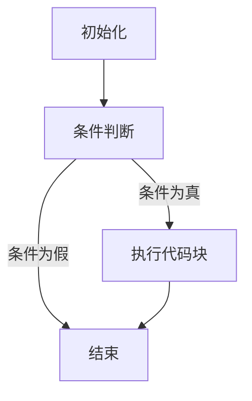
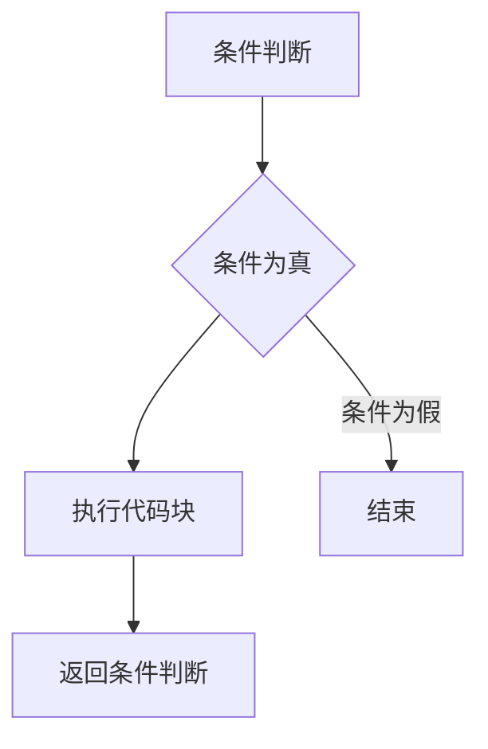
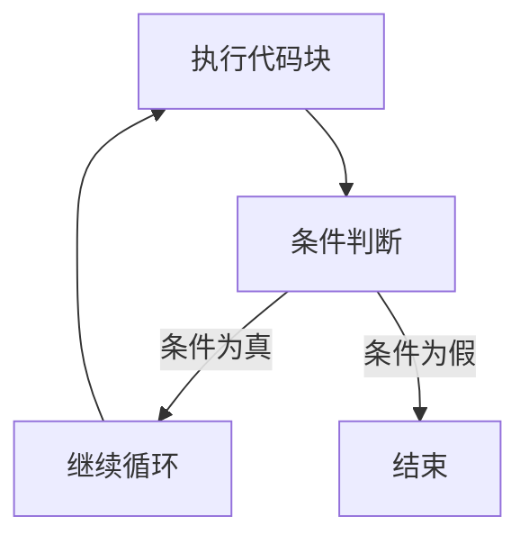

                 

### 第1章: 引言与背景

#### 1.1.1 书籍主题概述

《尼采的永恒轮回与循环结构：程序流程的哲学隐喻》这本书的主要目的是探讨尼采哲学中的永恒轮回概念与计算机程序设计中的循环结构之间的深刻联系。本书将哲学理论与技术实践相结合，通过分析尼采哲学的核心思想以及循环结构在程序设计中的应用，为读者提供一种全新的视角来理解两者的互动与交融。

在尼采的哲学体系中，永恒轮回是一种对时间与存在的深刻思考。它提出了一种可能的世界观，即所有事物都会不断重复，达到一个永恒的循环状态。这一思想在哲学、文学、艺术等领域产生了深远的影响。然而，尼采的永恒轮回概念在计算机科学和编程领域的研究却相对较少。

循环结构是程序设计中的一种基本概念，它允许程序重复执行特定的代码块，直到满足特定的条件为止。循环结构是许多算法和程序设计模式的基础，对于实现复杂逻辑和优化性能具有重要意义。尽管循环结构在程序设计中的应用非常广泛，但其哲学层面的探讨却相对较少。

本书将结合尼采的永恒轮回概念和循环结构在程序设计中的应用，通过一系列的逻辑推理和分析，揭示两者之间的内在联系。通过这种方式，本书不仅为读者提供了对尼采哲学的深入理解，也为其在程序设计中的应用提供了新的启示。

本书的结构安排如下：

- **第1章：引言与背景**：介绍书籍的主题、目的和结构。
- **第2章：尼采哲学与永恒轮回**：探讨尼采哲学的基本概念，特别是永恒轮回思想的提出、意义及其哲学影响。
- **第3章：循环结构的概念与形式**：详细解释循环结构的基本概念、形式及其在程序设计中的应用。
- **第4章：程序流程中的循环结构**：分析循环结构在程序设计中的具体应用，包括其基本语法、应用场景和优化策略。
- **第5章：哲学隐喻在编程中的应用**：探讨哲学隐喻的基本概念和其在编程中的应用价值。
- **第6章：尼采的永恒轮回与循环结构应用**：结合尼采的永恒轮回概念，探讨其在程序设计中的应用。
- **第7章：结论与展望**：总结本书的研究发现，并对未来的研究方向进行展望。

通过这样的结构安排，本书旨在为读者提供一个系统、全面的理解框架，帮助读者深入了解尼采哲学与程序设计之间的联系，并激发对这一交叉领域的进一步研究兴趣。

#### 1.1.2 尼采与永恒轮回

弗里德里希·尼采（Friedrich Nietzsche）是19世纪德国哲学家，他的思想对现代哲学、文学、艺术等多个领域产生了深远的影响。尼采的哲学体系独特而深刻，充满了对人类存在、价值、权力和知识的独特见解。他的许多著作，如《查拉图斯特拉如是说》、《善恶的彼岸》和《悲剧的诞生》等，都是哲学经典。

尼采的永恒轮回（Eternal Recurrence）是他哲学思想中的一个核心概念，也是他在时间观上的独特见解。永恒轮回的思想源于尼采对生命和存在的深刻反思。他提出了一个假设：如果一个人能够生活在无限的时间中，并且每一天都完全相同，那么这个人愿意重复这样的生活吗？尼采认为，如果人们真的愿意，那么时间就是可以重复的，存在就是一个永恒的循环。

这个概念不仅挑战了传统的线性时间观，也提出了对生活质量和生命意义的深刻思考。尼采认为，如果人们愿意重复自己的生活，那么这意味着他们已经找到了对生活的深刻理解，并能够在这种重复中发现生命的价值和意义。

尼采的永恒轮回思想在哲学上具有重要意义。首先，它挑战了传统的绝对时间观念，提出了一种相对主义的时间观。其次，它强调了生命的主动性和自我超越的重要性。尼采认为，只有那些勇于面对生命重复的人，才能够真正掌握自己的命运，实现自我超越。

在尼采的哲学体系中，永恒轮回不仅是一个概念，更是一种生活态度和哲学信仰。它要求人们超越对痛苦和苦难的恐惧，勇敢地面对生命的重复和永恒。尼采认为，只有通过这种方式，人们才能够达到哲学上的自由和幸福。

总之，尼采的永恒轮回概念不仅是一种哲学思想，更是一种对人类存在和生命的深刻洞察。它提出了对生命意义和价值的全新思考，对后来的哲学家、文学家和艺术家产生了深远的影响。

#### 1.1.3 循环结构的概念与形式

在计算机科学和编程领域，循环结构是一种核心概念，它允许程序在满足特定条件时重复执行一段代码。循环结构在许多算法和程序设计中扮演着至关重要的角色，是解决重复性问题和实现复杂逻辑的关键工具。

循环结构的基本形式包括三种：顺序循环（如`for`循环）、选择循环（如`while`循环）和当循环（如`do-while`循环）。每种循环结构都有其独特的语法和应用场景。

1. **顺序循环（for循环）**：
   顺序循环是最常用的循环结构之一，它允许程序员指定循环的起始值、终止条件和步长。其基本语法如下：
   ```mermaid
   flowchart TD
       A[初始化] --> B[条件判断]
       B -->|条件为真| C[执行代码块]
       B -->|条件为假| D[结束]
       C --> D
   ```
   伪代码示例：
   ```python
   for i = 1 to 10 do
       print(i)
   end for
   ```
   顺序循环通常用于循环迭代一定次数的情况，如遍历数组或计算斐波那契数列。

2. **选择循环（while循环）**：
   选择循环通过条件判断来决定是否继续执行循环体。其基本语法如下：
   ```mermaid
   flowchart TD
       A[条件判断] --> B{条件为真}
       B --> C[执行代码块]
       C --> D[返回条件判断]
       B -->|条件为假| E[结束]
   ```
   伪代码示例：
   ```python
   i = 1
   while i <= 10 do
       print(i)
       i = i + 1
   end while
   ```
   选择循环适用于不确定循环执行次数的情况，如用户输入验证或文件遍历。

3. **当循环（do-while循环）**：
   当循环是选择循环的一种变体，它首先执行代码块，然后判断条件是否满足，以确定是否继续循环。其基本语法如下：
   ```mermaid
   flowchart TD
       A[执行代码块] --> B[条件判断]
       B -->|条件为真| C[继续循环]
       B -->|条件为假| D[结束]
       C --> A
   ```
   伪代码示例：
   ```python
   i = 1
   do
       print(i)
       i = i + 1
   while i <= 10
   ```
   当循环确保代码块至少执行一次，适用于那些必须先执行一次循环体的情况。

循环结构的特点在于其灵活性。通过不同的条件和语句组合，循环结构可以实现各种复杂的逻辑操作。例如，嵌套循环用于解决多维问题，条件判断循环用于执行选择性操作，计数循环用于实现固定次数的迭代。

在程序设计中，循环结构的应用非常广泛。例如，在数据库操作中，循环结构用于遍历记录集；在算法设计中，循环结构用于实现递归和迭代；在用户界面编程中，循环结构用于动态生成元素。此外，通过合理地使用循环结构，程序员可以优化程序的执行效率和资源利用。

总之，循环结构是程序设计中的基础概念，它为程序员提供了强大的工具，以实现重复性操作、复杂逻辑和高效性能。理解和灵活应用循环结构，对于编写高效、可靠的程序至关重要。

#### 1.1.4 哲学隐喻在编程中的应用

哲学隐喻作为一种思考工具，通过将哲学概念应用于其他领域，帮助我们深入理解复杂的抽象概念。在编程领域，哲学隐喻为程序员提供了新的视角，以更直观地理解和解决技术问题。

哲学隐喻的基本概念在于通过比较和类比，将抽象的哲学思想转化为具体、形象的概念，从而促进对复杂问题的理解和解决。在编程中，这种隐喻可以将复杂的编程逻辑与哲学思想相对应，使得程序员能够更清晰地看到代码背后的哲学含义。

例如，在计算机科学中，状态机（State Machine）是一种常用的设计模式，用于描述系统在不同输入条件下的状态转换。我们可以将状态机视为一种哲学隐喻，它类似于尼采的永恒轮回概念，即系统在一个循环中不断变化，但始终处于特定的状态。通过这种隐喻，程序员可以更好地理解和设计复杂的状态转换逻辑。

另一个例子是面向对象编程中的封装（Encapsulation）和抽象（Abstraction）。封装通过将数据和操作封装在一个对象中，保护内部实现细节，使外部仅能通过接口进行交互。这与哲学中的本质主义（Essentialism）有相似之处，即强调事物的本质属性和本质联系，而非表面现象。通过将封装和抽象视为哲学隐喻，程序员可以更深入地理解面向对象编程的核心概念。

在编程实践中，哲学隐喻的应用具有显著的价值。首先，它有助于提高编程的可理解性。通过将复杂的编程逻辑与哲学概念相对应，程序员能够更直观地理解代码的结构和功能。其次，哲学隐喻可以促进创新思维。通过将哲学思想应用于编程问题，程序员可以探索新的解决方案，发现传统方法之外的创新途径。

然而，哲学隐喻在编程中的应用也面临一定的挑战。首先，哲学隐喻需要一定的哲学背景知识，这要求程序员具备跨学科的学习能力。其次，哲学隐喻的应用需要谨慎，避免将哲学思想简单化或误解。此外，不同哲学隐喻之间的转换和整合也需要程序员具备较高的抽象思维能力。

总之，哲学隐喻在编程中的应用为程序员提供了一种强大的思考工具，有助于提高编程效率和代码质量。通过将哲学思想与编程技术相结合，程序员可以更深入地理解技术问题，实现更高效、更创新的编程实践。

### 第2章: 尼采哲学与永恒轮回

#### 2.1 尼采哲学简介

弗里德里希·尼采（Friedrich Nietzsche）是19世纪德国哲学家，他的思想对现代哲学、文化和社会产生了深远的影响。尼采的哲学体系独具特色，强调个人主义、超越传统道德观念以及对生命和存在的深刻洞察。

尼采哲学的核心主题包括对个体价值的肯定、对权威和传统的批判、对权力意志的强调以及对艺术和文学的热爱。他的哲学主张常常被概括为“生命意志”（Will to Life）和“权力意志”（Will to Power），这两个概念贯穿了他的大部分作品。

生命意志是尼采哲学中的基础概念，强调生命的本能驱动力和不断追求成长与变化的意愿。尼采认为，生命意志是所有生命形式的内在动力，它推动个体超越自我，追求更高的境界和更广阔的世界。通过不断超越自我，个体可以实现自我完善和自我超越。

权力意志是尼采哲学中的另一个重要概念，它强调权力和统治在个体和社会中的重要性。尼采认为，权力意志是生命的本质特征，是推动个体和社会进步的根本动力。他主张个体应该追求权力，实现自我超越，从而打破旧有的社会秩序，创造一个全新的、更加自由和强大的世界。

尼采哲学对后来的哲学家、文化批评家和艺术家产生了深远的影响。他的思想启发了存在主义、后现代主义和激进政治理论等多个领域的发展。尼采对个人自由、独立思考和创造力的高度重视，也为现代社会的个人发展和文化创新提供了重要的启示。

#### 2.1.1 尼采的生平与思想

弗里德里希·尼采（Friedrich Nietzsche）于1844年10月15日出生于普鲁士王国的洛卡诺（现在的俄罗斯境内），他在一个充满文化氛围的家庭中成长。尼采的父母都是知识分子，他的父亲是一位牧师，母亲则是一位音乐爱好者。尼采从小展现出非凡的才华，对文学、哲学和音乐有浓厚的兴趣。

尼采在学术上的成就开始于1864年，他进入波恩大学学习神学和古典哲学。然而，他对神学的兴趣并不浓厚，逐渐将注意力转向哲学。1865年，他转学到莱比锡大学，继续哲学研究。在莱比锡大学，尼采与哲学家洛采（Rudolf Lotze）和德鲁蒙德（Ulrich Lida）等学者有所交往，这对他后来的哲学思想产生了重要影响。

1866年，尼采获得哲学博士学位，随后在瑞士的巴塞尔大学任教。他的学术生涯并不顺利，曾多次因病休学。然而，这段时间是他哲学思想形成的重要时期，他开始撰写《论道德的谱系》（On the Genealogy of Morality），这本书成为他最重要的著作之一。

尼采的思想经历了几个阶段的变化。早期，他的思想受到叔本华的影响，关注生命的悲剧性和苦难。然而，随着时间的推移，他逐渐发展出自己独特的哲学体系，强调个体、自由和创造力。他的中期作品，如《人性的，太人性的》（Human, All Too Human）和《曙光》（The Dawn），体现了这种转变。

尼采晚期的思想更加激进和复杂，他提出了“永恒轮回”（Eternal Recurrence）和“超人”（Overman）等概念。他认为，只有通过超越传统道德和社会规范，个体才能实现自我超越，达到生命的真正意义。这些思想在尼采的晚期作品，如《查拉图斯特拉如是说》（Also Sprach Zarathustra）和《尼采遗稿》（The Will to Power）中得到了充分体现。

尼采的生平充满了坎坷和悲剧。他多次患病，最终于1900年8月25日去世，享年56岁。他的作品在他生前并未得到广泛认可，但他在死后逐渐成为了哲学界的明星，对20世纪哲学和文化产生了深远的影响。

#### 2.1.2 尼采的主要著作

弗里德里希·尼采在生前共完成了数十部著作，其中一些作品成为了哲学经典。尼采的主要著作不仅反映了他的哲学思想，也展示了他在文学和艺术领域的独特见解。

1. **《论道德的谱系》（On the Genealogy of Morality）**
   这是尼采最著名的作品之一，出版于1887年。这本书对传统道德进行了深刻的批判，提出了尼采的道德谱系理论。尼采认为，道德观念并非普遍适用，而是历史和文化发展的产物，受到权力和社会结构的深刻影响。

2. **《人性的，太人性的》（Human, All Too Human）**
   出版于1878年，这是尼采中期作品中的代表作之一。该书探讨了人类存在的本质和意义，强调个体自由和自我超越的重要性。尼采在这本书中提出了一些重要的哲学思想，如生命意志和批判理性。

3. **《悲剧的诞生》（The Birth of Tragedy）**
   出版于1872年，这是尼采早期的代表作。这本书探讨了古希腊悲剧的艺术和精神内涵，提出了尼采的审美哲学。尼采认为，悲剧艺术是理解生命和存在的关键，能够激发人们的内在力量和创造力。

4. **《查拉图斯特拉如是说》（Also Sprach Zarathustra）**
   这是尼采的晚期作品，出版于1883年至1885年间。这部作品以诗意的语言和寓言的形式，阐述了尼采的哲学思想，特别是永恒轮回和超人概念。查拉图斯特拉被视为尼采的自我象征，他的教导成为尼采哲学的核心。

5. **《尼采遗稿》（The Will to Power）**
   尼采去世后，他的朋友和秘书瓦格纳（Franz Overbeck）和彼得·加斯特（Peter Gast）整理了他的遗稿，并出版了《尼采遗稿》。这部作品包含了尼采未完成的手稿和笔记，展示了他在哲学、文学和艺术领域的广泛思考和探索。

这些著作不仅展示了尼采的哲学思想，也反映了他在文学和艺术领域的独特才华。尼采的作品对后来的哲学家、文学家和艺术家产生了深远的影响，成为现代哲学和文化的重要组成部分。

#### 2.1.3 尼采哲学的核心概念

弗里德里希·尼采的哲学体系充满了独特而深刻的见解，其中几个核心概念对理解他的思想至关重要。这些核心概念包括“生命意志”、“权力意志”、“超人”和“永恒轮回”，每一个概念都反映了尼采对人类存在和价值的独特理解。

1. **生命意志（Will to Life）**：
   生命意志是尼采哲学的基础概念之一，强调生命自身的动力和内在需求。尼采认为，生命意志是一种本能的驱动力，推动生物体寻求生存、成长和繁衍。他强调生命的自我创造和不断进化，认为生命意志是一种积极的、不断追求变化和发展的力量。

   尼采在《论道德的谱系》中阐述了生命意志与道德的关系。他认为，传统道德观念压制了生命意志，导致人类失去对生活的热情和创造力。生命意志要求个体摆脱这些道德束缚，勇敢地追求自我实现和生命的丰富性。

2. **权力意志（Will to Power）**：
   权力意志是尼采哲学中的另一个核心概念，它强调权力和统治在个体和社会中的重要性。尼采认为，权力意志是生命意志的高级形式，是推动个体和社会进步的根本动力。权力意志不仅体现在政治和经济领域，还体现在个人行为和精神追求中。

   尼采认为，权力意志是实现个体超越和社会进步的关键。他主张个体应该追求权力，通过自我超越和挑战传统价值观，创造一个更加自由和强大的世界。在《查拉图斯特拉如是说》中，超人（Overman）被视为权力意志的最高体现，他是一个超越传统道德和常规的个体，能够引领人类走向新的境界。

3. **超人（Overman）**：
   超人是尼采提出的理想人物，是生命意志和权力意志的终极体现。尼采认为，超人是一个自我超越、超越传统道德和社会规范的个体，他具有创造力和领导力，能够引领人类社会进入一个新的时代。

   超人概念在尼采的哲学体系中具有核心地位，他不仅代表了个人自我超越的目标，也代表了社会变革的动力。尼采在《查拉图斯特拉如是说》中详细描述了超人的形象和特质，强调超人通过自我超越，实现人类存在的真正价值。

4. **永恒轮回（Eternal Recurrence）**：
   永恒轮回是尼采晚期哲学中的一个重要概念，它挑战了传统的线性时间观念，提出了一种可能的世界观，即所有事物都会在无限的时间中不断重复。尼采认为，如果人类能够接受永恒轮回，那么他们将能够在重复中发现生命的意义和价值。

   永恒轮回思想要求个体勇敢地面对生命的重复和永恒，超越对痛苦和苦难的恐惧。尼采认为，只有那些愿意在永恒的循环中不断创造和超越自我的人，才能达到哲学上的自由和幸福。永恒轮回不仅是一种哲学思考，也是对生命和存在的一种深刻洞察。

这些核心概念相互交织，构成了尼采哲学的独特体系。通过对这些概念的深入理解，我们可以更好地把握尼采的思想，认识到他在哲学、文化和社会领域的重要贡献。

#### 2.2 永恒轮回的哲学探讨

永恒轮回是弗里德里希·尼采哲学中一个重要的概念，它挑战了传统的线性时间观，提出了一种可能的世界观，即所有事物都会在无限的时间中不断重复。这一概念不仅在哲学领域产生了深远的影响，也在文学、艺术和其他学科中得到了广泛的探讨。

**2.2.1 永恒轮回的提出**

永恒轮回的思想最初出现在尼采的《查拉图斯特拉如是说》中，查拉图斯特拉是一位先知式的人物，他提出了永恒轮回的概念，并试图让世人接受这种想法。在尼采的叙述中，查拉图斯特拉向听众提出了一个挑战：如果生命能够在无限的时间中被重复，那么你是否愿意再次经历你所经历的一切？

这个概念在尼采的思想体系中具有重要的地位。它不仅是对时间本质的一种探讨，也是对生命意义的一种深刻反思。尼采认为，永恒轮回是一种对生命的深刻肯定，它要求个体勇敢地面对生命的重复，从中找到意义和价值。

**2.2.2 永恒轮回的意义**

永恒轮回的意义在于它挑战了传统的线性时间观。在传统的观念中，时间是一种单向的、不可逆的流动，从过去到未来，无法重复。而尼采的永恒轮回则提出了一个完全不同的观点，即时间是一个循环，所有事物都会在无限的时间里不断重复。

这种观点对哲学、文学和艺术产生了深远的影响。首先，它对生命的意义提出了新的思考。如果生命能够在无限的时间里重复，那么生命的每一个瞬间都变得至关重要，因为它们都会在未来再次出现。这种思考方式促使人们更加珍惜当下的生活，更加关注生命的每一个细节。

其次，永恒轮回对道德和价值观提出了挑战。如果所有事物都会在无限的时间里重复，那么传统道德观念和价值观是否仍然适用？尼采认为，传统的道德观念是由社会和文化环境塑造的，它们压制了生命意志，限制了个体的发展。而永恒轮回则要求个体超越这些传统观念，勇敢地追求自我实现和生命的丰富性。

**2.2.3 永恒轮回的哲学影响**

永恒轮回在哲学领域产生了深远的影响。它挑战了传统的线性时间观，提出了一种循环时间的观念，这对后来的哲学家如海德格尔、德里达等人产生了重要影响。海德格尔认为，尼采的永恒轮回思想揭示了时间的本质，即时间不是一个线性的流动，而是一个循环的过程。

此外，永恒轮回还对人类存在的本质提出了深刻的探讨。尼采认为，永恒轮回要求个体勇敢地面对生命的重复，从中找到生命的意义和价值。这种观点促使人们更加关注个体的存在，关注人类存在的本质和意义。

总之，永恒轮回是尼采哲学中的一个重要概念，它挑战了传统的线性时间观，提出了一种循环时间的观念。这种观念不仅在哲学领域产生了深远的影响，也在文学、艺术和其他学科中得到了广泛的探讨。通过探讨永恒轮回，尼采为我们提供了一种全新的视角，以更深刻地理解生命的意义和存在的本质。

#### 2.2.4 永恒轮回的哲学影响

永恒轮回概念在尼采的哲学体系中具有深远的意义，不仅在时间观念上提出了新的视角，也在生命意义和价值观上产生了广泛影响。首先，从时间观念的角度来看，永恒轮回挑战了传统的线性时间观，提出了一个循环时间的概念。尼采认为，时间不是单向流动的，而是可以循环重复的。这种观点颠覆了传统的对时间流逝的理解，迫使人们重新思考时间的本质和意义。它促使人们认识到每一个瞬间都是独特的，但同时又是可以被重复的，因此每一个经历都值得珍惜和体验。

在生命意义的探讨上，永恒轮回提供了一个深刻的哲学反思。尼采认为，如果生命是无限重复的，那么个体必须找到在其重复中发现价值和意义的方法。这种思想鼓励人们积极面对生命的重复，而不是简单地接受或拒绝它。尼采主张，通过自我超越和不断的创造力，个体可以在永恒轮回中找到生命的意义。这意味着，生命的价值不在于其独特性，而在于个体如何通过重复的经历不断成长和改变。

在价值观上，永恒轮回对传统的道德观念提出了挑战。尼采认为，传统道德观念是由社会和文化环境塑造的，它们限制了个体的发展和自由。而永恒轮回要求个体超越这些限制，追求真正的自我实现。尼采主张，个体应该追求权力意志，通过自我超越和创造新的价值观，打破旧有的束缚，实现生命的自由和丰富性。

总之，永恒轮回在尼采哲学中具有深远的影响，它不仅改变了人们对时间的理解，也影响了生命的意义和价值观。通过永恒轮回的概念，尼采为我们提供了一种全新的视角，以更深刻地理解生命的本质和存在的意义。

### 第3章: 循环结构的概念与形式

#### 3.1 循环结构的基本概念

循环结构（Loop Structure）是编程语言中的一种基本控制结构，它允许程序重复执行特定的代码块，直到满足某个条件为止。循环结构是许多算法和程序设计模式的基础，对于实现复杂逻辑和优化性能具有重要意义。在编程中，循环结构是实现重复性任务和自动化流程的关键工具。

循环结构的基本概念包括循环条件（Loop Condition）和循环体（Loop Body）。循环条件是一个布尔表达式，用于判断是否继续执行循环体。如果循环条件为真，则执行循环体；如果循环条件为假，则退出循环。循环体是包含在循环条件中的代码块，它定义了每次循环迭代需要执行的任务。

循环结构可以用来解决许多实际问题。例如，遍历数组或列表中的每个元素，计算斐波那契数列，或执行重复的任务，如发送电子邮件或处理文件。循环结构的核心在于其重复性，这使得它成为编程中不可或缺的工具。

循环结构的分类主要包括顺序循环（如`for`循环）、选择循环（如`while`循环）和当循环（如`do-while`循环）。每种循环结构都有其独特的语法和应用场景，将在接下来的部分详细探讨。

#### 3.1.1 循环结构的定义

循环结构是一种控制结构，它允许程序在满足特定条件时重复执行一段代码。循环结构的核心在于其重复性，这使得它们在编程中用于实现各种重复性任务。循环结构通常包含两个主要部分：循环条件和循环体。

循环条件是一个布尔表达式，用于判断是否继续执行循环体。如果循环条件为真，则执行循环体；如果循环条件为假，则退出循环。循环体是包含在循环条件中的代码块，它定义了每次循环迭代需要执行的任务。

循环结构的定义通常如下：

- **顺序循环**：使用`for`语句定义，通过初始化、条件判断和迭代操作来重复执行代码块。
- **选择循环**：使用`while`语句定义，通过条件判断来决定是否继续执行循环体。
- **当循环**：使用`do-while`语句定义，首先执行代码块，然后判断条件是否满足，以确定是否继续循环。

通过这些定义，循环结构为程序员提供了强大的工具，以实现各种复杂的逻辑操作和优化性能。

#### 3.1.2 循环结构的分类

在编程中，循环结构有多种类型，每种类型都有其独特的语法和应用场景。以下是三种主要的循环结构类型：

1. **顺序循环（for循环）**：
   顺序循环是最常用的循环结构之一，它通过初始化、条件判断和迭代操作来重复执行代码块。其基本语法如下：
   ```mermaid
   flowchart TD
       A[初始化] --> B[条件判断]
       B -->|条件为真| C[执行代码块]
       B -->|条件为假| D[结束]
       C --> D
   ```
   伪代码示例：
   ```python
   for i = 1 to 10 do
       print(i)
   end for
   ```
   顺序循环通常用于循环迭代一定次数的情况，如遍历数组或计算斐波那契数列。

2. **选择循环（while循环）**：
   选择循环通过条件判断来决定是否继续执行循环体。其基本语法如下：
   ```mermaid
   flowchart TD
       A[条件判断] --> B{条件为真}
       B --> C[执行代码块]
       C --> D[返回条件判断]
       B -->|条件为假| E[结束]
   ```
   伪代码示例：
   ```python
   i = 1
   while i <= 10 do
       print(i)
       i = i + 1
   end while
   ```
   选择循环适用于不确定循环执行次数的情况，如用户输入验证或文件遍历。

3. **当循环（do-while循环）**：
   当循环是选择循环的一种变体，它首先执行代码块，然后判断条件是否满足，以确定是否继续循环。其基本语法如下：
   ```mermaid
   flowchart TD
       A[执行代码块] --> B[条件判断]
       B -->|条件为真| C[继续循环]
       B -->|条件为假| D[结束]
       C --> A
   ```
   伪代码示例：
   ```python
   i = 1
   do
       print(i)
       i = i + 1
   while i <= 10
   ```
   当循环确保代码块至少执行一次，适用于那些必须先执行一次循环体的情况。

这些循环结构各有其特点和适用场景。通过合理选择和使用循环结构，程序员可以有效地实现各种编程任务，提高程序的执行效率和可靠性。

#### 3.1.3 循环结构的特点

循环结构在编程中具有许多独特的特点，这些特点使其成为实现重复性任务和复杂逻辑的关键工具。以下是循环结构的几个主要特点：

1. **重复性**：
   循环结构的最大特点是其重复性。它允许程序在满足特定条件时反复执行一段代码块。这种重复性使得循环结构非常适合用于处理需要多次迭代的问题，如遍历数组、计算斐波那契数列或执行重复的任务。

2. **灵活性**：
   循环结构具有很高的灵活性，可以通过不同的语法和应用场景实现多种类型的循环操作。例如，顺序循环（`for`循环）适用于预定义的循环次数，而选择循环（`while`循环）则适用于条件驱动的循环。当循环（`do-while`循环）则确保循环体至少执行一次，适用于需要先执行一次操作再判断条件的情况。

3. **条件控制**：
   循环结构通过条件控制来决定是否继续执行循环体。这种条件控制使得程序员可以根据不同的条件灵活地调整循环的执行次数和逻辑。例如，使用布尔表达式作为循环条件，可以在满足特定条件时继续循环，而在条件不满足时退出循环。

4. **嵌套使用**：
   循环结构可以嵌套使用，即在一个循环体内定义另一个循环结构。这种嵌套使用可以处理更加复杂的逻辑，例如二维数组遍历或多层循环迭代。嵌套循环的使用使得程序能够处理多维数据结构和复杂的问题。

5. **性能优化**：
   通过合理地使用循环结构，程序员可以优化程序的执行效率和性能。例如，使用选择循环而不是顺序循环可以减少初始化和条件判断的开销，从而提高程序的运行速度。此外，通过优化循环体内的代码，如减少不必要的计算和内存分配，可以进一步提高程序的效率。

总之，循环结构的特点使其在编程中具有广泛的应用。通过灵活地使用循环结构，程序员可以有效地实现各种复杂的逻辑和任务，提高程序的执行效率和可靠性。

#### 3.2 循环结构的形式分析

循环结构在程序设计中的表现形式多样，它们通过不同的语法和逻辑实现重复执行特定代码块的功能。以下是三种主要的循环结构形式：顺序循环（`for`循环）、选择循环（`while`循环）和当循环（`do-while`循环），我们将逐一进行分析。

##### 3.2.1 顺序循环（`for`循环）

顺序循环（`for`循环）是最常见的循环结构之一，它通过初始化、条件判断和迭代操作来重复执行代码块。顺序循环的语法形式如下：



伪代码示例：

```python
for i = 1 to 10 do
    print(i)
end for
```

在这个示例中，`i`是一个计数变量，它从1迭代到10。每次迭代中，都会执行`print(i)`操作，然后变量`i`增加1。当`i`大于10时，循环终止。

**特点**：
- **预定义迭代次数**：顺序循环在循环开始时就定义了迭代的次数，这使得它非常适合用于循环次数已知的情况。
- **简洁性**：顺序循环的语法相对简洁，易于理解和实现。
- **灵活性**：虽然顺序循环主要用于迭代操作，但它也可以用于其他类型的循环任务。

##### 3.2.2 选择循环（`while`循环）

选择循环（`while`循环）通过条件判断来决定是否继续执行循环体。其语法形式如下：



伪代码示例：

```python
i = 1
while i <= 10 do
    print(i)
    i = i + 1
end while
```

在这个示例中，变量`i`的初始值为1。每次循环开始时，都会检查`i`是否小于等于10。如果条件为真，则执行循环体，其中包括`print(i)`和`i = i + 1`操作。当条件为假时，循环终止。

**特点**：
- **条件驱动**：选择循环的执行次数取决于循环条件的真假，这使得它非常适合用于不确定循环次数的情况。
- **通用性**：选择循环可以用于实现各种类型的循环任务，包括遍历数组、处理用户输入等。
- **灵活性**：选择循环的语法相对灵活，可以通过各种条件表达式实现复杂的循环逻辑。

##### 3.2.3 当循环（`do-while`循环）

当循环（`do-while`循环）是一种选择循环的变体，它首先执行代码块，然后判断条件是否满足，以确定是否继续循环。其语法形式如下：



伪代码示例：

```python
i = 1
do
    print(i)
    i = i + 1
while i <= 10
```

在这个示例中，循环体首先执行一次，然后检查条件`i <= 10`。如果条件为真，则继续循环；如果条件为假，则退出循环。

**特点**：
- **确保至少执行一次**：当循环首先执行代码块，然后判断条件，这意味着循环体至少执行一次，非常适合用于那些必须先执行一次操作的情况。
- **简单性**：当循环的语法相对简单，易于理解和实现。
- **适用性**：当循环在特定情况下非常有用，例如需要先执行一次操作再进行条件判断时。

通过分析这些循环结构的形式，我们可以看到每种循环结构都有其独特的特点和适用场景。选择合适的循环结构，可以有效地实现各种编程任务，提高程序的效率和可靠性。

#### 3.2.4 顺序循环（`for`循环）

顺序循环（`for`循环）是编程中最常用的循环结构之一，它通过初始化、条件判断和迭代操作来重复执行代码块。在`for`循环中，初始化部分用于设置循环变量的初始值，条件判断部分用于判断循环是否继续，迭代操作部分用于更新循环变量。

**基本语法**：


**伪代码示例**：
```python
for i = 1 to 10 do
    print(i)
end for
```

在这个示例中，`i`是从1到10的循环变量。每次迭代中，都会执行`print(i)`操作，然后变量`i`增加1。当`i`大于10时，循环终止。

**特点**：
- **预定义迭代次数**：`for`循环在开始时就定义了迭代的次数，这使得它非常适合用于循环次数已知的情况。
- **简洁性**：`for`循环的语法相对简洁，易于理解和实现。
- **灵活性**：虽然`for`循环主要用于迭代操作，但它也可以用于其他类型的循环任务。

**应用场景**：
- **遍历数组**：`for`循环常用于遍历数组或列表中的每个元素，进行操作或计算。
- **固定次数的迭代**：在需要重复执行固定次数的操作时，如计算斐波那契数列，`for`循环是一个很好的选择。
- **初始化和迭代**：`for`循环可以用于初始化循环变量并控制迭代过程，非常适合用于复杂的循环逻辑。

**实例**：
假设我们要遍历一个数组并计算每个元素的和，可以使用`for`循环实现：
```python
numbers = [1, 2, 3, 4, 5]
sum = 0

for number in numbers do
    sum = sum + number
end for

print("总和为：" + sum)
```
在这个实例中，我们遍历数组`numbers`中的每个元素，并将其累加到变量`sum`中。最后，输出总和。

通过以上分析，我们可以看到`for`循环在编程中的重要性。它不仅简单易用，而且适用于各种重复性任务，是程序员必备的技能之一。

#### 3.2.5 选择循环（`while`循环）

选择循环（`while`循环）是编程中用于实现条件驱动的循环结构。其核心在于通过条件判断来决定是否继续执行循环体。`while`循环的语法相对简单，但功能强大，可以用于实现复杂的逻辑。

**基本语法**：


**伪代码示例**：
```python
i = 1
while i <= 10 do
    print(i)
    i = i + 1
end while
```

在这个示例中，变量`i`的初始值为1。每次循环开始时，都会检查`i`是否小于等于10。如果条件为真，则执行循环体，其中包括`print(i)`和`i = i + 1`操作。当条件为假时，循环终止。

**特点**：
- **条件驱动**：`while`循环的执行次数取决于循环条件的真假，这使得它非常适合用于不确定循环次数的情况。
- **通用性**：`while`循环可以用于实现各种类型的循环任务，包括遍历数组、处理用户输入等。
- **灵活性**：`while`循环的语法相对灵活，可以通过各种条件表达式实现复杂的循环逻辑。

**应用场景**：
- **遍历数组**：`while`循环常用于遍历数组或列表中的每个元素，进行操作或计算。
- **不确定次数的迭代**：在需要根据条件动态调整循环次数的情况下，如用户输入验证或文件处理，`while`循环是一个很好的选择。
- **动态控制**：通过在循环体内添加条件判断和逻辑操作，可以实现对循环过程的动态控制，例如提前终止循环或跳过某些迭代。

**实例**：
假设我们要实现一个用户输入验证的程序，只有当用户输入数字1到10之间时，程序才会继续执行。可以使用`while`循环实现：
```python
i = input("请输入一个数字（1-10）：")
while i >= '1' and i <= '10' do
    print("输入正确：" + i)
    i = input("请输入一个数字（1-10）：")
end while
```
在这个实例中，程序会一直提示用户输入数字，直到用户输入的数字在1到10之间。

通过以上分析，我们可以看到`while`循环在编程中的重要性。它不仅简单易用，而且功能强大，适用于各种条件驱动的循环任务，是程序员必备的技能之一。

#### 3.2.6 当循环（`do-while`循环）

当循环（`do-while`循环）是`while`循环的一种变体，它首先执行代码块，然后判断条件是否满足，以确定是否继续循环。与`while`循环不同的是，`do-while`循环确保代码块至少执行一次，这使得它非常适合用于那些必须先执行一次操作再判断条件的情况。

**基本语法**：


**伪代码示例**：
```python
i = 1
do
    print(i)
    i = i + 1
while i <= 10
```

在这个示例中，循环体首先执行一次，然后检查条件`i <= 10`。如果条件为真，则继续循环；如果条件为假，则退出循环。因此，无论条件是否满足，循环体至少会执行一次。

**特点**：
- **确保至少执行一次**：`do-while`循环首先执行代码块，然后判断条件，这意味着循环体至少执行一次。
- **简单性**：`do-while`循环的语法相对简单，易于理解和实现。
- **适用性**：`do-while`循环在需要先执行一次操作再进行条件判断的情况下非常有用。

**应用场景**：
- **首次执行操作**：在需要先执行一次操作再判断条件是否继续的情况下，如用户输入验证或文件处理，`do-while`循环是一个很好的选择。
- **初始状态检查**：在程序开始时，需要先进行一些初始化操作，然后根据初始化结果判断是否继续循环时，`do-while`循环可以简化逻辑。

**实例**：
假设我们要实现一个用户输入验证的程序，至少要求用户输入一个数字，然后根据输入的数字进行操作。可以使用`do-while`循环实现：
```python
i = input("请输入一个数字（1-10）：")
do
    print("输入正确：" + i)
    i = input("请输入一个数字（1-10）：")
while i >= '1' and i <= '10'
```
在这个实例中，程序会首先提示用户输入一个数字，无论用户输入的是否在1到10之间，程序都会执行一次打印操作，并继续提示用户输入。

通过以上分析，我们可以看到`do-while`循环在编程中的重要性。它不仅简单易用，而且在特定情况下能够简化逻辑，提高代码的可读性。了解并掌握`do-while`循环，可以使程序员在编程中更加得心应手。

### 第4章: 程序流程中的循环结构

#### 4.1 程序流程的概述

程序流程（Program Flow）是指程序在执行过程中从开始到结束的顺序和路径。它决定了程序在运行时的执行顺序、条件和分支，是程序设计中的核心概念之一。理解程序流程对于编写高效、可靠的程序至关重要。

程序流程的基本概念包括以下几个部分：

1. **顺序结构（Sequential Structure）**：
   顺序结构是程序流程中最简单的一种形式，它按照编写的顺序执行代码。每个代码块依次执行，直到程序结束。这种结构通常用于实现简单的逻辑和任务，如输入输出操作、初始化变量和基础计算。

2. **分支结构（Branch Structure）**：
   分支结构允许程序在执行过程中根据不同的条件选择不同的路径。最常用的分支结构是条件语句（Conditional Statements），如`if-else`语句。通过条件判断，程序可以执行不同的代码块，从而实现复杂逻辑和决策。

3. **循环结构（Loop Structure）**：
   循环结构允许程序重复执行特定的代码块，直到满足某个条件为止。循环结构是程序设计中实现重复任务和优化性能的关键工具。常见的循环结构包括`for`循环、`while`循环和`do-while`循环。

4. **函数调用（Function Call）**：
   函数调用是程序流程中的另一个重要概念。函数是具有特定功能的代码块，可以通过函数名调用。函数调用可以简化代码，提高代码的可重用性和模块化程度。函数调用通常伴随着参数传递和返回值。

理解程序流程对于程序员来说至关重要。它不仅可以帮助程序员更好地理解和设计程序，还能提高代码的可读性和可维护性。通过合理的程序流程设计，程序员可以编写出高效、可靠且易于维护的程序。

#### 4.2 循环结构在程序中的应用

循环结构是程序设计中的基础概念，广泛应用于各种编程任务中，是实现重复性操作和优化性能的关键工具。在程序中，循环结构可以通过不同的语法形式实现，如`for`循环、`while`循环和`do-while`循环。以下是这些循环结构在程序中的具体应用。

##### 4.2.1 循环结构的基本语法

1. **`for`循环**：
   `for`循环是最常见的循环结构之一，它通过初始化、条件判断和迭代操作来重复执行代码块。其基本语法如下：
   ```mermaid
   flowchart TD
       A[初始化] --> B[条件判断]
       B -->|条件为真| C[执行代码块]
       B -->|条件为假| D[结束]
       C --> D
   ```
   伪代码示例：
   ```python
   for i = 1 to 10 do
       print(i)
   end for
   ```

2. **`while`循环**：
   `while`循环通过条件判断来决定是否继续执行循环体。其基本语法如下：
   ```mermaid
   flowchart TD
       A[条件判断] --> B{条件为真}
       B --> C[执行代码块]
       C --> D[返回条件判断]
       B -->|条件为假| E[结束]
   ```
   伪代码示例：
   ```python
   i = 1
   while i <= 10 do
       print(i)
       i = i + 1
   end while
   ```

3. **`do-while`循环**：
   `do-while`循环是一种选择循环的变体，它首先执行代码块，然后判断条件是否满足，以确定是否继续循环。其基本语法如下：
   ```mermaid
   flowchart TD
       A[执行代码块] --> B[条件判断]
       B -->|条件为真| C[继续循环]
       B -->|条件为假| D[结束]
       C --> A
   ```
   伪代码示例：
   ```python
   i = 1
   do
       print(i)
       i = i + 1
   while i <= 10
   ```

##### 4.2.2 循环结构的应用场景

1. **遍历数组**：
   `for`循环和`while`循环常用于遍历数组或列表中的每个元素，进行操作或计算。例如，计算数组的和、查找特定元素或对每个元素进行排序。

   ```python
   numbers = [1, 2, 3, 4, 5]
   sum = 0

   for number in numbers do
       sum = sum + number
   end for

   print("总和为：" + sum)
   ```

2. **用户输入验证**：
   循环结构可以用于实现用户输入的验证，如确保用户输入的是有效数字或特定范围内的值。例如，以下代码要求用户输入一个1到10之间的数字，直到输入正确为止。

   ```python
   i = input("请输入一个数字（1-10）：")
   while i not in ['1', '2', '3', '4', '5', '6', '7', '8', '9', '10'] do
       print("输入无效，请重新输入：")
       i = input("请输入一个数字（1-10）：")
   end while
   ```

3. **文件处理**：
   循环结构可以用于读取和操作文件中的数据。例如，以下代码使用`while`循环遍历一个文本文件中的每行，并将每行内容打印出来。

   ```python
   file = open("example.txt", "r")
   line = file.readline()

   while line != "" do
       print(line.strip())
       line = file.readline()
   end while

   file.close()
   ```

4. **复杂逻辑和优化**：
   循环结构可以用于实现复杂的逻辑和优化算法。例如，以下代码使用`for`循环和`if-else`语句实现一个简单的查找算法，用于在数组中查找特定元素。

   ```python
   numbers = [1, 2, 3, 4, 5]
   target = 3

   for number in numbers do
       if number == target then
           print("找到目标元素：" + target)
           break
       end if
   end for
   ```

通过这些应用示例，我们可以看到循环结构在程序设计中的多样性和重要性。掌握不同类型的循环结构及其应用场景，对于编写高效、可靠的程序至关重要。

#### 4.2.3 循环结构的优化策略

循环结构在程序设计中是不可或缺的，但如果不加优化，可能会对程序的执行效率和性能产生负面影响。以下是一些常用的循环优化策略，帮助程序员编写高效、优化的程序。

1. **减少循环迭代次数**：
   减少循环迭代次数是优化循环结构的首要策略。通过提前终止循环或优化循环条件，可以减少不必要的迭代。例如，使用`break`语句在找到符合条件的元素时立即退出循环，可以避免不必要的计算。

   ```python
   numbers = [1, 2, 3, 4, 5]
   target = 3

   for number in numbers do
       if number == target then
           print("找到目标元素：" + target)
           break
       end if
   end for
   ```

2. **避免嵌套循环**：
   嵌套循环会显著增加程序的复杂性和执行时间。在可能的情况下，应尽量减少嵌套循环的使用。可以通过优化算法或使用其他数据结构（如哈希表）来替代嵌套循环。

   ```python
   # 嵌套循环示例
   for i in range(len(numbers)):
       for j in range(len(numbers)):
           if numbers[i] == numbers[j] then
               print("找到重复元素：" + numbers[i])
           end if
   ```

   优化后的代码可以使用哈希表来减少嵌套循环：
   ```python
   numbers = [1, 2, 3, 4, 5]
   seen = set()

   for number in numbers:
       if number in seen:
           print("找到重复元素：" + number)
       else:
           seen.add(number)
   ```

3. **减少函数调用**：
   函数调用会引入额外的开销，包括参数传递、函数调用和返回。通过减少函数调用，可以优化程序的执行效率。例如，在循环体内直接进行操作，而不是调用多个函数。

   ```python
   # 调用函数示例
   for i in range(len(numbers)):
       is_even = is_even(numbers[i])
       if is_even then
           print("偶数：" + numbers[i])
       end if
   ```

   优化后的代码可以直接在循环体内进行判断：
   ```python
   for i in range(len(numbers)):
       if numbers[i] % 2 == 0:
           print("偶数：" + numbers[i])
   ```

4. **利用并行计算**：
   在某些情况下，可以通过并行计算来提高程序的执行效率。利用多线程或多进程，可以将循环任务分解为多个并行任务，从而减少总执行时间。

   ```python
   # 并行计算示例
   from multiprocessing import Pool

   numbers = [1, 2, 3, 4, 5]
   with Pool(processes=4) as pool:
       results = pool.map(is_even, numbers)

   for result in results:
       if result:
           print("偶数：")
   ```

5. **使用缓存和记忆化**：
   对于重复的计算，可以使用缓存和记忆化来避免重复计算，从而提高程序的执行效率。例如，在计算斐波那契数列时，可以使用记忆化避免重复计算相同的子问题。

   ```python
   # 记忆化示例
   def fibonacci(n, memo={}):
       if n <= 1:
           return n
       if n not in memo:
           memo[n] = fibonacci(n - 1, memo) + fibonacci(n - 2, memo)
       return memo[n]

   print(fibonacci(10))
   ```

通过这些优化策略，程序员可以显著提高程序的执行效率和性能，使程序更加高效、可靠。

### 第5章: 哲学隐喻在编程中的应用

#### 5.1 哲学隐喻的基本概念

哲学隐喻（Philosophical Metaphor）是指通过将哲学概念应用于其他领域，从而帮助人们理解和解决复杂问题的思考工具。隐喻是一种比喻，它通过将一个领域的概念映射到另一个领域，使得原本难以理解的问题变得更加直观和易于处理。哲学隐喻在多个学科中都有广泛应用，包括哲学、文学、艺术和科学。

在哲学隐喻中，隐喻的运用不仅是对概念的描述，更是对问题的一种重新定义和解释。例如，将生命的循环过程比喻为时间的河流，或者将人类的认知过程比喻为探索迷宫。这种隐喻方法使得复杂的哲学思想变得具体和形象，从而更容易被大众理解和接受。

哲学隐喻的特点包括：

1. **抽象性**：哲学隐喻通过抽象的概念来解释复杂的问题，使得问题变得更加清晰和简洁。
2. **比较性**：哲学隐喻通过比较不同领域中的概念，帮助人们发现新的联系和见解。
3. **创造性**：哲学隐喻鼓励创新思维，通过将不同领域的概念融合，产生新的视角和解决方案。

在编程领域，哲学隐喻为程序员提供了一种强大的工具，帮助他们在设计和实现复杂系统时，更好地理解和处理问题。通过将哲学思想与编程技术相结合，程序员可以更深入地理解技术问题，实现更高效、更创新的编程实践。

#### 5.1.2 哲学隐喻的特点

哲学隐喻作为一种思考工具，具有独特的特点，使其在哲学和编程等领域中具有广泛的应用价值。

1. **抽象性**：
   哲学隐喻通过将复杂的哲学概念抽象化，转化为更加具体和形象的概念，使得原本难以理解的思想变得容易接受。例如，将生命的循环过程比喻为时间的河流，将认知过程比喻为探索迷宫，这些抽象的比喻使得抽象的哲学思想变得更加直观和易于理解。

2. **比较性**：
   哲学隐喻通过比较不同领域中的概念，帮助人们发现新的联系和见解。例如，将程序设计中的状态机比喻为哲学中的因果关系，通过比较两者之间的相似性，程序员可以更好地理解状态机的概念和作用。这种比较性的特点使得哲学隐喻成为跨学科思考和问题解决的重要工具。

3. **创造性**：
   哲学隐喻鼓励创新思维，通过将不同领域的概念融合，产生新的视角和解决方案。例如，在编程中，将哲学中的“熵”概念应用于算法设计，通过理解熵的增加和系统的无序性，程序员可以设计出更有效的算法。这种创造性的特点使得哲学隐喻成为推动技术创新的重要动力。

4. **灵活性**：
   哲学隐喻具有高度的灵活性，可以根据不同的应用场景和需求，进行灵活的调整和变形。例如，将哲学中的“辩证法”应用于软件开发中的需求分析，通过不断调整和优化需求，最终实现更好的解决方案。这种灵活性的特点使得哲学隐喻在多种领域中都具有重要应用价值。

总之，哲学隐喻的特点使其成为理解和解决复杂问题的重要工具。通过将哲学思想与编程技术相结合，哲学隐喻为程序员提供了新的思考方式和解决问题的策略，提高了编程效率和代码质量。

#### 5.1.3 哲学隐喻的运用

哲学隐喻在编程中的应用具有深远的影响，它不仅改变了程序员对代码的理解方式，还提升了编程效率。通过哲学隐喻，程序员可以将抽象的哲学思想转化为具体的编程概念，从而更好地解决复杂的问题。

首先，哲学隐喻可以帮助程序员理解和设计复杂的系统。例如，将哲学中的“辩证法”应用于需求分析中，通过不断调整和优化需求，最终实现更好的解决方案。这种思考方式使得程序员能够更全面地考虑系统的各个方面，从而提高系统的质量和可靠性。

其次，哲学隐喻在优化算法和代码性能方面也具有重要作用。例如，将哲学中的“熵”概念应用于算法设计，通过理解熵的增加和系统的无序性，程序员可以设计出更高效的算法。例如，在排序算法中，通过减少算法的复杂度，降低时间消耗，从而提高程序的运行效率。

此外，哲学隐喻还可以帮助程序员处理代码的可维护性和可扩展性。例如，将哲学中的“形而上学”应用于模块化设计，通过明确模块的功能和接口，提高代码的可读性和可维护性。通过这种方式，程序员可以更容易地理解和修改代码，从而延长项目的生命周期。

具体案例方面，一个典型的例子是使用哲学中的“因果律”来设计状态机。在状态机中，每个状态之间的转换都对应一个特定的条件或事件。通过将因果律应用于状态机的构建，程序员可以更清晰地理解系统在不同输入条件下的行为，从而设计出更稳定和可靠的状态转换逻辑。

另一个例子是将哲学中的“整体论”应用于软件开发中的模块设计。整体论强调系统的整体性和相互依赖性。在软件设计中，通过将整体论应用于模块设计，程序员可以更全面地考虑各个模块之间的相互关系，从而实现更高效、更稳定的系统。

总之，哲学隐喻在编程中的应用不仅丰富了程序员对技术的理解，还提升了编程效率和代码质量。通过将哲学思想与编程技术相结合，程序员可以更有效地解决复杂的问题，推动技术创新和进步。

#### 5.2 哲学隐喻在编程中的实践

哲学隐喻在编程中的应用不仅具有理论上的吸引力，更在实践中展现了其独特的价值。通过具体的编程实例，我们可以更深入地理解哲学隐喻在代码实现、优化和问题解决中的作用。

**5.2.1 哲学隐喻在代码实现中的价值**

哲学隐喻在代码实现中的价值在于，它能够帮助程序员更直观地理解和处理复杂的概念和问题。例如，将哲学中的“辩证法”应用于算法设计中，可以帮助程序员更好地理解问题的本质和解决方法。

一个具体的案例是将“辩证法”应用于排序算法的优化。排序算法是计算机科学中的基础算法，传统的排序方法如冒泡排序、选择排序和插入排序，虽然简单易理解，但效率相对较低。通过将“辩证法”应用于排序算法的优化，我们可以设计出更高效的算法。

**实例：冒泡排序算法的优化**

传统的冒泡排序算法通过不断比较和交换相邻元素，逐步将数组中的元素排序。以下是一个简单的冒泡排序算法实现：

```python
def bubble_sort(arr):
    n = len(arr)
    for i in range(n):
        for j in range(0, n-i-1):
            if arr[j] > arr[j+1]:
                arr[j], arr[j+1] = arr[j+1], arr[j]
    return arr
```

**使用辩证法的优化**：

辩证法强调通过矛盾和冲突的解决推动事物的进步和发展。在排序算法中，我们可以通过引入“过早结束”的机制，来优化冒泡排序。当一次遍历中没有发生任何交换时，说明数组已经排序，此时可以提前结束排序过程。

优化后的冒泡排序算法如下：

```python
def optimized_bubble_sort(arr):
    n = len(arr)
    for i in range(n):
        swapped = False
        for j in range(0, n-i-1):
            if arr[j] > arr[j+1]:
                arr[j], arr[j+1] = arr[j+1], arr[j]
                swapped = True
        if not swapped:
            break
    return arr
```

通过引入“过早结束”的机制，优化后的冒泡排序算法在大多数情况下都能更快地完成排序任务。这种优化思路正是辩证法思想的应用，通过解决排序过程中的矛盾和冲突，提高了算法的效率。

**5.2.2 哲学隐喻在编程问题解决中的应用案例**

哲学隐喻在编程问题解决中的应用，不仅可以帮助我们更好地理解问题，还能提供新的解决思路。

**实例：哲学家就餐问题**

哲学家就餐问题是计算机科学中一个经典的同步问题，描述了五位哲学家围坐在一张圆桌上，每人面前有一碗面条，同时共用五根筷子。每位哲学家有两个状态：思考和吃饭。思考时，哲学家需要同时使用左右两根筷子；吃饭时，哲学家可以放下当前手中的筷子，拿起另外两根筷子。

哲学家就餐问题的挑战在于如何避免死锁（即所有哲学家同时等待另一根筷子而无法继续）。这个问题可以通过哲学隐喻“辩证法”来理解和解决。

**解决方案：引入哲学家编号**

首先，为每位哲学家编号（1到5），并规定哲学家必须按照固定的顺序尝试获取筷子。例如，哲学家1先尝试获取左边的筷子，然后尝试右边的筷子；哲学家2先尝试获取右边的筷子，然后尝试左边的筷子，以此类推。

通过这种方式，我们可以避免哲学家同时获取同一根筷子，从而避免死锁的发生。

```python
def philosopher(i, semaphores):
    while True:
        think()
        if semaphores[i] == 1 and semaphores[(i + 1) % 5] == 1:
            eat()
        else:
            print(f"Philosopher {i} cannot get both forks.")
```

**优化：引入时间限制**

进一步优化，可以引入时间限制，即每位哲学家尝试获取筷子的时间限制。如果超过时间限制仍无法获取筷子，哲学家将放弃尝试并重新开始思考。

这种优化策略通过引入“时间限制”和“重新开始”的机制，使得哲学家不会无休止地等待筷子，从而提高了系统的稳定性。

**5.2.3 哲学隐喻在编程中的挑战与解决**

尽管哲学隐喻在编程中具有显著的价值，但在实际应用中也面临一些挑战。

**挑战一：隐喻理解的深度**

哲学隐喻的有效应用需要程序员对哲学思想的深度理解。如果对隐喻的理解不够深刻，可能会导致隐喻应用的失败。

**解决方法**：加强哲学和编程知识的融合，通过学习和实践，提高程序员对哲学隐喻的理解和应用能力。

**挑战二：隐喻映射的灵活性**

哲学隐喻的应用往往需要将哲学概念灵活地映射到编程问题中。这种映射并非一成不变，需要根据具体问题进行调整。

**解决方法**：在应用哲学隐喻时，注重灵活性和适应性，根据具体问题的特点，动态调整隐喻的映射方式。

**挑战三：隐喻抽象的平衡**

哲学隐喻在抽象和具体之间寻找平衡。过于抽象可能导致隐喻难以应用，而过于具体又可能失去哲学隐喻的价值。

**解决方法**：在应用哲学隐喻时，寻求抽象和具体的平衡，确保隐喻既能指导具体问题的解决，又具有哲学思想的深度和广度。

通过这些实践案例，我们可以看到哲学隐喻在编程中的应用价值。它不仅为程序员提供了新的思考方式和解决问题的策略，还提升了编程效率和代码质量。理解并运用哲学隐喻，将有助于我们在编程实践中取得更好的成果。

### 第6章: 尼采的永恒轮回与循环结构应用

#### 6.1 永恒轮回与循环结构的联系

尼采的永恒轮回（Eternal Recurrence）概念与程序设计中的循环结构（Loop Structure）之间存在着深刻的联系，这种联系不仅体现了哲学与技术的交汇，还揭示了循环结构在实现永恒轮回思想中的潜在应用。

**6.1.1 尼采哲学与循环结构的共同点**

首先，永恒轮回和循环结构都强调重复性和循环性。在尼采的哲学中，永恒轮回是一种对时间的看法，即所有事件和经历在无限的时间里不断重复。同样，程序设计中的循环结构通过反复执行代码块来实现特定的任务。无论是尼采的永恒轮回还是编程中的循环结构，都依赖于重复性来构建逻辑和实现功能。

其次，两者都涉及到状态的变化和条件控制。在尼采的永恒轮回中，每一次轮回都是对之前经历的重演和超越，这种状态的变化和条件的满足（或不满足）决定了轮回的进行。在编程中的循环结构，状态的变化和条件判断（如`while`循环中的条件判断）决定了循环的继续或终止。因此，两者都涉及到对状态和条件的精细控制。

**6.1.2 尼采哲学对循环结构的影响**

尼采的永恒轮回概念对程序设计中的循环结构产生了重要影响。首先，它改变了程序员对循环结构的理解和应用方式。传统的循环结构通常被视为一种实现重复任务的工具，而尼采的永恒轮回则赋予了循环结构更深层次的哲学意义。通过将永恒轮回应用于编程，程序员可以更深入地理解循环结构的本质，并将其视为一种超越性和创造性的工具。

例如，在编写递归算法时，程序员可以借鉴永恒轮回的思想，将其视为一种无限重复但不断进化的过程。递归函数在每次调用时都会创建一个新的执行路径，这与尼采的永恒轮回概念中的每一次轮回都包含新的可能性有相似之处。通过这种方式，程序员可以在编程中实现更复杂的逻辑和更高效的任务执行。

其次，尼采的永恒轮回概念影响了对循环优化和性能调优的理解。在传统的编程实践中，优化循环结构主要关注减少不必要的迭代和提高执行效率。然而，在永恒轮回的视角下，优化不仅仅是关于效率，更是一种对循环结构和执行过程的整体性理解。通过理解永恒轮回，程序员可以更全面地考虑循环结构的执行过程，从而设计出更优化的解决方案。

**6.1.3 循环结构对尼采哲学的启示**

另一方面，程序设计中的循环结构也为尼采哲学提供了一种新的视角。通过分析循环结构的工作原理，我们可以更好地理解尼采哲学中的某些概念。

例如，程序设计中的状态机（State Machine）可以被视为对尼采的“永恒轮回”思想的现代诠释。状态机通过一系列的状态转换来描述系统的行为，每个状态转换都对应一个特定的输入或事件。这与尼采的永恒轮回概念中的循环状态和条件转变有相似之处。通过这种类比，我们可以更深入地理解尼采哲学中的状态变化和自我超越的概念。

此外，程序设计中的循环结构也为尼采的“权力意志”提供了新的解释。在程序中，循环结构不仅是一种实现重复任务的工具，更是一种对资源和控制权的争夺和利用。通过设计高效的循环结构，程序员可以优化程序的性能，从而实现对资源的更好控制和利用。这种思路与尼采对权力意志的理解有共鸣，即通过超越自我和不断追求，实现对权力和控制的追求。

总之，尼采的永恒轮回与程序设计中的循环结构之间存在深刻的联系。这种联系不仅揭示了哲学与技术的交汇点，还为程序员提供了一种新的视角来理解和应用循环结构。通过将尼采哲学与编程技术相结合，程序员可以创造出更加复杂和高效的解决方案，同时也能更深入地理解尼采哲学中的核心概念。

#### 6.2 尼采的永恒轮回与程序设计

尼采的永恒轮回概念在程序设计中有着丰富的应用，通过将其与程序设计相结合，程序员可以创造更加复杂和高效的解决方案。在程序设计中，循环结构是实现永恒轮回概念的核心工具，它允许程序在满足特定条件时重复执行一段代码，从而模拟出永恒轮回的过程。

**6.2.1 永恒轮回在程序设计中的体现**

永恒轮回在程序设计中的体现主要表现为递归和迭代两种形式。递归是一种函数调用自身的方式，通过不断调用自身，递归函数能够实现复杂的计算和问题解决。例如，在计算斐波那契数列时，可以使用递归函数来实现。

```python
def fibonacci(n):
    if n <= 1:
        return n
    else:
        return fibonacci(n-1) + fibonacci(n-2)
```

在这个例子中，`fibonacci`函数通过递归调用自身，实现了斐波那契数列的递推计算。这个过程可以被视为一种永恒轮回，每次递归调用都是对之前计算的重复和延续。

除了递归，迭代也是实现永恒轮回的常用方式。迭代通过循环结构，如`for`循环或`while`循环，重复执行特定的代码块，直到满足某个条件为止。例如，以下代码通过迭代方式计算斐波那契数列：

```python
def fibonacci(n):
    a, b = 0, 1
    for _ in range(n):
        a, b = b, a + b
    return a
```

在这个迭代实现中，循环结构重复执行更新变量`a`和`b`的操作，实现了斐波那契数列的计算。这个过程同样体现了永恒轮回的思想，每一次循环都是对之前计算结果的重复和扩展。

**6.2.2 永恒轮回在程序设计中的价值**

永恒轮回在程序设计中的价值主要体现在以下几个方面：

1. **解决复杂问题**：通过递归和迭代，程序员可以解决许多复杂的计算问题，如递推关系、图论问题等。这些方法允许程序在无限重复的过程中逐步解决问题，从而实现对复杂问题的简化。

2. **提高代码可读性**：递归和迭代方法通常具有简洁的代码结构，使得代码更加可读和易于理解。递归函数通过简洁的递归关系，将复杂的计算过程抽象成一系列简单的步骤，从而提高了代码的可读性。

3. **优化算法性能**：递归和迭代方法在某些情况下可以优化算法的性能。例如，通过优化递归函数的尾递归调用，可以将递归转化为迭代，从而减少函数调用的开销，提高程序的执行效率。

4. **实现动态逻辑**：永恒轮回概念允许程序员实现动态的逻辑和状态转换。在状态机设计中，状态之间的转换可以被视为一种永恒轮回，每次状态的改变都是对之前状态的延续和超越。

**6.2.3 永恒轮回在程序设计中的实践案例**

以下是一个具体的实践案例，展示了如何将永恒轮回概念应用于程序设计中：

**实例：模拟天气变化**

假设我们要模拟一段时间内的天气变化，可以通过迭代和递归方法来实现。以下是一个简单的迭代实现：

```python
def simulate_weather(days):
    weather = ["sunny"]
    for _ in range(days - 1):
        if weather[-1] == "sunny":
            weather.append("rainy")
        else:
            weather.append("sunny")
    return weather

days = 10
weather_sequence = simulate_weather(days)
print(weather_sequence)
```

在这个实现中，天气从晴天（"sunny"）开始，每过一天，根据当前天气情况更新为雨天（"rainy"）或晴天。这个过程可以被视为一种永恒轮回，天气的每一天都是对之前天气的重复和延续。

以下是一个递归实现的例子：

```python
def simulate_weather_recursive(day, weather):
    if day == 0:
        return []
    if weather[-1] == "sunny":
        next_weather = "rainy"
    else:
        next_weather = "sunny"
    return simulate_weather_recursive(day - 1, weather + [next_weather])

days = 10
weather_sequence = simulate_weather_recursive(days, ["sunny"])
print(weather_sequence)
```

在这个递归实现中，`simulate_weather_recursive`函数通过递归调用自身，每次递归都增加一天，并更新天气状态。这种递归过程模拟了天气在一段时间内的重复变化，体现了永恒轮回的概念。

通过这些实践案例，我们可以看到永恒轮回概念在程序设计中的应用，不仅丰富了编程方法，也提高了代码的可读性和可维护性。理解并运用永恒轮回，将有助于我们在编程实践中创造出更加复杂和高效的解决方案。

### 第7章: 结论与展望

#### 7.1 研究结论

本书通过对尼采的永恒轮回与程序设计中的循环结构之间的联系进行深入探讨，得出了一系列重要的结论。首先，尼采的永恒轮回概念与程序设计中的循环结构在重复性和状态转换方面具有显著的共同点。这种共同点不仅揭示了哲学与技术的交汇，还为程序员提供了一种新的视角来理解和应用循环结构。

其次，尼采的永恒轮回对程序设计中的循环结构产生了深远的影响。通过将永恒轮回应用于编程，程序员可以更深入地理解循环结构的本质，并将其视为一种超越性和创造性的工具。这种视角不仅丰富了编程方法，还提高了代码的可读性和可维护性。

此外，循环结构在程序设计中的应用也提供了对尼采哲学的新解释。例如，递归和迭代方法在处理复杂计算和状态转换方面，体现了永恒轮回的概念。通过这些方法，程序员可以在程序设计中实现动态逻辑和高效性能，从而更好地理解尼采哲学中的核心思想。

综上所述，本书的研究结论表明，尼采的永恒轮回与程序设计中的循环结构之间存在深刻的联系。这种联系不仅为程序员提供了新的思考和解决问题的策略，还推动了编程技术和哲学思想的相互融合。通过将哲学与编程相结合，我们可以创造出更加复杂和高效的解决方案，进一步拓展了编程和哲学的研究领域。

#### 7.2 展望

未来，尼采的永恒轮回与程序设计之间的交叉领域有着广阔的研究和应用前景。以下是一些潜在的研究方向和领域，值得进一步探索：

**1. 尼采哲学在编程教育中的应用**：

在编程教育中，将尼采的永恒轮回概念融入课程设计，可以帮助学生更好地理解循环结构和递归方法。通过将抽象的哲学思想与具体的编程实践相结合，学生可以更深入地理解编程概念，培养批判性思维和创造力。

**2. 循环结构在复杂程序设计中的应用**：

循环结构在处理复杂程序设计时具有重要作用。未来研究可以探索如何利用尼采的永恒轮回概念，优化复杂程序的设计和实现。例如，通过将永恒轮回应用于算法设计，可以开发出更加高效和稳定的算法。

**3. 哲学隐喻在软件开发中的未来发展**：

哲学隐喻作为一种跨学科的思考工具，在软件开发中具有广泛的应用潜力。未来研究可以探讨如何更有效地运用哲学隐喻，提升软件开发过程中的问题解决能力和创新能力。例如，通过将哲学隐喻应用于需求分析和软件设计，可以提高软件的质量和可维护性。

**4. 混合编程方法的研究**：

结合尼采的永恒轮回和现代编程技术，可以开发出新的混合编程方法。这种混合方法将哲学思想和编程技术相结合，有望在提高编程效率和代码质量方面取得突破性进展。例如，开发出基于永恒轮回概念的编程语言或框架，可以为程序员提供更直观和高效的编程工具。

**5. 哲学与计算机科学的深度融合**：

未来的研究可以探索哲学与计算机科学的深度融合，进一步拓展两者的交叉领域。通过跨学科的合作研究，可以开发出新的理论框架和工具，为解决复杂问题提供新的视角和方法。

总之，尼采的永恒轮回与程序设计之间的交叉领域具有巨大的研究价值和应用潜力。通过进一步的研究和实践，我们可以更好地理解两者的关系，开发出更加复杂和高效的编程解决方案，推动哲学与计算机科学共同发展。未来，这一领域将继续产生重要的研究成果，为学术界和工业界带来新的启示和创新。

