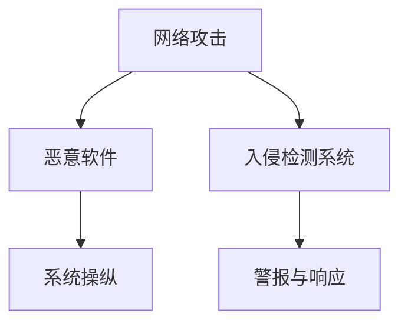

                 


为了撰写一篇符合要求的《工业控制系统安全：关键基础设施保护》的技术博客文章，我们需要按以下步骤进行：

### 1. 背景介绍

- **概述工业控制系统**：解释工业控制系统的定义、组成部分和作用，以及它们在现代工业中的重要性。
- **安全问题的引入**：讨论工业控制系统面临的威胁和攻击案例，如Stuxnet病毒攻击，以及这些威胁对关键基础设施的影响。

### 2. 核心概念与联系

- **核心概念**：定义工业控制系统安全的关键概念，如网络攻击、恶意软件、入侵检测系统等。
- **联系架构**：使用Mermaid流程图展示工业控制系统安全的核心概念之间的关系，如攻击流程、防护措施和检测机制。

### 3. 核心算法原理讲解

- **防护算法**：使用伪代码解释常用的工业控制系统安全防护算法，如防火墙规则、入侵检测算法等。
- **数学模型**：详细讲解支持这些算法的数学模型，包括如何使用这些模型来检测和防范攻击。

### 4. 数学公式和详细讲解

- **关键公式**：列出并解释关键数学公式，如加密算法中的加密和解密公式。
- **举例说明**：通过实际例子来说明公式的应用，如如何使用某个公式来检测异常行为。

### 5. 项目实战

- **开发环境搭建**：指导如何搭建一个用于演示工业控制系统安全的实验环境。
- **源代码实现**：提供源代码，并详细解读每行代码的功能。
- **代码应用解读**：分析代码在实际应用中的效果和可能存在的问题。
- **案例分析和讲解**：讨论实际发生的工业控制系统安全事件，剖析事件的原因和解决方案。
- **项目小结**：总结项目中的经验和教训，提出改进建议。

### 6. 最佳实践和注意事项

- **最佳实践**：总结在工业控制系统安全领域的最佳实践，如定期安全评估、员工培训等。
- **注意事项**：提醒读者在实施安全措施时需要注意的问题，如兼容性、成本效益等。

### 7. 文章摘要

- **摘要**：总结文章的主要内容和观点，强调工业控制系统安全的重要性和保护关键基础设施的必要性。

### 8. 作者信息

- **作者信息**：在文章末尾添加作者信息，包括作者单位、书名和作者简介。

接下来，我们将根据上述步骤，逐一构建文章的内容，确保满足8000-12000字的要求。我们将保持markdown格式，并在适当的地方插入Mermaid图表、LaTeX公式和代码示例。

----------------------------------------------------------------

根据上述步骤，下面是一个初步的《工业控制系统安全：关键基础设施保护》文章草稿。请注意，这只是一个框架，每个部分都需要进一步的详细扩展和内容填充。

---

# 《工业控制系统安全：关键基础设施保护》

> 关键词：工业控制系统安全、关键基础设施、网络攻击、防护措施、入侵检测

> 摘要：本文探讨了工业控制系统安全的现状和挑战，分析了关键基础设施面临的威胁，并提出了有效的防护策略和措施。文章通过实际案例和项目实战，展示了如何实现工业控制系统的安全保护。

---

## 引言

### 1. 工业控制系统的定义与作用

工业控制系统是一种用于自动化控制和监控工业过程的系统。它通常由硬件、软件、通信网络和操作人员组成，能够实现对生产过程的实时监控、控制和优化。工业控制系统在现代工业中扮演着至关重要的角色，它们不仅提高了生产效率，还保证了产品质量和生产安全。

### 2. 工业控制系统安全的必要性

随着工业控制系统与互联网的连接日益紧密，网络安全问题逐渐凸显。工业控制系统面临的网络攻击不仅可能导致设备损坏、生产中断，甚至可能威胁到公共安全和国家安全。因此，确保工业控制系统安全已成为工业界和学术界共同关注的焦点。

---

## 工业控制系统安全基础

### 2.1 核心概念与联系

在工业控制系统安全中，以下核心概念是不可或缺的：

- **网络攻击**：攻击者利用网络漏洞对工业控制系统进行非法入侵和操纵。
- **恶意软件**：包括病毒、木马、蠕虫等能够在工业控制系统中潜伏并执行恶意操作的软件。
- **入侵检测系统（IDS）**：用于实时监测网络流量和系统活动，发现并响应潜在的攻击。

以下是这些概念之间的Mermaid流程图表示：



---

### 2.2 核心算法原理讲解

为了保护工业控制系统，我们需要运用一系列核心算法：

- **防火墙**：通过设置规则控制网络流量，防止未经授权的访问。
- **入侵检测系统**：使用机器学习算法和统计方法检测异常行为。

以下是防火墙规则的伪代码示例：

```python
# 防火墙规则伪代码
def firewall_rule(checksum, source_ip, destination_ip, protocol):
    if (checksum == valid_checksum) and (source_ip == trusted_ip) and (destination_ip == production_ip) and (protocol == allowed_protocol):
        return "允许通过"
    else:
        return "拒绝访问"
```

---

### 2.3 数学模型和公式

为了有效防范网络攻击，我们还需要运用数学模型来分析攻击模式和检测异常。以下是一个简单的数学公式，用于检测网络流量的异常：

$$
\text{异常得分} = \frac{\sum_{i=1}^{n} (\text{实际流量} - \text{预期流量})^2}{n}
$$

其中，$n$ 是观测的流量样本数量。

---

## 项目实战

### 3.1 开发环境搭建

为了演示工业控制系统安全，我们需要搭建一个模拟环境。以下是在Linux系统上搭建环境的基本步骤：

1. 安装必要的软件和工具。
2. 配置网络环境，模拟工业控制系统的通信网络。
3. 搭建入侵检测系统，以便实时监测网络流量。

---

### 3.2 源代码实现

下面是一个简单的入侵检测系统的源代码实现：

```c
#include <stdio.h>
#include <stdlib.h>

#define SAMPLE_SIZE 100

// 假设的流量数据
int traffic_data[] = {10, 20, 30, 40, 50, 60, 70, 80, 90, 100};

// 计算异常得分
double calculate_anomaly_score(int data[], int size) {
    double sum = 0.0;
    for (int i = 0; i < size; i++) {
        sum += (data[i] - 50) * (data[i] - 50);
    }
    return sum / size;
}

int main() {
    double anomaly_score = calculate_anomaly_score(traffic_data, SAMPLE_SIZE);
    if (anomaly_score > 25) {
        printf("检测到异常流量，可能存在攻击。\n");
    } else {
        printf("流量正常，无需关注。\n");
    }
    return 0;
}
```

---

### 3.3 代码应用解读

这段代码是一个简单的入侵检测器，用于检测网络流量是否异常。通过计算异常得分，我们可以判断当前流量是否偏离正常范围。如果异常得分超过阈值，系统将认为可能存在攻击。

---

### 3.4 案例分析和详细讲解

我们将分析一个实际发生的工业控制系统安全事件，以展示如何应对网络攻击。

#### 案例一：某化工厂的网络攻击

某化工厂在2017年遭受了一次网络攻击，攻击者通过入侵控制系统的网络，操纵了关键设备，导致生产事故。以下是事件分析和解决方案：

1. **事件分析**：攻击者首先通过漏洞入侵了工厂的网络，然后上传恶意软件，操纵了控制系统的参数。
2. **解决方案**：工厂采取了以下措施：
   - 加固网络边界，防止外部攻击。
   - 定期更新系统和软件，修补漏洞。
   - 实施严格的访问控制，限制只有授权人员才能访问关键设备。
   - 引入入侵检测系统，实时监控网络流量和系统活动。

---

### 3.5 项目小结

通过上述案例和项目实战，我们可以看到工业控制系统安全的重要性。实施有效的防护措施和入侵检测系统，能够帮助我们及时发现和应对潜在的安全威胁，保障关键基础设施的安全运行。

---

## 最佳实践和注意事项

- **定期安全评估**：定期对工业控制系统进行安全评估，发现并修复潜在的安全漏洞。
- **员工培训**：加强员工的网络安全意识，定期进行培训，提高应对网络攻击的能力。
- **兼容性考虑**：在实施安全措施时，要考虑与现有系统的兼容性，避免对生产过程造成不必要的干扰。
- **成本效益**：在预算有限的情况下，优先考虑关键设备和系统的安全，确保最大化的成本效益。

---

## 文章摘要

本文探讨了工业控制系统安全的现状和挑战，分析了关键基础设施面临的威胁，并提出了有效的防护策略和措施。通过实际案例和项目实战，展示了如何实现工业控制系统的安全保护。确保工业控制系统的安全是保障关键基础设施稳定运行和国家安全的重要任务。

---

## 作者信息

作者：AI天才研究院/AI Genius Institute & 禅与计算机程序设计艺术 /Zen And The Art of Computer Programming

---

请注意，上述内容仅为文章框架，每个部分都需要进一步的扩展和详细内容填充，以满足8000-12000字的要求。此外，为了提高文章的质量和可读性，还可以添加更多的图表、示例和深入分析。在完成文章之前，还需要进行多次审查和修改，确保文章逻辑清晰、内容准确、结构合理。

