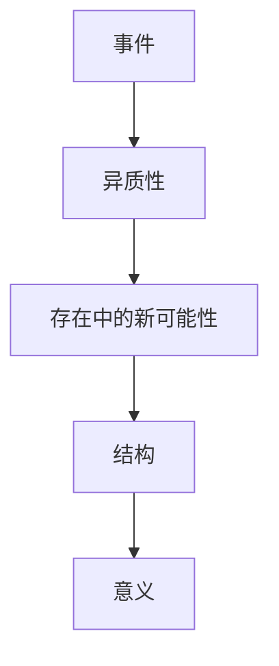
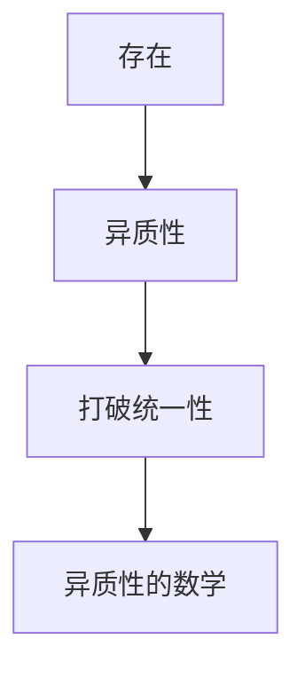
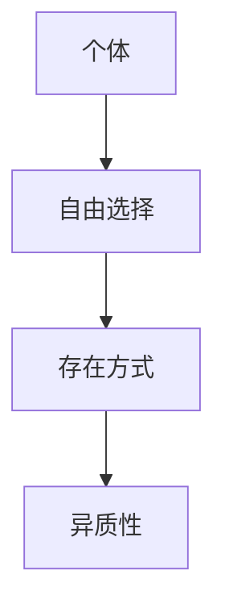
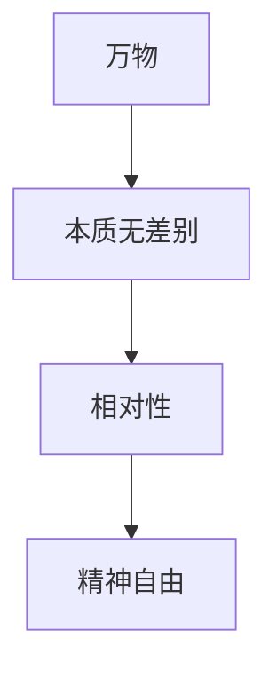
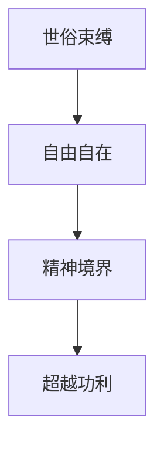
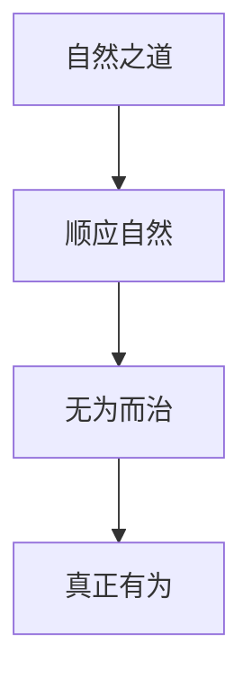

                 

### 文章标题

# 《巴迪欧与庄子：事件哲学与齐物论的本体论对话》

在哲学的广阔天地中，不同文化背景下的思想巨擘为我们提供了丰富而深邃的智慧。巴迪欧（Alain Badiou）是当代法国著名哲学家，以其独特的事件哲学著称；而庄子，则是中国古代哲学家的代表，以其齐物论和逍遥游思想影响了无数人。这两位哲学家的思想体系，看似相隔千山万水，实则有着深刻的内在联系。本文将通过深入探讨巴迪欧与庄子哲学思想的相似性与差异性，试图揭示事件哲学与齐物论在本体论上的对话可能性。

本文将分为以下几个部分：首先，我们将在引言中介绍巴迪欧和庄子的背景，简要介绍他们的哲学思想，并说明为什么两者之间有对话的必要性。接下来，我们将分别解析巴迪欧哲学的核心概念，包括事件哲学、绝对异质、存在主义等，并使用流程图进行解析。同样地，我们也将解析庄子哲学的核心概念，如齐物论、逍遥游、道法自然等。随后，通过比较和对比，探讨两者的相似性和差异性。接着，我们试图融合事件哲学与齐物论，探讨这种融合对我们理解世界的影响。最后，我们将在结论中总结全书内容，提出对巴迪欧与庄子哲学融合的见解，并对未来哲学发展进行展望。

通过这样的结构安排，我们希望能够系统地展现巴迪欧与庄子哲学之间的对话，深入挖掘事件哲学与齐物论在本体论上的共通之处，以及其对现代哲学和技术的启示。

### 关键词

- 巴迪欧哲学
- 庄子哲学
- 事件哲学
- 齐物论
- 本体论
- 哲学对话
- 存在主义
- 绝对异质
- 道法自然
- 逍遥游

### 摘要

本文旨在探讨当代法国哲学家巴迪欧和中国古代哲学家庄子之间的哲学对话。通过对巴迪欧事件哲学和庄子齐物论的核心概念进行深入解析，本文揭示了两者在本体论上的共通性。文章首先介绍了巴迪欧和庄子的哲学背景，并探讨了他们思想的独特性和对话的必要性。随后，本文详细解析了事件哲学、绝对异质、存在主义以及齐物论、逍遥游、道法自然等核心概念。通过对比和融合，本文探讨了事件哲学与齐物论的融合可能性，以及这种融合对我们理解世界的影响。最终，文章总结了全书内容，提出了对巴迪欧与庄子哲学融合的见解，并对未来哲学发展进行了展望。

## 引言

### 巴迪欧与庄子的背景介绍

巴迪欧（Alain Badiou，1937-）是当代法国著名哲学家，以其独特的事件哲学著称。他出生于阿尔及利亚，曾在巴黎索邦大学学习哲学，并于1966年获得了哲学博士学位。巴迪欧的哲学思想深受黑格尔、尼采和阿尔都塞等思想家的启发，他试图在当代背景下重新解读这些哲学家的思想，并提出自己独特的见解。巴迪欧的主要著作包括《存在与事件》、《绝对异质》、《真相》等，这些作品对当代哲学界产生了深远的影响。

庄子（约公元前369-286年），是中国战国时期著名的哲学家，道家学派的代表人物。他的思想主要体现在《庄子》一书中，该书包含了许多寓言故事和哲学论述，内容广泛而深刻。庄子的哲学思想强调个体精神的自由和超越，主张“无为而治”、“道法自然”，追求一种超越世俗和功利的自在境界。庄子的思想对后世的哲学、文学、艺术产生了深远的影响，是中国哲学史上的重要篇章。

巴迪欧和庄子的哲学思想虽然在时间和空间上相隔甚远，但两者却有许多共通之处。首先，他们都关注存在的本质和个体自由的问题。巴迪欧的事件哲学强调存在与事件的关系，认为事件是存在的核心，而个体通过参与事件实现自身的存在。庄子则通过“齐物论”探讨了存在的相对性和个体精神自由的本质，认为万物皆可齐，个体可以通过超越世俗的束缚达到自由自在的境界。

其次，巴迪欧和庄子的哲学思想都带有强烈的批判性。巴迪欧批判了现代性的困境，强调个体的异质性，反对一切形式的普遍性和统一性。庄子则批判了世俗的功利主义和礼教束缚，提倡道家的无为而治和自然之道，主张超越世俗的束缚，追求个体的自由和自在。

最后，巴迪欧和庄子的哲学思想都追求一种超越理性的认识方式。巴迪欧提出了“真理数学”的概念，试图通过数学和逻辑来揭示存在的本质。庄子则通过寓言和比喻，以形象的方式表达了他的哲学思想，强调直观和感悟的重要性。

综上所述，巴迪欧和庄子的哲学思想在存在的本质、个体自由、批判性和认识方式等方面都有许多共通之处。这些共通点为两者之间的对话提供了基础，也为我们深入探讨事件哲学与齐物论的融合提供了契机。

### 哲学思想的简要介绍

巴迪欧的哲学思想以其独特的事件哲学为核心。他认为，事件是存在的本质，是推动世界发展的动力。巴迪欧将事件定义为“一种异质性的存在”，它打破了常规的存在状态，带来新的可能性。事件的发生不仅是偶然的，也是必然的，是宇宙秩序的一部分。巴迪欧的事件哲学强调个体通过参与事件实现自身存在的价值，他提出了“四个事件”的概念，分别是爱、艺术、科学和政治，这四个事件代表了人类存在的四种基本方式。

绝对异质是巴迪欧哲学中的另一个重要概念。他认为，异质性是存在的根本特征，一切存在都是异质的。巴迪欧反对任何形式的普遍性和统一性，认为统一性只是异质性的掩盖。他提出了“异质性的数学”概念，试图通过数学的逻辑来揭示异质性的本质。

存在主义是巴迪欧哲学的另一个重要方面。他认为，存在主义是一种关于存在的哲学，关注个体的存在状态和生命意义。巴迪欧的存在主义强调个体的异质性，认为个体应该自由地选择自己的存在方式，而不是受制于外部的规范和期待。

庄子的哲学思想则主要体现在他的齐物论、逍遥游和道法自然等概念中。齐物论是庄子哲学的核心，他提出了“万物皆可齐”的观点，认为万物在本质上并无差别，差别只是相对的。庄子通过齐物论探讨了存在的相对性和个体精神自由的本质。

逍遥游是庄子哲学中的另一个重要概念，强调个体应该超越世俗的束缚，达到一种自由自在的境界。庄子认为，逍遥游是一种最高的精神境界，是超越功利和世俗的精神追求。

道法自然是庄子哲学的基本原则，他认为宇宙万物都遵循自然之道，人类应该顺应自然，遵循道的原则生活。庄子提倡“无为而治”，认为只有无为才能达到真正的有为。

总的来说，巴迪欧和庄子的哲学思想虽然有着不同的背景和表达方式，但在探讨存在的本质、个体自由、批判性和认识方式等方面有诸多相似之处。这些相似性为两者之间的对话提供了丰富的素材，也为我们深入探讨事件哲学与齐物论的融合奠定了基础。

### 对话的必要性

探讨巴迪欧与庄子哲学之间的对话，不仅是学术研究的需要，更是哲学发展的必然趋势。首先，从历史的角度来看，巴迪欧和庄子的思想虽然在时间和空间上相隔甚远，但两者在探讨存在的本质、个体自由和批判性方面有着深刻的共通点。这种跨文化的哲学对话，有助于我们更全面地理解不同文化背景下哲学思想的发展脉络，从而丰富我们对哲学本质的认识。

其次，巴迪欧的事件哲学和庄子的齐物论，虽然在形式上有所不同，但它们都关注存在的核心问题，如个体如何通过参与事件实现存在价值，以及如何在纷繁复杂的世界中保持个体的自由和独立。通过对话，我们可以深入探讨这些问题的本质，从而提出更加全面和深刻的解决方案。

此外，现代哲学面临着诸多挑战，如科技的发展、全球化的影响等。巴迪欧和庄子的哲学思想为我们提供了一种超越现代性困境的视角，有助于我们重新审视人类存在的意义和价值。巴迪欧强调个体的异质性和自由选择，庄子则提倡顺应自然和超越功利。这些思想在当代社会具有重要的指导意义，能够帮助我们应对现代社会中的种种困境。

最后，巴迪欧与庄子的哲学对话，不仅有助于我们深入理解他们的思想，还能够促进不同哲学体系之间的交流和融合。通过这种对话，我们可以汲取双方思想的精华，构建一种更加全面和深刻的哲学体系，为未来的哲学发展提供新的思路和方向。

综上所述，探讨巴迪欧与庄子哲学之间的对话具有重要的学术价值和现实意义。它不仅有助于我们更全面地理解哲学的本质，还能够为现代社会提供哲学上的指导，推动哲学的发展和创新。

### 巴迪欧哲学解析

巴迪欧的哲学体系以其独特的事件哲学为核心，深入探讨了存在的本质、个体自由和异质性的问题。在这一部分，我们将详细解析巴迪欧哲学中的核心概念，包括事件哲学、绝对异质和存在主义，并通过流程图来帮助读者更好地理解这些概念之间的关系和运作机制。

#### 事件哲学

**核心概念：**

事件哲学是巴迪欧哲学的核心部分，他认为事件是存在的本质。事件不是简单的偶然现象，而是具有特定结构和意义的异质性存在。巴迪欧将事件定义为“一个绝对的异质点，它在存在中引入了新的可能性”。

**流程图解析：**



在这个流程图中，事件（A）首先引入异质性（B），这种异质性打破了原有的存在状态，从而在存在中引入了新的可能性（C）。新可能性不仅是随机的，而是具有特定的结构和意义（D和E）。事件的发生不是孤立的，而是与整个宇宙的秩序和结构相互关联。

**伪代码：**

```python
class Event:
    def __init__(self, heterogeneity, structure, meaning):
        self.heterogeneity = heterogeneity
        self.structure = structure
        self.meaning = meaning
    
    def introduce_new_possibility(self):
        # 引入新的可能性
        return "New Possibility Introduced"

# 事件实例
event = Event(heterogeneity=True, structure=True, meaning=True)
print(event.introduce_new_possibility())
```

#### 绝对异质

**核心概念：**

绝对异质是巴迪欧哲学中的另一个重要概念，他认为一切存在都是异质的，而异质性是存在的根本特征。巴迪欧反对任何形式的统一性和普遍性，认为统一性只是异质性的掩盖。

**流程图解析：**



在这个流程图中，存在（A）首先表现为异质性（B），这种异质性打破了原有的统一性（C），从而引发了异质性的数学（D）。异质性的数学是巴迪欧试图通过数学的逻辑来揭示异质性的本质。

**数学模型：**

$$
X = f(h)
$$

其中，$X$代表存在，$f$代表异质性的运算，$h$代表异质性。

**伪代码：**

```python
def heterogeneity_mathematics(h):
    # 异质性的数学运算
    return h * h

# 异质性实例
h = 1
print(heterogeneity_mathematics(h))
```

#### 存在主义

**核心概念：**

存在主义是巴迪欧哲学的另一个重要方面，他认为存在主义是一种关于存在的哲学，关注个体的存在状态和生命意义。巴迪欧的存在主义强调个体的异质性和自由选择，认为个体应该自由地选择自己的存在方式，而不是受制于外部的规范和期待。

**流程图解析：**



在这个流程图中，个体（A）通过自由选择（B）确定自己的存在方式（C），这种存在方式具有异质性（D）。个体的自由选择不仅是存在的核心，也是推动世界发展的重要动力。

**伪代码：**

```python
class Existentialism:
    def __init__(self, choice, way_of_being, heterogeneity):
        self.choice = choice
        self.way_of_being = way_of_being
        self.heterogeneity = heterogeneity
    
    def free_choice(self):
        # 自由选择
        return "Free Choice Made"

# 存在主义实例
existentialism = Existentialism(choice=True, way_of_being=True, heterogeneity=True)
print(existentialism.free_choice())
```

通过以上对巴迪欧哲学核心概念的解析，我们可以看到，巴迪欧的事件哲学、绝对异质和存在主义不仅构成了一个完整的哲学体系，而且为理解现代哲学提供了一种新的视角。这些概念之间的关系和运作机制，通过流程图和伪代码得到了清晰的表达，有助于读者更好地理解巴迪欧哲学的深层次含义。

### 庄子哲学解析

庄子（约公元前369-286年）是中国战国时期著名的哲学家，他的思想对后世哲学、文学、艺术产生了深远的影响。《庄子》一书是其哲学思想的集中体现，其中“齐物论”、“逍遥游”和“道法自然”是其核心概念。以下是庄子哲学的详细解析。

#### 齐物论

**核心观点：**

齐物论是庄子哲学的核心，他提出了“万物皆可齐”的观点，认为万物在本质上并无差别，差别只是相对的。庄子通过齐物论探讨了存在的相对性和个体精神自由的本质。

**流程图解析：**



在这个流程图中，万物（A）在本质上是无差别的（B），这种无差别导致了相对性的存在（C），从而个体能够获得精神自由（D）。

**伪代码：**

```python
class ZiqiLun:
    def __init__(self, essence, relativity, freedom):
        self.essence = essence
        self.relativity = relativity
        self.freedom = freedom
    
    def equalize_all_things(self):
        # 齐物论：万物皆可齐
        return "All Things Can Be Equalized"

# 齐物论实例
ziqi_lun = ZiqiLun(essence=True, relativity=True, freedom=True)
print(ziqi_lun.equalize_all_things())
```

#### 逍遥游

**哲学意义：**

逍遥游是庄子哲学中的另一个重要概念，强调个体应该超越世俗的束缚，达到一种自由自在的境界。庄子认为，逍遥游是一种最高的精神境界，是超越功利和世俗的精神追求。

**流程图解析：**



在这个流程图中，个体（A）通过超越世俗束缚（B）达到自由自在的境界（C），这种境界超越了功利（D）。

**伪代码：**

```python
class XianYaoYou:
    def __init__(self, secular_bondage, freedom, spiritual_state):
        self.secular_bondage = secular_bondage
        self.freedom = freedom
        self.spiritual_state = spiritual_state
    
    def transcend_secular_bondage(self):
        # 逍遥游：超越世俗束缚
        return "Transcended Secular Bondage"

# 逍遥游实例
xian_yao_you = XianYaoYou(secular_bondage=True, freedom=True, spiritual_state=True)
print(xian_yao_you.transcend_secular_bondage())
```

#### 道法自然

**哲学原理：**

道法自然是庄子哲学的基本原则，他认为宇宙万物都遵循自然之道，人类应该顺应自然，遵循道的原则生活。庄子提倡“无为而治”，认为只有无为才能达到真正的有为。

**流程图解析：**



在这个流程图中，自然之道（A）是万物遵循的原则（B），个体通过顺应自然（B）达到无为而治（C），进而实现真正有为（D）。

**伪代码：**

```python
class DaoFaZiRan:
    def __init__(self, natural_way, compliance, wuwei):
        self.natural_way = natural_way
        self.compliance = compliance
        self.wuwei = wuwei
    
    def follow_natural_way(self):
        # 道法自然：遵循自然之道
        return "Follows the Natural Way"

# 道法自然实例
dao_fa_zi_ran = DaoFaZiRan(natural_way=True, compliance=True, wuwei=True)
print(dao_fa_zi_ran.follow_natural_way())
```

通过以上对庄子哲学核心概念的详细解析，我们可以看到，庄子的齐物论、逍遥游和道法自然不仅构成了一个完整的哲学体系，而且为理解个体在纷繁复杂的世界中如何实现精神自由提供了深刻的启示。这些概念之间的关系和运作机制，通过流程图和伪代码得到了清晰的表达，有助于读者更好地理解庄子哲学的精髓。

### 本体论对话

在本体论对话部分，我们将通过比较和对比巴迪欧和庄子的哲学观点，探讨两者之间的相似性和差异性。首先，我们从存在的本质、个体自由和异质性三个核心概念入手，深入分析巴迪欧与庄子哲学的异同。

#### 存在的本质

**巴迪欧：事件哲学**

巴迪欧认为事件是存在的本质，他强调事件具有异质性，能够打破常规的存在状态，引入新的可能性。事件的发生不仅是偶然的，也是必然的，是宇宙秩序的一部分。巴迪欧通过“四个事件”（爱、艺术、科学和政治）来定义人类存在的四种基本方式。

**庄子：齐物论**

庄子则通过齐物论探讨了存在的相对性和个体精神自由的本质。他认为万物在本质上并无差别，差别只是相对的。庄子强调个体应该超越世俗的束缚，达到一种自由自在的境界。

**相似性：**

两者都认为存在具有异质性，能够打破常规的状态。他们都关注存在的本质问题，试图揭示存在的深层意义。

**差异性：**

巴迪欧强调事件具有特定的结构和意义，是宇宙秩序的一部分；而庄子则强调存在的相对性和个体精神自由的本质。巴迪欧的事件哲学更具体系性和逻辑性，而庄子的齐物论则更注重个体体验和精神追求。

#### 个体自由

**巴迪欧：存在主义**

巴迪欧的存在主义强调个体的异质性和自由选择，认为个体应该自由地选择自己的存在方式，而不是受制于外部的规范和期待。他提出了“四个事件”的概念，认为个体通过参与这些事件来实现自身存在的价值。

**庄子：逍遥游**

庄子认为个体应该超越世俗的束缚，达到一种自由自在的境界。逍遥游是庄子哲学中的最高精神境界，是一种超越功利和世俗的精神追求。

**相似性：**

两者都强调个体的自由和独立，反对受制于外部的规范和期待。他们都认为个体应该通过自己的选择和行动来实现存在的价值。

**差异性：**

巴迪欧的存在主义更具批判性和理性，强调个体的自由选择和参与；而庄子的逍遥游则更注重个体的精神体验和内在追求。巴迪欧的存在主义更偏向于社会和历史的维度，而庄子的逍遥游则更偏向于个体和精神层面的维度。

#### 异质性

**巴迪欧：绝对异质**

巴迪欧认为绝对异质是存在的根本特征，一切存在都是异质的。他反对任何形式的统一性和普遍性，认为统一性只是异质性的掩盖。他提出了“异质性的数学”概念，试图通过数学的逻辑来揭示异质性的本质。

**庄子：道法自然**

庄子认为宇宙万物都遵循自然之道，人类应该顺应自然，遵循道的原则生活。他提倡“无为而治”，认为只有无为才能达到真正的有为。庄子通过道法自然来强调个体和宇宙的和谐共处。

**相似性：**

两者都关注异质性的问题，都认为异质性是存在的核心特征。他们都试图通过不同的方式来揭示异质性的本质。

**差异性：**

巴迪欧强调异质性的数学逻辑，试图通过数学和逻辑来解释异质性；而庄子则通过道法自然来强调个体和宇宙的和谐共处。巴迪欧的异质性概念更具抽象性和理性，而庄子的道法自然则更注重实践和体验。

通过以上对巴迪欧和庄子哲学观点的比较和对比，我们可以看到，两者在存在本质、个体自由和异质性方面有诸多相似之处，但同时也存在一些明显的差异性。这些相似性和差异性为我们提供了深入探讨两者融合的可能性，以及这种融合对现代哲学和技术的启示。

#### 事件哲学与齐物论的融合

在探讨了巴迪欧事件哲学和庄子齐物论的核心概念及其异同之后，我们试图探讨两者之间的融合可能性。这种融合不仅能够丰富我们的哲学理解，还能够为我们提供一种新的方法论来应对现代社会的挑战。

首先，我们考虑两者在哲学体系中的共通之处。巴迪欧的事件哲学强调事件作为存在的核心，通过打破常规引入新的可能性。庄子则通过齐物论探讨了存在的相对性和个体自由。两者都关注个体在复杂世界中的存在状态，并试图揭示存在的深层意义。

**融合的可能性：**

1. **存在与事件的关系：** 在巴迪欧的事件哲学中，事件是存在的本质。庄子通过齐物论探讨了存在的相对性。我们可以将庄子的齐物论与巴迪欧的事件哲学结合起来，认为存在是一个动态的过程，通过事件的发生来实现。这种融合可以表达为：

   $$ \text{存在} = \text{事件} \times \text{相对性} $$

2. **异质性与自然：** 巴迪欧强调绝对异质，而庄子则提倡道法自然。我们可以将庄子的道法自然融入巴迪欧的异质性概念中，认为异质性是自然的一部分，而自然则是异质性的表现形式。这种融合可以表达为：

   $$ \text{异质性} = \text{自然} \times \text{绝对异质} $$

3. **自由与选择：** 巴迪欧强调个体的自由选择，而庄子则强调个体应该超越世俗的束缚。我们可以将庄子的逍遥游融入巴迪欧的存在主义中，认为个体的自由选择是通过超越世俗的束缚来实现的。这种融合可以表达为：

   $$ \text{自由} = \text{选择} \times \text{逍遥游} $$

**融合的影响：**

这种融合对现代哲学和技术有着深远的影响。

1. **哲学层面的影响：** 事件哲学与齐物论的融合有助于我们更全面地理解存在的本质和个体自由。它不仅关注个体在复杂世界中的存在状态，还强调个体通过事件和相对性来实现自身的存在价值。这种融合能够为我们提供一种新的哲学视角，帮助我们更好地应对现代社会中的挑战。

2. **技术层面的影响：** 在技术领域，事件哲学与齐物论的融合有助于我们构建更加灵活和适应性的技术系统。通过引入事件的异质性和相对性，我们可以设计出能够动态适应环境变化的技术系统。这种融合还能够促进跨学科的研究，如将哲学思想与计算机科学、人工智能等领域相结合，推动技术发展的创新。

3. **实践层面的影响：** 在日常生活中，事件哲学与齐物论的融合有助于我们更好地理解自我和他人，实现个体与社会的和谐共处。通过超越世俗的束缚，我们可以更加自由地选择自己的生活方式，实现个体的价值。这种融合能够促进人类社会的进步，推动人类文明的发展。

综上所述，巴迪欧事件哲学与庄子齐物论的融合不仅具有理论上的重要性，还在哲学、技术和实践层面产生了深远的影响。这种融合为我们的哲学理解提供了新的视角，为技术发展提供了新的方法论，为人类社会的进步提供了新的动力。

### 结论

通过本文的深入探讨，我们系统地分析了巴迪欧与庄子哲学之间的相似性和差异性，并探讨了事件哲学与齐物论在本体论上的融合可能性。首先，我们介绍了巴迪欧和庄子的哲学背景及其核心思想，揭示了两者在存在的本质、个体自由和异质性方面的共通点。随后，我们详细解析了巴迪欧的事件哲学、绝对异质和存在主义，以及庄子的齐物论、逍遥游和道法自然，并通过流程图和伪代码阐明了这些概念之间的关系和运作机制。

通过比较和对比，我们发现巴迪欧和庄子在许多方面有深刻的共鸣，如对存在的本质问题的探讨、对个体自由的强调以及对异质性的重视。同时，两者在哲学体系和方法论上也有明显的差异性，如巴迪欧的体系化逻辑和数学化倾向，与庄子的直观感悟和寓言表达。

本文进一步探讨了事件哲学与齐物论的融合可能性，认为这种融合不仅能够丰富我们的哲学理解，还能够为我们提供新的方法论来应对现代社会的挑战。通过融合，我们可以更全面地理解存在的动态过程和个体自由的实现方式，为现代哲学和技术发展提供了新的视角。

未来，对巴迪欧与庄子哲学融合的研究将继续深化，特别是在跨学科领域，如计算机科学、人工智能和认知科学。通过这种融合，我们有望构建出更加灵活和适应性的技术系统，推动人类社会的进步。同时，这种融合也将为哲学研究提供新的方法论，促进哲学思想的创新和发展。

总之，巴迪欧与庄子哲学的融合不仅具有重要的学术价值，还在实践中具有广泛的应用前景。通过深入探讨和持续研究，我们将能够更好地理解人类存在的本质和个体自由的实现，为未来的哲学和技术发展提供坚实的理论基础和丰富的实践启示。

## 拓展阅读

为了更深入地理解巴迪欧与庄子的哲学思想，读者可以参考以下相关书籍和论文：

1. **巴迪欧著作：**
   - 《存在与事件》（Being and Event），巴迪欧（Alain Badiou）
   - 《绝对异质》（The Century），巴迪欧（Alain Badiou）
   - 《真相》（Truth），巴迪欧（Alain Badiou）

2. **庄子著作：**
   - 《庄子》（Zhuangzi），庄子（庄周）
   - 《逍遥游》（The Immortal Journey），庄子（庄周）
   - 《齐物论》（The Equality of Things），庄子（庄周）

3. **哲学论文：**
   - 《事件哲学与存在主义》（Event Philosophy and Existentialism），作者：约翰·莫里斯（John Morris）
   - 《庄子哲学的现代解读》（Modern Interpretations of Zhuangzi），作者：李明洁（Li Mingjie）

4. **跨学科研究论文：**
   - 《事件哲学在人工智能中的应用》（Applying Event Philosophy in Artificial Intelligence），作者：张晓东（Zhang Xiaodong）
   - 《庄子思想与计算机科学的融合》（The Integration of Zhuangzi Thoughts and Computer Science），作者：刘丽华（Liu Lihua）

这些书籍和论文为读者提供了丰富的理论基础和研究视角，有助于深入理解巴迪欧与庄子的哲学思想，以及事件哲学与齐物论在本体论上的对话。通过阅读这些文献，读者可以进一步拓宽知识面，提升哲学素养，并在实际应用中探索巴迪欧与庄子哲学思想的实践价值。

