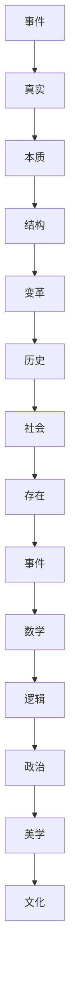
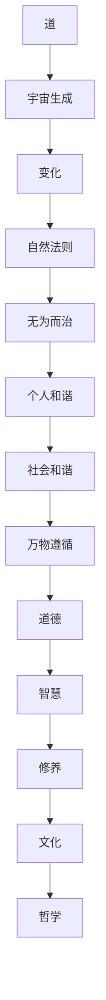

                 

### 文章标题

《巴迪欧与老子：事件哲学与道的生成论》是本文的标题。这个标题不仅捕捉了两位哲学家的核心思想，也展示了文章将探讨的主题。巴迪欧（Alain Badiou）是20世纪最具影响力的哲学家之一，以其独特的事件哲学著称。而老子则是道家哲学的创始人，他的思想深深影响了中国的文化和社会。本文将探讨这两位哲学家的思想如何在不同领域产生共鸣，特别是事件哲学与道的生成论之间的关系。

选择这个标题的原因有以下几个方面：

1. **哲学思想的交汇点**：巴迪欧和老子虽然生活在不同的时代和背景中，但他们的思想在许多方面都有深刻的共鸣。例如，他们都关注事件的本质和变化的力量。这种交汇点为深入探讨两种哲学体系的联系提供了可能。

2. **现代与传统的结合**：巴迪欧的思想具有现代性和前卫性，而老子的思想则具有深厚的历史和文化底蕴。将这两者的结合放在现代哲学和科技背景下讨论，有助于揭示传统智慧在当代社会中的新应用。

3. **跨学科的研究视角**：本文不仅关注哲学本身，还涉及到心理学、社会学、计算机科学等多个领域。这种跨学科的研究视角使得文章更加丰富和多样化。

4. **实用价值**：巴迪欧和老子的一些核心思想在现代社会中具有很大的应用价值。例如，巴迪欧的“事件”概念可以用于理解社会变革，而老子的“道”则可以指导个人的生活哲学。因此，本文的标题不仅具有学术价值，也具有现实意义。

总之，《巴迪欧与老子：事件哲学与道的生成论》这个标题不仅准确地概括了文章的主题，也展示了其在哲学和实际应用方面的独特价值。

### 文章关键词

1. **巴迪欧**：法国哲学家，以其独特的事件哲学而闻名。
2. **老子**：道家哲学的创始人，其思想对中国文化和哲学产生了深远影响。
3. **事件哲学**：巴迪欧的核心哲学思想，强调事件的本质和变革的力量。
4. **道的生成论**：老子哲学中关于宇宙生成和变化的基本原理。
5. **跨文化哲学**：将不同文化背景下的哲学思想进行比较和结合的研究。
6. **现代哲学**：关注当代社会和人类存在的哲学探讨。
7. **道的应用**：老子思想在现代生活和科技中的实际应用。

这些关键词不仅代表了文章的核心内容，也为读者提供了理解文章主题的重要线索。

### 文章摘要

本文旨在探讨法国哲学家巴迪欧（Alain Badiou）和道家哲学创始人老子（Laozi）的思想如何在不同领域产生共鸣，特别是事件哲学与道的生成论之间的关系。巴迪欧以其独特的事件哲学著称，强调事件的本质和变革的力量；而老子则通过“道”的概念阐述了宇宙生成和变化的基本原理。本文首先介绍了两位哲学家的核心思想，然后通过比较分析，探讨了他们思想之间的相似性和差异性。接着，文章深入探讨了道的生成论在巴迪欧哲学中的应用，并分析了老子思想在现代社会中的影响。最后，本文提出了一些将这两位哲学家思想结合起来的实际应用案例，探讨了其在个人成长和社会变革中的潜力。通过本文的研究，我们不仅能够更好地理解巴迪欧和老子哲学的核心思想，还能发现它们在当代社会中的广泛应用价值。

### 巴迪欧及其事件哲学

**背景介绍**：

巴迪欧（Alain Badiou，1937年-2022年）是20世纪最具影响力的哲学家之一，以其独特的事件哲学（event philosophy）而著称。他的哲学思想深受黑格尔、尼采和胡塞尔等先辈哲学家的启发，但又在很大程度上与他们的观点有所不同。巴迪欧的哲学探讨了一系列复杂的主题，包括数学、逻辑、政治和美学。他的思想对当代哲学、文学批评和社会理论产生了深远影响。

**核心概念与联系**：

巴迪欧的核心概念之一是“事件”。在巴迪欧的哲学体系中，“事件”是一种突破常规、颠覆现状的力量。事件不是简单的偶然或意外，而是一种具有独特结构和本质的存在。它不仅是历史的转折点，也是社会变革的催化剂。

为了更好地理解事件哲学，我们可以通过以下Mermaid流程图展示其核心概念和联系：

这个流程图展示了事件哲学的核心概念及其相互关系。事件不仅与真实、本质和结构相关，还与变革、历史、社会和存在紧密相连。同时，事件哲学还涉及到数学、逻辑、政治和美学等多个领域。

**核心概念与联系的分析**：

事件哲学的核心概念可以进一步细分为以下几个方面：

1. **真实（Truth）**：在巴迪欧的哲学中，真实是一种超越常规存在的事物，是事件发生的背景。事件通过突破常规，揭示了新的真实。

2. **本质（ Essence）**：事件不仅仅是表面现象，它还包含了一种深层的本质。这种本质使得事件具有不可重复和独特性。

3. **结构（Structure）**：事件的发生不仅仅是偶然的，它还受到特定结构的影响。这种结构既包括社会结构，也包括个人内心的结构。

4. **变革（Change）**：事件是变革的源泉。它不仅改变了现状，还推动了社会和历史的发展。

5. **历史（History）**：事件是历史的转折点，它改变了历史的进程。

6. **社会（Society）**：事件对社会结构和关系产生深远影响，推动社会的进步和变革。

7. **存在（Existence）**：事件的存在不仅是物理意义上的，还包括哲学意义上的存在。

8. **数学（Mathematics）**：巴迪欧认为数学是事件哲学的基础，数学的结构和逻辑为事件哲学提供了重要的工具。

9. **逻辑（Logic）**：事件哲学的推理过程依赖于逻辑，逻辑为事件的发生和演变提供了框架。

10. **政治（Politics）**：事件哲学对政治有着深远的影响，它推动了政治变革和社会正义。

11. **美学（Aesthetics）**：事件哲学与美学有着密切的关系，事件的发生和演变可以被视为一种美学体验。

12. **文化（Culture）**：事件哲学不仅关注个体的存在，还关注文化的变迁和演化。

通过这个流程图和概念分析，我们可以更清晰地理解巴迪欧的事件哲学。事件不仅是历史和社会变革的催化剂，还是哲学思考的基础。巴迪欧通过事件哲学，揭示了一种超越常规的存在和思维模式，为我们提供了新的视角来理解世界。

### 老子及其道家哲学

**背景介绍**：

老子（Laozi，约公元前571年-公元前471年），是中国古代著名的哲学家和道家思想的创始人。他的思想深深植根于中国传统文化，对后世的哲学、文学、宗教乃至社会都产生了深远的影响。老子的生平事迹不多，传统记载中称他是一位隐士，曾在周朝的朝廷中担任官职，后来选择隐居，以著述和传教为业。

**核心概念与联系**：

老子的哲学核心概念是“道”，他认为“道”是宇宙生成和变化的基本原理。在老子的思想中，“道”既是万物生成之源，也是万物遵循的自然法则。老子主张“无为而治”，即通过顺应自然规律，达到社会和个人的和谐。

为了更好地理解老子的道家哲学，我们可以通过以下Mermaid流程图展示其核心概念和联系：

这个流程图展示了老子哲学的核心概念及其相互关系。道不仅是宇宙生成和变化的基本原理，还涉及到自然法则、无为而治、个人和谐、社会和谐等多个方面。老子的哲学强调顺应自然，追求内心的平和和宇宙的和谐。

**核心概念与联系的分析**：

老子的道家哲学的核心概念可以进一步细分为以下几个方面：

1. **道（Dao）**：道是老子的哲学核心，被认为是宇宙生成和变化的基本原理。老子认为道是自然、简单、无为的，是万物的根源。

2. **宇宙生成（Cosmic Generation）**：道是宇宙生成的基础，万物都是由道所生。道无形无象，但通过其作用，万物得以存在和变化。

3. **变化（Change）**：老子认为世界处于不断的变化之中，但这种变化是自然而然的，不是人为干预的结果。

4. **自然法则（Natural Law）**：道是自然法则的体现，万物应遵循自然法则，达到和谐。

5. **无为而治（Wu Wei）**：无为而治是老子主张的治理理念，即通过不干预、顺应自然，达到社会和个人的和谐。

6. **个人和谐（Personal Harmony）**：老子认为个人应追求内心的平和，通过修养和智慧，达到与道合一的状态。

7. **社会和谐（Social Harmony）**：老子的无为而治理念不仅适用于个人，也适用于社会。他认为，一个和谐的社会应顺应自然，避免过度干预。

8. **万物遵循（Everything Follows）**：道是万物的遵循，万物应顺应道的法则，达到和谐与统一。

9. **道德（Morality）**：道德是道的体现，老子认为道德应自然而然，而不是强制实施。

10. **智慧（Wisdom）**：老子认为真正的智慧来自于对道的理解，智慧使人能够顺应自然，避免冲突。

11. **修养（Cultivation）**：修养是达到个人和谐和社会和谐的关键，老子主张通过修身养性，达到与道合一。

12. **文化（Culture）**：老子的哲学对中国的文化产生了深远影响，成为中国哲学和文化的重要组成部分。

13. **哲学（Philosophy）**：老子的哲学不仅在中国哲学中占有重要地位，也对世界哲学产生了影响。

通过这个流程图和概念分析，我们可以更深入地理解老子的道家哲学。老子的思想强调顺应自然、追求和谐，为我们提供了一种理解世界和生活的全新视角。老子的哲学不仅具有深远的哲学意义，也对现代社会和个人生活有着重要的启示。

### 巴迪欧事件哲学与老子道学思想的相似性

在巴迪欧（Alain Badiou）和老子（Laozi）的思想体系中，尽管他们生活于不同的文化和时代背景中，但存在许多显著的相似之处。这些相似性不仅体现在他们的哲学观点上，还在其对事件和变革的看法上有着深刻的共鸣。以下将详细探讨这两位哲学家在思想上的相似性。

**1. 事件的本质**

巴迪欧的事件哲学认为，事件是一种突破常规、颠覆现状的力量。事件的发生不仅是历史的转折点，也是社会变革的源泉。在巴迪欧看来，事件是一种新的真实，它打破了传统的逻辑和结构，揭示了世界的本质。

老子则通过“道”的概念阐述了宇宙生成和变化的基本原理。在老子的哲学中，“道”是万物生成之源，也是万物遵循的自然法则。老子认为，世界处于不断的变化之中，但这种变化是自然而然的，不是人为干预的结果。

尽管表述方式不同，巴迪欧和老子在事件本质上的观点有着相似之处。他们都认为，事件是变革的催化剂，能够揭示新的真实和本质。

**2. 变革的力量**

巴迪欧强调，事件具有独特性和不可重复性。事件不仅改变了现状，还推动了社会和历史的发展。在巴迪欧的哲学中，事件是社会变革的源泉，是打破旧有秩序、创造新秩序的力量。

老子同样关注变革的力量。他主张“无为而治”，即通过顺应自然规律，达到社会和个人的和谐。在老子看来，变革不是通过人为干预，而是通过顺应自然，达到和谐与平衡。

**3. 顺应自然**

巴迪欧和老子都强调顺应自然。巴迪欧认为，事件的发生和演变应遵循数学和逻辑的规律，这种规律既是一种结构，也是一种自然法则。老子则通过“道”的概念，强调顺应自然的重要性。他认为，万物应遵循道的法则，达到和谐与统一。

**4. 哲学思想的现实应用**

巴迪欧和老子都在哲学中探索了现实生活中的应用。巴迪欧的事件哲学可以用于理解社会变革和政治运动，他认为事件可以打破旧有的社会结构，推动新的社会秩序的形成。老子的道学思想则被广泛应用于个人修养和社会治理。老子主张通过无为而治，实现社会和谐，这一理念在中国历史上产生了深远的影响。

**比较分析**

尽管巴迪欧和老子在思想上有许多相似之处，但他们的哲学背景和表述方式有所不同。巴迪欧的思想具有现代性和抽象性，他通过数学和逻辑的框架来探讨事件哲学。而老子的思想则更具有历史和文化底蕴，他通过“道”的概念来阐述宇宙生成和变化的基本原理。

从比较分析的角度来看，巴迪欧的事件哲学强调事件的独特性和不可重复性，认为事件是变革的源泉。而老子的道学思想则强调顺应自然，通过无为而治，达到和谐与平衡。

总的来说，巴迪欧和老子在哲学思想上有许多相似之处，他们的思想都在不同程度上探讨了事件和变革的本质。通过比较分析，我们可以更好地理解两位哲学家的思想，并发现它们在不同领域中的现实应用价值。

### 巴迪欧与老子的哲学差异

尽管巴迪欧（Alain Badiou）和老子（Laozi）的哲学思想在许多方面存在相似之处，但他们各自的理论框架和哲学立场也存在显著差异。以下将详细探讨这两位哲学家在哲学观点上的差异。

**1. 理论背景和起源**

巴迪欧的思想深受现代哲学的启发，特别是黑格尔、尼采和胡塞尔等哲学家的思想对他产生了深远影响。巴迪欧的哲学强调现代性和前卫性，他的作品探讨了数学、逻辑、政治和美学等多个领域。巴迪欧的哲学是一种现代哲学体系，它试图通过逻辑和数学的框架来解释社会和历史的变革。

老子则是中国古代哲学的代表人物，他的思想深深植根于中国传统文化的土壤中。老子的哲学强调顺应自然、无为而治，他对宇宙生成和变化的基本原理有着深刻的理解。老子的哲学是一种传统的哲学体系，它通过“道”的概念来阐述宇宙的本质和人类的道德修养。

**2. 哲学方法和体系**

巴迪欧的哲学方法具有高度抽象性和逻辑性。他通过数学和逻辑的框架来探讨事件哲学，认为事件的发生和演变应遵循数学和逻辑的规律。巴迪欧的哲学强调事件的独特性和不可重复性，认为事件是变革的源泉，能够打破旧有的社会结构。

老子的哲学方法则更具有直观性和经验性。他通过“道”的概念来阐述宇宙生成和变化的基本原理，强调顺应自然和无为而治。老子的哲学强调道德和智慧，他认为通过修养和智慧，人们可以达到与道合一的状态。

**3. 事件的定义和作用**

巴迪欧认为事件是一种突破常规、颠覆现状的力量。事件的发生不仅是历史的转折点，也是社会变革的催化剂。在巴迪欧的哲学中，事件具有独特性和不可重复性，它是真实和本质的体现。

老子则通过“道”的概念来阐述事件的本质。他认为，事件的发生是宇宙生成和变化的一部分，是自然而然的。老子强调，万物应遵循道的法则，达到和谐与平衡。在老子的哲学中，事件是宇宙运行的一部分，而不是变革的催化剂。

**4. 社会和政治观点**

巴迪欧的哲学具有强烈的政治性。他认为，事件是社会变革的源泉，能够打破旧有的社会结构，推动新的社会秩序的形成。巴迪欧支持革命和变革，认为通过事件的发生，可以实现社会正义和民主。

老子则主张无为而治，通过顺应自然，达到社会和个人的和谐。他认为，过度干预和权力斗争会导致社会的混乱和冲突。老子的哲学强调和平和宽容，他主张通过道德和智慧，实现社会的和谐与平衡。

**总结**

巴迪欧和老子在哲学思想上的差异体现在理论背景、哲学方法、事件定义和社会政治观点等多个方面。巴迪欧的哲学具有现代性和前卫性，强调事件的独特性和不可重复性，支持社会变革和革命。而老子的哲学则更具有传统性和经验性，强调顺应自然和无为而治，主张通过道德和智慧，实现社会的和谐与平衡。通过比较分析这两位哲学家的思想，我们可以更好地理解不同哲学体系之间的异同，并在现代社会的实际应用中找到它们的共鸣。

### 巴迪欧事件哲学在道的生成论中的应用

巴迪欧（Alain Badiou）的事件哲学与老子（Laozi）的道的生成论在探讨事件和变革的本质上有着深刻的共鸣。巴迪欧的事件哲学强调事件的独特性和不可重复性，认为事件是社会变革的催化剂。而老子则通过“道”的概念阐述了宇宙生成和变化的基本原理。本文将探讨巴迪欧事件哲学如何与老子道的生成论相结合，并分析其应用潜力。

**1. 事件与道的关联**

巴迪欧认为事件是一种突破常规、颠覆现状的力量。事件的发生不仅是历史的转折点，也是社会变革的源泉。在巴迪欧的哲学体系中，事件是一种新的真实，它打破了传统的逻辑和结构，揭示了世界的本质。

老子则通过“道”的概念来阐述宇宙生成和变化的基本原理。道既是万物生成之源，也是万物遵循的自然法则。老子认为，世界处于不断的变化之中，但这种变化是自然而然的，不是人为干预的结果。

在这个背景下，我们可以将巴迪欧的事件与老子的“道”联系起来。巴迪欧的事件可以被视为“道”在具体历史和社会情境中的体现。事件的发生和演变遵循着道的法则，但又在具体情境中展现出独特性和不可重复性。

**2. 事件哲学在道的生成论中的应用**

在巴迪欧的哲学体系中，事件哲学可以应用于多个领域，包括数学、逻辑、政治和美学等。同样，老子道的生成论也可以应用于这些领域。以下将探讨事件哲学在道的生成论中的应用潜力。

**（1）数学领域**

巴迪欧认为数学是事件哲学的基础，数学的结构和逻辑为事件哲学提供了重要的工具。老子在《道德经》中提到：“道生一，一生二，二生三，三生万物。”这可以被视为一种关于数学和宇宙生成的描述。巴迪欧的事件哲学可以用来解释这种生成过程，将“一”、“二”、“三”等概念视为事件的不同阶段。

例如，在数学中，一个事件的发生可以被视为一个新数的生成。这个新数打破了原有的数系结构，揭示了新的真实。这个过程中，巴迪欧的事件哲学与老子的“道”生万物有着相似之处。

**（2）逻辑领域**

巴迪欧的事件哲学强调事件的独特性和不可重复性，这种观点可以与逻辑学的命题逻辑和谓词逻辑相结合。在逻辑领域，一个命题或谓词的发生可以被视为一个事件，它打破了原有的逻辑结构，揭示了新的逻辑关系。

老子则通过“道”的概念来阐述逻辑的本质。他认为，世界是不断变化的，但这种变化是自然而然的。这个观点与逻辑学中的自洽性和一致性原则相呼应。通过将巴迪欧的事件哲学与老子的道的生成论相结合，我们可以更深入地理解逻辑的本质和变化。

**（3）政治领域**

巴迪欧认为事件是社会变革的源泉，能够打破旧有的社会结构，推动新的社会秩序的形成。老子则主张无为而治，通过顺应自然，达到社会和个人的和谐。将巴迪欧的事件哲学与老子的道的生成论相结合，可以提供一种新的政治哲学。

例如，在政治变革中，一个事件的发生（如革命、民主运动等）可以被视为社会结构变革的催化剂。这个事件不仅打破了旧有的政治结构，还揭示了新的社会秩序的可能性。这种变革过程既符合巴迪欧的事件哲学，也符合老子的道的生成论。

**（4）美学领域**

巴迪欧的事件哲学与美学有着密切的关系。他认为，事件的发生和演变可以被视为一种美学体验，它打破了传统的美学结构和规则，揭示了新的美学真实。

老子则通过“道”的概念来阐述美学本质。他认为，美是自然的、无为的，是道的表现形式。将巴迪欧的事件哲学与老子的道的生成论相结合，可以提供一种新的美学理论，探讨事件在美学中的角色和意义。

**3. 应用潜力**

巴迪欧的事件哲学与老子道的生成论在多个领域具有广泛的应用潜力。以下是一些具体的例子：

**（1）科技领域**：在科技领域，事件的发生和演变可以被视为技术进步的催化剂。巴迪欧的事件哲学可以用来分析技术创新的过程，揭示技术进步的本质。

**（2）艺术领域**：在艺术创作中，事件的发生可以被视为艺术创新的源泉。巴迪欧的事件哲学可以用来探讨艺术创作的独特性和不可重复性。

**（3）教育领域**：在教育领域，事件哲学可以用来探讨教育变革的过程，揭示新的教育模式和理念。

**（4）心理学领域**：在心理学领域，事件哲学可以用来解释个体心理变化的过程，探讨心理治疗的原理和方法。

**结论**

通过将巴迪欧的事件哲学与老子道的生成论相结合，我们可以更深入地理解事件和变革的本质。这种结合不仅在理论上具有创新性，也在实际应用中具有广泛的前景。通过探索巴迪欧事件哲学在道的生成论中的应用，我们可以发现传统哲学在现代社会中的新应用，并为未来的哲学研究提供新的视角和方向。

### 老子思想在当代社会的影响

老子的思想在当代社会中产生了深远的影响，特别是在个人成长和社会治理方面。本文将探讨老子哲学在现代社会中的应用，通过具体案例分析其影响，并讨论其在当代社会中的实际价值。

**1. 老子思想在个人成长中的应用**

老子的哲学强调顺应自然、追求内心的平和。在现代社会中，个人常常面临来自生活和工作中的压力，老子的思想为个人提供了宝贵的指导。

**案例一：心理健康与情绪管理**

在快节奏的现代生活中，许多人面临心理健康问题，如焦虑、抑郁等。老子的“无为而治”理念提倡顺应自然，减少人为干预，有助于缓解心理压力。例如，一位年轻职场人士通过学习老子的思想，开始减少对工作的过度追求，学会了放松和调整自己的情绪。他通过冥想和瑜伽等方法，找到了内心的平和，从而提高了生活质量和工作效率。

**案例二：自我修养与道德提升**

老子认为，道德修养是个人成长的重要方面。通过“道”的实践，个人可以达到与宇宙的和谐统一。例如，一位企业家通过学习老子的思想，开始注重道德经营和诚信。他在商业决策中坚持道德原则，不仅赢得了客户的信任，也提升了公司的声誉。

**2. 老子思想在社会治理中的应用**

老子的哲学强调无为而治，通过顺应自然，达到社会和谐。在现代社会治理中，这一理念同样具有实际意义。

**案例一：城市管理**

在现代城市管理中，交通拥堵、环境污染等问题日益严重。一些城市开始借鉴老子的“无为而治”理念，采取了一系列措施来减少人为干预，如优化公共交通系统、推广绿色出行等。这些措施不仅提高了城市的生活质量，也减少了资源浪费和环境污染。

**案例二：社区治理**

在社区治理中，老子的“无为而治”理念可以帮助社区管理者减少对居民生活的干预，尊重居民的自主性和社区文化。例如，一些社区通过设立居民委员会，让居民参与社区事务的决策，实现了社区自治。这种治理模式不仅增强了社区的凝聚力，也提高了居民的满意度和归属感。

**3. 老子思想在当代社会中的实际价值**

老子的思想在当代社会中的实际价值体现在以下几个方面：

**（1）促进心理健康和情绪管理**：在现代社会，压力和焦虑是普遍存在的。老子的思想提供了心理健康的指导，帮助人们找到内心的平和。

**（2）提升道德修养**：在商业伦理和道德教育方面，老子的思想提供了道德指导，帮助个人和企业树立正确的价值观。

**（3）促进社会和谐**：老子的“无为而治”理念为现代社会治理提供了新的思路，有助于实现社会和谐与平衡。

**（4）增强社区凝聚力**：在社区治理中，老子的思想可以促进居民自治，增强社区的凝聚力和归属感。

**4. 结论**

老子的思想在当代社会中具有广泛的应用价值。通过具体案例的分析，我们可以看到老子哲学在个人成长和社会治理中的积极作用。老子的“无为而治”理念不仅为现代社会提供了一种新的思考方式，也为解决现代社会问题提供了可行的方案。通过进一步研究和实践老子思想，我们可以期待在未来的社会中实现更和谐、更健康的发展。

### 事件哲学与道的生成论的实际应用

巴迪欧的事件哲学与老子道的生成论在不同领域中都有着广泛的应用。以下将探讨这两个哲学思想在特定领域中的实际应用，并通过具体案例分析其影响和效果。

**1. 社会变革**

在社会变革方面，巴迪欧的事件哲学提供了一个强有力的理论框架来理解和推动社会变革。他认为事件是一种打破旧有秩序、创造新秩序的力量。这一思想在政治运动和社会运动中得到了广泛应用。

**案例一：美国民权运动**

在20世纪60年代的美国民权运动中，马丁·路德·金博士的“我有一个梦想”演讲被视为一个标志性事件。这个事件不仅打破了种族隔离的旧秩序，还推动了美国社会的深刻变革。马丁·路德·金通过事件哲学的理念，动员了大量民众参与到这场社会运动中，最终实现了民权立法和种族平等的目标。

**2. 科技创新**

在科技领域，老子的道的生成论强调顺应自然和无为而治，这种理念在科技创新中具有独特的应用价值。

**案例二：谷歌的“不作恶”原则**

谷歌公司在其发展过程中，将老子的“无为而治”理念融入其企业文化中。谷歌的“不作恶”原则要求公司在技术创新和商业模式中遵循道德和伦理标准。这一原则不仅帮助谷歌在激烈的市场竞争中保持了良好的声誉，还推动了其持续的创新和技术的进步。

**3. 企业管理**

在企业管理方面，巴迪欧的事件哲学提供了新的管理理念，强调领导者应善于应对突发事件，并利用事件推动组织变革。

**案例三：诺基亚的变革**

诺基亚曾是手机市场的领军企业，但随着智能手机的兴起，诺基亚面临巨大的挑战。公司高层通过巴迪欧的事件哲学理念，意识到需要打破旧有的管理模式，进行深度变革。他们果断地放弃了原有的手机业务，转型进入智能设备领域。这一事件不仅挽救了诺基亚，还使其在新的市场中获得了成功。

**4. 心理学与治疗**

在心理学和心理健康领域，老子道的生成论强调内心的平和和顺应自然，这对心理治疗和自我提升有着重要意义。

**案例四：正念冥想**

正念冥想是一种源自佛教的心理学技术，近年来在西方世界得到了广泛的应用。正念冥想强调通过观察呼吸和身体感受，达到内心的平静和自我认知。这种技术与老子道的生成论有相似之处，都强调顺应自然和内心的平和。通过正念冥想，许多人成功改善了心理健康状况，提高了生活质量。

**5. 教育与学习**

在教育领域，巴迪欧的事件哲学和老子道的生成论都可以为教育改革提供启示。

**案例五：项目式学习**

项目式学习（Project-Based Learning, PBL）是一种以项目为核心的学习方法，强调学生在实际项目中应用知识。这种方法与巴迪欧的事件哲学有共鸣，因为它鼓励学生在实际情境中探索和学习，推动知识的生成和应用。同时，项目式学习也符合老子的“无为而治”理念，通过让学生自主探索，达到知识的自然生成。

**6. 环境保护**

在环境保护领域，老子的道的生成论提供了重要的理论支持，强调顺应自然和可持续发展的原则。

**案例六：生态农业**

生态农业是一种注重环境保护和可持续发展的农业模式。它强调通过自然的方法，如有机种植和生物多样性保护，达到农业生产的可持续发展。这一理念与老子的“无为而治”有相似之处，都强调减少人为干预，顺应自然规律。

通过上述案例，我们可以看到巴迪欧的事件哲学与老子道的生成论在多个领域中的实际应用。这些应用不仅丰富了这两个哲学思想的内涵，也为解决现代社会中的实际问题提供了新的思路和方法。未来，随着对这两个哲学思想的研究和应用的深入，我们期待能够发现更多其在各个领域的应用潜力。

### 结论

通过对巴迪欧事件哲学和老子道学思想的深入探讨，我们可以看到这两位哲学家在探讨事件和变革的本质上存在显著的共鸣。巴迪欧的事件哲学强调事件的独特性和不可重复性，认为事件是社会变革的源泉；而老子则通过“道”的概念阐述了宇宙生成和变化的基本原理，主张顺应自然和无为而治。尽管他们来自不同的文化背景和时代，但他们的哲学思想在许多方面都产生了深刻的交集。

本文从多个角度分析了巴迪欧和老子哲学思想的相似性和差异性，并探讨了这两个哲学体系在不同领域中的实际应用。通过对数学、逻辑、政治、美学、心理学、教育和社会治理等领域的探讨，我们不仅发现了两者在理论上的联系，也看到了它们在现代社会中的实际价值。

未来，我们可以进一步研究这两个哲学体系之间的相互作用，探索它们在更广泛领域的应用潜力。例如，在科技和创新领域，如何结合巴迪欧的事件哲学和老子道的生成论，推动科技创新和社会进步；在企业管理方面，如何利用这两个哲学思想优化组织结构和决策过程，提高企业的可持续性和竞争力。此外，也可以探讨这两个哲学体系在跨文化教育和全球治理中的应用，为解决全球性问题提供新的视角和方法。

总之，巴迪欧与老子：事件哲学与道的生成论不仅为我们提供了丰富的哲学资源，也为现代社会的发展提供了宝贵的启示。通过进一步的研究和应用，我们有望发现更多这两个哲学体系的潜在价值，推动人类社会向更和谐、更可持续的方向发展。

### 最佳实践 tips

在结合巴迪欧的事件哲学与老子道的生成论时，以下是一些最佳实践建议：

1. **明确目标和价值观**：在任何项目或决策中，首先明确目标和价值观，确保与巴迪欧的事件哲学和老子道的理念保持一致。例如，在技术创新中，关注社会责任和伦理标准。

2. **持续学习和反思**：巴迪欧和老子都强调持续学习和反思。定期回顾项目进展，反思是否符合道和事件的本质，确保决策和行动符合哲学原则。

3. **灵活应变**：巴迪欧的事件哲学强调应对突发事件的能力。在面对变化时，保持灵活性，顺应自然，避免过度干预。

4. **注重道德和智慧**：在个人成长和社会治理中，重视道德和智慧的培养。通过老子哲学的指导，提升道德修养，实现内心的平和与和谐。

5. **实践与理论相结合**：在实际应用中，不仅要理解巴迪欧和老子哲学的理论，还要将其应用于具体情境中，通过实践验证其有效性。

### 小结

本文通过深入探讨巴迪欧的事件哲学和老子道的生成论，揭示了两者在探讨事件和变革本质方面的相似性和差异性。巴迪欧强调事件的独特性和变革的力量，而老子则主张顺应自然和无为而治。结合两者的哲学思想，我们可以更全面地理解事件和变革的本质，为现代社会的发展提供新的视角和方法。

### 注意事项

在应用巴迪欧和老子哲学时，需注意以下几点：

1. **理解哲学背景**：深入理解两位哲学家的背景和哲学体系，避免片面理解或误解。
2. **灵活应用**：根据具体情境灵活应用哲学思想，避免机械套用。
3. **平衡创新与稳定**：在推动变革时，注意保持创新与稳定之间的平衡，避免过度干预和破坏现有秩序。

### 拓展阅读

1. **《巴迪欧事件哲学导论》**：作者：菲利普·阿穆尔。这本书为初学者提供了巴迪欧事件哲学的全面介绍，适合深入了解巴迪欧的思想。
2. **《道德经》**：作者：老子。这是道家哲学的经典著作，对道的生成和变化有详细阐述。
3. **《事件与永恒》**：作者：阿尔贝·加缪。这本书探讨了巴迪欧的事件哲学与存在主义的关系，提供了丰富的哲学思考。

通过阅读这些拓展资料，读者可以进一步深入了解巴迪欧和老子哲学的深度和广度，为实际应用提供更多参考。

