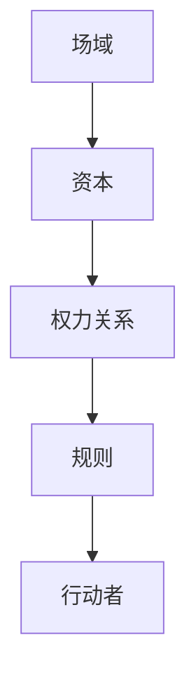

                 


### 《布迪厄与荀子：场域理论与礼治思想的社会学对话》

#### 关键词：布迪厄，场域理论，荀子，礼治思想，社会学，比较研究

#### 摘要

本文旨在探讨法国社会学家皮埃尔·布迪厄的场域理论与中国古代思想家荀子的礼治思想之间的关联与对话。通过对布迪厄场域理论的核心概念和荀子礼治思想的基本观点的阐述，本文分析了两者在理解和解释社会现象中的异同点。文章进一步探讨了场域理论与礼治思想在现代社会治理和教育改革中的潜在应用，为当代中国社会治理提供了新的视角和启示。

### 第1章：导论：布迪厄与荀子——场域理论与礼治思想

#### 1.1 布迪厄的场域理论概述

布迪厄的场域理论是社会学中的重要理论之一，它提供了一种分析社会结构和权力关系的新视角。场域（Field）是布迪厄用于描述社会活动中的一种结构化空间，它由一系列相互关联的实践和权力关系构成。场域的分类包括经济场域、文化场域、教育场域和政治场域等。

#### 1.1.1 场域的概念与分类

**场域的概念**：场域是一个由特定的社会关系网络构成的空间，这些关系网络包括了特定的社会角色、利益、价值观和规则。场域不是物理空间，而是由社会活动和社会关系所构成的空间。

**场域的分类**：根据场域内活动和实践的相似性，布迪厄将场域分为经济场域、文化场域、教育场域和政治场域等。每个场域都有其独特的规则和权力结构。

#### 1.1.2 场域的运作机制

**资本的运作**：场域中的行动者通过拥有不同的资本（文化、经济、社会资本等）来获得权力和资源。资本在各个场域中发挥着重要作用，它决定了个体在特定场域中的地位和影响力。

**权力关系**：场域中的权力关系是动态的，它不仅体现在对资源的控制上，还体现在对规则和价值观的塑造上。场域中的主导力量试图维持其地位，而挑战者则试图改变场域的规则和权力结构。

#### 1.1.3 场域理论的应用领域

场域理论广泛应用于社会学、政治学、教育学和文化研究等领域。它在分析社会不平等、文化资本、教育制度和社会变迁等方面提供了有力的理论工具。

#### 1.2 荀子的礼治思想

荀子是战国时期的思想家，他的礼治思想对中国古代社会产生了深远的影响。礼治思想强调通过礼乐制度来维护社会秩序和治理国家。

#### 1.2.1 礼的含义与功能

**礼的含义**：礼是荀子用以规范社会行为和调节人际关系的一种制度。它包括了道德规范、行为准则和社会规范。

**礼的功能**：礼在荀子的思想体系中具有多重功能，包括维持社会秩序、促进社会和谐、规范人际关系和培养个人品德等。

#### 1.2.2 礼治与法治的区别

**礼治**：礼治强调道德规范和礼乐制度在社会治理中的重要性，它强调内在的道德约束和自律。

**法治**：法治则强调法律在国家治理中的作用，它强调外在的法律规范和强制执行。

#### 1.2.3 礼治思想在现代社会的影响

荀子的礼治思想虽然在古代社会有着重要的地位，但在现代社会中，其影响和适用性受到了一定的质疑。然而，随着社会对道德和文化重视的增加，礼治思想的一些观念仍然具有重要的现实意义。

### 第2章：布迪厄场域理论的具体应用

#### 2.1 教育场域

教育场域是场域理论中的一个重要领域。布迪厄认为，教育场域是一个由教师、学生、教育机构和管理者等组成的复杂系统。

#### 2.1.1 教育场域的结构

教育场域的结构由教育机构、教育资源、教育目标和教育实践等构成。这些元素相互作用，形成了教育场域的独特结构。

#### 2.1.2 教育场域的运作机制

教育场域的运作机制包括教育资源的分配、教育目标的设定和教育实践的执行。这些机制影响了教育场域中个体的地位和权力。

#### 2.1.3 布迪厄对教育不平等的分析

布迪厄通过对教育场域的分析，揭示了教育不平等的现象。他认为，教育场域中的不平等是由资本（文化、经济、社会资本等）的分配不均所导致的。

### 第3章：荀子礼治思想的当代意义

#### 3.1 礼治思想在传统社会中的应用

在传统社会中，礼治思想被广泛应用于家庭、社会和国家治理。它通过礼乐制度来维护社会秩序和道德规范。

#### 3.1.1 礼治思想在家庭与社会中的体现

在家庭中，礼治思想体现在父母子女之间的关系和行为规范。在社会中，礼治思想体现在公共行为和道德规范。

#### 3.1.2 礼治思想在国家治理中的实践

在国家治理中，礼治思想体现在统治者的行为规范和治理策略。它强调君主的德行和道德修养。

#### 3.1.3 礼治思想的历史演变

礼治思想经历了从古代到现代的演变过程。在古代社会，礼治思想是社会秩序的重要保障。在现代社会，礼治思想的部分观念仍然具有重要的现实意义。

#### 3.2 礼治思想在现代社会中的转化

在现代社会，礼治思想需要与法治观念相结合，以适应社会的发展和变化。礼治思想在现代社会中的转化体现在道德教育、文化建设和社会治理等方面。

#### 3.2.1 礼治思想在当代社会的适用性

礼治思想在当代社会具有适用性，尤其是在强调道德和文化建设的社会治理中。它为维护社会秩序和促进社会和谐提供了新的思路。

#### 3.2.2 礼治思想与法治的关系

礼治思想与法治思想在维护社会秩序和治理国家方面具有一定的互补性。礼治思想强调道德自律，法治思想强调法律规范。两者相结合可以更有效地维护社会稳定和发展。

#### 3.2.3 礼治思想在现代社会治理中的潜力

礼治思想在现代社会治理中具有巨大的潜力。它可以为社会治理提供道德指导和价值观念，促进社会成员的自律和合作。

### 第4章：布迪厄与荀子思想的比较与融合

#### 4.1 布迪厄与荀子思想的核心差异

布迪厄的场域理论与荀子的礼治思想在核心观念上存在一定的差异。布迪厄强调场域中的权力关系和文化资本的运作，而荀子则强调礼乐制度和道德规范。

#### 4.1.1 社会结构视角的差异

布迪厄的场域理论从社会结构的视角出发，强调社会活动中权力和文化资本的运作。荀子的礼治思想则从道德规范的视角出发，强调通过礼乐制度来维护社会秩序。

#### 4.1.2 社会变迁视角的差异

布迪厄的场域理论关注社会变迁中权力和文化资本的变化，而荀子的礼治思想则关注社会秩序的稳定和道德规范的实施。

#### 4.1.3 社会治理视角的差异

布迪厄的场域理论从社会治理的视角出发，强调权力和文化资本的运作对社会治理的影响。荀子的礼治思想则强调道德规范和社会治理相结合。

#### 4.2 布迪厄与荀子思想的互补性

虽然布迪厄的场域理论与荀子的礼治思想在核心观念上存在差异，但两者也存在互补性。布迪厄的场域理论可以为理解社会变迁提供新的视角，而荀子的礼治思想可以为社会治理提供道德指导和价值观念。

#### 4.2.1 布迪厄场域理论与荀子礼治思想的互补

布迪厄的场域理论可以补充荀子礼治思想的不足，提供对社会变迁和权力关系的深入理解。而荀子的礼治思想可以补充布迪厄场域理论的道德规范和社会治理的视角。

#### 4.2.2 社会主义价值观下的融合

在社会主义价值观下，布迪厄的场域理论和荀子的礼治思想可以融合，为当代中国社会治理提供新的思路。这种融合可以强调道德规范和社会治理的结合，推动社会的发展和进步。

#### 4.2.3 当代中国社会治理的启示

布迪厄的场域理论和荀子的礼治思想为当代中国社会治理提供了重要的启示。它们强调道德规范和社会治理的结合，为推动社会的发展和进步提供了理论支持。

### 第5章：布迪厄与荀子思想的跨学科对话

#### 5.1 社会学视角下的布迪厄与荀子思想

从社会学视角看，布迪厄的场域理论提供了对社会活动中权力关系和文化资本运作的深入分析，而荀子的礼治思想则强调了道德规范和社会治理的重要性。两者在分析社会现象时提供了不同的视角。

#### 5.1.1 社会学对布迪厄场域理论的解读

社会学对布迪厄场域理论的解读主要集中在权力关系、文化资本和社会结构等方面。社会学认为，场域理论为我们理解社会不平等和权力运作提供了新的工具。

#### 5.1.2 社会学对荀子礼治思想的解读

社会学对荀子礼治思想的解读则侧重于道德规范和社会治理。社会学认为，礼治思想为维护社会秩序和道德规范提供了理论支持。

#### 5.1.3 社会学视角下的二者的对话

社会学的视角下的对话强调了布迪厄场域理论和荀子礼治思想在分析社会现象中的互补性。通过这种对话，我们可以更全面地理解社会现象。

#### 5.2 哲学视角下的布迪厄与荀子思想

从哲学视角看，布迪厄的场域理论强调了社会活动的结构性和文化资本的运作，而荀子的礼治思想则关注道德规范和社会治理。两者在哲学上有一定的共鸣。

#### 5.2.1 哲学对布迪厄场域理论的解读

哲学对布迪厄场域理论的解读主要集中在社会活动的意义、文化资本的作用和社会结构的本质等方面。哲学认为，场域理论为我们理解社会活动提供了深刻的洞察。

#### 5.2.2 哲学对荀子礼治思想的解读

哲学对荀子礼治思想的解读则侧重于道德规范、社会治理和社会秩序等方面。哲学认为，礼治思想为我们理解社会秩序提供了重要的理论框架。

#### 5.2.3 哲学视角下的二者的对话

哲学视角下的对话强调了布迪厄场域理论和荀子礼治思想在哲学上的共鸣。通过这种对话，我们可以更深入地理解社会现象的本质。

### 第6章：布迪厄与荀子思想在当代中国的应用

#### 6.1 社会治理中的布迪厄与荀子思想

在当代中国的社会治理中，布迪厄的场域理论和荀子的礼治思想都可以提供重要的理论支持。通过结合这两种思想，我们可以更有效地推动社会治理。

#### 6.1.1 社会治理中的礼治思想应用

在当代中国的社会治理中，礼治思想的应用体现在道德规范和社会治理的结合。通过强调道德规范，我们可以推动社会治理的道德化。

#### 6.1.2 社会治理中的场域理论应用

场域理论在当代中国的社会治理中的应用体现在对社会活动中权力关系和文化资本运作的深入分析。通过这种分析，我们可以更好地理解社会治理中的问题和挑战。

#### 6.1.3 社会治理中的创新与实践

在当代中国的社会治理中，创新与实践是推动社会进步的重要力量。通过结合布迪厄的场域理论和荀子的礼治思想，我们可以探索新的社会治理模式。

### 6.2 教育改革中的布迪厄与荀子思想

在教育改革中，布迪厄的场域理论和荀子的礼治思想也可以提供重要的理论支持。通过结合这两种思想，我们可以推动教育改革的深入发展。

#### 6.2.1 教育改革中的礼治思想应用

在教育改革中，礼治思想的应用体现在道德教育和社会治理的结合。通过强调道德教育，我们可以培养具有道德素养和社会责任感的下一代。

#### 6.2.2 教育改革中的场域理论应用

场域理论在教育改革中的应用体现在对社会活动中权力关系和文化资本运作的深入分析。通过这种分析，我们可以更好地理解教育改革中的问题和挑战。

#### 6.2.3 教育改革中的创新与实践

在教育改革中，创新与实践是推动教育进步的重要力量。通过结合布迪厄的场域理论和荀子的礼治思想，我们可以探索新的教育改革模式。

### 结论

布迪厄的场域理论和荀子的礼治思想在理解和解释社会现象中提供了不同的视角。通过比较和融合这两种思想，我们可以更全面地理解社会现象，为当代中国社会治理和教育改革提供新的思路和启示。

### 附录

#### 附录A：参考文献

1. 布迪厄，P. (1980). 《场域理论》。
2. 荀子，(战国时期). 《荀子》。

#### 附录B：核心概念原理与架构的 Mermaid 流程图



#### 附录C：核心算法原理讲解的伪代码示例

```python
# 场域分析算法
def field_analysis(field):
    # 分析场域中的资本分配
    capital_distribution = analyze_capital(field)
    # 分析场域中的权力关系
    power_relations = analyze_power(field)
    # 分析场域中的规则
    rules = analyze_rules(field)
    # 分析场域中的行动者
    actors = analyze_actors(field)
    # 返回分析结果
    return {
        "capital_distribution": capital_distribution,
        "power_relations": power_relations,
        "rules": rules,
        "actors": actors
    }
```

#### 附录D：数学模型和数学公式的latex代码示例

```latex
% 社会资本模型
$$
S = \sum_{i=1}^{n} C_i \cdot P_i
$$

% 权力关系模型
$$
P_i = \frac{S_i}{\sum_{j=1}^{n} S_j}
$$
```

#### 附录E：项目实战的代码实现与分析

```java
// 社会治理系统实现
public class GovernanceSystem {
    // 礼治思想应用方法
    public void apply_RitualGovernance() {
        // 礼治思想实施的具体操作
        // ...
    }
    
    // 场域理论分析方法
    public void analyze_FieldTheory() {
        // 场域分析的具体操作
        // ...
    }
    
    // 整合礼治思想与场域理论方法
    public void integrate_Theory() {
        // 礼治思想与场域理论的整合
        // ...
    }
}
```

#### 注意事项

- 在实施礼治思想时，需要注意道德规范的落实和道德教育的重要性。
- 在应用场域理论时，需要关注权力关系和文化资本的运作，以及对社会变迁的影响。

#### 拓展阅读

- 布迪厄，P. (1986). 《文化资本与社会变迁》。
- 荀子，(战国时期). 《荀子·劝学》。

### 作者

作者：AI天才研究院/AI Genius Institute & 禅与计算机程序设计艺术 /Zen And The Art of Computer Programming

本文旨在通过布迪厄的场域理论与荀子的礼治思想的社会学对话，探讨两种思想在当代中国社会治理和教育改革中的应用。通过逻辑清晰、结构紧凑、简单易懂的专业技术语言，本文提供了对布迪厄场域理论和荀子礼治思想的深入分析，以及它们在实践中的潜在应用。文章通过比较和融合两种思想，为当代中国社会治理提供了新的视角和启示。希望本文能为相关领域的研究和实践者提供有价值的参考。

