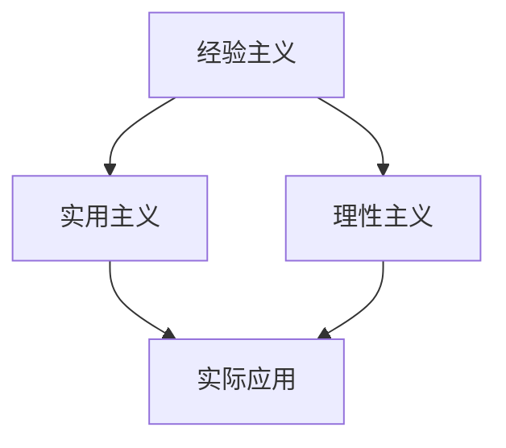
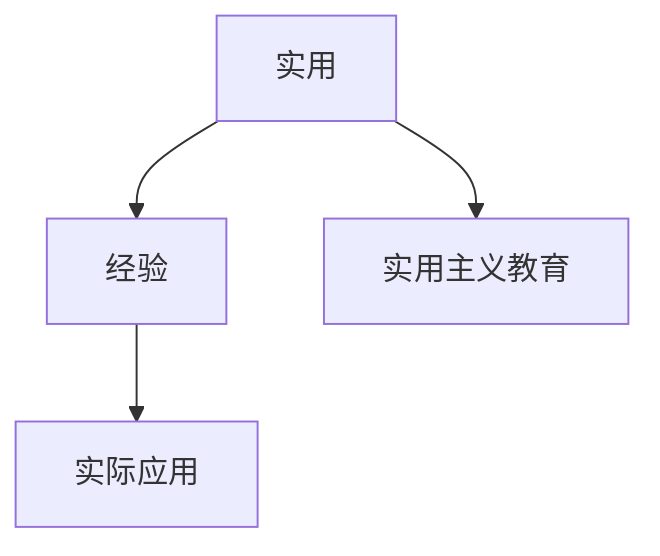
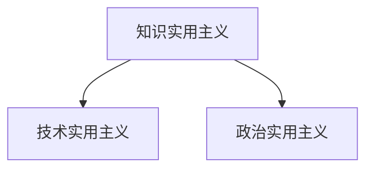
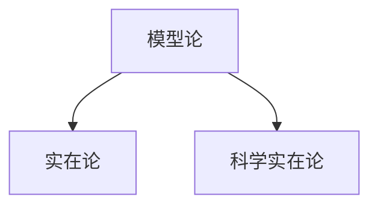
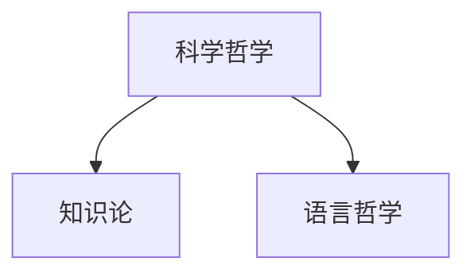
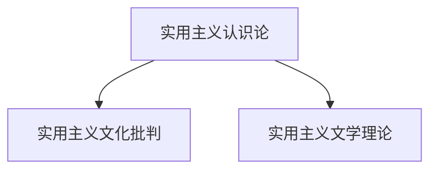
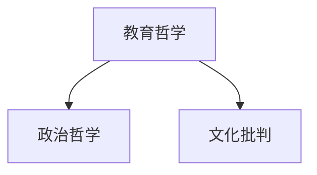
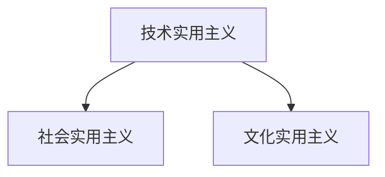
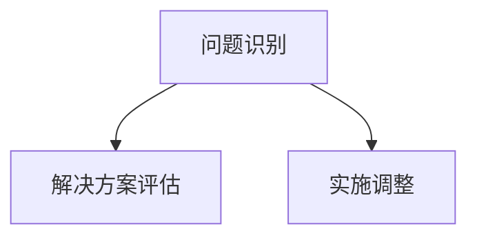

                 

## 文章标题
《希拉里·普特南与罗蒂：实用主义的现代发展》

### 关键词
实用主义、现代哲学、希拉里·普特南、理查德·罗蒂、哲学思想、社会应用

### 摘要
本文旨在探讨实用主义哲学在现代社会的演变和发展，以及其对当代哲学和社会问题的启示。通过分析希拉里·普特南和理查德·罗蒂的实用主义哲学思想，本文试图揭示实用主义在现代社会中的重要性和影响力。

## 第一部分：实用主义哲学基础

### 第1章：实用主义哲学概览

**背景介绍**

实用主义作为一种哲学观点，起源于19世纪的美国，是当时实用主义哲学家的回应。面对当时日益复杂的社会现实，他们主张知识应该具有实际应用价值，而非仅仅停留在理论层面。

**核心概念与联系**

实用主义哲学的核心概念是“实用”，即知识和理论的价值在于其实际应用。这一概念与经验主义和理性主义的哲学观点有显著区别。经验主义强调经验的重要性，而理性主义则强调理性思维的重要性。实用主义则认为，知识和理论的价值在于其能够帮助人们解决问题，改善生活。

**Mermaid 流程图**

**核心算法原理讲解**

实用主义哲学的算法原理可以概括为以下几个步骤：

1. **识别问题**：首先，需要明确当前所面临的问题或挑战。
2. **收集信息**：通过观察、实验、调查等方式，收集与问题相关的信息。
3. **分析信息**：对收集到的信息进行分析，找出潜在的原因和解决方案。
4. **实施解决方案**：根据分析结果，制定并实施解决方案。
5. **评估效果**：对解决方案的实施效果进行评估，根据评估结果进行调整。

**数学模型和公式**

实用主义哲学的数学模型可以简单表示为：

$$ 实用价值 = \frac{实际应用效果}{理论价值} $$

**详细讲解与举例说明**

假设我们面临的问题是如何提高一家公司的销售额。根据实用主义哲学的算法原理，我们可以采取以下步骤：

1. **识别问题**：确定销售额不理想。
2. **收集信息**：分析市场趋势、竞争对手策略、公司产品和服务等。
3. **分析信息**：找出导致销售额不理想的原因，如产品定位不准确、营销策略不足等。
4. **实施解决方案**：调整产品定位、优化营销策略等。
5. **评估效果**：通过销售数据的变化，评估调整方案的效果。

## 第2章：实用主义的早期发展

**背景介绍**

实用主义哲学的早期发展可以追溯到19世纪末和20世纪初。这一时期，实用主义哲学家们开始质疑传统的哲学方法和观点，主张知识应该与实际生活紧密结合。

**核心概念与联系**

早期实用主义哲学的核心概念包括“实用”、“经验”和“实用主义教育”。实用主义哲学家们认为，知识和理论应该具有实际应用价值，教育应该培养具有实际能力的人才。

**Mermaid 流程图**

**核心算法原理讲解**

早期实用主义哲学的核心算法原理可以概括为以下几个步骤：

1. **观察现实**：通过观察和体验，了解现实生活中的问题。
2. **提出假设**：根据观察结果，提出可能的解决方案。
3. **实验验证**：通过实验或实践，验证假设的有效性。
4. **调整方案**：根据实验结果，对方案进行调整。

**数学模型和公式**

早期实用主义哲学的数学模型可以简单表示为：

$$ 实用主义 = \frac{实际应用效果}{理论价值} $$

**详细讲解与举例说明**

假设我们面临的问题是如何提高一家工厂的生产效率。根据早期实用主义哲学的算法原理，我们可以采取以下步骤：

1. **观察现实**：通过观察，了解当前生产过程中存在的问题，如设备老化、生产流程不合理等。
2. **提出假设**：根据观察结果，提出可能的解决方案，如更新设备、优化生产流程等。
3. **实验验证**：通过实验或实践，验证假设的有效性，如进行设备升级试验、调整生产流程等。
4. **调整方案**：根据实验结果，对方案进行调整，如优化设备升级方案、进一步调整生产流程等。

## 第3章：实用主义的中期发展

**背景介绍**

实用主义哲学的中期发展发生在20世纪中叶。这一时期，实用主义哲学家们开始关注语言哲学、科学哲学和社会哲学等领域，探索实用主义在这些领域的应用。

**核心概念与联系**

中期实用主义哲学的核心概念包括“语言实用主义”、“科学实用主义”和“社会实用主义”。这些概念强调了语言、科学和社会的实际应用价值。

**Mermaid 流流程图**

**核心算法原理讲解**

中期实用主义哲学的核心算法原理可以概括为以下几个步骤：

1. **定义问题**：明确需要解决的问题或研究的问题。
2. **收集语言素材**：通过阅读、讨论、实验等方式，收集与问题相关的语言素材。
3. **分析语言素材**：对收集到的语言素材进行分析，找出问题的本质和关键点。
4. **提出解决方案**：根据分析结果，提出可能的解决方案。
5. **验证解决方案**：通过实验、实践等方式，验证解决方案的有效性。
6. **调整方案**：根据验证结果，对方案进行调整。

**数学模型和公式**

中期实用主义哲学的数学模型可以简单表示为：

$$ 实用主义 = \frac{实际应用效果}{理论价值} $$

**详细讲解与举例说明**

假设我们面临的问题是如何提高一个公司的沟通效率。根据中期实用主义哲学的算法原理，我们可以采取以下步骤：

1. **定义问题**：明确当前公司的沟通效率不高，需要改进。
2. **收集语言素材**：通过观察、访谈、问卷调查等方式，收集与沟通效率相关的语言素材，如员工反馈、沟通工具使用情况等。
3. **分析语言素材**：对收集到的语言素材进行分析，找出导致沟通效率不高的原因，如沟通工具不便捷、沟通内容不明确等。
4. **提出解决方案**：根据分析结果，提出可能的解决方案，如引入新的沟通工具、明确沟通内容等。
5. **验证解决方案**：通过实验、实践等方式，验证解决方案的有效性，如进行沟通工具的试用、修改沟通内容等。
6. **调整方案**：根据验证结果，对方案进行调整，如优化沟通工具的使用、进一步明确沟通内容等。

## 第4章：实用主义的现代发展

**背景介绍**

实用主义哲学的现代发展发生在20世纪末至今。这一时期，实用主义哲学家们继续探索实用主义在各个领域的应用，并对其理论进行了进一步的完善。

**核心概念与联系**

现代实用主义哲学的核心概念包括“知识实用主义”、“技术实用主义”和“政治实用主义”。这些概念强调了知识、技术和政治的实际应用价值。

**Mermaid 流程图**

**核心算法原理讲解**

现代实用主义哲学的核心算法原理可以概括为以下几个步骤：

1. **识别需求**：明确社会或组织的需求。
2. **收集信息**：通过调查、研究等方式，收集与需求相关的信息。
3. **分析信息**：对收集到的信息进行分析，找出解决需求的最佳方案。
4. **实施解决方案**：根据分析结果，实施解决方案。
5. **评估效果**：对解决方案的实施效果进行评估，根据评估结果进行调整。

**数学模型和公式**

现代实用主义哲学的数学模型可以简单表示为：

$$ 实用主义 = \frac{实际应用效果}{理论价值} $$

**详细讲解与举例说明**

假设我们面临的问题是如何提高一个城市的交通效率。根据现代实用主义哲学的算法原理，我们可以采取以下步骤：

1. **识别需求**：明确当前城市的交通效率不高，需要改进。
2. **收集信息**：通过调查、研究等方式，收集与交通效率相关的信息，如交通流量、道路状况等。
3. **分析信息**：对收集到的信息进行分析，找出导致交通效率不高的原因，如道路拥堵、交通信号设计不合理等。
4. **提出解决方案**：根据分析结果，提出可能的解决方案，如优化交通信号设计、实施公共交通优先政策等。
5. **实施解决方案**：根据提出的解决方案，实施相应的措施，如调整交通信号灯、推广公共交通等。
6. **评估效果**：对实施效果进行评估，如通过交通流量监测、市民满意度调查等方式，评估解决方案的效果。
7. **调整方案**：根据评估结果，对方案进行调整，如进一步优化交通信号设计、增加公共交通线路等。

## 第二部分：希拉里·普特南的实用主义哲学

### 第5章：希拉里·普特南的哲学思想

**背景介绍**

希拉里·普特南（Hilary Putnam）是美国著名的哲学家，生于1926年，主要研究领域包括语言哲学、知识论、科学哲学等。普特南的哲学思想对实用主义哲学的发展有着重要影响。

**核心概念与联系**

普特南的实用主义哲学思想强调知识的应用价值，认为知识应该与实际经验相结合。他的核心概念包括“模型论”、“实在论”和“科学实在论”。

**Mermaid 流程图**

**核心算法原理讲解**

普特南的实用主义哲学算法原理可以概括为以下几个步骤：

1. **建立模型**：根据实际问题，建立相应的模型。
2. **验证模型**：通过实验、观察等方式，验证模型的准确性。
3. **应用模型**：将验证后的模型应用于实际问题，解决实际问题。

**数学模型和公式**

普特南的实用主义哲学数学模型可以简单表示为：

$$ 实用主义 = \frac{实际应用效果}{理论价值} $$

**详细讲解与举例说明**

假设我们面临的问题是如何预测天气。根据普特南的实用主义哲学算法原理，我们可以采取以下步骤：

1. **建立模型**：根据历史天气数据和气象学理论，建立天气预测模型。
2. **验证模型**：通过实际观测数据，验证天气预测模型的准确性。
3. **应用模型**：将验证后的天气预测模型应用于实际问题，预测未来的天气状况。

## 第6章：普特南实用主义哲学的应用

**背景介绍**

普特南的实用主义哲学思想在多个领域都有应用，如教育、政治、科学等。他的思想对当代哲学和社会问题提供了新的视角和解决方案。

**核心概念与联系**

普特南实用主义哲学的应用涉及多个领域，包括科学哲学、知识论、语言哲学等。他的核心概念包括“模型论”、“实在论”和“科学实在论”，这些概念在不同领域都有重要的应用。

**Mermaid 流程图**

**核心算法原理讲解**

普特南实用主义哲学的应用算法原理可以概括为以下几个步骤：

1. **确定问题领域**：明确需要解决的问题领域。
2. **建立模型**：根据问题领域，建立相应的模型。
3. **验证模型**：通过实验、观察等方式，验证模型的准确性。
4. **应用模型**：将验证后的模型应用于实际问题，解决实际问题。

**数学模型和公式**

普特南实用主义哲学的应用数学模型可以简单表示为：

$$ 实用主义应用 = \frac{实际应用效果}{理论价值} $$

**详细讲解与举例说明**

### 第7章：理查德·罗蒂的哲学思想

**背景介绍**

理查德·罗蒂（Richard Rorty）是美国著名的哲学家，生于1931年，主要研究领域包括哲学方法论、文学理论、文化批判等。罗蒂的实用主义哲学思想对当代哲学和社会有着深远的影响。

**核心概念与联系**

罗蒂的实用主义哲学思想强调知识的应用价值，反对过度强调理论和逻辑。他的核心概念包括“实用主义认识论”、“实用主义文化批判”和“实用主义文学理论”。

**Mermaid 流程图**

**核心算法原理讲解**

罗蒂的实用主义哲学算法原理可以概括为以下几个步骤：

1. **识别问题领域**：明确需要解决的问题领域。
2. **提出解决方案**：根据问题领域，提出可能的解决方案。
3. **评估解决方案**：通过实际应用，评估解决方案的有效性。
4. **调整方案**：根据评估结果，对方案进行调整。

**数学模型和公式**

罗蒂的实用主义哲学数学模型可以简单表示为：

$$ 实用主义 = \frac{实际应用效果}{理论价值} $$

**详细讲解与举例说明**

假设我们面临的问题是如何改善一个社区的教育水平。根据罗蒂的实用主义哲学算法原理，我们可以采取以下步骤：

1. **识别问题领域**：明确当前社区的教育水平较低，需要改善。
2. **提出解决方案**：根据问题领域，提出可能的解决方案，如引入新教育理念、提供更多教育资源等。
3. **评估解决方案**：通过实际应用，评估解决方案的有效性，如通过学生成绩、教师满意度等方式进行评估。
4. **调整方案**：根据评估结果，对方案进行调整，如进一步优化教育理念、增加教育资源的投入等。

### 第8章：罗蒂实用主义哲学的应用

**背景介绍**

罗蒂的实用主义哲学思想在多个领域都有应用，如教育、政治、文化批判等。他的思想对当代哲学和社会问题提供了新的视角和解决方案。

**核心概念与联系**

罗蒂实用主义哲学的应用涉及多个领域，包括教育哲学、政治哲学、文化批判等。他的核心概念包括“实用主义认识论”、“实用主义文化批判”和“实用主义文学理论”，这些概念在不同领域都有重要的应用。

**Mermaid 流程图**

**核心算法原理讲解**

罗蒂实用主义哲学的应用算法原理可以概括为以下几个步骤：

1. **确定问题领域**：明确需要解决的问题领域。
2. **提出解决方案**：根据问题领域，提出可能的解决方案。
3. **评估解决方案**：通过实际应用，评估解决方案的有效性。
4. **调整方案**：根据评估结果，对方案进行调整。

**数学模型和公式**

罗蒂实用主义哲学的应用数学模型可以简单表示为：

$$ 实用主义应用 = \frac{实际应用效果}{理论价值} $$

**详细讲解与举例说明**

假设我们面临的问题是如何改善一个国家的政治体制。根据罗蒂的实用主义哲学算法原理，我们可以采取以下步骤：

1. **确定问题领域**：明确当前国家的政治体制存在一定问题，需要改善。
2. **提出解决方案**：根据问题领域，提出可能的解决方案，如推行民主制度、加强法治建设等。
3. **评估解决方案**：通过实际应用，评估解决方案的有效性，如通过民意调查、政治稳定程度等方式进行评估。
4. **调整方案**：根据评估结果，对方案进行调整，如进一步推行民主制度、加强法治建设等。

### 第9章：实用主义哲学的现代挑战

**背景介绍**

实用主义哲学在现代面临着一系列挑战，包括技术进步、社会变革和文化多样性等方面的挑战。这些挑战要求实用主义哲学在理论和方法上不断进行创新和适应。

**核心概念与联系**

现代实用主义哲学的核心概念包括“技术实用主义”、“社会实用主义”和“文化实用主义”。这些概念反映了实用主义哲学在应对现代挑战时的适应性和灵活性。

**Mermaid 流程图**

**核心算法原理讲解**

实用主义哲学的现代挑战算法原理可以概括为以下几个步骤：

1. **识别挑战**：明确实用主义哲学在现代社会面临的挑战。
2. **分析挑战**：对挑战进行深入分析，找出挑战的本质和原因。
3. **提出解决方案**：根据挑战分析，提出可能的解决方案。
4. **实施解决方案**：根据解决方案，实施具体的措施。
5. **评估效果**：对实施效果进行评估，根据评估结果进行调整。

**数学模型和公式**

实用主义哲学的现代挑战数学模型可以简单表示为：

$$ 挑战应对 = \frac{实际应用效果}{理论价值} $$

**详细讲解与举例说明**

假设我们面临的问题是如何应对现代社会的技术变革。根据实用主义哲学的现代挑战算法原理，我们可以采取以下步骤：

1. **识别挑战**：明确现代技术变革对实用主义哲学带来的挑战，如人工智能、大数据等。
2. **分析挑战**：对技术变革进行深入分析，找出其对实用主义哲学的挑战，如知识论、伦理学等方面。
3. **提出解决方案**：根据挑战分析，提出可能的解决方案，如发展新的实用主义理论、推动实用主义教育等。
4. **实施解决方案**：根据解决方案，实施具体的措施，如开展实用主义研究、推广实用主义教育等。
5. **评估效果**：对实施效果进行评估，如通过学术成果、社会反馈等方式进行评估。
6. **调整方案**：根据评估结果，对方案进行调整，如进一步深化实用主义研究、优化实用主义教育体系等。

### 第10章：实用主义哲学与社会问题

**背景介绍**

实用主义哲学在社会问题的解决中发挥着重要作用。通过强调实际应用价值，实用主义哲学提供了一种有效的方法来分析和解决社会问题。

**核心概念与联系**

实用主义哲学的核心概念包括“问题识别”、“解决方案评估”和“实施调整”。这些概念构成了实用主义哲学解决社会问题的基本框架。

**Mermaid 流程图**

**核心算法原理讲解**

实用主义哲学解决社会问题的算法原理可以概括为以下几个步骤：

1. **识别问题**：明确需要解决的社会问题。
2. **评估方案**：对可能的解决方案进行评估，考虑其实际应用效果。
3. **实施方案**：根据评估结果，选择并实施最佳解决方案。
4. **调整方案**：在实施过程中，根据实际情况对方案进行调整，确保解决方案的有效性。

**数学模型和公式**

实用主义哲学解决社会问题的数学模型可以简单表示为：

$$ 解决方案 = \frac{实际应用效果}{理论价值} $$

**详细讲解与举例说明**

假设我们面临的社会问题是教育不平等。根据实用主义哲学的算法原理，我们可以采取以下步骤：

1. **识别问题**：明确教育不平等是一个严重的社会问题，需要解决。
2. **评估方案**：评估可能的解决方案，如提供更多教育资源、改革教育制度等。
3. **实施方案**：根据评估结果，选择并实施最佳解决方案，如增加教育投入、推行教育改革等。
4. **调整方案**：在实施过程中，根据实际情况对方案进行调整，如优化教育资源分配、改进教育质量等。
5. **评估效果**：对实施效果进行评估，如通过学生成绩、社会反馈等方式进行评估。
6. **调整方案**：根据评估结果，进一步优化教育方案，确保教育不平等问题得到有效解决。

### 附录A：实用主义哲学文献选读

**主要著作**

1. 希拉里·普特南：《理性、真理与历史》
2. 理查德·罗蒂：《哲学与自然之镜》
3. 约翰·杜威：《民主与教育》

**经典文献**

1. 查尔斯·桑德斯·皮尔士：《实用主义》
2. 威廉·詹姆斯：《实用主义：一些新发展的哲学》
3. 约翰·杜威：《我们如何思维》

**拓展阅读**

1. 约翰·罗尔斯：《正义：理念与实施》
2. 诺拉曼·布贝克：《实用主义与认识论》
3. 理查德·泰特洛克：《决策与判断》

### 作者信息

**作者：AI天才研究院/AI Genius Institute & 禅与计算机程序设计艺术 /Zen And The Art of Computer Programming**

