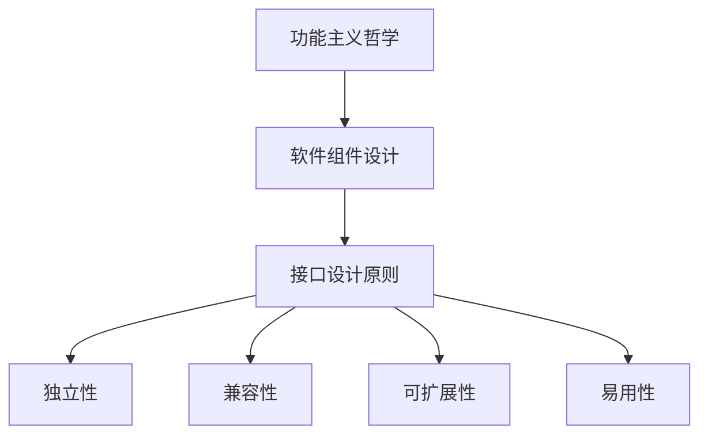
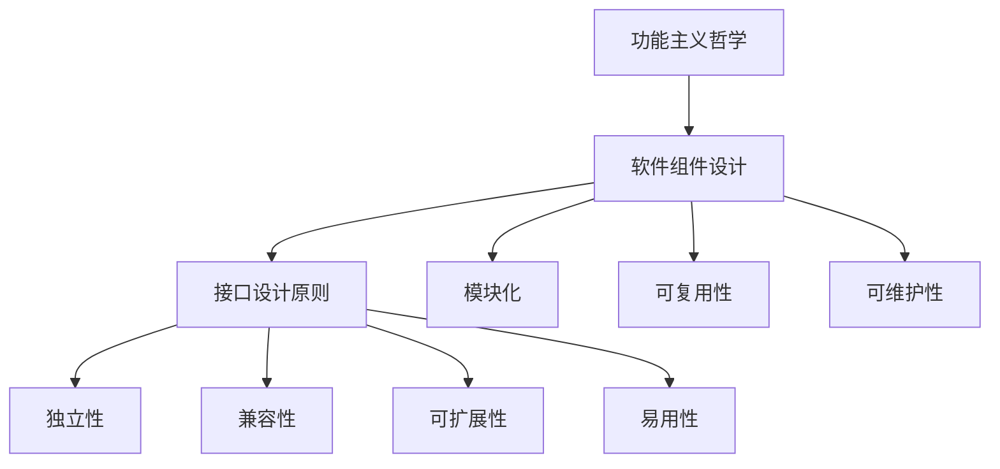
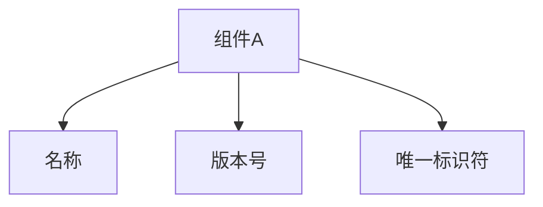
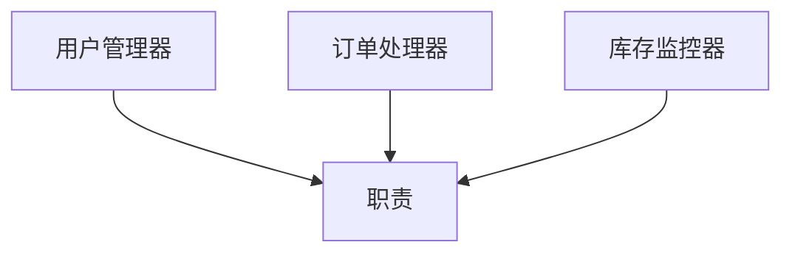
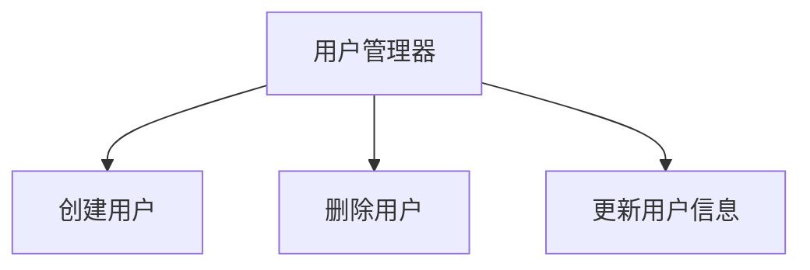
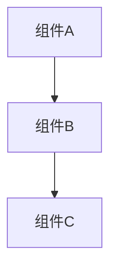
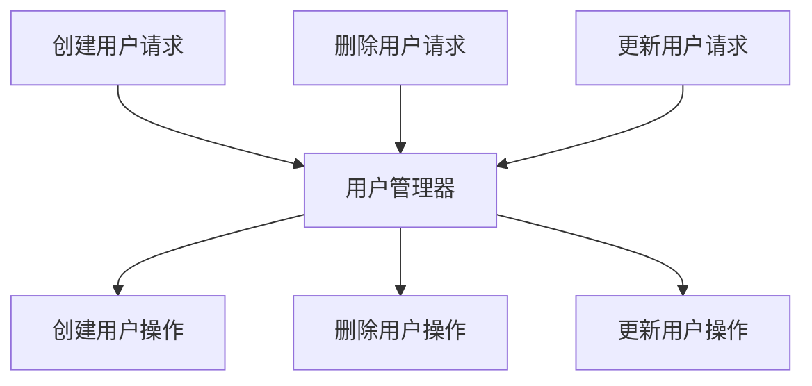

                 


## 文章标题

《希拉里·普特南的功能主义与接口设计：软件组件的哲学定义》

## 关键词

- 希拉里·普特南
- 功能主义
- 软件组件
- 接口设计
- 哲学定义
- 软件工程

## 摘要

本文将探讨计算机科学领域中的一个重要哲学概念——功能主义，以及其如何影响软件组件的接口设计。通过介绍功能主义的基本原理，我们将深入理解其在软件工程中的应用，特别是如何指导接口设计和软件组件的分类。本文还将通过实例分析，展示功能主义与接口设计的结合，并探讨其在软件工程实践中的挑战与解决方案。最终，我们将总结本文的核心观点，并对未来软件组件设计的发展趋势进行展望。

## 第1章：引言与核心概念

### 1.1.1 书籍主题介绍

《希拉里·普特南的功能主义与接口设计：软件组件的哲学定义》旨在探讨功能主义哲学在软件组件接口设计中的应用。本书的核心主题是功能主义如何指导软件工程师设计高效的软件组件，以及如何通过哲学定义提高软件组件的可复用性和可维护性。

### 1.1.2 核心概念与联系

**功能主义哲学**是一种关于事物如何运作的哲学理论，强调功能和行为的重要性。在计算机科学中，功能主义被用于解释软件组件的设计原则和交互方式。

**接口设计**是软件工程中的一个关键概念，指的是定义软件组件之间如何相互交互的规范。良好的接口设计可以促进软件的模块化和可复用性。

### 1.1.3 功能主义在接口设计中的应用

功能主义在接口设计中的应用体现在以下几个方面：

1. **明确组件职责**：功能主义强调组件的职责和功能，这有助于设计清晰明确的接口。
2. **模块化**：功能主义鼓励将软件系统分解为功能模块，每个模块具有独立的功能，这有助于接口设计的模块化。
3. **可扩展性**：功能主义支持通过扩展组件的功能来适应新的需求，这要求接口设计具有灵活性。

### 1.1.4 接口设计的基本原则

接口设计需要遵循以下基本原则：

1. **独立性**：组件之间的接口应尽可能独立，以减少依赖性。
2. **兼容性**：接口设计应确保不同组件之间能够无缝交互。
3. **可扩展性**：接口设计应允许新的组件或功能动态集成到系统中。
4. **易用性**：接口设计应尽量简单直观，降低使用难度。

### 1.1.5 功能主义与接口设计的关系

功能主义与接口设计的关系可以通过以下Mermaid流程图来展示：



通过这个流程图，我们可以看到功能主义如何通过指导接口设计原则来影响软件组件的设计。

### 1.1.6 小结

本章介绍了本书的核心主题和概念，包括功能主义哲学、接口设计以及它们在软件组件设计中的应用。通过理解这些概念，读者将为后续章节中的深入探讨打下坚实的基础。

## 第2章：功能主义哲学与软件组件设计

### 2.1 功能主义哲学的基本原理

#### 2.1.1 普特南功能主义的主要观点

希拉里·普特南（Hilary Putnam）是功能主义哲学的重要代表人物。他提出的功能主义观点主要包括以下几个方面：

1. **状态依赖性**：功能主义认为，一个系统的行为取决于其组成部分的状态和相互关系。
2. **功能角色**：功能主义强调每个组件在其系统中的角色和职责，而不是其物理形态。
3. **行为主义**：功能主义倾向于关注系统的外部行为，而不是内部结构。

#### 2.1.2 功能主义的适用范围和局限性

功能主义在计算机科学中得到了广泛应用，尤其是在软件组件设计领域。其适用范围包括：

1. **软件工程**：功能主义提供了设计软件组件的基本原则，有助于模块化和可维护性。
2. **人工智能**：功能主义为人工智能系统提供了一种理解和设计的方法。
3. **网络协议**：功能主义在设计和实现网络协议时，有助于确保系统的高效性和稳定性。

然而，功能主义也存在一些局限性：

1. **抽象层次**：功能主义可能过于关注系统内部的功能，而忽视了更高层次的系统架构。
2. **行为解释**：功能主义在解释系统行为时可能存在歧义，特别是当系统行为与预期不一致时。

#### 2.1.3 功能主义在软件组件设计中的重要性

功能主义在软件组件设计中的重要性体现在以下几个方面：

1. **职责划分**：通过功能主义，可以明确每个组件的职责，有助于设计模块化的软件系统。
2. **可复用性**：功能主义支持组件的可复用性，因为组件的职责和功能是独立的。
3. **可维护性**：功能主义有助于提高软件系统的可维护性，因为组件的修改不会影响到整个系统。

### 2.2 功能主义在软件组件设计中的应用

#### 2.2.1 功能主义在接口设计中的重要性

接口设计是软件组件设计的关键环节，功能主义在其中发挥着重要作用。功能主义指导接口设计的重要性包括：

1. **明确职责**：通过功能主义，可以明确每个组件的职责，这有助于设计清晰明确的接口。
2. **模块化**：功能主义支持模块化设计，使得软件组件可以独立开发和测试。
3. **可扩展性**：功能主义支持组件的扩展和替换，使得软件系统可以适应新的需求。

#### 2.2.2 功能主义指导下的接口设计原则

在功能主义的指导下，接口设计应遵循以下原则：

1. **独立性**：接口设计应确保组件之间的依赖性尽可能低，以提高系统的模块化程度。
2. **兼容性**：接口设计应确保不同组件之间能够无缝交互，以支持系统的灵活性和可扩展性。
3. **可扩展性**：接口设计应允许新的组件或功能动态集成到系统中，以支持系统的长期发展。
4. **易用性**：接口设计应尽量简单直观，降低使用难度，以提高开发效率和用户体验。

#### 2.2.3 功能主义与接口设计的关系

功能主义与接口设计的关系可以用以下Mermaid流程图表示：



通过这个流程图，我们可以看到功能主义如何通过指导接口设计原则来影响软件组件的设计。

### 2.3 功能主义与软件工程实践

#### 2.3.1 功能主义如何指导软件开发过程

功能主义在软件开发过程中的应用体现在以下几个方面：

1. **需求分析**：通过功能主义，可以更准确地理解用户需求，并将其转化为具体的组件和接口设计。
2. **系统设计**：功能主义支持模块化设计，有助于设计高效、可维护的软件系统。
3. **编码实现**：功能主义指导下的编码实现，有助于确保代码的模块化和可复用性。
4. **测试与调试**：功能主义支持自动化测试，有助于提高软件质量。

#### 2.3.2 功能主义在软件维护和升级中的应用

在软件维护和升级过程中，功能主义的应用体现在以下几个方面：

1. **组件替换**：通过功能主义，可以更容易地替换或扩展现有组件，以适应新的需求。
2. **版本控制**：功能主义支持版本控制，有助于管理和跟踪组件的修改和升级。
3. **安全性和可靠性**：功能主义有助于提高软件系统的安全性和可靠性，因为组件的修改不会影响到其他组件。

### 2.3.3 功能主义在软件工程实践中的挑战与解决方案

在软件工程实践中，功能主义面临着一些挑战，如：

1. **复杂性**：随着系统规模的扩大，功能主义的复杂性也会增加，可能导致设计和实现的困难。
2. **耦合性**：功能主义可能导致组件之间的耦合性增加，降低系统的可维护性。
3. **可测试性**：功能主义指导下的组件可能难以测试，因为组件之间的交互复杂。

针对这些挑战，可以采取以下解决方案：

1. **分层设计**：通过分层设计，可以将功能主义的复杂性分解为更小的部分，降低系统的复杂性。
2. **松耦合**：通过松耦合设计，可以减少组件之间的依赖性，提高系统的可维护性。
3. **自动化测试**：通过自动化测试，可以确保功能主义指导下的组件能够高效地测试，提高软件质量。

### 2.3.4 小结

本章介绍了功能主义哲学的基本原理及其在软件组件设计中的应用。通过理解功能主义，我们可以更好地指导接口设计，提高软件系统的模块化、可复用性和可维护性。在接下来的章节中，我们将继续探讨软件组件的基本概念与分类，以及接口设计原则与方法。

## 第3章：软件组件的基本概念与分类

### 3.1 软件组件的定义

软件组件（Software Component）是软件工程中的一个基本概念，指的是具有特定功能、能够独立开发、测试和部署的软件单元。软件组件的定义可以从以下几个方面进行理解：

1. **功能独立性**：软件组件应具有独立的功能，能够完成特定的任务。
2. **模块化**：软件组件应具有模块化的特点，能够方便地与其他组件组合和替换。
3. **可复用性**：软件组件应具有较高的可复用性，能够在不同的项目中重复使用。
4. **可测试性**：软件组件应具有可测试性，能够方便地进行单元测试和集成测试。

### 3.2 软件组件的分类

软件组件可以根据不同的分类标准进行分类，常见的分类方式包括面向对象组件、模块化组件和服务导向组件。

#### 3.2.1 面向对象组件

面向对象组件是基于面向对象编程（OOP）概念的软件组件。面向对象组件的特点包括：

1. **封装**：组件的内部实现细节对外部隐藏，外部只能通过接口与组件交互。
2. **继承**：组件可以通过继承关系实现代码复用，降低系统的复杂度。
3. **多态**：组件可以实现多态，支持不同的行为和交互方式。

面向对象组件的典型应用场景包括图形用户界面（GUI）开发、Web应用开发和游戏开发等。

#### 3.2.2 模块化组件

模块化组件是基于模块化编程概念的软件组件。模块化组件的特点包括：

1. **模块化**：组件被划分为多个模块，每个模块实现特定的功能。
2. **独立性**：模块之间相互独立，模块内部的变化不会影响到其他模块。
3. **可替换性**：模块可以被方便地替换或扩展，以适应不同的需求。

模块化组件的典型应用场景包括嵌入式系统开发、分布式系统开发和大型企业级应用开发等。

#### 3.2.3 服务导向组件

服务导向组件是基于服务导向架构（SOA）概念的软件组件。服务导向组件的特点包括：

1. **服务导向**：组件以服务的形式提供服务，服务之间通过接口进行通信。
2. **松耦合**：组件之间通过接口进行通信，降低了组件之间的耦合性。
3. **可扩展性**：组件可以方便地扩展和替换，以适应不断变化的需求。

服务导向组件的典型应用场景包括企业级应用集成、云计算和大数据处理等。

### 3.3 软件组件的生命周期管理

软件组件的生命周期管理是指从组件的创建、部署、运行、维护到卸载的全过程管理。生命周期管理对于确保组件的稳定性、可维护性和可复用性至关重要。

#### 3.3.1 组件的创建

组件的创建包括以下几个方面：

1. **需求分析**：根据系统需求确定组件的功能和接口。
2. **设计**：根据需求设计组件的内部结构和接口。
3. **编码**：根据设计实现组件的代码。

#### 3.3.2 组件的部署

组件的部署包括以下几个方面：

1. **环境准备**：为组件部署准备合适的环境，包括操作系统、数据库、中间件等。
2. **安装**：将组件安装到目标环境中，配置组件的运行参数。
3. **测试**：对部署的组件进行测试，确保其正常运行。

#### 3.3.3 组件的运行

组件的运行包括以下几个方面：

1. **启动**：启动组件，使其进入运行状态。
2. **监控**：监控组件的运行状态，包括性能、资源使用等。
3. **维护**：定期对组件进行维护和升级，确保其稳定运行。

#### 3.3.4 组件的维护

组件的维护包括以下几个方面：

1. **问题排查**：发现并解决组件运行中出现的问题。
2. **性能优化**：对组件的性能进行优化，提高其运行效率。
3. **安全加固**：对组件进行安全加固，防止潜在的安全威胁。

#### 3.3.5 组件的卸载

组件的卸载包括以下几个方面：

1. **停服**：停止组件的运行，使其进入停服状态。
2. **清理**：清理组件在运行过程中产生的数据和资源。
3. **回收**：回收组件所占用的资源，如内存、文件等。

### 3.3.6 小结

本章介绍了软件组件的基本概念和分类，包括面向对象组件、模块化组件和服务导向组件。同时，还介绍了软件组件的生命周期管理，包括创建、部署、运行、维护和卸载。通过理解这些概念，读者可以更好地理解软件组件的设计原则和生命周期管理，为后续的接口设计和应用实践提供理论基础。

## 第4章：软件组件接口设计原则与方法

### 4.1 接口设计的基本原则

接口设计是软件组件设计中的关键环节，其质量直接影响软件系统的稳定性、可维护性和可扩展性。良好的接口设计应遵循以下基本原则：

#### 4.1.1 独立性

独立性原则要求接口设计时，应确保组件之间的接口相互独立，降低组件之间的耦合度。具体实现方法包括：

1. **最小化依赖**：尽量减少组件之间的依赖关系，避免一个组件的变化导致其他组件的修改。
2. **接口抽象**：通过接口抽象，将具体的实现细节与接口分离，使组件之间的交互仅通过接口进行。
3. **独立版本化**：为每个组件制定独立的版本号，当组件内部发生修改时，其他组件不需要进行相应的修改。

#### 4.1.2 兼容性

兼容性原则要求接口设计时应考虑到系统的多样性，确保不同组件之间能够无缝交互。具体实现方法包括：

1. **标准化**：遵循业界标准和规范，确保组件之间的接口兼容。
2. **版本兼容**：为接口设计提供版本兼容性，当接口发生变更时，旧版本接口仍然可用。
3. **兼容性测试**：在接口设计过程中，进行充分的兼容性测试，确保不同组件之间的交互正常。

#### 4.1.3 可扩展性

可扩展性原则要求接口设计时，应考虑到系统的长期发展，确保组件能够方便地扩展和替换。具体实现方法包括：

1. **扩展接口**：设计可扩展的接口，允许新功能动态集成到系统中。
2. **插件机制**：引入插件机制，使组件可以方便地加载和卸载插件。
3. **模块化设计**：将组件划分为多个模块，每个模块实现特定的功能，便于扩展和替换。

#### 4.1.4 易用性

易用性原则要求接口设计时应尽量简化使用难度，提高开发效率和用户体验。具体实现方法包括：

1. **简洁性**：设计简洁明了的接口，避免过于复杂的参数和功能。
2. **文档化**：提供详细的接口文档，包括接口的功能描述、参数说明和使用示例。
3. **友好的错误处理**：设计友好的错误处理机制，使开发者能够快速定位和解决问题。

### 4.2 接口设计的实践方法

接口设计的实践方法包括面向对象接口设计、模块化接口设计和服务导向接口设计。

#### 4.2.1 面向对象接口设计

面向对象接口设计基于面向对象编程（OOP）的概念，通过接口抽象和封装，实现组件之间的独立性和可复用性。具体步骤如下：

1. **需求分析**：分析系统需求，确定组件的功能和接口。
2. **接口设计**：根据需求设计接口，包括类定义、属性和方法。
3. **实现**：根据接口设计实现组件的代码，确保接口与实现的一致性。
4. **测试**：对接口进行测试，确保其正确性和稳定性。

#### 4.2.2 模块化接口设计

模块化接口设计基于模块化编程的概念，通过模块化和独立版本化，实现组件之间的低耦合和高扩展性。具体步骤如下：

1. **模块划分**：根据功能需求，将组件划分为多个模块。
2. **接口设计**：为每个模块设计独立的接口，确保模块之间的依赖性最小。
3. **模块实现**：实现每个模块的代码，确保模块之间的接口调用正确。
4. **模块测试**：对每个模块进行独立测试，确保其功能和接口的稳定性。

#### 4.2.3 服务导向接口设计

服务导向接口设计基于服务导向架构（SOA）的概念，通过服务导向和松耦合，实现组件之间的灵活性和可扩展性。具体步骤如下：

1. **服务划分**：根据功能需求，将组件划分为多个服务。
2. **接口设计**：为每个服务设计独立的接口，确保服务之间的松耦合。
3. **服务实现**：实现每个服务的代码，确保服务接口与实现的一致性。
4. **服务注册与发现**：实现服务注册与发现机制，使服务能够动态地加载和卸载。

### 4.3 接口设计的案例分析

以下是一个简单的接口设计案例分析，用于说明接口设计原则和方法。

#### 案例背景

假设我们正在开发一个电子商务系统，需要设计一个商品服务接口，用于处理商品信息的查询、添加、修改和删除操作。

#### 接口设计

1. **需求分析**：分析商品服务的基本功能，包括查询商品信息、添加商品、修改商品和删除商品。
2. **接口设计**：设计商品服务接口，包括以下方法：

   ```java
   public interface IProductService {
       // 查询商品信息
       Product getProductById(Long productId);
       
       // 添加商品
       void addProduct(Product product);
       
       // 修改商品
       void updateProduct(Product product);
       
       // 删除商品
       void deleteProduct(Long productId);
   }
   ```

3. **实现**：根据接口设计实现商品服务代码。

4. **测试**：对商品服务接口进行测试，确保接口的功能正确。

#### 接口测试

1. **查询商品信息**：调用`getProductById`方法，传入一个有效的商品ID，验证返回的商品信息是否正确。
2. **添加商品**：调用`addProduct`方法，传入一个商品对象，验证商品是否成功添加到数据库。
3. **修改商品**：调用`updateProduct`方法，传入一个商品对象，验证商品信息是否成功更新。
4. **删除商品**：调用`deleteProduct`方法，传入一个有效的商品ID，验证商品是否成功从数据库中删除。

### 4.4 小结

本章介绍了软件组件接口设计的基本原则和方法，包括独立性、兼容性、可扩展性和易用性原则，以及面向对象接口设计、模块化接口设计和服务导向接口设计方法。通过实际案例的分析，展示了接口设计原则和方法的应用。理解接口设计原则和方法对于软件工程师来说至关重要，有助于提高软件系统的稳定性、可维护性和可扩展性。

## 第5章：软件组件的哲学定义

### 5.1 软件组件哲学定义的重要性

软件组件哲学定义的重要性在于，它不仅为我们提供了一种理解软件组件的方式，还为我们设计和管理软件系统提供了指导原则。通过哲学定义，我们可以更好地理解软件组件的本质，从而设计出更高效、更可维护的软件系统。

#### 5.1.1 理解软件组件的本质

哲学定义帮助我们理解软件组件的本质，包括组件的职责、角色、依赖关系和行为。具体来说：

1. **职责**：软件组件的职责是其最基本的功能，它定义了组件应完成的具体任务。
2. **角色**：软件组件在系统中的角色决定了其与其他组件的交互方式。
3. **依赖关系**：软件组件之间的依赖关系影响了系统的稳定性和可维护性。
4. **行为**：软件组件的行为定义了其对外部事件的响应和处理方式。

#### 5.1.2 哲学定义对软件设计的影响

哲学定义对软件设计的影响主要体现在以下几个方面：

1. **模块化**：通过哲学定义，可以更清晰地划分软件组件的职责和角色，从而实现模块化设计。
2. **可复用性**：哲学定义有助于设计可复用的组件，因为组件的职责和角色是独立的。
3. **可维护性**：哲学定义有助于提高软件系统的可维护性，因为组件的修改不会影响到其他组件。

### 5.2 软件组件哲学定义的内容

软件组件哲学定义的内容包括以下几个方面：

1. **身份**：软件组件的身份定义了其在系统中的唯一标识，它是组件识别和管理的基础。
2. **角色**：软件组件的角色定义了其在系统中的职责和功能，它是组件设计和管理的关键。
3. **职责**：软件组件的职责定义了其应完成的具体任务，它是组件功能实现的基础。
4. **依赖关系**：软件组件的依赖关系定义了其与其他组件的交互方式，它是系统稳定性和可维护性的关键。
5. **行为**：软件组件的行为定义了其对外部事件的响应和处理方式，它是组件功能实现的核心。

#### 5.2.1 身份

软件组件的身份是其唯一标识，通常由一组属性组成，如组件名称、版本号和唯一标识符。身份的定义有助于系统管理员和开发人员识别和定位组件。



#### 5.2.2 角色

软件组件的角色定义了其在系统中的职责和功能。角色可以是单一的，也可以是复合的。复合角色由多个简单角色组成，如用户管理器、订单处理器和库存监控器。



#### 5.2.3 职责

软件组件的职责定义了其应完成的具体任务。职责通常与角色相关联，是角色实现的具体体现。例如，用户管理器的职责包括创建用户、删除用户和更新用户信息。



#### 5.2.4 依赖关系

软件组件的依赖关系定义了其与其他组件的交互方式。依赖关系可以是单向的，也可以是双向的。单向依赖表示一个组件依赖于另一个组件，而双向依赖表示两个组件相互依赖。



#### 5.2.5 行为

软件组件的行为定义了其对外部事件的响应和处理方式。行为可以通过接口、事件和回调等方式实现。例如，用户管理器可以接收创建用户、删除用户和更新用户信息的请求，并相应地执行操作。



### 5.3 软件组件哲学定义的应用

软件组件哲学定义的应用主要体现在以下几个方面：

1. **组件设计**：哲学定义指导组件设计，确保组件的职责和角色明确，降低组件之间的耦合度。
2. **组件管理**：哲学定义指导组件管理，帮助开发人员和管理人员更好地理解组件的功能和行为。
3. **组件复用**：哲学定义指导组件复用，确保组件的可复用性和可维护性。

### 5.4 小结

本章介绍了软件组件哲学定义的重要性及其内容，包括身份、角色、职责、依赖关系和行为。通过哲学定义，我们可以更好地理解软件组件的本质，从而设计出更高效、更可维护的软件系统。哲学定义的应用不仅指导组件设计，还帮助开发人员和管理人员更好地理解组件的功能和行为，提高软件系统的整体质量。

## 第6章：软件组件的哲学分析与设计

### 6.1 软件组件的哲学分析

软件组件的哲学分析是理解软件组件本质和功能的关键步骤。它涉及到对组件的角色、职责、依赖关系和行为进行深入的分析和思考。哲学分析有助于确保软件组件的设计符合功能主义的原则，从而提高系统的模块化、可复用性和可维护性。

#### 6.1.1 组件角色的分析

组件的角色是指其在系统中的功能定位和职责。通过哲学分析，我们可以明确组件的角色，以便设计出具有明确职责和功能的组件。具体步骤如下：

1. **需求分析**：首先，分析系统的需求，确定组件应具备的功能。
2. **角色定义**：根据需求，为每个组件定义其角色，例如用户管理器、订单处理器和数据库连接器。
3. **角色验证**：验证角色的定义是否合理，确保每个角色都能明确地完成特定的任务。

#### 6.1.2 组件职责的分析

组件的职责是指其应完成的具体任务。职责分析是哲学分析的核心步骤，它决定了组件的功能实现。具体步骤如下：

1. **职责分解**：将系统的功能分解为多个具体的任务，为每个任务分配相应的组件。
2. **职责定义**：为每个组件定义其职责，确保职责明确且与角色一致。
3. **职责验证**：验证职责的定义是否合理，确保组件能够高效地完成其职责。

#### 6.1.3 组件依赖关系的分析

组件的依赖关系是指组件之间的交互和影响。依赖关系分析有助于降低组件之间的耦合度，提高系统的可维护性。具体步骤如下：

1. **依赖识别**：识别组件之间的依赖关系，包括直接依赖和间接依赖。
2. **依赖分类**：将依赖关系分类，例如功能依赖、数据依赖和事件依赖。
3. **依赖优化**：优化依赖关系，减少不必要的依赖，确保系统的高内聚和低耦合。

#### 6.1.4 组件行为的分析

组件的行为是指其对外部事件的响应和处理。行为分析有助于确保组件的响应及时且合理。具体步骤如下：

1. **行为描述**：描述组件的行为，包括事件处理、数据交互和功能调用。
2. **行为验证**：验证组件的行为是否符合预期，确保组件能够正确地处理外部事件。
3. **行为优化**：优化组件的行为，提高系统的响应速度和效率。

### 6.2 软件组件设计方法论

软件组件设计方法论是一种系统化、结构化的设计方法，它通过一系列的步骤和原则，帮助开发人员设计出高效、可复用和可维护的软件组件。以下是常用的软件组件设计方法论：

#### 6.2.1 功能驱动设计（FDD）

功能驱动设计是一种以功能为核心的设计方法，它通过定义功能、组件和模块，实现软件系统的模块化设计。具体步骤如下：

1. **功能识别**：识别系统的功能需求，为每个功能创建功能说明。
2. **组件定义**：根据功能需求，为每个功能分配相应的组件。
3. **模块划分**：将组件划分为多个模块，确保模块之间的低耦合和高内聚。
4. **模块实现**：实现每个模块的代码，确保模块功能的实现。

#### 6.2.2 组件驱动设计（CBD）

组件驱动设计是一种以组件为核心的设计方法，它通过定义组件、接口和依赖关系，实现软件系统的模块化设计。具体步骤如下：

1. **组件识别**：识别系统的组件需求，为每个组件创建组件说明。
2. **接口定义**：根据组件需求，为每个组件定义接口，确保组件之间的低耦合。
3. **依赖管理**：管理组件之间的依赖关系，确保系统的可维护性。
4. **组件实现**：实现每个组件的代码，确保组件接口与实现的一致性。

#### 6.2.3 服务驱动设计（SDD）

服务驱动设计是一种以服务为核心的设计方法，它通过定义服务、接口和交互方式，实现软件系统的模块化设计。具体步骤如下：

1. **服务识别**：识别系统的服务需求，为每个服务创建服务说明。
2. **接口定义**：根据服务需求，为每个服务定义接口，确保服务之间的松耦合。
3. **交互方式**：定义服务之间的交互方式，例如同步调用、异步调用和事件驱动。
4. **服务实现**：实现每个服务的代码，确保服务接口与实现的一致性。

### 6.3 软件组件设计的挑战与解决方案

软件组件设计过程中可能遇到一系列挑战，如复杂性、耦合性、可维护性和可扩展性等。以下是一些常见的挑战及其解决方案：

#### 6.3.1 复杂性

复杂性是软件组件设计中的一个重要挑战，它可能导致设计难以理解和维护。解决方案如下：

1. **分层设计**：通过分层设计，将系统划分为多个层次，降低各层的复杂性。
2. **模块化**：通过模块化设计，将复杂的系统分解为多个独立的模块，降低整体复杂性。
3. **抽象**：通过抽象，将具体的实现细节隐藏在接口之后，降低系统的复杂性。

#### 6.3.2 耦合性

耦合性是软件组件设计中的另一个重要挑战，它可能导致系统难以维护和扩展。解决方案如下：

1. **接口设计**：通过良好的接口设计，降低组件之间的耦合度。
2. **依赖管理**：通过依赖管理，确保组件之间的依赖关系是必需且合理的。
3. **设计模式**：通过使用设计模式，解决组件之间的耦合问题，提高系统的可维护性和可扩展性。

#### 6.3.3 可维护性

可维护性是软件组件设计中的一个关键挑战，它影响系统的长期稳定性和可靠性。解决方案如下：

1. **测试**：通过自动化测试，确保组件的正确性和稳定性。
2. **文档**：通过良好的文档，确保组件的接口、职责和行为是明确和可理解的。
3. **重构**：通过重构，优化组件的设计和实现，提高系统的可维护性。

#### 6.3.4 可扩展性

可扩展性是软件组件设计中的一个重要挑战，它影响系统的适应性和灵活性。解决方案如下：

1. **接口设计**：通过可扩展的接口设计，确保组件能够方便地添加新的功能和特性。
2. **插件机制**：通过插件机制，使系统能够动态地加载和卸载插件。
3. **模块化设计**：通过模块化设计，将系统划分为多个模块，每个模块负责特定的功能，提高系统的可扩展性。

### 6.4 小结

本章介绍了软件组件的哲学分析方法和设计方法论，包括角色分析、职责分析、依赖关系分析、行为分析以及功能驱动设计、组件驱动设计和服务驱动设计。同时，还讨论了软件组件设计过程中可能遇到的挑战及其解决方案。通过本章的内容，读者可以更好地理解软件组件的哲学分析方法和设计方法论，为实际项目中的组件设计提供指导。

## 第7章：软件组件的实际应用案例

### 7.1 案例背景介绍

本节将通过一个具体的案例，展示功能主义与接口设计在软件组件设计中的实际应用。案例背景是一个电子商务平台，该平台需要支持商品管理、订单管理和用户管理等功能。

#### 7.1.1 需求分析

电子商务平台的需求包括：

1. **商品管理**：支持商品的查询、添加、修改和删除。
2. **订单管理**：支持订单的查询、添加、修改和删除。
3. **用户管理**：支持用户的注册、登录、信息查询和密码修改。

#### 7.1.2 功能分解

根据需求分析，我们可以将系统功能分解为以下组件：

1. **商品服务组件**：负责商品信息的查询、添加、修改和删除。
2. **订单服务组件**：负责订单信息的查询、添加、修改和删除。
3. **用户服务组件**：负责用户信息的查询、注册、登录和修改。

### 7.2 案例分析与设计

#### 7.2.1 商品服务组件设计

商品服务组件的职责是管理商品信息，其接口设计如下：

```java
public interface IProductService {
    // 查询商品信息
    Product getProductById(Long productId);
    
    // 添加商品
    void addProduct(Product product);
    
    // 修改商品
    void updateProduct(Product product);
    
    // 删除商品
    void deleteProduct(Long productId);
}
```

商品服务组件的实现如下：

```java
public class ProductService implements IProductService {
    private ProductRepository productRepository;
    
    @Override
    public Product getProductById(Long productId) {
        return productRepository.findById(productId);
    }
    
    @Override
    public void addProduct(Product product) {
        productRepository.save(product);
    }
    
    @Override
    public void updateProduct(Product product) {
        productRepository.update(product);
    }
    
    @Override
    public void deleteProduct(Long productId) {
        productRepository.delete(productId);
    }
}
```

#### 7.2.2 订单服务组件设计

订单服务组件的职责是管理订单信息，其接口设计如下：

```java
public interface IOrderService {
    // 查询订单信息
    Order getOrderById(Long orderId);
    
    // 添加订单
    void addOrder(Order order);
    
    // 修改订单
    void updateOrder(Order order);
    
    // 删除订单
    void deleteOrder(Long orderId);
}
```

订单服务组件的实现如下：

```java
public class OrderService implements IOrderService {
    private OrderRepository orderRepository;
    
    @Override
    public Order getOrderById(Long orderId) {
        return orderRepository.findById(orderId);
    }
    
    @Override
    public void addOrder(Order order) {
        orderRepository.save(order);
    }
    
    @Override
    public void updateOrder(Order order) {
        orderRepository.update(order);
    }
    
    @Override
    public void deleteOrder(Long orderId) {
        orderRepository.delete(orderId);
    }
}
```

#### 7.2.3 用户服务组件设计

用户服务组件的职责是管理用户信息，其接口设计如下：

```java
public interface IUserService {
    // 注册用户
    void registerUser(User user);
    
    // 登录用户
    boolean login(String username, String password);
    
    // 查询用户信息
    User getUserById(Long userId);
    
    // 修改用户信息
    void updateUser(User user);
}
```

用户服务组件的实现如下：

```java
public class UserService implements IUserService {
    private UserRepository userRepository;
    
    @Override
    public void registerUser(User user) {
        userRepository.save(user);
    }
    
    @Override
    public boolean login(String username, String password) {
        return userRepository.existsByUsernameAndPassword(username, password);
    }
    
    @Override

```markdown
## 第8章：总结与展望

### 8.1 本书内容的总结

本书系统地介绍了功能主义哲学在软件组件设计中的应用，包括功能主义的基本原理、接口设计原则、软件组件的分类、生命周期管理、哲学定义及其在软件工程实践中的挑战与解决方案。通过实际应用案例的分析，展示了功能主义与接口设计如何指导软件组件的设计与实现。

- **功能主义哲学**：介绍了普特南功能主义的基本观点，以及其在软件组件设计中的应用，强调了功能和行为的重要性。
- **接口设计原则**：详细阐述了独立性、兼容性、可扩展性和易用性原则，以及面向对象、模块化和服务导向接口设计的实践方法。
- **软件组件分类**：分析了面向对象组件、模块化组件和服务导向组件的特点，以及它们在软件工程中的应用。
- **生命周期管理**：探讨了软件组件的生命周期管理，包括创建、部署、运行、维护和卸载的过程。
- **哲学定义**：介绍了软件组件哲学定义的内容和重要性，包括身份、角色、职责、依赖关系和行为。
- **哲学分析与设计**：讲解了软件组件的哲学分析方法和设计方法论，以及应对设计过程中挑战的解决方案。
- **实际应用案例**：通过电子商务平台案例，展示了功能主义与接口设计在软件组件设计中的实际应用。

### 8.2 未来发展趋势

未来软件组件设计的发展趋势将受到以下几个方面的影响：

- **智能化与自动化**：随着人工智能和机器学习技术的不断发展，软件组件设计将变得更加智能化和自动化，从而提高开发效率和质量。
- **云计算与分布式系统**：云计算和分布式系统的广泛应用，将推动软件组件设计的模块化和分布式化，以适应大规模数据处理和高可用性的需求。
- **微服务架构**：微服务架构的兴起，将使软件组件设计更加灵活和可扩展，有助于应对快速变化的市场需求。
- **容器化与Kubernetes**：容器化和Kubernetes技术的普及，将使软件组件的部署和管理更加高效和灵活，有助于实现持续集成和持续部署。
- **DevOps文化**：DevOps文化的推广，将促进软件组件设计过程中的协作和沟通，提高软件开发的效率和稳定性。

总之，未来软件组件设计将更加注重智能化、自动化、模块化和分布式化，以适应快速变化的技术环境和市场需求。同时，DevOps文化的推广和容器化技术的发展，也将为软件组件设计带来新的机遇和挑战。

### 8.3 小结

本书通过对功能主义哲学和接口设计的深入探讨，为软件组件设计提供了系统的方法和指导原则。通过实际应用案例的分析，展示了功能主义与接口设计在软件组件设计中的实际应用。未来，随着技术的不断发展，软件组件设计将迎来新的挑战和机遇。希望读者能够结合本书的内容，不断探索和实践，为软件组件设计的发展贡献自己的力量。

## 作者

作者：AI天才研究院/AI Genius Institute & 禅与计算机程序设计艺术 /Zen And The Art of Computer Programming

