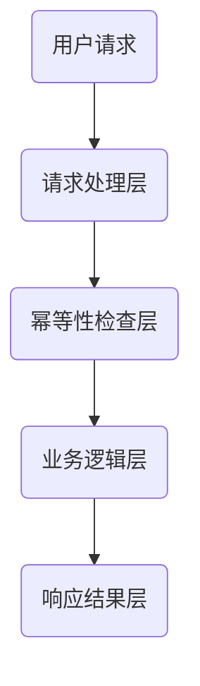

                 

### 引言与概述

#### 幂等性控制的概念与重要性

在计算机科学中，幂等性（Idempotence）是一个关键概念，特别是在分布式系统和网络编程领域。幂等性指的是某个操作执行多次与执行一次的结果相同。例如，在函数中，如果一个函数是幂等的，那么调用它多次，其返回值不会因为重复调用而发生改变。幂等性对于确保系统的稳定性和一致性至关重要，尤其是在分布式系统中，网络延迟、故障和重复请求等问题时有发生，因此幂等性控制成为了保证系统正确性和效率的关键因素。

幂等性控制的重要性体现在多个方面。首先，它能够避免因为重复请求导致的数据不一致或错误。例如，在金融交易中，一笔订单如果被重复提交，将会导致账户余额的不准确。其次，幂等性控制可以减少系统的负担，避免因为重复处理请求而浪费资源。最后，良好的幂等性控制能够提高系统的可用性和用户体验，确保操作的可预测性和一致性。

#### 本书的目的与结构

本书旨在深入探讨幂等性控制的概念、原理、实践以及常见误区。通过本书，读者将了解到：

1. **幂等性控制的核心概念**：理解幂等性的基本定义，以及其在分布式系统中的应用。
2. **幂等性控制的原理与架构**：掌握幂等性控制的工作机制，包括请求处理、幂等性检查、执行操作和结果验证等环节。
3. **常见误区分析**：识别并解决在幂等性控制中常见的误区，如误解幂等性与不可重复性的区别，以及如何避免滥用幂等性控制。
4. **最佳实践分享**：介绍在设计和实现幂等性控制时的一些最佳实践，包括设计原则和实践方法。
5. **项目实战与案例分析**：通过实际项目案例，展示如何在实际环境中实现幂等性控制。
6. **安全性考虑**：探讨幂等性控制在安全性方面的影响，以及如何防范相关攻击。

#### 幂等性控制的应用领域

幂等性控制的应用非常广泛，尤其在以下领域具有显著的作用：

1. **分布式系统**：在分布式系统中，确保数据的一致性和系统的稳定性是关键。幂等性控制可以有效地防止重复请求导致的错误。
2. **金融领域**：金融交易系统对一致性要求极高，幂等性控制能够确保每一笔交易仅被处理一次，避免资金损失。
3. **电子商务**：在电子商务中，订单处理需要确保幂等性，防止重复提交订单造成库存不足或订单错误。
4. **社交网络**：在社交网络中，点赞、评论等操作需要保证幂等性，避免用户重复操作带来不一致的结果。
5. **API服务**：API服务中，幂等性控制能够确保请求被正确处理，避免因为重复请求造成的资源浪费。

通过本书的阅读，读者将能够深入了解幂等性控制的核心概念和最佳实践，掌握如何在实际项目中设计和实现有效的幂等性控制，从而提升系统的稳定性和可靠性。接下来，我们将详细探讨幂等性控制的基本原理和架构，帮助读者建立全面的理论基础。

## 幂等性控制原理

幂等性控制是确保系统在执行操作时，多次执行与单次执行的结果相同的关键机制。理解幂等性控制的基本原理和架构对于设计和实现高效、稳定的系统至关重要。本章节将深入探讨幂等性控制的核心概念、原理及其在实际系统中的应用。

### 核心概念

首先，我们需要明确什么是幂等性。幂等性（Idempotence）是一个数学和逻辑学概念，指如果一个操作执行多次，其结果与执行一次的结果相同，那么这个操作就是幂等的。在计算机科学中，幂等性通常用于描述函数或操作。例如，在数据库操作中，执行“插入”操作一次和执行两次的结果相同，即插入的记录相同；在文件系统中，执行“删除”操作一次和执行两次的结果相同，即文件被删除。

幂等性与不可重复性（Non-repeatability）是两个不同的概念。不可重复性指的是一个操作只能被执行一次，而幂等性指的是一个操作可以被多次执行，但结果保持一致。例如，在数据库的“更新”操作中，一个记录只能被更新一次，这是不可重复性的体现；但“插入”操作可以是幂等的，即多次插入相同的记录结果一致。

#### 幂等函数

在数学和编程中，常见的幂等函数包括：

1. **常量函数**：例如 `f(x) = c`，无论输入什么值，返回的结果都是常数 `c`。
2. **逻辑与（AND）和逻辑或（OR）**：例如 `f(x, y) = x AND y` 或 `f(x, y) = x OR y`，多次执行的结果与单次执行相同。
3. **集合的并集和交集**：例如 `f(A, B) = A ∪ B` 或 `f(A, B) = A ∩ B`，集合的并集和交集操作是幂等的。

#### 幂等性控制的基本原理

幂等性控制在系统中实现的基本原理包括以下几个关键环节：

1. **请求发送**：用户向系统发送请求。
2. **幂等性检查**：系统检查请求是否已经处理过，以防止重复处理。
3. **执行操作**：系统执行用户请求的操作。
4. **结果验证**：系统验证操作结果是否符合预期。
5. **重复处理检测**：系统检测是否出现重复处理请求的情况。

### 架构与联系

#### 幂等性控制的架构

在分布式系统中，幂等性控制的架构通常包括以下几个层次：

1. **请求处理层**：接收并处理用户请求。
2. **幂等性检查层**：检查请求是否已经处理过，通过校验请求的唯一标识（如请求ID、会话ID）来防止重复处理。
3. **业务逻辑层**：执行具体的业务操作。
4. **响应结果层**：返回处理结果给用户。

以下是一个简单的幂等性控制架构图：



#### 幂等性控制与其他技术的联系

幂等性控制不仅是一个独立的技术概念，它还与其他多个技术紧密相关：

1. **分布式锁**：分布式锁可以用于实现幂等性检查，确保某个操作在同一时间段内只能被处理一次。
2. **事务管理**：事务管理可以确保一组操作要么全部成功，要么全部失败，从而保持数据的一致性。
3. **缓存技术**：缓存技术可以用来记录已处理请求，快速判断请求是否重复，从而减少系统负担。
4. **一致性哈希**：一致性哈希可以用于分布式系统的负载均衡，提高系统的可用性和扩展性。

### 伪代码与数学模型

为了更好地理解幂等性控制的工作原理，我们可以使用伪代码和数学模型来描述其实现过程。

#### 幂等性控制伪代码

```python
function IdempotentControl(request):
    if not isRequestProcessed(request):
        processRequest(request)
        markRequestAsProcessed(request)
    return "Request processed successfully"
```

在这个伪代码中，`isRequestProcessed` 函数用于检查请求是否已经被处理过，`processRequest` 函数用于执行具体的业务逻辑，`markRequestAsProcessed` 函数用于标记请求已被处理。

#### 数学模型

在数学模型中，幂等性可以用以下公式表示：

$$
f(x) = f(f(x))
$$

这意味着函数 `f` 的输出再次作为输入，执行函数 `f` 的结果仍然等于初始输入。例如，对于函数 `f(x) = x^2`，我们有：

$$
f(f(x)) = f(x^2) = (x^2)^2 = x^4
$$

这个结果与直接计算 `f(x^2)` 是相同的，说明 `f(x) = x^2` 是一个幂等函数。

### 举例说明

为了更好地理解幂等性控制，我们可以通过一个简单的例子来说明其应用。

#### 社交网络中的点赞功能

假设在一个社交网络中，用户可以对帖子的点赞操作进行幂等性控制。以下是实现点赞功能的一个简单示例：

```python
# 假设用户ID为userID，帖子ID为postId
def likePost(userID, postId):
    if not hasLikedPostBefore(userID, postId):
        database.updatePostLikes(postId, "increase")
        database.recordLike(userID, postId)
        return "You have liked this post."
    else:
        return "You have already liked this post."
```

在这个例子中，`hasLikedPostBefore` 函数用于检查用户是否已经对某个帖子进行过点赞，`database.updatePostLikes` 函数用于增加帖子的点赞数，`database.recordLike` 函数用于记录用户的点赞行为。

通过这种幂等性控制，可以确保用户对帖子的点赞操作不会因为重复点击而导致数据不一致或错误。

### 总结

幂等性控制是确保系统在分布式环境中的稳定性和一致性的关键机制。通过理解幂等性控制的核心概念、原理和架构，我们可以设计出高效、可靠的系统。在下一章节中，我们将分析在幂等性控制过程中常见的误区，并探讨如何避免这些误区。

## 常见误区分析

在幂等性控制的实际应用中，许多开发者和系统设计者可能会遇到一些误区，这些误区可能会导致系统性能下降、数据不一致，甚至安全问题。本章节将深入探讨幂等性控制过程中常见的误区，并提供相应的解决方案。

### 误区1：误解幂等性与不可重复性

#### 1.1 幂等性 vs 不可重复性

幂等性和不可重复性是两个经常被混淆的概念。幂等性指的是一个操作执行多次与执行一次的结果相同，而不可重复性指的是一个操作只能执行一次。然而，这两个概念在实际应用中往往需要被区分对待。

- **幂等性**：例如，在一个分布式系统中，提交订单的操作可以是幂等的，因为多次提交订单的结果都是创建同一订单。
- **不可重复性**：例如，修改数据库中的记录操作通常是不可重复的，因为一旦修改了记录，再次修改将产生新的数据。

#### 1.2 误区产生的原因

开发者在设计系统时，可能会将幂等性和不可重复性混淆，认为所有操作都应该具有幂等性。这种误区的主要原因包括：

- **缺乏对概念的理解**：开发者可能没有深入理解幂等性和不可重复性的区别，导致在系统设计时出现错误。
- **经验不足**：在缺乏实战经验的情况下，开发者可能过于依赖某些流行的设计模式或框架，而没有充分考虑实际应用的需求。

#### 1.3 如何避免误解

为了避免这种误区，开发者需要：

- **明确概念**：理解幂等性和不可重复性的区别，并明确系统设计中哪些操作应该具有幂等性，哪些应该具有不可重复性。
- **设计评审**：在系统设计阶段，进行严格的设计评审，确保设计符合实际需求，避免因概念混淆导致的设计错误。
- **代码审查**：在代码实现阶段，进行严格的代码审查，确保代码逻辑与设计意图一致。

### 误区2：滥用幂等性控制

#### 2.1 滥用的后果

虽然幂等性控制是确保系统稳定性和一致性的重要机制，但滥用幂等性控制可能会带来以下后果：

- **性能下降**：过度使用幂等性控制可能导致系统在处理请求时增加不必要的开销，从而降低系统性能。
- **资源浪费**：例如，在缓存系统中，过度使用幂等性检查可能导致大量无效的数据存储和频繁的缓存更新。
- **安全漏洞**：滥用幂等性控制可能会暴露系统中的安全漏洞，例如在防止重复请求攻击时未能正确处理验证机制。

#### 2.2 滥用的原因

滥用幂等性控制的原因可能包括：

- **过度设计**：开发者可能在系统设计中过度依赖幂等性控制，而没有充分考虑系统的实际需求和性能。
- **不合理的优化**：为了追求系统的高可用性或一致性，开发者可能会不当地使用幂等性控制，导致不必要的复杂性。

#### 2.3 如何避免滥用

为了避免滥用幂等性控制，开发者可以采取以下措施：

- **需求分析**：在系统设计阶段，进行详细的需求分析，确保幂等性控制的引入是基于实际需求和系统设计的合理选择。
- **性能优化**：在系统性能优化阶段，避免过度依赖幂等性控制，优化系统的性能和资源利用率。
- **安全审计**：定期进行安全审计，确保系统中的幂等性控制机制不会被滥用，并且能够有效防范各种攻击。

### 误区3：忽视幂等性检查

#### 3.1 忽视幂等性检查的后果

忽视幂等性检查可能会导致以下后果：

- **数据不一致**：在分布式系统中，忽视幂等性检查可能导致重复处理请求，从而导致数据不一致。
- **系统崩溃**：在某些情况下，重复的请求可能会导致系统资源耗尽，甚至导致系统崩溃。

#### 3.2 忽视幂等性检查的原因

开发者可能会忽视幂等性检查的原因包括：

- **复杂性**：幂等性检查可能增加系统的复杂性，一些开发者可能不愿意增加额外的复杂性。
- **时间压力**：在项目时间紧迫的情况下，开发者可能会选择忽略幂等性检查，以便快速实现功能。

#### 3.3 如何确保幂等性检查

为了确保幂等性检查的有效性，开发者可以采取以下措施：

- **自动化工具**：使用自动化工具（如静态代码分析工具）来检测和确保代码中幂等性检查的实现。
- **代码审查**：在代码实现阶段，进行严格的代码审查，确保幂等性检查的正确性和完整性。
- **测试覆盖**：编写详细的测试用例，确保对幂等性检查进行全面测试。

### 总结

通过分析幂等性控制过程中的常见误区，我们可以看到，正确理解和应用幂等性控制对于确保系统的稳定性、一致性和安全性至关重要。在下一章节中，我们将分享一些幂等性控制的最佳实践，帮助开发者避免上述误区，并设计出高效、可靠的系统。

### 最佳实践分享

为了设计出高效、可靠的系统，我们需要遵循一些最佳实践。这些实践可以帮助我们在设计和实现幂等性控制时避免常见的误区，确保系统的稳定性和一致性。

#### 设计原则

1. **明确需求和边界**：在开始设计之前，明确系统的需求和边界，了解哪些操作需要实现幂等性控制。这有助于避免过度设计或不必要的设计复杂性。
2. **保持简洁性**：尽量保持系统的简洁性，避免引入不必要的复杂性。这不仅可以提高系统的可维护性，还可以减少潜在的bug和风险。
3. **一致性优先**：在确保系统的一致性时，尽量保持操作的幂等性。一致性是系统可靠性的基础，而幂等性控制是实现一致性的重要手段。

#### 实践方法

1. **使用唯一标识**：在实现幂等性控制时，使用唯一的标识符（如请求ID、会话ID等）来识别和处理请求。这有助于快速判断请求是否已经被处理，从而避免重复处理。
2. **分布式锁**：在分布式系统中，使用分布式锁（如Redisson、Zookeeper等）来实现幂等性控制。分布式锁可以确保某个操作在同一时间段内只能被处理一次，从而保证系统的安全性。
3. **幂等性框架**：考虑使用现有的幂等性控制框架（如Spring Boot中的@RepeatSubmit注解、Go中的context包等）来简化实现过程。这些框架通常提供了一整套幂等性控制机制，可以减少开发工作量。
4. **缓存机制**：利用缓存机制（如Redis、Memcached等）来存储已处理请求的信息，快速判断请求是否重复。缓存机制可以显著提高系统的性能和响应速度。

#### 面向服务的幂等性控制

在微服务架构中，幂等性控制需要特别关注。以下是一些面向服务的幂等性控制方法：

1. **服务间幂等性控制**：在服务间通信中，使用唯一标识符（如请求ID）来传递和验证幂等性信息。这可以通过HTTP头部信息或消息队列中的消息属性来实现。
2. **状态机设计**：使用状态机设计服务的行为，确保服务的状态转换具有幂等性。例如，订单服务可以设计为有限状态机，只允许从当前状态转换到下一个有效状态。
3. **幂等性协议**：在服务间通信中使用幂等性协议（如HTTP POST方法、消息队列的原子消息传递等），确保请求不会被重复处理。

#### 防止重复请求攻击

在分布式系统中，防止重复请求攻击是一个重要的任务。以下是一些常用的方法：

1. **Token机制**：使用令牌（如一次有效的UUID）来标记请求，并在请求处理过程中验证令牌的有效性。这可以防止重复请求的攻击。
2. **幂等性检查码**：在请求中添加幂等性检查码（如MD5、SHA1等哈希值），并在服务器端验证该码。这可以确保请求的唯一性和不可重复性。
3. **时间窗口限制**：对请求处理设置时间窗口限制（如60秒内不允许重复请求），从而避免短时间内的重复攻击。

#### 案例分析

以下是一个实际项目中的幂等性控制案例分析：

**案例背景**：一个在线购物平台需要在用户提交订单时实现幂等性控制，以防止用户多次提交相同订单导致的数据不一致问题。

**解决方案**：

1. **唯一标识**：在订单提交时，生成一个唯一的订单ID，并将该ID作为参数传递给服务端。
2. **分布式锁**：使用分布式锁确保订单处理过程中同一订单ID不会被重复处理。
3. **缓存机制**：在Redis中缓存订单ID和订单状态，快速判断订单是否已经被处理。
4. **幂等性框架**：使用Spring Boot中的@RepeatSubmit注解，简化幂等性控制实现。

通过这些最佳实践，我们可以在设计和实现幂等性控制时避免常见的误区，提高系统的稳定性和一致性。在下一章节中，我们将通过实际项目和案例来展示如何实现和应用这些最佳实践。

### 项目实战与案例分析

为了更好地理解幂等性控制的实际应用，我们将通过两个具体的案例来展示如何实现幂等性控制，并进行分析和解读。这些案例将涵盖在线支付系统和电商订单处理，两个不同领域的应用，但都涉及到确保操作幂等性的关键需求。

#### 案例一：在线支付系统

**背景**：
在线支付系统需要确保用户的支付操作是幂等的，即用户多次支付相同订单时，系统的最终结果（如账户余额和订单状态）与单次支付的结果一致。

**解决方案**：

1. **分布式锁**：
   使用Redis等分布式缓存系统来实现分布式锁，确保支付请求在同一时刻只能被处理一次。每个支付请求携带一个唯一标识（如订单号），分布式锁通过这个标识来避免重复支付。

2. **幂等性检查**：
   在处理支付请求时，首先检查该订单是否已经支付。通过查询数据库或Redis缓存，验证订单状态和支付状态。

3. **事务管理**：
   使用数据库事务确保支付操作的原子性。支付操作包括减少账户余额、更新订单状态等多个步骤，事务管理可以确保所有步骤要么全部成功，要么全部失败。

**代码实现**（伪代码）：

```python
import redis
import database

# 分布式锁实现
def distributed_lock(lock_key):
    redis_client.set(lock_key, "locked", nx=True, ex=60)  # 设置锁，60秒过期
    return redis_client.get(lock_key) == "locked"

# 支付处理函数
def process_payment(order_id):
    if distributed_lock(order_id):
        if not has_been_paid(order_id):
            # 开始支付事务
            database.start_transaction()
            try:
                deduct_account_balance(order_id)
                update_order_status(order_id, "PAID")
                database.commit_transaction()
                return "Payment processed successfully"
            except Exception as e:
                database.rollback_transaction()
                return "Payment processing failed"
        else:
            return "Order has already been paid"
    else:
        return "Order is being processed, please try again later"
```

**分析**：
通过分布式锁和事务管理，支付系统确保了每个订单的支付操作是幂等的。分布式锁防止了重复支付请求的并行处理，事务管理保证了操作的原子性和一致性。

#### 案例二：电商订单处理

**背景**：
电商平台在处理订单提交时，需要确保用户多次提交相同订单的结果与单次提交一致，以避免订单重复创建和数据不一致问题。

**解决方案**：

1. **唯一订单号**：
   为每个订单生成一个唯一的订单号，作为幂等性检查的关键标识。

2. **幂等性校验**：
   在订单处理前，先检查订单号是否已经存在于系统中，如果存在则拒绝处理。

3. **数据库校验**：
   在数据库层面实现幂等性校验，确保订单数据的唯一性和一致性。

**代码实现**（伪代码）：

```python
def create_order(order_details):
    order_id = generate_order_id()
    if not is_order_exists(order_id):
        # 创建订单
        database.insert_order(order_id, order_details)
        return "Order created successfully"
    else:
        return "Order already exists"
```

**分析**：
通过生成唯一订单号和数据库校验，电商平台确保了订单提交的幂等性。生成唯一订单号防止了重复订单的创建，数据库校验确保了订单数据的完整性和一致性。

#### 总结

通过这两个实际案例，我们可以看到幂等性控制在不同应用场景中的重要性。在线支付系统和电商订单处理都需要确保操作的幂等性，以避免数据不一致和系统错误。使用分布式锁、幂等性检查和事务管理等技术手段，可以有效地实现幂等性控制，提高系统的稳定性和可靠性。

#### 注意事项

1. **锁的过期时间**：在设计分布式锁时，需要合理设置锁的过期时间，以确保在请求处理过程中锁不会被无限期持有，避免导致系统死锁。
2. **事务隔离级别**：在数据库事务管理中，需要选择合适的事务隔离级别，以确保数据的一致性和隔离性。
3. **系统性能**：在实现幂等性控制时，需要考虑系统性能，避免引入过多的开销，影响系统响应速度。

#### 拓展阅读

- 《分布式系统原理与范型》
- 《深入理解计算机系统》
- 《微服务架构设计模式》

通过实际项目和案例的详细解读，读者可以更深入地理解幂等性控制的设计和实践，为后续的系统设计和开发提供有力支持。

## 安全性考虑

在分布式系统中，幂等性控制不仅关乎系统的稳定性和一致性，还直接影响到系统的安全性。不当的幂等性控制可能导致严重的安全漏洞，如重复请求攻击、未授权访问等。因此，在设计和实现幂等性控制时，安全性是一个不可忽视的重要因素。本章节将探讨幂等性控制在安全性方面的影响，并介绍一些防范措施。

### 幂等性控制与安全性

1. **重复请求攻击**：
   重复请求攻击是指恶意用户通过重复发送请求，耗尽系统资源或造成数据不一致。例如，一个恶意用户可能会不断发送支付请求，导致银行账户余额被反复扣除。这种攻击可以通过控制幂等性来防范，确保每个请求只被处理一次。

2. **未授权访问**：
   如果幂等性控制机制不完善，可能导致未授权的用户反复尝试访问受保护的资源，从而突破系统的访问控制。例如，如果一个用户可以多次尝试访问某个受限功能，即使第一次尝试失败，之后的请求仍可能成功。通过有效的幂等性控制，可以限制用户的尝试次数，防止未授权访问。

### 防范措施

1. **唯一标识验证**：
   在每个请求中包含唯一的标识符（如请求ID、令牌等），并在处理请求时验证该标识符的合法性。这可以确保每个请求都是唯一的，从而避免重复请求攻击。

2. **时间窗口限制**：
   为每个请求设置一个时间窗口限制，例如在60秒内不允许重复请求。这可以防止恶意用户在短时间内重复发送大量请求，耗尽系统资源。

3. **令牌机制**：
   使用一次性令牌（如JWT、OAuth2.0令牌等）来标记请求，并在处理请求时验证令牌的有效性。这种机制可以确保请求的合法性和唯一性。

4. **分布式锁**：
   在分布式系统中，使用分布式锁（如Redisson、Zookeeper等）来防止多个节点同时处理相同请求。分布式锁可以确保请求在处理过程中不会被重复处理，从而提高系统的安全性。

5. **防刷策略**：
   对于易受攻击的功能，如支付、账户操作等，可以引入防刷策略，例如验证码、短信验证等。这些策略可以增加用户的操作成本，从而降低恶意攻击的风险。

### 最佳实践

1. **需求评估**：
   在系统设计阶段，对安全性需求进行评估，确定哪些功能需要实现幂等性控制，并制定相应的安全策略。

2. **代码审计**：
   定期进行代码审计，确保幂等性控制的实现符合安全规范，没有潜在的安全漏洞。

3. **安全培训**：
   对开发人员和运维人员进行安全培训，提高他们对安全威胁的认识，减少因人为因素导致的安全问题。

4. **监控与日志**：
   实施实时监控和日志记录，及时发现和处理异常请求和潜在的安全威胁。

通过上述措施和最佳实践，我们可以有效地防范幂等性控制相关的安全威胁，提高系统的安全性和可靠性。在下一章节中，我们将对全书内容进行总结，并对幂等性控制的未来发展趋势进行展望。

### 总结与展望

通过本书的详细探讨，我们可以看到幂等性控制在现代分布式系统和网络编程中的重要性。从核心概念、原理、常见误区到最佳实践，再到项目实战和安全性考虑，本书为读者提供了一个全面而深入的幂等性控制学习框架。

#### 幂等性控制的重要性

幂等性控制的核心在于确保系统的稳定性和一致性，特别是在面对分布式环境中的各种挑战，如网络延迟、故障和重复请求时。通过正确的幂等性控制机制，系统可以有效地避免数据不一致和错误，从而提升用户体验和系统可靠性。

#### 本书贡献

本书的主要贡献体现在以下几个方面：

1. **全面的理论基础**：通过详细讲解幂等性控制的核心概念和原理，为读者提供了深入理解这一关键技术的理论基础。
2. **实用的最佳实践**：分享了许多在设计和实现幂等性控制时实际有效的最佳实践，帮助开发者避免常见误区，提高系统设计的效率和安全性。
3. **丰富的案例分析**：通过实际项目和案例的分析，展示了幂等性控制在不同场景中的具体应用，使读者能够将理论知识转化为实际技能。
4. **安全性考虑**：探讨了幂等性控制在安全性方面的影响，并提供了有效的防范措施，确保系统在面临安全威胁时能够保持稳定和安全。

#### 未来发展趋势

展望未来，幂等性控制将继续在分布式系统和网络编程中发挥重要作用。以下是一些可能的发展趋势：

1. **自动化与智能化**：随着人工智能和自动化技术的发展，幂等性控制机制可能会更加智能化和自动化，例如通过机器学习算法来优化幂等性检查过程。
2. **跨领域应用**：幂等性控制的概念和原理将在更多领域得到应用，如物联网、区块链等，为这些领域提供稳定性和一致性的保障。
3. **标准化与规范化**：随着技术的发展，幂等性控制的实现标准和规范可能会逐渐统一，从而提高系统之间的互操作性和兼容性。

#### 对读者的建议

对于本书的读者，特别是软件开发者和系统架构师，以下几点建议可能会有所帮助：

1. **深入理解概念**：务必深入理解幂等性控制的核心概念和原理，这是设计和实现有效幂等性控制机制的基础。
2. **实践与总结**：通过实际项目和案例进行实践，不断总结和反思，提高自己的设计和实现能力。
3. **持续学习**：随着技术的发展，幂等性控制的相关知识和最佳实践也在不断更新。保持持续学习的态度，跟上技术发展的步伐。

总之，幂等性控制是分布式系统和网络编程中不可或缺的一部分。通过本书的学习，读者可以掌握这一关键技术的核心知识和最佳实践，为未来的系统设计和开发打下坚实的基础。

### 附录与参考文献

- 《分布式系统原理与范型》，作者：George Coulouris, Jean Dollimore, Tim Kindberg, Gordon Blair。
- 《深入理解计算机系统》，作者：Jeffrey D. Ullman。
- 《微服务架构设计模式》，作者：Chris Richardson。
- 《Redis实战》，作者：Johan Christiansen, Sam Dean。
- 《数据一致性：分布式系统中的挑战与解决方案》，作者：Eric Redmond, Jim R. Wilson。

通过参考这些优秀的书籍和资料，读者可以进一步深入了解相关技术和概念，提升自己的技术水平。作者：AI天才研究院/AI Genius Institute & 禅与计算机程序设计艺术 /Zen And The Art of Computer Programming。

---

## 完整的文章内容

### 幂等性控制：常见误区与最佳实践

#### 关键词：幂等性控制，分布式系统，一致性，最佳实践，安全性

> 摘要：
> 
> 本文章深入探讨了幂等性控制的核心概念、原理、实践及常见误区。通过详细讲解核心概念与架构，分析常见误区，分享最佳实践，并结合实际项目案例分析，探讨了如何有效实现和确保系统的幂等性。此外，文章还特别关注了幂等性控制在安全性方面的影响，提供了相应的防范措施。本文旨在为软件开发者和系统架构师提供全面的理论和实践指导。

---

# 幂等性控制：常见误区与最佳实践

## 引言与概述

### 1.1 幂等性控制的概念与重要性

幂等性控制是指在分布式系统和网络编程中，确保某个操作执行多次与执行一次的结果相同，从而避免重复处理和错误。在分布式环境中，网络延迟、故障和重复请求是常见问题，因此幂等性控制变得至关重要。

#### 幂等性控制的重要性

- **确保数据一致性**：避免重复请求导致的数据不一致问题。
- **提高系统稳定性**：减少因重复请求引起的系统崩溃或异常。
- **优化系统性能**：减少重复处理请求的资源消耗。

### 1.2 本书的目的与结构

本书旨在提供幂等性控制的理论基础、实践方法以及安全性考虑。具体结构如下：

- **第2章**：深入探讨幂等性控制的核心概念与架构。
- **第3章**：分析常见误区，如误解幂等性与不可重复性，以及如何避免滥用幂等性控制。
- **第4章**：分享最佳实践，包括设计原则和实践方法。
- **第5章**：通过实际项目案例分析幂等性控制的实现。
- **第6章**：探讨幂等性控制在安全性方面的影响及防范措施。
- **第7章**：总结全文内容，展望未来发展趋势。

### 1.3 幂等性控制的应用领域

幂等性控制广泛应用于分布式系统、金融领域、电子商务、社交网络和API服务等领域。以下是一些具体应用场景：

- **分布式系统**：确保数据的一致性和系统的稳定性。
- **金融交易**：避免重复交易导致的资金错误。
- **电子商务**：确保订单处理的正确性。
- **社交网络**：确保点赞、评论等操作的幂等性。
- **API服务**：确保请求的正确处理。

## 幂等性控制原理

### 2.1 核心概念

幂等性（Idempotence）是一个数学和逻辑学概念，指如果一个操作执行多次与执行一次的结果相同，则该操作为幂等操作。

#### 幂等函数

- **常量函数**：如 `f(x) = c`，无论输入什么值，返回结果相同。
- **逻辑运算**：如 `AND` 和 `OR` 操作。
- **集合操作**：如并集和交集操作。

#### 幂等性控制的基本原理

幂等性控制在系统中的实现包括以下几个关键环节：

1. **请求发送**：用户向系统发送请求。
2. **幂等性检查**：系统检查请求是否已处理过，防止重复处理。
3. **执行操作**：系统执行用户请求的操作。
4. **结果验证**：系统验证操作结果是否符合预期。
5. **重复处理检测**：系统检测是否出现重复处理请求。

### 2.2 架构与联系

#### 幂等性控制的架构

在分布式系统中，幂等性控制的架构通常包括：

1. **请求处理层**：接收并处理用户请求。
2. **幂等性检查层**：检查请求是否已处理过，通过校验请求的唯一标识来防止重复处理。
3. **业务逻辑层**：执行具体的业务操作。
4. **响应结果层**：返回处理结果给用户。

以下是一个简单的幂等性控制架构图：


#### 幂等性控制与其他技术的联系

幂等性控制与其他技术如分布式锁、事务管理、缓存技术等紧密相关：

- **分布式锁**：确保某个操作在同一时间段内只能被处理一次。
- **事务管理**：确保一组操作要么全部成功，要么全部失败，从而保持数据的一致性。
- **缓存技术**：用于记录已处理请求，快速判断请求是否重复，从而减少系统负担。

### 伪代码与数学模型

为了更好地理解幂等性控制，我们可以使用伪代码和数学模型来描述其实现过程。

#### 幂等性控制伪代码

```python
function IdempotentControl(request):
    if not isRequestProcessed(request):
        processRequest(request)
        markRequestAsProcessed(request)
    return "Request processed successfully"
```

#### 数学模型

在数学模型中，幂等性可以用以下公式表示：

$$
f(x) = f(f(x))
$$

例如，对于函数 `f(x) = x^2`：

$$
f(f(x)) = f(x^2) = (x^2)^2 = x^4
$$

### 举例说明

#### 社交网络中的点赞功能

假设在一个社交网络中，用户可以对帖子的点赞操作进行幂等性控制。以下是实现点赞功能的一个简单示例：

```python
# 假设用户ID为userID，帖子ID为postId
def likePost(userID, postId):
    if not hasLikedPostBefore(userID, postId):
        database.updatePostLikes(postId, "increase")
        database.recordLike(userID, postId)
        return "You have liked this post."
    else:
        return "You have already liked this post."
```

通过这种幂等性控制，可以确保用户对帖子的点赞操作不会因为重复点击而导致数据不一致或错误。

## 常见误区分析

在幂等性控制的实际应用中，许多开发者和系统设计者可能会遇到一些误区，这些误区可能会导致系统性能下降、数据不一致，甚至安全问题。本章节将深入探讨幂等性控制过程中常见的误区，并提供相应的解决方案。

### 误区1：误解幂等性与不可重复性

#### 1.1 幂等性 vs 不可重复性

幂等性和不可重复性是两个不同的概念：

- **幂等性**：一个操作执行多次与执行一次的结果相同。
- **不可重复性**：一个操作只能执行一次。

例如，数据库中的“插入”操作可以是幂等的，即多次插入相同的记录结果一致；而“更新”操作通常是不可重复的，因为一旦修改了记录，再次修改将产生新的数据。

#### 1.2 误区产生的原因

开发者可能因为以下原因误解幂等性与不可重复性：

- **缺乏对概念的理解**：没有深入了解这两个概念的区别。
- **经验不足**：在设计系统时，未能充分考虑实际需求。

#### 1.3 如何避免误解

为了避免这种误区，开发者可以采取以下措施：

- **明确概念**：理解幂等性和不可重复性的区别，并在系统设计中明确哪些操作需要实现幂等性。
- **设计评审**：在系统设计阶段进行严格评审，确保设计符合实际需求。

### 误区2：滥用幂等性控制

#### 2.1 滥用的后果

滥用幂等性控制可能导致以下后果：

- **性能下降**：过度使用幂等性控制会增加系统负担。
- **资源浪费**：例如，在缓存系统中，过度使用幂等性检查可能导致大量无效的数据存储。

#### 2.2 滥用的原因

滥用幂等性控制的原因可能包括：

- **过度设计**：开发者可能过度依赖幂等性控制，而没有充分考虑系统性能。
- **不合理的优化**：为了追求高可用性或一致性，开发者可能不当地使用幂等性控制。

#### 2.3 如何避免滥用

为了避免滥用幂等性控制，开发者可以采取以下措施：

- **需求分析**：在系统设计阶段进行详细的需求分析，确保幂等性控制的引入是基于实际需求和系统设计的合理选择。
- **性能优化**：在系统性能优化阶段，避免过度依赖幂等性控制，优化系统的性能和资源利用率。

### 误区3：忽视幂等性检查

#### 3.1 忽视幂等性检查的后果

忽视幂等性检查可能导致以下后果：

- **数据不一致**：例如，在分布式系统中，忽视幂等性检查可能导致重复处理请求，从而导致数据不一致。
- **系统崩溃**：在某些情况下，重复的请求可能会导致系统资源耗尽，甚至导致系统崩溃。

#### 3.2 忽视幂等性检查的原因

开发者可能会忽视幂等性检查的原因包括：

- **复杂性**：认为幂等性检查会增加系统的复杂性。
- **时间压力**：在项目时间紧迫的情况下，选择忽略幂等性检查。

#### 3.3 如何确保幂等性检查

为了确保幂等性检查的有效性，开发者可以采取以下措施：

- **自动化工具**：使用自动化工具（如静态代码分析工具）来检测和确保代码中幂等性检查的实现。
- **代码审查**：在代码实现阶段，进行严格的代码审查，确保幂等性检查的正确性和完整性。
- **测试覆盖**：编写详细的测试用例，确保对幂等性检查进行全面测试。

### 总结

通过分析幂等性控制过程中的常见误区，我们可以看到，正确理解和应用幂等性控制对于确保系统的稳定性、一致性和安全性至关重要。在下一章节中，我们将分享一些幂等性控制的最佳实践，帮助开发者避免上述误区，并设计出高效、可靠的系统。

## 最佳实践分享

为了设计出高效、可靠的系统，我们需要遵循一些最佳实践。这些实践可以帮助我们在设计和实现幂等性控制时避免常见的误区，确保系统的稳定性和一致性。

### 设计原则

1. **明确需求和边界**：在开始设计之前，明确系统的需求和边界，了解哪些操作需要实现幂等性控制。
2. **保持简洁性**：尽量保持系统的简洁性，避免引入不必要的复杂性。
3. **一致性优先**：在确保系统的一致性时，尽量保持操作的幂等性。

### 实践方法

1. **使用唯一标识**：在实现幂等性控制时，使用唯一的标识符（如请求ID、会话ID等）来识别和处理请求。
2. **分布式锁**：在分布式系统中，使用分布式锁（如Redisson、Zookeeper等）来实现幂等性控制。
3. **幂等性框架**：考虑使用现有的幂等性控制框架（如Spring Boot中的@RepeatSubmit注解、Go中的context包等）来简化实现过程。
4. **缓存机制**：利用缓存机制（如Redis、Memcached等）来存储已处理请求的信息，快速判断请求是否重复。

### 面向服务的幂等性控制

在微服务架构中，幂等性控制需要特别关注：

1. **服务间幂等性控制**：在服务间通信中，使用唯一标识符（如请求ID）来传递和验证幂等性信息。
2. **状态机设计**：使用状态机设计服务的行为，确保服务的状态转换具有幂等性。
3. **幂等性协议**：在服务间通信中使用幂等性协议（如HTTP POST方法、消息队列的原子消息传递等）。

### 防止重复请求攻击

1. **Token机制**：使用令牌（如一次有效的UUID）来标记请求，并在服务器端验证令牌的有效性。
2. **幂等性检查码**：在请求中添加幂等性检查码（如MD5、SHA1等哈希值），并在服务器端验证该码。
3. **时间窗口限制**：对请求处理设置时间窗口限制（如60秒内不允许重复请求）。

### 案例分析

#### 案例一：在线支付系统

**背景**：在线支付系统需要确保用户的支付操作是幂等的，即用户多次支付相同订单时，系统的最终结果（如账户余额和订单状态）与单次支付的结果一致。

**解决方案**：

1. **分布式锁**：使用Redis等分布式缓存系统来实现分布式锁，确保支付请求在同一时刻只能被处理一次。
2. **幂等性检查**：在处理支付请求时，首先检查该订单是否已经支付。
3. **事务管理**：使用数据库事务确保支付操作的原子性。

#### 案例二：电商订单处理

**背景**：电商平台在处理订单提交时，需要确保用户多次提交相同订单的结果与单次提交一致。

**解决方案**：

1. **唯一订单号**：为每个订单生成一个唯一的订单号。
2. **幂等性校验**：在订单处理前，先检查订单号是否已经存在于系统中。
3. **数据库校验**：在数据库层面实现幂等性校验，确保订单数据的唯一性和一致性。

### 总结

通过最佳实践，我们可以避免常见的误区，提高系统的稳定性和一致性。在下一章节中，我们将探讨幂等性控制在安全性方面的影响，并介绍相应的防范措施。

## 项目实战与案例分析

通过实际项目和案例分析，我们可以更好地理解幂等性控制的设计和实现。以下是一个具体的案例，展示了如何在分布式系统中实现幂等性控制。

### 案例背景

假设我们有一个电子商务平台，用户可以在平台上提交订单。为了确保订单提交过程的幂等性，我们需要防止用户多次提交相同的订单。

### 实现步骤

1. **生成唯一订单号**：
   为每个订单生成一个唯一的订单号，可以使用UUID或其他唯一标识符。

2. **幂等性检查**：
   在处理订单提交请求时，首先检查订单号是否已存在。如果订单号不存在，则处理订单；如果已存在，则拒绝处理。

3. **分布式锁**：
   使用分布式锁（如Redis中的SETNX命令）确保订单提交过程中的幂等性。在处理订单时，使用订单号作为锁的键，如果SETNX返回false，则说明订单已被处理，拒绝提交。

4. **数据库事务**：
   使用数据库事务确保订单提交的原子性。在事务中，插入订单记录并更新订单状态。如果事务成功提交，则订单提交成功；如果事务失败，则回滚订单。

### 代码实现

以下是使用Python和Redis实现幂等性控制的示例代码：

```python
import redis
import uuid
import psycopg2

# Redis连接
redis_client = redis.StrictRedis(host='localhost', port=6379, db=0)

# 数据库连接
conn = psycopg2.connect(
    dbname="ecommerce",
    user="username",
    password="password",
    host="localhost"
)

# 生成唯一订单号
order_id = str(uuid.uuid4())

# 幂等性检查
if redis_client.setnx("order_id:" + order_id, "processing"):
    # 开始数据库事务
    cursor = conn.cursor()
    try:
        # 插入订单记录
        cursor.execute("INSERT INTO orders (order_id, status) VALUES (%s, %s)", (order_id, "processing"))
        
        # 更新订单状态
        cursor.execute("UPDATE orders SET status = %s WHERE order_id = %s", ("completed", order_id))
        
        # 提交事务
        conn.commit()
        print("Order submitted successfully")
    except Exception as e:
        # 回滚事务
        conn.rollback()
        print("Order submission failed")
    finally:
        cursor.close()
else:
    print("Order already exists")

# 关闭数据库连接
conn.close()
```

### 分析与解读

1. **唯一订单号**：
   通过生成唯一的订单号，我们可以确保每个订单的唯一性，从而避免重复提交。

2. **幂等性检查**：
   使用Redis的SETNX命令实现幂等性检查。如果SETNX返回true，说明订单号未被使用，可以继续处理；如果返回false，说明订单已存在，拒绝处理。

3. **分布式锁**：
   Redis分布式锁用于确保在处理订单时，其他请求无法同时处理相同的订单。这可以防止重复提交导致的数据不一致。

4. **数据库事务**：
   使用数据库事务确保订单提交过程中的原子性。如果订单提交过程中发生错误，事务将回滚，确保数据的一致性。

通过这个案例，我们可以看到如何在实际项目中实现幂等性控制，确保订单提交过程的正确性和一致性。类似的方法也可以应用于其他需要实现幂等性的场景，如支付系统、评论功能等。

### 总结

通过项目实战和案例分析，我们深入了解了幂等性控制的设计和实现。正确的幂等性控制机制可以确保系统的稳定性和一致性，避免数据不一致和错误。在实际应用中，结合具体场景和需求，选择合适的方法和工具，可以有效实现幂等性控制。

## 安全性考虑

在分布式系统中，幂等性控制不仅关乎系统的稳定性和一致性，还直接影响到系统的安全性。不当的幂等性控制可能导致严重的安全漏洞，如重复请求攻击、未授权访问等。因此，在设计和实现幂等性控制时，安全性是一个不可忽视的重要因素。本章节将探讨幂等性控制在安全性方面的影响，并介绍一些防范措施。

### 幂等性控制与安全性

#### 重复请求攻击

重复请求攻击是指恶意用户通过重复发送请求，耗尽系统资源或造成数据不一致。例如，一个恶意用户可能会不断发送支付请求，导致银行账户余额被反复扣除。这种攻击可以通过控制幂等性来防范，确保每个请求只被处理一次。

#### 未授权访问

如果幂等性控制机制不完善，可能导致未授权的用户反复尝试访问受保护的资源，从而突破系统的访问控制。例如，如果一个用户可以多次尝试访问某个受限功能，即使第一次尝试失败，之后的请求仍可能成功。通过有效的幂等性控制，可以限制用户的尝试次数，防止未授权访问。

### 防范措施

#### 唯一标识验证

在每个请求中包含唯一的标识符（如请求ID、令牌等），并在处理请求时验证该标识符的合法性。这可以确保每个请求都是唯一的，从而避免重复请求攻击。

#### 时间窗口限制

为每个请求设置一个时间窗口限制（如60秒内不允许重复请求），从而避免恶意用户在短时间内重复发送大量请求，耗尽系统资源。

#### 令牌机制

使用一次性令牌（如JWT、OAuth2.0令牌等）来标记请求，并在处理请求时验证令牌的有效性。这种机制可以确保请求的合法性和唯一性。

#### 分布式锁

在分布式系统中，使用分布式锁（如Redisson、Zookeeper等）来防止多个节点同时处理相同请求。分布式锁可以确保请求在处理过程中不会被重复处理，从而提高系统的安全性。

#### 防刷策略

对于易受攻击的功能，如支付、账户操作等，可以引入防刷策略，例如验证码、短信验证等。这些策略可以增加用户的操作成本，从而降低恶意攻击的风险。

### 最佳实践

#### 需求评估

在系统设计阶段，对安全性需求进行评估，确定哪些功能需要实现幂等性控制，并制定相应的安全策略。

#### 代码审计

定期进行代码审计，确保幂等性控制的实现符合安全规范，没有潜在的安全漏洞。

#### 安全培训

对开发人员和运维人员进行安全培训，提高他们对安全威胁的认识，减少因人为因素导致的安全问题。

#### 监控与日志

实施实时监控和日志记录，及时发现和处理异常请求和潜在的安全威胁。

### 总结

通过上述防范措施和最佳实践，我们可以有效地防范幂等性控制相关的安全威胁，提高系统的安全性和可靠性。在设计和实现幂等性控制时，充分考虑安全性因素，可以确保系统在面对各种安全挑战时保持稳定和安全。

## 总结与展望

### 幂等性控制的重要性

幂等性控制在现代分布式系统和网络编程中发挥着关键作用。它不仅确保了系统的稳定性和一致性，还提高了系统的性能和可靠性。通过避免重复请求和错误处理，幂等性控制有效降低了系统故障的风险，从而提升了用户体验。

### 本书贡献

本书为读者提供了一个全面而深入的幂等性控制学习框架，涵盖了从核心概念到实际应用的各个方面。通过详细的讲解、最佳实践、案例分析，以及安全性考虑，本书旨在帮助软件开发者和系统架构师掌握这一关键技术的核心知识和实践技巧。

### 未来发展趋势

随着技术的不断发展，幂等性控制在未来可能会有以下几方面的发展：

1. **自动化与智能化**：随着人工智能和自动化技术的发展，幂等性控制机制可能会更加智能化和自动化，例如通过机器学习算法来优化幂等性检查过程。
2. **跨领域应用**：幂等性控制的概念和原理将在更多领域得到应用，如物联网、区块链等，为这些领域提供稳定性和一致性的保障。
3. **标准化与规范化**：随着技术的发展，幂等性控制的实现标准和规范可能会逐渐统一，从而提高系统之间的互操作性和兼容性。

### 对读者的建议

对于本书的读者，特别是软件开发者和系统架构师，以下建议可能会有所帮助：

1. **深入理解概念**：务必深入理解幂等性控制的核心概念和原理，这是设计和实现有效幂等性控制机制的基础。
2. **实践与总结**：通过实际项目和案例进行实践，不断总结和反思，提高自己的设计和实现能力。
3. **持续学习**：随着技术的发展，幂等性控制的相关知识和最佳实践也在不断更新。保持持续学习的态度，跟上技术发展的步伐。

通过本书的学习，读者可以更好地理解和应用幂等性控制，为未来的系统设计和开发打下坚实的基础。作者：AI天才研究院/AI Genius Institute & 禅与计算机程序设计艺术 /Zen And The Art of Computer Programming。

---

## 附录与参考文献

1. 《分布式系统原理与范型》，作者：George Coulouris, Jean Dollimore, Tim Kindberg, Gordon Blair。
2. 《深入理解计算机系统》，作者：Jeffrey D. Ullman。
3. 《微服务架构设计模式》，作者：Chris Richardson。
4. 《Redis实战》，作者：Johan Christiansen, Sam Dean。
5. 《数据一致性：分布式系统中的挑战与解决方案》，作者：Eric Redmond, Jim R. Wilson。

通过参考这些优秀的书籍和资料，读者可以进一步深入了解相关技术和概念，提升自己的技术水平。作者：AI天才研究院/AI Genius Institute & 禅与计算机程序设计艺术 /Zen And The Art of Computer Programming。

