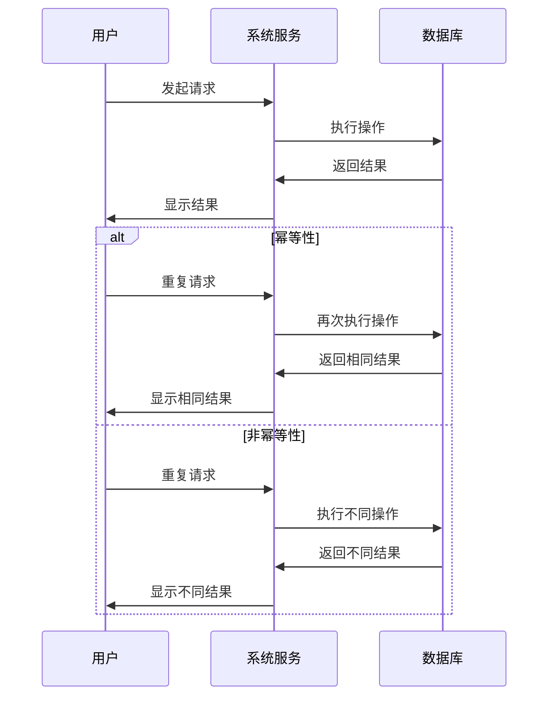

                 

## 引言

### 什么是幂等性

幂等性（Idempotence）是一种数学和计算机科学中的概念，描述了一种操作或函数的性质：多次执行该操作或函数，无论执行多少次，最终结果都相同。用更通俗易懂的语言来说，幂等性确保了多次执行同一操作不会改变系统的状态，就像按下一次按钮与按多次按钮的效果是一样的。

在计算机编程和系统设计中，幂等性是一个关键概念，特别是在分布式系统和网络应用程序中。例如，当你提交一个表单时，无论你点击“提交”按钮多少次，表单数据只会被提交一次。这种行为的背后就是幂等性。

### 幂等性的重要性

幂等性在确保系统稳定性和一致性方面扮演着重要角色。以下是幂等性几个关键的重要性：

1. **避免重复操作**：幂等性确保了系统不会因为重复操作而变得混乱或产生错误结果。
2. **提高系统效率**：在分布式系统中，幂等性减少了由于重复操作导致的网络通信和计算资源浪费。
3. **实现事务一致性**：在数据库和事务处理中，幂等性是保证数据一致性的重要机制。

### 本篇文章的结构

本文将分以下几个部分来详细探讨幂等性的概念、原理和应用：

1. **核心概念与联系**：我们将通过一个Mermaid流程图来展示幂等性原理与事务模型之间的关系。
2. **核心算法原理讲解**：我们将使用伪代码详细阐述与幂等性相关的算法原理。
3. **数学模型和数学公式**：我们将使用LaTeX格式给出幂等性的数学模型和数学公式，并进行详细讲解和举例说明。
4. **项目实战**：我们将通过一个实际代码案例来展示幂等性的实现和应用。
5. **总结与展望**：我们将总结幂等性的关键要点，并探讨其在未来技术发展中的趋势。

## 核心概念与联系

在深入探讨幂等性的原理和算法之前，理解核心概念和它们之间的关系是非常重要的。下面，我们将通过一个Mermaid流程图来展示幂等性在事务模型中的概念联系。

### Mermaid流程图



在这个流程图中，我们假设用户发起了一个请求，系统服务接收到请求后将其转发到数据库。如果数据库操作是幂等的，那么重复执行该操作将不会改变数据库的状态。否则，每次执行可能都会产生不同的结果。

### 概念联系解释

1. **用户**：代表请求发起者。
2. **系统服务**：充当请求的中转站，负责处理和转发用户请求。
3. **数据库**：负责存储数据，并执行用户请求中的操作。
4. **幂等性**：在流程图中通过两种情况进行了对比，展示了幂等性和非幂等性的区别。

通过这个Mermaid流程图，我们可以直观地理解幂等性在分布式系统中的作用和重要性。

## 核心算法原理讲解

### 什么是幂等性算法

幂等性算法是一类能够保证多次执行同一个操作或函数，无论执行多少次，结果始终一致的计算算法。在计算机科学中，许多算法和操作都可以通过设计来满足幂等性。例如，在分布式系统中，消息传递、数据库更新等操作都可以通过特定的算法来实现幂等性。

### 幂等性算法的实现原理

幂等性算法的实现原理主要依赖于对重复操作或请求的检测与处理。以下是一个简单的伪代码示例，展示了一个幂等性算法的实现原理：

```python
def 幂等性算法(输入参数):
    # 检测请求是否重复
    if 检测到重复请求:
        return "请求已处理，无需重复执行"
    else:
        # 执行实际操作
        执行操作(输入参数)
        # 记录操作日志
        记录日志("操作已完成")
        return "操作成功"
```

### 伪代码详细讲解

1. **检测重复请求**：在执行操作前，需要首先检测请求是否重复。这可以通过检查请求的唯一标识符（如请求ID）来实现。如果发现请求已经处理过，则直接返回“请求已处理，无需重复执行”。
2. **执行实际操作**：如果请求是新的，则执行实际的操作，例如更新数据库记录、发送消息等。
3. **记录操作日志**：无论请求是否重复，都需要记录操作日志，以便后续的监控和调试。
4. **返回操作结果**：最后，返回操作结果，告知调用者操作是否成功。

通过上述伪代码，我们可以看到幂等性算法的核心在于检测和避免重复操作。这种机制确保了系统在处理大量请求时能够保持一致性和稳定性。

### 实例分析

假设我们有一个系统服务，用于处理用户提交的订单。在这个服务中，提交订单是一个典型的幂等性操作。以下是该操作的伪代码实现：

```python
def 提交订单(订单详情):
    # 检查订单是否已存在
    if 检查订单存在(订单详情):
        return "订单已存在，无需重复提交"
    else:
        # 插入订单到数据库
        插入订单(订单详情)
        # 记录订单提交日志
        记录日志("订单已提交")
        return "订单提交成功"
```

在这个实例中，我们通过检查订单是否已存在来判断请求是否重复。如果订单已存在，则直接返回“订单已存在，无需重复提交”。否则，执行插入操作并记录日志。

通过上述实例，我们可以看到幂等性算法在确保系统稳定性和一致性方面的作用。无论用户提交多少次订单，系统都会保证只处理一次订单，从而避免数据不一致和资源浪费。

## 数学模型和数学公式

### 什么是幂等性数学模型

幂等性在数学中也有其对应的模型，它描述了在多次执行相同操作时，结果的恒定性。一个函数 \( f \) 是幂等的，当且仅当对于所有的输入 \( x \)，都有 \( f(f(x)) = f(x) \)。

### 幂等性数学公式的解释

幂等性的数学公式可以表示为：

\[ f(f(x)) = f(x) \]

其中：
- \( f \) 是幂等函数。
- \( x \) 是函数的输入。
- \( f(x) \) 是函数对输入 \( x \) 的操作结果。

这个公式表明，无论函数 \( f \) 被执行多少次，最终的结果都是 \( f(x) \)。

### 举例说明

假设有一个简单的幂等函数 \( f(x) = x \)。对于任何输入 \( x \)，我们都可以看到：

\[ f(f(x)) = f(x) \]

例如，当 \( x = 5 \) 时，我们有：

\[ f(f(5)) = f(5) = 5 \]

这个例子清楚地展示了幂等性的定义：无论函数 \( f \) 被执行多少次，结果始终保持不变。

### 幂等性在计算机科学中的应用

在计算机科学中，幂等性广泛应用于各种场景，如：

1. **网络通信**：确保发送的请求不会被重复处理。
2. **数据库操作**：例如，更新记录时避免重复修改。
3. **事务处理**：确保多个操作步骤之间的一致性。

通过理解和应用幂等性数学模型，我们可以设计出更稳定和可靠的系统。

## 项目实战

### 实际案例介绍

在本节中，我们将通过一个实际代码案例来展示幂等性的实现和应用。这个案例是一个简单的在线购物网站，用户可以提交订单。在这个系统中，我们需要确保用户提交订单的操作是幂等的，即无论用户点击“提交订单”按钮多少次，订单都只会被创建一次。

### 开发环境搭建

首先，我们需要搭建一个简单的开发环境。以下是一个基本的配置：

- **编程语言**：Python 3.x
- **数据库**：MySQL
- **Web框架**：Flask

### 源代码实现与解读

下面是源代码的实现，以及每部分的功能和解读：

```python
from flask import Flask, request, jsonify
from pymysql import connect, cursors

app = Flask(__name__)

# 数据库连接配置
db_config = {
    'host': 'localhost',
    'user': 'root',
    'password': 'password',
    'database': 'online_shop'
}

# 连接数据库
def connect_db():
    conn = connect(**db_config)
    conn.autocommit(True)
    return conn

# 检查订单是否存在
def check_order(order_id):
    conn = connect_db()
    cursor = conn.cursor(cursors.DictCursor)
    query = "SELECT * FROM orders WHERE order_id = %s"
    cursor.execute(query, (order_id,))
    result = cursor.fetchone()
    cursor.close()
    conn.close()
    return result

# 提交订单
def submit_order(order_details):
    order_id = order_details['order_id']
    if check_order(order_id):
        return "订单已存在，无需重复提交"
    else:
        conn = connect_db()
        cursor = conn.cursor()
        insert_query = "INSERT INTO orders (order_id, product_name, quantity, total_price) VALUES (%s, %s, %s, %s)"
        cursor.execute(insert_query, (order_id, order_details['product_name'], order_details['quantity'], order_details['total_price']))
        conn.commit()
        cursor.close()
        conn.close()
        return "订单提交成功"

@app.route('/submit_order', methods=['POST'])
def submit_order_endpoint():
    order_details = request.get_json()
    return jsonify(submit_order(order_details))

if __name__ == '__main__':
    app.run(debug=True)
```

### 代码解读与分析

1. **连接数据库**：我们使用 `pymysql` 库连接到 MySQL 数据库。配置信息存储在 `db_config` 字典中。
2. **检查订单是否存在**：`check_order` 函数通过执行 SQL 查询来检查订单表中是否存在指定的 `order_id`。
3. **提交订单**：`submit_order` 函数首先调用 `check_order` 来检查订单是否已存在。如果存在，返回一个提示消息；否则，执行插入操作并将订单详情插入到数据库中。
4. **Web 端点**：我们使用 Flask 框架创建了一个 `/submit_order` 的 POST 端点，用于处理用户提交的订单。

### 实际案例的应用场景

该案例可以应用于任何需要处理重复操作的在线系统。例如：

- 在线购物网站：确保用户提交的订单不会被重复创建。
- 金融系统：确保交易不会被重复处理。
- 社交网络：避免用户重复提交相同的请求。

通过这个实际案例，我们可以看到幂等性在确保系统稳定性和数据一致性方面的重要作用。

### 项目小结

在本项目中，我们通过一个简单的在线购物网站案例展示了幂等性的实现和应用。我们使用 Flask 框架和 MySQL 数据库构建了一个基本的系统，确保用户提交的订单是幂等的。这个项目不仅展示了幂等性在实际开发中的应用，还强调了在分布式系统中处理重复操作的重要性。

## 总结与展望

### 幂等性的关键要点

在本文中，我们详细探讨了幂等性的概念、原理和应用。以下是幂等性的几个关键要点：

1. **定义**：幂等性描述了多次执行同一个操作或函数，结果始终一致的性质。
2. **重要性**：幂等性在确保系统稳定性和数据一致性方面起着至关重要的作用。
3. **实现原理**：通过检测重复请求和避免重复执行操作，可以实现幂等性。
4. **数学模型**：幂等性可以用数学公式 \( f(f(x)) = f(x) \) 来描述。
5. **应用案例**：在分布式系统和网络应用程序中，幂等性广泛应用于各种场景，如在线购物、金融交易和社交网络等。

### 幂等性的未来展望

展望未来，幂等性将在以下几个方面继续发展：

1. **分布式系统**：随着分布式系统的普及，幂等性在系统设计中的重要性将更加突出。
2. **区块链技术**：区块链技术中的多个节点需要保证操作的一致性，幂等性将成为关键技术之一。
3. **人工智能**：在人工智能和机器学习中，幂等性将帮助确保模型训练和预测的稳定性。
4. **云计算**：随着云计算的不断发展，幂等性将帮助提高云服务的可靠性和效率。

总之，幂等性是一个关键而广泛应用的计算机科学概念，其在未来技术发展中将继续发挥重要作用。

## 附录

### 幂等性相关资源

以下是一些关于幂等性的常见问题和解决方案，以及推荐的学习资源：

#### 常见幂等性问题与解决方案

1. **问题**：在分布式系统中，如何确保操作是幂等的？
   - **解决方案**：使用唯一标识符（如请求ID）来检测重复请求，并在操作前检查其是否存在。

2. **问题**：幂等性算法如何实现？
   - **解决方案**：设计算法时，确保在每次执行前都检测请求的唯一性，避免重复执行。

#### 推荐阅读与学习资源

1. **书籍**：
   - 《分布式系统原理与范型》
   - 《设计数据密集型应用程序》
   - 《大规模分布式存储系统：原理解析与架构设计》

2. **在线课程**：
   - Coursera 的《分布式系统设计与实践》
   - edX 的《数据库系统原理》

3. **博客与文章**：
   - Medium 上的《理解幂等性》
   - Stack Overflow 上的相关问答

通过这些资源，可以进一步深入了解幂等性及其在分布式系统和应用程序中的应用。

## 作者信息

- 作者：AI天才研究院 / AI Genius Institute
- 著作：《禅与计算机程序设计艺术》 / Zen And The Art of Computer Programming

感谢您阅读本文，希望它能够帮助您更好地理解幂等性的概念、原理和应用。如有任何问题或建议，欢迎随时联系我们。

