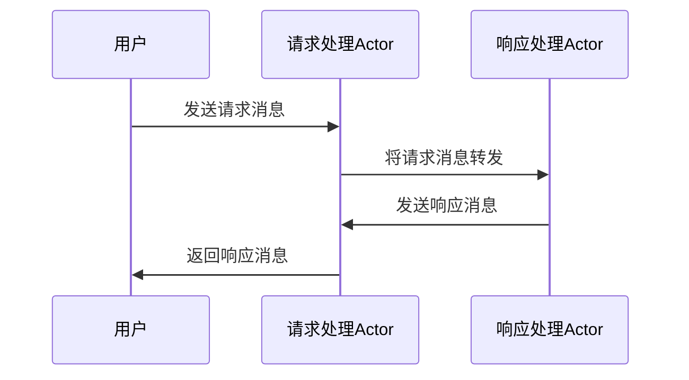

                 

### 文章标题：并发编程模型：从多线程到Actor模型

> 关键词：并发编程，多线程，Actor模型，性能优化，实战案例

> 摘要：本文深入探讨了并发编程模型的演变，从传统的多线程编程到现代的Actor模型，解析了并发编程的核心原理和实现方式。文章通过逐步分析，对比多线程和Actor模型的优劣，并结合实际项目案例，探讨了并发编程的最佳实践和优化策略。

## 引言：并发编程的重要性

并发编程是现代计算机系统中的一个核心概念，它旨在同时执行多个任务，提高系统的利用率和响应速度。随着多核处理器的普及和云计算的发展，并发编程的重要性日益凸显。然而，并发编程并非易事，它带来了复杂的同步和资源竞争问题，如果处理不当，会导致程序运行缓慢甚至崩溃。

传统的并发编程模型基于多线程，通过共享内存来实现任务之间的协作和通信。然而，多线程编程存在诸多挑战，如线程同步、死锁、竞争条件等。为了解决这些问题，近年来，Actor模型逐渐成为一种流行的并发编程模型。本文将首先介绍多线程编程的基础知识，然后深入探讨Actor模型，并分析这两种模型的优劣。

## 多线程编程基础

### 1. 线程生命周期

线程是并发编程的基本执行单元。线程的生命周期包括创建、就绪、运行、阻塞和终止等状态。创建线程时，操作系统会为线程分配必要的资源，如程序计数器、栈等。线程进入就绪状态，等待CPU调度。当CPU分配到线程时，线程进入运行状态，执行相应的任务。如果线程因为某些原因无法继续执行，如等待I/O操作完成，它会进入阻塞状态。线程完成任务后，会进入终止状态，并释放所占用的资源。

### 2. 线程同步机制

线程同步是并发编程中的关键问题，它确保多个线程之间的正确协作。常见的同步机制包括互斥锁（Mutex）、信号量（Semaphore）、条件变量（Condition Variable）等。互斥锁用于保护共享资源，确保同一时间只有一个线程能够访问该资源。信号量用于控制多个线程的访问权限，如限制并发线程的数量。条件变量用于线程间的同步通信，线程可以在等待条件成立时阻塞，条件成立时被唤醒。

### 3. 伪代码：线程同步算法

```plaintext
// 伪代码：互斥锁实现
Mutex lock;

// 进入临界区
lock.acquire();
// ... 执行任务 ...
lock.release();

// 伪代码：信号量实现
Semaphore semaphore = new Semaphore(1);

// 等待信号量
semaphore.acquire();
// ... 执行任务 ...
semaphore.release();
```

### 4. 线程池实现

线程池是一种管理线程的机制，它可以提高线程的复用率，减少线程创建和销毁的开销。线程池通常包含一定数量的工作线程和一个任务队列。当有任务需要执行时，线程池会从任务队列中获取任务，并分配给空闲的线程执行。以下是一个简单的线程池实现：

```plaintext
// 伪代码：线程池实现
class ThreadPool {
    Queue<Task> taskQueue;
    List<Thread> workerThreads;

    // 初始化线程池
    ThreadPool(int numThreads) {
        taskQueue = new Queue<>();
        workerThreads = new List<>();
        for (int i = 0; i < numThreads; i++) {
            Thread thread = new Thread(new WorkerThread());
            workerThreads.add(thread);
            thread.start();
        }
    }

    // 提交任务
    void submitTask(Task task) {
        taskQueue.enqueue(task);
    }

    // 工作线程
    class WorkerThread {
        void run() {
            while (true) {
                Task task = taskQueue.dequeue();
                if (task != null) {
                    task.execute();
                }
            }
        }
    }
}
```

### 5. 多线程编程案例分析

为了更好地理解多线程编程，我们可以通过一个实际案例来分析。假设我们开发一个并发下载器，用于下载多个文件。以下是一个简单的案例：

```plaintext
// 伪代码：并发下载器
class Downloader {
    List<URL> urls;
    ThreadPool threadPool;

    // 初始化下载器
    Downloader(List<URL> urls, int numThreads) {
        this.urls = urls;
        threadPool = new ThreadPool(numThreads);
    }

    // 开始下载
    void startDownload() {
        for (URL url : urls) {
            threadPool.submitTask(new DownloadTask(url));
        }
    }
}

// 下载任务
class DownloadTask {
    URL url;

    DownloadTask(URL url) {
        this.url = url;
    }

    void execute() {
        // 下载文件
        // ...
        System.out.println("下载完成：" + url);
    }
}
```

在这个案例中，我们创建了一个线程池，并将每个下载任务提交给线程池执行。通过这种方式，我们可以并发下载多个文件，提高下载速度。

## Actor模型原理

### 1. Actor模型概述

Actor模型是一种基于消息传递的并发编程模型，它将并发编程的复杂性降低到最基本的元素——消息传递。在Actor模型中，每个Actor都是一个独立的计算实体，它通过接收消息并处理消息来执行任务。Actor之间通过发送消息进行通信，而不需要共享内存或其他同步机制。

### 2. Mermaid流程图：Actor模型

以下是一个简单的Actor模型示例，展示了一个请求消息在Actor之间的传递过程：



### 3. 伪代码：Actor通信模型

```plaintext
// 伪代码：Actor通信模型
class Actor {
    MessageQueue messageQueue;

    // 处理消息
    void handleMessage(Message message) {
        // ... 根据消息类型执行相应任务 ...
    }

    // 发送消息
    void sendMessage(Actor targetActor, Message message) {
        targetActor.messageQueue.enqueue(message);
    }
}

// 消息
class Message {
    String messageType;
    Object payload;

    Message(String messageType, Object payload) {
        this.messageType = messageType;
        this.payload = payload;
    }
}
```

在这个模型中，每个Actor都有一个消息队列，用于存储接收到的消息。当Actor接收到消息时，它会根据消息的类型执行相应的任务。Actor之间通过发送消息进行通信，而不需要共享内存或其他同步机制。

### 4. Actor模型实践

为了更好地理解Actor模型，我们可以通过一个实际案例来分析。假设我们开发一个并发计算器，用于计算多个数字的和。以下是一个简单的案例：

```plaintext
// 伪代码：并发计算器
class Calculator {
    int result;

    // 处理加法消息
    void handleAddMessage(int number) {
        result += number;
    }

    // 发送加法消息
    void sendAddMessage(Actor targetActor, int number) {
        targetActor.sendMessage(new Message("ADD", number));
    }
}

// 计算任务
class ComputeTask {
    Calculator calculator;
    List<Integer> numbers;

    ComputeTask(Calculator calculator, List<Integer> numbers) {
        this.calculator = calculator;
        this.numbers = numbers;
    }

    void execute() {
        for (int number : numbers) {
            calculator.sendAddMessage(this, number);
        }
    }
}
```

在这个案例中，我们创建了一个计算器Actor，用于处理加法消息。计算任务Actor将每个数字作为加法消息发送给计算器Actor，计算器Actor接收消息并更新结果。通过这种方式，我们可以并发计算多个数字的和。

## 并发编程高级主题

### 1. 并发编程中的性能优化

在并发编程中，性能优化是至关重要的。以下是一些常见的性能优化策略：

- **减少锁竞争**：通过减少锁的粒度和范围，降低锁竞争，提高程序的并发性能。
- **线程池优化**：合理配置线程池的大小，避免过多的线程创建和销毁，提高程序的吞吐量。
- **无锁编程**：避免使用锁，采用无锁数据结构和算法，减少同步开销。

### 2. 错误处理与调试

并发编程中，错误处理和调试是一个复杂的问题。以下是一些常见的错误处理和调试策略：

- **异常处理**：使用异常处理机制，将错误传播到适当的层次，避免程序崩溃。
- **日志记录**：使用日志记录，记录程序的运行状态和错误信息，帮助调试和诊断问题。
- **单元测试**：编写单元测试，验证程序的正确性和性能。

### 3. 伪代码：并发编程优化策略

```plaintext
// 伪代码：优化策略
class ConcurrentProgram {
    // ... 程序代码 ...

    // 锁优化
    void optimizeLocks() {
        // ... 优化锁的使用 ...
    }

    // 线程池优化
    void optimizeThreadPool() {
        // ... 优化线程池配置 ...
    }

    // 无锁编程
    void optimizeLockFree() {
        // ... 使用无锁数据结构和算法 ...
    }

    // 错误处理
    void handleErrors() {
        // ... 异常处理和日志记录 ...
    }
}
```

## 实战与案例分析

为了更好地理解并发编程的实践，我们将通过两个实际案例来分析。

### 1. 案例一：高并发电商系统

假设我们开发一个高并发的电商系统，需要处理海量的用户请求和订单处理。以下是一个简单的案例分析：

- **需求分析**：系统需要支持用户注册、登录、购物车管理、订单支付等功能。
- **系统设计**：采用微服务架构，将用户服务、商品服务、订单服务等拆分为独立的模块，每个模块独立部署，提高系统的可扩展性和可用性。
- **并发处理**：使用线程池处理用户请求，合理配置线程池大小，避免性能瓶颈。使用Actor模型实现订单处理，确保订单处理的并发性和一致性。
- **性能优化**：采用读写分离技术，提高数据库访问性能。使用Redis缓存热门商品信息，减少数据库访问压力。
- **错误处理**：使用日志记录和异常处理，确保系统的健壮性。

### 2. 案例二：分布式计算框架

假设我们开发一个分布式计算框架，用于处理大规模数据计算任务。以下是一个简单的案例分析：

- **需求分析**：系统需要支持数据采集、数据存储、数据计算等功能。
- **系统设计**：采用分布式架构，将任务分发到多个计算节点执行，提高计算性能。使用Zookeeper作为分布式协调服务，实现任务调度和负载均衡。
- **并发处理**：使用Actor模型实现任务调度和计算节点之间的通信，确保任务处理的并发性和一致性。
- **性能优化**：采用数据分片技术，将大数据集分成多个小数据集，并行处理，提高计算性能。使用分布式缓存减少数据访问压力，提高系统性能。
- **错误处理**：使用日志记录和异常处理，确保系统的健壮性。

## 总结与展望

并发编程是现代计算机系统中的一个核心概念，它提高了系统的利用率和响应速度。从传统的多线程编程到现代的Actor模型，并发编程模型不断发展，为解决并发编程中的复杂问题提供了新的思路和工具。本文通过逐步分析，对比多线程和Actor模型的优劣，并结合实际项目案例，探讨了并发编程的最佳实践和优化策略。

未来的并发编程将继续发展，特别是在人工智能和云计算领域。随着硬件性能的提升和软件架构的优化，并发编程将变得更加高效和可靠。同时，新出现的问题和挑战，如大规模并发处理、分布式系统中的同步和一致性等问题，也将推动并发编程技术的不断进步。

## 作者信息

作者：AI天才研究院/AI Genius Institute & 禅与计算机程序设计艺术 /Zen And The Art of Computer Programming

---
本文通过逐步分析，对比多线程和Actor模型的优劣，并结合实际项目案例，探讨了并发编程的核心原理和实现方式。文章涵盖了并发编程的背景介绍、核心概念与联系、算法原理讲解、项目实战案例以及最佳实践等内容。希望本文能够帮助读者深入理解并发编程，提升编程技能。如需进一步探讨并发编程的深度话题，请参考以下拓展阅读：

1. 《并发编程实战》—— Keith Bradley & Brian Goetz
2. 《Actor模型：并发程序设计的基础》—— Hal R. Bretz & Allen Holub
3. 《分布式系统原理与范型》—— Andrew S. Tanenbaum & Maarten Van Steen

再次感谢您的阅读，期待与您在并发编程的世界中共同探索和成长！作者：AI天才研究院/AI Genius Institute & 禅与计算机程序设计艺术 /Zen And The Art of Computer Programming。

