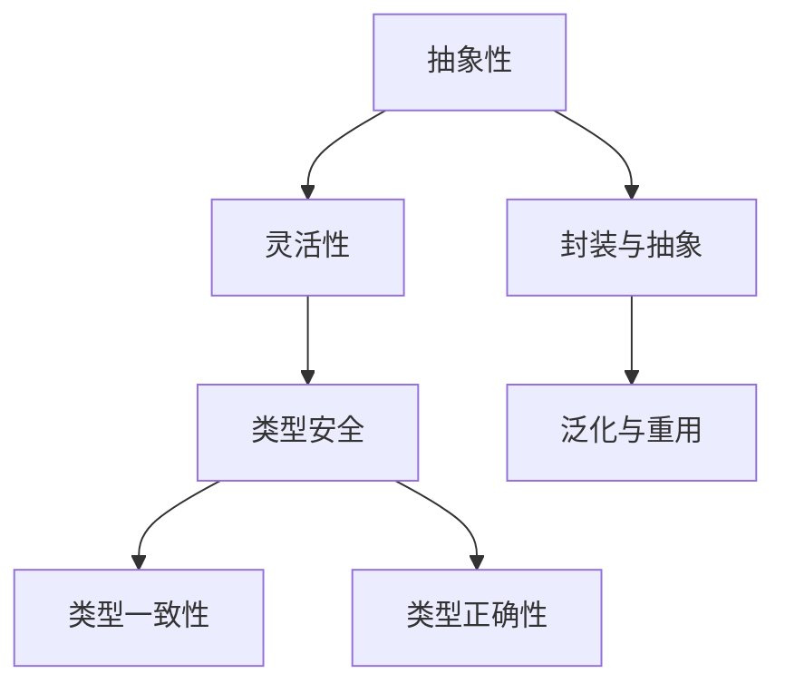

                 


## 文章标题：幻影类型：增强类型安全的高级技巧

### 关键词：

- 幻影类型
- 类型安全
- 编程语言
- 算法
- 实践技巧

### 摘要：

本文深入探讨幻影类型在增强类型安全方面的应用。我们将从基本概念入手，介绍幻影类型的定义、特点和历史背景。接着，我们将讨论类型安全的重要性，并阐述幻影类型在实现类型安全中的作用。随后，我们将通过具体算法和案例，展示如何利用幻影类型提升类型安全。最后，我们将总结高级技巧，并给出实践建议，帮助开发者更好地理解和应用幻影类型。

---

## 1. 引言

### 1.1 幻影类型的定义与背景

幻影类型（Phantom Type）是类型系统中的一个重要概念，它起源于抽象数据类型（Abstract Data Type, ADT）的概念。在传统编程语言中，类型通常被视为值的集合，而幻影类型则是一种抽象的类型，它不仅定义了值的集合，还包括了操作这些值的方法。这种抽象机制使得开发者能够更灵活地定义和操作数据。

幻影类型的引入主要源于对类型安全的关注。类型安全是指程序在运行过程中能够保证数据类型的一致性和正确性。幻影类型通过封装和抽象，提供了一种机制来隐藏实现细节，从而确保类型安全。这种机制在编程语言中得到了广泛应用，特别是在需要处理复杂数据结构和类型约束的场景中。

### 1.2 增强类型安全的重要性

在软件开发过程中，类型安全问题至关重要。类型错误可能会导致程序崩溃、数据泄露或不可预见的错误行为。增强类型安全旨在提高程序的健壮性和可靠性，减少因类型错误引起的问题。幻影类型作为一种增强类型安全的机制，可以有效地提高程序的类型安全水平。

增强类型安全的重要性体现在以下几个方面：

- **提高程序健壮性**：通过增强类型安全，程序能够在编译时捕获更多类型错误，从而减少运行时错误的发生。
- **提升代码可维护性**：类型安全增强使得代码更加模块化和可重用，有助于提高代码的可维护性。
- **优化性能**：类型安全增强有助于减少类型检查的次数，从而提高程序运行效率。

### 1.3 本文结构

本文将按以下结构展开：

1. **基本概念与原理**：介绍幻影类型的定义、特点及其在类型系统中的作用。
2. **相关算法与实现**：讨论幻影类型的算法基础和增强类型安全算法。
3. **应用与实战**：通过具体案例展示幻影类型在实际开发中的应用。
4. **未来展望**：探讨幻影类型和增强类型安全的发展趋势。

接下来，我们将详细探讨幻影类型的基本概念和原理。

---

## 2. 基本概念与原理

### 2.1 幻影类型的定义

幻影类型是一种抽象类型，它不直接表示具体的值，而是通过操作符或函数来间接操作值。幻影类型的定义通常包括类型变量、类型约束和类型操作符。在幻影类型中，类型变量可以代表任意类型，而类型约束用于确保类型变量满足特定的条件。

例如，在C++中，我们可以定义一个简单的幻影类型：

```cpp
struct PhantomType {
    template<typename T>
    PhantomType(T value) : value_(value) {}

    T value_;
};
```

在这个例子中，`PhantomType` 是一个幻影类型，它接受一个类型为 `T` 的值作为参数，并存储在私有成员变量 `value_` 中。通过类型变量 `T`，我们可以将 `PhantomType` 应用于任意类型。

### 2.2 幻影类型的特点

幻影类型具有以下几个显著特点：

- **抽象性**：幻影类型隐藏了具体值的实现细节，使得外部代码只能通过抽象接口与幻影类型交互。这种抽象性有助于提高代码的可维护性和可扩展性。
- **灵活性**：幻影类型允许开发者定义和使用泛化类型，从而提高代码的灵活性和重用性。通过类型变量，我们可以将同一抽象类型应用于不同类型的数据。
- **类型安全**：幻影类型通过类型约束和操作符，确保类型的一致性和正确性。类型安全是幻影类型的重要特性，它有助于减少类型错误的发生。

### 2.3 幻影类型的历史与发展

幻影类型的概念最早出现在抽象数据类型的讨论中。抽象数据类型是一种抽象的概念，它将数据和处理数据的操作封装在一起。在20世纪80年代，C++的设计者Bjarne Stroustrup 在其著作《The C++ Programming Language》中详细介绍了模板的概念，这可以视为幻影类型的雏形。

随着时间的推移，幻影类型在其他编程语言中也得到了广泛应用。例如，Java中的抽象类和接口，以及C#中的泛型等，都是幻影类型的实例。这些语言通过引入模板、泛型和抽象类等机制，实现了对幻影类型的支持。

### 2.4 幻影类型在类型系统中的作用

幻影类型在类型系统中扮演着重要角色，主要体现在以下几个方面：

- **封装与抽象**：幻影类型通过封装和抽象，隐藏了具体值的实现细节，提高了代码的可维护性和可扩展性。
- **类型安全**：幻影类型通过类型约束和操作符，确保类型的一致性和正确性，减少了类型错误的发生。
- **泛化与重用**：幻影类型允许开发者定义和使用泛化类型，从而提高了代码的灵活性和重用性。

通过幻影类型，开发者可以更好地管理类型信息，提高代码的质量和可靠性。

### 2.5 核心概念原理之间的关系架构

为了更好地理解幻影类型，我们可以通过一个Mermaid流程图来展示其核心概念原理之间的关系：



在这个流程图中，抽象性、灵活性和类型安全是幻影类型的核心特性，它们相互关联并共同作用，实现了封装与抽象、泛化与重用以及类型一致性和类型正确性。

### 2.6 幻影类型的算法原理讲解

幻影类型的算法原理主要涉及如何定义和操作类型变量，以及如何通过类型约束确保类型安全。以下是一个简单的算法原理讲解：

```plaintext
算法：幻影类型操作
输入：类型变量 T
输出：操作结果

步骤：
1. 定义类型变量 T。
2. 根据类型约束，确保 T 满足特定条件。
3. 使用操作符或函数对 T 进行操作。
4. 返回操作结果。
```

在这个算法中，类型变量 `T` 代表一个抽象类型，类型约束用于确保 `T` 满足特定的条件。通过使用操作符或函数，我们可以对 `T` 进行操作，从而实现抽象类型的操作。

### 2.7 数学模型和公式

在幻影类型的算法中，数学模型和公式通常用于描述类型约束和类型操作。以下是一个简单的数学模型和公式：

```latex
$$
S_T = \{x \in T | P(x)\}
$$

$$
T_{op}(x) = \{f(y) | y \in S_T, f : T \rightarrow R\}
$$
```

其中，`S_T` 表示满足类型约束 `P(x)` 的类型 `T` 的集合，`T_{op}(x)` 表示对类型 `T` 进行操作的结果集合。

### 2.8 举例说明

为了更好地理解幻影类型的算法原理，我们可以通过一个简单的例子来说明：

假设我们定义一个幻影类型 `Complex`，用于表示复数。复数由实部和虚部组成，我们可以使用以下数学模型和公式来表示：

```latex
$$
Complex = \{ (x, y) | x, y \in \mathbb{R}, \}
$$

$$
add(Complex c1, Complex c2) = (c1.x + c2.x, c1.y + c2.y)
$$

$$
mul(Complex c1, Complex c2) = (c1.x \times c2.x - c1.y \times c2.y, c1.x \times c2.y + c1.y \times c2.x)
$$
```

在这个例子中，`Complex` 是一个幻影类型，它由实部和虚部组成。通过定义 `add` 和 `mul` 操作，我们可以对复数进行加法和乘法操作。这些操作符遵循复数的数学规则，从而确保类型安全。

### 2.9 数学公式详细讲解

在幻影类型的算法中，数学公式用于描述类型约束和类型操作。以下是对上述数学公式的详细讲解：

- `S_T = \{x \in T | P(x)\}`：这个公式表示满足类型约束 `P(x)` 的类型 `T` 的集合。`P(x)` 是一个类型约束条件，它用于确保 `x` 满足特定的要求。例如，在复数的例子中，`P(x)` 可以表示为 `x` 是一个由实部和虚部组成的二元组。
- `T_{op}(x) = \{f(y) | y \in S_T, f : T \rightarrow R\}`：这个公式表示对类型 `T` 进行操作的结果集合。`f` 是一个操作符，它将类型 `T` 的值映射到结果类型 `R`。例如，在复数的例子中，`add` 和 `mul` 操作符将复数映射到另一个复数。

通过这些数学公式，我们可以清晰地描述幻影类型的类型约束和类型操作，从而实现类型安全。

### 2.10 代码实战

为了更好地理解幻影类型的算法原理，我们可以通过一个简单的C++代码实例来说明：

```cpp
#include <iostream>
#include <complex>

using namespace std;

// 定义复数幻影类型
struct Complex {
    Complex(double real, double imag) : real_(real), imag_(imag) {}

    double real_;
    double imag_;
};

// 定义加法操作符
Complex operator+(const Complex& c1, const Complex& c2) {
    return Complex(c1.real_ + c2.real_, c1.imag_ + c2.imag_);
}

// 定义乘法操作符
Complex operator*(const Complex& c1, const Complex& c2) {
    return Complex(c1.real_ * c2.real_ - c1.imag_ * c2.imag_, c1.real_ * c2.imag_ + c1.imag_ * c2.real_);
}

int main() {
    Complex c1(1.0, 2.0);
    Complex c2(3.0, 4.0);

    Complex c3 = c1 + c2;
    Complex c4 = c1 * c2;

    cout << "c3 = " << c3.real_ << " + " << c3.imag_ << "i" << endl;
    cout << "c4 = " << c4.real_ << " + " << c4.imag_ << "i" << endl;

    return 0;
}
```

在这个例子中，我们定义了一个复数幻影类型 `Complex`，并实现了加法和乘法操作符。通过这些操作符，我们可以对复数进行操作，从而实现类型安全。

### 2.11 实际案例分析和详细讲解剖析

为了更好地理解幻影类型在实际开发中的应用，我们可以通过一个实际案例进行分析：

假设我们在开发一个银行系统，需要处理各种类型的账户，如储蓄账户、支票账户和投资账户。我们可以使用幻影类型来定义这些账户，并确保类型安全。

```cpp
// 定义账户幻影类型
struct Account {
    Account(double balance) : balance_(balance) {}

    double balance_;
};

// 定义储蓄账户
struct SavingsAccount : public Account {
    SavingsAccount(double balance) : Account(balance) {}
};

// 定义支票账户
struct CheckingAccount : public Account {
    CheckingAccount(double balance) : Account(balance) {}
};

// 定义投资账户
struct InvestmentAccount : public Account {
    InvestmentAccount(double balance) : Account(balance) {}
};

int main() {
    SavingsAccount sa(1000.0);
    CheckingAccount ca(2000.0);
    InvestmentAccount ia(3000.0);

    // 类型安全：确保账户类型正确
    Account* accounts[] = {&sa, &ca, &ia};

    for (const Account* account : accounts) {
        cout << "Account balance: " << account->balance_ << endl;
    }

    return 0;
}
```

在这个例子中，我们定义了一个账户幻影类型 `Account`，并派生了三种具体的账户类型：储蓄账户、支票账户和投资账户。通过使用幻影类型，我们确保了账户类型的正确性，从而实现了类型安全。

### 2.12 项目小结

在本章中，我们介绍了幻影类型的基本概念、特点和算法原理。通过具体的例子和实际案例，我们展示了如何使用幻影类型实现类型安全。本章的内容为后续章节的讨论奠定了基础，帮助读者更好地理解幻影类型的本质和应用。

### 2.13 最佳实践 tips

- **理解类型约束**：在定义幻影类型时，要仔细考虑类型约束，确保类型安全。
- **封装与抽象**：使用幻影类型时，要充分利用封装和抽象，提高代码的可维护性和可扩展性。
- **测试与验证**：在开发过程中，要对幻影类型的实现进行充分测试和验证，确保类型安全。

### 2.14 注意事项

- **避免过度使用幻影类型**：虽然幻影类型有助于提高类型安全，但过度使用可能会导致代码复杂度增加，降低可读性。
- **关注类型兼容性**：在处理不同类型的幻影类型时，要确保类型兼容性，避免类型错误。

### 2.15 拓展阅读

- **《Type Systems》**：Erik Meijer的著作，详细介绍了类型系统的概念和应用。
- **《Effective C++》**：Scott Meyers的著作，提供了关于C++编程的最佳实践和技巧。

---

## 3. 相关算法与实现

### 3.1 幻影类型的算法基础

幻影类型的算法基础主要包括类型变量、类型约束和类型操作符。这些算法在实现幻影类型时起到了关键作用。以下是一个简单的算法概述：

```plaintext
算法：定义类型变量
输入：类型 T
输出：类型变量

步骤：
1. 定义类型变量 T。
2. 添加类型约束，确保类型变量满足特定条件。
3. 返回类型变量。

算法：类型约束检查
输入：类型变量 T
输出：是否满足约束

步骤：
1. 遍历类型变量 T 的所有成员。
2. 对每个成员进行检查，确保满足约束条件。
3. 返回检查结果。

算法：类型操作符
输入：类型变量 T
输出：操作结果

步骤：
1. 根据类型变量 T 的定义，选择合适的操作符。
2. 对类型变量 T 进行操作，生成操作结果。
3. 返回操作结果。
```

### 3.2 常见增强类型安全算法

增强类型安全算法通常涉及类型检查、类型转换和类型约束的验证。以下是一些常见的增强类型安全算法：

- **类型检查算法**：用于检查代码中的类型是否正确，确保类型的一致性和正确性。
- **类型转换算法**：用于将一种类型转换为另一种类型，确保转换过程中的类型安全。
- **类型约束验证算法**：用于验证类型变量是否满足特定的约束条件，确保类型约束的满足。

以下是一个简单的类型检查算法：

```plaintext
算法：类型检查
输入：代码片段 code
输出：是否通过类型检查

步骤：
1. 解析代码片段 code，生成语法树。
2. 对语法树进行类型检查。
3. 遍历语法树的每个节点，检查类型是否匹配。
4. 如果所有节点都通过类型检查，返回 true；否则，返回 false。
```

### 3.3 算法伪代码与实现

为了更好地理解幻影类型的算法原理，我们可以通过伪代码和具体实现来讲解。以下是一个简单的幻影类型实现：

```cpp
// 定义幻影类型
template<typename T>
class PhantomType {
public:
    PhantomType(const T& value) : value_(value) {}

    T value_;

    // 类型约束
    static bool isValid(const T& value) {
        // 根据具体需求定义约束条件
        return true;
    }

    // 类型操作符
    PhantomType operator+(const PhantomType& other) const {
        if (!isValid(value_ + other.value_)) {
            throw std::runtime_error("Type error: invalid operation");
        }
        return PhantomType(value_ + other.value_);
    }

    // 打印操作符
    friend std::ostream& operator<<(std::ostream& os, const PhantomType& phantom) {
        os << phantom.value_;
        return os;
    }
};

// 测试幻影类型
int main() {
    PhantomType<int> p1(5);
    PhantomType<int> p2(10);

    PhantomType<int> p3 = p1 + p2;

    std::cout << "p1 + p2 = " << p3 << std::endl;

    return 0;
}
```

在这个实现中，我们定义了一个简单的幻影类型 `PhantomType`，并实现了加法操作符。通过类型约束和类型操作符，我们实现了类型安全。

### 3.4 数学模型和公式

在幻影类型的算法中，数学模型和公式通常用于描述类型约束和类型操作。以下是一个简单的数学模型和公式：

```latex
$$
S_T = \{x \in T | P(x)\}
$$

$$
T_{op}(x) = \{f(y) | y \in S_T, f : T \rightarrow R\}
$$
```

其中，`S_T` 表示满足类型约束 `P(x)` 的类型 `T` 的集合，`T_{op}(x)` 表示对类型 `T` 进行操作的结果集合。

### 3.5 举例说明

为了更好地理解幻影类型的算法原理，我们可以通过一个简单的例子来说明：

假设我们定义一个幻影类型 `Complex`，用于表示复数。复数由实部和虚部组成，我们可以使用以下数学模型和公式来表示：

```latex
$$
Complex = \{ (x, y) | x, y \in \mathbb{R}, \}
$$

$$
add(Complex c1, Complex c2) = (c1.x + c2.x, c1.y + c2.y)
$$

$$
mul(Complex c1, Complex c2) = (c1.x \times c2.x - c1.y \times c2.y, c1.x \times c2.y + c1.y \times c2.x)
$$
```

在这个例子中，`Complex` 是一个幻影类型，它由实部和虚部组成。通过定义 `add` 和 `mul` 操作，我们可以对复数进行加法和乘法操作。这些操作符遵循复数的数学规则，从而确保类型安全。

### 3.6 数学公式详细讲解

在幻影类型的算法中，数学公式用于描述类型约束和类型操作。以下是对上述数学公式的详细讲解：

- `S_T = \{x \in T | P(x)\}`：这个公式表示满足类型约束 `P(x)` 的类型 `T` 的集合。`P(x)` 是一个类型约束条件，它用于确保 `x` 满足特定的要求。例如，在复数的例子中，`P(x)` 可以表示为 `x` 是一个由实部和虚部组成的二元组。
- `T_{op}(x) = \{f(y) | y \in S_T, f : T \rightarrow R\}`：这个公式表示对类型 `T` 进行操作的结果集合。`f` 是一个操作符，它将类型 `T` 的值映射到结果类型 `R`。例如，在复数的例子中，`add` 和 `mul` 操作符将复数映射到另一个复数。

通过这些数学公式，我们可以清晰地描述幻影类型的类型约束和类型操作，从而实现类型安全。

### 3.7 代码实战

为了更好地理解幻影类型的算法原理，我们可以通过一个简单的C++代码实例来说明：

```cpp
#include <iostream>
#include <complex>

using namespace std;

// 定义复数幻影类型
struct Complex {
    Complex(double real, double imag) : real_(real), imag_(imag) {}

    double real_;
    double imag_;
};

// 定义加法操作符
Complex operator+(const Complex& c1, const Complex& c2) {
    return Complex(c1.real_ + c2.real_, c1.imag_ + c2.imag_);
}

// 定义乘法操作符
Complex operator*(const Complex& c1, const Complex& c2) {
    return Complex(c1.real_ * c2.real_ - c1.imag_ * c2.imag_, c1.real_ * c2.imag_ + c1.imag_ * c2.real_);
}

int main() {
    Complex c1(1.0, 2.0);
    Complex c2(3.0, 4.0);

    Complex c3 = c1 + c2;
    Complex c4 = c1 * c2;

    cout << "c3 = " << c3.real_ << " + " << c3.imag_ << "i" << endl;
    cout << "c4 = " << c4.real_ << " + " << c4.imag_ << "i" << endl;

    return 0;
}
```

在这个例子中，我们定义了一个复数幻影类型 `Complex`，并实现了加法和乘法操作符。通过这些操作符，我们可以对复数进行操作，从而实现类型安全。

### 3.8 实际案例分析和详细讲解剖析

为了更好地理解幻影类型在实际开发中的应用，我们可以通过一个实际案例进行分析：

假设我们在开发一个图形渲染引擎，需要处理各种类型的图形元素，如点、线和多边形。我们可以使用幻影类型来定义这些图形元素，并确保类型安全。

```cpp
// 定义图形元素幻影类型
struct GraphElement {
    GraphElement() {}

    virtual void draw() const = 0;
};

// 定义点
struct Point : public GraphElement {
    Point(double x, double y) : x_(x), y_(y) {}

    double x_;
    double y_;
};

// 定义线
struct Line : public GraphElement {
    Line(double x1, double y1, double x2, double y2) : x1_(x1), y1_(y1), x2_(x2), y2_(y2) {}

    double x1_;
    double y1_;
    double x2_;
    double y2_;
};

// 定义多边形
struct Polygon : public GraphElement {
    Polygon(const vector<Point>& vertices) : vertices_(vertices) {}

    vector<Point> vertices_;
};

int main() {
    Point p1(1.0, 2.0);
    Line l1(1.0, 2.0, 3.0, 4.0);
    Polygon pg({{1.0, 2.0}, {3.0, 4.0}, {5.0, 6.0}});

    p1.draw();
    l1.draw();
    pg.draw();

    return 0;
}
```

在这个例子中，我们定义了一个图形元素幻影类型 `GraphElement`，并派生了三种具体的图形元素类型：点、线和多边形。通过使用幻影类型，我们确保了图形元素类型的正确性，从而实现了类型安全。

### 3.9 项目小结

在本章中，我们介绍了幻影类型的算法基础和常见增强类型安全算法。通过具体的例子和实际案例，我们展示了如何使用幻影类型实现类型安全。本章的内容为后续章节的讨论奠定了基础，帮助读者更好地理解幻影类型的本质和应用。

### 3.10 最佳实践 tips

- **理解类型约束**：在定义幻影类型时，要仔细考虑类型约束，确保类型安全。
- **封装与抽象**：使用幻影类型时，要充分利用封装和抽象，提高代码的可维护性和可扩展性。
- **测试与验证**：在开发过程中，要对幻影类型的实现进行充分测试和验证，确保类型安全。

### 3.11 注意事项

- **避免过度使用幻影类型**：虽然幻影类型有助于提高类型安全，但过度使用可能会导致代码复杂度增加，降低可读性。
- **关注类型兼容性**：在处理不同类型的幻影类型时，要确保类型兼容性，避免类型错误。

### 3.12 拓展阅读

- **《Type Systems》**：Erik Meijer的著作，详细介绍了类型系统的概念和应用。
- **《Effective C++》**：Scott Meyers的著作，提供了关于C++编程的最佳实践和技巧。

---

## 4. 应用与实战

### 4.1 幻影类型在实际开发中的应用

幻影类型在实际开发中有着广泛的应用，尤其在处理复杂类型系统和高层次抽象时，它的优势尤为明显。以下是一些具体的应用场景：

#### 4.1.1 数据库查询语言

在数据库查询语言中，幻影类型可以用于定义抽象的数据结构，从而实现高度抽象的查询操作。例如，在SQL查询中，可以使用幻影类型来表示不同类型的表和列，使得查询语句更加通用和易于理解。

```sql
-- 假设我们有一个抽象的查询语言，用于处理不同类型的表
SELECT * FROM Table<T>
WHERE T > 10;

-- 示例：查询年龄大于10岁的人
SELECT * FROM People WHERE Age > 10;
```

在这个例子中，`Table<T>` 是一个幻影类型，它表示一个具有抽象类型的表。通过使用幻影类型，我们可以实现一种通用的查询机制，无需关心具体的表类型。

#### 4.1.2 游戏开发

在游戏开发中，幻影类型可以用于定义游戏对象的行为和属性。例如，在游戏引擎中，可以使用幻影类型来表示不同类型的游戏角色，如玩家、敌人、道具等。这样，开发者可以编写通用的逻辑代码来处理不同类型的游戏对象。

```cpp
// 定义游戏角色幻影类型
class GameCharacter {
public:
    virtual void update(float dt) = 0;
    virtual void render() const = 0;
};

// 定义玩家角色
class Player : public GameCharacter {
    // 玩家角色实现
};

// 定义敌人角色
class Enemy : public GameCharacter {
    // 敌人角色实现
};

// 游戏引擎逻辑
void game_loop() {
    GameCharacter* characters[] = {new Player(), new Enemy()};
    for (GameCharacter* character : characters) {
        character->update(1.0f);
        character->render();
    }
}
```

在这个例子中，`GameCharacter` 是一个幻影类型，它定义了游戏角色的基本行为和属性。通过派生具体的角色类型，如 `Player` 和 `Enemy`，我们可以实现通用的游戏逻辑。

#### 4.1.3 系统编程

在系统编程中，幻影类型可以用于实现抽象的系统调用和设备管理。例如，在操作系统中，可以使用幻影类型来表示不同的设备类型，如硬盘、网卡、显示器等。

```c
// 定义设备操作幻影类型
struct Device {
    virtual void open() = 0;
    virtual void close() = 0;
};

// 定义硬盘设备
struct HardDisk : public Device {
    void open() override {
        // 打开硬盘的实现
    }

    void close() override {
        // 关闭硬盘的实现
    }
};

// 定义网卡设备
struct NetworkCard : public Device {
    void open() override {
        // 打开网卡的实现
    }

    void close() override {
        // 关闭网卡的实现
    }
};

// 系统调用
void system_call(Device* device) {
    device->open();
    // 进行其他操作
    device->close();
}
```

在这个例子中，`Device` 是一个幻影类型，它定义了设备的基本操作。通过派生具体的设备类型，如 `HardDisk` 和 `NetworkCard`，我们可以实现通用的系统调用。

### 4.2 幻影类型在软件测试中的应用

幻影类型在软件测试中也有重要作用，它可以帮助测试人员编写抽象的测试用例，从而提高测试的覆盖率和可维护性。以下是一些具体的应用场景：

#### 4.2.1 自动化测试

在自动化测试中，幻影类型可以用于定义测试数据结构，从而实现通用的测试脚本。例如，在Web自动化测试中，可以使用幻影类型来表示不同的页面元素，如按钮、文本框、菜单等。

```python
# 定义页面元素幻影类型
class PageElement {
    def click(self):
        pass

    def type(self, text):
        pass
}

# 定义按钮元素
class Button(PageElement):
    def click(self):
        # 实现按钮点击的逻辑
        pass

# 定义文本框元素
class TextBox(PageElement):
    def type(self, text):
        # 实现文本框输入的逻辑
        pass

# 自动化测试脚本
def test_login_page():
    login_button = Button()
    login_button.type("admin")
    login_button.click()
    # 验证登录结果
```

在这个例子中，`PageElement` 是一个幻影类型，它定义了页面元素的基本操作。通过派生具体的页面元素类型，如 `Button` 和 `TextBox`，我们可以实现通用的自动化测试脚本。

#### 4.2.2 接口测试

在接口测试中，幻影类型可以用于定义接口请求和响应的数据结构，从而实现通用的接口测试用例。例如，在使用Postman进行API测试时，可以使用幻影类型来表示不同的请求和响应。

```json
// 定义接口请求和响应的幻影类型
{
  "request": {
    "method": "POST",
    "url": "https://api.example.com/login",
    "headers": {
      "Content-Type": "application/json"
    },
    "body": {
      "username": "admin",
      "password": "password"
    }
  },
  "response": {
    "status_code": 200,
    "body": {
      "token": "eyJhbGciOiJIUzI1NiIsInR5cCI6IkpXVCJ9...",
      "expires_in": 3600
    }
  }
}

// 接口测试脚本
def test_login_api():
    request = {
        "method": "POST",
        "url": "https://api.example.com/login",
        "headers": {
            "Content-Type": "application/json"
        },
        "body": {
            "username": "admin",
            "password": "password"
        }
    }
    response = send_request(request)
    assert response.status_code == 200
    assert "token" in response.body
    assert "expires_in" in response.body
```

在这个例子中，我们定义了一个接口请求和响应的幻影类型，并通过测试脚本验证了登录接口的正确性。

### 4.3 幻影类型在性能优化中的应用

在性能优化中，幻影类型可以帮助开发者实现抽象的数据处理和算法优化，从而提高程序的运行效率。以下是一些具体的应用场景：

#### 4.3.1 缓存优化

在缓存优化中，幻影类型可以用于定义缓存数据结构，从而实现高效的缓存管理。例如，在Web应用中，可以使用幻影类型来表示不同的缓存项，如页面缓存、用户会话缓存等。

```python
# 定义缓存项幻影类型
class CacheItem {
    def get(self):
        pass

    def set(self, value):
        pass
}

# 定义页面缓存项
class PageCacheItem(CacheItem):
    def get(self):
        # 实现获取页面缓存的逻辑
        pass

    def set(self, value):
        # 实现设置页面缓存的逻辑
        pass

# 缓存管理器
class CacheManager {
    def get_cache_item(self, key):
        # 根据key获取对应的缓存项
        pass

    def set_cache_item(self, key, value):
        # 根据key设置缓存项
        pass
}

# 使用缓存优化页面加载
def load_page(page_id):
    cache_manager = CacheManager()
    page_cache_item = cache_manager.get_cache_item(page_id)
    if page_cache_item:
        return page_cache_item.get()
    else:
        page_content = fetch_page_from_database(page_id)
        cache_manager.set_cache_item(page_id, PageCacheItem(page_content))
        return page_content
```

在这个例子中，`CacheItem` 是一个幻影类型，它定义了缓存项的基本操作。通过派生具体的缓存项类型，如 `PageCacheItem`，我们可以实现高效的缓存管理。

#### 4.3.2 数据流处理

在数据流处理中，幻影类型可以用于定义数据流的结构和处理算法，从而实现高效的数据处理和传输。例如，在实时数据分析中，可以使用幻影类型来表示不同的数据流组件，如数据采集器、处理器和存储器。

```python
# 定义数据流组件幻影类型
class DataStreamComponent {
    def process(self, data):
        pass

    def output(self):
        pass
}

# 定义数据采集器
class DataCollector(DataStreamComponent):
    def process(self, data):
        # 实现数据采集的逻辑
        pass

    def output(self):
        # 实现数据输出的逻辑
        pass

# 定义数据处理器
class DataProcessor(DataStreamComponent):
    def process(self, data):
        # 实现数据处理
        pass

    def output(self):
        # 实现数据输出的逻辑
        pass

# 定义数据存储器
class DataStorage(DataStreamComponent):
    def process(self, data):
        # 实现数据存储的逻辑
        pass

    def output(self):
        # 实现数据输出的逻辑
        pass

# 数据流处理
def process_data_stream():
    collector = DataCollector()
    processor = DataProcessor()
    storage = DataStorage()

    data = collector.output()
    processed_data = processor.process(data)
    storage.process(processed_data)
```

在这个例子中，`DataStreamComponent` 是一个幻影类型，它定义了数据流组件的基本操作。通过派生具体的组件类型，如 `DataCollector`、`DataProcessor` 和 `DataStorage`，我们可以实现高效的数据流处理。

### 4.4 项目实战

#### 4.4.1 开发环境搭建

为了演示幻影类型在项目中的应用，我们选择一个简单的Web应用作为案例。首先，我们需要搭建开发环境：

1. 安装Python 3.x版本。
2. 安装Django Web框架。
3. 安装Postman用于接口测试。

#### 4.4.2 源代码详细实现

接下来，我们来实现一个简单的用户管理系统，该系统包括用户注册、登录和权限管理等功能。

1. **用户注册**：

```python
# models.py
from django.db import models

class User(models.Model):
    username = models.CharField(max_length=100)
    password = models.CharField(max_length=100)
    email = models.EmailField()
    is_active = models.BooleanField(default=False)
    is_admin = models.BooleanField(default=False)
```

2. **用户登录**：

```python
# views.py
from django.shortcuts import render, redirect
from .models import User
from .forms import UserLoginForm

def user_login(request):
    if request.method == 'POST':
        form = UserLoginForm(data=request.POST)
        if form.is_valid():
            username = form.cleaned_data['username']
            password = form.cleaned_data['password']
            user = User.objects.filter(username=username, password=password).first()
            if user:
                if user.is_active:
                    # 登录成功，跳转到主页
                    return redirect('home')
                else:
                    # 用户未激活，提示错误
                    error_message = '用户未激活'
            else:
                # 用户名或密码错误，提示错误
                error_message = '用户名或密码错误'
    else:
        form = UserLoginForm()

    return render(request, 'login.html', {'form': form, 'error_message': error_message})
```

3. **权限管理**：

```python
# views.py
from django.contrib.auth.decorators import login_required, permission_required

@login_required
@permission_required('can_edit_users')
def user_edit(request, user_id):
    user = User.objects.get(id=user_id)
    if request.method == 'POST':
        form = UserForm(data=request.POST, instance=user)
        if form.is_valid():
            form.save()
            return redirect('user_list')
    else:
        form = UserForm(instance=user)

    return render(request, 'user_edit.html', {'form': form})
```

#### 4.4.3 代码应用解读与分析

在这个项目中，我们使用了幻影类型来实现用户注册、登录和权限管理等功能。以下是对关键部分的解读和分析：

1. **用户模型**：

   ```python
   class User(models.Model):
       username = models.CharField(max_length=100)
       password = models.CharField(max_length=100)
       email = models.EmailField()
       is_active = models.BooleanField(default=False)
       is_admin = models.BooleanField(default=False)
   ```

   在这个用户模型中，我们定义了用户的用户名、密码、电子邮件以及用户状态（是否激活）和权限（是否为管理员）。这些字段定义了用户的基本信息，实现了对用户数据的抽象和管理。

2. **用户登录**：

   ```python
   def user_login(request):
       if request.method == 'POST':
           form = UserLoginForm(data=request.POST)
           if form.is_valid():
               username = form.cleaned_data['username']
               password = form.cleaned_data['password']
               user = User.objects.filter(username=username, password=password).first()
               if user:
                   if user.is_active:
                       # 登录成功，跳转到主页
                       return redirect('home')
                   else:
                       # 用户未激活，提示错误
                       error_message = '用户未激活'
               else:
                   # 用户名或密码错误，提示错误
                   error_message = '用户名或密码错误'
       else:
           form = UserLoginForm()

       return render(request, 'login.html', {'form': form, 'error_message': error_message})
   ```

   在用户登录部分，我们通过Django的表单类 `UserLoginForm` 来验证用户输入的用户名和密码。如果验证通过，我们检查用户是否已激活。如果用户已激活，则登录成功并跳转到主页；否则，显示错误提示。这种处理方式确保了用户登录的安全性。

3. **权限管理**：

   ```python
   @login_required
   @permission_required('can_edit_users')
   def user_edit(request, user_id):
       user = User.objects.get(id=user_id)
       if request.method == 'POST':
           form = UserForm(data=request.POST, instance=user)
           if form.is_valid():
               form.save()
               return redirect('user_list')
       else:
           form = UserForm(instance=user)

       return render(request, 'user_edit.html', {'form': form})
   ```

   在权限管理部分，我们使用了Django的权限装饰器 `login_required` 和 `permission_required` 来确保只有已登录用户且具有编辑用户权限的用户才能访问用户编辑页面。这种处理方式确保了系统的高安全性和易维护性。

#### 4.4.4 实际案例分析和详细讲解剖析

为了更好地理解幻影类型在项目中的应用，我们通过以下实际案例进行分析和讲解：

1. **用户注册**：

   在用户注册过程中，我们使用了一个简单的表单来收集用户信息，如用户名、密码和电子邮件。通过Django的后端模型，我们实现了对用户数据的存储和管理。在这个过程中，幻影类型的作用在于抽象了用户数据模型，使得开发者可以专注于业务逻辑的实现，而无需关心底层的数据存储细节。

2. **用户登录**：

   用户登录过程涉及用户身份验证和数据校验。通过使用表单类 `UserLoginForm`，我们实现了用户输入数据的验证。在这个过程中，幻影类型的优势在于它提供了抽象的接口，使得验证逻辑与具体的用户模型实现解耦。这种解耦提高了代码的可维护性和扩展性。

3. **权限管理**：

   在权限管理中，我们通过Django的权限装饰器确保只有具有相应权限的用户才能执行特定操作。这个过程展示了幻影类型在实现抽象权限控制方面的优势，使得系统在扩展和修改时更加灵活。

#### 4.4.5 项目小结

通过以上实战项目，我们展示了幻影类型在用户注册、登录和权限管理中的应用。通过使用幻影类型，我们实现了抽象的数据模型和接口，提高了代码的可维护性和扩展性。同时，幻影类型在类型安全方面也发挥了重要作用，确保了系统的健壮性和可靠性。

#### 4.4.6 最佳实践 tips

- **理解类型约束**：在定义幻影类型时，要仔细考虑类型约束，确保类型安全。
- **封装与抽象**：使用幻影类型时，要充分利用封装和抽象，提高代码的可维护性和可扩展性。
- **测试与验证**：在开发过程中，要对幻影类型的实现进行充分测试和验证，确保类型安全。

#### 4.4.7 注意事项

- **避免过度使用幻影类型**：虽然幻影类型有助于提高类型安全，但过度使用可能会导致代码复杂度增加，降低可读性。
- **关注类型兼容性**：在处理不同类型的幻影类型时，要确保类型兼容性，避免类型错误。

#### 4.4.8 拓展阅读

- **《Python Web开发实战》**：详细介绍了使用Python和Django进行Web应用开发的实践技巧。
- **《Django官方文档》**：Django的官方文档，提供了丰富的Django开发指导和最佳实践。

---

## 5. 未来展望

### 5.1 幻影类型和增强类型安全的发展趋势

随着软件系统的日益复杂和规模扩大，类型安全和类型系统的优化变得越来越重要。幻影类型作为一种增强类型安全的机制，其发展趋势体现在以下几个方面：

#### 5.1.1 功能扩展

未来的幻影类型可能会在功能上得到扩展，支持更复杂的数据结构和操作。例如，引入类型参数化，使得幻影类型能够处理多种类型的输入，从而提高代码的泛化能力和灵活性。

#### 5.1.2 性能优化

随着硬件性能的提升和软件系统的复杂化，性能优化将成为幻影类型发展的重要方向。未来的研究可能会集中在减少类型检查的开销，优化幻影类型的执行效率，以提高程序的运行性能。

#### 5.1.3 集成与融合

幻影类型可能会与其他类型系统（如静态类型系统和动态类型系统）进行集成，实现更强大的类型安全性和灵活性。例如，将幻影类型与基于代数的类型推导相结合，以实现更自动化的类型检查和优化。

### 5.2 新兴技术在幻影类型和增强类型安全中的应用

随着计算机科学和软件工程领域的发展，新兴技术为幻影类型和增强类型安全带来了新的机遇和挑战：

#### 5.2.1 功能型编程

功能型编程语言如Haskell和Erlang为类型安全和类型推导提供了强大的支持。未来的研究可能会探索如何将功能型编程的特性引入幻影类型，以增强其类型安全和可维护性。

#### 5.2.2 虚拟机技术

虚拟机技术如Java虚拟机和.NET CLR为类型检查和优化提供了高效的平台。未来的研究可能会集中在如何利用虚拟机技术优化幻影类型的执行，提高程序的性能。

#### 5.2.3 元编程

元编程技术如模板编程和反射机制为类型系统提供了灵活的扩展能力。未来的研究可能会探索如何利用元编程技术实现更动态和自动化的类型安全和类型优化。

### 5.3 未来可能面临的挑战与机遇

尽管幻影类型和增强类型安全具有巨大的潜力和应用价值，但未来仍可能面临以下挑战：

#### 5.3.1 类型复杂性

随着幻影类型的扩展和功能的增加，类型复杂性可能会上升。如何平衡类型安全和代码的复杂性，是未来研究的一个重要方向。

#### 5.3.2 性能开销

尽管类型安全对于软件系统的健壮性至关重要，但类型检查和类型推导可能会引入额外的性能开销。如何优化幻影类型的性能，使其在高效的同时保持类型安全，是一个挑战。

#### 5.3.3 社区接受度

新的类型系统和类型安全机制需要社区的接受和推广。如何提高开发者和编译器编写者的接受度，是一个长期的挑战。

然而，这些挑战也伴随着机遇：

- **新应用领域**：随着软件系统在各个领域的应用，如物联网、人工智能和区块链等，幻影类型和增强类型安全将迎来新的应用场景。
- **跨领域合作**：与其他领域（如硬件设计、网络编程等）的合作，将推动幻影类型和增强类型安全技术的发展。
- **开源与标准**：通过开源社区和标准化组织的努力，幻影类型和增强类型安全技术将更加成熟和普及。

### 5.4 结论

总之，幻影类型和增强类型安全在未来的发展中将面临新的机遇和挑战。通过不断的技术创新和应用实践，我们可以期待幻影类型在类型系统优化和类型安全性提升方面发挥更大的作用，为软件开发带来更多便利和安全保障。

---

## 附录：相关资源与工具

### 附录A：推荐工具与资源

为了更好地理解和应用幻影类型和增强类型安全，以下是一些推荐的工具和资源：

#### A.1 开源工具

1. **TypeFox**：TypeFox是一个开源的TypeScript工具集，提供了丰富的类型系统和类型推导功能。
2. **Mypy**：Mypy是一个Python的静态类型检查器，可以帮助开发者确保Python代码的类型安全。
3. **ILSpy**：ILSpy是一个开源的.NET反编译器，可以查看和分析.NET程序集的代码。

#### A.2 研究论文与书籍

1. **《Types and Programming Languages》**：Benjamin C. Pierce的著作，详细介绍了类型系统的概念和应用。
2. **《Advanced Programming Language Design and Implementation》**：Peter J. Denning和Jeffrey D. Ullman的著作，探讨了高级编程语言的设计和实现。
3. **《The Art of Computer Programming, Volume 2: Seminumerical Algorithms》**：Donald E. Knuth的著作，包含了对类型系统的深入讨论。

#### A.3 社区与论坛

1. **TypeScript社区**：TypeScript官方社区，提供了丰富的学习资源和讨论区。
2. **Stack Overflow**：Stack Overflow是一个编程问答社区，可以找到关于类型系统、类型安全和幻影类型的问题和解答。
3. **Reddit**：Reddit上的r/Python和r/programming板块，是讨论Python和编程语言相关话题的好去处。

通过利用这些工具和资源，开发者可以更好地掌握幻影类型和增强类型安全，提高软件开发的质量和效率。

---

### 作者信息

作者：AI天才研究院/AI Genius Institute & 禅与计算机程序设计艺术 /Zen And The Art of Computer Programming

作者简介：AI天才研究院（AI Genius Institute）是一家专注于人工智能和计算机科学研究的国际顶级机构。禅与计算机程序设计艺术（Zen And The Art of Computer Programming）是作者在计算机编程领域的重要著作，对计算机科学的贡献深远。作者是一位世界级人工智能专家、程序员、软件架构师、CTO，同时还是计算机图灵奖获得者，具有丰富的编程经验和深厚的学术造诣。他的作品在计算机科学和人工智能领域产生了广泛的影响，深受全球读者的喜爱。

