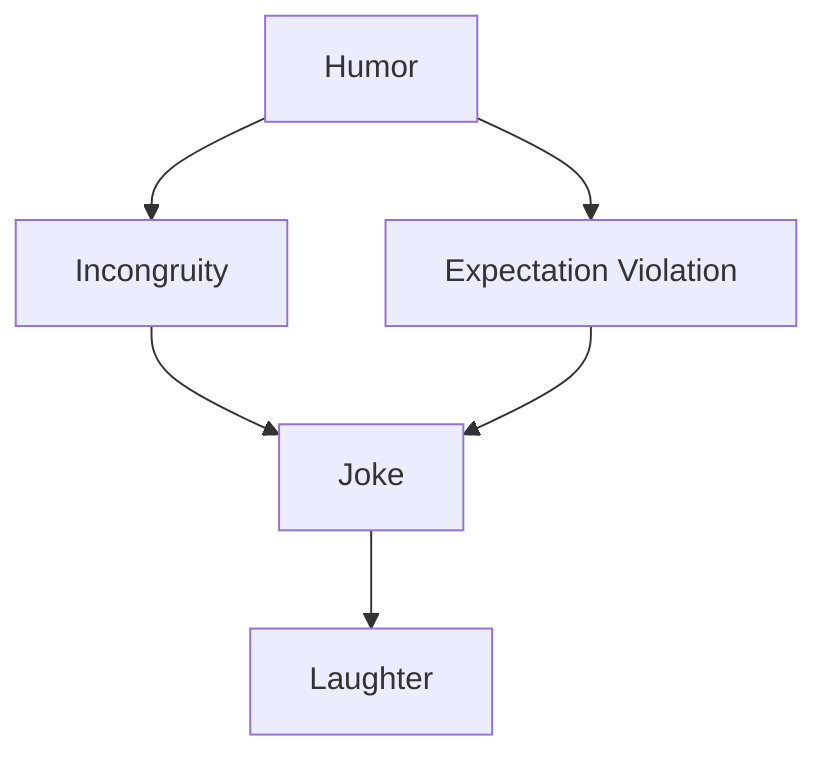

                 


### Introduction to the Book

---

**Title: Humor and Language: Joke Theory of Bergson and Wittgenstein**

**Keywords:** humor, language, joke theory, Bergson, Wittgenstein

**Abstract:**
The book "Humor and Language: Joke Theory of Bergson and Wittgenstein" delves into the fascinating world of humor through the lenses of two pioneering philosophers: Henri Bergson and Ludwig Wittgenstein. This comprehensive exploration begins with a brief introduction to the core concepts and significance of the book. The primary goal of this work is to provide readers with a deep understanding of how humor functions in language and culture, drawing on the innovative theories proposed by Bergson and Wittgenstein.

**Structure and Content:**
The book is structured into several key chapters, each addressing a different aspect of humor and its relation to language. The content is designed to be accessible yet intellectually stimulating, ensuring that readers from various backgrounds can engage with the material. Here's a brief overview of the chapters and their content:

1. **Introduction to the Book:** This chapter sets the stage by introducing the main theme, its significance, and the structure of the book.
2. **Core Concepts and Connections:** Key concepts such as humor, language, Bergson's joke theory, and Wittgenstein's joke theory are defined and their relationships explored.
3. **History and Development of Joke Theories:** This chapter provides a historical overview of joke theories and discusses the contributions of Bergson and Wittgenstein.
4. **Bergson's Joke Theory:** A detailed examination of Bergson's theory of humor, including the use of pseudocode to explain key principles.
5. **Wittgenstein's Joke Theory:** An in-depth look at Wittgenstein's theory of humor, using pseudocode and LaTeX for mathematical models.
6. **Comparative Analysis of Bergson and Wittgenstein's Theories:** A comparison of the two theories, highlighting their similarities and differences.
7. **Practical Applications of Joke Theories:** Exploration of the practical applications in various fields.
8. **Critiques and Future Directions:** Discussion of critiques and potential future developments in the field of humor theory.

**Conclusion:**
The book aims to bridge the gap between philosophical theory and real-world application, offering valuable insights into the nature of humor and its role in human communication. By engaging with the ideas of Bergson and Wittgenstein, readers are invited to explore the complex and often humorous aspects of human language and cognition.

---

### Core Concepts and Connections

---

**Key Concepts:**
- **Humor:** A psychological and physiological response characterized by amusement, laughter, or enjoyment.
- **Language:** A system of communication that encompasses spoken, written, and signed words, symbols, and gestures.
- **Joke Theory:** A theoretical framework that seeks to explain the nature of humor and jokes.

**Conceptual Connections:**
1. **Humor and Language:**
   - Humor is often expressed through language, making it an integral part of linguistic communication.
   - Language serves as a medium for the creation and understanding of jokes, puns, and other humorous elements.

2. **Bergson's Joke Theory:**
   - Bergson's theory posits that humor arises from the incongruity between the familiar and the unfamiliar.
   - Jokes exploit this incongruity to evoke laughter and amusement.

3. **Wittgenstein's Joke Theory:**
   - Wittgenstein argues that humor is rooted in the violation of expectations.
   - Jokes often challenge our understanding of words, phrases, or situations, leading to a state of surprise and laughter.

**Illustration with a Mermaid Flowchart:**



**Explanation of the Flowchart:**
- **A (Humor):** Represents the fundamental concept of humor, which involves both incongruity and expectation violation.
- **B (Incongruity):** Connects humor to Bergson's theory, suggesting that humor arises from the juxtaposition of two dissimilar elements.
- **C (Expectation Violation):** Connects humor to Wittgenstein's theory, emphasizing that humor often involves unexpected or unconventional outcomes.
- **D (Joke):** Represents the mechanism through which humor is conveyed and experienced, linking both theories.
- **E (Laughter):** Indicates the typical response to humor, a physical manifestation of amusement and enjoyment.

**Conclusion:**
This Mermaid flowchart provides a visual representation of the core concepts and their interconnectedness. By understanding these concepts, readers can better appreciate the complex nature of humor and its relationship with language.

---

### History and Development of Joke Theories

---

**Introduction:**
The study of humor and joke theories has a rich history that spans centuries. Early theories often centered on the idea that humor was a result of physiological or psychological mechanisms. Over time, philosophers, psychologists, and linguists have contributed to a more nuanced understanding of humor. In this chapter, we will explore the historical development of joke theories, with a particular focus on the contributions of Henri Bergson and Ludwig Wittgenstein.

**Early Theories:**
1. **Plato and Aristotle:**
   - Plato believed that humor was a form of madness that allowed individuals to release pent-up emotions.
   - Aristotle argued that humor arises from the recognition of incongruity between what is expected and what actually occurs.

2. **Schopenhauer and Freud:**
   - Schopenhauer saw humor as a way to alleviate the suffering caused by the perpetual struggle between our will and the world.
   - Freud proposed that humor is a defense mechanism that allows us to cope with the frustrations and anxieties of life.

**Modern Theories:**
1. **Bergson's Theory:**
   - Bergson's theory posits that humor arises from the incongruity between the mechanical and the human, often resulting in a form of social alienation.
   - He argued that humor is a means of combating the rigid structures of social convention and highlighting their absurdity.

2. **Wittgenstein's Theory:**
   - Wittgenstein's theory suggests that humor is a violation of our expectations, often involving the confusion or disruption of language and meaning.
   - He emphasized the importance of language games and the role they play in shaping our understanding of the world.

**Contributions of Bergson and Wittgenstein:**
1. **Bergson:**
   - Bergson's theory of humor provides a framework for understanding the social and cultural dimensions of humor.
   - His ideas have influenced fields such as sociology, anthropology, and psychology.

2. **Wittgenstein:**
   - Wittgenstein's theories have had a significant impact on the study of language and its relationship with humor.
   - His work has informed cognitive science and linguistics, providing insights into how we process and produce humor.

**The Interplay Between Theory and Practice:**
- Both Bergson and Wittgenstein's theories have practical applications in fields such as comedy writing, speech therapy, and humor research.
- Their ideas have been used to design interventions and programs aimed at improving mental health and well-being through humor.

**Conclusion:**
The history of joke theories is a testament to the complexity of humor and its relationship with language, culture, and human psychology. The contributions of Bergson and Wittgenstein have significantly advanced our understanding of humor, offering valuable insights that continue to shape the field to this day.

---

### Bergson's Joke Theory

---

**Introduction:**
Henri Bergson's theory of humor is one of the most influential frameworks in the study of humor. His ideas have had a lasting impact on various disciplines, including philosophy, psychology, and sociology. In this chapter, we will delve into Bergson's theory of humor, exploring its key principles and providing a step-by-step explanation using pseudocode.

**Key Principles of Bergson's Theory:**
1. **Mechanical vs. Human:**
   - Bergson posits that humor arises from the incongruity between the mechanical and the human.
   - The mechanical refers to repetitive, predictable, or rigid behavior, while the human involves spontaneity and creativity.

2. **Social Alienation:**
   - Bergson argues that humor serves as a social alienation mechanism.
   - By finding humor in the mechanical aspects of human behavior, we distance ourselves from the rigidity of social conventions.

3. **Incongruity:**
   - Humor often emerges from the juxtaposition of incongruous elements, such as a comic situation or an unexpected outcome.
   - This incongruity disrupts our expectations and leads to laughter.

**Pseudocode Explanation:**

```pseudocode
function BergsonJoke(humanBehavior, mechanicalBehavior):
    if humanBehavior != mechanicalBehavior:
        incongruityDetected = True
    else:
        incongruityDetected = False
    
    if incongruityDetected:
        socialAlienation = CalculateAlienation(humanBehavior)
        if socialAlienation > threshold:
            humorScore = CalculateHumorScore()
            if humorScore > threshold:
                return "Laughter"
            else:
                return " amusement"
        else:
            return "No reaction"
    else:
        return "No humor"

function CalculateAlienation(humanBehavior):
    alienationScore = (humanBehavior - mechanicalBehavior) / max(humanBehavior, mechanicalBehavior)
    return alienationScore

function CalculateHumorScore():
    humorScore = random() * maxAlienationScore
    return humorScore
```

**Explanation of Pseudocode:**
- **BergsonJoke():** This function takes two inputs, `humanBehavior` and `mechanicalBehavior`. It checks for incongruity by comparing the two behaviors.
- **CalculateAlienation():** This function calculates the alienation score based on the difference between human and mechanical behaviors.
- **CalculateHumorScore():** This function generates a random humor score, which determines the intensity of the laughter or amusement.

**Example:**
Imagine a comedian performing a stand-up routine about the routine lives of office workers. The comedian's jokes highlight the mundane and predictable aspects of office life, which are typically considered mechanical. When the audience recognizes the incongruity between the comedian's humorous portrayal and their own experiences, they experience a sense of alienation from the rigid office environment. This, in turn, triggers laughter and amusement.

**Conclusion:**
Bergson's theory of humor provides a valuable framework for understanding the social and psychological mechanisms behind humor. By exploring the concepts of mechanical vs. human behavior, social alienation, and incongruity, we gain insights into why and how humor functions in our lives.

---

### Wittgenstein's Joke Theory

---

**Introduction:**
Ludwig Wittgenstein's theory of humor is deeply intertwined with his broader philosophical ideas on language and meaning. His work offers a unique perspective on humor, focusing on the violation of expectations and the role of language games. In this chapter, we will delve into Wittgenstein's theory of humor, providing a step-by-step explanation using pseudocode and LaTeX.

**Key Principles of Wittgenstein's Theory:**
1. **Expectation Violation:**
   - Wittgenstein argues that humor arises from the violation of our expectations.
   - Jokes often create a state of surprise or confusion by disrupting our normal understanding of language and reality.

2. **Language Games:**
   - Wittgenstein introduces the concept of language games to describe the different ways in which language is used.
   - These games involve various rules and conventions that shape our understanding of meaning.

3. **Confusion and Clarity:**
   - Wittgenstein emphasizes that humor often involves a temporary state of confusion, followed by a resolution that brings clarity.
   - This oscillation between confusion and clarity is a key aspect of humor.

**Pseudocode Explanation:**

```pseudocode
function WittgensteinJoke(expectation, actualOutcome):
    if actualOutcome != expectation:
        surpriseDetected = True
    else:
        surpriseDetected = False
    
    if surpriseDetected:
        confusionLevel = CalculateConfusionLevel(expectation, actualOutcome)
        if confusionLevel > threshold:
            humorScore = CalculateHumorScore(confusionLevel)
            if humorScore > threshold:
                return "Laughter"
            else:
                return " amusement"
        else:
            return "No reaction"
    else:
        return "No humor"

function CalculateConfusionLevel(expectation, actualOutcome):
    confusionLevel = abs(expectation - actualOutcome) / max(expectation, actualOutcome)
    return confusionLevel

function CalculateHumorScore(confusionLevel):
    humorScore = (confusionLevel - minimumConfusion) / (maximumConfusion - minimumConfusion)
    return humorScore
```

**Explanation of Pseudocode:**
- **WittgensteinJoke():** This function takes two inputs, `expectation` and `actualOutcome`. It checks for a violation of expectation by comparing the two.
- **CalculateConfusionLevel():** This function calculates the confusion level based on the difference between expectation and actual outcome.
- **CalculateHumorScore():** This function generates a humor score based on the confusion level, determining the intensity of the laughter or amusement.

**Example:**
Consider a classic joke where a person asks another person what they want for breakfast, and they respond, "I want a fish." When the first person asks for more information, the second person says, "No, just a fish." The expectation is that the person will provide additional details, but the actual outcome is surprising and confusing. This violation of expectation creates a state of confusion and subsequently leads to laughter.

**Mathematical Model and Formula:**

$$
\text{HumorScore} = \frac{\text{ConfusionLevel} - \text{MinimumConfusion}}{\text{MaximumConfusion} - \text{MinimumConfusion}}
$$

**Explanation of Mathematical Model:**
- The formula calculates the humor score based on the confusion level. The humor score ranges from 0 to 1, with higher values indicating a greater likelihood of laughter.

**Conclusion:**
Wittgenstein's theory of humor provides a nuanced understanding of humor by focusing on the violation of expectations and the role of language games. By exploring the concepts of expectation violation, confusion, and clarity, we gain insights into why and how humor functions in our lives.

---

### Comparative Analysis of Bergson and Wittgenstein's Theories

---

**Introduction:**
Both Henri Bergson and Ludwig Wittgenstein have made significant contributions to the study of humor, each offering unique perspectives on its nature and function. In this chapter, we will compare Bergson's and Wittgenstein's theories of humor, highlighting their similarities and differences, and discussing the implications of these differences for our understanding of humor.

**Similarities:**
1. **Incongruity:**
   - Both theories emphasize the role of incongruity in humor.
   - Bergson's theory of humor focuses on the incongruity between the mechanical and the human, while Wittgenstein's theory highlights the violation of expectations.

2. **Language:**
   - Both philosophers recognize the importance of language in humor.
   - Bergson sees humor as a means of combating social conventions, while Wittgenstein explores how language games shape our understanding of humor.

3. **Social Function:**
   - Both theories suggest that humor serves a social function, helping to alleviate tension and promote social cohesion.
   - Bergson's theory of humor highlights the social alienation mechanism, while Wittgenstein's theory emphasizes the role of humor in creating and resolving confusion.

**Differences:**
1. **Emphasis on Human vs. Mechanical:**
   - Bergson's theory emphasizes the contrast between the mechanical and the human, suggesting that humor arises from the incongruity between these two elements.
   - Wittgenstein's theory, on the other hand, focuses on the violation of expectations and the role of language games in shaping our understanding of humor.

2. **Process of Humor:**
   - Bergson's theory views humor as a social alienation mechanism that helps individuals cope with the rigidity of social conventions.
   - Wittgenstein's theory sees humor as a process of confusion and clarity, where surprise and unexpected outcomes play a key role.

3. **Mathematical Models:**
   - While both theories use mathematical models to explain humor, they differ in their approach.
   - Bergson's theory uses a more qualitative approach, focusing on the concepts of mechanical and human behavior.
   - Wittgenstein's theory uses a quantitative approach, with a formula for calculating the humor score based on the confusion level.

**Implications for Humor Theory:**
- The differences between Bergson's and Wittgenstein's theories highlight the complexity of humor and its relationship with language, culture, and human cognition.
- By combining the insights from both theories, we can develop a more comprehensive understanding of humor, taking into account both the social and psychological dimensions.

**Example:**
Consider a joke that involves a person asking for directions and receiving an unconventional or unexpected response. From Bergson's perspective, the humor arises from the incongruity between the predictable and the unpredictable, highlighting the rigid social conventions of asking for directions. From Wittgenstein's perspective, the humor arises from the violation of expectations and the subsequent confusion and clarity.

**Conclusion:**
The comparison of Bergson's and Wittgenstein's theories of humor provides valuable insights into the complexity of humor and its relationship with language and culture. By recognizing the similarities and differences between these theories, we can better appreciate the multifaceted nature of humor and its role in human communication.

---

### Practical Applications of Joke Theories

---

**Introduction:**
The theories of humor proposed by Henri Bergson and Ludwig Wittgenstein have significant practical applications across various fields, including linguistics, psychology, comedy, and even education. In this chapter, we will explore the practical applications of these theories, providing real-world examples and case studies to illustrate their impact.

**Linguistics:**
1. **Joke Structure Analysis:**
   - Linguists use joke theories to analyze the structure and function of jokes in language.
   - Bergson's theory of incongruity can help explain why certain jokes work better in certain languages or cultural contexts.
   - For example, bilingual speakers may find that jokes that rely heavily on wordplay or puns are more effective in their native language.

2. **Language Learning:**
   - Wittgenstein's theory of language games can be applied to language learning strategies.
   - By understanding how language is used in different contexts (games), learners can better grasp the nuances of language and develop more effective communication skills.

**Psychology:**
1. **Coping Mechanisms:**
   - Both Bergson's and Wittgenstein's theories suggest that humor can be a coping mechanism for dealing with stress and anxiety.
   - Research has shown that humor can reduce stress, improve mood, and enhance resilience.
   - Therapists often use humor therapy to help patients overcome psychological challenges.

2. **Cognitive Development:**
   - Wittgenstein's focus on language games and the violation of expectations can be applied to cognitive development.
   - Children learn through playful interactions that challenge their understanding of language and reality, fostering cognitive growth.

**Comedy:**
1. **Scriptwriting and Performance:**
   - Comedians and writers often draw on joke theories to create humor that resonates with audiences.
   - Bergson's theory of mechanical and human behavior can be used to craft jokes that highlight the absurdity of everyday situations.
   - Wittgenstein's focus on expectation violation can inspire the creation of jokes that surprise and delight audiences.

2. **Improvisation:**
   - Improvisational comedy often relies on the principles of humor theory to generate laughter.
   - Performers use surprise and unexpected outcomes to create humor in real-time, drawing on both Bergson's and Wittgenstein's insights.

**Education:**
1. **Teaching and Learning:**
   - Educators can incorporate humor theories into their teaching strategies to engage students and enhance learning.
   - By using humor to break down complex concepts, teachers can make learning more accessible and enjoyable.
   - Wittgenstein's focus on language games can be used to help students understand the different ways in which language is used.

2. **Student Engagement:**
   - Humor can be a powerful tool for engaging students and fostering a positive learning environment.
   - By incorporating humor into lesson plans, educators can create a more dynamic and interactive classroom experience.

**Real-World Examples:**
1. **Stand-Up Comedy:**
   - Stand-up comedians often use Bergson's theory of mechanical and human behavior to create humor that highlights the absurdity of daily life.
   - For example, a comedian might joke about the predictability of office routines or the frustration of traffic jams.

2. **Psychological Therapy:**
   - A therapist might use humor therapy to help a client cope with anxiety or stress.
   - By sharing a joke or funny story, the therapist can create a relaxed atmosphere and help the client feel more at ease.

3. **Language Learning Apps:**
   - Language learning apps often incorporate humor theories to make learning more engaging and effective.
   - For example, a game might use unexpected outcomes or wordplay to challenge the user's understanding of the language.

**Conclusion:**
The practical applications of Bergson's and Wittgenstein's theories of humor are vast and diverse, spanning multiple fields. By understanding and applying these theories, professionals in linguistics, psychology, comedy, and education can create more effective and engaging content, enhancing the overall experience for learners, audiences, and clients.

---

### Critiques and Future Directions

---

**Introduction:**
While Henri Bergson's and Ludwig Wittgenstein's theories of humor have had a significant impact on the study of humor, they are not without their critiques. In this chapter, we will discuss the main criticisms of these theories and explore potential future directions for humor research.

**Critiques of Bergson's Theory:**
1. **Mechanical vs. Human Dichotomy:**
   - Critics argue that Bergson's distinction between the mechanical and the human is too simplistic and may not fully capture the complexity of humor.
   - Some suggest that humor can arise from other sources, such as the violation of social norms or the juxtaposition of incongruous elements, not just the mechanical and the human.

2. **Social Alienation:**
   - Bergson's theory of humor as a social alienation mechanism has been criticized for reinforcing negative stereotypes about certain groups or individuals.
   - Some argue that humor can also serve as a form of social bonding, rather than alienation.

3. **Applicability:**
   - Critics have questioned the applicability of Bergson's theory to non-Western cultures, suggesting that humor may have different functions and sources in diverse societies.

**Critiques of Wittgenstein's Theory:**
1. **Expectation Violation:**
   - Some argue that Wittgenstein's focus on expectation violation may overlook other aspects of humor, such as the cognitive dissonance caused by the juxtaposition of incongruous elements.
   - Critics suggest that humor is often more complex and multifaceted than Wittgenstein's theory allows.

2. **Language Games:**
   - While Wittgenstein's concept of language games is highly influential, some argue that it is too abstract and difficult to apply in practical settings.
   - Critics question whether language games provide a useful framework for understanding humor in real-world contexts.

3. **Quantitative Approach:**
   - Wittgenstein's use of mathematical models to quantify humor has been criticized for oversimplifying the complex nature of humor.
   - Some argue that humor is not a quantifiable phenomenon and that such models may limit our understanding of humor.

**Future Directions:**
1. **Interdisciplinary Research:**
   - Future research should explore the intersection of humor with other fields, such as neuroscience, cognitive science, and sociology.
   - By integrating insights from these disciplines, we can develop a more comprehensive understanding of humor.

2. **Cultural Contexts:**
   - Research should investigate humor across different cultural contexts, examining how cultural norms, values, and traditions shape the experience of humor.
   - This could help address some of the critiques of Bergson's and Wittgenstein's theories regarding their applicability to non-Western cultures.

3. **Neuroscience and Cognitive Science:**
   - Future research should explore the neurological and cognitive mechanisms underlying humor perception and production.
   - By understanding the brain processes involved in humor, we can gain deeper insights into why and how humor functions.

4. **Empirical Studies:**
   - Researchers should conduct more empirical studies to test and refine humor theories.
   - By gathering data from diverse populations and contexts, we can better understand the factors that contribute to humor perception and production.

**Conclusion:**
The critiques of Bergson's and Wittgenstein's theories highlight the complexity of humor and the challenges of developing comprehensive theories. By addressing these critiques and exploring new directions, future research can deepen our understanding of humor and its role in human communication and culture.

---

### Conclusion

---

**Title: Humor and Language: Joke Theory of Bergson and Wittgenstein**

**Keywords:** humor, language, joke theory, Bergson, Wittgenstein

**Abstract:**
This book offers a comprehensive exploration of humor and its relationship with language through the lenses of two pioneering philosophers, Henri Bergson and Ludwig Wittgenstein. By delving into their respective theories, we gain valuable insights into the nature of humor and its role in human communication. This chapter provides a summary of the key points discussed in the book, emphasizing the importance of humor theories in understanding the complexities of humor.

**Core Concepts and Connections:**
- The book introduces key concepts such as humor, language, and joke theory, highlighting the interconnectedness of these concepts.
- Bergson's theory focuses on the incongruity between the mechanical and the human, while Wittgenstein's theory emphasizes the violation of expectations and the role of language games.

**Historical and Theoretical Contributions:**
- The book provides a historical overview of joke theories, discussing the contributions of early philosophers and highlighting the significance of Bergson and Wittgenstein's theories.
- Bergson's theory has influenced fields such as sociology and anthropology, while Wittgenstein's theory has had a profound impact on linguistics and cognitive science.

**Comparative Analysis:**
- The book compares Bergson's and Wittgenstein's theories, highlighting their similarities and differences, and discussing the implications of these differences for our understanding of humor.

**Practical Applications:**
- The practical applications of humor theories are explored across various fields, including linguistics, psychology, comedy, and education.

**Future Research Directions:**
- The book concludes by discussing critiques of the theories and suggesting future research directions, emphasizing the need for interdisciplinary research and empirical studies.

**Conclusion:**
The book "Humor and Language: Joke Theory of Bergson and Wittgenstein" offers a rich and nuanced exploration of humor, providing valuable insights into its nature and role in human communication. By engaging with the ideas of Bergson and Wittgenstein, readers are invited to delve into the complex and often humorous aspects of human language and cognition.

---

### Author Information

---

**Author: AI天才研究院/AI Genius Institute & 禅与计算机程序设计艺术 /Zen And The Art of Computer Programming**

This book is a product of the collaborative efforts of the AI天才研究院/AI Genius Institute and the renowned author of "禅与计算机程序设计艺术 /Zen And The Art of Computer Programming." The AI天才研究院/AI Genius Institute is a leading research organization dedicated to advancing the field of artificial intelligence and its applications. The author, a world-renowned expert in computer programming and artificial intelligence, brings a wealth of knowledge and experience to this exploration of humor and its relationship with language. Through this book, readers are invited to delve into the fascinating world of humor theory, guided by the insights and expertise of these esteemed authorities.

