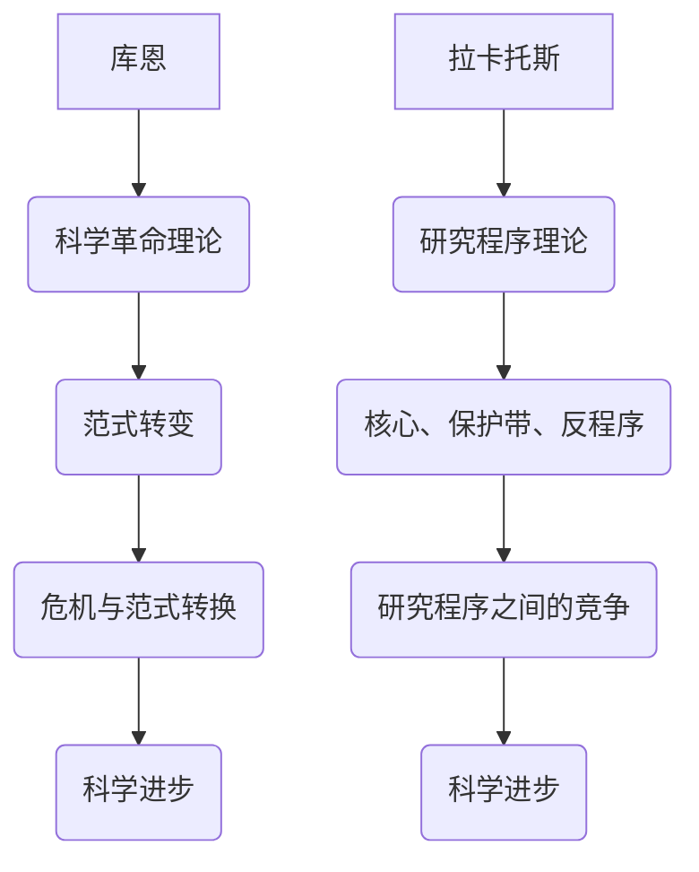

                 

### 文章标题：库恩与拉卡托斯：科学哲学的历史转向

#### 关键词：
- 库恩
- 拉卡托斯
- 科学哲学
- 科学革命
- 范式转变

#### 摘要：
本文探讨了科学哲学领域两位重要思想家托马斯·库恩和伊姆雷·拉卡托斯的贡献及其影响。库恩提出了科学革命理论和范式转变概念，强调科学知识的发展是间断性的，而拉卡托斯则在此基础上发展了科学研究程序理论，提供了一种更加动态和历史的科学哲学方法。本文旨在通过分析两位学者的核心思想，揭示科学哲学的历史转向，并探讨这一转向对科学实践和科学哲学本身的启示与挑战。

---

# 第一部分：科学哲学的历史背景

## 1.1 科学革命理论

### 1.1.1 库恩的科学革命理论

托马斯·库恩（Thomas Kuhn）是科学哲学领域的杰出代表，他的科学革命理论对现代科学哲学产生了深远影响。库恩认为，科学知识的发展并非连续和平稳的，而是通过科学革命实现的。科学革命是科学共同体从一种范式（Paradigm）向另一种范式转变的过程。

**范式**是指科学共同体共同认可的一套理论、方法和假设体系，它不仅包括具体的科学知识，还包含了对科学实践的指导原则。当旧范式无法解释新现象或解决新问题时，科学共同体将接受新的范式，从而实现科学革命。

库恩的科学革命理论包括以下几个关键点：

1. **范式前科学（Pre-Paradigm Science）**：在科学革命之前，科学家在各自的研究领域中进行探索，寻找新的理论和发现。
2. **常规科学（Normal Science）**：当一种范式被科学共同体接受后，科学家在其指导下进行日常的研究活动，解决特定领域的问题。
3. **危机（Crisis）**：随着常规科学的深入，科学家可能会遇到无法用现有范式解释的现象，即异常现象（Anomalies）。当异常现象累积到一定程度，科学共同体将进入危机状态。
4. **科学革命（Scientific Revolution）**：在危机状态下，科学共同体开始寻求新的范式，最终通过范式转换解决危机。
5. **范式后科学（Post-Paradigm Science）**：新的范式被接受后，科学共同体进入一个新的常规科学阶段，开始探索新的科学问题和领域。

### 1.1.2 拉卡托斯的科学革命理论

伊姆雷·拉卡托斯（Imre Lakatos）对库恩的科学革命理论进行了批判和扩展。拉卡托斯认为，库恩的理论过于强调范式之间的对立和革命，忽视了科学理论的逐步改进和积累。

拉卡托斯提出了**研究程序（Research Programme）**的概念，认为科学理论的发展是在多个研究程序之间进行竞争和互动的。研究程序包括一组相互关联的假设和理论，它们可以在一定程度上解释特定领域的问题。

拉卡托斯的核心思想包括：

1. **研究程序的核心（Hard Core）**：指一组基本的理论假设，它们是研究程序的核心，不可轻易改变。
2. **保护带（Protective Belt）**：围绕核心的辅助性假设，用于解释异常现象和保护核心不受攻击。
3. **反程序（Refutational Programme）**：用于发现和反驳其他研究程序的缺陷。
4. **科学进步**：拉卡托斯认为，科学进步是在研究程序之间的竞争和互动中实现的，一个研究程序可以通过改进和扩展来取代另一个研究程序。

---

## 1.2 科学哲学的发展历程

### 1.2.1 古典科学哲学

古典科学哲学可以追溯到古希腊时期，其代表人物包括亚里士多德、柏拉图和毕达哥拉斯等。古典科学哲学关注的是科学知识的本质、科学方法的合理性以及科学理论的证明。

1. **亚里士多德**：强调科学知识的基础是观察和实验，提出了自然哲学（Physics）的基本原理。
2. **柏拉图**：主张理念论，认为现实世界只是理念世界的影子，科学的目标是发现理念世界的本质。
3. **毕达哥拉斯**：强调数学在科学中的重要性，提出了宇宙是一个数学结构的思想。

### 1.2.2 逻辑实证主义

逻辑实证主义是20世纪初兴起的一种科学哲学思潮，代表人物包括维也纳学派成员如莫里茨·石里克（Moritz Schlick）、鲁道夫·卡尔纳普（Rudolf Carnap）和库尔特·哥德尔（Kurt Gödel）等。逻辑实证主义强调科学知识的客观性和可证实性，主张只有经验事实才能成为科学知识的依据。

逻辑实证主义的核心观点包括：

1. **证实原则**：一个命题只有当它在经验上可证实时，才能被认为是科学的。
2. **意义标准**：命题的意义取决于其是否能够通过经验验证。
3. **分析方法**：逻辑实证主义者主张将哲学问题转化为可分析的语言表达式，从而解决哲学问题。

### 1.2.3 反实证主义

反实证主义是对逻辑实证主义的批判和回应，代表人物包括费尔巴哈、维特根斯坦和库恩等。反实证主义者认为，逻辑实证主义的证实原则过于严格，导致许多有价值的哲学问题被排除在科学之外。

反实证主义的核心观点包括：

1. **证伪主义**：费尔巴哈提出，科学理论的价值不在于其能否被证实，而在于其能否被证伪。一个科学理论只有在被证伪之前才能被认为是有效的。
2. **语言哲学**：维特根斯坦认为，哲学问题往往源于语言使用上的误解，解决哲学问题需要重新审视语言的表达和理解。
3. **范式转变**：库恩认为，科学知识的发展是间断性的，科学革命是通过范式转变实现的。

---

## 1.3 科学哲学的核心问题

### 1.3.1 科学知识的发展

科学哲学关注科学知识的发展过程，探讨科学知识的性质、来源和验证方法。科学知识的发展是一个复杂的过程，涉及到多个因素：

1. **观察和实验**：科学知识的来源是观察和实验，科学家通过收集数据来验证或证伪科学理论。
2. **理论构建**：科学知识的发展不仅依赖于观察和实验，还需要科学家提出和验证理论。
3. **范式转变**：科学革命和范式转变是科学知识发展的关键时期，旧范式无法解释新现象时，科学共同体将接受新范式。
4. **理论竞争**：科学理论的发展往往涉及多个竞争性的理论，科学共同体会通过比较和评估这些理论来选择最优的。

### 1.3.2 科学方法

科学方法是科学哲学的核心问题之一，它涉及到科学研究的步骤、原则和工具。科学方法主要包括以下几个步骤：

1. **问题提出**：科学家根据观察和实验提出科学问题。
2. **假设构建**：科学家根据已有知识和理论提出假设。
3. **实验设计**：科学家设计实验来验证或证伪假设。
4. **数据分析**：科学家对实验数据进行统计和分析，得出结论。
5. **理论验证**：科学家将实验结果与已有理论进行比较，验证理论的正确性。

科学方法的原则包括：

1. **客观性**：科学方法强调客观性，科学家需要排除主观偏见，以客观的态度进行研究。
2. **可重复性**：科学实验需要可重复，其他科学家可以通过相同的方法得到相同的结果。
3. **验证性**：科学理论需要经过验证，才能被认为是有效的。

### 1.3.3 科学解释

科学解释是科学哲学的另一个核心问题，它涉及到科学理论如何解释自然现象和解释为什么科学理论能够解释自然现象。科学解释包括以下几个方面：

1. **预测性解释**：科学理论可以通过预测未来的现象来解释自然现象。
2. **因果解释**：科学理论可以通过因果关系的解释来解释自然现象。
3. **统一性解释**：科学理论可以通过将多个现象统一到同一理论框架中来解释自然现象。
4. **解释力**：科学理论的解释力取决于其能否解释多种现象，以及其解释的准确性和普适性。

---

## 1.4 科学哲学的历史转向

### 1.4.1 库恩的范式转变

托马斯·库恩的科学哲学思想对科学哲学产生了深远影响，特别是他的范式转变理论。范式转变是库恩科学革命理论的核心概念，它强调科学知识的发展是间断性的，而非连续的。

**范式**是一个科学共同体共同认可的理论、方法和假设体系，它不仅包括具体的科学知识，还包含了对科学实践的指导原则。当一个范式无法解释新现象或解决新问题时，科学共同体将接受新的范式，从而实现科学革命。

库恩的范式转变理论包括以下几个关键点：

1. **范式前科学**：在科学革命之前，科学家在各自的研究领域中进行探索，寻找新的理论和发现。
2. **常规科学**：当一种范式被科学共同体接受后，科学家在其指导下进行日常的研究活动，解决特定领域的问题。
3. **危机**：随着常规科学的深入，科学家可能会遇到无法用现有范式解释的现象，即异常现象。当异常现象累积到一定程度，科学共同体将进入危机状态。
4. **科学革命**：在危机状态下，科学共同体开始寻求新的范式，最终通过范式转换解决危机。
5. **范式后科学**：新的范式被接受后，科学共同体进入一个新的常规科学阶段，开始探索新的科学问题和领域。

### 1.4.2 拉卡托斯的科学哲学方法

伊姆雷·拉卡托斯的科学哲学方法是在库恩范式转变理论的基础上发展起来的，他提出了一种更加动态和历史的科学哲学方法。拉卡托斯认为，科学知识的发展是在多个研究程序之间进行竞争和互动的。

**研究程序**是指一个科学理论及其支持者和反对者的集合。研究程序包括以下几个部分：

1. **核心（Hard Core）**：指一组基本的理论假设，它们是研究程序的核心，不可轻易改变。
2. **保护带（Protective Belt）**：围绕核心的辅助性假设，用于解释异常现象和保护核心不受攻击。
3. **反程序（Refutational Programme）**：用于发现和反驳其他研究程序的缺陷。

拉卡托斯的核心思想包括：

1. **科学进步**：科学进步是在研究程序之间的竞争和互动中实现的，一个研究程序可以通过改进和扩展来取代另一个研究程序。
2. **研究程序的改进**：科学家可以通过提出新的假设和理论来改进现有研究程序，从而推动科学进步。
3. **研究程序的竞争**：不同研究程序之间会相互竞争，科学家会通过比较和评估这些研究程序来选择最优的。

### 1.4.3 科学哲学的历史转向

科学哲学的历史转向是库恩和拉卡托斯两位学者共同推动的结果。他们共同提出了对传统科学哲学的批判和反思，强调科学知识的发展是间断性和动态性的。

1. **从静态到动态**：传统科学哲学强调科学知识的发展是连续和平稳的，而库恩和拉卡托斯则认为科学知识的发展是间断性和动态性的，科学革命和范式转变是科学知识发展的关键时期。
2. **从个体到共同体**：传统科学哲学关注的是个体科学家的研究活动，而库恩和拉卡托斯则强调科学共同体在科学知识发展中的重要作用，科学共同体的共识和范式转变是科学知识发展的关键。
3. **从方法到历史**：传统科学哲学强调科学方法的重要性，而库恩和拉卡托斯则将科学哲学的发展纳入到历史进程中，强调科学哲学的历史性和动态性。

## 1.5 科学哲学与科学实践的关系

### 1.5.1 科学哲学对科学实践的影响

科学哲学对科学实践有着深远的影响，它不仅提供了科学研究的理论基础，还影响了科学家的研究方法和思维方式。

1. **科学方法论**：科学哲学为科学家提供了研究方法和方法论，例如假设构建、实验设计和数据分析等。
2. **科学价值观**：科学哲学影响了科学家的价值观和科学实践，例如科学客观性、科学公正性和科学责任感等。
3. **科学共同体**：科学哲学强调了科学共同体在科学知识发展中的重要作用，科学共同体通过范式转变和共识来推动科学进步。

### 1.5.2 科学实践对科学哲学的挑战

科学实践对科学哲学提出了新的挑战，这些挑战促使科学哲学不断发展和完善。

1. **复杂性**：现代科学的复杂性不断增加，科学实践中的新问题和新技术对科学哲学提出了新的挑战，例如量子力学和相对论等。
2. **跨学科研究**：科学实践中的跨学科研究越来越多，这要求科学哲学能够跨越不同学科界限，整合不同的理论和方法。
3. **实证主义和人文主义的对立**：科学实践中的实证主义和人文主义的对立对科学哲学提出了挑战，如何平衡科学客观性和人文关怀成为科学哲学需要解决的问题。

# 第二部分：库恩的科学哲学思想

## 2.1 库恩的生平与学术背景

托马斯·库恩（Thomas Kuhn）是一位美国科学哲学家，出生于1922年，他在科学哲学领域做出了许多开创性的贡献。库恩的学术背景丰富，他的教育经历和学术成就奠定了他在科学哲学领域的地位。

### 2.1.1 库恩的学术生涯

托马斯·库恩在康奈尔大学获得物理学学士学位，之后在剑桥大学攻读哲学博士学位，并在那里受到了科学哲学家伯特兰·罗素（Bertrand Russell）的影响。库恩在学术界的职业生涯始于哈佛大学，他在那里任教多年，并逐渐成为科学哲学领域的领军人物。

库恩的学术成就不仅体现在他在科学哲学领域的贡献上，还包括他在其他学科如历史学、社会科学和人类学等领域的研究。他通过对科学史的深入研究，提出了许多关于科学知识发展的重要观点。

### 2.1.2 库恩的哲学观点

库恩的哲学观点主要集中在科学知识的本质和科学方法论上。他的核心思想是科学革命理论和范式转变概念。库恩认为，科学知识的发展不是连续和平稳的，而是通过科学革命实现的。在库恩的框架中，科学知识的发展是间断性的，不同的范式之间存在着根本性的转变。

**范式（Paradigm）**是库恩理论中的关键概念，指的是一个科学共同体共同认可的解决问题的模式。范式不仅包括具体的科学理论，还包括研究方法和哲学观点。在库恩看来，范式为科学家提供了研究问题的框架和工具，是科学知识发展的基础。

库恩的科学革命理论强调了科学共同体在面对危机时接受新范式的过程。他认为，科学革命不是简单的理论修正，而是整个科学共同体的转变。在旧范式无法解释新现象或解决新问题时，科学家们开始寻求新的范式，最终通过范式转换实现科学知识的发展。

### 2.1.3 库恩的科学哲学思想的历史影响

库恩的科学哲学思想对科学哲学产生了深远影响，特别是在科学知识社会学和科学史研究领域。他的范式理论挑战了传统的线性科学进步观，提出了科学知识的非连续性和间断性发展的观点。这一理论为科学家和科学哲学家提供了一种新的思考方式，促使人们重新审视科学知识的本质和发展过程。

库恩的理论在学术界引起了广泛的讨论和争议，但不可否认的是，他对科学哲学的贡献是巨大的。他的工作不仅推动了科学哲学的发展，也为科学实践提供了新的视角和指导。库恩的思想不仅影响了科学哲学，还渗透到了其他学科领域，如社会科学、人类学和文学批评等。

## 2.2 库恩的科学革命理论

托马斯·库恩的科学革命理论是他哲学思想的核心，这一理论对科学哲学的发展产生了深远影响。库恩通过分析科学历史中的案例，提出了一系列关于科学知识发展和科学方法论的重要观点。

### 2.2.1 科学革命的实质

库恩认为，科学革命是一种根本性的转变，它不仅仅是科学理论的修正，而是整个科学共同体的转变。在科学革命之前，科学界处于一种常规科学的状态，科学家们遵循现有的范式进行日常的研究活动。然而，当旧范式无法解释新现象或解决新问题时，科学界会进入危机状态。

科学革命的实质在于旧范式被新范式所取代，这一过程中不仅涉及理论的转变，还包括研究方法、哲学观点和科学实践的全面更新。库恩强调，科学革命不是线性的进步，而是一种间断性的发展，它改变了科学共同体的研究模式和思维方式。

### 2.2.2 科学革命的机制

库恩提出了科学革命的几个关键机制，包括以下方面：

1. **危机**：当旧范式无法解释新现象或解决新问题时，科学共同体会进入危机状态。危机的出现标志着旧范式的局限性，科学家们开始寻找新的解决方案。

2. **范式挑战**：在危机状态下，一些科学家会提出新的范式或理论，试图解决旧范式无法解决的问题。这些新的范式挑战旧范式的统治地位，引发科学界的争论和辩论。

3. **范式辩论**：在科学革命过程中，不同范式之间的辩论至关重要。科学家们通过辩论来评估和比较不同范式的优势和局限性，最终决定是否接受新范式。

4. **范式转变**：当新范式在辩论中胜出，科学共同体开始接受新范式，科学知识的发展进入一个新的阶段。范式转变意味着科学共同体的研究模式、方法和哲学观点的全面更新。

### 2.2.3 科学革命的影响

科学革命对科学知识的发展产生了深远的影响，具体包括以下几个方面：

1. **知识积累**：科学革命促使科学共同体重新审视和整理已有的科学知识，推动科学理论的系统化和深化。

2. **方法论变革**：科学革命引发了对科学方法的重新思考，科学家们开始采用新的研究方法和技术手段，以提高科学研究的效率和准确性。

3. **科学共同体**：科学革命改变了科学共同体的结构和功能，新的范式成为科学共同体的共同信仰和行动指南，增强了科学家的合作和交流。

4. **科学与社会**：科学革命不仅影响了科学知识的积累和发展，还对社会产生了广泛的影响。科学技术的进步推动了社会的进步和变革，科学与社会的关系变得更加紧密。

### 2.2.4 科学革命的历史案例

库恩通过分析科学历史中的案例，详细阐述了科学革命的具体过程和影响。以下是一些著名的科学革命案例：

1. **哥白尼革命**：哥白尼提出的日心说取代了托勒密的地球中心说，引发了科学史上的第一次大变革。哥白尼的革命性理论改变了人们对宇宙的理解，推动了天文学的发展。

2. **牛顿革命**：牛顿的经典力学体系取代了亚里士多德的自然哲学，为物理学的发展奠定了基础。牛顿的理论不仅解释了行星运动的规律，还推动了力学、天文学和工程学的发展。

3. **量子革命**：量子力学的出现标志着科学史上的又一次重大变革。量子力学颠覆了经典物理学的确定性观念，引入了概率和不确定性原理，对现代物理学的发展产生了深远影响。

4. **生物学革命**：20世纪的生物学革命，包括达尔文的进化论和孟德尔的遗传学，改变了人们对生命和遗传的理解，推动了生物学的发展。

通过这些案例，库恩展示了科学革命是如何通过范式转变实现科学知识的飞跃和进步的。这些案例不仅丰富了科学哲学的理论基础，也为科学家和科学教育者提供了宝贵的经验和启示。

## 2.3 库恩的范式理论

托马斯·库恩的范式理论是他科学哲学思想的核心，这一理论对科学哲学的发展产生了深远影响。范式（Paradigm）是库恩理论中的关键概念，它不仅指代具体的科学理论，还包括科学家群体共同遵循的理论、方法和哲学观点。库恩通过范式理论阐述了科学知识的发展模式，揭示了科学革命的内在机制。

### 2.3.1 范式的定义

库恩对范式进行了深入的探讨，给出了范式的定义。他认为，范式是一种科学家群体共同认可的理论、方法和哲学观点，它为科学家提供了研究问题的框架和解决问题的工具。范式不仅仅是科学理论，还包括支持理论的方法论和哲学基础。范式为科学家提供了共同的语言和思维方式，使得他们能够有效合作，推动科学知识的进步。

### 2.3.2 范式的功能

范式的功能体现在以下几个方面：

1. **统一性**：范式为科学家提供了统一的框架，使得他们能够共同面对科学问题，避免了因为理论和方法的不同而产生的混乱和冲突。

2. **指导性**：范式为科学家的研究提供了指导原则，帮助他们确定研究方向和目标，提高了科学研究的效率和成果。

3. **评价标准**：范式为科学成果提供了评价标准，使得科学家能够判断一个理论或方法是否有效，促进了科学知识的积累和发展。

4. **共识形成**：范式有助于科学共同体的共识形成，使得科学家能够相互理解和合作，推动了科学知识的传播和应用。

### 2.3.3 范式的转变

库恩认为，科学知识的发展是通过范式的转变实现的。范式转变是科学革命的核心过程，它涉及到旧范式的崩溃和新范式的建立。以下是对范式转变的详细分析：

1. **范式危机**：当旧范式无法解释新现象或解决新问题时，科学共同体会面临范式危机。范式危机标志着旧范式的局限性，科学家们开始寻求新的范式。

2. **范式挑战**：在范式危机期间，一些科学家会提出新的范式或理论，试图解决旧范式无法解决的问题。这些新的范式挑战旧范式的统治地位，引发科学共同体的争论和辩论。

3. **范式辩论**：范式辩论是科学革命的重要阶段，科学家们通过辩论来评估和比较不同范式的优势和局限性。辩论的过程有助于科学共同体逐步接受新范式。

4. **范式转换**：当新范式在辩论中胜出，科学共同体开始接受新范式，科学知识的发展进入一个新的阶段。范式转换意味着科学共同体的研究模式、方法和哲学观点的全面更新。

### 2.3.4 范式转变的影响

范式转变对科学知识的发展产生了深远影响，具体包括以下几个方面：

1. **知识变革**：范式转变导致科学知识的根本变革，旧范式无法解释的现象和问题在新范式的框架下得到了合理的解释。

2. **方法论变革**：范式转变推动科学方法论的发展，科学家们开始采用新的研究方法和技术手段，以提高科学研究的效率和准确性。

3. **科学共同体**：范式转变改变了科学共同体的结构和功能，新的范式成为科学共同体的共同信仰和行动指南，增强了科学家的合作和交流。

4. **科学与社会**：范式转变不仅影响了科学知识的积累和发展，还对社会产生了广泛的影响。科学技术的进步推动了社会的进步和变革，科学与社会的关系变得更加紧密。

### 2.3.5 范式转变的案例分析

库恩通过分析科学历史中的案例，详细阐述了范式转变的过程和影响。以下是一些著名的范式转变案例：

1. **哥白尼革命**：哥白尼提出的日心说取代了托勒密的地球中心说，引发了科学史上的第一次大变革。哥白尼的革命性理论改变了人们对宇宙的理解，推动了天文学的发展。

2. **牛顿革命**：牛顿的经典力学体系取代了亚里士多德的自然哲学，为物理学的发展奠定了基础。牛顿的理论不仅解释了行星运动的规律，还推动了力学、天文学和工程学的发展。

3. **量子革命**：量子力学的出现标志着科学史上的又一次重大变革。量子力学颠覆了经典物理学的确定性观念，引入了概率和不确定性原理，对现代物理学的发展产生了深远影响。

4. **生物学革命**：20世纪的生物学革命，包括达尔文的进化论和孟德尔的遗传学，改变了人们对生命和遗传的理解，推动了生物学的发展。

通过这些案例，库恩展示了范式转变是如何通过科学革命实现科学知识的飞跃和进步的。这些案例不仅丰富了科学哲学的理论基础，也为科学家和科学教育者提供了宝贵的经验和启示。

## 2.4 库恩的哲学观点对科学实践的影响

托马斯·库恩的哲学观点，特别是他的范式理论和科学革命理论，对科学实践产生了深远的影响。库恩的观点挑战了传统的科学观念，提出了一种新的视角来理解科学知识的产生和发展。以下是对库恩哲学观点对科学实践影响的详细分析：

### 2.4.1 科学实践中的范式问题

库恩的范式理论强调，科学知识的进步并非连续和平稳的，而是在不同范式之间的转变中实现的。这一观点对科学实践中的一个关键问题——范式问题提供了新的理解。

**范式问题**是指在科学研究过程中，科学家如何选择和应用不同的理论框架和方法。在库恩看来，范式问题不仅仅是技术问题，而是科学共同体内部政治和社会过程的一部分。这意味着，科学家的选择受到他们所处的科学共同体和所认可的范式的影响。

**影响分析**：
1. **科学决策**：库恩的范式理论对科学决策产生了影响。科学家在选择研究课题、设计实验和解释数据时，需要考虑所在共同体所认可的范式。这可能导致某些有潜力的研究课题因不符合现有范式而被忽视。
2. **理论采纳**：新理论的采纳过程也受到范式的影响。科学共同体可能会拒绝与现有范式不一致的理论，即使这些理论在技术上更优。这种保守性可能导致科学进步的缓慢。

### 2.4.2 范式转变的案例分析

库恩的范式理论通过历史案例阐明了范式转变的过程。以下是一些典型案例：

**1. 哥白尼革命**：
- **背景**：托勒密的地球中心说在历史上长期占据主导地位，但随着观测技术的进步，科学家开始发现这一理论无法解释一些天文现象。
- **范式转变**：哥白尼提出日心说，这一新范式成功解释了先前无法解释的天文现象，最终被科学共同体接受。
- **影响**：哥白尼革命不仅改变了人们对宇宙结构的理解，还推动了天文学和物理学的发展。

**2. 牛顿革命**：
- **背景**：亚里士多德的自然哲学在古典科学中占据主导地位，但牛顿的经典力学提供了更精确的解释和预测。
- **范式转变**：牛顿的理论取代了亚里士多德的理论，成为物理学的基础。
- **影响**：牛顿革命推动了力学、天文学和工程学的发展，对科学和技术产生了深远影响。

**3. 量子革命**：
- **背景**：经典物理学在19世纪和20世纪初取得了巨大成功，但无法解释某些微观现象。
- **范式转变**：量子力学的出现改变了物理学的理解，引入了概率和不确定性原理。
- **影响**：量子革命不仅丰富了物理学理论，还推动了计算机科学、材料科学和量子技术等领域的发展。

这些案例展示了范式转变是如何通过科学革命推动科学知识进步的。库恩的理论提供了理解这些转变的框架，有助于科学家和科学哲学家更好地理解科学知识的发展过程。

### 2.4.3 范式转变的机制

库恩认为，范式转变是通过一系列机制实现的。以下是对这些机制的分析：

**1. 异常现象的出现**：
- **机制**：当现有范式无法解释某些观测结果或实验数据时，异常现象就出现了。
- **影响**：异常现象打破了旧范式的完整性，为科学家提供了寻找新范式的机会。

**2. 范式挑战**：
- **机制**：一些科学家会提出新的理论或范式，试图解决旧范式无法解释的问题。
- **影响**：新的范式挑战旧范式的统治地位，引发科学共同体的争论和辩论。

**3. 辩论与共识**：
- **机制**：科学共同体通过辩论和讨论来评估和比较不同范式的优劣。
- **影响**：辩论有助于形成共识，决定是否接受新范式，从而推动科学知识的进步。

**4. 范式转换**：
- **机制**：当新范式在辩论中胜出，科学共同体开始接受并应用新范式。
- **影响**：范式转换意味着科学共同体的研究模式、方法和哲学观点的全面更新，推动科学知识的飞跃。

### 2.4.4 范式转变对科学实践的影响

范式转变对科学实践的影响是多方面的，具体包括：

1. **研究方法**：新的范式可能会引入新的研究方法和技术，提高科学研究的效率和准确性。
2. **理论框架**：范式转变可能导致理论框架的更新和扩展，使得科学家能够更全面和深入地理解自然现象。
3. **合作与交流**：范式转变增强了科学共同体的合作和交流，促进了科学知识的共享和传播。
4. **科学教育**：范式转变影响了科学教育的内容和方式，科学家需要更新他们的教育体系，以适应新的范式。

### 2.4.5 范式转变的挑战

尽管范式转变推动了科学进步，但它也带来了一些挑战：

1. **方法论争议**：不同的范式可能会采用不同的方法论，这可能导致方法论上的争议和冲突。
2. **科学决策困难**：在范式转变期间，科学家可能会面临不确定性和决策困难，因为旧范式和新范式都可能存在局限性。
3. **社会影响**：范式转变可能会对社会产生深远影响，如技术变革、经济结构和国际关系等。

综上所述，库恩的范式理论为科学实践提供了一种新的理解视角，揭示了科学知识发展的复杂性和动态性。通过分析范式转变的机制和影响，科学家和科学哲学家可以更好地理解科学实践的挑战和机遇，推动科学知识的持续进步。

## 2.5 库恩的科学哲学思想的评价

托马斯·库恩的科学哲学思想在学术界引起了广泛的讨论和评价，既有正面的肯定，也有负面的批评。以下是对库恩的科学哲学思想的不同评价的详细分析。

### 2.5.1 负面评价

库恩的科学哲学思想受到了一些学者的批评，主要表现在以下几个方面：

**1. 反实证主义**：库恩的范式理论被认为过于强调科学理论的非实证性和主观性，忽视了科学理论的客观性和可验证性。一些学者认为，库恩的理论可能会导致科学相对主义，即科学知识的真实性和有效性无法得到客观的评判。

**2. 科学进步的质疑**：库恩的科学革命理论挑战了传统的科学进步观，提出了科学知识发展的非连续性和间断性。这一观点导致了一些学者对科学进步的质疑，认为科学知识的发展可能是非线性和不稳定的。

**3. 历史主义的局限**：库恩的科学哲学思想具有强烈的历史主义色彩，强调科学知识的发展是历史过程。然而，一些学者认为，库恩的历史主义方法可能会导致对科学理论的静态和单一视角，忽视了科学理论的跨文化和跨学科特性。

### 2.5.2 正面评价

尽管库恩的科学哲学思想存在一些争议，但它在学术界也得到了广泛的认可和赞赏，主要体现在以下几个方面：

**1. 科学知识发展的新视角**：库恩的范式理论提供了对科学知识发展的一种新视角，强调了科学知识发展的非连续性和动态性。这一理论为科学家和科学哲学家提供了新的思考方式，促使他们重新审视科学知识的本质和发展过程。

**2. 科学革命的解释**：库恩的范式理论成功地解释了科学革命的过程和机制，揭示了科学知识转变的内在逻辑。通过分析历史上的科学革命案例，库恩提供了对科学知识非连续性发展的深刻理解。

**3. 科学共同体的作用**：库恩强调了科学共同体在科学知识发展中的重要作用，特别是范式转变过程中的共识形成。这一观点有助于理解科学知识的社会和文化背景，强调了科学实践的社会性。

### 2.5.3 评价的平衡

对库恩的科学哲学思想的评价并非完全正面或负面，而是需要综合考虑。以下是对库恩思想评价的平衡：

**1. 贡献与局限**：库恩的范式理论在科学哲学领域做出了重要贡献，但同时也存在一定的局限。他的理论为科学知识的发展提供了新的解释框架，但也需要进一步发展和完善。

**2. 学术争论**：库恩的思想引发了广泛的学术争论，这些争论不仅促进了科学哲学的发展，也为科学家和哲学家提供了新的思考方向。

**3. 应用范围**：库恩的范式理论在科学哲学领域有着广泛的应用，不仅对科学知识的本质和发展过程提供了新的理解，还影响了其他学科领域，如社会科学和人文科学。

总之，库恩的科学哲学思想具有复杂性和多维性，他的贡献和局限并存。通过综合评价库恩的思想，我们可以更好地理解科学知识的发展过程，并为未来的科学研究提供有益的启示。

# 第三部分：拉卡托斯的科学哲学思想

## 3.1 拉卡托斯的生平与学术背景

伊姆雷·拉卡托斯（Imre Lakatos）是20世纪最具影响力的科学哲学家之一，他的学术贡献对科学哲学、逻辑哲学和科学方法论产生了深远影响。拉卡托斯于1922年出生于匈牙利布达佩斯，他的教育背景和学术生涯为他奠定了在科学哲学领域的卓越地位。

### 3.1.1 拉卡托斯的学术生涯

拉卡托斯在布达佩斯大学获得物理学学士学位，后来移居英国，在伦敦大学学院攻读哲学博士学位。在伦敦大学学院期间，拉卡托斯受到了科学哲学家卡尔·波普尔（Karl Popper）的深刻影响。波普尔是拉卡托斯学术生涯的重要导师，他的科学哲学思想对拉卡托斯的研究产生了深远影响。

拉卡托斯在学术界的职业生涯始于伦敦大学学院，他在此任教多年，并逐渐成为科学哲学领域的领军人物。他的研究涵盖了多个领域，包括科学方法论、科学哲学、逻辑哲学和历史哲学。

### 3.1.2 拉卡托斯的哲学观点

拉卡托斯的哲学观点主要集中在科学知识的进步、科学方法论和科学哲学的历史性上。他的核心思想是研究程序理论，这一理论挑战了传统的科学进步观，提出了一种更加动态和历史的科学哲学方法。

**研究程序（Research Programme）**是拉卡托斯理论中的关键概念，指的是一个科学理论及其支持者和反对者的集合。研究程序包括以下几个部分：

1. **核心（Hard Core）**：指一组基本的理论假设，它们是研究程序的核心，不可轻易改变。
2. **保护带（Protective Belt）**：围绕核心的辅助性假设，用于解释异常现象和保护核心不受攻击。
3. **反程序（Refutational Programme）**：用于发现和反驳其他研究程序的缺陷。

拉卡托斯认为，科学进步是在研究程序之间的竞争和互动中实现的。一个研究程序可以通过改进和扩展来取代另一个研究程序。他的理论强调了科学知识发展的动态性和历史性，提出了科学方法论的新框架。

### 3.1.3 拉卡托斯的科学哲学思想的历史影响

拉卡托斯的科学哲学思想对科学哲学的发展产生了深远影响，特别是在科学方法论和科学知识社会学领域。他的研究程序理论提供了一种新的视角，挑战了传统的科学进步观，强调了科学知识的非连续性和动态性。

拉卡托斯的工作不仅丰富了科学哲学的理论基础，也为科学家和科学哲学家提供了新的思考方式。他的理论不仅影响了科学哲学，还渗透到了其他学科领域，如社会科学、人类学和文学批评等。

## 3.2 拉卡托斯的科学哲学方法

伊姆雷·拉卡托斯的科学哲学方法是在卡尔·波普尔的基础上发展起来的，他提出了一种动态和历史的科学哲学方法。拉卡托斯的科学哲学方法以研究程序理论为核心，这一理论不仅挑战了传统的科学进步观，还为科学方法论提供了一种新的框架。

### 3.2.1 研究程序理论

拉卡托斯的研究程序理论是他科学哲学思想的核心，这一理论强调了科学知识发展的动态性和历史性。研究程序理论由三个部分组成：核心、保护带和反程序。

**1. 核心概念**

**核心（Hard Core）**是指研究程序中不可改变的基本理论假设。这些假设是研究程序的基础，对研究程序具有决定性的影响。例如，在物理学中，牛顿的引力定律可以被视为一个研究程序的核心。

**保护带（Protective Belt）**是指围绕核心的辅助性假设。这些假设用于解释异常现象和保护核心不受攻击。例如，在一个包含牛顿引力定律的研究程序中，牛顿力学中的某些修正假设（如大气阻力）可能被视为保护带。

**反程序（Refutational Programme）**是指用于发现和反驳其他研究程序的缺陷。反程序的核心目的是评估和比较不同研究程序，找出它们的优点和局限性。例如，在一个包含牛顿引力定律的研究程序中，科学家可能会提出新的理论（如爱因斯坦的广义相对论）来反驳牛顿力学在某些极端条件下的不足。

**2. 研究程序的发展**

拉卡托斯认为，科学进步是在研究程序之间的竞争和互动中实现的。一个研究程序可以通过以下方式发展：

- **改进**：科学家可以在研究程序的核心和辅助性假设上进行改进，以提高理论的可信度和解释力。
- **扩展**：科学家可以将研究程序应用于新的领域或新的现象，从而扩展理论的适用范围。
- **比较**：科学家可以通过比较不同研究程序的优劣，选择最优秀的研究程序。

**3. 研究程序之间的竞争**

在科学知识的发展过程中，不同研究程序之间会展开竞争。拉卡托斯认为，这种竞争是科学进步的重要动力。研究程序之间的竞争包括以下几个方面：

- **核心假设的比较**：科学家会比较不同研究程序的核心假设，评估它们的可信度和有效性。
- **辅助性假设的比较**：科学家会比较不同研究程序的辅助性假设，评估它们在解释异常现象方面的能力。
- **反程序的比较**：科学家会使用反程序来评估和比较不同研究程序的局限性。

**4. 研究程序的发展与科学革命**

拉卡托斯认为，科学革命是研究程序之间的根本性转变。当旧的研究程序无法解释新现象或解决新问题时，科学家会寻求新的研究程序，通过范式转变实现科学进步。

科学革命包括以下几个阶段：

- **危机**：当旧的研究程序遇到无法解释的异常现象时，科学界会进入危机状态。
- **挑战**：科学家会提出新的研究程序，试图解决旧程序无法解决的问题。
- **辩论**：科学界会就不同研究程序的优劣进行辩论，形成共识。
- **转变**：当新的研究程序在辩论中胜出时，科学界会接受并应用新程序，实现科学革命。

### 3.2.2 历史哲学的方法

拉卡托斯的科学哲学方法具有强烈的历史哲学色彩，他认为科学知识的发展是历史过程。拉卡托斯强调，科学哲学需要从历史角度来理解科学知识的积累和进步。

**1. 历史视角的重要性**

拉卡托斯认为，历史视角是理解科学知识发展的重要途径。通过分析科学历史中的案例，科学家和科学哲学家可以更好地理解科学知识的发展机制和科学革命的内在逻辑。

**2. 历史方法的应用**

拉卡托斯在他的研究中广泛应用了历史方法，通过分析科学史中的案例来阐述他的理论观点。以下是一些他在科学史研究中应用的案例：

- **哥白尼革命**：拉卡托斯通过分析哥白尼革命的历史案例，阐述了范式转变的过程和影响。
- **牛顿力学**：拉卡托斯研究了牛顿力学的发展过程，强调了研究程序在科学进步中的作用。
- **量子力学**：拉卡托斯分析了量子力学的发展过程，探讨了科学革命中的辩论和共识形成。

**3. 历史方法的优势和局限**

拉卡托斯的历史方法在科学哲学领域具有优势，但也存在一定的局限。

- **优势**：
  - 历史方法有助于理解科学知识的发展过程，揭示了科学革命的内在机制。
  - 历史方法可以提供对科学理论的实证支持，使得科学哲学更加具有说服力。

- **局限**：
  - 历史方法可能导致科学哲学的过度历史主义，忽视了科学理论的普遍性和跨文化特性。
  - 历史方法可能无法完全解释科学知识的发展，因为历史案例中的许多因素是复杂的和难以预测的。

### 3.2.3 拉卡托斯方法论的贡献

拉卡托斯的方法论贡献体现在以下几个方面：

**1. 对科学进步的理解**：拉卡托斯提出了研究程序理论，挑战了传统的科学进步观，强调科学知识发展的非连续性和动态性。

**2. 科学方法的框架**：拉卡托斯为科学方法论提供了一种新的框架，通过研究程序之间的竞争和互动来解释科学进步。

**3. 历史方法的应用**：拉卡托斯将历史方法应用于科学哲学，通过分析科学史中的案例来阐述他的理论观点。

**4. 对科学哲学的贡献**：拉卡托斯的工作丰富了科学哲学的理论基础，特别是科学方法论和历史哲学领域。

总之，拉卡托斯的科学哲学方法提供了一种新的视角，挑战了传统的科学进步观，强调了科学知识发展的动态性和历史性。他的方法论贡献为科学家和科学哲学家提供了新的思考方式，推动了科学哲学的发展。

## 3.3 拉卡托斯的科学哲学思想对库恩理论的回应

伊姆雷·拉卡托斯的科学哲学思想在很大程度上是对托马斯·库恩理论的回应和发展。拉卡托斯对库恩的科学革命理论和范式转变概念持有批评态度，并提出了自己的理论框架，以提供对科学知识发展和科学进步的更全面理解。

### 3.3.1 拉卡托斯对库恩的批评

**1. 范式概念的模糊性**

库恩的范式概念是科学哲学中的核心概念，但拉卡托斯认为这一概念过于模糊，难以明确界定。库恩提出范式不仅包括科学理论，还包括方法论、哲学观点和价值观，这使得范式概念变得复杂而难以操作。拉卡托斯认为，这种模糊性可能导致科学哲学的混乱和争议。

**2. 科学革命的不可预测性**

库恩的科学革命理论强调了科学革命的不可预测性和非连续性，这导致了一些学者对科学进步的质疑。拉卡托斯认为，科学革命虽然是科学知识发展的重要阶段，但科学进步是一个更为连续和渐进的过程。他提出的研究程序理论强调了科学知识的积累和改进，反对库恩的非连续性观点。

**3. 对科学实践的忽视**

库恩的范式理论和科学革命理论更多地关注科学理论和哲学层面，而忽视了科学实践中的具体问题。拉卡托斯认为，科学哲学应该更加关注科学实践，包括实验设计、数据分析和科学方法论的实际应用。

### 3.3.2 拉卡托斯的科学哲学方法的优点

拉卡托斯提出了研究程序理论，以回应库恩的科学革命理论，并提供了自己的科学哲学方法。拉卡托斯的方法具有以下几个优点：

**1. 系统性和明确性**

拉卡托斯的研究程序理论提供了一个明确和系统的方法论框架，包括核心、保护带和反程序。这一框架有助于科学家在研究过程中清晰地界定理论假设和方法论原则，避免了范式概念模糊性带来的困惑。

**2. 强调科学进步的连续性**

拉卡托斯的研究程序理论强调了科学进步的连续性和渐进性。他认为，科学知识的发展是在研究程序之间的竞争和互动中实现的，这一过程是逐步和累积的，而不是通过非连续性的科学革命。

**3. 考虑科学实践的具体问题**

拉卡托斯的方法论框架更加关注科学实践中的具体问题，包括实验设计、数据分析和科学方法论的实际应用。这种方法论框架有助于科学家在实际研究中应用科学理论，解决具体问题，推动科学知识的积累和进步。

**4. 对科学历史的重视**

拉卡托斯的方法论框架具有强烈的历史哲学色彩，通过分析科学历史中的案例，揭示了科学知识发展的机制和科学革命的过程。这种方法论框架为科学哲学提供了历史视角，使得科学知识的发展具有更全面的背景和意义。

### 3.3.3 拉卡托斯对库恩理论的补充和发展

拉卡托斯的研究程序理论不仅是对库恩理论的回应，也是对科学哲学的补充和发展。以下是对库恩理论的补充和发展的具体分析：

**1. 对科学方法的细化**

拉卡托斯的研究程序理论提供了一个详细的科学方法论框架，包括核心、保护带和反程序。这一框架不仅界定了科学理论的基本假设，还包括了用于解释异常现象和保护核心不受攻击的辅助性假设。这种方法论框架有助于科学家在实际研究中应用科学理论，解决具体问题。

**2. 强调科学知识的积累**

库恩的范式理论强调科学知识发展的非连续性和科学革命的重要性，而拉卡托斯的研究程序理论则强调了科学知识的积累和渐进性。拉卡托斯认为，科学进步是在研究程序之间的竞争和互动中实现的，这一过程是逐步和累积的。通过研究程序的理论框架，科学家可以更好地理解和解释科学知识的发展过程。

**3. 对科学实践的关注**

拉卡托斯的研究程序理论更加关注科学实践中的具体问题，包括实验设计、数据分析和科学方法论的实际应用。这一方法论的框架不仅有助于科学家在理论研究中应用科学理论，还能指导他们在实际应用中解决问题，推动科学技术的进步。

**4. 对科学历史的深入分析**

拉卡托斯的方法论框架具有强烈的历史哲学色彩，通过分析科学历史中的案例，揭示了科学知识发展的机制和科学革命的过程。这种方法论框架为科学哲学提供了历史视角，使得科学知识的发展具有更全面的背景和意义。

综上所述，拉卡托斯的科学哲学思想对库恩的理论进行了回应和补充，提出了一种更加动态和历史的科学哲学方法。他的研究程序理论提供了一个明确和系统的方法论框架，强调了科学知识的积累和渐进性，对科学实践的关注，以及对科学历史的深入分析。这些补充和发展为科学哲学提供了新的视角和工具，推动了科学哲学的发展。

## 3.4 拉卡托斯的科学哲学思想的评价

伊姆雷·拉卡托斯的科学哲学思想在学术界引起了广泛的讨论和评价，既有正面的肯定，也有负面的批评。以下是对拉卡托斯的科学哲学思想的不同评价的详细分析。

### 3.4.1 负面评价

拉卡托斯的科学哲学思想受到了一些学者的批评，主要表现在以下几个方面：

**1. 复杂性**

拉卡托斯的研究程序理论包括核心、保护带和反程序等多个部分，这一复杂性可能导致科学哲学的混乱和难以理解。一些学者认为，拉卡托斯的理论过于复杂，使得科学家和哲学家的交流变得困难。

**2. 历史主义**

拉卡托斯的科学哲学方法具有强烈的历史主义色彩，强调科学知识的发展是历史过程。然而，一些学者认为，这种历史主义可能导致科学哲学的过度历史化，忽视了科学理论的普遍性和跨文化特性。

**3. 对科学实践的忽视**

尽管拉卡托斯的方法论框架关注科学实践中的具体问题，但一些学者认为，他对科学实践的重视仍然不够。拉卡托斯的理论更多地关注科学方法论和哲学层面的讨论，而忽视了科学实践中的实际问题和挑战。

### 3.4.2 正面评价

尽管拉卡托斯的科学哲学思想存在一些争议，但它在学术界也得到了广泛的认可和赞赏，主要体现在以下几个方面：

**1. 科学进步的理解**

拉卡托斯的研究程序理论提供了对科学进步的更全面理解，强调了科学知识的积累和渐进性。这一理论有助于科学家和哲学家用更动态和历史的视角看待科学知识的发展。

**2. 方法论的贡献**

拉卡托斯提出了研究程序理论，为科学方法论提供了一种新的框架。这一框架不仅界定了科学理论的基本假设，还包括了用于解释异常现象和保护核心不受攻击的辅助性假设，有助于科学家在实际研究中应用科学理论。

**3. 科学实践的重视**

拉卡托斯的方法论框架强调了科学实践的重要性，关注科学实践中的具体问题。这一观点有助于科学家将科学理论应用于实际研究，解决实际问题，推动科学技术的进步。

### 3.4.3 评价的平衡

对拉卡托斯的科学哲学思想的评价并非完全正面或负面，而是需要综合考虑。以下是对拉卡托斯思想评价的平衡：

**1. 贡献与局限**

拉卡托斯的科学哲学思想在科学哲学领域做出了重要贡献，特别是在方法论和历史哲学方面。然而，他的理论也存在一定的局限，如复杂性、历史主义和对科学实践的忽视。

**2. 学术争论**

拉卡托斯的思想引发了广泛的学术争论，这些争论不仅促进了科学哲学的发展，也为科学家和哲学家提供了新的思考方向。

**3. 应用范围**

拉卡托斯的思想在科学哲学领域具有广泛的应用，不仅影响了科学方法论，还渗透到了其他学科领域，如社会科学和人文科学。

总之，拉卡托斯的科学哲学思想具有复杂性和多维性，他的贡献和局限并存。通过综合评价拉卡托斯的思想，我们可以更好地理解科学知识的发展过程，并为未来的科学研究提供有益的启示。

## 3.5 拉卡托斯的科学哲学思想的现实应用

伊姆雷·拉卡托斯的科学哲学思想不仅在理论层面具有深远影响，也在科学实践中得到了广泛应用。拉卡托斯的研究程序理论和方法论框架为科学家提供了一种新的思考方式，帮助他们在实际研究中应对复杂性和不确定性。以下是对拉卡托斯科学哲学思想的现实应用进行的具体分析：

### 3.5.1 科学方法论的应用

拉卡托斯的研究程序理论为科学方法论提供了新的视角，使得科学家能够更系统地设计实验、分析数据和构建理论。以下是一些具体的现实应用案例：

**1. 实验设计**

科学家在实验设计过程中，可以根据研究程序的核心和辅助性假设来制定实验方案。例如，在生物实验中，研究者可以基于核心假设（如特定基因的功能）设计实验，同时利用保护带假设（如环境因素的调节作用）来解释可能的异常现象。

**2. 数据分析**

在数据分析阶段，科学家可以利用研究程序的保护带和反程序来解释和验证实验结果。例如，在物理学研究中，如果实验数据与预期不符，科学家可以通过反程序（如假设其他理论的影响）来探索可能的解释。

**3. 理论构建**

在理论构建过程中，科学家可以根据研究程序的核心和辅助性假设来整合不同数据和信息，形成更全面和精确的理论框架。例如，在地球科学研究中，科学家可以利用研究程序的核心假设（如地球自转和公转）来整合地质、天文和气候数据，构建关于地球系统的理论模型。

### 3.5.2 科学实践的挑战

尽管拉卡托斯的研究程序理论在科学方法论上具有显著优势，但在实际科学实践中也面临着一些挑战：

**1. 历史主义的局限性**

拉卡托斯的理论具有强烈的历史主义色彩，强调科学知识的发展是历史过程。然而，在快速发展的现代科学中，科学家的研究往往需要考虑多学科交叉和全球化背景，这使得历史主义方法可能无法充分应对现实中的复杂问题。

**2. 复杂性的处理**

拉卡托斯的研究程序理论包括核心、保护带和反程序等多个部分，这一复杂性在实际科学实践中可能给科学家带来挑战。例如，在复杂系统的研究中，如何有效地整合和平衡不同部分之间的关系，可能需要科学家具备高度的专业知识和分析能力。

**3. 知识积累的连续性**

拉卡托斯的理论强调了科学知识的积累和渐进性，但在某些情况下，科学革命和范式转变可能需要突破现有的知识体系。例如，在生物学领域，达尔文的进化论和基因学的兴起，挑战了传统生物学的一些基本观念，这需要科学家在理论构建中考虑更广泛的背景和新的视角。

### 3.5.3 拉卡托斯理论的优势与潜力

尽管存在一定的挑战，拉卡托斯的科学哲学思想在现实应用中仍然具有显著的优势和潜力：

**1. 方法论的系统性**

拉卡托斯的研究程序理论提供了一个系统的方法论框架，有助于科学家在复杂和不确定的科学实践中保持清晰和有条理。

**2. 知识积累的动态性**

拉卡托斯的理论强调了科学知识的动态性和连续性，为科学家提供了理解科学知识发展和科学进步的新视角。

**3. 实践中的指导作用**

拉卡托斯的研究程序理论在科学实践中具有实际指导作用，可以帮助科学家更好地设计实验、分析数据和构建理论。

**4. 跨学科的应用**

拉卡托斯的理论不仅适用于单一学科的研究，还具有较强的跨学科应用潜力。在多学科交叉的研究中，科学家可以利用研究程序理论来整合不同学科的理论和方法，推动科学知识的综合和发展。

总之，拉卡托斯的科学哲学思想在现实应用中具有显著的优势和潜力。通过有效地应用他的理论，科学家可以更好地应对科学实践中的复杂性和挑战，推动科学知识的发展和创新。

## 3.6 拉卡托斯与库恩思想的比较

伊姆雷·拉卡托斯和托马斯·库恩是科学哲学领域的两位重要思想家，他们的理论虽然都关注科学知识的发展，但存在着显著的差异和互补性。以下是对拉卡托斯与库恩思想的比较分析。

### 3.6.1 科学革命的理论基础

**库恩的科学革命理论**：
- 库恩认为，科学知识的发展是通过科学革命实现的，这些革命是科学共同体的范式转变。
- 范式是库恩理论中的核心概念，指的是科学共同体共同认可的理论、方法和价值观体系。
- 科学革命通常发生在旧范式无法解释新现象或解决新问题时，科学共同体接受新范式，从而实现科学知识的根本性转变。

**拉卡托斯的科学革命理论**：
- 拉卡托斯批评库恩的范式概念过于模糊，提出了研究程序理论，强调科学知识的发展是在多个研究程序之间的竞争和互动中实现的。
- 研究程序包括核心、保护带和反程序，这些程序通过竞争和辩论推动科学进步。
- 拉卡托斯认为，科学革命是研究程序之间的根本性转变，而不是库恩意义上的范式转变。

### 3.6.2 科学方法的具体实施

**库恩的方法论**：
- 库恩强调范式在科学研究中的指导作用，科学家的研究活动是在特定范式下进行的。
- 科学方法在库恩的理论中不是一成不变的，而是随着范式转变而变化的。
- 库恩的方法论强调科学共同体的共识和共识形成过程。

**拉卡托斯的方法论**：
- 拉卡托斯提出了系统的方法论框架，包括研究程序的核心、保护带和反程序。
- 研究程序之间通过辩论和竞争推动科学进步，科学家需要灵活应用不同程序以解决具体问题。
- 拉卡托斯的方法论强调科学知识的动态性和历史性，为科学家提供了理解和实施科学方法的新视角。

### 3.6.3 科学哲学的发展方向

**库恩的哲学方向**：
- 库恩的范式理论对科学哲学的哲学基础提出了挑战，促使科学哲学重新审视科学知识的本质和科学方法的适用性。
- 库恩的思想引发了科学知识社会学和科学历史研究的兴起，推动了科学哲学与其他学科领域的交叉。

**拉卡托斯的哲学方向**：
- 拉卡托斯的研究程序理论为科学哲学提供了一种更加系统化和历史化的方法论框架，强调了科学知识的发展是动态和累积的。
- 拉卡托斯的工作促进了科学方法论的发展，特别是在跨学科和复杂性科学领域。
- 拉卡托斯的方法论为科学家和科学哲学家提供了一种理解和实施科学方法的新工具，促进了科学知识的进步。

### 3.6.4 补充与互补

**库恩与拉卡托斯的互补性**：
- 库恩的范式理论强调了科学知识发展的非连续性和间断性，为科学家提供了理解科学革命和历史性转变的新视角。
- 拉卡托斯的研究程序理论则提供了科学知识发展的连续性和动态性，强调了科学知识的逐步改进和累积。
- 通过结合库恩和拉卡托斯的理论，科学家和科学哲学家可以更全面地理解科学知识的发展过程，从而为科学实践提供更有效的指导。

### 3.6.5 启发与应用

**库恩与拉卡托斯思想的启发**：
- 科学家可以通过库恩的范式理论和拉卡托斯的研究程序理论来分析科学知识的转变和进步，从而更好地理解科学实践中的复杂性和挑战。
- 科学哲学家可以通过比较和综合库恩和拉卡托斯的思想，探索科学哲学的新方向和方法论框架。

**应用前景**：
- 在科学教育中，结合库恩和拉卡托斯的思想可以帮助学生更好地理解科学知识的发展过程，培养批判性思维和科学探究能力。
- 在科学研究项目中，应用库恩和拉卡托斯的理论框架可以帮助科学家设计实验、分析数据和构建理论，提高研究的科学性和有效性。

总之，库恩和拉卡托斯的科学哲学思想虽然在理论基础和方法论上有差异，但它们相互补充，为科学哲学提供了丰富的理论资源和实践指导。通过综合运用他们的思想，科学家和科学哲学家可以更深入地理解科学知识的发展，推动科学进步和科学哲学的发展。

## 4.1 历史转向的启示

科学哲学的历史转向，尤其是库恩和拉卡托斯的理论贡献，为现代科学和科学哲学提供了深刻的启示。以下是对这些启示的具体分析：

### 4.1.1 科学知识的发展

**多样性视角**：库恩和拉卡托斯的理论强调了科学知识发展的多样性和动态性。科学知识不仅通过连续的渐进性发展，还通过间断性的科学革命实现。这一观点启示科学家要接受科学知识发展的多样性，不要仅仅追求单一的进步模式。

**非线性和复杂**：历史转向揭示了科学知识发展并非线性和简单，而是复杂和非线性的。科学家需要意识到科学知识的积累过程中可能存在的跳跃和转变，以及这些转变对科学实践的影响。

**跨学科合作**：科学哲学的历史转向强调了科学知识发展的跨学科特性，这启示科学家和哲学家的跨学科合作，以更好地理解和解释科学知识的多样性。

### 4.1.2 科学方法的应用

**灵活性和适应性**：库恩和拉卡托斯的理论强调了科学方法的灵活性和适应性。科学家需要根据具体问题和研究环境灵活调整研究方法，而不是机械地遵循固定的方法论步骤。

**历史视角**：科学哲学的历史转向提醒科学家要重视历史视角，通过分析科学历史中的案例，科学家可以更好地理解科学方法的应用和发展。

**批判性思维**：库恩和拉卡托斯的理论启示科学家要具备批判性思维，不仅要接受现有的科学方法，还要通过辩论和讨论不断改进和完善。

### 4.1.3 科学哲学的反思

**基础性**：历史转向使科学家意识到科学哲学在科学知识发展中的基础性作用。科学哲学不仅仅是科学研究的副产品，而是科学知识发展的关键部分。

**方法论更新**：库恩和拉卡托斯的理论推动了科学方法论的不断更新和发展。科学家和哲学家需要不断反思和改进科学方法论，以适应科学知识的多样性和复杂性。

**实践导向**：历史转向强调了科学哲学的实践导向。科学哲学不仅要关注理论问题，还要关注科学实践中的具体问题和挑战，为科学家提供实际指导。

### 4.1.4 对科学实践的启示

**开放性**：科学哲学的历史转向启示科学家要保持开放性，接受新的理论和观点，不断探索未知领域。

**创新性**：库恩和拉卡托斯的理论强调了科学知识的非连续性和革命性转变，这激励科学家在科学实践中保持创新精神，不断推动科学进步。

**合作与交流**：历史转向强调了科学共同体在科学知识发展中的重要性，这启示科学家要加强合作和交流，共同推动科学知识的进步。

总之，科学哲学的历史转向为现代科学和科学哲学提供了丰富的启示。通过理解和应用这些启示，科学家和哲学家可以更好地理解科学知识的发展，推动科学实践的进步，并为未来的科学研究提供新的视角和方法。

## 4.2 历史转向的挑战

科学哲学的历史转向，尽管为科学实践和科学哲学本身带来了许多启示，但也面临着一系列挑战，这些问题对科学实践、科学哲学和科学与社会的关系产生了深远影响。

### 4.2.1 科学实践中的困境

**复杂性和不确定性**：历史转向提出了科学知识发展的非连续性和复杂性，这要求科学家在实践过程中更加灵活和适应性。然而，这同时也增加了科学实践中的不确定性，科学家需要不断适应新的理论和框架，这可能导致研究过程中的困惑和决策困难。

**方法论争议**：库恩和拉卡托斯的理论引发了关于科学方法论的争议。不同科学家可能基于不同的范式或研究程序进行工作，这可能导致方法论上的冲突，影响科学共同体的共识和合作。

**知识积累的障碍**：历史转向强调科学知识发展的跳跃性和非连续性，这可能导致科学知识的积累过程变得更加困难。科学家需要不断适应新的范式和理论，这可能导致已有知识的部分失去其应用价值，影响科学知识的稳定性和系统性。

### 4.2.2 科学哲学的发展

**理论的多样性和一致性**：科学哲学的历史转向带来了理论上的多样性，不同理论和方法之间的平衡和整合成为科学哲学发展的重要挑战。科学哲学家需要在不同理论之间寻找一致性，以提供一个全面和连贯的科学哲学框架。

**方法论的创新**：历史转向要求科学哲学方法论的创新，以应对科学知识发展的复杂性。传统的方法论可能无法完全适应新的科学实践需求，科学哲学家需要开发新的方法论工具，以更好地理解和解释科学知识的发展。

**哲学与实践的互动**：科学哲学的历史转向强调了科学哲学的实践导向，这要求科学哲学更加关注科学实践中的具体问题和挑战。然而，这同时也要求科学哲学家具备一定的科学实践经验，以更好地理解科学实践的需求和问题。

### 4.2.3 科学与哲学的关系

**科学哲学的独立性**：历史转向提出了科学哲学在科学知识发展中的基础性作用，这要求科学哲学保持一定的独立性，避免被科学实践所淹没。然而，科学哲学的独立性也可能导致与科学实践的脱节，影响科学哲学的实用性和有效性。

**哲学与科学的互动**：科学哲学的历史转向强调了哲学与科学的互动，这要求科学哲学家积极参与科学实践，为科学家提供理论指导和方法论支持。然而，这种互动也可能导致科学哲学的过度实用化，忽视了哲学自身的独立性和抽象性。

### 4.2.4 社会与科学的互动

**科学的社会角色**：历史转向提出了科学知识发展的非连续性和动态性，这要求科学家和科学哲学家重新审视科学在社会中的角色和责任。科学不仅是一种知识体系，还是一种社会活动，这要求科学家具备社会责任感和道德关怀。

**公众参与**：历史转向强调了科学知识发展的多样性和复杂性，这要求科学家和科学哲学家促进公众对科学的理解，提高公众的科学素养。然而，公众参与也带来了新的挑战，如何平衡科学知识的普及和科学研究的深度成为重要问题。

**科学政策**：历史转向对科学政策提出了新的挑战，科学政策制定者需要根据科学知识的发展趋势调整科学政策，以适应科学实践的变革。这要求政策制定者具备科学哲学的知识和素养，以制定科学合理的政策。

总之，科学哲学的历史转向带来了许多挑战，这些挑战对科学实践、科学哲学和科学与社会的关系产生了深远影响。通过理解和应对这些挑战，科学家、哲学和社会可以共同推动科学知识的进步，实现科学与社会和谐发展。

## 4.3 科学哲学的未来

科学哲学在经历了库恩和拉卡托斯的历史转向之后，正面临着新的机遇和挑战。展望未来，科学哲学的发展趋势、方法论和面临的挑战将是学术界和科学实践领域的重要议题。

### 4.3.1 科学哲学的趋势

**跨学科融合**：未来的科学哲学将更加注重跨学科融合，与生物学、心理学、社会学、哲学等学科进行深度合作，以应对科学知识发展的复杂性和多样性。

**数学化和形式化**：科学哲学将更加数学化和形式化，利用数学和计算机科学的方法来分析和解释科学知识的发展，提高科学哲学的精确性和可验证性。

**实践导向**：科学哲学将更加注重实践导向，关注科学哲学在科学实践中的应用，为科学家提供理论指导和方法论支持。

### 4.3.2 科学哲学的方法论

**历史与逻辑的结合**：未来的科学哲学将更加注重历史与逻辑的结合，通过分析科学历史中的案例，总结科学知识发展的规律，并将这些规律应用于科学实践。

**系统化和结构化**：科学哲学将更加系统化和结构化，构建科学哲学的理论框架，以提供对科学知识发展的全面和连贯解释。

**实证性与解释性**：科学哲学将更加注重实证性和解释性的平衡，既关注科学理论的实证验证，也注重科学理论的解释力和适用性。

### 4.3.3 科学哲学的挑战与机遇

**科学革命的理解**：科学哲学需要更深入地理解科学革命的本质和机制，以提供对科学知识发展的全面解释。

**科学实践的变化**：随着科学实践的快速发展，科学哲学需要应对新的科学实践模式，如跨学科研究、大数据分析、人工智能等，为这些新领域提供哲学指导。

**科学与社会的关系**：科学哲学需要更好地理解科学与社会的关系，探讨科学在社会中的作用和责任，提高公众对科学的理解和信任。

**科学哲学的教育**：科学哲学的教育面临挑战，如何培养具有批判性思维和科学素养的科学哲学家成为重要议题。

总之，科学哲学的未来充满机遇和挑战。通过不断探索和创新，科学哲学将为科学实践提供新的视角和方法，推动科学知识的进步，实现科学与社会和谐发展。

## 4.4 附录

### 4.4.1 参考文献

1. 库恩，T. S. (1970). 《科学革命的结构》(The Structure of Scientific Revolutions). 哈佛大学出版社。
2. 拉卡托斯，I. (1970). 《科学研究程序的哲学》(The Philosophy of Scientific Research Programmes). 芝加哥大学出版社。
3. 波普尔，K. R. (1959). 《科学发现的逻辑》(The Logic of Scientific Discovery). 哈珀与罗出版公司。
4. 石里克，M. (1936). 《科学哲学》(Philosophy of Science). 哥伦比亚大学出版社。
5. 卡尔纳普，R. (1928). 《语义学导论》(Introduction to Semantics). 哥廷根：德意志科学出版社。
6. 维特根斯坦，L. (1953). 《逻辑哲学论》(Logical Investigations). 哈珀与罗出版公司。

### 4.4.2 名词解释

- **范式（Paradigm）**：科学共同体共同认可的理论、方法和价值观体系。
- **研究程序（Research Programme）**：一个科学理论及其支持者和反对者的集合，包括核心、保护带和反程序。
- **科学革命（Scientific Revolution）**：科学共同体从一种范式向另一种范式转变的过程。
- **核心（Hard Core）**：研究程序中不可改变的基本理论假设。
- **保护带（Protective Belt）**：围绕核心的辅助性假设，用于解释异常现象和保护核心不受攻击。
- **反程序（Refutational Programme）**：用于发现和反驳其他研究程序的缺陷。

### 4.4.3 绘图工具

- **Mermaid**：一种基于Markdown的图形绘制工具，用于绘制流程图、UML图、网络图等。
- **Visio**：微软办公软件套件中的一款图形绘制工具，支持多种图表和图形。
- **Lucidchart**：在线图形绘制工具，提供丰富的图形模板和协作功能。

### 4.4.4 代码示例

### 4.4.5 资源链接

- **科学哲学在线资源**：[Stanford Encyclopedia of Philosophy](https://plato.stanford.edu/)
- **科学哲学书籍推荐**：[The Open Philosophy Shop](https://openphilosophyshop.com/)
- **科学哲学论文库**：[Academia.edu](https://www.academia.edu/)
- **科学哲学会议与活动**：[International Society for Science and Philosophy](https://www.isspconference.com/)

### 4.4.6 最佳实践 tips、小结、注意事项、拓展阅读

**最佳实践 tips**：
- 阅读经典科学哲学著作，深入理解库恩和拉卡托斯的理论。
- 结合科学历史案例，分析科学知识的发展过程和科学革命。
- 保持批判性思维，不断反思和评估科学哲学理论的应用效果。

**小结**：
- 科学哲学的历史转向为现代科学提供了新的视角和方法。
- 库恩和拉卡托斯的理论对科学知识的发展、科学方法和科学哲学本身产生了深远影响。

**注意事项**：
- 科学哲学的研究需要跨学科合作，结合不同领域的知识和方法。
- 科学哲学的理论应用需要结合具体科学实践，为科学进步提供实际指导。

**拓展阅读**：
- 探索科学哲学其他重要思想家和理论，如费耶阿本德、波普尔等。
- 阅读最新的科学哲学研究成果，关注科学哲学领域的最新趋势和发展方向。

