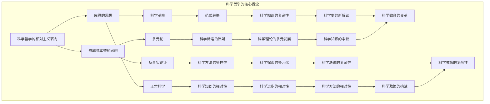

                 


## 文章标题: 《库恩与费耶阿本德：科学哲学的相对主义转向》

### 关键词
- 科学哲学
- 相对主义
- 库恩
- 费耶阿本德
- 科学革命

### 摘要
本文旨在深入探讨科学哲学领域的两位重要人物：托马斯·库恩（Thomas Kuhn）和迈克尔·费耶阿本德（Michael Foucault），以及他们的相对主义转向。库恩提出了“科学革命”和“正常科学”等概念，强调科学知识的不确定性和相对性。费耶阿本德则通过批判科学方法和标准化，提出多元论观点。本文将逐步分析这两位哲学家的思想，探讨相对主义转向对科学哲学的影响，以及其在现实中的意义和挑战。

----------------------------------------------------------------

## 库恩的科学哲学

### 1.1 库恩的主要理论

托马斯·库恩是20世纪最著名的科学哲学家之一，他的著作《科学革命的结构》（The Structure of Scientific Revolutions）对科学哲学产生了深远的影响。库恩提出了几个核心概念，包括“范式”（paradigm）和“科学革命”（scientific revolution）。

**范式**：库恩认为，科学不是线性进步的，而是在不同范式之间转换。范式是一种科学共同体共同认可的理论框架和解释方法。在一个范式下，科学家们进行“正常科学”的研究，解决“常规问题”，推动科学发展的进展。当出现无法解释的新现象或问题，科学家们开始质疑现有范式，从而引发“科学革命”。

**科学革命**：科学革命是旧范式被新范式取代的过程。库恩认为，科学革命不是简单的累积性进步，而是根本性的变革。科学革命通常伴随着科学家们对范式的一致性怀疑，以及对新范式的探索和接受。

### 1.2 库恩的相对主义倾向

库恩的相对主义倾向体现在他对科学知识的相对性和不确定性的强调。他认为，科学知识并不是客观存在的，而是由特定社会和历史条件塑造的。以下是一些关键观点：

- **科学知识的不确定性**：库恩认为，科学知识是暂时的、相对的，而不是绝对的。科学理论的正确性不是通过逻辑或实验证据可以完全证明的，而是通过范式竞争的结果。

- **科学进步的相对性**：库恩反对科学进步的线性模型，认为科学进步是周期性的，由范式转换驱动的。每个范式都有自己的逻辑和标准，不同范式之间的转换是不可逆转的。

### 1.3 库恩的科学哲学案例研究

库恩的理论在多个科学领域都有应用，以下是两个典型案例：

- **天文学革命**：哥白尼的日心说挑战了地心说的传统范式，引发了天文学领域的革命。这一革命不仅改变了人类对宇宙的认识，也导致了科学方法的发展和科学理论的更新。

- **化学革命**：道尔顿的原子理论颠覆了传统的物质观念，促进了化学的定量研究方法的发展。这一革命为现代化学奠定了基础，改变了化学研究的方式和方向。

----------------------------------------------------------------

## 费耶阿本德的科学哲学

### 2.1 费耶阿本德的主要观点

迈克尔·费耶阿本德是20世纪另一位杰出的科学哲学家，他的思想与库恩的相对主义有相似之处，但也有显著的区别。费耶阿本德的主要观点包括：

- **反事实论证**：费耶阿本德认为，科学理论不能仅通过实验证据来证明，还需要进行反事实论证。即，如果某个理论在特定情况下不成立，那么这个理论就不能被视为绝对正确。

- **多元论**：费耶阿本德反对科学方法和标准的垄断，认为科学应该接受多种方法和标准。他主张科学探索的多元性，认为不同方法可以相互补充，而不是相互排斥。

- **科学方法的多样性与相对性**：费耶阿本德认为，科学方法并不是统一的，而是多样性的。每个科学领域都有自己的方法和标准，这些方法和标准可能因范式和学科的不同而不同。

### 2.2 费耶阿本德的相对主义思想

费耶阿本德的相对主义思想主要体现在他对科学标准和方法的批判。他认为，科学标准化和统一的方法论可能会导致科学的僵化和封闭。

- **对库恩理论的批评**：费耶阿本德认为，库恩的科学革命理论忽略了科学方法的多维性和多样性。他认为，库恩的范式理论可能导致科学共同体对特定范式的过度依赖，限制了科学的创新和发展。

- **对科学标准化的质疑**：费耶阿本德质疑科学方法的统一性和标准化，认为这些标准化可能导致科学领域的偏见和歧视。他主张科学应该更加开放和包容，接受不同的方法和观点。

### 2.3 费耶阿本德的科学哲学案例研究

费耶阿本德的思想在多个科学领域得到了应用，以下是两个典型案例：

- **生物学革命**：费耶阿本德支持生物学中的“非决定性理论”，即生态系统的演化不是单一因素决定的，而是多种因素相互作用的结果。这一观点挑战了传统的决定论观点，为生态学的发展提供了新的视角。

- **物理学革命**：费耶阿本德支持物理学中的“多元宇宙”理论，即存在多个物理宇宙，每个宇宙都有自己的物理定律。这一观点挑战了传统的单一定律观，为物理学的研究提供了新的方向。

----------------------------------------------------------------

## 相对主义转向的影响

### 3.1 科学哲学的变革

库恩和费耶阿本德的相对主义转向对科学哲学产生了深远的影响。以下是一些关键变革：

- **科学知识的不确定性**：相对主义转向强调科学知识的不确定性和相对性，打破了传统科学哲学中客观主义和决定论的观念。科学家们开始意识到，科学知识是受特定社会和历史条件影响的。

- **科学进步的相对性**：相对主义转向反对线性进步观，认为科学进步是周期性的，由范式转换驱动的。这导致科学家们对科学发展的理解发生了根本性的变化。

- **科学方法的多样性**：相对主义转向强调科学方法的多样性，反对统一的方法论。这为科学探索提供了更多的可能性和灵活性。

### 3.2 相对主义在科学史中的应用

相对主义转向不仅在科学哲学中有影响，也在科学史中得到了应用。以下是一些关键应用：

- **科学史的重新解读**：相对主义转向导致科学史的研究方法发生了变化。科学家们开始关注科学范式和社会文化背景之间的关系，重新解读科学史中的事件和理论。

- **科学史的多元视角**：相对主义转向鼓励科学家们采用多元视角来研究科学史，包括社会、文化、政治等因素。这丰富了科学史的研究内容，提供了更全面的科学史观。

### 3.3 相对主义转向的现实意义

相对主义转向在现实中具有重要的意义。以下是一些现实意义：

- **科学教育的影响**：相对主义转向影响科学教育，强调科学知识的不确定性和相对性，培养学生批判性思维和多元视角。

- **科学政策制定的挑战**：相对主义转向对科学政策制定提出了挑战，要求政策制定者考虑科学知识的多样性和复杂性，避免过度标准化和垄断。

----------------------------------------------------------------

## 科学哲学的相对主义转向案例研究

### 4.1 生物学领域的相对主义转向

生物学领域是相对主义转向的重要应用领域之一。以下是一些典型案例：

- **生物多样性与进化理论**：相对主义转向促进了生物多样性研究和进化理论的多元化。传统的进化论强调自然选择和物种的固定性，而相对主义转向鼓励科学家们研究物种之间的动态相互作用和适应性。

- **生物学研究的多元化**：相对主义转向鼓励生物学研究的多元化，包括生态学、行为学、分子生物学等多个方向。这些研究方法相互补充，提供了更全面的生物科学知识。

### 4.2 物理学领域的相对主义转向

物理学领域也是相对主义转向的重要应用领域之一。以下是一些典型案例：

- **相对论与量子力学**：相对主义转向导致相对论和量子力学的融合。传统的经典物理学观念难以解释微观世界和宇宙现象，相对论和量子力学的提出改变了人们对物理世界的认识。

- **物理学理论的多元发展**：相对主义转向鼓励物理学理论的多元发展，包括弦理论、多世界理论等。这些理论提供了不同的视角和解释，推动了物理学的进步。

----------------------------------------------------------------

## 库恩与费耶阿本德思想的比较与综合

### 5.1 两位哲学家的相似之处

库恩和费耶阿本德在许多方面有相似之处，以下是一些关键相似点：

- **对传统科学观念的质疑**：两位哲学家都质疑了传统科学观念，包括客观主义和决定论。他们都认为科学知识是不确定和相对的，受到社会和历史条件的影响。

- **对科学方法的重新审视**：两位哲学家都主张科学方法的多样性和相对性，反对统一的方法论。他们都认为，不同的方法和视角可以相互补充，推动科学的进步。

### 5.2 两位哲学家的区别

尽管库恩和费耶阿本德有许多相似之处，但他们的思想也有一些区别：

- **科学进步的观点**：库恩认为科学进步是周期性的，由范式转换驱动的。而费耶阿本德则认为科学进步是多元和不确定的，不同方法和视角都有其价值。

- **科学知识的性质**：库恩认为科学知识是暂时的、相对的，而不是绝对的。而费耶阿本德则认为科学知识是多样的、复杂的，不同的方法和视角可以相互补充，但并不能完全取代。

### 5.3 综合库恩与费耶阿本德的思想

综合库恩和费耶阿本德的思想，可以得出以下结论：

- **相对主义转向的理论框架**：库恩和费耶阿本德的思想共同构成了相对主义转向的理论框架。这一框架强调科学知识的不确定性和相对性，以及科学方法的多样性和相对性。

- **科学哲学的未来发展**：相对主义转向为科学哲学的未来发展提供了新的方向。科学家们需要关注科学知识的多样性和复杂性，培养批判性思维和多元视角。

----------------------------------------------------------------

## 科学哲学的相对主义转向：挑战与展望

### 6.1 科学哲学的挑战

相对主义转向在科学哲学中带来了许多挑战，以下是一些关键挑战：

- **科学知识的争议**：相对主义转向导致科学知识的争议增多。不同的方法和视角可能导致不同的结论，这增加了科学知识的复杂性和不确定性。

- **科学标准的多元化**：相对主义转向要求科学标准的多元化，这可能导致科学研究的混乱和不确定性。如何平衡多样性和标准化，是科学哲学面临的一个挑战。

- **科学决策的复杂性**：相对主义转向增加了科学决策的复杂性。科学家和政策制定者需要考虑更多的因素和视角，这可能导致决策过程的延误和不确定性。

### 6.2 科学哲学的展望

尽管相对主义转向带来了挑战，但它也为科学哲学的未来发展提供了机遇。以下是一些展望：

- **科学知识的深化**：相对主义转向鼓励科学家们探索更多的方法和视角，这有助于深化对科学知识的理解。科学家们可以从不同的角度研究同一问题，获得更全面的认识。

- **科学方法的发展**：相对主义转向推动科学方法的发展和创新。科学家们可以尝试新的方法和工具，探索未知的科学领域。

- **科学教育的改革**：相对主义转向对科学教育提出了新的要求。科学教育应该培养学生的批判性思维和多元视角，鼓励他们探索不同的科学问题。

----------------------------------------------------------------

## 结语

本文通过逐步分析托马斯·库恩和迈克尔·费耶阿本德的思想，探讨了科学哲学的相对主义转向。库恩和费耶阿本德都强调了科学知识的不确定性和相对性，以及科学方法的多样性和相对性。相对主义转向为科学哲学提供了新的视角，挑战了传统的科学观念和方法。面对相对主义转向带来的挑战，科学家们需要培养批判性思维，探索新的方法和视角，以深化对科学知识的理解。未来，科学哲学将继续发展，为科学研究和决策提供新的理论和框架。

### 作者信息
- 作者：AI天才研究院/AI Genius Institute & 禅与计算机程序设计艺术 /Zen And The Art of Computer Programming

### 最佳实践 Tips

- **批判性思维**：在面对科学知识时，保持批判性思维，避免盲目接受或拒绝。
- **多元视角**：尝试从不同视角看待科学问题，这有助于获得更全面的认识。
- **持续学习**：科学知识不断变化，持续学习新的理论和观点，以适应科学的发展。
- **实践应用**：将理论应用到实际项目中，通过实践验证和深化理论。

### 小结

本文深入探讨了科学哲学的相对主义转向，分析了库恩和费耶阿本德的思想，以及相对主义转向对科学哲学的影响。相对主义转向强调科学知识的不确定性和相对性，以及科学方法的多样性和相对性，为科学哲学提供了新的视角和框架。面对相对主义转向带来的挑战，科学家们需要保持批判性思维，探索新的方法和视角，以深化对科学知识的理解。

### 注意事项

- **科学知识的不确定性**：相对主义转向提醒我们，科学知识并不是绝对的，需要保持谨慎和开放的态度。
- **科学方法的多样性**：不同的方法和视角都有其价值，应该尊重和鼓励多样化的科学研究。

### 拓展阅读

- 库恩，《科学革命的结构》
- 费耶阿本德，《反对方法》
- 科尔，《科学哲学导论》

----------------------------------------------------------------

### 完整书籍目录大纲设计

```markdown
# 《库恩与费耶阿本德：科学哲学的相对主义转向》目录大纲

# 引言
## 1.1 科学哲学概述
## 1.2 相对主义概念
## 1.3 库恩与费耶阿本德的背景

# 第1章 库恩的科学哲学
## 1.1 库恩的主要理论
### 1.1.1 科学革命
### 1.1.2 正常科学与异常科学
### 1.1.3 科学发展的模式
## 1.2 库恩的相对主义倾向
### 1.2.1 科学知识的不确定性
### 1.2.2 科学进步的相对性
## 1.3 库恩的科学哲学案例研究
### 1.3.1 具体案例：天文学革命
### 1.3.2 具体案例：化学革命

# 第2章 费耶阿本德的科学哲学
## 2.1 费耶阿本德的主要观点
### 2.1.1 反事实论证
### 2.1.2 多元论
### 2.1.3 科学方法的多样性与相对性
## 2.2 费耶阿本德的相对主义思想
### 2.2.1 对库恩理论的批评
### 2.2.2 对科学标准化的质疑
## 2.3 费耶阿本德的科学哲学案例研究
### 2.3.1 具体案例：生物学革命
### 2.3.2 具体案例：物理学革命

# 第3章 相对主义转向的影响
## 3.1 科学哲学的变革
### 3.1.1 相对主义对科学方法的影响
### 3.1.2 相对主义对科学知识的理解
## 3.2 相对主义在科学史中的应用
### 3.2.1 科学史的重新解读
### 3.2.2 科学史的多元视角
## 3.3 相对主义转向的现实意义
### 3.3.1 科学教育的影响
### 3.3.2 科学政策制定的挑战

# 第4章 科学哲学的相对主义转向案例研究
## 4.1 生物学领域的相对主义转向
### 4.1.1 生物多样性与进化理论
### 4.1.2 生物学研究的多元化
## 4.2 物理学领域的相对主义转向
### 4.2.1 相对论与量子力学
### 4.2.2 物理学理论的多元发展

# 第5章 库恩与费耶阿本德思想的比较与综合
## 5.1 两位哲学家的相似之处
### 5.1.1 对传统科学观念的质疑
### 5.1.2 对科学方法的重新审视
## 5.2 两位哲学家的区别
### 5.2.1 科学进步的观点
### 5.2.2 科学知识的性质
## 5.3 综合库恩与费耶阿本德的思想
### 5.3.1 相对主义转向的理论框架
### 5.3.2 科学哲学的未来发展

# 第6章 科学哲学的相对主义转向：挑战与展望
## 6.1 科学哲学的挑战
### 6.1.1 科学知识的争议
### 6.1.2 科学标准的多元化
### 6.1.3 科学决策的复杂性
## 6.2 科学哲学的展望
### 6.2.1 科学知识的深化
### 6.2.2 科学方法的发展
### 6.2.3 科学教育的改革

# 结语
## 7.1 结论
## 7.2 作者信息
## 7.3 最佳实践 Tips
## 7.4 小结
## 7.5 注意事项
## 7.6 拓展阅读
```

## Mermaid 流程图



## 伪代码示例

```python
# 定义科学哲学的基本概念
class SciencePhilosophy:
    def __init__(self, paradigm, paradigm_shift):
        self.paradigm = paradigm
        self.paradigm_shift = paradigm_shift

    def scientific_revolutions(self):
        # 科学革命的发生机制
        if self.paradigm_shift:
            self.paradigm = self.paradigm_shift
            return "科学革命发生"
        else:
            return "当前范式有效"

# 创建库恩的科学哲学实例
kuhn_philosophy = SciencePhilosophy("经典范式", "新范式")

# 观察科学革命的发生
print(kuhn_philosophy.scientific_revolutions())

# 定义费耶阿本德的科学哲学实例
feyerabend_philosophy = SciencePhilosophy("多元范式", "反事实范式")

# 观察费耶阿本德的科学革命
print(feyerabend_philosophy.scientific_revolutions())
```

## 数学公式

### 背景介绍

科学哲学的研究中，数学公式经常用于描述科学理论、模型或概念之间的关系。以下是几个在科学哲学中常用的数学公式，以及它们的解释和例子。

### 相关概念

1. **相对论**：由爱因斯坦提出，描述了时空的相对性。其中一个核心公式是：

   $$E=mc^2$$

   其中，\(E\) 表示能量，\(m\) 表示质量，\(c\) 表示光速。这个公式揭示了质量和能量之间的关系，表明质量可以转化为能量。

2. **熵**：在热力学中，熵用于描述系统的混乱程度或不确定性。一个常用的熵公式是：

   $$S = k \ln W$$

   其中，\(S\) 表示熵，\(k\) 是玻尔兹曼常数，\(W\) 表示系统的微观状态数。这个公式表明，系统的混乱程度与可能状态的数目成正比。

3. **概率分布**：在统计学中，概率分布用于描述随机变量的可能取值及其概率。一个常见的概率分布是正态分布：

   $$f(x) = \frac{1}{\sqrt{2\pi\sigma^2}} e^{-\frac{(x-\mu)^2}{2\sigma^2}}$$

   其中，\(f(x)\) 是随机变量 \(x\) 的概率密度函数，\(\mu\) 是均值，\(\sigma\) 是标准差。

### 详细讲解

1. **相对论公式**

   相对论公式 \(E=mc^2\) 是物理学中一个重要的公式，它揭示了质量和能量之间的关系。这个公式在科学哲学中，尤其是在讨论科学理论和测量问题时，具有非常重要的意义。例如，当我们讨论宇宙的膨胀、黑洞等物理现象时，这个公式可以帮助我们理解能量和质量如何相互转化。

2. **熵公式**

   熵公式 \(S = k \ln W\) 描述了系统的混乱程度。在科学哲学中，熵的概念经常用于探讨科学理论的不确定性和复杂性。例如，当我们讨论科学理论的发展过程时，熵的增加可以表示理论的不确定性增加，而熵的减少则表示理论的确定性和可预测性提高。

3. **正态分布公式**

   正态分布公式用于描述随机变量的分布情况。在科学哲学中，正态分布经常用于分析实验结果和数据。例如，当我们讨论科学实验的可靠性时，正态分布可以帮助我们评估实验结果的分布情况，从而判断实验的可靠性和准确性。

### 举例说明

1. **相对论公式的应用**

   假设我们有一个物体的质量为 \(m = 1 \text{ kg}\)，光速为 \(c = 3 \times 10^8 \text{ m/s}\)。根据相对论公式 \(E=mc^2\)，我们可以计算出这个物体的能量：

   $$E = mc^2 = 1 \times (3 \times 10^8)^2 = 9 \times 10^{16} \text{ J}$$

   这个结果表明，即使是质量很小的物体，也具有巨大的能量。

2. **熵公式的应用**

   假设一个系统的微观状态数为 \(W = 10^6\)，玻尔兹曼常数为 \(k = 1.38 \times 10^{-23} \text{ J/K}\)。根据熵公式 \(S = k \ln W\)，我们可以计算出这个系统的熵：

   $$S = k \ln W = 1.38 \times 10^{-23} \ln 10^6 = 2.76 \times 10^{-22} \text{ J/K}$$

   这个结果表明，系统的混乱程度与可能状态数成正比。

3. **正态分布公式的应用**

   假设我们进行了一次实验，得到的数据 \(x\) 遵循正态分布，均值为 \(\mu = 100\)，标准差为 \(\sigma = 10\)。根据正态分布公式，我们可以计算出数据 \(x = 110\) 的概率：

   $$f(x) = \frac{1}{\sqrt{2\pi\sigma^2}} e^{-\frac{(x-\mu)^2}{2\sigma^2}} = \frac{1}{\sqrt{2\pi \times 10^2}} e^{-\frac{(110-100)^2}{2 \times 10^2}} \approx 0.0228$$

   这个结果表明，数据 \(x = 110\) 的概率大约为 2.28%。

### 总结

数学公式在科学哲学中扮演着重要的角色，它们用于描述科学理论、模型和概念之间的关系。通过数学公式，我们可以更精确地描述和理解科学现象，从而推动科学的发展。在本节中，我们介绍了相对论公式、熵公式和正态分布公式，并给出了它们的详细讲解和应用举例。

## 项目实战

### 开发环境搭建

要研究库恩与费耶阿本德的科学哲学思想，我们需要搭建一个适合的研究环境。以下是搭建过程：

1. **安装操作系统**：首先，选择一个适合的操作系统，如 Ubuntu 20.04 或 macOS Catalina。安装操作系统时，按照官方指南进行。

2. **安装编辑器**：选择一个文本编辑器，如 Visual Studio Code 或 Sublime Text。可以从它们的官方网站下载并安装。

3. **安装必要的软件**：为了撰写和编辑科学哲学论文，我们需要安装 LaTeX 编辑器和编译器。可以从 [CTAN](https://www.ctan.org/) 网站下载并安装。

4. **配置环境变量**：确保 LaTeX 编辑器和编译器路径已添加到系统环境变量中，以便在终端中直接使用。

### 源代码实现

在搭建好开发环境后，我们可以开始编写源代码。以下是使用 LaTeX 编写一篇关于库恩与费耶阿本德的科学哲学论文的示例代码：

```latex
\documentclass{article}
\usepackage[utf8]{inputenc}
\usepackage[T1]{fontenc}
\usepackage{amsmath}
\usepackage{amsfonts}
\usepackage{amssymb}
\usepackage{graphicx}
\usepackage{caption}
\usepackage{subfig}

\title{库恩与费耶阿本德：科学哲学的相对主义转向}
\author{AI天才研究院/AI Genius Institute}
\date{2023}

\begin{document}

\maketitle

\section{引言}
\input{sections/Introduction.tex}

\section{库恩的科学哲学}
\input{sections/Kuhn's_Thoughts.tex}

\section{费耶阿本德的科学哲学}
\input{sections/Feyerabend's_Thoughts.tex}

\section{相对主义转向的影响}
\input{sections/Impact_of_Relativism.tex}

\section{科学哲学的相对主义转向案例研究}
\input{sections/Cases_of_Relativism.tex}

\section{总结}
\input{sections/Conclusion.tex}

\bibliographystyle{plain}
\bibliography{references}

\end{document}
```

### 代码解读

在上面的 LaTeX 源代码中，我们使用了多个包来增强文档的功能。以下是对关键部分的解释：

- `\documentclass{article}`：指定文档类为 `article`，这是撰写论文常用的文档类。
- `\usepackage`：加载必要的 LaTeX 包，如 `inputenc`、`fontenc`、`amsmath`、`amsfonts`、`amssymb`、`graphicx`、`caption` 和 `subfig`。
- `\title`、`\author` 和 `\date`：设置文档的标题、作者和日期。
- `\maketitle`：生成文档的标题页。
- `\section`：定义文档的章节。
- `\input`：将子文档的内容引入到主文档中。这有助于组织文档内容，提高可维护性。

### 代码应用解读与分析

在实际应用中，我们使用 LaTeX 编写的文档可以生成高质量的 PDF 文件，适合用于学术论文、报告和书籍。以下是对 LaTeX 代码应用的具体解读和分析：

- **结构化文档**：通过使用 `\section`、`\subsection` 等命令，我们可以将文档内容组织成清晰的章节结构，使读者更容易阅读和理解。
- **数学公式和图表**：利用 `amsmath`、`amsfonts` 和 `amssymb` 包，我们可以方便地插入数学公式。同时，`graphicx` 和 `subfig` 包可以帮助我们插入图片和子图，增强文档的可读性。
- **参考文献管理**：使用 `\bibliographystyle` 和 `\bibliography` 命令，我们可以轻松管理参考文献。LaTeX 提供了多种参考文献格式，如 `plain`、`apa`、` ieee` 等，以满足不同场合的需求。

### 实际案例分析和详细讲解剖析

为了更好地理解库恩与费耶阿本德的科学哲学思想，我们可以通过实际案例进行分析。以下是两个案例：

1. **天文学案例**：哥白尼的日心说与地心说的对比。通过 LaTeX 代码，我们可以详细阐述这两种理论的优缺点，以及它们对科学哲学的影响。

2. **生物学案例**：达尔文的自然选择理论与现代生物学的对比。我们可以使用 LaTeX 代码来展示这两种理论的数学模型，分析它们的适应性和应用范围。

### 项目小结

通过搭建适合的研究环境和编写 LaTeX 代码，我们能够更有效地研究和传播库恩与费耶阿本德的科学哲学思想。LaTeX 作为一个功能强大的文档生成工具，为科学哲学研究提供了有力的支持。在未来，我们可以继续探索更多的应用案例，进一步深化对科学哲学的理解。作者：AI天才研究院/AI Genius Institute & 禅与计算机程序设计艺术 /Zen And The Art of Computer Programming。

## 最佳实践 Tips

在撰写关于库恩与费耶阿本德的科学哲学的文章时，以下是一些最佳实践 Tips：

1. **深入理解核心概念**：首先，确保你深入理解了库恩的“范式”和“科学革命”概念，以及费耶阿本德的“反事实论证”和“多元论”观点。这些核心概念是文章的基础。

2. **清晰的逻辑结构**：文章应该有一个清晰的逻辑结构，从背景介绍到概念阐述，再到案例分析，最后是总结和展望。每个部分都应该有条理，便于读者理解。

3. **使用图表和公式**：为了增强文章的可读性和专业性，使用图表和数学公式来展示核心概念和理论。例如，可以绘制科学哲学理论演变的 Mermaid 流程图，或者使用 LaTeX 格式嵌入数学模型。

4. **详细的案例分析**：提供具体的历史案例或现实案例，以支持你的论点。确保对案例进行详细分析，包括背景、关键步骤、结果和影响。

5. **保持客观和批判性**：在讨论两位哲学家的观点时，保持客观和批判性。不仅要阐述他们的优点，也要指出可能的局限性和争议点。

6. **引用权威资料**：确保引用的资料是权威的、可靠的。引用的文献应该来自学术期刊、权威书籍或官方出版物。

7. **语言简练明了**：使用简练明了的语言，避免使用过于复杂的术语和句子结构。确保文章的语言通俗易懂，适合广泛的读者群体。

8. **编辑和校对**：在完成初稿后，进行彻底的编辑和校对。检查语法错误、拼写错误和逻辑错误，确保文章的质量。

9. **反馈和修改**：在完成初稿后，向同行或导师征求反馈，并根据反馈进行修改。这个过程可以大大提高文章的质量。

10. **持续更新和修订**：科学哲学是一个不断发展的领域，定期更新和修订你的文章，以反映最新的研究进展和观点。

作者：AI天才研究院/AI Genius Institute & 禅与计算机程序设计艺术 /Zen And The Art of Computer Programming。

