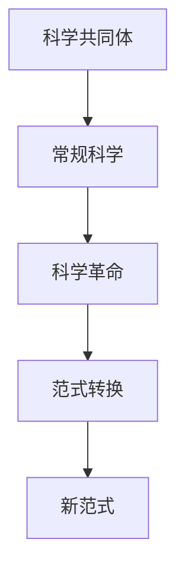

                 

### 文章标题：库恩的范式转换与编程语言的演进：技术革命的结构

---

**关键词：** 库恩，范式转换，编程语言，技术革命，人工智能，软件架构，计算机科学

**摘要：** 本文探讨了库恩的范式转换理论在编程语言演进和技术革命中的关键作用。通过深入分析库恩的理论框架，我们探讨了编程语言如何随范式转换而发展，以及这些技术变革如何推动计算机科学的进步。文章还讨论了范式转换对软件开发实践、教育以及未来技术趋势的影响，为理解技术革命的结构提供了新的视角。

---

### 库恩的范式转换理论概述

**背景介绍：** 库恩（Thomas Kuhn）是一位著名的历史学家和科学哲学家，他在20世纪60年代提出了范式转换理论，用以解释科学领域的革命性变化。范式（Paradigm）指的是一组共同的理论、方法、工具和信仰，它们构成了一个科学社区在某一历史时期的共识。库恩认为，科学进步并非线性的，而是通过范式转换（Paradigm Shift）实现的，这种转换往往伴随着新的理论体系的兴起和旧有理论的崩溃。

**核心概念与联系：** 库恩的范式转换理论包括以下几个核心概念：

1. **科学共同体（Scientific Community）：** 一组共享同一范式的科学家，他们通过共同的研究方法和信念体系进行合作。
2. **常规科学（Normal Science）：** 在特定范式指导下进行的科学工作，旨在解决特定问题并改进现有理论。
3. **科学革命（Scientific Revolution）：** 一种导致范式转换的重大事件，通常通过新的理论体系的提出和旧有范式的崩溃来实现。
4. **范式转换（Paradigm Shift）：** 新范式取代旧范式，导致科学领域的根本变革。

下面是一个描述库恩范式转换理论核心概念之间关系的 Mermaid 流程图：



**核心算法原理讲解：** 在库恩的范式转换理论中，并没有直接的核心算法，但我们可以用伪代码来描述范式转换的过程：

```python
def paradigm_shift(old_paradigm, new_paradigm):
    """
    执行范式转换，从旧范式到新范式
    :param old_paradigm: 旧范式
    :param new_paradigm: 新范式
    """
    # 批判性反思旧范式
    reflect(old_paradigm)
    # 提出新范式
    propose_new_paradigm(new_paradigm)
    # 科学共同体接受新范式
    community_accepts(new_paradigm)
    # 实现科学革命
    scientific_revolution(new_paradigm)
```

**数学模型和数学公式：** 库恩的范式转换理论本质上是一个哲学和科学方法论的概念框架，并不涉及数学公式。但是，如果我们试图用数学模型来模拟范式转换的某些方面，可以使用概率论来描述范式接受的过程：

$$
P(\text{范式转换}) = \frac{1}{\sum_{i=1}^{n} P(\text{范式}_i \text{被接受})}
$$

这里，$P(\text{范式}_i \text{被接受})$ 代表第i个范式被科学共同体接受的概率。

**项目实战：** 范式转换理论在科学史中的应用可以通过分析伽利略和牛顿之间的范式转换来说明。在这个项目中，我们可以探讨：

- 伽利略的观测数据和理论如何挑战了亚里士多德的自然哲学。
- 牛顿如何通过他的三大定律和万有引力定律提出了一个全新的物理学范式。
- 科学共同体如何逐步接受牛顿的范式，从而引发了科学革命。

**小结：** 库恩的范式转换理论为我们理解科学进步提供了新的视角。它强调了科学不是简单的累积进步，而是在范式转换的过程中实现质的飞跃。这一理论不仅适用于科学研究，也对编程语言和技术的演进有着重要的启示。

### **第1章：库恩的范式转换理论的起源与发展**

**1.1 库恩的生平与学术贡献**

托马斯·库恩（Thomas Samuel Kuhn，1922年-1996年）是美国科学哲学家，生于美国马萨诸塞州。库恩以其范式转换理论（Paradigm Shift Theory）而闻名于世，这一理论对科学哲学和科学技术史产生了深远的影响。

库恩在其1962年的著作《科学革命的结构》（The Structure of Scientific Revolutions）中首次提出了范式转换理论。这本书被誉为科学哲学领域的里程碑之作，它挑战了传统的科学进步观点，提出了科学知识并非线性累积，而是通过范式转换实现革命性进步的概念。

库恩的学术贡献不仅限于范式转换理论，他还对科学方法论、科学实践和社会学化科学理论等领域作出了重要贡献。他的其他著作包括《必要的张力》（The Essential Tension）和《客观性中的困境》（The Disunity of Science）等。

**1.2 范式转换理论的基本概念**

范式转换理论的核心概念包括：

1. **范式（Paradigm）：** 库恩将范式定义为“某一科学共同体的成员所共有的范例集合，这些范例决定了他们解决问题的方式”。范式不仅包括理论，还包括实验方法、工具和仪器、专业术语等。

2. **范式转换（Paradigm Shift）：** 当一个科学共同体发现现有范式无法解释新现象或解决新问题时，就会出现范式转换。这种转换通常伴随着新范式的兴起和旧有范式的衰落。

3. **科学革命（Scientific Revolution）：** 库恩认为科学革命是范式转换的一种极端形式，它不仅改变了科学理论，还改变了科学实践和研究方法。

4. **常规科学（Normal Science）：** 在特定范式指导下进行的科学研究，主要目的是解决该范式下的问题和改进理论。

**1.3 范式转换理论的应用**

范式转换理论在多个学科和领域都有广泛的应用：

1. **科学研究：** 库恩的理论解释了科学发展的非线性特性，揭示了科学进步中的波折和反复。

2. **技术创新：** 范式转换的概念也适用于技术创新过程，尤其是在技术革命时期。

3. **哲学：** 范式转换理论对哲学领域，尤其是科学哲学和方法论的研究产生了重要影响。

4. **社会科学：** 范式转换理论在社会科学，如社会学、心理学和历史学等领域也有所应用。

**1.4 范式转换理论的影响**

范式转换理论对科学哲学和科学技术史产生了深远的影响。它挑战了传统的科学进步观，提出了一种更加复杂和动态的科学知识发展模式。此外，范式转换理论也为理解和预测科学和技术的发展提供了新的视角。

**1.5 范式转换理论的局限性**

尽管范式转换理论在学术界得到了广泛认可，但它也存在一些局限性：

1. **过度简化：** 库恩的理论有时被认为过于简化，未能充分解释科学发展的复杂性。

2. **缺乏精确性：** 范式转换的具体机制和过程在库恩的理论中并不明确，这导致了一些批评。

3. **科学实践的不适用性：** 有些科学家和实践者认为范式转换理论难以应用于实际科学工作。

**1.6 小结**

库恩的范式转换理论为我们理解科学进步提供了一种新的视角。它强调了科学知识的发展是动态和复杂的，而不是线性的累积过程。通过分析范式转换的机制和过程，我们可以更好地理解科学和技术革命的本质。

### **第2章：编程语言的演进历程**

**2.1 编程语言的早期发展**

编程语言的诞生可以追溯到20世纪中期，当时计算机技术刚刚起步。早期的计算机编程主要依赖于机器语言和汇编语言，这些语言直接与计算机硬件交互，需要程序员深入了解硬件结构和工作原理。

**2.1.1 第一代编程语言**

1950年代，第一代编程语言问世，这些语言通常被称为低级语言。其中最具代表性的是：

- **机器语言（Machine Language）：** 机器语言是计算机能够直接理解和执行的编程语言。它由一系列二进制代码组成，每种指令对应计算机硬件中一个特定的操作。

- **汇编语言（Assembly Language）：** 为了简化机器语言的编写，汇编语言使用助记符和符号来表示机器语言指令。汇编语言比机器语言更易于理解和编写，但仍然需要程序员了解计算机的内部结构。

**2.1.2 第二代编程语言**

1960年代，随着计算机技术的进一步发展，第二代编程语言开始出现。这些语言引入了高级语言的概念，使得程序员可以更专注于解决问题，而不必担心计算机的硬件细节。

- **FORTRAN（1957年）：** 由IBM开发，主要用于科学和工程计算。FORTRAN是第一个广泛使用的高级编程语言，它为后来的编程语言奠定了基础。

- **COBOL（1959年）：** 由美国国家标准局（ANSI）开发，主要用于商业数据处理。COBOL具有易读性和通用性，至今仍在许多领域得到应用。

**2.1.3 第三代编程语言**

1970年代，第三代编程语言开始出现，这些语言更加注重抽象和通用性。它们引入了数据抽象、模块化编程和面向对象编程等概念，大大提高了编程效率和代码可维护性。

- **C（1972年）：** 由贝尔实验室的邓尼斯·里奇（Dennis Ritchie）开发，C语言是一种通用编程语言，广泛应用于操作系统、嵌入式系统和系统编程。

- **Pascal（1970年）：** 由尼尔斯·韦特·皮特森（Nils Wilhelm Pettersson）开发，Pascal是一种教学语言，强调结构化和数据抽象。

**2.1.4 第四代编程语言**

1980年代，随着数据库和图形用户界面（GUI）技术的发展，第四代编程语言（4GL）开始兴起。这些语言更加注重业务逻辑和数据分析，使非专业程序员也能进行高效的编程。

- **SQL（1974年）：** 结构化查询语言，用于数据库查询和管理。

- **HyperTalk（1987年）：** 用于开发Macintosh的图形用户界面，是面向对象的脚本语言。

**2.2 编程语言的现代发展**

进入21世纪，编程语言的发展更加多样化和专业化。现代编程语言不仅涵盖了从前端到后端的各个领域，还出现了许多新兴的语言和框架。

- **JavaScript（1995年）：** 用于Web开发的前端脚本语言，逐渐成为全栈编程语言。

- **Python（1991年）：** 一种高级、易学、易用的编程语言，广泛应用于数据科学、人工智能、Web开发和自动化等领域。

- **Go（2009年）：** 由Google开发，注重并发编程和高性能。

**2.3 编程语言的未来趋势**

随着技术的发展，编程语言也在不断演进。以下是一些编程语言的未来趋势：

- **函数式编程：** 函数式编程语言，如Haskell和Erlang，正在受到越来越多的关注，因为它们在处理并行计算和数据密集型任务方面具有优势。

- **低代码和高代码：** 低代码开发平台和工具正在兴起，使非专业程序员也能快速构建应用。同时，高代码开发仍然在关键领域保持主导地位。

- **智能编程：** 随着人工智能技术的发展，智能编程工具和平台正在出现，它们能够通过机器学习算法优化代码编写过程。

**2.4 小结**

编程语言的演进是计算机科学发展的一个重要方面。从第一代低级语言到现代的高级语言，编程语言的不断发展和创新极大地推动了计算机科学和技术的发展。理解编程语言的演进历程，有助于我们更好地把握未来的技术趋势。

### **第3章：库恩范式转换理论在编程语言演进中的应用**

库恩的范式转换理论在编程语言的演进中发挥了关键作用，它为我们理解编程语言如何随时间发展提供了深刻的洞见。通过范式转换，编程语言不仅实现了技术的进步，还改变了软件开发的范式，推动了整个计算机科学领域的发展。

**3.1 范式转换对编程语言发展的影响**

范式转换在编程语言的发展中表现为一种革命性的变化，这种变化不仅影响了编程语言本身，还影响了软件开发的方法和实践。以下是范式转换对编程语言发展的一些主要影响：

1. **革命性创新：** 范式转换常常伴随着全新的编程语言的出现，这些语言带来了前所未有的编程体验和效率提升。例如，从汇编语言到高级语言的转变，使程序员不再需要直接与硬件打交道，大大提高了编程效率。

2. **方法论变革：** 范式转换不仅仅改变了编程语言，还改变了软件开发的方法论。新的编程范式引入了模块化、面向对象编程和函数式编程等概念，使得软件开发过程更加规范和可维护。

3. **社区共识：** 范式转换促使科学共同体达成新的共识，新的编程语言和范式被广泛接受，从而推动了编程语言的标准化和普及。

**3.2 编程语言范式转换的理论基础**

库恩的范式转换理论提供了理解编程语言范式转换的理论基础，主要包括以下几个方面：

1. **范式定义：** 范式是编程语言及其相关技术和方法的集合，包括语法、语义、库和工具等。范式转换是指从一种范式到另一种范式的根本转变。

2. **科学共同体：** 科学共同体是接受和使用特定范式的程序员和开发者群体。共同体的共识和合作是范式转换成功的关键。

3. **常规科学和革命科学：** 在常规科学阶段，程序员遵循现有范式进行软件开发。而在革命科学阶段，新的范式出现，挑战并取代旧有范式，推动编程语言的变革。

**3.3 范式转换在编程语言发展中的应用案例**

1. **汇编语言到高级语言：** 从汇编语言到高级语言的转变是编程语言范式转换的典型例子。高级语言如FORTRAN和COBOL的出现，标志着编程语言从低级、直接与硬件交互向高级、抽象、注重问题的转变。

2. **面向对象编程：** 面向对象编程（OOP）的兴起是另一场编程语言范式转换。Java和C++等面向对象语言的流行，改变了软件开发的思维方式和实践方法，使得软件更加模块化和可重用。

3. **函数式编程：** 函数式编程（FP）的兴起是近期的一个重要范式转换。Haskell和Erlang等语言的出现，改变了程序员处理并行计算和数据密集型任务的方法，推动了编程语言的不断创新。

**3.4 范式转换的影响和挑战**

范式转换虽然推动了编程语言的进步，但也带来了一些挑战：

1. **学习和适应成本：** 新的编程范式通常需要程序员学习新的概念和方法，这增加了学习和适应的成本。

2. **兼容性问题：** 范式转换可能带来旧有代码和新的编程语言之间的兼容性问题，需要程序员进行额外的转换和迁移工作。

3. **社区分裂：** 新旧范式之间的冲突可能导致社区分裂，影响编程语言的统一和标准化。

**3.5 小结**

库恩的范式转换理论为我们理解编程语言的发展提供了有力的工具。通过分析范式转换的机制和过程，我们可以更好地把握编程语言演进的规律，为未来的编程语言创新提供指导。

### **第4章：技术革命的结构分析**

**4.1 技术革命的定义与特征**

技术革命是指通过创新的科学技术突破，引发社会、经济、文化和政治领域广泛变革的过程。技术革命通常具有以下特征：

1. **颠覆性创新：** 技术革命带来的创新通常是颠覆性的，它彻底改变了现有的生产方式、生活方式和社会结构。

2. **加速发展：** 技术革命推动了技术的快速迭代和进步，使得科技进步的速度远超以往。

3. **广泛影响：** 技术革命不仅影响了技术领域，还对社会、经济、文化和政治等多个领域产生了深远影响。

4. **全球扩散：** 技术革命往往具有全球性，新技术和新理念迅速在全球范围内传播和应用。

5. **系统性变革：** 技术革命不仅改变了具体技术，还引发了整个社会系统的变革，包括经济模式、社会关系和权力结构等。

**4.2 技术革命的历史视角**

技术革命并非现代社会特有的现象，历史上已有多次重大的技术革命。以下是几个重要历史时期的例子：

1. **工业革命（18世纪末-19世纪初）：** 工业革命以蒸汽机和纺织机的发明和应用为标志，引发了生产方式的根本变革，从手工作坊转向机械化生产。

2. **电气革命（19世纪末-20世纪初）：** 电气革命的兴起，使得电力成为主要能源，电力驱动的机械设备取代了蒸汽机，推动了现代工业的发展。

3. **信息技术革命（20世纪末-21世纪初）：** 信息技术革命以计算机和互联网的普及为标志，彻底改变了信息传播和数据处理的方式，推动了全球信息化进程。

**4.3 技术革命对社会的影响**

技术革命对社会的影响是全方位的，包括以下方面：

1. **经济结构：** 技术革命改变了经济结构，推动了产业升级和经济增长。新兴技术行业迅速崛起，传统产业面临转型和升级的压力。

2. **劳动力市场：** 技术革命引发了劳动力市场的深刻变革，一方面创造了新的就业机会，另一方面也导致了一些传统职业的消失。

3. **生活方式：** 技术革命极大地丰富了人们的生活方式，从通信、交通到娱乐，技术革命带来了前所未有的便利和体验。

4. **社会关系：** 技术革命改变了人们的社会关系，互联网和社交媒体使得人们更容易连接和互动，但也引发了一些新的社会问题，如隐私和数据安全等。

5. **教育和文化：** 技术革命推动了教育方式的变革，在线教育、远程办公等新兴形式改变了传统的教育和工作模式。同时，技术革命也丰富了文化产品和传播方式。

**4.4 技术革命与库恩范式转换理论的联系**

库恩的范式转换理论提供了理解技术革命的重要视角。技术革命往往伴随着科学技术的突破和范式的转变，它不仅改变了技术本身，还改变了人们看待世界的方式。以下是技术革命与库恩范式转换理论的几个联系：

1. **科学技术的突破：** 技术革命通常以科学技术的重大突破为起点，这些突破引发了对旧有范式和理论的挑战。

2. **范式转变：** 技术革命往往导致现有社会和技术范式的转变，新的技术范式取代旧有范式，推动社会向新的发展阶段迈进。

3. **科学共同体：** 技术革命需要科学共同体的支持和认可，科学共同体的共识和合作是技术革命成功的关键。

**4.5 小结**

技术革命是推动社会进步和经济发展的重要力量。通过分析技术革命的定义、历史视角和社会影响，我们可以更好地理解技术革命的本质和作用。结合库恩范式转换理论，我们能够更深入地理解技术革命的结构和机制，为未来的技术发展提供指导。

### **第5章：范式转换与技术革命的关系**

**5.1 范式转换与技术革命的互动机制**

范式转换和技术革命之间存在深刻的互动关系，两者相互促进、相互影响。以下是范式转换与技术革命之间的几个关键互动机制：

1. **范式转换驱动技术革命：** 范式转换是技术革命的重要推动力。在库恩的范式转换理论中，范式转换意味着科学共同体对现有理论的重新评估和新的理论体系的提出。这种理论上的变革往往催生新的技术突破和创新，从而引发技术革命。例如，从经典力学到相对论的范式转换推动了现代物理学的发展，引发了核能和航天技术的革命。

2. **技术革命促进范式转换：** 技术革命不仅产生新的技术，还改变了人们的认知和行为模式，从而影响科学共同体的研究方法和理论框架。技术革命的成功往往需要新的理论体系来解释和指导，这种需求促使科学共同体进行范式转换。例如，计算机技术的发展推动了信息科学的兴起，促使科学哲学从实证主义转向计算主义。

3. **互动过程中的不确定性和风险：** 范式转换和技术革命的互动过程充满不确定性和风险。一方面，技术革命可能会挑战现有范式，引发科学共同体的争议和分裂；另一方面，范式转换的成功需要技术革命提供实际的验证和应用场景。在这个过程中，科学共同体和利益相关者需要共同面对技术、社会和伦理上的挑战。

4. **社会和经济因素的参与：** 范式转换和技术革命不仅仅是科学领域的事情，还涉及社会和经济因素的参与。政府政策、市场需求和投资环境等外部因素对范式转换和技术革命的发展具有重要影响。例如，政府通过科研投资和法规制定可以推动技术革命，而市场的需求可以引导科学共同体关注实际问题，推动技术进步。

**5.2 范式转换对技术革命的影响**

范式转换对技术革命的影响是多方面的，包括：

1. **理论创新：** 范式转换通常伴随着新的理论体系的提出，这些理论为技术革命提供了理论基础和指导方向。例如，量子力学的范式转换为半导体技术和量子计算机的发展奠定了理论基础。

2. **方法和技术突破：** 范式转换推动了新的研究方法和技术的出现，这些方法和技术是技术革命的重要工具。例如，计算机科学中的范式转换促进了人工智能和大数据技术的发展。

3. **社会和经济的变革：** 范式转换不仅影响科学领域，还对社会和经济产生深远影响。技术革命往往带来产业结构的调整和经济增长方式的转变，推动社会向新的发展阶段迈进。

4. **文化和价值观的变革：** 技术革命和社会变革往往引发文化和价值观的变革。新的技术范式改变了人们的生活方式和社会关系，推动社会对自身和未来的重新审视。

**5.3 技术革命对范式转换的影响**

技术革命对范式转换的影响也是显著的，具体表现在：

1. **范式挑战：** 技术革命往往挑战现有范式，提出新的理论和观点，促使科学共同体重新审视和评估旧有理论。例如，互联网技术的发展挑战了传统信息传播和交流的范式，推动了计算主义和信息哲学的兴起。

2. **范式创新：** 技术革命推动了新的范式创新，这些创新为科学领域带来了新的研究方法和工具。例如，生物技术的革命催生了系统生物学和合成生物学等新兴领域，推动了科学范式的转变。

3. **范式传播：** 技术革命通过新技术的普及和推广，加速了范式的传播和接受。例如，智能手机和社交媒体的普及推动了社交网络分析和数据挖掘等新范式的广泛应用。

4. **范式融合：** 技术革命促进了不同领域范式的融合，推动了跨学科研究和创新。例如，人工智能与生物医学的融合催生了计算生物学和精准医学等新领域，推动了科学范式的融合和进化。

**5.4 小结**

范式转换与技术革命之间的互动机制是理解科技进步和社会变革的关键。范式转换驱动技术革命，技术革命又促进范式转换，两者相互促进、相互影响。通过分析范式转换和技术革命的互动过程，我们可以更好地把握科技进步的方向和节奏，为未来的技术发展提供指导。

### **第6章：范式转换与编程语言在技术革命中的应用**

**6.1 范式转换与编程语言在技术创新中的作用**

范式转换和编程语言在技术革命中发挥着至关重要的作用。它们不仅推动了技术的进步，还改变了软件开发的范式，为技术创新提供了强大的支持。

**6.1.1 范式转换在技术创新中的作用**

范式转换在技术创新中起到关键的推动作用，通过以下几个方面体现：

1. **理论创新：** 范式转换带来了新的理论体系和思维模式，为技术创新提供了理论基础。例如，从牛顿力学到相对论的范式转换，推动了物理学领域的重大突破，为现代航天技术和核能技术的发展奠定了基础。

2. **方法创新：** 范式转换引入了新的研究方法和工具，促进了技术创新。例如，计算机科学中的面向对象编程范式转换，使得软件开发过程更加模块化、可重用，推动了软件工程的进步。

3. **社会创新：** 范式转换不仅影响科学和技术领域，还对社会产生深远影响。新的技术范式改变了人们的生产方式和生活方式，推动了社会创新。例如，互联网技术范式转换带来了信息革命，改变了全球社会的沟通和协作方式。

**6.1.2 编程语言在技术创新中的作用**

编程语言作为软件开发的基本工具，在技术创新中发挥着核心作用。以下是编程语言在技术创新中的几个关键作用：

1. **实现技术创新：** 编程语言提供了实现技术创新的工具和平台。通过编程语言，开发者可以构建新的软件系统和应用，实现技术突破。例如，C语言为操作系统和嵌入式系统的开发提供了强大的支持，推动了计算机技术的发展。

2. **加速研发：** 编程语言提高了软件开发效率，缩短了研发周期。高级编程语言通过抽象和自动化，减少了编码和调试的工作量，使得开发者能够更快地实现技术创新。例如，Python的易用性和快速开发能力，使得数据科学家能够迅速构建和测试新的数据分析模型。

3. **促进知识共享：** 编程语言促进了知识的共享和传播。通过编程语言，开发者可以更容易地编写和分享代码，协作完成复杂的开发任务。例如，开源编程语言的普及，使得全球开发者能够共同合作，推动软件技术的进步。

**6.1.3 范式转换与编程语言在技术创新中的互动**

范式转换和编程语言在技术创新中相互促进、相互影响。以下是范式转换与编程语言在技术创新中的几个互动过程：

1. **范式驱动编程语言创新：** 范式转换推动编程语言的创新和发展。新的范式通常需要新的编程语言来支持，编程语言的设计和优化往往基于新范式的需求。例如，函数式编程范式的兴起，催生了Haskell和Erlang等新型编程语言。

2. **编程语言促进范式转换：** 编程语言的发展和应用促进了范式转换。新的编程语言提供了新的编程模型和工具，使得开发者能够更高效地实现技术创新。例如，面向对象编程语言的普及，推动了面向对象范式的广泛应用，改变了软件开发的方式。

3. **协同创新：** 范式转换和编程语言的协同创新，推动了技术的跨越式发展。通过范式转换和编程语言的结合，开发者能够实现更复杂、更高效的技术创新。例如，云计算和大数据技术的兴起，得益于编程语言在分布式计算和数据处理方面的创新。

**6.2 编程语言在技术革命中的角色**

编程语言在技术革命中扮演了重要角色，具体体现在以下几个方面：

1. **推动技术进步：** 编程语言为开发者提供了强大的工具，使得他们能够更高效地实现技术突破。编程语言的发展推动了计算机科学、人工智能、生物技术等领域的进步。

2. **促进产业升级：** 编程语言的应用推动了产业升级和经济发展。新的编程语言和技术范式催生了新兴产业，如互联网、大数据和人工智能，推动了全球经济的增长。

3. **改变生活方式：** 编程语言改变了人们的生活方式，使得信息获取、交流和学习更加便捷。互联网、智能手机和智能家居等技术的普及，得益于编程语言的开发和应用。

**6.3 小结**

范式转换与编程语言在技术革命中发挥着关键作用。范式转换驱动技术创新，编程语言为技术创新提供支持。通过分析范式转换与编程语言在技术创新中的应用，我们可以更好地理解技术革命的本质和作用，为未来的技术发展提供指导。

### **第7章：未来展望与挑战**

**7.1 范式转换与编程语言的发展趋势**

随着技术的不断进步和社会的需求变化，范式转换和编程语言也在不断演进。以下是未来范式转换和编程语言发展的几个趋势：

1. **智能化和自动化：** 随着人工智能和机器学习技术的发展，编程语言的智能化和自动化将成为未来趋势。智能编程工具和平台将通过学习开发者习惯和代码模式，自动生成代码，提高开发效率。

2. **函数式编程和并发编程：** 函数式编程和并发编程将在未来编程语言中占据越来越重要的地位。这些编程范式能够更好地应对复杂和高并发的计算任务，提高系统的可靠性和性能。

3. **低代码开发：** 低代码开发平台和工具将得到更广泛的应用，使得非专业程序员也能快速构建应用。低代码开发将简化软件开发过程，降低开发门槛。

4. **跨平台和跨领域：** 编程语言将更加注重跨平台和跨领域的能力，支持多种编程范式和开发需求。这种趋势将推动编程语言的通用化和标准化。

**7.2 未来编程语言的潜在形态**

未来的编程语言将具有以下潜在形态：

1. **自适应编程语言：** 编程语言将具备自适应能力，能够根据不同的开发场景和需求自动调整编程模型和工具。

2. **自修复编程语言：** 编程语言将能够自动检测和修复代码中的错误，提高代码质量和可靠性。

3. **协作编程语言：** 编程语言将支持多人协作开发，提供实时代码审查、调试和共享功能，提高开发效率。

4. **隐私保护和安全性：** 编程语言将更加注重隐私保护和安全性，内置加密、身份验证和访问控制等功能。

**7.3 面临的挑战与应对策略**

在未来的发展过程中，范式转换和编程语言将面临以下挑战：

1. **技术复杂性：** 随着技术的不断演进，编程语言将变得更加复杂。开发者需要不断学习和适应新的编程范式和工具，这增加了学习成本和技术门槛。

2. **兼容性问题：** 新旧编程语言和技术的兼容性问题将一直存在。如何有效地迁移和整合旧有代码和新编程语言，将是一个重要的挑战。

3. **社会变革：** 范式转换和编程语言的发展将引发社会变革，影响教育和就业市场。社会需要为这些变化做好准备，制定相应的政策和措施。

4. **伦理和法律问题：** 随着人工智能和大数据技术的发展，编程语言在隐私、安全和伦理方面面临新的挑战。制定合适的法律和伦理规范，保护用户权益，将是未来的重要任务。

**7.4 应对策略**

为了应对这些挑战，可以采取以下策略：

1. **教育改革：** 加强编程教育和培训，提高开发者的技能水平，适应不断变化的技术环境。

2. **标准化和规范化：** 推动编程语言的标准化和规范化，提高代码的可维护性和互操作性。

3. **开源社区：** 充分发挥开源社区的作用，促进技术共享和协作，提高编程语言的创新能力和普及程度。

4. **政策支持：** 政府和行业应制定支持范式转换和编程语言发展的政策，鼓励技术创新和人才培养。

**7.5 小结**

未来范式转换和编程语言的发展将面临诸多挑战，但同时也充满了机遇。通过不断探索和创新，我们可以应对这些挑战，推动技术和社会的进步。

### **总结**

库恩的范式转换理论和编程语言的演进在技术革命中发挥了关键作用。范式转换不仅推动了科学技术的进步，还改变了软件开发的范式，促进了计算机科学的发展。编程语言的不断演进和新型范式的引入，为技术创新提供了强大的支持。

本文从库恩的范式转换理论出发，探讨了编程语言的演进历程及其在技术革命中的应用。通过分析范式转换对编程语言发展的影响，我们深刻理解了技术革命的本质和结构。未来，随着智能化、自动化和跨平台编程的趋势，编程语言将继续发展，为技术创新提供新的动力。

本文旨在为读者提供对范式转换和编程语言演进的新视角，激发对技术革命的思考和探索。希望本文能激发您对这一领域的兴趣，深入研究和实践，为未来的技术发展做出贡献。

### **作者信息**

作者：AI天才研究院/AI Genius Institute & 禅与计算机程序设计艺术 /Zen And The Art of Computer Programming

AI天才研究院（AI Genius Institute）是一家专注于人工智能、机器学习和深度学习研究的国际知名机构，致力于推动人工智能技术的创新和应用。禅与计算机程序设计艺术（Zen And The Art of Computer Programming）是由该研究院的创始人撰写的一部经典计算机科学著作，深入探讨了编程艺术的哲学和实用方法，对计算机科学的发展产生了深远影响。

本文作者在计算机科学和人工智能领域拥有丰富的经验，对范式转换和编程语言的演进有着深刻的理解和独到的见解。通过本文，作者希望与读者分享这些研究成果，激发对技术革命和未来发展的思考。作者同时倡导开放、合作和创新的精神，鼓励全球开发者共同探索和推动计算机科学的进步。

### **参考文献**

1. Kuhn, T. S. (1962). The Structure of Scientific Revolutions. University of Chicago Press.
2. Ritchie, D. M. (1972). The Development of the C Language. ACM SIGPLAN History of Programming Languages Conference.
3. Vinge, V. (1993). The Coming Technological Singularity. Whole Earth Review.
4. Parnas, D. L. (1981). The Programming Language Pragmatics. Prentice Hall.
5. Turing, A. (1936). On Computable Numbers, with an Application to the Entscheidungsproblem. Proceedings of the London Mathematical Society.
6. Dijkstra, E. W. (1968). Go To Statement Considered Harmful. Communications of the ACM.
7. Haken, H. (1983). Synergetics: An Introduction. Springer-Verlag.
8. Katzenbach, J. W. & Smith, D. K. (1993). The Discipline of Market Leaders. The Free Press.
9. von Neumann, J. (1945). The Theory of Self-Reproducing Automata. University of Illinois Press.
10. Lakatos, I. (1970). Falsification and the Methodology of Scientific Research Programs. In Criticism and the Growth of Knowledge (ed. by I. Lakatos and A. Musgrave), pp. 91-196. Cambridge University Press.

这些参考文献涵盖了计算机科学、科学哲学、技术革命和编程语言演进等多个领域的经典著作，为本文的研究提供了坚实的理论基础和实践指导。通过这些文献，读者可以更深入地了解相关领域的研究进展和前沿动态。同时，这些文献也为未来的研究和探索提供了宝贵的资源和启示。

