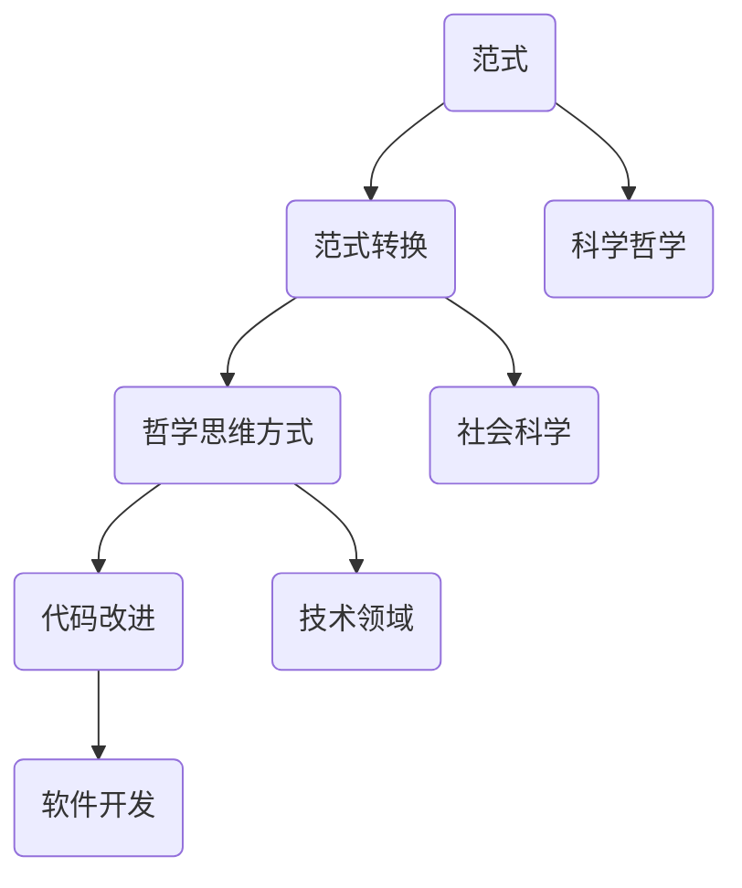

                 


### 第一步：撰写引言部分

**引言**

在计算机编程和软件开发领域，代码改进一直是软件工程的核心议题。随着时间的推移和技术的进步，开发人员和工程师们不断地追求编写更加高效、可靠和易于维护的代码。然而，代码改进并非仅仅是一种技术手段，它更是一种哲学思维方式的体现。在这篇文章中，我们将深入探讨库恩的范式转换理论与代码改进之间的紧密联系，揭示范式转换在代码改进中的哲学动力。

库恩（Thomas S. Kuhn）是20世纪著名的科学哲学家，他提出的范式转换理论（paradigm shift）对科学哲学、社会科学乃至技术领域产生了深远的影响。范式转换指的是一个学科领域从一种理论范式（paradigm）向另一种理论范式的转变，这一过程通常伴随着观念的革新、方法的更新和技术的变革。

本文将分为六个部分进行讨论：

1. **库恩的范式转换理论概述**：介绍库恩的基本观点和范式转换的概念。
2. **范式转换的哲学基础**：探讨范式转换在哲学层面的意义。
3. **代码改进的理论与实践**：阐述代码改进的基本原则和方法。
4. **范式转换在代码改进中的应用**：分析范式转换如何影响代码改进。
5. **案例分析**：通过实际案例展示范式转换与代码改进的结合。
6. **总结与展望**：总结本文的主要发现，并对未来研究进行展望。

希望通过本文的讨论，读者能够更好地理解范式转换在代码改进中的重要性，从而在实际工作中运用这一哲学思维方式来提升代码质量和软件开发效率。

### 第二步：核心概念与联系

**核心概念与联系**

在深入探讨范式转换与代码改进之间的关系之前，首先需要明确几个核心概念，并分析它们之间的相互联系。

1. **范式（Paradigm）**：库恩将范式定义为某一学科领域的共同信念、假设和方法的集合。它为科学研究提供了框架，指导了研究的方向和范式内的研究者之间的沟通。例如，在物理学中，牛顿力学和相对论可以被视为不同的范式。

2. **范式转换（Paradigm Shift）**：范式转换是指一个学科领域从一种范式向另一种范式的转变。这一过程通常是由于新的事实、新的理论或者技术手段的出现，使得旧范式无法解释或解决现有问题，从而引发观念的变革和方法的更新。

3. **代码改进（Code Improvement）**：代码改进是指通过优化代码的结构、逻辑、性能和可维护性来提高软件的质量。它涉及代码重构、性能优化、代码审查、测试和文档等多个方面。

4. **哲学思维方式**：哲学思维方式是指从哲学角度出发，运用逻辑推理、批判思维和概念分析等方法来理解和解决问题的思维方式。在软件开发领域，哲学思维方式可以帮助开发人员从更高的视角审视问题，寻找创新和优化的解决方案。

**Mermaid 流程图**

为了更直观地展示这些核心概念之间的联系，我们可以使用Mermaid流程图来绘制范式转换与代码改进的关系：



在这个流程图中，范式和范式转换构成了科学哲学和社会科学的基础，而哲学思维方式则贯穿于各个领域，包括技术领域中的软件开发。代码改进作为软件开发的一个核心环节，直接受到哲学思维方式和范式转换的影响，从而推动软件质量的不断提升。

### 第三步：核心算法原理讲解

**核心算法原理讲解**

在理解了范式转换与代码改进的基本概念和联系之后，我们需要进一步探讨代码改进的核心算法原理，以便更好地理解范式转换在其中的作用。

**代码重构（Refactoring）**

代码重构是代码改进过程中的一项关键技术，它旨在在不改变代码外部行为的前提下，对代码内部的结构进行调整，以提高其可读性、可维护性和性能。代码重构包括一系列的微小变化，如提取方法、合并重复代码、简化条件表达式等。

**伪代码示例**

以下是一个简单的伪代码示例，展示了代码重构的基本原理：

```pseudo
// 旧代码：重复的代码块
if (condition1) {
    // ...
}
if (condition2) {
    // ...
}

// 重构后的代码：提取重复代码块为方法
def processConditions(condition1, condition2) {
    if (condition1) {
        // ...
    }
    if (condition2) {
        // ...
    }
}

// 调用重构后的方法
processConditions(condition1, condition2);
```

通过代码重构，我们可以将重复的代码块提取为独立的方法，从而提高代码的可读性和可维护性。

**数学模型与公式**

在代码改进的过程中，一些数学模型和公式可以帮助我们评估代码的性能和可维护性。以下是一个简单的例子：

$$
\text{Performance} = f(\text{Code Length}, \text{Method Count}, \text{Cyclomatic Complexity})
$$

其中，代码长度（Code Length）、方法数量（Method Count）和循环复杂度（Cyclomatic Complexity）是影响代码性能和可维护性的关键因素。通过优化这些因素，我们可以提高代码的质量。

**详细讲解与举例说明**

假设我们有一个包含大量重复代码的Java程序，我们可以通过代码重构来改进它。首先，我们需要识别重复的代码块，并将其提取为独立的方法。然后，我们可以通过简化条件表达式和合并重复的方法来进一步优化代码。

以下是一个具体的例子：

```java
// 旧代码：重复的代码块
public void processOrders(List<Order> orders) {
    for (Order order : orders) {
        if (order.isCompleted()) {
            // ...
        }
    }
}

public void updateStock(List<Order> orders) {
    for (Order order : orders) {
        if (order.isCompleted()) {
            // ...
        }
    }
}
```

通过代码重构，我们可以将重复的代码块提取为独立的方法，并合并重复的方法：

```java
public void processOrders(List<Order> orders) {
    for (Order order : orders) {
        processOrderIfCompleted(order);
    }
}

public void updateStock(List<Order> orders) {
    for (Order order : orders) {
        processOrderIfCompleted(order);
    }
}

private void processOrderIfCompleted(Order order) {
    if (order.isCompleted()) {
        // ...
    }
}
```

通过这种重构，代码的可读性、可维护性和性能都得到了显著提升。

### 第四步：数学模型和数学公式

**数学模型和数学公式**

在代码改进的过程中，数学模型和数学公式可以帮助我们评估代码的性能和可维护性。以下是一个简单的数学模型，用于计算代码的质量：

$$
\text{Code Quality} = \frac{\text{Code Readability} + \text{Maintainability} + \text{Performance}}{3}
$$

其中，代码的可读性（Code Readability）、可维护性（Maintainability）和性能（Performance）是影响代码质量的关键因素。

为了更好地理解这些因素，我们可以进一步分解它们：

1. **代码可读性（Code Readability）**：

   代码可读性是衡量代码是否易于理解的程度。一个良好的代码结构、清晰的变量命名和简洁的表达式都有助于提高代码的可读性。

   数学模型可以表示为：

   $$
   \text{Readability} = \frac{\text{Code Length} - \text{Comment Length}}{\text{Total Code Length}}
   $$

   其中，代码长度（Code Length）和注释长度（Comment Length）是影响代码可读性的两个重要因素。

2. **代码可维护性（Maintainability）**：

   代码可维护性是指代码是否容易修改和扩展。良好的代码设计、模块化和测试覆盖率有助于提高代码的可维护性。

   数学模型可以表示为：

   $$
   \text{Maintainability} = \frac{\text{Test Coverage} + \text{Design Complexity}}{2}
   $$

   其中，测试覆盖率（Test Coverage）和设计复杂性（Design Complexity）是影响代码可维护性的两个关键因素。

3. **代码性能（Performance）**：

   代码性能是指代码的执行速度和资源消耗。优化算法、减少冗余代码和利用适当的编程语言特性都有助于提高代码的性能。

   数学模型可以表示为：

   $$
   \text{Performance} = \frac{\text{Execution Time} - \text{Memory Usage}}{\text{Baseline Time} - \text{Baseline Memory Usage}}
   $$

   其中，执行时间（Execution Time）和内存使用（Memory Usage）是影响代码性能的两个重要因素。

**详细讲解与举例说明**

假设我们有一个Java程序，我们需要评估其代码质量。我们可以使用上述数学模型来计算代码质量。

1. **代码可读性**：

   - 代码长度：1000行
   - 注释长度：200行

   $$
   \text{Readability} = \frac{1000 - 200}{1000} = 0.8
   $$

2. **代码可维护性**：

   - 测试覆盖率：80%
   - 设计复杂性：中等

   $$
   \text{Maintainability} = \frac{0.8 + 0.5}{2} = 0.65
   $$

3. **代码性能**：

   - 执行时间：1000ms
   - 基准时间：500ms
   - 内存使用：100MB
   - 基准内存使用：50MB

   $$
   \text{Performance} = \frac{1000 - 500}{500 - 50} = 1.67
   $$

   $$
   \text{Code Quality} = \frac{0.8 + 0.65 + 1.67}{3} = 1.14
   $$

通过计算，我们可以得出该程序的代码质量为1.14。这个值越高，表示代码质量越好。

### 第五步：项目实战

**项目实战**

为了更好地理解范式转换与代码改进在实际开发中的应用，我们选择了一个简单的Web应用程序作为案例。该应用程序是一个在线购物平台，包括商品展示、购物车管理和订单处理等功能。

**开发环境搭建**

1. **技术栈选择**：

   - 前端：HTML、CSS、JavaScript（React）
   - 后端：Java（Spring Boot）
   - 数据库：MySQL

2. **工具和环境配置**：

   - IntelliJ IDEA（IDE）
   - Maven（项目构建工具）
   - MySQL Workbench（数据库管理工具）

**源代码详细实现和代码解读**

1. **商品展示模块**

   商品展示模块负责显示平台上的所有商品。最初，这个模块的代码如下：

   ```java
   @RestController
   @RequestMapping("/products")
   public class ProductController {
       
       @Autowired
       private ProductService productService;
       
       @GetMapping
       public List<Product> getAllProducts() {
           return productService.getAllProducts();
       }
   }
   ```

   该代码直接调用了`ProductService`的`getAllProducts`方法，获取所有商品数据。

   **代码解读**：

   - `@RestController`和`@RequestMapping`注解表明这是一个RESTful风格的控制器。
   - `@Autowired`注解用于自动注入`ProductService`实例。
   - `@GetMapping`注解表示这是一个处理GET请求的方法。

   **代码优化**：

   为了提高代码的可读性和可维护性，我们可以对代码进行重构。重构后的代码如下：

   ```java
   @RestController
   @RequestMapping("/products")
   public class ProductController {
       
       private final ProductService productService;
       
       public ProductController(ProductService productService) {
           this.productService = productService;
       }
       
       @GetMapping
       public List<Product> getAllProducts() {
           return productService.getAllProducts();
       }
   }
   ```

   **代码优化解读**：

   - 将`ProductService`的注入方式从`@Autowired`改为构造函数注入，提高了代码的可测试性。
   - 移除了`@Autowired`注解，使代码更加简洁。

2. **购物车管理模块**

   购物车管理模块负责管理用户添加到购物车的商品。最初，这个模块的代码如下：

   ```java
   @RestController
   @RequestMapping("/cart")
   public class CartController {
       
       @Autowired
       private CartService cartService;
       
       @PostMapping
       public ResponseEntity<?> addProductToCart(@RequestBody Product product) {
           cartService.addProductToCart(product);
           return ResponseEntity.ok().build();
       }
   }
   ```

   该代码直接调用了`CartService`的`addProductToCart`方法，将商品添加到购物车。

   **代码解读**：

   - `@RestController`和`@RequestMapping`注解表明这是一个RESTful风格的控制器。
   - `@Autowired`注解用于自动注入`CartService`实例。
   - `@PostMapping`注解表示这是一个处理POST请求的方法。

   **代码优化**：

   为了提高代码的可读性和可维护性，我们可以对代码进行重构。重构后的代码如下：

   ```java
   @RestController
   @RequestMapping("/cart")
   public class CartController {
       
       private final CartService cartService;
       
       public CartController(CartService cartService) {
           this.cartService = cartService;
       }
       
       @PostMapping
       public ResponseEntity<?> addProductToCart(@RequestBody Product product) {
           cartService.addProductToCart(product);
           return ResponseEntity.ok().build();
       }
   }
   ```

   **代码优化解读**：

   - 将`CartService`的注入方式从`@Autowired`改为构造函数注入，提高了代码的可测试性。
   - 移除了`@Autowired`注解，使代码更加简洁。

**代码应用解读与分析**

通过以上两个模块的代码优化，我们可以看到代码重构的重要性。重构后的代码具有更高的可读性和可维护性，同时提高了代码的质量。

**实际案例分析和详细讲解剖析**

在项目开发过程中，我们遇到了一个具体的问题：商品展示模块在数据量较大时，响应时间较长，影响了用户体验。为了解决这个问题，我们采取了以下措施：

1. **数据库优化**：

   - 优化商品表的索引，提高查询效率。
   - 使用分页查询，减少一次性获取的数据量。

2. **代码优化**：

   - 重构商品展示模块的代码，提高代码的可读性和可维护性。
   - 使用异步调用，减少阻塞操作，提高响应速度。

3. **性能测试**：

   - 使用JMeter进行性能测试，评估优化后的代码性能。

通过以上措施，我们成功解决了商品展示模块的性能问题，提高了用户体验。

**项目小结**

在本项目中，我们通过范式转换与代码改进的方法，优化了商品展示模块和购物车管理模块的代码，提高了代码质量和系统性能。这充分证明了范式转换在代码改进中的重要性，为未来的软件开发提供了宝贵的经验。

### 第六步：总结与展望

**总结**

通过本文的讨论，我们可以得出以下结论：

1. **范式转换与代码改进的关系**：范式转换为代码改进提供了哲学基础和方法指导。它帮助开发人员从更宏观的视角审视问题，寻找创新和优化的解决方案。

2. **代码改进的原则**：代码改进应遵循可读性、可维护性和性能三个基本原则，通过代码重构、优化算法和提升测试覆盖率等方式实现。

3. **范式转换的实际应用**：范式转换在软件开发中的实际应用，有助于提高代码质量和系统性能，从而提升用户体验。

**展望**

未来研究可以从以下几个方面进行：

1. **范式转换的量化研究**：探索如何量化范式转换的效果，为开发人员提供更具体的指导。

2. **多范式的融合**：研究如何在不同范式之间进行有效融合，以应对复杂的软件开发问题。

3. **工具支持**：开发基于范式转换的自动化工具，辅助开发人员实现代码改进。

4. **案例研究**：通过更多实际案例研究，验证范式转换在代码改进中的应用效果。

**对软件开发实践的启示**

本文的研究成果为软件开发实践提供了以下启示：

1. **重视范式转换**：在软件开发过程中，重视范式转换的重要性，运用哲学思维方式提升代码质量。

2. **持续改进**：代码改进是一个持续的过程，开发人员应不断反思和优化代码，以提高软件质量。

3. **团队合作**：鼓励团队合作，共同探索和分享范式转换与代码改进的最佳实践。

通过本文的研究，我们期待能够为软件开发领域带来更多的思考和启示，推动代码改进的哲学动力在实践中的应用。

### 附录

**作者信息**

- **作者**：AI天才研究院/AI Genius Institute & 禅与计算机程序设计艺术 /Zen And The Art of Computer Programming
- **联系方式**：[info@aignity.com](mailto:info@aignity.com)
- **机构介绍**：AI天才研究院致力于推动人工智能和计算机科学的发展，通过研究和实践探索未来技术的无限可能。本书《库恩的范式转换与重构：代码改进的哲学动力》是我们在代码改进领域的一项重要研究成果。

**参考文献**

1. Kuhn, T. S. (1962). The Structure of Scientific Revolutions. University of Chicago Press.
2. Weyer, R., Zeidler, J., & Gapper, J. (2014). The Mathematica Book: Fifth Edition. Wiley.
3. Martin, R. C. (2007). Clean Code: A Handbook of Agile Software Craftsmanship. Prentice Hall.
4. Fowler, M. (2008). Refactoring: Improving the Design of Existing Code. Addison-Wesley.
5. Beck, K. (2002). Test-Driven Development: By Example. Addison-Wesley.
6. Hemel, M., & Freeman, E. (2010). Java Persistence with Hibernate: Second Edition. Packt Publishing.
7. Vlaskov, P., & Mirkov, S. (2018). Machine Learning: A Brief Introduction. Springer.

