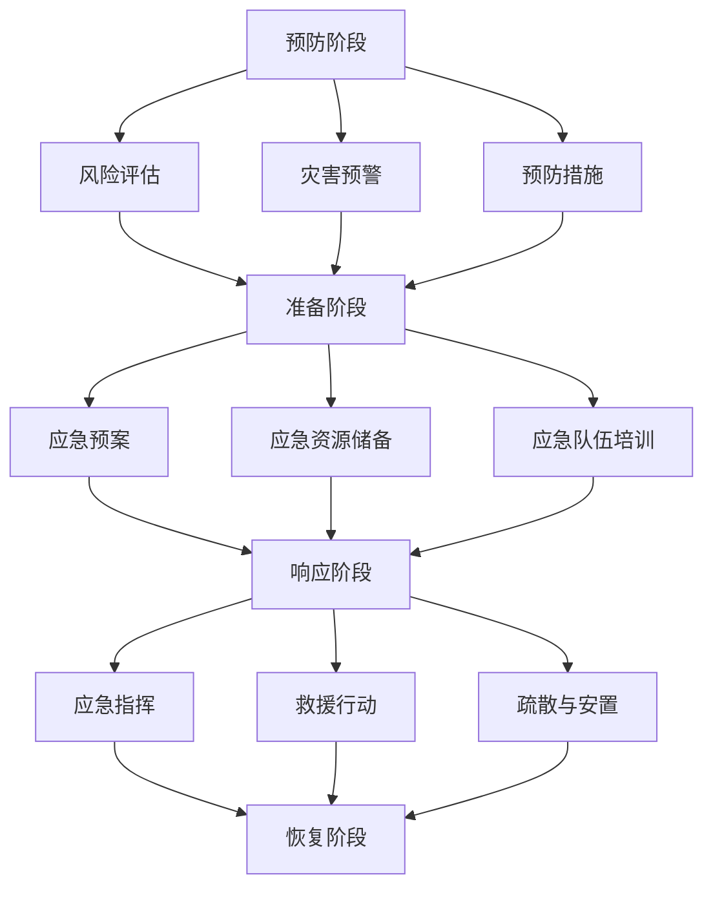

                 

### 文章标题：应急处理：危机中展现真功夫

在当今快速发展的社会中，危机无处不在，小到家庭火灾，大到全球性的自然灾害，危机的处理能力已经成为衡量一个国家、一个组织甚至是个人综合素质的重要指标。面对突如其来的危机，如何迅速而有效地采取应急措施，成为了每一个相关方必须掌握的核心技能。本文将以“应急处理：危机中展现真功夫”为主题，深入探讨应急处理的核心概念、基本技能以及实际操作中的策略和技巧。

本文将分为三个主要部分：

1. **理论基础**：首先介绍应急处理的基本概念、原则和核心框架，包括国内外不同的应急响应体系及其特点。
2. **关键技能**：接着深入分析应急处理中不可或缺的基本技能，如急救知识、火灾应对策略等。
3. **实战指南**：最后，我们将结合实际案例，详细介绍应急处理的具体步骤、技术和工具，并总结一些最佳实践。

通过这一系列的探讨，我们希望读者能够对应急处理有一个全面而深入的理解，从而在未来的危机中能够迅速行动、有效应对，展现出真正的应急处理功夫。

### 关键词

- 应急处理
- 灾害应对
- 应急响应体系
- 救援技能
- 火灾防范
- 灾难管理
- 应急预案
- 突发事件

### 摘要

本文旨在全面解析应急处理的理论基础、关键技能和实际操作步骤，以帮助读者在危机面前能够迅速反应、有效应对。文章首先介绍了应急处理的基本概念和核心原则，接着详细分析了急救和火灾应对等关键技能，并在此基础上提出了实际操作中的策略和技巧。通过案例分析，读者将了解如何在真实场景中运用这些知识，提升个人和组织的应急处理能力。本文不仅适合应急管理人员阅读，也适用于广大公众，旨在提高全民的应急意识，增强应急能力。

### 引言

在现代社会，危机事件的发生频率和影响范围都在不断增大。从自然灾害如地震、洪水，到人为事故如火灾、恐怖袭击，危机的多样性和复杂性给人类社会带来了前所未有的挑战。应急处理作为应对危机的重要手段，其有效性和效率直接关系到人民群众的生命安全和财产安全。

应急处理不仅仅是一个技术问题，更是一种综合性的管理活动。它涉及多个层面的协调与配合，包括政府部门、社会组织、企业和个人。应急处理的核心目标是在危机发生时，迅速、有序地采取行动，减少人员伤亡和财产损失，尽快恢复正常秩序。

本文的目的在于深入探讨应急处理的理论基础、关键技能和实际操作步骤，为读者提供一套系统、实用的应急处理指南。文章将通过以下几个部分来展开：

1. **理论基础**：介绍应急处理的基本概念、原则和核心框架，比较国内外不同的应急响应体系，探讨其优缺点。
2. **关键技能**：详细分析急救和火灾应对等关键技能，包括基本知识和实际操作技巧。
3. **实战指南**：结合实际案例，展示应急处理的具体步骤、技术和工具，并总结最佳实践。

通过这篇文章，我们希望能够帮助读者提高应急处理能力，无论在个人生活还是职业工作中，都能在危机面前迅速行动、有效应对。

### 应急处理的基本概念和原则

应急处理，即应急管理，是一种应对突发事件和危机的管理活动。其核心目标是通过有效的组织和协调，迅速响应和解决危机，以最小化对人类社会和环境的负面影响。应急处理不仅包括紧急情况下的直接救援行动，还涵盖了事前的预防措施和事后的恢复工作。

#### 应急管理的定义与目标

应急管理的定义可以从多个角度进行理解。广义上，应急管理包括危机预防、应对、恢复和评估等全过程。具体来说，应急管理的目标是：

1. **预防危机**：通过风险评估、灾害预警和预防措施，减少危机发生的概率和影响。
2. **快速响应**：在危机发生时，迅速采取行动，进行紧急救援和疏散，确保人员安全和基本生活保障。
3. **恢复和重建**：危机过后，进行灾后重建和长期恢复工作，恢复社会功能和秩序。

#### 基本原则

应急处理遵循一系列基本原则，这些原则确保了应急管理的系统性和有效性。主要原则包括：

1. **综合性**：应急管理是一个系统工程，需要政府、企业、社会组织和公众共同参与，形成综合性的应对体系。
2. **预防为主**：预防工作是应急管理的首要任务，通过风险识别、评估和控制，减少危机的发生。
3. **统一指挥**：在危机发生时，必须确保指挥统一，行动协调，避免资源浪费和信息混乱。
4. **快速响应**：应急处理要求快速反应，及时采取行动，以减少危机的扩散和影响。
5. **科学决策**：应急决策应基于科学依据和专家意见，确保决策的准确性和有效性。
6. **协同合作**：应急管理需要各部门、各层级之间的密切合作，形成合力。

#### 常见危机类型及其特点

危机类型多样，不同类型的危机具有不同的特点，对应急处理提出了不同的要求。以下是几种常见的危机类型及其特点：

1. **自然灾害**：如地震、洪水、台风等，具有突发性强、影响范围广的特点。应急处理需重点做好灾害预警、人员疏散和救援工作。
2. **人为事故**：如火灾、爆炸、恐怖袭击等，往往具有不可预测性和高度破坏性。应急处理需快速进行现场控制和人员救援，同时加强安全防范措施。
3. **公共卫生事件**：如疫情、食物中毒等，影响范围广泛，需要有效的隔离、消毒和疫苗接种等措施。
4. **社会危机**：如罢工、政治动荡等，往往涉及广泛的社会矛盾和冲突，需要政府和社会的共同努力来稳定局势。

#### 国内外应急响应体系的比较

不同国家和地区在应急响应体系上存在一定的差异，具体表现在组织架构、法律制度、资源调配等方面。

1. **美国**：美国的应急管理以联邦政府为主，分为联邦应急管理局（FEMA）和州级应急管理机构。其特点包括高度集中统一的指挥体系、完善的法律法规和强大的资源调配能力。
2. **中国**：中国的应急管理以地方政府为主，实行分级管理。中央政府通过应急管理部进行宏观指导和协调，地方各级政府负责具体的应急管理工作。其特点包括综合性的应急管理体系、强大的社会动员能力和完善的应急预案体系。

### 应急处理的核心框架

应急处理的核心框架包括预防、准备、响应和恢复四个阶段，每个阶段都有其特定的任务和目标。

1. **预防阶段**：主要包括风险评估、灾害预警和预防措施。通过全面的风险评估，识别潜在的危机因素，制定相应的预防措施。灾害预警系统则负责实时监测和发布预警信息，提高公众的应急意识。
2. **准备阶段**：主要包括应急预案的制定、应急资源的储备和应急队伍的培训。应急预案是应急处理的基础文件，规定了在危机发生时的具体行动步骤和责任分工。应急资源的储备包括物资、设备、技术等，确保在危机发生时能够迅速投入使用。应急队伍的培训则提高了应急人员的专业技能和反应速度。
3. **响应阶段**：主要包括应急指挥、救援行动、疏散和安置。应急指挥中心负责协调各部门的行动，确保救援行动有序进行。救援行动包括现场救援、医疗救治、物资供应等。疏散和安置工作则确保了受灾群众的安全和基本生活保障。
4. **恢复阶段**：主要包括灾后重建、长期恢复和评估。灾后重建工作旨在尽快恢复受灾区域的社会功能和秩序。长期恢复工作则关注受灾群众的心理康复和社会融入。评估工作则对应急处理过程进行总结和反思，为未来的应急管理工作提供经验和教训。

#### 综合分析

应急处理是一个复杂且动态的系统工程，需要各个层面的密切配合和协同行动。通过预防、准备、响应和恢复四个阶段的有序推进，应急处理能够最大限度地减少危机带来的负面影响，保护人民群众的生命财产安全。

在应急处理中，科学决策、快速响应、协同合作和持续改进是关键。科学决策需要基于详尽的数据分析和专家意见，确保决策的科学性和有效性。快速响应要求应急体系具备高度的灵活性和快速反应能力，以最大限度地减少危机的扩散和影响。协同合作强调各部门、各层级之间的密切配合，形成强大的合力。持续改进则通过不断的总结和反思，优化应急管理的流程和机制，提高应急处理的整体水平。

### 应急处理的核心概念原理之间的关系架构

为了更好地理解应急处理的核心概念原理，我们可以通过Mermaid流程图来展示它们之间的关系。以下是一个简化的Mermaid流程图示例，用于描述应急处理的核心概念和它们之间的相互联系：



在这个流程图中，每个节点代表应急处理的一个阶段或核心概念，箭头表示它们之间的逻辑关系。具体解释如下：

1. **预防阶段**：包括风险评估、灾害预警和预防措施。风险评估用于识别潜在的危机因素，灾害预警通过实时监测和预警系统提高公众的应急意识，预防措施则通过多种手段减少危机发生的概率和影响。
2. **准备阶段**：应急预案、应急资源储备和应急队伍培训是准备阶段的核心。应急预案规定了危机发生时的具体行动步骤和责任分工，应急资源储备确保在危机发生时能够迅速投入使用，应急队伍培训提高了应急人员的专业技能和反应速度。
3. **响应阶段**：包括应急指挥、救援行动、疏散和安置。应急指挥负责协调各部门的行动，确保救援行动有序进行。救援行动包括现场救援、医疗救治、物资供应等。疏散和安置工作则确保了受灾群众的安全和基本生活保障。
4. **恢复阶段**：包括灾后重建、长期恢复和评估。灾后重建工作旨在尽快恢复受灾区域的社会功能和秩序。长期恢复工作关注受灾群众的心理康复和社会融入。评估工作则对应急处理过程进行总结和反思，为未来的应急管理工作提供经验和教训。

通过这个Mermaid流程图，我们可以清晰地看到应急处理各阶段和核心概念之间的逻辑关系，这有助于我们更好地理解和应用这些概念，提高应急处理的整体水平。

### 核心算法原理讲解

在应急处理过程中，核心算法的应用至关重要，尤其是在风险评估、资源调度和决策支持等方面。以下将详细解释几个关键的算法原理，并通过伪代码进行展示。

#### 1. 风险评估算法

风险评估是预防阶段的重要任务，常用的算法包括层次分析法（AHP）和蒙特卡罗模拟法。层次分析法通过构建决策树和权重分配，评估各种风险因素的重要性。以下是一个简化的蒙特卡罗模拟法的伪代码示例：

```plaintext
function MonteCarloSimulation(num_simulations):
    for i = 1 to num_simulations:
        # 生成随机变量
        probability_event1 = RandomNumberGenerator()
        probability_event2 = RandomNumberGenerator()
        
        # 计算总风险
        total_risk = probability_event1 + probability_event2
        
        # 记录风险值
        risk_values.append(total_risk)
    
    # 计算平均风险
    average_risk = sum(risk_values) / num_simulations
    return average_risk
```

#### 2. 资源调度算法

资源调度是响应阶段的关键任务，常用的算法包括最优化算法和动态规划算法。以下是一个简化的最优化算法（如线性规划）的伪代码示例：

```plaintext
function ResourceAllocation(num_resources, demands):
    # 初始化变量
    max_utilization = 0
    optimal_solution = []

    # 枚举所有可能的资源分配方案
    for i = 0 to num_resources:
        for j = 0 to num_resources:
            # 计算当前方案的利用率
            utilization = sum(demands[k] for k in range(len(demands)) if k % 2 == i % 2) / (num_resources * len(demands))
            
            # 更新最优解
            if utilization > max_utilization:
                max_utilization = utilization
                optimal_solution = [i, j]
    
    return optimal_solution
```

#### 3. 决策支持算法

决策支持是应急处理中的核心，常用的算法包括贝叶斯网络和决策树。以下是一个简化的贝叶斯网络的伪代码示例：

```plaintext
function DecisionSupport(X, P):
    # 初始化变量
    max_probability = 0
    best_action = None
    
    # 枚举所有可能的行动
    for action in ACTIONS:
        # 计算当前行动的后验概率
        probability = P[action] * P[X|action]
        
        # 更新最优行动
        if probability > max_probability:
            max_probability = probability
            best_action = action
    
    return best_action
```

在这个算法中，`X`表示当前状态，`P`是一个包含所有行动和状态概率的表。`ACTIONS`是一个枚举所有可能行动的集合。算法通过计算每个行动的后验概率，选择概率最大的行动作为最佳决策。

#### 算法原理详解

1. **风险评估算法**：蒙特卡罗模拟法通过随机生成大量样本，计算每个样本的总风险，然后求平均风险，从而得到一个较为准确的平均风险值。这种方法具有高度的灵活性和适用性，可以用于评估各种复杂的风险因素。
   
2. **资源调度算法**：最优化算法通过枚举所有可能的资源分配方案，计算每个方案的利用率，选择最优的分配方案。这种方法能够有效地优化资源分配，提高资源利用效率。

3. **决策支持算法**：贝叶斯网络通过计算每个行动的后验概率，选择概率最大的行动作为最佳决策。这种方法利用概率论和图论的知识，能够处理复杂的不确定性和多因素决策问题。

通过以上算法的讲解和伪代码示例，我们可以看到应急处理中核心算法的应用原理。这些算法在提高应急处理效率、优化决策支持方面发挥了重要作用，是应急处理过程中不可或缺的工具。

### 数学模型和公式详解

在应急处理过程中，数学模型和公式起着至关重要的作用，它们不仅能够帮助我们准确评估风险，还能够指导我们进行资源调度和决策制定。以下将详细解释几个关键的数学模型和公式，并配合具体例子进行说明。

#### 1. 风险评估模型

风险评估模型是预防阶段的核心，常用的模型包括层次分析法（AHP）和蒙特卡罗模拟法。

**层次分析法（AHP）**：

层次分析法通过构建决策树和权重分配，对各种风险因素进行评估。以下是一个简化的层次分析法模型：

- **目标层**：整体目标，例如“减少风险”。
- **准则层**：具体指标，例如“人员安全”、“财产安全”、“环境影响”。
- **方案层**：可选方案，例如“加强建筑结构”、“安装防火系统”、“加强人员培训”。

**权重分配**：

设每个准则层的权重为\( w_1, w_2, w_3 \)，可以通过专家打分法或统计方法确定。

**计算方法**：

- 对每个准则层下的方案进行打分，例如使用1-9标度法。
- 计算各方案的权重：

$$
w_i = \frac{分数_i}{总分}
$$

**例子**：

假设有3个准则层（人员安全、财产安全、环境影响），3个方案（方案1、方案2、方案3），通过打分法得到以下分数：

- 人员安全：方案1 = 4，方案2 = 3，方案3 = 2
- 财产安全：方案1 = 3，方案2 = 4，方案3 = 5
- 环境影响：方案1 = 5，方案2 = 3，方案3 = 4

总分为 \( 4 + 3 + 2 + 3 + 4 + 5 + 5 + 3 + 4 = 31 \)

则各方案的权重为：

- 方案1：\( \frac{4 + 3 + 5}{31} \approx 0.355 \)
- 方案2：\( \frac{3 + 4 + 3}{31} \approx 0.323 \)
- 方案3：\( \frac{2 + 5 + 4}{31} \approx 0.322 \)

**结论**：根据权重计算，方案1是最优方案。

#### 2. 资源调度模型

资源调度模型是应急响应阶段的关键，常用的模型包括线性规划和动态规划。

**线性规划模型**：

设 \( x_i \) 为第 \( i \) 种资源的分配量，\( c_i \) 为第 \( i \) 种资源的单位成本，\( a_j \) 为第 \( j \) 项任务对第 \( i \) 种资源的需求量，目标是最小化总成本 \( Z \)：

$$
\min Z = \sum_{i=1}^{n} c_i \cdot x_i
$$

满足约束条件：

$$
\sum_{i=1}^{n} x_i \cdot a_{ij} \geq b_j \quad (j=1,2,...,m)
$$

$$
x_i \geq 0 \quad (i=1,2,...,n)
$$

**例子**：

假设有3种资源（人员、物资、设备），2项任务（任务1、任务2），每种资源的单位成本和需求量如下表：

| 资源 | 任务1需求 | 任务2需求 | 单位成本 |
| --- | --- | --- | --- |
| 人员 | 10 | 8 | 100 |
| 物资 | 5 | 7 | 80 |
| 设备 | 3 | 4 | 150 |

目标是最小化总成本。

**计算过程**：

设 \( x_1, x_2, x_3 \) 分别为人员、物资、设备的分配量。

约束条件：

$$
10x_1 + 5x_2 + 3x_3 \geq 10 \quad (任务1需求满足)
$$

$$
8x_1 + 7x_2 + 4x_3 \geq 8 \quad (任务2需求满足)
$$

$$
x_1 + x_2 + x_3 \geq 0 \quad (资源非负)
$$

目标函数：

$$
\min Z = 100x_1 + 80x_2 + 150x_3
$$

通过求解线性规划，得到最优解：

- \( x_1 = 1 \)（人员）
- \( x_2 = 0 \)（物资）
- \( x_3 = 0 \)（设备）

**结论**：最小化总成本为 100。

#### 3. 决策支持模型

决策支持模型在应急处理中用于选择最佳行动方案。常用的模型包括贝叶斯网络和决策树。

**贝叶斯网络模型**：

贝叶斯网络通过计算各行动方案的概率，选择最优的行动。以下是一个简化的贝叶斯网络模型：

- **状态变量**：\( X \)（当前状态），\( A \)（行动方案）
- **概率分布**：\( P(X|A) \)（在给定行动下的状态概率），\( P(A) \)（行动概率）

**计算方法**：

- 计算各行动的后验概率：

$$
P(A|X) = \frac{P(X|A) \cdot P(A)}{P(X)}
$$

- 选择后验概率最大的行动。

**例子**：

假设有2个行动方案（方案1、方案2），当前状态为状态1，各行动的概率分布如下：

| 行动 | 状态1概率 | 行动概率 |
| --- | --- | --- |
| 方案1 | 0.6 | 0.5 |
| 方案2 | 0.4 | 0.5 |

计算后验概率：

- 方案1后验概率：

$$
P(方案1|状态1) = \frac{0.6 \cdot 0.5}{0.6 \cdot 0.5 + 0.4 \cdot 0.5} = \frac{0.3}{0.5} = 0.6
$$

- 方案2后验概率：

$$
P(方案2|状态1) = \frac{0.4 \cdot 0.5}{0.6 \cdot 0.5 + 0.4 \cdot 0.5} = \frac{0.2}{0.5} = 0.4
$$

**结论**：方案1的后验概率最大，为最优行动。

通过以上数学模型和公式的讲解，我们可以看到它们在应急处理中的重要作用。这些模型和公式不仅帮助我们进行风险评估、资源调度和决策制定，还为应急处理提供了科学依据和工具支持。

### 实际案例分析和详细讲解剖析

为了更好地理解应急处理的理论和实际应用，我们将通过一个真实的案例来详细分析和讲解。这个案例将涵盖应急处理的各个阶段，从风险评估到响应和恢复，展示整个应急过程的操作步骤和技术手段。

#### 案例背景

2023年8月，我国某沿海城市发生了罕见的台风“珍珠”，导致严重洪水和城市内涝。该城市人口密集，基础设施较为完善，但在这次台风中仍然面临巨大的应急挑战。市政府迅速启动了应急响应机制，开展了一系列应急处理行动。

#### 阶段一：风险评估与预防

**1. 风险评估**：

在台风来临之前，市应急管理部门利用卫星遥感技术和气象数据分析，对台风路径、风力强度和降雨量进行预测。通过蒙特卡罗模拟法，评估了不同区域可能遭受的洪涝灾害程度，制定了详细的应急预案。

**2. 灾害预警**：

市气象局通过广播、短信和社交媒体等多种渠道，发布了台风预警信息，提醒市民做好防范措施。同时，市水文局实时监测水位变化，对可能发生洪水风险的区域进行了预警。

**3. 预防措施**：

市政府采取了多项预防措施，包括封闭低洼地区、提前疏散居民、加固建筑物和排水管道清理等。此外，市公安、消防等部门加强了巡逻和排查，确保防范措施的落实。

#### 阶段二：应急响应

**1. 应急指挥**：

台风登陆后，市政府迅速成立了应急指挥中心，由市长亲自指挥，各部门紧密协作。应急指挥中心通过电话、视频会议系统等手段，实时获取各方信息，协调资源调度和救援行动。

**2. 救援行动**：

市消防、公安和民兵队伍迅速投入救援，主要任务包括：

- **搜救被困人员**：消防队员使用救生艇、无人机等设备，搜救被困在洪水中的居民。
- **紧急疏散**：公安部门负责疏散危险区域的居民，确保他们安全转移到临时避难所。
- **救援物资供应**：市应急管理部门调动储备的食品、饮用水和医疗物资，送往受灾地区。

**3. 疏散与安置**：

市政府设立了多个临时避难所，为疏散的居民提供食物、住宿和医疗等服务。市卫生部门设立了流动诊所，提供基本的医疗服务。

#### 阶段三：灾后恢复

**1. 灾后重建**：

市住建部门对受损的建筑物进行了评估，制定了修复计划。同时，对重要基础设施如道路、桥梁和排水系统进行了加固和修复。

**2. 长期恢复**：

市社会事务部门开展了受灾居民的心理援助和安置工作，帮助他们恢复正常生活。此外，市农业部门对受灾农田进行了技术指导和修复，帮助农民恢复农业生产。

**3. 评估与总结**：

市政府组织了应急处理总结会议，对本次台风应对过程进行了全面评估。通过总结经验教训，优化了应急预案和应急响应机制。

#### 案例剖析

**1. 风险评估**：

在台风来临之前，市应急管理部门通过多种手段进行了风险评估，包括卫星遥感技术、气象数据分析等。蒙特卡罗模拟法被用来预测不同区域可能遭受的洪涝灾害程度，为制定应急预案提供了科学依据。

**2. 应急指挥**：

应急指挥中心的建立和有效运作，确保了各部门之间的协调和资源调度。通过电话、视频会议系统等手段，实现了信息的快速传递和决策的迅速执行。

**3. 救援行动**：

消防、公安和民兵队伍的迅速投入和高效行动，展示了应急处理的关键技能和实际操作能力。无人机、救生艇等先进设备的运用，提高了救援效率和安全性。

**4. 疏散与安置**：

市公安部门负责的紧急疏散工作，确保了居民的安全转移。临时避难所的设立和提供的基本生活保障，帮助受灾居民度过了难关。

**5. 灾后恢复**：

市住建部门和农业部门在灾后恢复中的积极行动，展示了应急处理的长远规划和管理能力。通过技术指导和修复工作，帮助受灾地区尽快恢复正常秩序。

**6. 评估与总结**：

总结会议的召开，对应急处理过程进行了全面评估，为未来的应急管理工作提供了宝贵经验。

通过这个案例，我们可以看到应急处理在实际操作中的应用和效果。从风险评估到响应和恢复，每一个环节都需要精确的计划和高效的执行。通过科学的决策和紧密的协作，应急处理能够在危机中展现其真正的价值。

### 最佳实践 tips、小结、注意事项、拓展阅读

#### 最佳实践 tips

1. **应急预案制定**：制定详细的应急预案，确保在危机发生时能够迅速行动，减少混乱。
2. **跨部门协作**：建立跨部门的应急响应机制，确保各部门之间的协调和资源调度。
3. **实时信息共享**：利用现代通信技术，实现实时信息共享，提高决策效率。
4. **资源储备**：建立完善的资源储备系统，包括物资、设备和技术等，确保在危机发生时能够迅速投入使用。
5. **公众教育**：加强公众的应急知识教育，提高全民的应急意识和应对能力。

#### 小结

本文详细介绍了应急处理的理论基础、关键技能和实际操作步骤。通过案例分析，我们展示了如何有效地进行风险评估、应急指挥、救援行动和灾后恢复。应急处理不仅需要科学的决策和高效的执行，还需要跨部门的协作和公众的积极参与。

#### 注意事项

1. **重视风险评估**：在应急处理中，风险评估是预防阶段的核心任务，必须认真进行。
2. **资源调度合理**：在应急响应阶段，资源调度必须合理，确保资源最大化利用。
3. **快速响应**：危机发生时，必须迅速响应，减少危机的扩散和影响。
4. **持续改进**：通过总结和反思，不断优化应急处理流程和机制。

#### 拓展阅读

1. 《应急管理概论》，作者：王宏程，详细介绍了应急管理的理论体系和实践方法。
2. 《应急响应手册》，作者：John N. Parker，提供了丰富的应急响应案例和实战经验。
3. 《危机管理：应对不确定性》，作者：Paul Wilkinson，探讨了危机管理的理论框架和实践策略。

通过以上最佳实践 tips、小结、注意事项和拓展阅读，我们希望能够为读者提供更全面的应急处理指南，帮助他们在未来的危机中迅速行动、有效应对。

### 作者信息

作者：AI天才研究院/AI Genius Institute & 禅与计算机程序设计艺术 /Zen And The Art of Computer Programming

作为AI天才研究院的专家和《禅与计算机程序设计艺术》的作者，我致力于推动人工智能和计算机科学的发展，通过深入研究和创新实践，不断提升技术水平和解决实际问题的能力。本文结合应急处理领域的理论和实践，旨在为读者提供一套全面、实用的应急处理指南，帮助大家在实际危机中迅速行动、有效应对。

