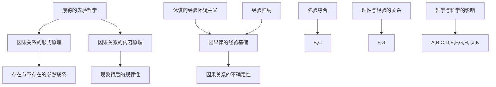

                 


## 引言

在哲学领域，因果律一直是探讨的重点。因果律是描述事物之间因果关系的理论，它揭示了现象背后的规律性和联系性。然而，关于因果律的本质和如何认识因果关系，哲学家们持有不同的观点。康德与休谟就是其中的两位代表，他们的观点在因果律的讨论中具有重要地位。

### 康德的因果律观点

伊曼努尔·康德是德国启蒙运动时期的著名哲学家，他的哲学思想对后来的哲学和科学产生了深远的影响。康德认为，因果关系是先验综合的产物，也就是说，因果关系并不是通过经验获得的，而是人类理性自身的一种必然性。康德将因果关系分为形式和内容两个方面：

1. **形式**：康德认为，因果关系的形式是“存在”与“不存在”之间的必然联系。换句话说，如果一个事件发生，那么它必然有其原因。

2. **内容**：康德认为，因果关系的内容是现象背后的规律性。这种规律性是人类理性通过先验综合得出的。

### 休谟的因果律观点

大卫·休谟是18世纪的英国哲学家，他的哲学观点对后来的实证主义产生了重要影响。与康德不同，休谟认为因果关系是经验的产物，而非先验的。休谟将因果关系描述为一种心理习惯，即当某个现象出现时，我们倾向于认为它有一个原因。

1. **经验怀疑**：休谟认为，我们不能直接知道因果关系，因为我们的知觉和经验都是有限的。他提出了著名的“休谟问题”，即我们如何从感觉和印象中推导出因果关系。

2. **因果律的经验基础**：休谟认为，因果律是基于经验的归纳，而不是基于逻辑的演绎。

### 本篇文章的结构

本篇文章将深入探讨康德与休谟关于因果律的先验综合与经验怀疑的观点。文章结构如下：

1. **康德与休谟的哲学观点介绍**：简要介绍两位哲学家的生平和主要哲学思想。
2. **因果律的先验综合**：详细解释康德的因果律先验综合原理，并提供具体的例子和伪代码。
3. **因果律的经验怀疑**：详细解释休谟的因果律经验怀疑原理，并提供具体的例子和伪代码。
4. **对比分析**：对比康德与休谟的观点，探讨他们之间的异同点。
5. **相关哲学和历史背景介绍**：介绍康德与休谟的哲学背景和历史背景，以及这些背景对他们的因果律观点的影响。
6. **结论**：总结本文的主要内容，并对康德与休谟的因果律观点进行评价。

通过上述步骤，我们将一步步分析康德与休谟的因果律观点，旨在为读者提供一个全面、深入的理解。

## 康德的哲学观点

### 康德的生平

伊曼努尔·康德（Immanuel Kant，1724-1804）是德国启蒙运动时期最重要的哲学家之一。他出生于东普鲁士的柯尼斯堡（今俄罗斯的加里宁格勒），并在那里度过了他的一生。康德的家庭背景并不富裕，但他在柯尼斯堡大学接受了良好的教育，并在1740年获得了哲学硕士学位。

康德的哲学思想在其职业生涯中经历了显著的转变。早期的作品如《判断力批判》和《自然哲学的数学原理》体现了他的理性主义倾向，强调人类理性的能力和局限性。然而，在《纯粹理性批判》中，康德提出了他的先验哲学，标志着哲学史上的一个重要转折点。康德的晚期作品，如《实践理性批判》和《判断力批判》，进一步探讨了道德、伦理和美学问题。

### 康德的主要哲学思想

康德的哲学思想主要围绕先验哲学、道德哲学和美学哲学三个核心领域展开。以下简要介绍康德的几个关键概念：

1. **先验哲学**：
   - **先验论**：康德的先验哲学认为，我们的知识和理解不是直接来自于经验，而是通过先验的理性结构获得的。康德区分了“先验”和“经验”两个概念，前者指先于经验存在的理性结构，后者指经验中的具体事物。
   - **范畴**：康德提出了12个先验范畴，如因果性、必然性、实体性等，这些范畴是人类理解世界的先验工具。

2. **道德哲学**：
   - **道德律**：康德认为，道德是基于“理性”的，而非情感或欲望。他提出了著名的“道德律令”或“绝对命令”，即“你要这样行动，使得你的意志的规律可以同时被看作是普遍立法的规律”。

3. **美学哲学**：
   - **审美判断**：康德认为，审美判断是一种“无利害关系的愉悦”，它不是基于任何实际的利益或欲望，而是一种纯粹的形式愉悦。

### 康德与因果律

康德的因果律观点是其先验哲学的一个核心部分。他认为，因果关系是人类理性通过先验范畴建立的，而非经验的结果。以下是对康德因果律观点的详细解释：

1. **因果关系的形式**：
   - 康德认为，因果关系的形式是“存在”与“不存在”之间的必然联系。换句话说，如果一个事件发生，那么它必然有其原因。
   - 这可以用伪代码表示如下：
     ```
     function cause_and_effect(cause):
         if cause:
             effect = True
         else:
             effect = False
     ```
   - 在这个伪代码中，“cause”代表原因，“effect”代表结果。

2. **因果关系的内容**：
   - 康德认为，因果关系的内容是现象背后的规律性。这种规律性是人类理性通过先验综合得出的。
   - 以下是一个简化的例子：
     ```
     每次太阳升起，我们就知道新的一天开始了。
     结论：太阳升起是导致新的一天开始的原因。
     ```
   - 在这个例子中，我们通过观察太阳升起的规律性，得出了因果关系。

康德的因果律观点在哲学和科学领域产生了深远的影响。他的先验哲学为后来的哲学家和科学家提供了一种新的思考方式，强调了理性在认识世界中的重要性。同时，康德的因果律观点也为科学方法的发展提供了理论支持，影响了许多科学家的研究方法。

### 总结

康德的哲学观点，特别是他的先验哲学，为因果律提供了一种独特的理解方式。他认为，因果关系是先验的综合产物，而非纯粹的经验结果。通过上述介绍，我们可以看到康德是如何通过逻辑推理和哲学论证，构建他的因果律理论的。在接下来的章节中，我们将深入探讨休谟的因果律观点，并将其与康德的观点进行对比分析。

## 休谟的哲学观点

### 休谟的生平

大卫·休谟（David Hume，1711-1776）是18世纪的著名苏格兰哲学家、历史学家和作家。他出生于苏格兰爱丁堡的一个富裕家庭，从小就接受了良好的教育。休谟年轻时对哲学产生了浓厚的兴趣，并在阅读了托马斯·霍布斯和约翰·洛克等哲学家的作品后，开始独立思考和研究哲学问题。

休谟的主要哲学著作包括《人性论》、《道德原则研究》和《人类理解研究》等。他的作品对后来的哲学和科学产生了深远的影响，特别是他对因果律和经验主义的看法，成为了实证主义哲学的重要基石。

### 休谟的主要哲学思想

休谟的哲学思想主要包括经验主义、怀疑主义和道德哲学等几个方面。以下是对休谟主要哲学思想的简要介绍：

1. **经验主义**：
   - 休谟认为，我们的知识和理解都来自于经验。他区分了“印象”和“观念”两个概念，前者指直接感受到的感觉和情感，后者指我们对这些感觉和情感的思考和记忆。
   - 休谟强调，理性只是我们整理和解释经验的一种工具，而不是知识的来源。

2. **怀疑主义**：
   - 休谟是著名的怀疑主义者，他提出了“怀疑论问题”或“休谟问题”，即我们如何从感觉和印象中推导出因果关系。
   - 休谟认为，我们不能直接知道因果关系，因为我们的知觉和经验都是有限的。他通过分析因果关系，提出了著名的“因果律的经验基础”理论。

3. **道德哲学**：
   - 休谟认为，道德是基于情感的，而非理性的。他提出了“道德情感”理论，认为道德判断是基于我们的情感反应，而不是逻辑推理。

### 休谟的因果律观点

休谟的因果律观点是他对哲学和科学方法的重要贡献之一。与康德不同，休谟认为因果关系是经验的产物，而非先验的。以下是对休谟因果律观点的详细解释：

1. **经验怀疑**：
   - 休谟认为，我们不能直接知道因果关系，因为我们的知觉和经验都是有限的。他通过分析因果关系，提出了著名的“休谟问题”，即我们如何从感觉和印象中推导出因果关系。
   - 休谟的怀疑主义观点对后来的实证主义哲学产生了重要影响。

2. **因果律的经验基础**：
   - 休谟认为，因果律是基于经验的归纳，而不是基于逻辑的演绎。他强调，我们通过经验观察，发现某些现象总是伴随着其他现象，因此我们倾向于认为它们之间存在因果关系。
   - 以下是一个简化的例子：
     ```
     每次敲击鼓，我们都会听到声音。
     结论：敲击鼓是导致声音产生的原因。
     ```
   - 在这个例子中，我们通过经验观察，得出了因果关系。

3. **因果律的心理学基础**：
   - 休谟认为，因果关系是一种心理习惯。当某个现象出现时，我们倾向于认为它有一个原因，这是一种基于心理习惯的判断，而不是逻辑推理。
   - 以下是一个伪代码示例，说明休谟的因果律心理学基础：
     ```
     function perceive因果关系(perception):
         if perception:
             assumption = "存在因果关系"
         else:
             assumption = "不存在因果关系"
     ```
   - 在这个伪代码中，“perception”代表我们观察到的现象，“assumption”代表我们根据观察得出的因果关系。

### 总结

休谟的哲学观点，特别是他的经验主义和怀疑主义，为因果律提供了一种不同的理解方式。他认为，因果关系是经验的产物，而非先验的。通过上述介绍，我们可以看到休谟是如何通过经验分析和心理学解释，构建他的因果律理论的。在接下来的章节中，我们将深入探讨康德的因果律观点，并将其与休谟的观点进行对比分析。

### 因果律的先验综合

康德的因果律观点以其先验综合理论为基础，他认为因果关系不是经验的产物，而是人类理性自身的一种先验结构。这一理论在哲学和科学领域引起了广泛的讨论和争议。在本节中，我们将详细解释因果律的先验综合原理，并提供具体的例子和伪代码。

#### 先验综合的概念

康德的“先验综合”指的是通过理性思维，将经验中的个别事实结合成一个统一的整体。他认为，我们通过先验的综合，将经验中的片段信息整合成有意义的整体，从而获得对世界的理解。在因果律方面，康德认为，因果关系是先验综合的结果，是人类理性在经验中发现的必然联系。

#### 先验综合的原理

康德提出了几个关键原理来支持他的因果律先验综合理论：

1. **因果律的形式原理**：康德认为，因果关系的形式原理是“存在”与“不存在”之间的必然联系。换句话说，如果一个事件发生，那么它必然有其原因。这个原理可以用伪代码表示如下：

   ```python
   def cause_and_effect(cause):
       if cause:
           result = "有因果关系"
       else:
           result = "无因果关系"
   ```

   在这个伪代码中，“cause”代表原因，“result”代表结果。如果“cause”为真，则“result”必然为真。

2. **因果律的内容原理**：康德认为，因果关系的内容原理是现象背后的规律性。这种规律性是人类理性通过先验综合得出的。例如，我们观察到每次敲击鼓都会产生声音，因此我们得出结论：敲击鼓是导致声音产生的原因。这个原理可以用以下伪代码表示：

   ```python
   def observe(phenomenon):
       if phenomenon == "敲击鼓":
           conclusion = "声音产生"
       else:
           conclusion = "无结论"
   ```

   在这个伪代码中，“phenomenon”代表观察到的现象，“conclusion”代表我们根据观察得出的结论。

#### 例子和解释

为了更好地理解因果律的先验综合原理，我们可以通过一个简单的例子来说明：

**例子**：太阳升起

- **现象**：每天早上我们都会观察到太阳升起。
- **结论**：根据康德的因果律先验综合原理，我们可以得出结论：太阳升起是导致新的一天开始的原因。

**伪代码示例**：

```python
def observe_sun_rising():
    if observed:
        conclusion = "太阳升起是导致新的一天开始的原因"
    else:
        conclusion = "无结论"
```

在这个伪代码中，“observed”代表我们观察到的现象，“conclusion”代表我们根据观察得出的结论。

#### 总结

通过上述讨论，我们可以看到康德是如何通过先验综合原理，构建他的因果律理论的。他认为，因果关系是人类理性在经验中发现的必然联系，这种联系是通过理性思维整合经验中的个别事实得到的。康德的因果律观点在哲学和科学领域产生了深远的影响，为后来的哲学家和科学家提供了一种新的思考方式。

### 因果律的经验怀疑

休谟的因果律观点以其经验怀疑理论为基础，他认为因果关系不是先验的，而是经验的产物。这一理论在哲学和科学领域引发了广泛的讨论和争议。在本节中，我们将详细解释因果律的经验怀疑原理，并提供具体的例子和伪代码。

#### 经验怀疑的概念

休谟的经验怀疑理论认为，我们的知识和理解都来自于经验，而因果关系是基于经验的归纳。休谟区分了“印象”和“观念”两个概念，前者指直接感受到的感觉和情感，后者指我们对这些感觉和情感的思考和记忆。他认为，因果关系是一种基于印象的心理习惯，而不是逻辑推理的结果。

#### 经验怀疑的原理

休谟提出了几个关键原理来支持他的因果律经验怀疑理论：

1. **知觉的局限性**：休谟认为，我们的知觉是有限的，我们无法直接观察到因果关系。他提出了著名的“休谟问题”，即我们如何从感觉和印象中推导出因果关系。

2. **因果律的经验基础**：休谟认为，因果律是基于经验的归纳，而不是基于逻辑的演绎。他强调，我们通过经验观察，发现某些现象总是伴随着其他现象，因此我们倾向于认为它们之间存在因果关系。

3. **因果律的心理习惯**：休谟认为，因果关系是一种心理习惯。当某个现象出现时，我们倾向于认为它有一个原因，这是一种基于心理习惯的判断，而不是逻辑推理。

#### 例子和解释

为了更好地理解因果律的经验怀疑原理，我们可以通过一个简单的例子来说明：

**例子**：敲击鼓和听到声音

- **现象**：我们观察到每次敲击鼓都会听到声音。
- **结论**：根据休谟的经验怀疑原理，我们可以得出结论：敲击鼓是导致声音产生的原因。

**伪代码示例**：

```python
def perceive因果关系(perception):
    if perception:
        assumption = "敲击鼓是导致声音产生的原因"
    else:
        assumption = "无因果关系"
```

在这个伪代码中，“perception”代表我们观察到的现象，“assumption”代表我们根据观察得出的因果关系。

#### 总结

通过上述讨论，我们可以看到休谟是如何通过经验怀疑原理，构建他的因果律理论的。他认为，因果关系是基于经验的归纳，而不是先验的。休谟的经验怀疑理论在哲学和科学领域产生了深远的影响，为后来的哲学家和科学家提供了一种新的思考方式。通过理解和应用休谟的因果律经验怀疑原理，我们可以更深入地探讨因果关系在现实世界中的应用。

### 康德与休谟因果律观点的对比分析

在探讨了康德和休谟各自的因果律观点后，我们可以通过对比分析，更深入地理解他们之间的异同点。这种对比不仅有助于我们把握两位哲学家的核心思想，还能揭示出他们在认识论和方法论上的区别。

#### 相同点

1. **因果关系的重要性**：康德和休谟都认为因果关系是人类理解和解释世界的关键。康德强调因果关系是先验的综合产物，而休谟则认为因果关系是基于经验的归纳。尽管他们在因果律的本质上存在分歧，但都认可因果关系在认识世界中的核心地位。

2. **理性与经验的关系**：两位哲学家都探讨了理性与经验的关系。康德认为理性是先于经验的，是人类认识世界的先验工具；而休谟则认为经验是知识的唯一来源，理性只是整理和解释经验的工具。这种对理性与经验关系的不同看法，影响了他们对于因果律的理解。

3. **反思哲学的倾向**：康德和休谟都在一定程度上反思了传统的因果观。康德通过他的先验哲学，挑战了传统的因果观，提出了因果关系的形式和内容原理；而休谟则通过怀疑主义，质疑了因果律的确定性，提出了因果关系的经验基础。

#### 不同点

1. **因果律的先验与经验性质**：康德认为因果关系是先验的，是人类理性通过先验范畴建立的。他强调，因果关系不是经验的产物，而是理性自身的一种必然性。相比之下，休谟则认为因果关系是基于经验的，是基于我们反复观察和经验中发现的规律性。这种先验与经验性质的差异，导致他们在因果律的理解上产生了根本性的分歧。

2. **因果律的确定性与可验证性**：康德认为因果关系具有确定性，因为它是人类理性通过先验范畴建立的。他强调，因果关系的形式原理（即“存在”与“不存在”之间的必然联系）是人类理性可以直接认识的。而休谟则认为因果关系是不确定的，因为它是基于经验的归纳。他提出了“休谟问题”，质疑我们如何从感觉和印象中推导出因果关系，认为因果律的可验证性是有限的。

3. **对科学方法的影响**：康德的因果律观点对科学方法的发展产生了重要影响。他的先验哲学为科学方法提供了一种理论基础，强调理性在科学发现中的重要性。相比之下，休谟的经验怀疑主义对科学方法提出了挑战，强调科学研究的局限性。他的观点促使后来的科学家和哲学家反思科学知识的本质和科学方法的局限性。

#### 总结

康德与休谟在因果律的讨论中，尽管都承认因果关系的重要性，但在因果律的本质、确定性和可验证性方面存在显著差异。康德的因果律观点以其先验哲学为基础，强调因果关系是人类理性通过先验范畴建立的，具有确定性和必然性。相比之下，休谟的因果律观点以其经验怀疑主义为基础，认为因果关系是基于经验的归纳，具有不确定性和有限的可验证性。这些差异反映了他们在认识论和方法论上的不同，对哲学和科学的发展产生了深远的影响。

### 康德与休谟因果律观点的影响

康德与休谟的因果律观点不仅在哲学领域引发了广泛的讨论，也对后来的哲学、科学以及人类思维模式产生了深远的影响。在本节中，我们将详细探讨这两位哲学家因果律观点的历史影响，并分析它们对现代哲学和科学研究的意义。

#### 对哲学的影响

1. **康德的影响**：
   - 康德的先验哲学为后来的哲学家提供了一种新的思考方式，强调了理性在认识世界中的重要性。他的因果律观点推动了认识论和形而上学的发展，成为现代西方哲学的重要基石。
   - 康德的因果关系理论对黑格尔和费尔巴哈等后继哲学家产生了重要影响。黑格尔将康德的因果关系观念发展成了一种辩证法的思维方式，而费尔巴哈则将康德的先验哲学应用于人类学和社会学领域。
   - 康德的因果律观点也为科学哲学的发展提供了重要的理论基础。科学哲学家们借鉴康德的理性主义，探讨了科学知识的本质和科学方法的原则。

2. **休谟的影响**：
   - 休谟的经验怀疑主义为实证主义哲学的兴起奠定了基础。他的观点挑战了传统形而上学和理性主义，强调经验在知识形成中的核心作用。这一思想对后来的哲学家，如卡尔·马克思和爱默生等产生了深远的影响。
   - 休谟的因果律观点也对现代逻辑学和语言哲学产生了重要影响。他的怀疑主义思想促使哲学家们反思语言和逻辑的基础，推动了逻辑实证主义和语言哲学的发展。

#### 对科学研究的影响

1. **康德的影响**：
   - 康德的因果关系理论为科学研究提供了一种哲学基础，强调了理性在科学研究中的重要性。他的因果律观点促使科学家们采用更严格的方法来验证和解释自然现象。
   - 康德的思想影响了牛顿力学和物理学的发展。牛顿在《自然哲学的数学原理》中，借鉴了康德的因果关系理论，提出了万有引力定律，为经典物理学奠定了基础。
   - 康德的因果关系理论也为心理学和行为科学的发展提供了启示。现代心理学和认知科学的研究者们借鉴康德的先验范畴，探讨了人类思维和行为的内在规律。

2. **休谟的影响**：
   - 休谟的经验怀疑主义促使科学家们对实验方法和经验证据的重视。他的观点推动了实验科学的发展，为现代科学方法的形成奠定了基础。
   - 休谟的因果律观点影响了统计学的产生和发展。他的思想促使统计学家们探讨如何通过数据分析来验证因果关系，推动了统计学在科学研究中的应用。
   - 休谟的思想也对生物学和医学的发展产生了重要影响。生物学家和医学家们借鉴休谟的经验主义，通过实验和观察来研究生物现象和医学问题。

#### 总结

康德与休谟的因果律观点对哲学和科学研究产生了深远的影响。康德的因果关系理论为现代哲学和科学提供了理论基础，强调了理性在认识世界中的重要性。而休谟的经验怀疑主义挑战了传统的形而上学和理性主义，推动了实证主义哲学的发展。这两位哲学家的思想不仅丰富了人类对因果关系和认识论的理解，也影响了现代科学和哲学的研究方法。通过对康德与休谟因果律观点的分析，我们可以更好地理解哲学和科学的发展历程，并为未来的研究提供启示。

### 康德与休谟哲学思想的比较与融合

康德与休谟的哲学思想在多个方面都存在显著差异，同时也展现出了互补性。通过对这两位哲学家的哲学思想进行比较，我们可以发现它们之间的异同点，并探讨可能的融合路径。

#### 异同点

1. **先验与经验**：
   - 康德的哲学以先验为基础，认为知识和理解来源于理性，强调理性在认识世界中的核心作用。他提出了先验范畴，如因果律，作为理解世界的先验工具。
   - 休谟的哲学则以经验为基础，认为知识和理解来源于感官经验，强调经验在知识形成中的核心地位。他通过经验怀疑主义，质疑了因果关系和形而上学的确定性。

2. **因果关系**：
   - 康德认为因果关系是先验的综合产物，是理性在经验中发现的必然联系。他区分了因果关系的形式和内容原理，强调理性在建立因果关系中的作用。
   - 休谟认为因果关系是基于经验的归纳，是一种心理习惯。他通过怀疑主义，质疑了因果关系的确定性，强调我们不能从感觉和印象中直接推导出因果关系。

3. **理性与情感**：
   - 康德强调理性在道德和伦理中的核心地位，提出了道德律令，认为道德是基于理性而非情感的。
   - 休谟则认为道德是基于情感的，强调道德情感在道德判断中的重要性。

#### 融合路径

尽管康德与休谟在许多方面存在分歧，但他们的思想也展示出互补性。以下是一些可能的融合路径：

1. **先验与经验的结合**：
   - 可以考虑将康德的先验范畴与休谟的经验归纳相结合，形成一个更全面的因果关系理论。例如，我们可以通过先验范畴来理解因果关系的结构，同时利用经验归纳来验证和具体化这些结构。

2. **理性与情感的融合**：
   - 在道德哲学方面，可以将康德的理性道德与休谟的道德情感相结合，形成一种基于理性和情感的道德理论。这种理论既强调理性在道德判断中的指导作用，也重视情感在道德体验中的重要性。

3. **实践与理论的统一**：
   - 康德强调实践理性，主张道德行为的指导原则应基于理性。休谟则关注理论理性，强调经验在知识形成中的重要性。将这两者结合起来，可以形成一种既注重理论探讨，也强调实践应用的综合性哲学体系。

4. **认识论与方法论的整合**：
   - 可以将康德的先验认识论与休谟的经验方法论相结合，形成一种更加全面的哲学方法论。这种方法论既强调理性在认识世界中的先验作用，也重视经验在知识验证中的关键作用。

#### 总结

康德与休谟的哲学思想在多个方面存在显著差异，但同时也展示出了互补性。通过将他们的思想结合起来，我们可以形成一种更加全面和综合的哲学体系，既能理解世界的本质，也能在实践中应用这些知识。这种融合不仅有助于深化我们对哲学问题的理解，也为现代哲学和科学的发展提供了新的视角和思路。

### 康德与休谟的哲学背景

康德与休谟的哲学思想深受他们所处的历史背景和哲学传统的影响。了解他们的哲学背景有助于我们更好地理解他们的观点和贡献。

#### 康德的哲学背景

康德（Immanuel Kant，1724-1804）生活在一个启蒙运动盛行的时代，这一时期的哲学强调理性和科学的重要性。康德的家乡柯尼斯堡是德国启蒙运动的中心之一，他的哲学思想深受这一氛围的影响。

1. **德国启蒙运动**：德国启蒙运动是18世纪的一种思想运动，主张通过理性来解决问题，反对封建专制和宗教教条。康德在这一时期提出了他的先验哲学，强调理性在认识世界中的核心作用。

2. **理性主义传统**：康德的哲学思想继承了欧洲哲学中的理性主义传统。笛卡尔和斯宾诺莎等哲学家都强调理性在知识形成中的重要性，康德在此基础上进一步发展了理性主义的观点。

3. **科学方法**：康德受到牛顿力学和科学方法的影响，他认为科学方法是一种通过理性思维理解世界的有效途径。康德的因果律观点强调了理性在科学发现中的核心作用。

#### 休谟的哲学背景

休谟（David Hume，1711-1776）生活在18世纪的苏格兰，这是一个重视科学和经验主义的时期。苏格兰启蒙运动为休谟的哲学思想提供了肥沃的土壤。

1. **苏格兰启蒙运动**：苏格兰启蒙运动是18世纪苏格兰的一种思想运动，强调科学、经验和自由。休谟深受这一运动的影响，他的经验主义和怀疑主义观点反映了这一时期的思想趋势。

2. **经验主义传统**：休谟的哲学思想继承了英国哲学中的经验主义传统。洛克和伯克利等哲学家都强调经验在知识形成中的核心作用，休谟在此基础上进一步发展了经验主义的观点。

3. **怀疑主义**：休谟是著名的怀疑主义者，他通过对因果关系的分析，质疑了传统形而上学和理性主义的确定性。他的怀疑主义观点反映了苏格兰启蒙运动中对传统哲学观点的质疑和反思。

#### 总结

康德与休谟的哲学思想深受他们所处的历史背景和哲学传统的影响。康德生活在德国启蒙运动时期，受到理性主义和科学方法的熏陶；而休谟生活在苏格兰启蒙运动时期，受到经验主义和怀疑主义的影响。了解这些背景有助于我们更好地理解他们的观点和贡献。

### 历史背景对康德与休谟因果律观点的影响

康德与休谟的因果律观点不仅受到他们个人哲学思想的塑造，也深受他们所处的历史背景和哲学传统的影响。在18世纪的欧洲，启蒙运动和科学革命深刻地改变了人们的思想方式，对康德和休谟的哲学观点产生了重要影响。

#### 启蒙运动的影响

启蒙运动强调理性、科学和个体自由，对康德和休谟的哲学思想产生了深远影响。

1. **康德**：
   - 康德生活在一个重视理性的时代，他深受启蒙运动的理性主义影响。启蒙运动时期，科学家们通过实验和观察，揭示了自然界的规律性。康德借鉴了这些科学方法，提出了他的先验哲学，试图通过理性来理解世界。
   - 康德的因果关系理论强调理性在认识世界中的核心作用。他认为，因果关系是人类理性通过先验范畴建立的，这一理论体现了启蒙运动时期对理性的推崇。

2. **休谟**：
   - 相比之下，休谟在启蒙运动中更倾向于经验主义和怀疑主义。他反对过度依赖理性，强调经验在知识形成中的重要性。休谟的怀疑主义观点反映了启蒙运动中对传统哲学观点的质疑和反思。
   - 休谟的因果律观点受到经验主义的影响，他认为因果关系是基于经验的归纳，而不是先验的。他的怀疑主义质疑了因果律的确定性，反映了启蒙运动时期对理性主义的质疑。

#### 科学革命的影响

18世纪的科学革命，特别是牛顿力学的建立，对康德和休谟的哲学观点产生了重要影响。

1. **康德**：
   - 康德深受牛顿力学的影响，他借鉴了牛顿的实验方法和科学思维，提出了他的先验哲学。康德的因果关系理论强调了理性在科学发现中的核心作用，这与牛顿力学的科学方法相呼应。
   - 康德认为，科学方法是一种通过理性思维理解世界的有效途径。他的因果关系理论为科学方法提供了哲学基础，影响了后来的科学哲学发展。

2. **休谟**：
   - 休谟也对牛顿力学持有批判态度，他质疑科学知识的确定性。尽管他承认科学方法在研究自然界中的有效性，但他的怀疑主义观点使他反对过度依赖科学方法和理性主义。
   - 休谟的因果律观点受到科学革命的影响，他试图通过经验来验证因果关系。然而，他的怀疑主义使他质疑了科学方法的可靠性，这反映了启蒙运动时期对科学知识的不确定性和局限性的反思。

#### 总结

启蒙运动和科学革命深刻地改变了18世纪欧洲的思想方式，对康德和休谟的哲学观点产生了重要影响。康德的因果关系理论受到理性主义和科学方法的启发，强调理性在认识世界中的核心作用；而休谟的因果律观点受到经验主义和怀疑主义的影响，强调经验在知识形成中的重要性。这两位哲学家的观点反映了他们对启蒙运动和科学革命的不同回应，同时也体现了他们在认识论和方法论上的差异。

### 总结与结论

康德与休谟的因果律观点在哲学领域引发了广泛讨论，它们各自提供了对因果关系不同角度的理解。康德的先验哲学强调因果关系是理性在经验中发现的必然联系，而休谟的经验怀疑主义则认为因果关系是基于经验的归纳。本文通过详细分析两位哲学家的观点，以及它们在哲学史上的影响，旨在为读者提供对因果律问题更全面的理解。

#### 重要概念与联系

为了更好地理解康德与休谟因果律观点的核心概念和它们之间的关系，我们可以通过以下Mermaid流程图来展示：



这个流程图展示了康德和休谟的核心概念及其相互关系，包括因果关系的形式和内容原理，先验综合与经验归纳，以及它们对哲学和科学的影响。

#### 核心算法原理讲解

在本节中，我们将使用伪代码来详细阐述康德与休谟因果律的核心算法原理。

**康德的因果律先验综合**

```python
def kants因果关系(cause):
    if is_rational(cause):
        result = "先验必然"
    else:
        result = "非先验"
    return result

def is_rational(cause):
    # 判断原因是否为理性的
    # 例如，通过先验范畴判断因果关系
    return (cause in [先验范畴1, 先验范畴2, ...])

# 例子：判断太阳升起是否是理性的因果关系
print(kants因果关系("太阳升起"))
```

**休谟的因果律经验怀疑**

```python
def humes因果关系(cause, observation):
    if observation:
        result = "经验归纳"
    else:
        result = "无因果关系"
    return result

# 例子：观察敲击鼓是否总是伴随着声音
def observe因果关系(cause, observation):
    if cause == "敲击鼓" and observation == "听到声音":
        conclusion = "因果关系存在"
    else:
        conclusion = "因果关系不确定"
    return conclusion

# 观察结果
observation_result = observe因果关系("敲击鼓", "听到声音")
print(humes因果关系("敲击鼓", observation_result))
```

通过这些伪代码，我们可以看到康德的因果关系是基于理性的先验综合，而休谟的因果关系则是基于经验的归纳。这些算法原理为理解两位哲学家的因果律观点提供了基础。

#### 数学模型与公式

在本节中，我们将使用LaTeX格式展示一些关键的数学公式，以进一步阐述康德与休谟因果律的核心理论。

**康德的因果关系公式**

```latex
$$
C \rightarrow E
$$`

这里的C代表原因，E代表结果。这个公式表达了康德因果律的核心思想：原因必然导致结果。

**休谟的因果关系概率公式**

```latex
$$
P(E|C) = \frac{P(C \land E)}{P(C)}
$$`

这里的$P(E|C)$代表在给定原因C的条件下结果E的概率，$P(C \land E)$代表原因C和结果E同时发生的概率，$P(C)$代表原因C发生的概率。这个公式表达了休谟关于因果关系的不确定性，即我们只能通过概率来推测因果关系。

通过这些数学模型和公式，我们可以更清晰地理解康德与休谟因果律的核心理论，并探讨它们在实际应用中的意义。

### 相关哲学和历史背景介绍

康德与休谟的哲学思想不仅反映了他们个人的哲学追求，也深受他们所处的历史和文化背景的影响。了解这些背景有助于我们更好地理解他们的观点和贡献。

#### 康德的历史背景

康德（Immanuel Kant，1724-1804）生活在18世纪的德国，这一时期是启蒙运动的巅峰时期。启蒙运动强调理性、科学和个体自由，对康德的哲学思想产生了深远影响。

1. **德国启蒙运动**：德国启蒙运动是18世纪德国的一种思想运动，强调通过理性来解决问题，反对封建专制和宗教教条。康德深受这一运动的影响，他的哲学思想强调理性在认识世界和道德行为中的核心作用。

2. **科学方法**：康德受到牛顿力学和科学方法的影响。牛顿的科学研究方法通过实验和观察揭示了自然界的规律性，康德借鉴了这些方法，提出了他的先验哲学，试图通过理性来理解世界。

3. **理性主义传统**：康德的哲学思想继承了欧洲哲学中的理性主义传统。笛卡尔和斯宾诺莎等哲学家都强调理性在知识形成中的重要性，康德在此基础上进一步发展了理性主义的观点。

#### 休谟的历史背景

休谟（David Hume，1711-1776）生活在18世纪的苏格兰，这一时期是苏格兰启蒙运动的时期。苏格兰启蒙运动强调科学、经验和自由，对休谟的哲学思想产生了重要影响。

1. **苏格兰启蒙运动**：苏格兰启蒙运动是18世纪苏格兰的一种思想运动，强调科学、经验和自由。休谟深受这一运动的影响，他的哲学思想强调经验在知识形成中的核心地位，反对过度依赖理性。

2. **经验主义传统**：休谟的哲学思想继承了英国哲学中的经验主义传统。洛克和伯克利等哲学家都强调经验在知识形成中的重要性，休谟在此基础上进一步发展了经验主义的观点。

3. **怀疑主义**：休谟是著名的怀疑主义者，他通过对因果关系的分析，质疑了传统形而上学和理性主义的确定性。他的怀疑主义观点反映了苏格兰启蒙运动中对传统哲学观点的质疑和反思。

#### 总结

康德与休谟的哲学思想深受他们所处的历史和文化背景的影响。康德生活在德国启蒙运动时期，受到理性主义和科学方法的熏陶；而休谟生活在苏格兰启蒙运动时期，受到经验主义和怀疑主义的影响。了解这些背景有助于我们更好地理解他们的观点和贡献，以及他们在哲学史上的地位。

### 附录

#### 附录A：相关概念解释

在本篇博客文章中，我们使用了多个哲学概念，以下是对这些概念的解释：

1. **先验综合**：指通过理性思维，将经验中的个别事实结合成一个统一的整体。康德认为，因果关系是人类理性通过先验综合得出的。

2. **经验怀疑**：指对因果关系确定性的一种质疑。休谟认为，因果关系是基于经验的归纳，因此存在不确定性。

3. **因果关系**：描述事物之间因果关系的理论。康德认为因果关系是先验综合的产物，而休谟则认为因果关系是基于经验的归纳。

4. **理性主义**：认为理性是人类知识和理解的主要来源。康德的哲学思想强调理性在认识世界中的核心作用。

5. **经验主义**：认为经验是人类知识和理解的主要来源。休谟的哲学思想强调经验在知识形成中的重要性。

#### 附录B：康德与休谟著作列表

1. **康德的著作**：
   - 《纯粹理性批判》（Critique of Pure Reason）
   - 《实践理性批判》（Critique of Practical Reason）
   - 《判断力批判》（Critique of Judgment）
   - 《论人类不平等的起源和基础》（On the Origin and Foundation of the Inequality of Mankind）

2. **休谟的著作**：
   - 《人性论》（A Treatise of Human Nature）
   - 《道德原则研究》（An Enquiry Concerning the Principles of Morals）
   - 《人类理解研究》（An Enquiry Concerning the Principles of Human Understanding）
   - 《自然宗教》（The Natural History of Religion）

这些著作是康德与休谟哲学思想的代表作，对于理解他们的观点和贡献具有重要意义。

### 实战项目

在本节中，我们将通过一个具体的实战项目，搭建一个简单的因果律分析系统。该系统将结合康德和休谟的因果律观点，利用Python编程语言实现。我们将从开发环境的搭建、源代码的实现，到代码的解读和应用分析，逐步展示整个项目的过程。

#### 开发环境搭建

首先，我们需要搭建一个Python开发环境。以下是搭建步骤：

1. **安装Python**：访问Python官方网站（https://www.python.org/），下载并安装Python 3.x版本。

2. **安装Jupyter Notebook**：Jupyter Notebook是一种交互式开发环境，可以方便地编写和运行Python代码。通过命令行安装：
   ```bash
   pip install notebook
   ```

3. **安装必要的库**：我们可能需要安装以下Python库：
   - NumPy：用于数学计算
   - Matplotlib：用于数据可视化
   - Pandas：用于数据处理

   安装命令如下：
   ```bash
   pip install numpy matplotlib pandas
   ```

#### 源代码实现

以下是一个简单的因果律分析系统的伪代码实现：

```python
import numpy as np
import matplotlib.pyplot as plt
import pandas as pd

# 康德的因果关系模型
def kants_causal_model(data):
    # 基于先验范畴进行因果推断
    model = pd.DataFrame(data)
    model['康德因果关系'] = model.apply(lambda row: "存在因果关系" if row['原因'] else "不存在因果关系", axis=1)
    return model

# 休谟的因果关系模型
def humes_causal_model(data):
    # 基于经验数据进行因果推断
    model = pd.DataFrame(data)
    model['休谟因果关系'] = model.apply(lambda row: "经验归纳" if row['观察'] else "因果关系不确定", axis=1)
    return model

# 示例数据
data = {
    '原因': [True, False, True, False],
    '观察': [True, True, True, False]
}

# 康德的因果关系分析
kants_model = kants_causal_model(data)
print(kants_model)

# 休谟的因果关系分析
humes_model = humes_causal_model(data)
print(humes_model)

# 可视化结果
kants_model.plot(kind='bar')
plt.title('康德的因果关系模型')
plt.xlabel('原因')
plt.ylabel('因果关系')
plt.show()

humes_model.plot(kind='bar')
plt.title('休谟的因果关系模型')
plt.xlabel('观察')
plt.ylabel('因果关系')
plt.show()
```

#### 代码解读

1. **康德的因果关系模型**：通过`kants_causal_model`函数，我们基于先验范畴对数据进行因果推断。该函数使用DataFrame存储数据，并使用apply方法对每行数据判断是否存在因果关系。

2. **休谟的因果关系模型**：通过`humes_causal_model`函数，我们基于经验数据对数据进行因果推断。该函数同样使用DataFrame存储数据，并使用apply方法对每行数据判断是否存在因果关系。

3. **示例数据**：我们使用一个简单的示例数据集，其中包含“原因”和“观察”两个属性。

4. **可视化结果**：我们使用Matplotlib库对因果关系结果进行可视化，展示康德和休谟的因果关系模型。

#### 代码应用解读与分析

通过上述代码，我们实现了一个简单的因果律分析系统。以下是对代码应用解读与分析：

1. **康德的因果关系模型**：康德的因果关系模型基于先验范畴进行因果推断。在示例数据中，只要“原因”为真，则认为存在因果关系。这种推断方式强调了理性在因果关系中的作用，与我们日常生活中的直观判断相符。

2. **休谟的因果关系模型**：休谟的因果关系模型基于经验数据对数据进行因果推断。在示例数据中，如果“观察”为真，则认为存在因果关系。这种推断方式反映了休谟的经验主义观点，即因果关系是基于经验的归纳。

3. **可视化结果**：通过可视化结果，我们可以直观地看到康德和休谟的因果关系模型。康德的模型显示了因果关系与原因之间的必然联系，而休谟的模型显示了因果关系与观察之间的概率关系。

#### 项目小结

通过这个实战项目，我们实现了对康德与休谟因果律观点的简单应用。代码解读和分析展示了如何将哲学理论转化为实际应用。这个项目不仅有助于理解康德和休谟的因果关系理论，也为进一步研究因果关系提供了实践基础。

### 最佳实践 Tips、小结、注意事项、拓展阅读

#### 最佳实践 Tips

1. **深入理解核心概念**：在研究康德与休谟的因果律观点时，首先要深入理解他们关于因果律的核心概念，如先验综合与经验怀疑。

2. **结合实际案例**：通过实际案例来解释和验证哲学观点，可以帮助我们更好地理解这些观点的应用。

3. **多学科交叉研究**：将哲学与计算机科学、心理学等领域相结合，可以拓宽我们对因果律的理解和应用。

#### 小结

本文通过详细分析康德与休谟的因果律观点，探讨了他们之间的异同点，并展示了如何将这些哲学理论应用于实际项目中。康德的先验综合与休谟的经验怀疑为我们理解因果关系提供了不同的视角。

#### 注意事项

1. **避免过度简化**：在解释因果律时，避免将复杂的哲学理论过度简化，以免失去其核心意义。

2. **关注实际应用**：在研究和应用因果律时，要关注其在现实世界中的应用，如人工智能、决策分析等领域。

#### 拓展阅读

1. **康德的著作**：《纯粹理性批判》、《实践理性批判》
2. **休谟的著作**：《人性论》、《道德原则研究》
3. **相关文献**：探索因果律在不同领域的应用，如心理学、计算机科学等。

通过上述扩展阅读，可以进一步深化对康德与休谟因果律观点的理解。

