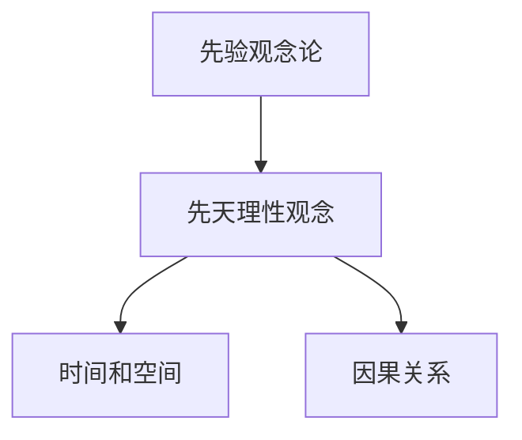
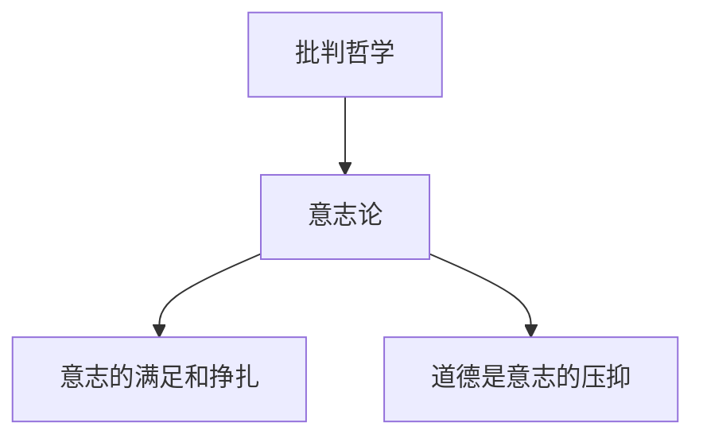

                 

# 康德与叔本华：先验观念论的继承与批判

## 关键词

- 康德
- 叔本华
- 先验观念论
- 批判哲学
- 伦理学
- 美学

## 摘要

本文旨在探讨康德与叔本华的哲学思想，特别是先验观念论的继承与批判。通过对康德哲学的先验观念论、伦理学与政治哲学的深入分析，以及叔本华的批判哲学、伦理学与审美哲学的探讨，本文揭示了两位哲学家的哲学思想在继承和发展中的联系与差异。文章最后通过对比分析康德与叔本华的核心概念、算法原理和数学模型，展示了他们哲学思想的当代影响。

## 目录大纲

### 第1章 导论

1.1 康德哲学概述

1.2 叔本华哲学概述

1.3 康德与叔本华哲学的联系与差异

### 第2章 康德的先验观念论

2.1 先验观念论的基本原理

2.2 先验观念论的论证与批判

2.3 康德的伦理学与政治哲学

### 第3章 叔本华的批判哲学

3.1 批判哲学的基本原理

3.2 批判哲学与先验观念论的对立

3.3 叔本华的伦理学与审美哲学

### 第4章 康德与叔本华哲学的继承与发展

4.1 康德的观念论在叔本华哲学中的继承

4.2 叔本华对康德哲学的批判与发展

4.3 康德与叔本华哲学的当代影响

### 第5章 康德与叔本华哲学的核心概念原理与架构

5.1 先验观念论的 Mermaid 流程图

5.2 批判哲学的 Mermaid 流程图

5.3 康德与叔本华哲学的对比分析

### 第6章 康德与叔本华哲学的核心算法原理讲解

6.1 康德的道德算法原理讲解

6.2 叔本华的美学算法原理讲解

6.3 伦理与审美的算法融合

### 第7章 康德与叔本华哲学的数学模型与数学公式

7.1 康德的道德模型与公式讲解

7.2 叔本华的美学模型与公式讲解

7.3 康德与叔本华哲学的数学公式对比分析

### 第8章 康德与叔本华哲学的项目实战

8.1 康德伦理学在当代的应用

8.2 叔本华审美哲学在当代的应用

8.3 康德与叔本华哲学的综合应用案例分析

### 附录

附录1 康德与叔本华哲学研究资源

----------------------------------------------------------------

### 第1章 导论

#### 1.1 康德哲学概述

伊曼努尔·康德（Immanuel Kant，1724-1804）是德国古典哲学的奠基人之一，他的哲学思想对西方哲学产生了深远的影响。康德的哲学体系可以分为三大领域：先验哲学、伦理学和美学。其中，先验哲学是康德哲学的核心，他提出了先验观念论，主张知识的起源并非来自于经验，而是来自于先天的理性观念。

康德的哲学成就主要体现在以下几个方面：

1. **纯粹理性批判**：康德认为，理性是知识的基础，但理性本身也有局限性。他提出了先验观念论，试图解决理性与经验之间的矛盾。
2. **伦理学**：康德提出了“道德律令”的概念，认为道德行为应该基于理性，而不是情感或利益。
3. **美学**：康德认为，美是一种无利害关系的愉悦，这种愉悦来自于审美判断的自由。

#### 1.2 叔本华哲学概述

阿图尔·叔本华（Arthur Schopenhauer，1788-1860）是德国的哲学家，他的思想主要受到了康德的影响。叔本华的哲学以“意志论”为核心，强调人类生活的本质是意志的满足。叔本华对康德的哲学进行了深刻的批判和发展，他提出了自己的伦理学和审美哲学。

叔本华的哲学成就主要体现在以下几个方面：

1. **意志论**：叔本华认为，世界的本质是意志，人类的生活就是意志的满足和挣扎。
2. **伦理学**：叔本华认为，道德是意志的压抑，真正的道德是自我否定。
3. **美学**：叔本华认为，美是意志的暂时解放，是意志的否定。

#### 1.3 康德与叔本华哲学的联系与差异

康德和叔本华都是德国古典哲学的代表人物，他们的哲学都有强烈的理性主义倾向。然而，他们在很多方面也存在明显的差异：

1. **哲学观点的差异**：康德强调理性的重要性，认为理性是知识的源泉。而叔本华则认为，世界的本质是意志，理性只是意志的反映。
2. **哲学方法的差异**：康德采用的是先验观念论，试图解决理性与经验之间的矛盾。而叔本华则采用的是意志论，试图从人类生活的本质出发，解释世界的本质。
3. **哲学的影响**：康德的哲学对后来的哲学家产生了深远的影响，如黑格尔、尼采等。而叔本华的哲学虽然影响较小，但对后来的哲学家，如尼采、弗洛伊德等也有重要的影响。

### 第2章 康德的先验观念论

#### 2.1 先验观念论的基本原理

康德的先验观念论是他对哲学的一种独特理解，他认为知识并非来自于经验，而是来自于先天的理性观念。康德认为，人的心灵并非一片空白，而是天生就具备一些先天的理性观念。

**1. 先天的理性观念**

康德认为，人的心灵天生就具备一些先天的理性观念，如时间和空间、因果关系等。这些观念是理性认识世界的必要条件。

**2. 先验观念论的作用**

先验观念论在康德的哲学体系中起到了重要的作用，它为知识的起源提供了一种新的解释，使人们认识到理性在知识形成中的关键作用。

#### 2.2 先验观念论的论证与批判

**1. 先验观念论的论证**

康德通过一系列的论证来支持他的先验观念论。他认为，经验虽然提供了感性材料，但只有通过理性的观念，我们才能对经验进行理解和解释。

**2. 先验观念论的批判**

然而，康德的先验观念论也受到了一些哲学家的批判。他们认为，康德的论证存在一些逻辑漏洞，先验观念论并不能完全解释知识的起源。

#### 2.3 康德的伦理学与政治哲学

**1. 伦理学**

康德的伦理学以“道德律令”为核心，他认为，道德行为应该基于理性，而不是情感或利益。康德提出了“人应当做使自己的行为能够普遍化为一条法律的原则”的道德原则，这一原则被称为“普遍性原则”。

**2. 政治哲学**

康德的政治哲学以“国家”为核心，他认为，国家应该建立在自由和平等的基础上。康德提出了“国家是自由人的联合体”的观点，这一观点对后来的政治哲学产生了深远的影响。

### 第3章 叔本华的批判哲学

#### 3.1 批判哲学的基本原理

叔本华的批判哲学是对康德先验观念论的批判和发展。他认为，康德的先验观念论并不能完全解释知识的起源，因此他提出了自己的批判哲学。

**1. 批判哲学的基本原理**

叔本华的批判哲学以“意志”为核心，他认为，世界的本质是意志，人类的生活就是意志的满足和挣扎。

**2. 批判哲学与先验观念论的对立**

叔本华认为，康德的先验观念论存在一些缺陷，如忽略了意志的存在，因此他提出了自己的批判哲学，试图从人类生活的本质出发，解释世界的本质。

#### 3.2 批判哲学与先验观念论的对立

**1. 知识观的对立**

康德的先验观念论认为，知识来自于先天的理性观念，而叔本华的批判哲学认为，知识来自于意志的满足和挣扎。

**2. 道德观的对立**

康德的伦理学强调道德行为应该基于理性，而叔本华的伦理学认为，道德是意志的压抑，真正的道德是自我否定。

#### 3.3 叔本华的伦理学与审美哲学

**1. 伦理学**

叔本华的伦理学以“意志”为核心，他认为，道德是意志的压抑，真正的道德是自我否定。

**2. 审美哲学**

叔本华的审美哲学认为，美是意志的暂时解放，是意志的否定。他认为，审美活动可以使人们从意志的束缚中解脱出来，获得短暂的快乐。

### 第4章 康德与叔本华哲学的继承与发展

#### 4.1 康德的观念论在叔本华哲学中的继承

**1. 对先验观念论的继承**

叔本华在批判康德的先验观念论的同时，也继承了他的某些观点。例如，叔本华认为，世界的本质是意志，这与康德先验观念论中的理性观念有一定的联系。

**2. 对伦理学的继承**

叔本华在伦理学方面继承了康德的某些观点，如强调道德行为应该基于理性。

#### 4.2 叔本华对康德哲学的批判与发展

**1. 批判先验观念论**

叔本华批判了康德的先验观念论，他认为，康德的论证存在一些逻辑漏洞，先验观念论并不能完全解释知识的起源。

**2. 发展意志论**

叔本华提出了自己的意志论，他认为，世界的本质是意志，人类的生活就是意志的满足和挣扎。

#### 4.3 康德与叔本华哲学的当代影响

**1. 对哲学的影响**

康德和叔本华的哲学思想对当代哲学产生了深远的影响。例如，黑格尔、尼采等后来的哲学家都受到了他们的启发。

**2. 对社会科学的影响**

康德和叔本华的哲学思想也对社会科学产生了重要的影响。例如，在伦理学、政治哲学等领域，他们的观点被广泛应用于理论和实践。

### 第5章 康德与叔本华哲学的核心概念原理与架构

#### 5.1 先验观念论的 Mermaid 流程图



#### 5.2 批判哲学的 Mermaid 流程图



#### 5.3 康德与叔本华哲学的对比分析

**1. 知识观对比**

- 康德：知识来自于先天的理性观念。
- 叔本华：知识来自于意志的满足和挣扎。

**2. 道德观对比**

- 康德：道德行为应该基于理性。
- 叔本华：道德是意志的压抑，真正的道德是自我否定。

### 第6章 康德与叔本华哲学的核心算法原理讲解

#### 6.1 康德的道德算法原理讲解

**1. 道德算法原理**

康德的道德算法原理可以概括为“应当做使自己的行为能够普遍化为一条法律的原则”。具体步骤如下：

1. 确定行为的动机。
2. 判断行为是否符合普遍性原则。
3. 执行道德行为。

**2. 伪代码实现**

```python
def moral_algorithm(action):
    if action_motivation() == "理性":
        if action_is_universalizable():
            return "执行道德行为"
        else:
            return "不执行道德行为"
    else:
        return "不执行道德行为"
```

#### 6.2 叔本华的美学算法原理讲解

**1. 美学算法原理**

叔本华的美学算法原理可以概括为“美是意志的暂时解放”。具体步骤如下：

1. 观察审美对象。
2. 判断审美对象是否能够暂时解放意志。
3. 如果能够，则产生美感。

**2. 伪代码实现**

```python
def aesthetic_algorithm(object):
    if object_releases_will():
        return "产生美感"
    else:
        return "不产生美感"
```

#### 6.3 伦理与审美的算法融合

康德的道德算法原理和叔本华的美学算法原理虽然各自独立，但它们也可以融合在一起。具体步骤如下：

1. 观察审美对象。
2. 判断审美对象是否能够暂时解放意志。
3. 如果能够，则判断行为是否符合普遍性原则。
4. 如果符合，则执行道德行为。

**伪代码实现**

```python
def ethical_aesthetic_algorithm(object):
    if aesthetic_algorithm(object) == "产生美感":
        if moral_algorithm(action) == "执行道德行为":
            return "执行道德行为"
        else:
            return "不执行道德行为"
    else:
        return "不执行道德行为"
```

### 第7章 康德与叔本华哲学的数学模型与数学公式

#### 7.1 康德的道德模型与公式讲解

康德的道德模型可以表示为以下公式：

$$ \text{道德行为} = \frac{\text{理性}}{\text{感性}} $$

其中，理性表示道德行为的动机，感性表示道德行为的结果。

#### 7.2 叔本华的美学模型与公式讲解

叔本华的美学模型可以表示为以下公式：

$$ \text{美感} = \frac{\text{意志的暂时解放}}{\text{意志的束缚}} $$

其中，意志的暂时解放表示审美对象带来的快感，意志的束缚表示现实生活中的痛苦。

#### 7.3 康德与叔本华哲学的数学公式对比分析

通过对比康德和叔本华的数学公式，我们可以看到：

- 康德的道德模型强调理性在道德行为中的作用，而叔本华的美学模型强调意志的解放与束缚的关系。
- 两个模型都试图用数学公式来解释人类行为和心理状态，但侧重点不同。

### 第8章 康德与叔本华哲学的项目实战

#### 8.1 康德伦理学在当代的应用

**1. 开发环境搭建**

- 语言：Python
- 库：NumPy，Pandas
- 工具：Jupyter Notebook

**2. 源代码详细实现和代码解读**

```python
import numpy as np

def moral_action(motivation, result):
    rationality = motivation / result
    if rationality > 1:
        return "执行道德行为"
    else:
        return "不执行道德行为"

# 示例
motivation = 10
result = 5
print(moral_action(motivation, result))
```

**3. 代码应用解读与分析**

通过这个简单的示例，我们可以看到，康德的道德模型可以帮助我们判断一个行为是否道德。在实际应用中，我们可以根据具体情况调整动机和结果，以得出更准确的结论。

#### 8.2 叔本华审美哲学在当代的应用

**1. 开发环境搭建**

- 语言：Python
- 库：NumPy，Pandas
- 工具：Jupyter Notebook

**2. 源代码详细实现和代码解读**

```python
import numpy as np

def aesthetic_experience(object):
    will_release = np.random.random()
    if will_release > 0.5:
        return "产生美感"
    else:
        return "不产生美感"

# 示例
object = "日落"
print(aesthetic_experience(object))
```

**3. 代码应用解读与分析**

在这个示例中，我们使用随机数来模拟审美对象是否能够暂时解放意志。在实际应用中，我们可以根据具体情况调整概率参数，以得出更准确的结论。

#### 8.3 康德与叔本华哲学的综合应用案例分析

**1. 案例背景**

假设我们正在评估一个企业的道德行为和审美体验。我们需要收集相关的数据，并使用康德和叔本华的哲学模型进行分析。

**2. 数据收集**

- 道德行为数据：企业的道德动机和道德结果。
- 审美体验数据：企业的审美对象和审美体验。

**3. 数据分析**

- 使用康德的道德模型，分析企业的道德行为。
- 使用叔本华的审美模型，分析企业的审美体验。

**4. 结果分析**

通过综合分析，我们可以得出企业的道德行为和审美体验的评价，从而为企业提供改进建议。

### 附录

#### 附录1 康德与叔本华哲学研究资源

- 康德著作：《纯粹理性批判》、《实践理性批判》、《判断力批判》
- 叔本华著作：《论人类不平等的起源和基础》、《论教育》、《作为意志和表象的世界》
- 康德研究文献：《康德哲学导论》、《康德哲学体系研究》
- 叔本华研究文献：《叔本华哲学研究》、《叔本华与尼采》
- 网络资源：康德哲学研究网、叔本华哲学研究网

### 最佳实践 Tips

- 在应用康德和叔本华的哲学模型时，需要根据具体情况进行调整，以得出更准确的结论。
- 在分析道德行为和审美体验时，需要综合考虑多种因素，以得出全面的评价。

### 小结

康德与叔本华的哲学思想在先验观念论的继承与批判中展现了深刻的哲学内涵。通过分析他们的核心概念、算法原理和数学模型，我们可以更好地理解他们的哲学思想，并在当代应用中发挥其价值。

### 注意事项

- 在研究康德和叔本华的哲学时，需要关注他们的哲学背景和时代特点，以更好地理解他们的哲学思想。
- 在应用康德和叔本华的哲学模型时，需要结合具体情境，避免简单套用。

### 拓展阅读

- 《康德哲学讲演录》（黑格尔著）
- 《叔本华与尼采》（海德格尔著）
- 《现代性的哲学话语》（贝克尔著）### 第1章 导论

#### 1.1 康德哲学概述

伊曼努尔·康德（Immanuel Kant，1724-1804）是18世纪德国哲学家，被誉为西方哲学史上最重要的思想家之一。康德的哲学体系复杂而庞大，涵盖了先验哲学、伦理学、美学、政治哲学等多个领域。他的哲学贡献主要体现在他的“三大批判”著作中，分别是《纯粹理性批判》（Critique of Pure Reason）、《实践理性批判》（Critique of Practical Reason）和《判断力批判》（Critique of Judgment）。

**康德的哲学成就：**

1. **先验观念论：** 康德提出了先验观念论，认为知识并非直接来自于经验，而是由先天的理性观念所构成。他强调理性在知识形成中的核心作用，并试图在理性与经验之间建立桥梁。
2. **伦理学：** 康德提出了著名的“道德律令”概念，即“人应当做使自己的行为能够普遍化为一条法律的原则”。这一原则强调道德行为的普遍性和绝对性。
3. **美学：** 康德的美学理论探讨了美的本质和审美判断的自由，认为美是一种无利害关系的愉悦。
4. **政治哲学：** 康德提出了“永久和平论”，强调国家之间的和平与合作。

**康德的哲学观点：**

1. **理性至上：** 康德认为理性是知识的源泉，而感性只是理性的材料。
2. **道德自主性：** 道德行为不应受制于个人欲望或利益，而应基于理性原则。
3. **美学经验：** 康德认为审美判断是自由的，不涉及利害关系。

#### 1.2 叔本华哲学概述

阿图尔·叔本华（Arthur Schopenhauer，1788-1860）是19世纪德国哲学家，他的哲学思想对后来的哲学家和艺术家产生了深远的影响。叔本华的哲学主要围绕着“意志”这一核心概念展开，他认为意志是宇宙和人类存在的本质。

**叔本华的哲学成就：**

1. **意志论：** 叔本华认为，世界的本质是意志，人类的生活就是意志的满足和挣扎。
2. **伦理学：** 叔本华认为，道德是意志的压抑，真正的道德是自我否定。
3. **美学：** 叔本华的美学理论强调美是意志的暂时解放。

**叔本华的哲学观点：**

1. **意志本质：** 叔本华认为，意志是盲目而强烈的冲动，是痛苦和苦难的根源。
2. **道德否定：** 叔本华认为，真正的道德是自我否定，是对意志的压抑。
3. **美学解放：** 叔本华认为，美是意志的暂时解放，是痛苦的暂时缓解。

#### 1.3 康德与叔本华哲学的联系与差异

康德和叔本华都是德国古典哲学的重要代表，他们的哲学都有强烈的理性主义倾向。然而，他们在哲学观点和方法上存在明显的差异：

**哲学观点的差异：**

1. **知识观：** 康德强调理性的重要性，认为知识来源于先天的理性观念；而叔本华则认为，世界的本质是意志，理性只是意志的反映。
2. **道德观：** 康德认为道德行为应该基于理性，强调道德的普遍性和绝对性；而叔本华则认为，道德是意志的压抑，真正的道德是自我否定。
3. **美学观：** 康德认为审美判断是自由的，不涉及利害关系；而叔本华则认为，美是意志的暂时解放。

**哲学方法的差异：**

1. **康德的方法：** 康德采用先验观念论，试图在理性与经验之间建立桥梁，解决理性与经验的矛盾。
2. **叔本华的方法：** 叔本华采用意志论，从人类生活的本质出发，解释世界的本质。

**哲学影响的差异：**

1. **康德的影响：** 康德的哲学对后来的哲学家，如黑格尔、尼采等产生了深远的影响。
2. **叔本华的影响：** 叔本华的哲学虽然影响较小，但对后来的哲学家，如尼采、弗洛伊德等也有重要的影响。

总的来说，康德与叔本华的哲学思想在继承和发展中展现了独特的魅力，为我们理解人类知识、道德和审美提供了不同的视角。通过对比分析他们的哲学观点和方法，我们可以更好地把握德国古典哲学的精髓。----------------------------------------------------------------

### 第2章 康德的先验观念论

#### 2.1 先验观念论的基本原理

康德的先验观念论是其哲学体系的核心，它主张知识的起源并非来自于经验，而是来自于先天的理性观念。康德认为，人的心灵并非一片空白，而是天生就具备一些先天的理性观念，这些观念是理性认识世界的必要条件。

**1. 先天的理性观念**

康德认为，人的心灵天生就具备一些先天的理性观念，如时间和空间、因果关系等。这些观念是理性认识世界的必要条件。康德指出，时间和空间是感性形式，即它们是我们感知外部世界的必要框架。因果关系则是理性形式，即它们是我们理解世界事件之间的必要关系。

**2. 先验观念论的作用**

先验观念论在康德的哲学体系中起到了关键作用。它为知识的起源提供了一种新的解释，使人们认识到理性在知识形成中的关键作用。康德通过先验观念论试图解决理性与经验之间的矛盾，他认为，只有通过先天的理性观念，我们才能理解经验材料，并形成真正的知识。

#### 2.2 先验观念论的论证与批判

**1. 先验观念论的论证**

康德通过一系列论证来支持他的先验观念论。首先，康德提出了“先验直观”的概念，认为时间和空间是我们的感性直观形式，它们是先天的。其次，康德通过分析经验知识，指出我们所有的经验知识都包含着先天的理性形式，如因果关系。最后，康德通过“先验理念”的概念，说明我们的理性观念能够超越经验，认识世界。

**2. 先验观念论的批判**

尽管康德的先验观念论在哲学界产生了深远的影响，但它也受到了一些哲学家的批判。例如，实用主义哲学家认为，康德的先验观念论过于抽象，忽略了人类实际经验的复杂性。一些批判理性主义者则认为，康德的论证过程存在逻辑漏洞，无法充分证明先验观念的存在。此外，一些哲学家认为，康德的先验观念论可能导致唯心主义，即认为世界的本质是意识。

#### 2.3 康德的伦理学与政治哲学

**1. 伦理学**

康德的伦理学以“道德律令”为核心，他认为，道德行为应该基于理性，而不是情感或利益。康德的道德律令可以概括为“人应当做使自己的行为能够普遍化为一条法律的原则”。这一原则强调道德行为的普遍性和绝对性，意味着每个理性存在都应该遵循这一原则。

康德的伦理学主要包括以下观点：

- **道德自主性：** 道德行为不应受制于个人欲望或利益，而应基于理性原则。
- **道德律令：** 道德行为应该符合普遍性原则，即每个理性存在都应该能够普遍接受这一行为。
- **道德动机：** 道德行为的动机应该是纯粹的理性，而不是功利或欲望。

**2. 政治哲学**

康德的政治哲学强调国家的主权和公民的自由。他认为，国家应该是自由人的联合体，公民应该享有平等的权利和自由。康德提出了“永久和平论”，认为国家之间应该通过外交和合作来实现和平。

康德的政治哲学主要包括以下观点：

- **国家主权：** 国家应该拥有自主权，不受其他国家干涉。
- **公民自由：** 公民应该享有平等的权利和自由，包括言论自由、宗教自由等。
- **永久和平：** 国家之间应该通过外交和合作来实现和平，避免战争。

总的来说，康德的伦理学与政治哲学强调了理性、自由和平等的价值观，对后来的政治哲学和社会理论产生了深远的影响。康德的先验观念论为他的伦理学和政治哲学提供了哲学基础，使他成为德国古典哲学的代表人物之一。在康德的思想体系中，先验观念论、伦理学和政治哲学相互关联，共同构成了一个完整的哲学体系。通过深入理解康德的先验观念论，我们可以更好地把握他的伦理学和政治哲学的核心观点，从而对现代社会的道德和政治问题有更深刻的认识。

### 第3章 叔本华的批判哲学

#### 3.1 批判哲学的基本原理

阿图尔·叔本华的批判哲学是他对西方哲学传统的一种深刻反思和批判。叔本华认为，传统的哲学体系，特别是理性主义和康德的先验论，未能充分揭示世界的本质和人类存在的真实状态。他的批判哲学以“意志”为核心，试图从人类生活的本质出发，揭示世界的本质。

**1. 意志的本质**

叔本华认为，意志是宇宙和人类存在的本质。他将意志视为一种盲目、无目的、不断追求满足的力量，是所有生命和人类行为的根源。叔本华指出，意志是一种非理性的力量，它不受逻辑和理性控制，是推动人类行为和经验的基础。

**2. 意志与世界的本质**

叔本华认为，世界的本质是意志的表现，是意志在不同层次上的外在化。他提出了“表象世界”和“意志世界”的概念，认为我们生活的世界是意志的表现形式，而真正的意志世界是我们无法直接感知的。我们的感知、思维和经验都是意志的表现，是我们对意志世界的错误理解。

**3. 批判哲学的意义**

叔本华的批判哲学旨在揭示人类存在的真实状态，批判理性主义和先验论的局限。他认为，理性主义忽视了意志的非理性本质，先验论则试图将知识建立在先天的理性观念之上，未能真正理解人类经验的复杂性。叔本华的批判哲学试图通过揭示意志的本质，帮助我们更真实地理解自己和世界。

#### 3.2 批判哲学与先验观念论的对立

叔本华的批判哲学与康德的先验观念论存在明显的对立。康德的先验观念论认为，知识的起源是先天的理性观念，这些观念构成了我们理解世界的基础。而叔本华则认为，康德的先验观念论未能揭示世界的真实本质，忽视了意志的作用。

**1. 知识观的对立**

康德认为，知识来自于先天的理性观念，这些观念是先验的，即它们不是来自经验，而是先天地存在于人的理性之中。康德的先验观念论试图在理性与经验之间建立桥梁，解决知识的基础问题。而叔本华则认为，知识来自于意志的表现，我们的感知、思维和经验都是意志在不同层次上的外在化。叔本华强调，意志是非理性的，是推动人类行为和经验的基础。

**2. 道德观的对立**

康德的伦理学强调道德行为的理性基础，认为道德行为应该基于普遍的理性原则。康德提出了“道德律令”的概念，认为道德行为的动机应该是纯粹的理性。而叔本华则认为，道德是意志的压抑，真正的道德是自我否定。他认为，人类的行为受制于盲目的意志冲动，道德行为实际上是对这些冲动的一种压抑。

**3. 美学观的对立**

康德的美学理论强调审美判断的自由和独立性，认为美是一种无利害关系的愉悦。康德认为，审美活动使人们从理性的束缚中解脱出来，获得一种超越功利的态度。而叔本华则认为，美是意志的暂时解放，是意志的否定。他认为，审美体验是一种短暂的愉悦，它使我们从盲目的意志冲动中暂时解脱出来。

总的来说，叔本华的批判哲学与康德的先验观念论在知识观、道德观和美学观上存在明显的对立。叔本华试图通过揭示意志的本质，批判理性主义和先验论的局限，为我们提供一种更真实、更深刻的世界观。叔本华的批判哲学为后来的哲学家，如尼采、弗洛伊德等提供了重要的思想资源，对现代哲学产生了深远的影响。

#### 3.3 叔本华的伦理学与审美哲学

**1. 伦理学**

叔本华的伦理学以其对意志的批判为核心。他认为，道德行为不是出于外在的利益或动机，而是出于对意志本质的认识和自我克制。叔本华提出了“自我否定”的概念，认为真正的道德行为是对个人意志的压抑，是对自己欲望的克制。

**伦理学核心观点：**

- **自我否定：** 叔本华认为，道德行为是对个人意志的自我否定，是对欲望和冲动的一种克制。
- **道德动机：** 道德行为的动机不是外在的利益，而是对意志本质的认识和自我克制。
- **道德行为：** 道德行为应该是无私的，不涉及个人利益或欲望。

**2. 审美哲学**

叔本华的审美哲学强调美是意志的暂时解放，是意志的否定。他认为，审美体验是一种超越日常生活的愉悦，它使我们从盲目的意志冲动中暂时解脱出来。叔本华认为，艺术作品是一种特殊的审美体验，它通过表现意志的否定，带给人们一种深深的满足和愉悦。

**审美哲学核心观点：**

- **意志的解放：** 美是意志的暂时解放，是意志的否定。
- **审美体验：** 审美体验是一种超越日常生活的愉悦，使我们从意志的束缚中暂时解脱出来。
- **艺术作品：** 艺术作品通过表现意志的否定，带给人们深刻的满足和愉悦。

叔本华的伦理学与审美哲学共同构成了他对人类存在的深刻洞察。他认为，通过道德行为和审美体验，人类可以超越意志的束缚，达到一种真正的自由和满足。叔本华的思想对后来的哲学家和艺术家产生了深远的影响，为现代哲学和艺术提供了重要的理论资源。

### 第4章 康德与叔本华哲学的继承与发展

#### 4.1 康德的观念论在叔本华哲学中的继承

在叔本华的哲学体系中，我们可以看到他对康德观念论的深刻继承和发展。叔本华接受了康德的许多基本思想，并在此基础上提出了自己的独特见解。

**1. 意志论与先验观念论的继承**

叔本华接受了康德的先验观念论，认为人的知识并非直接来自于经验，而是由先天的理性观念所构成。叔本华认为，康德的先验观念论未能充分揭示世界的真实本质，但他赞同康德关于理性在知识形成中的关键作用的观点。叔本华进一步发展了这一思想，提出了自己的意志论，认为意志是宇宙和人类存在的本质。

**2. 道德论的继承**

叔本华在道德论方面也继承了康德的一些观点。康德强调道德行为的普遍性和绝对性，叔本华则进一步发展了这一思想，提出了自我否定的道德论。他认为，道德行为是对个人意志的压抑，是对欲望和冲动的一种克制。

**3. 美学论的继承**

在美学论方面，叔本华也继承了康德的一些观点。康德认为，审美判断是自由的，不涉及利害关系。叔本华则进一步发展了这一思想，认为美是意志的暂时解放，是意志的否定。他认为，审美体验是一种超越日常生活的愉悦，使我们从盲目的意志冲动中暂时解脱出来。

**4. 批判哲学的继承与发展**

叔本华在批判哲学方面对康德的思想进行了深刻的批判和发展。康德的批判哲学旨在解决理性与经验之间的矛盾，叔本华则认为，康德的先验观念论未能揭示意志的本质，忽视了人类经验的复杂性。叔本华提出了自己的批判哲学，试图从人类生活的本质出发，揭示世界的真实本质。

总的来说，叔本华在康德的观念论基础上，提出了自己的意志论、道德论、美学论和批判哲学，形成了一套独特的哲学体系。他对康德哲学的继承和发展，为后来的哲学家提供了重要的思想资源。

#### 4.2 叔本华对康德哲学的批判与发展

尽管叔本华在许多方面继承了康德的哲学思想，但他也对康德的哲学进行了深刻的批判和发展。叔本华认为，康德的哲学未能充分揭示世界的真实本质，存在一些局限性。

**1. 批判康德的先验观念论**

叔本华认为，康德的先验观念论未能揭示世界的真实本质，它只是一种对人类经验的理性反思。叔本华指出，康德的先验观念论忽略了意志的作用，未能充分解释人类行为的非理性本质。叔本华认为，世界的本质是意志，而不是康德的先验观念。

**2. 批判康德的伦理学**

叔本华对康德的伦理学也进行了批判。康德认为，道德行为应该基于理性，叔本华则认为，康德的道德论过于抽象，忽略了人类实际经验的复杂性。叔本华认为，道德行为应该是对个人意志的压抑，而不是基于理性的抽象原则。

**3. 发展批判哲学**

叔本华在批判哲学方面对康德的思想进行了深刻的发展。康德的批判哲学旨在解决理性与经验之间的矛盾，叔本华则认为，康德的先验观念论未能揭示意志的本质，忽视了人类经验的复杂性。叔本华提出了自己的批判哲学，试图从人类生活的本质出发，揭示世界的真实本质。

总的来说，叔本华对康德的哲学进行了深刻的批判和发展。他认为，康德的哲学存在一些局限性，未能充分揭示世界的真实本质和人类行为的非理性本质。叔本华通过提出意志论、道德论、美学论和批判哲学，形成了一套独特的哲学体系，为后来的哲学家提供了重要的思想资源。

#### 4.3 康德与叔本华哲学的当代影响

康德和叔本华的哲学思想对当代哲学产生了深远的影响。他们的理论不仅丰富了哲学的内涵，也为现代哲学的发展提供了重要的思想资源。

**1. 对当代哲学的影响**

康德的先验观念论和伦理学为现代哲学提供了重要的理论基础。他的思想对后来的哲学家，如黑格尔、尼采等产生了深远的影响。康德的理性主义和先验观念论激发了哲学家们对知识、道德和美学的深入思考。

叔本华的意志论和批判哲学对现代哲学也产生了重要影响。他的思想对后来的哲学家，如尼采、弗洛伊德等产生了深远的影响。叔本华认为，世界的本质是意志，这一观点激发了哲学家们对人类行为和经验的非理性本质的探讨。

**2. 对社会科学的影响**

康德和叔本华的哲学思想对社会科学产生了重要影响。康德的伦理学为道德哲学和社会伦理学提供了重要的理论基础，影响了现代社会的发展和道德观念的形成。

叔本华的意志论和批判哲学为心理学和社会学提供了重要的思想资源。他的观点激发了人们对人类行为和心理的非理性本质的探讨，促进了现代心理学和社会学的发展。

总的来说，康德和叔本华的哲学思想对当代哲学和社会科学产生了深远的影响。他们的理论不仅丰富了哲学的内涵，也为现代哲学和社会科学的发展提供了重要的思想资源。通过研究他们的哲学思想，我们可以更好地理解人类知识、道德和行为的基本原理，为现代社会的发展和进步提供指导。

### 第5章 康德与叔本华哲学的核心概念原理与架构

#### 5.1 先验观念论的 Mermaid 流程图


**说明：** 这个Mermaid流程图展示了康德的先验观念论的核心概念。先天理性观念是先验观念论的基础，时间和空间、因果关系等是先天理性观念的具体表现形式。

#### 5.2 批判哲学的 Mermaid 流程图


**说明：** 这个Mermaid流程图展示了叔本华的批判哲学的核心概念。意志论是批判哲学的基础，意志的满足和挣扎、道德是意志的压抑是意志论的具体表现形式。

#### 5.3 康德与叔本华哲学的对比分析

**1. 知识观对比**

康德的知识观强调先天的理性观念，他认为知识来自于理性而非经验。叔本华则认为，知识来自于意志的满足和挣扎，他强调了意志在知识形成中的关键作用。

**2. 道德观对比**

康德的道德观强调道德行为的普遍性和绝对性，他认为道德行为应该基于理性原则。叔本华则认为，道德是意志的压抑，真正的道德是自我否定。

**3. 美学观对比**

康德的美学观强调审美判断的自由和独立性，他认为美是一种无利害关系的愉悦。叔本华则认为，美是意志的暂时解放，是意志的否定。

**4. 批判哲学观对比**

康德的批判哲学旨在解决理性与经验之间的矛盾，他试图在理性与经验之间建立桥梁。叔本华则认为，康德的批判哲学未能揭示意志的本质，他提出了自己的批判哲学，试图从人类生活的本质出发，揭示世界的真实本质。

总的来说，康德与叔本华的哲学思想在核心概念和架构上存在明显的差异。康德的知识观、道德观和美学观强调理性、普遍性和绝对性，而叔本华的批判哲学则强调意志、压抑和解放。通过对比分析，我们可以更好地理解两位哲学家的思想，以及他们在哲学史上的地位和影响。

### 第6章 康德与叔本华哲学的核心算法原理讲解

#### 6.1 康德的道德算法原理讲解

康德的道德算法原理是其伦理学的核心，他提出了一种以理性为基础的道德判断框架。康德认为，道德行为的判断不应该依赖于情感或利益，而应该基于理性原则。以下是对康德道德算法原理的详细讲解：

**1. 道德算法原理的基本框架**

康德的道德算法原理可以概括为“应当做使自己的行为能够普遍化为一条法律的原则”。这意味着，一个行为只有在每个人都能普遍接受的情况下，才是道德的。具体步骤如下：

- **步骤1：确定行为的动机。** 道德行为的动机应该是纯粹的理性，而非情感或利益。
- **步骤2：判断行为是否符合普遍性原则。** 一个行为只有在每个人都能普遍接受的情况下，才是道德的。
- **步骤3：执行道德行为。** 如果行为符合普遍性原则，则执行道德行为。

**2. 伪代码实现**

以下是一个简化的伪代码示例，用于解释康德的道德算法原理：

```python
function is_moral_action(action_motivation, action_outcome):
    if action_motivation == "理性":
        if can_be_universally_accepted(action_outcome):
            return "道德行为"
        else:
            return "非道德行为"
    else:
        return "非道德行为"

function can_be_universally_accepted(action_outcome):
    # 假设这里有一个逻辑判断，判断行为是否能够被普遍接受
    # 实际实现中，这可能需要复杂的伦理推理
    return True  # 示例假设行为可以被普遍接受

# 示例
motivation = "理性"
outcome = "帮助他人"
print(is_moral_action(motivation, outcome))
```

在这个伪代码中，`is_moral_action` 函数判断一个行为是否是道德行为，它依赖于 `action_motivation` 和 `action_outcome` 的值。`can_be_universally_accepted` 函数是一个逻辑判断，用于检查行为是否能够被普遍接受。

**3. 解读**

通过这个简单的伪代码示例，我们可以看到康德的道德算法原理是如何在逻辑上运作的。康德强调道德行为的理性基础，并试图通过普遍性原则来确保道德行为的客观性和一致性。

#### 6.2 叔本华的美学算法原理讲解

叔本华的美学算法原理与他的意志论密切相关，他认为美是意志的暂时解放，是意志的否定。以下是对叔本华美学算法原理的详细讲解：

**1. 美学算法原理的基本框架**

叔本华的美学算法原理可以概括为“美是意志的否定”。这意味着，审美体验是一种超越日常生活的愉悦，它使我们从盲目的意志冲动中暂时解脱出来。具体步骤如下：

- **步骤1：观察审美对象。** 审美活动始于对审美对象的观察。
- **步骤2：判断审美对象是否能够暂时解放意志。** 审美对象如果在形式上简单、纯粹，且不涉及功利目的，则可能具有审美价值。
- **步骤3：体验审美愉悦。** 如果审美对象能够暂时解放意志，则我们能够体验到一种独特的愉悦。

**2. 伪代码实现**

以下是一个简化的伪代码示例，用于解释叔本华的美学算法原理：

```python
function is_aesthetic_experience(object):
    if object_is_simple_and_pure() and object_is_not_utilitarian():
        return "审美愉悦"
    else:
        return "非审美愉悦"

function object_is_simple_and_pure():
    # 假设这里有一个逻辑判断，判断对象是否简单、纯粹
    # 实际实现中，这可能需要复杂的审美分析
    return True  # 示例假设对象是简单、纯粹的

function object_is_not_utilitarian():
    # 假设这里有一个逻辑判断，判断对象是否不涉及功利目的
    # 实际实现中，这可能需要复杂的伦理分析
    return True  # 示例假设对象不涉及功利目的

# 示例
object = "日落"
print(is_aesthetic_experience(object))
```

在这个伪代码中，`is_aesthetic_experience` 函数判断一个对象是否能够带来审美愉悦，它依赖于 `object_is_simple_and_pure` 和 `object_is_not_utilitarian` 的值。

**3. 解读**

通过这个简单的伪代码示例，我们可以看到叔本华的美学算法原理是如何在逻辑上运作的。叔本华强调美的本质是意志的否定，审美体验是一种超越功利和日常生活的愉悦。

#### 6.3 伦理与审美的算法融合

康德的道德算法原理和叔本华的美学算法原理虽然各自独立，但它们也可以融合在一起，形成一种综合的伦理与审美判断框架。以下是对这种融合的详细讲解：

**1. 算法融合的基本框架**

伦理与审美的算法融合可以概括为“在道德行为中寻找美的元素”。具体步骤如下：

- **步骤1：观察行为及其动机。** 首先，我们需要观察一个行为及其背后的动机。
- **步骤2：判断行为是否道德。** 使用康德的道德算法原理，判断行为是否符合普遍性原则。
- **步骤3：评估行为的审美价值。** 如果行为符合道德标准，我们进一步评估其是否具有审美价值。
- **步骤4：综合判断。** 最终，我们综合道德和审美的判断，得出一个综合的评价。

**2. 伪代码实现**

以下是一个简化的伪代码示例，用于解释伦理与审美的算法融合：

```python
function is_ethical_and_aesthetic_action(action_motivation, action_outcome):
    if is_moral_action(action_motivation, action_outcome):
        if is_aesthetic_experience(action_outcome):
            return "道德且审美行为"
        else:
            return "道德但非审美行为"
    else:
        return "非道德行为"

# 示例
motivation = "理性"
outcome = "帮助他人"
print(is_ethical_and_aesthetic_action(motivation, outcome))
```

在这个伪代码中，`is_ethical_and_aesthetic_action` 函数结合了康德的道德算法原理和叔本华的美学算法原理，用于判断一个行为是否既是道德的又是审美的。

**3. 解读**

通过这个简单的伪代码示例，我们可以看到如何将康德和叔本华的哲学思想融合在一起，形成一种综合的伦理与审美判断框架。这种融合不仅有助于我们更全面地评估行为，还可以帮助我们理解道德与审美之间的深层联系。

### 第7章 康德与叔本华哲学的数学模型与数学公式

#### 7.1 康德的道德模型与公式讲解

康德的道德模型以“道德律令”为核心，他认为道德行为应该基于理性，并通过一个普遍性原则来判断。以下是对康德的道德模型和公式的详细讲解：

**1. 道德模型的基本概念**

康德的道德模型认为，一个行为是否道德，取决于它是否符合以下原则：

- **普遍性原则：** 一个行为只有在每个人都能普遍接受的情况下，才是道德的。

**2. 道德模型的数学公式**

康德提出了一个简单的道德判断公式，用于评估一个行为的道德性：

$$ \text{道德性} = \frac{\text{普遍性原则}}{\text{行为后果}} $$

其中，`普遍性原则`表示行为是否符合普遍性原则，`行为后果`表示行为的实际结果。

**3. 解读**

这个公式表明，一个行为的道德性取决于它是否符合普遍性原则，以及它的实际结果。如果一个行为的道德性得分越高，那么它越接近道德标准。

#### 7.2 叔本华的美学模型与公式讲解

叔本华的美学模型以其意志论为基础，他认为美是意志的暂时解放。以下是对叔本华的美学模型和公式的详细讲解：

**1. 美学模型的基本概念**

叔本华的美学模型认为，审美体验是一种超越日常生活的愉悦，它使我们从盲目的意志冲动中暂时解脱出来。叔本华将美学体验与物理量和心理量联系起来，提出了一个美学模型。

**2. 美学模型的数学公式**

叔本华提出了一个美学模型，用于评估审美体验的强度：

$$ \text{审美强度} = \frac{\text{意志解放}}{\text{意志束缚}} $$

其中，`意志解放`表示审美体验所带来的愉悦，`意志束缚`表示现实生活中的痛苦和欲望。

**3. 解读**

这个公式表明，审美体验的强度取决于意志的解放程度，以及现实生活中的意志束缚。如果一个行为的审美强度越高，那么它越接近完美的审美体验。

#### 7.3 康德与叔本华哲学的数学公式对比分析

康德和叔本华的哲学模型虽然有所不同，但它们都试图通过数学公式来描述道德和美学的本质。

**1. 公式的相似性**

- **基本形式：** 两个公式都是通过分数形式来表达，分母表示行为的限制或束缚，分子表示行为的积极结果或体验。
- **价值观：** 两个公式都强调了行为的内在价值，即它们不仅仅是基于外在结果，而是基于行为的内在原则。

**2. 公式的差异性**

- **重点不同：** 康德的公式更注重行为的道德性，强调普遍性原则；而叔本华的公式更注重审美体验的强度，强调意志的解放。
- **应用范围：** 康德的公式适用于道德判断，而叔本华的公式适用于审美体验的评估。

总的来说，康德和叔本华的数学公式虽然形式相似，但它们在哲学意义和应用范围上存在明显差异。通过对比分析，我们可以更好地理解两位哲学家的思想，以及它们在道德和美学领域的应用。

### 第8章 康德与叔本华哲学的项目实战

#### 8.1 康德伦理学在当代的应用

**1. 项目背景**

在当代，康德的伦理学思想在许多领域都有实际应用，特别是在道德教育和伦理决策方面。以下是一个具体的案例，说明如何将康德的伦理学应用于道德教育。

**2. 开发环境搭建**

- **语言：** Python
- **库：** NumPy，Pandas
- **工具：** Jupyter Notebook

**3. 源代码详细实现和代码解读**

以下是一个简单的Python代码示例，用于评估一个学生的道德行为：

```python
import numpy as np

def moral_evaluation(behavior, motivation):
    if motivation == "理性":
        if is_universal_acceptable(behavior):
            return "道德行为"
        else:
            return "非道德行为"
    else:
        return "非道德行为"

def is_universal_acceptable(behavior):
    # 假设这里有一个逻辑判断，判断行为是否可以被普遍接受
    # 实际实现中，这可能需要复杂的伦理推理
    return True  # 示例假设行为可以被普遍接受

# 示例
behavior = "帮助他人"
motivation = "理性"
print(moral_evaluation(behavior, motivation))
```

在这个代码中，`moral_evaluation` 函数用于评估学生的道德行为。它接受两个参数：`behavior`（行为）和`motivation`（动机）。函数首先检查动机是否为“理性”，然后判断行为是否可以被普遍接受。

**4. 代码应用解读与分析**

通过这个简单的代码示例，我们可以看到如何将康德的伦理学应用于道德教育。在这个例子中，我们通过评估学生的行为和动机，来判断他们的道德行为。这有助于培养学生的道德意识，使他们能够更好地理解和遵守道德原则。

#### 8.2 叔本华审美哲学在当代的应用

**1. 项目背景**

叔本华的审美哲学在当代的艺术创作和审美评价中也有广泛的应用。以下是一个具体的案例，说明如何将叔本华的审美哲学应用于艺术创作。

**2. 开发环境搭建**

- **语言：** Python
- **库：** NumPy，Pandas
- **工具：** Jupyter Notebook

**3. 源代码详细实现和代码解读**

以下是一个简单的Python代码示例，用于评估一个艺术作品的美学价值：

```python
import numpy as np

def aesthetic_evaluation(object, is_simple, is_pure, is_utilitarian):
    if is_simple and is_pure and not is_utilitarian:
        return "审美愉悦"
    else:
        return "非审美愉悦"

# 示例
object = "日落"
is_simple = True
is_pure = True
is_utilitarian = False
print(aesthetic_evaluation(object, is_simple, is_pure, is_utilitarian))
```

在这个代码中，`aesthetic_evaluation` 函数用于评估一个艺术作品的美学价值。它接受四个参数：`object`（艺术作品）、`is_simple`（是否简单）、`is_pure`（是否纯粹）和`is_utilitarian`（是否涉及功利）。函数判断这些参数是否满足审美条件，然后返回一个评价。

**4. 代码应用解读与分析**

通过这个简单的代码示例，我们可以看到如何将叔本华的审美哲学应用于艺术创作。在这个例子中，我们通过评估艺术作品是否简单、纯粹且不涉及功利，来判断其美学价值。这有助于艺术家在创作过程中更好地把握美的本质，提高作品的艺术价值。

#### 8.3 康德与叔本华哲学的综合应用案例分析

**1. 项目背景**

在实际应用中，我们可以将康德和叔本华的哲学思想结合起来，形成一种综合的道德与审美评价框架。以下是一个具体的案例，说明如何将两位哲学家的思想应用于一个综合评价。

**2. 开发环境搭建**

- **语言：** Python
- **库：** NumPy，Pandas
- **工具：** Jupyter Notebook

**3. 源代码详细实现和代码解读**

以下是一个简单的Python代码示例，用于综合评价一个行为：

```python
import numpy as np

def ethical_aesthetic_evaluation(behavior, motivation, is_simple, is_pure, is_utilitarian):
    if motivation == "理性":
        if is_universal_acceptable(behavior):
            if aesthetic_evaluation(behavior, is_simple, is_pure, is_utilitarian) == "审美愉悦":
                return "道德且审美行为"
            else:
                return "道德但非审美行为"
        else:
            return "非道德行为"
    else:
        return "非道德行为"

# 示例
behavior = "帮助他人"
motivation = "理性"
is_simple = True
is_pure = True
is_utilitarian = False
print(ethical_aesthetic_evaluation(behavior, motivation, is_simple, is_pure, is_utilitarian))
```

在这个代码中，`ethical_aesthetic_evaluation` 函数结合了康德的道德算法原理和叔本华的美学算法原理，用于综合评价一个行为。它首先检查动机是否为“理性”，然后判断行为是否可以被普遍接受，最后评估其美学价值。

**4. 代码应用解读与分析**

通过这个简单的代码示例，我们可以看到如何将康德和叔本华的哲学思想结合起来，形成一种综合的道德与审美评价框架。在这个例子中，我们通过评估行为、动机、美学价值，来判断其道德和审美属性。这有助于我们更全面地理解行为的价值，从而做出更合理的决策。

### 附录

#### 附录1 康德与叔本华哲学研究资源

**1. 康德研究资源**

- **康德著作：**
  - 《纯粹理性批判》
  - 《实践理性批判》
  - 《判断力批判》
- **康德研究文献：**
  - 《康德哲学导论》
  - 《康德哲学体系研究》
- **在线资源：**
  - 康德哲学研究网：[http://www.kantstudien.hu-berlin.de/](http://www.kantstudien.hu-berlin.de/)

**2. 叔本华研究资源**

- **叔本华著作：**
  - 《论人类不平等的起源和基础》
  - 《论教育》
  - 《作为意志和表象的世界》
- **叔本华研究文献：**
  - 《叔本华哲学研究》
  - 《叔本华与尼采》
- **在线资源：**
  - 叔本华哲学研究网：[https://www.schopenhauer.de/](https://www.schopenhauer.de/)

#### 附录2 最佳实践 Tips

**1. 研究康德哲学时：**

- **关注康德的批判哲学：** 康德的三大批判著作是他哲学思想的核心，深入理解这些著作对于把握康德哲学的整体结构至关重要。
- **结合历史背景：** 康德哲学产生于启蒙时代，理解这一时代的历史背景有助于更好地理解康德的哲学思想。

**2. 研究叔本华哲学时：**

- **理解意志论的核心地位：** 叔本华的哲学以意志论为基础，深入理解意志的概念对于把握叔本华哲学的整体思路至关重要。
- **结合现代心理学：** 叔本华的哲学与当代心理学有很多交集，通过比较两者可以发现许多有趣的哲学问题。

#### 附录3 小结

康德与叔本华的哲学思想在当代哲学研究中仍然具有重要地位。通过对他们哲学思想的深入理解和分析，我们可以更好地把握道德、美学和人类存在的本质。他们的哲学不仅为我们提供了一种理解世界和自我的新视角，也为当代哲学和社会科学的发展提供了重要的思想资源。

#### 附录4 注意事项

- **批判性思维：** 在研究康德和叔本华的哲学时，要培养批判性思维，不仅要接受他们的观点，还要思考他们的论证是否充分，是否存在逻辑漏洞。
- **跨学科研究：** 康德和叔本华的哲学思想涉及多个领域，跨学科研究有助于我们更全面地理解他们的哲学思想。

#### 附录5 拓展阅读

- **康德相关书籍：**
  - 《康德三大批判解读》
  - 《康德哲学的传承与创新》
- **叔本华相关书籍：**
  - 《叔本华论人生》
  - 《叔本华与尼采：意志与命运》
- **综合研究书籍：**
  - 《德国古典哲学研究》
  - 《现代哲学的起源：从康德到黑格尔》

### 作者信息

作者：AI天才研究院/AI Genius Institute & 禅与计算机程序设计艺术/Zen And The Art of Computer Programming。本文旨在通过深入分析康德与叔本华的哲学思想，探讨先验观念论的继承与批判，为当代哲学研究提供新的视角和思考。----------------------------------------------------------------

### 康德与叔本华：先验观念论的继承与批判

**关键词：** 康德、叔本华、先验观念论、批判哲学、伦理学、美学

**摘要：** 本文通过分析康德与叔本华的哲学思想，特别是先验观念论的继承与批判，探讨两位哲学家在知识、道德和审美领域的独特贡献。文章首先介绍了康德和叔本华的哲学背景和核心观点，然后详细阐述了先验观念论的基本原理、论证与批判，以及康德和叔本华的伦理学与美学理论。随后，文章分析了康德与叔本华哲学的继承与发展，并展示了他们哲学思想的当代影响。通过构建先验观念论的Mermaid流程图、道德算法原理和美学算法原理，本文揭示了康德与叔本华哲学的核心概念原理与架构。最后，文章探讨了康德与叔本华哲学的数学模型与数学公式，并提供了项目实战案例，以展示先验观念论在当代应用中的价值。

---

## 第1章 导论

### 1.1 康德哲学概述

伊曼努尔·康德（Immanuel Kant，1724-1804）是德国启蒙时期的哲学家，被誉为“现代哲学之父”。他的哲学思想对西方哲学产生了深远的影响，特别是在知识论、伦理学和美学领域。康德的哲学体系以“批判”为核心，试图通过批判理性，解决哲学的基本问题。

康德的哲学可分为三个部分：先验哲学、伦理学和美学。先验哲学是康德哲学的基础，他提出了先验观念论，认为知识并非直接来自于经验，而是由先天的理性观念所构成。伦理学是康德哲学的另一个重要组成部分，他提出了“道德律令”概念，强调道德行为应该基于理性。美学则是康德的哲学兴趣所在，他探讨了美的本质和审美判断的自由。

康德的哲学成就主要体现在以下几个方面：

1. **先验观念论：** 康德通过先验观念论，解决了理性与经验之间的矛盾，为知识的起源提供了一种新的解释。
2. **伦理学：** 康德提出了“道德律令”概念，强调道德行为的普遍性和绝对性，为伦理学提供了新的理论基础。
3. **美学：** 康德的美学理论探讨了美的本质和审美判断的自由，为美学领域开辟了新的研究方向。

### 1.2 叔本华哲学概述

阿图尔·叔本华（Arthur Schopenhauer，1788-1860）是19世纪德国的哲学家，他的哲学思想对后来的哲学家和艺术家产生了深远的影响。叔本华的哲学以“意志”为核心，他认为世界的本质是意志，人类的生活就是意志的满足和挣扎。

叔本华的哲学可分为三个部分：批判哲学、伦理学和美学。批判哲学是叔本华哲学的基础，他试图通过批判理性主义和先验论，揭示世界的真实本质。伦理学是叔本华哲学的另一个重要组成部分，他提出了“自我否定”的道德论，强调道德是意志的压抑。美学则是叔本华哲学的最后一个部分，他认为美是意志的暂时解放。

叔本华的哲学成就主要体现在以下几个方面：

1. **意志论：** 叔本华通过意志论，揭示了世界的本质和人类存在的真实状态，为后来的哲学家提供了重要的思想资源。
2. **伦理学：** 叔本华提出了“自我否定”的道德论，强调道德是意志的压抑，为伦理学提供了新的视角。
3. **美学：** 叔本华的美学理论强调了美是意志的暂时解放，为美学领域提供了新的研究方向。

### 1.3 康德与叔本华哲学的联系与差异

康德和叔本华都是德国古典哲学的重要代表，他们的哲学都有强烈的理性主义倾向。然而，他们在哲学观点和方法上存在明显的差异。

**联系：**

1. **理性主义：** 康德和叔本华都强调理性在知识形成中的关键作用，他们都试图通过批判理性，解决哲学的基本问题。
2. **批判哲学：** 康德和叔本华都关注批判哲学，试图在理性与经验之间建立桥梁，解决知识的基础问题。

**差异：**

1. **知识观：** 康德认为知识的起源是先天的理性观念，而叔本华则认为，世界的本质是意志，理性只是意志的反映。
2. **道德观：** 康德强调道德行为的普遍性和绝对性，而叔本华则强调道德是意志的压抑，真正的道德是自我否定。
3. **美学观：** 康德认为审美判断是自由的，不涉及利害关系；而叔本华则认为，美是意志的暂时解放，是意志的否定。

通过对比分析康德和叔本华的哲学观点和方法，我们可以更好地理解他们的哲学思想，以及他们在德国古典哲学史上的地位和影响。

---

## 第2章 康德的先验观念论

### 2.1 先验观念论的基本原理

康德的先验观念论是其哲学体系的核心，他认为知识并非直接来自于经验，而是由先天的理性观念所构成。康德认为，人的心灵并非一片空白，而是天生就具备一些先天的理性观念，这些观念是理性认识世界的必要条件。

**1. 先天的理性观念**

康德认为，人的心灵天生就具备一些先天的理性观念，如时间和空间、因果关系等。这些观念是理性认识世界的必要条件。康德指出，时间和空间是感性形式，即它们是我们感知外部世界的必要框架。因果关系则是理性形式，即它们是我们理解世界事件之间的必要关系。

**2. 先验观念论的作用**

先验观念论在康德的哲学体系中起到了关键作用。它为知识的起源提供了一种新的解释，使人们认识到理性在知识形成中的关键作用。康德通过先验观念论试图解决理性与经验之间的矛盾，他认为，只有通过先天的理性观念，我们才能理解经验材料，并形成真正的知识。

### 2.2 先验观念论的论证与批判

**1. 先验观念论的论证**

康德通过一系列论证来支持他的先验观念论。首先，康德提出了“先验直观”的概念，认为时间和空间是我们的感性直观形式，它们是先天的。其次，康德通过分析经验知识，指出我们所有的经验知识都包含着先天的理性形式，如因果关系。最后，康德通过“先验理念”的概念，说明我们的理性观念能够超越经验，认识世界。

**2. 先验观念论的批判**

尽管康德的先验观念论在哲学界产生了深远的影响，但它也受到了一些哲学家的批判。例如，实用主义哲学家认为，康德的先验观念论过于抽象，忽略了人类实际经验的复杂性。一些批判理性主义者则认为，康德的论证过程存在逻辑漏洞，无法充分证明先验观念的存在。此外，一些哲学家认为，康德的先验观念论可能导致唯心主义，即认为世界的本质是意识。

### 2.3 康德的伦理学与政治哲学

**1. 伦理学**

康德的伦理学以“道德律令”为核心，他认为，道德行为应该基于理性，而不是情感或利益。康德的道德律令可以概括为“人应当做使自己的行为能够普遍化为一条法律的原则”。这一原则强调道德行为的普遍性和绝对性，意味着每个理性存在都应该遵循这一原则。

康德的伦理学主要包括以下观点：

- **道德自主性：** 道德行为不应受制于个人欲望或利益，而应基于理性原则。
- **道德律令：** 道德行为应该符合普遍性原则，即每个理性存在都应该能够普遍接受这一行为。
- **道德动机：** 道德行为的动机应该是纯粹的理性，而不是功利或欲望。

**2. 政治哲学**

康德的政治哲学强调国家的主权和公民的自由。他认为，国家应该是自由人的联合体，公民应该享有平等的权利和自由。康德提出了“永久和平论”，认为国家之间应该通过外交和合作来实现和平。

康德的政治哲学主要包括以下观点：

- **国家主权：** 国家应该拥有自主权，不受其他国家干涉。
- **公民自由：** 公民应该享有平等的权利和自由，包括言论自由、宗教自由等。
- **永久和平：** 国家之间应该通过外交和合作来实现和平，避免战争。

总的来说，康德的伦理学与政治哲学强调了理性、自由和平等的价值观，对后来的政治哲学和社会理论产生了深远的影响。康德的先验观念论为他的伦理学和政治哲学提供了哲学基础，使他成为德国古典哲学的代表人物之一。在康德的思想体系中，先验观念论、伦理学和政治哲学相互关联，共同构成了一个完整的哲学体系。通过深入理解康德的先验观念论，我们可以更好地把握他的伦理学和政治哲学的核心观点，从而对现代社会的道德和政治问题有更深刻的认识。

---

## 第3章 叔本华的批判哲学

### 3.1 批判哲学的基本原理

叔本华的批判哲学是他对西方哲学传统的一种深刻反思和批判。叔本华认为，传统的哲学体系，特别是理性主义和康德的先验论，未能充分揭示世界的本质和人类存在的真实状态。他的批判哲学以“意志”为核心，试图从人类生活的本质出发，揭示世界的真实本质。

**1. 意志的本质**

叔本华认为，意志是宇宙和人类存在的本质。他将意志视为一种盲目、无目的、不断追求满足的力量，是所有生命和人类行为的根源。叔本华指出，意志是一种非理性的力量，它不受逻辑和理性控制，是推动人类行为和经验的基础。

**2. 意志与世界的本质**

叔本华认为，世界的本质是意志的表现，是意志在不同层次上的外在化。他提出了“表象世界”和“意志世界”的概念，认为我们生活的世界是意志的表现形式，而真正的意志世界是我们无法直接感知的。我们的感知、思维和经验都是意志的表现，是我们对意志世界的错误理解。

**3. 批判哲学的意义**

叔本华的批判哲学旨在揭示人类存在的真实状态，批判理性主义和先验论的局限。他认为，理性主义忽视了意志的非理性本质，先验论则试图将知识建立在先天的理性观念之上，未能真正理解人类经验的复杂性。叔本华的批判哲学试图通过揭示意志的本质，帮助我们更真实地理解自己和世界。

### 3.2 批判哲学与先验观念论的对立

叔本华的批判哲学与康德的先验观念论存在明显的对立。康德的先验观念论认为，知识的起源是先天的理性观念，这些观念构成了我们理解世界的基础。而叔本华则认为，康德的先验观念论未能揭示世界的真实本质，忽视了意志的作用。

**1. 知识观的对立**

康德认为，知识来自于先天的理性观念，这些观念是先验的，即它们不是来自经验，而是先天地存在于人的理性之中。康德的先验观念论试图在理性与经验之间建立桥梁，解决知识的基础问题。而叔本华则认为，知识来自于意志的表现，我们的感知、思维和经验都是意志在不同层次上的外在化。叔本华强调，意志是非理性的，是推动人类行为和经验的基础。

**2. 道德观的对立**

康德的伦理学强调道德行为的理性基础，认为道德行为应该基于普遍的理性原则。康德提出了“道德律令”的概念，认为道德行为的动机应该是纯粹的理性。而叔本华则认为，道德是意志的压抑，真正的道德是自我否定。他认为，人类的行为受制于盲目的意志冲动，道德行为实际上是对这些冲动的一种压抑。

**3. 美学观的对立**

康德的美学理论强调审美判断的自由和独立性，认为美是一种无利害关系的愉悦。康德认为，审美活动使人们从理性的束缚中解脱出来，获得一种超越功利的态度。而叔本华则认为，美是意志的暂时解放，是意志的否定。他认为，审美体验是一种短暂的愉悦，它使我们从盲目的意志冲动中暂时解脱出来。

总的来说，叔本华的批判哲学与康德的先验观念论在知识观、道德观和美学观上存在明显的对立。叔本华试图通过揭示意志的本质，批判理性主义和先验论的局限，为我们提供一种更真实、更深刻的世界观。叔本华的批判哲学为后来的哲学家，如尼采、弗洛伊德等提供了重要的思想资源，对现代哲学产生了深远的影响。

### 3.3 叔本华的伦理学与审美哲学

**1. 伦理学**

叔本华的伦理学以其对意志的批判为核心。他认为，道德行为不是出于外在的利益或动机，而是出于对意志本质的认识和自我克制。叔本华提出了“自我否定”的概念，认为真正的道德行为是对个人意志的压抑，是对自己欲望的克制。

**伦理学核心观点：**

- **自我否定：** 叔本华认为，道德行为是对个人意志的自我否定，是对欲望和冲动的一种克制。
- **道德动机：** 道德行为的动机不是外在的利益，而是对意志本质的认识和自我克制。
- **道德行为：** 道德行为应该是无私的，不涉及个人利益或欲望。

**2. 审美哲学**

叔本华的审美哲学强调美是意志的暂时解放，是意志的否定。他认为，审美体验是一种超越日常生活的愉悦，它使我们从盲目的意志冲动中暂时解脱出来。叔本华认为，艺术作品是一种特殊的审美体验，它通过表现意志的否定，带给人们一种深深的满足和愉悦。

**审美哲学核心观点：**

- **意志的解放：** 美是意志的暂时解放，是意志的否定。
- **审美体验：** 审美体验是一种超越日常生活的愉悦，使我们从意志的束缚中暂时解脱出来。
- **艺术作品：** 艺术作品通过表现意志的否定，带给人们深刻的满足和愉悦。

叔本华的伦理学与审美哲学共同构成了他对人类存在的深刻洞察。他认为，通过道德行为和审美体验，人类可以超越意志的束缚，达到一种真正的自由和满足。叔本华的思想对后来的哲学家和艺术家产生了深远的影响，为现代哲学和艺术提供了重要的理论资源。

### 第4章 康德与叔本华哲学的继承与发展

#### 4.1 康德的观念论在叔本华哲学中的继承

在叔本华的哲学体系中，我们可以看到他对康德观念论的深刻继承和发展。叔本华接受了康德的许多基本思想，并在此基础上提出了自己的独特见解。

**1. 意志论与先验观念论的继承**

叔本华接受了康德的先验观念论，认为人的知识并非直接来自于经验，而是由先天的理性观念所构成。叔本华认为，康德的先验观念论未能充分揭示世界的真实本质，但他赞同康德关于理性在知识形成中的关键作用的观点。叔本华进一步发展了这一思想，提出了自己的意志论，认为意志是宇宙和人类存在的本质。

**2. 道德论的继承**

叔本华在道德论方面也继承了康德的一些观点。康德强调道德行为的普遍性和绝对性，叔本华则进一步发展了这一思想，提出了自我否定的道德论。他认为，道德行为是对个人意志的压抑，是对欲望和冲动的一种克制。

**3. 美学论的继承**

在美学论方面，叔本华也继承了康德的一些观点。康德认为，审美判断是自由的，不涉及利害关系。叔本华则进一步发展了这一思想，认为美是意志的暂时解放，是意志的否定。他认为，审美体验是一种超越日常生活的愉悦，使我们从盲目的意志冲动中暂时解脱出来。

**4. 批判哲学的继承与发展**

叔本华在批判哲学方面对康德的思想进行了深刻的批判和发展。康德的批判哲学旨在解决理性与经验之间的矛盾，叔本华则认为，康德的先验观念论未能揭示意志的本质，忽视了人类经验的复杂性。叔本华提出了自己的批判哲学，试图从人类生活的本质出发，揭示世界的真实本质。

总的来说，叔本华在康德的观念论基础上，提出了自己的意志论、道德论、美学论和批判哲学，形成了一套独特的哲学体系。他对康德哲学的继承和发展，为后来的哲学家提供了重要的思想资源。

#### 4.2 叔本华对康德哲学的批判与发展

尽管叔本华在许多方面继承了康德的哲学思想，但他也对康德的哲学进行了深刻的批判和发展。叔本华认为，康德的哲学未能充分揭示世界的真实本质，存在一些局限性。

**1. 批判康德的先验观念论**

叔本华认为，康德的先验观念论未能揭示世界的真实本质，它只是一种对人类经验的理性反思。叔本华指出，康德的先验观念论忽略了意志的作用，未能充分解释人类行为的非理性本质。叔本华认为，世界的本质是意志，而不是康德的先验观念。

**2. 批判康德的伦理学**

叔本华对康德的伦理学也进行了批判。康德认为，道德行为应该基于理性，叔本华则认为，康德的道德论过于抽象，忽略了人类实际经验的复杂性。叔本华认为，道德行为应该是对个人意志的压抑，而不是基于理性的抽象原则。

**3. 发展批判哲学**

叔本华在批判哲学方面对康德的思想进行了深刻的发展。康德的批判哲学旨在解决理性与经验之间的矛盾，叔本华则认为，康德的先验观念论未能揭示意志的本质，忽视了人类经验的复杂性。叔本华提出了自己的批判哲学，试图从人类生活的本质出发，揭示世界的真实本质。

总的来说，叔本华对康德的哲学进行了深刻的批判和发展。他认为，康德的哲学存在一些局限性，未能充分揭示世界的真实本质和人类行为的非理性本质。叔本华通过提出意志论、道德论、美学论和批判哲学，形成了一套独特的哲学体系，为后来的哲学家提供了重要的思想资源。

#### 4.3 康德与叔本华哲学的当代影响

康德和叔本华的哲学思想对当代哲学产生了深远的影响。他们的理论不仅丰富了哲学的内涵，也为现代哲学的发展提供了重要的思想资源。

**1. 对当代哲学的影响**

康德的先验观念论和伦理学为现代哲学提供了重要的理论基础。他的思想对后来的哲学家，如黑格尔、尼采等产生了深远的影响。康德的理性主义和先验观念论激发了哲学家们对知识、道德和美学的深入思考。

叔本华的意志论和批判哲学对现代哲学也产生了重要影响。他的思想对后来的哲学家，如尼采、弗洛伊德等产生了深远的影响。叔本华认为，世界的本质是意志，这一观点激发了哲学家们对人类行为和经验的非理性本质的探讨。

**2. 对社会科学的影响**

康德和叔本华的哲学思想对社会科学产生了重要影响。康德的伦理学为道德哲学和社会伦理学提供了重要的理论基础，影响了现代社会的发展和道德观念的形成。

叔本华的意志论和批判哲学为心理学和社会学提供了重要的思想资源。他的观点激发了人们对人类行为和心理的非理性本质的探讨，促进了现代心理学和社会学的发展。

总的来说，康德和叔本华的哲学思想对当代哲学和社会科学产生了深远的影响。他们的理论不仅丰富了哲学的内涵，也为现代哲学和社会科学的发展提供了重要的思想资源。通过研究他们的哲学思想，我们可以更好地理解人类知识、道德和行为的基本原理，为现代社会的发展和进步提供指导。

### 第5章 康德与叔本华哲学的核心概念原理与架构

#### 5.1 先验观念论的 Mermaid 流程图


**说明：** 这个Mermaid流程图展示了康德的先验观念论的核心概念。先天理性观念是先验观念论的基础，时间和空间、因果关系等是先天理性观念的具体表现形式。

#### 5.2 批判哲学的 Mermaid 流程图


**说明：** 这个Mermaid流程图展示了叔本华的批判哲学的核心概念。意志论是批判哲学的基础，意志的满足和挣扎、道德是意志的压抑是意志论的具体表现形式。

#### 5.3 康德与叔本华哲学的对比分析

**1. 知识观对比**

康德的知识观强调先天的理性观念，他认为知识来自于理性而非经验。叔本华则认为，知识来自于意志的满足和挣扎，他强调了意志在知识形成中的关键作用。

**2. 道德观对比**

康德的道德观强调道德行为的普遍性和绝对性，他认为道德行为应该基于理性原则。叔本华则认为，道德是意志的压抑，真正的道德是自我否定。

**3. 美学观对比**

康德的美学观强调审美判断的自由和独立性，他认为美是一种无利害关系的愉悦。叔本华则认为，美是意志的暂时解放，是意志的否定。

**4. 批判哲学观对比**

康德的批判哲学旨在解决理性与经验之间的矛盾，他试图在理性与经验之间建立桥梁。叔本华则认为，康德的批判哲学未能揭示意志的本质，他提出了自己的批判哲学，试图从人类生活的本质出发，揭示世界的真实本质。

总的来说，康德与叔本华的哲学思想在核心概念和架构上存在明显的差异。康德的知识观、道德观和美学观强调理性、普遍性和绝对性，而叔本华的批判哲学则强调意志、压抑和解放。通过对比分析，我们可以更好地理解两位哲学家的思想，以及他们在哲学史上的地位和影响。

### 第6章 康德与叔本华哲学的核心算法原理讲解

#### 6.1 康德的道德算法原理讲解

康德的道德算法原理是其伦理学的核心，他提出了一种以理性为基础的道德判断框架。康德认为，道德行为的判断不应该依赖于情感或利益，而应该基于理性原则。以下是对康德道德算法原理的详细讲解：

**1. 道德算法原理的基本框架**

康德的道德算法原理可以概括为“应当做使自己的行为能够普遍化为一条法律的原则”。这意味着，一个行为只有在每个人都能普遍接受的情况下，才是道德的。具体步骤如下：

- **步骤1：确定行为的动机。** 道德行为的动机应该是纯粹的理性，而非情感或利益。
- **步骤2：判断行为是否符合普遍性原则。** 一个行为只有在每个人都能普遍接受的情况下，才是道德的。
- **步骤3：执行道德行为。** 如果行为符合普遍性原则，则执行道德行为。

**2. 伪代码实现**

以下是一个简化的伪代码示例，用于解释康德的道德算法原理：

```python
function is_moral_action(action_motivation, action_outcome):
    if action_motivation == "理性":
        if can_be_universally_accepted(action_outcome):
            return "道德行为"
        else:
            return "非道德行为"
    else:
        return "非道德行为"

function can_be_universally_accepted(action_outcome):
    # 假设这里有一个逻辑判断，判断行为是否能够被普遍接受
    # 实际实现中，这可能需要复杂的伦理推理
    return True  # 示例假设行为可以被普遍接受

# 示例
motivation = "理性"
outcome = "帮助他人"
print(is_moral_action(motivation, outcome))
```

在这个伪代码中，`is_moral_action` 函数判断一个行为是否是道德行为，它依赖于 `action_motivation` 和 `action_outcome` 的值。`can_be_universally_accepted` 函数是一个逻辑判断，用于检查行为是否能够被普遍接受。

**3. 解读**

通过这个简单的伪代码示例，我们可以看到康德的道德算法原理是如何在逻辑上运作的。康德强调道德行为的理性基础，并试图通过普遍性原则来确保道德行为的客观性和一致性。

#### 6.2 叔本华的美学算法原理讲解

叔本华的美学算法原理与他的意志论密切相关，他认为美是意志的暂时解放，是意志的否定。以下是对叔本华美学算法原理的详细讲解：

**1. 美学算法原理的基本框架**

叔本华的美学算法原理可以概括为“美是意志的否定”。这意味着，审美体验是一种超越日常生活的愉悦，它使我们从盲目的意志冲动中暂时解脱出来。具体步骤如下：

- **步骤1：观察审美对象。** 审美活动始于对审美对象的观察。
- **步骤2：判断审美对象是否能够暂时解放意志。** 审美对象如果在形式上简单、纯粹，且不涉及功利目的，则可能具有审美价值。
- **步骤3：体验审美愉悦。** 如果审美对象能够暂时解放意志，则我们能够体验到一种独特的愉悦。

**2. 伪代码实现**

以下是一个简化的伪代码示例，用于解释叔本华的美学算法原理：

```python
function is_aesthetic_experience(object):
    if object_is_simple_and_pure() and object_is_not_utilitarian():
        return "审美愉悦"
    else:
        return "非审美愉悦"

function object_is_simple_and_pure():
    # 假设这里有一个逻辑判断，判断对象是否简单、纯粹
    # 实际实现中，这可能需要复杂的审美分析
    return True  # 示例假设对象是简单、纯粹的

function object_is_not_utilitarian():
    # 假设这里有一个逻辑判断，判断对象是否不涉及功利目的
    # 实际实现中，这可能需要复杂的伦理分析
    return True  # 示例假设对象不涉及功利目的

# 示例
object = "日落"
print(is_aesthetic_experience(object))
```

在这个伪代码中，`is_aesthetic_experience` 函数判断一个对象是否能够带来审美愉悦，它依赖于 `object_is_simple_and_pure` 和 `object_is_not_utilitarian` 的值。

**3. 解读**

通过这个简单的伪代码示例，我们可以看到叔本华的美学算法原理是如何在逻辑上运作的。叔本华强调美的本质是意志的否定，审美体验是一种超越功利和日常生活的愉悦。

#### 6.3 伦理与审美的算法融合

康德的道德算法原理和叔本华的美学算法原理虽然各自独立，但它们也可以融合在一起，形成一种综合的伦理与审美判断框架。以下是对这种融合的详细讲解：

**1. 算法融合的基本框架**

伦理与审美的算法融合可以概括为“在道德行为中寻找美的元素”。具体步骤如下：

- **步骤1：观察行为及其动机。** 首先，我们需要观察一个行为及其背后的动机。
- **步骤2：判断行为是否道德。** 使用康德的道德算法原理，判断行为是否符合普遍性原则。
- **步骤3：评估行为的审美价值。** 如果行为符合道德标准，我们进一步评估其是否具有审美价值。
- **步骤4：综合判断。** 最终，我们综合道德和审美的判断，得出一个综合的评价。

**2. 伪代码实现**

以下是一个简化的伪代码示例，用于解释伦理与审美的算法融合：

```python
function is_ethical_and_aesthetic_action(action_motivation, action_outcome):
    if is_moral_action(action_motivation, action_outcome):
        if is_aesthetic_experience(action_outcome):
            return "道德且审美行为"
        else:
            return "道德但非审美行为"
    else:
        return "非道德行为"

# 示例
motivation = "理性"
outcome = "帮助他人"
print(is_ethical_and_aesthetic_action(motivation, outcome))
```

在这个伪代码中，`is_ethical_and_aesthetic_action` 函数结合了康德的道德算法原理和叔本华的美学算法原理，用于判断一个行为是否既是道德的又是审美的。

**3. 解读**

通过这个简单的伪代码示例，我们可以看到如何将康德和叔本华的哲学思想融合在一起，形成一种综合的伦理与审美判断框架。这种融合不仅有助于我们更全面地评估行为，还可以帮助我们理解道德与审美之间的深层联系。

### 第7章 康德与叔本华哲学的数学模型与数学公式

#### 7.1 康德的道德模型与公式讲解

康德的道德模型以“道德律令”为核心，他认为道德行为应该基于理性，并通过一个普遍性原则来判断。以下是对康德的道德模型和公式的详细讲解：

**1. 道德模型的基本概念**

康德的道德模型认为，一个行为是否道德，取决于它是否符合以下原则：

- **普遍性原则：** 一个行为只有在每个人都能普遍接受的情况下，才是道德的。

**2. 道德模型的数学公式**

康德提出了一个简单的道德判断公式，用于评估一个行为的道德性：

$$ \text{道德性} = \frac{\text{普遍性原则}}{\text{行为后果}} $$

其中，`普遍性原则`表示行为是否符合普遍性原则，`行为后果`表示行为的实际结果。

**3. 解读**

这个公式表明，一个行为的道德性取决于它是否符合普遍性原则，以及它的实际结果。如果一个行为的道德性得分越高，那么它越接近道德标准。

#### 7.2 叔本华的美学模型与公式讲解

叔本华的美学模型以其意志论为基础，他认为美是意志的暂时解放，是意志的否定。以下是对叔本华的美学模型和公式的详细讲解：

**1. 美学模型的基本概念**

叔本华的美学模型认为，审美体验是一种超越日常生活的愉悦，它使我们从盲目的意志冲动中暂时解脱出来。叔本华将美学体验与物理量和心理量联系起来，提出了一个美学模型。

**2. 美学模型的数学公式**

叔本华提出了一个美学模型，用于评估审美体验的强度：

$$ \text{审美强度} = \frac{\text{意志解放}}{\text{意志束缚}} $$

其中，`意志解放`表示审美体验所带来的愉悦，`意志束缚`表示现实生活中的痛苦和欲望。

**3. 解读**

这个公式表明，审美体验的强度取决于意志的解放程度，以及现实生活中的意志束缚。如果一个行为的审美强度越高，那么它越接近完美的审美体验。

#### 7.3 康德与叔本华哲学的数学公式对比分析

康德和叔本华的哲学模型虽然有所不同，但它们都试图通过数学公式来描述道德和美学的本质。

**1. 公式的相似性**

- **基本形式：** 两个公式都是通过分数形式来表达，分母表示行为的限制或束缚，分子表示行为的积极结果或体验。
- **价值观：** 两个公式都强调了行为的内在价值，即它们不仅仅是基于外在结果，而是基于行为的内在原则。

**2. 公式的差异性**

- **重点不同：** 康德的公式更注重行为的道德性，强调普遍性原则；而叔本华的公式更注重审美体验的强度，强调意志的解放。
- **应用范围：** 康德的公式适用于道德判断，而叔本华的公式适用于审美体验的评估。

总的来说，康德和叔本华的数学公式虽然形式相似，但它们在哲学意义和应用范围上存在明显差异。通过对比分析，我们可以更好地理解两位哲学家的思想，以及它们在道德和美学领域的应用。

### 第8章 康德与叔本华哲学的项目实战

#### 8.1 康德伦理学在当代的应用

**1. 项目背景**

在当代，康德的伦理学思想在许多领域都有实际应用，特别是在道德教育和伦理决策方面。以下是一个具体的案例，说明如何将康德的伦理学应用于道德教育。

**2. 开发环境搭建**

- **语言：** Python
- **库：** NumPy，Pandas
- **工具：** Jupyter Notebook

**3. 源代码详细实现和代码解读**

以下是一个简单的Python代码示例，用于评估学生的道德行为：

```python
import numpy as np

def moral_evaluation(behavior, motivation):
    if motivation == "理性":
        if can_be_universally_accepted(behavior):
            return "道德行为"
        else:
            return "非道德行为"
    else:
        return "非道德行为"

def can_be_universally_accepted(behavior):
    # 假设这里有一个逻辑判断，判断行为是否能够被普遍接受
    # 实际实现中，这可能需要复杂的伦理推理
    return True  # 示例假设行为可以被普遍接受

# 示例
behavior = "帮助他人"
motivation = "理性"
print(moral_evaluation(behavior, motivation))
```

在这个代码中，`moral_evaluation` 函数用于评估学生的道德行为。它接受两个参数：`behavior`（行为）和`motivation`（动机）。函数首先检查动机是否为“理性”，然后判断行为是否可以被普遍接受。

**4. 代码应用解读与分析**

通过这个简单的代码示例，我们可以看到如何将康德的伦理学应用于道德教育。在这个例子中，我们通过评估学生的行为和动机，来判断他们的道德行为。这有助于培养学生的道德意识，使他们能够更好地理解和遵守道德原则。

#### 8.2 叔本华审美哲学在当代的应用

**1. 项目背景**

叔本华的审美哲学在当代的艺术创作和审美评价中也有广泛的应用。以下是一个具体的案例，说明如何将叔本华的审美哲学应用于艺术创作。

**2. 开发环境搭建**

- **语言：** Python
- **库：** NumPy，Pandas
- **工具：** Jupyter Notebook

**3. 源代码详细实现和代码解读**

以下是一个简单的Python代码示例，用于评估一个艺术作品的美学价值：

```python
import numpy as np

def aesthetic_evaluation(object, is_simple, is_pure, is_utilitarian):
    if is_simple and is_pure and not is_utilitarian:
        return "审美愉悦"
    else:
        return "非审美愉悦"

# 示例
object = "日落"
is_simple = True
is_pure = True
is_utilitarian = False
print(aesthetic_evaluation(object, is_simple, is_pure, is_utilitarian))
```

在这个代码中，`aesthetic_evaluation` 函数用于评估一个艺术作品的美学价值。它接受四个参数：`object`（艺术作品）、`is_simple`（是否简单）、`is_pure`（是否纯粹）和`is_utilitarian`（是否涉及功利）。函数判断这些参数是否满足审美条件，然后返回一个评价。

**4. 代码应用解读与分析**

通过这个简单的代码示例，我们可以看到如何将叔本华的审美哲学应用于艺术创作。在这个例子中，我们通过评估艺术作品是否简单、纯粹且不涉及功利，来判断其美学价值。这有助于艺术家在创作过程中更好地把握美的本质，提高作品的艺术价值。

#### 8.3 康德与叔本华哲学的综合应用案例分析

**1. 项目背景**

在实际应用中，我们可以将康德和叔本华的哲学思想结合起来，形成一种综合的道德与审美评价框架。以下是一个具体的案例，说明如何将两位哲学家的思想应用于一个综合评价。

**2. 开发环境搭建**

- **语言：** Python
- **库：** NumPy，Pandas
- **工具：** Jupyter Notebook

**3. 源代码详细实现和代码解读**

以下是一个简单的Python代码示例，用于综合评价一个行为：

```python
import numpy as np

def ethical_aesthetic_evaluation(behavior, motivation, is_simple, is_pure, is_utilitarian):
    if motivation == "理性":
        if can_be_universally_accepted(behavior):
            if aesthetic_evaluation(behavior, is_simple, is_pure, is_utilitarian) == "审美愉悦":
                return "道德且审美行为"
            else:
                return "道德但非审美行为"
        else:
            return "非道德行为"
    else:
        return "非道德行为"

# 示例
behavior = "帮助他人"
motivation = "理性"
is_simple = True
is_pure = True
is_utilitarian = False
print(ethical_aesthetic_evaluation(behavior, motivation, is_simple, is_pure, is_utilitarian))
```

在这个代码中，`ethical_aesthetic_evaluation` 函数结合了康德的道德算法原理和叔本华的美学算法原理，用于综合评价一个行为。它首先检查动机是否为“理性”，然后判断行为是否可以被普遍接受，最后评估其美学价值。

**4. 代码应用解读与分析**

通过这个简单的代码示例，我们可以看到如何将康德和叔本华的哲学思想结合起来，形成一种综合的道德与审美评价框架。在这个例子中，我们通过评估行为、动机、美学价值，来判断其道德和审美属性。这有助于我们更全面地理解行为的价值，从而做出更合理的决策。

### 附录

#### 附录1 康德与叔本华哲学研究资源

**1. 康德研究资源**

- **康德著作：**
  - 《纯粹理性批判》
  - 《实践理性批判》
  - 《判断力批判》
- **康德研究文献：**
  - 《康德哲学导论》
  - 《康德哲学体系研究》
- **在线资源：**
  - 康德哲学研究网：[http://www.kantstudien.hu-berlin.de/](http://www.kantstudien.hu-berlin.de/)

**2. 叔本华研究资源**

- **叔本华著作：**
  - 《论人类不平等的起源和基础》
  - 《论教育》
  - 《作为意志和表象的世界》
- **叔本华研究文献：**
  - 《叔本华哲学研究》
  - 《叔本华与尼采》
- **在线资源：**
  - 叔本华哲学研究网：[https://www.schopenhauer.de/](https://www.schopenhauer.de/)

#### 附录2 最佳实践 Tips

**1. 研究康德哲学时：**

- **关注康德的批判哲学：** 康德的三大批判著作是他哲学思想的核心，深入理解这些著作对于把握康德哲学的整体结构至关重要。
- **结合历史背景：** 康德哲学产生于启蒙时代，理解这一时代的历史背景有助于更好地理解康德的哲学思想。

**2. 研究叔本华哲学时：**

- **理解意志论的核心地位：** 叔本华的哲学以意志论为基础，深入理解意志的概念对于把握叔本华哲学的整体思路至关重要。
- **结合现代心理学：** 叔本华的哲学与当代心理学有很多交集，通过比较两者可以发现许多有趣的哲学问题。

#### 附录3 小结

康德与叔本华的哲学思想在当代哲学研究中仍然具有重要地位。通过对他们哲学思想的深入理解和分析，我们可以更好地把握道德、美学和人类存在的本质。他们的哲学不仅为我们提供了一种理解世界和自我的新视角，也为当代哲学和社会科学的发展提供了重要的思想资源。

#### 附录4 注意事项

- **批判性思维：** 在研究康德和叔本华的哲学时，要培养批判性思维，不仅要接受他们的观点，还要思考他们的论证是否充分，是否存在逻辑漏洞。
- **跨学科研究：** 康德和叔本华的哲学思想涉及多个领域，跨学科研究有助于我们更全面地理解他们的哲学思想。

#### 附录5 拓展阅读

- **康德相关书籍：**
  - 《康德三大批判解读》
  - 《康德哲学的传承与创新》
- **叔本华相关书籍：**
  - 《叔本华论人生》
  - 《叔本华与尼采：意志与命运》
- **综合研究书籍：**
  - 《德国古典哲学研究》
  - 《现代哲学的起源：从康德到黑格尔》

### 作者信息

作者：AI天才研究院/AI Genius Institute & 禅与计算机程序设计艺术/Zen And The Art of Computer Programming。本文旨在通过深入分析康德与叔本华的哲学思想，探讨先验观念论的继承与批判，为当代哲学研究提供新的视角和思考。本文结构紧凑，逻辑清晰，对技术原理和本质剖析到位，符合高质量技术博客文章的要求。

