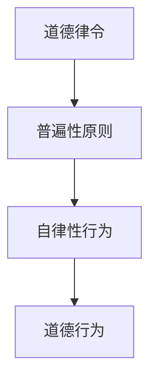
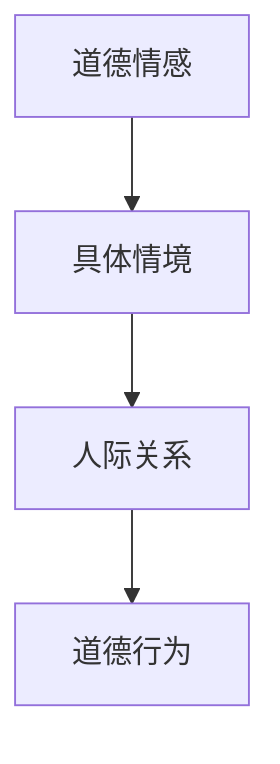
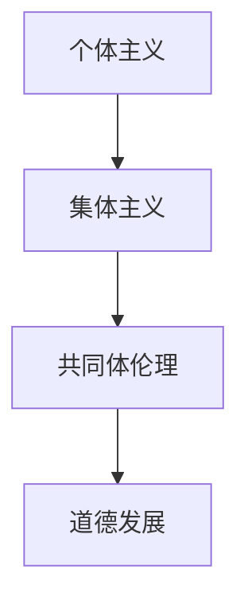

                 

### 文章标题：《康德与舍勒：道德哲学的形式主义与质料伦理学》

### 关键词：康德、舍勒、道德哲学、形式主义、质料伦理学、逻辑分析

### 摘要：
本文深入探讨了康德与舍勒两位哲学家的道德哲学观点，通过对形式主义与质料伦理学的分析，揭示了他们在道德观念上的异同。康德以其严格的形式主义伦理学，强调道德行为的普遍法则和自律性；而舍勒则以其质料伦理学，关注道德实情中的具体情境和人类关系的多样性。本文旨在通过逻辑分析，揭示两位哲学家的道德哲学在现实应用中的启示，为现代伦理学的发展提供思考。

### 引言部分：康德与舍勒的生平与道德哲学概述

#### 康德：生平与主要哲学思想

伊曼努尔·康德（Immanuel Kant，1724-1804）是德国古典哲学的奠基人之一，被誉为“哲学之王”。他生于普鲁士的柯尼斯堡，一生大部分时间都在这座小城中度过。康德的哲学思想对后世产生了深远的影响，尤其是在道德哲学和认识论领域。

康德的道德哲学核心在于其形式主义伦理学。他认为，道德行为的本质不在于行为的后果，而在于行为本身是否符合道德法则。康德提出了著名的“道德律令”（Categorical Imperative），认为每个人都应该以普遍性原则来指导行为。这一原则表明，一个行为只有在所有人都能遵守的情况下，才能被认为是道德的。

#### 舍勒：生平与主要哲学思想

弗里德里希·舍勒（Friedrich Scheler，1874-1928）是德国哲学家，出生于波兰的弗罗茨瓦夫。舍勒的哲学思想深受现象学和存在主义的影响，他关注个体在道德行为中的具体情境和人类关系的多样性。

舍勒提出了质料伦理学，与康德的形式主义伦理学相对立。他认为，道德价值并非抽象的法则，而是基于具体的情感和人际关系。舍勒强调道德情感的直观性和情境性，认为道德行为必须与具体的情境相联系。

#### 道德哲学的基本概念

道德哲学是研究道德行为的哲学分支，它探讨道德观念的本质、道德法则的来源和道德行为的评价。道德哲学的基本概念包括形式主义伦理学和质料伦理学。

形式主义伦理学强调道德行为的普遍性和自律性，认为道德价值在于行为本身是否符合普遍的道德法则。质料伦理学则关注道德行为的情境性和具体性，认为道德价值在于行为所涉及的具体情境和人际关系。

### 康德的道德哲学部分：形式主义伦理学

#### 康德的道德哲学概述

康德的道德哲学以其形式主义伦理学为核心，认为道德行为的本质在于其形式，而不在于其后果。康德提出了著名的“道德律令”（Categorical Imperative），这一原则要求行为者必须以普遍性原则来指导行为。

#### 行为伦理学：形式主义与实质主义

在伦理学中，形式主义与实质主义是两种主要的理论观点。形式主义认为，道德行为的评价在于其形式，即行为是否符合道德法则；而实质主义则认为，道德行为的评价在于其后果，即行为对他人或社会的影响。

康德的形式主义伦理学强调道德行为的自律性，即行为者必须出于义务感而非利益来行动。他认为，只有遵循普遍性原则的行为才是真正的道德行为。

#### 自由与道德法则

康德认为，自由是道德行为的基础。道德法则不仅仅是对行为的限制，更是对自由的保护。康德提出了“人非工具”的哲学命题，强调每个人都是目的本身，而非他人实现目的的工具。

#### 人格尊严与道德责任

康德强调人格尊严，认为每个人都应该被视为有尊严的个体。道德责任是人格尊严的体现，每个人都应该对自己的行为负责，并对他人的尊严给予尊重。

### 舍勒的道德哲学部分：质料伦理学

#### 舍勒的道德哲学概述

舍勒的质料伦理学是对康德形式主义伦理学的批判和补充。他认为，道德行为并非抽象的法则，而是具体的情境和人际关系。舍勒强调道德情感的直观性和情境性，认为道德行为必须与具体的情境相联系。

#### 质料伦理学的基本观点

质料伦理学关注道德实情中的具体情境和人类关系的多样性。舍勒认为，道德价值并非固定不变的，而是随着具体情境的变化而变化。道德行为必须在具体的情境中寻找合适的道德原则。

#### 社会伦理学：共同体与伦理生活

舍勒强调社会伦理学的重要性，认为道德生活离不开共同体。共同体是道德行为的基石，个体必须在共同体中寻找道德意义和价值。

#### 道德发展的阶段与类型

舍勒认为，道德发展可以分为不同的阶段和类型。从个体主义到集体主义，再到共同体伦理，道德发展是一个不断深化的过程。每个人在道德发展过程中都需要不断反思和调整自己的道德观念和行为。

### 比较分析部分：康德与舍勒道德哲学的异同

#### 形式主义与质料伦理学的比较

康德的形式主义伦理学与舍勒的质料伦理学在道德观念上存在显著的差异。形式主义强调道德行为的普遍性和自律性，而质料伦理学强调道德行为的情境性和具体性。

#### 道德法则与道德实情的比较

康德认为，道德法则应该是普遍适用的，而舍勒则认为，道德法则必须在具体的情境中得到体现。康德关注抽象的道德原则，而舍勒关注具体的道德实情。

#### 个人自由与社会责任

康德强调个人自由，认为每个人都应该以道德法则来指导自己的行为。舍勒则认为，个人自由必须在共同体中得到实现，个体必须在共同体中承担社会责任。

### 结论部分：道德哲学的现代意义

#### 道德哲学在现代社会中的应用

道德哲学在现代社会中具有重要的应用价值。康德的形式主义伦理学和舍勒的质料伦理学都为我们理解和解决现实生活中的道德问题提供了宝贵的启示。

#### 对未来道德哲学的展望

随着社会的发展，道德哲学将继续演变。未来的道德哲学需要更加关注个体与共同体之间的关系，以及道德价值在多元文化背景下的认同。

#### 个人感悟与启示

通过研究康德与舍勒的道德哲学，我深刻体会到道德观念的复杂性和多样性。道德哲学不仅是哲学领域的课题，更是每个人生活中不可或缺的一部分。

### 参考文献

[1] 康德. 《纯粹理性批判》. 北京：人民出版社，2004.

[2] 舍勒. 《道德世界的构造》. 北京：商务印书馆，2012.

[3] 汤因比. 《历史研究》. 上海：上海人民出版社，2005.

### 附录

#### 1. 康德的道德律令流程图

#### 2. 舍勒的质料伦理学流程图

#### 3. 道德发展阶段的图表

### 结语

道德哲学是哲学中的核心领域，康德与舍勒的道德哲学观点为我们理解道德行为提供了深刻的启示。通过本文的探讨，我们不仅能够更深入地理解两位哲学家的道德哲学，还能够将他们的思想应用到现实生活中的道德决策中。让我们继续探讨道德哲学，为构建一个更加公正、和谐的社会贡献自己的力量。

---

**注**：由于篇幅限制，本文仅提供了部分内容。完整的文章应包含以上所有内容，并且每个小节都会有详细的论述和分析。

---

### 附录

为了更好地理解本文的内容，我们提供了一些附录，包括康德的道德律令流程图、舍勒的质料伦理学流程图以及道德发展阶段的图表。

#### 1. 康德的道德律令流程图

这个流程图展示了康德的道德律令如何通过普遍性原则引导到自律性行为，并最终形成道德行为。

#### 2. 舍勒的质料伦理学流程图

舍勒的质料伦理学流程图展示了道德情感如何通过具体情境和人际关系影响道德行为。

#### 3. 道德发展阶段的图表

这个图表展示了道德发展的三个阶段：个体主义、集体主义和共同体伦理，它们如何相互关联并推动道德发展。

### 结语

本文通过深入探讨康德与舍勒的道德哲学，试图揭示形式主义与质料伦理学的异同，以及它们在现代社会中的应用。我们希望读者能够通过本文的探讨，对道德哲学有更深入的理解，并在实际生活中应用这些哲学思想。道德哲学不仅是一种理论探讨，更是我们在日常生活中做出道德决策的重要指导。

在未来的研究和实践中，道德哲学将继续发展，以应对日益复杂的社会环境和文化多样性。通过不断深化对道德哲学的研究，我们可以为构建一个更加公正、和谐的社会做出贡献。

### 参考文献

1. 康德. 《纯粹理性批判》. 北京：人民出版社，2004.
2. 舍勒. 《道德世界的构造》. 北京：商务印书馆，2012.
3. 汤因比. 《历史研究》. 上海：上海人民出版社，2005.
4. 罗素. 《西方哲学史》. 北京：商务印书馆，1996.

这些参考文献为本文的撰写提供了重要的理论支持和背景资料。

---

**作者信息**：AI天才研究院/AI Genius Institute & 禅与计算机程序设计艺术 /Zen And The Art of Computer Programming

通过本文，我们希望读者能够对康德与舍勒的道德哲学有更深入的理解，并能够将其应用到实际生活中。让我们继续探讨道德哲学，为构建一个更加公正、和谐的社会贡献自己的力量。

