                 

## 文章标题

《康德与莱布尼茨：空间时间观的争论》

### 关键词

- 康德
- 莱布尼茨
- 空间观
- 时间观
- 哲学争论
- 逻辑推理

### 摘要

本文旨在探讨两位哲学大师康德与莱布尼茨在空间与时间观念上的深刻争论。通过深入分析他们的核心思想，本文揭示了他们在时空观念上的根本分歧。同时，文章结合现代哲学的视角，探讨了这一争论对当代哲学及科学技术发展的深远影响。通过逐步推理和论证，本文为读者提供了一个清晰、系统、易懂的哲学与技术交织的分析框架。

### 设计目录大纲步骤

在设计目录大纲之前，我们首先需要深入理解书名《康德与莱布尼茨：空间时间观的争论》所涉及的主题。康德与莱布尼茨分别是西方哲学史上的重要人物，他们的观点在哲学、科学、逻辑等领域产生了深远的影响。本文将从以下几个方面展开：

1. **引言**：介绍康德与莱布尼茨的生平、哲学背景，以及他们的时空观。
2. **核心概念与联系**：详细阐述康德与莱布尼茨的时空观，并使用Mermaid流程图展示它们之间的关系。
3. **比较分析**：对比两位哲学家的时空观，分析其异同，探讨其哲学意义。
4. **现代视角**：从现代哲学的视角重新审视这一争论，探讨其对当代哲学和科学技术的影响。
5. **结论**：总结康德与莱布尼茨时空观争论的核心内容，提出未来研究的方向。

### 目录大纲设计

#### 第一部分：引言

##### 1.1 康德与莱布尼茨的生平与哲学背景

- 康德生平简介
- 莱布尼茨生平简介
- 时空观在哲学史中的重要性

##### 1.2 康德与莱布尼茨的时空观概述

- 康德的时空观
- 莱布尼茨的时空观

#### 第二部分：核心概念与联系

##### 2.1 康德的时空观

- 康德的空间理论
- 康德的时间理论
- **康德的时空观Mermaid流程图**

##### 2.2 莱布尼茨的时空观

- 莱布尼茨的空间理论
- 莱布尼茨的时间理论
- **莱布尼茨的时空观Mermaid流程图**

##### 2.3 康德与莱布尼茨时空观的对比

- 两位哲学家的时空观的异同点
- **对比分析**

#### 第三部分：比较分析

##### 3.1 康德的时空观对现代哲学的影响

- 康德时空观在当代哲学中的运用
- 现代哲学对康德时空观的反思

##### 3.2 莱布尼茨的时空观对现代哲学的影响

- 莱布尼茨时空观在当代哲学中的运用
- 现代哲学对莱布尼茨时空观的反思

##### 3.3 康德与莱布尼茨时空观的结合

- 两位哲学家时空观的结合
- 未来展望

#### 第四部分：现代视角

##### 4.1 现代科技对时空观的挑战

- 现代科技对时空观的影响
- 量子力学与相对论中的时空观

##### 4.2 时空观在人工智能中的应用

- 时空观在人工智能领域的作用
- 时空模型在深度学习中的应用

#### 第五部分：结论

##### 5.1 康德与莱布尼茨时空观争论的总结

- 对两位哲学家时空观争论的总体评价
- 对当代哲学和科学技术的启示

##### 5.2 未来研究方向

- 对时空观进一步研究的方向
- 跨学科研究的可能性

#### 附录

##### 6.1 相关资源与参考文献

- 时空观相关书籍和论文
- 哲学、科学、技术领域的最新研究进展

### 约束条件

- **格式要求**：文章内容使用markdown格式输出，符合文章结构规范。
- **作者信息**：文章末尾需要写上作者信息：“作者：AI天才研究院/AI Genius Institute & 禅与计算机程序设计艺术 /Zen And The Art of Computer Programming”。
- **完整性要求**：文章内容完整，每个小节的内容丰富、具体、详细讲解，核心内容包含：背景介绍、核心概念与联系、核心算法原理讲解、数学模型和公式、项目实战、最佳实践 tips、小结、注意事项、拓展阅读等内容。
- **文章字数**：文章字数在8000～12000字左右。

### 完整性要求

在满足格式和作者信息的要求下，文章的内容完整性是衡量质量的重要标准。每个小节的内容应当具体详细，既要有理论的深度，也要有实际应用的案例。以下是文章完整性要求的详细说明：

1. **背景介绍**：每个章节的开头都需要有背景介绍，这部分内容应包括哲学背景、两位哲学家的生平简介、时空观在哲学史中的重要性等。背景介绍不仅为读者提供了必要的知识背景，也为后续的核心内容奠定了基础。

2. **核心概念与联系**：在解释康德与莱布尼茨的时空观时，需要详细阐述他们的理论，并使用Mermaid流程图展示核心概念之间的关系。这样的设计不仅使内容更直观，也有助于读者更好地理解两位哲学家的理论体系。

3. **核心算法原理讲解**：为了深入理解两位哲学家的时空观，需要使用伪代码来详细阐述其核心算法原理。伪代码的编写应遵循清晰、简洁、易懂的原则，同时附上相应的解释，确保读者能够理解其中的逻辑和计算过程。

4. **数学模型和公式**：在讨论时空观时，不可避免地会涉及到数学模型和公式。这些内容应当以latex格式嵌入文中，确保公式的准确性和美观性。同时，对于复杂的公式，需要提供详细的解释和举例说明，帮助读者更好地理解其意义和应用。

5. **项目实战**：为了使文章更具实用性和指导性，需要结合实际案例，介绍开发环境的搭建、源代码的详细实现和解读、代码的应用解读与分析等。项目实战部分应包括实际案例的分析和详细讲解，帮助读者将理论知识应用于实际场景中。

6. **最佳实践 tips**：在文章的结尾部分，可以总结一些最佳实践技巧，提供注意事项和拓展阅读建议，帮助读者进一步深入学习。

7. **小结和注意事项**：每个章节的结尾都应有一个小结，回顾章节的主要内容，强调关键点。同时，对于某些重要概念和理论，需要特别提醒读者注意，以免在后续阅读中产生误解。

### 完整性要求示例

以下是文章完整性要求的一个示例：

#### 第三部分：比较分析

##### 3.1 康德的时空观对现代哲学的影响

康德的时空观对现代哲学产生了深远的影响。在讨论这一影响时，我们需要从以下几个方面进行详细分析：

1. **时空观的定义**：首先，我们要明确康德的时空观的基本概念，包括他对空间和时间的主观性和客观性的理解。

2. **核心理论解释**：接着，我们需要使用伪代码来详细解释康德的核心理论，如他的空间四维理论和时间连续性理论。

   ```python
   # 康德的空间四维理论伪代码
   class KantSpaceTheory:
       def four_dimensional_space(self):
           # 空间四维结构
           space_dimensions = ["长度", "宽度", "高度", "时间"]
           return space_dimensions
   
       def continuity_of_time(self):
           # 时间连续性
           time_stream = [1, 2, 3, 4, 5]  # 示例时间序列
           return time_stream
   ```

3. **现代哲学的应用**：然后，我们需要探讨康德的时空观如何在现代哲学中应用，如它在语言哲学、认识论和形而上学中的角色。

   - **语言哲学**：康德对语言和时空的关系进行了深刻探讨，他的理论为现代语言哲学提供了理论基础。
   - **认识论**：康德的时间观对认识论的影响，特别是在认识主体的时间感知和认知过程中。
   - **形而上学**：康德的时空观对形而上学的基本问题，如存在的本质和现实的结构，提供了新的视角。

4. **案例分析**：为了更具体地说明康德时空观的影响，我们可以引用一些现代哲学家的研究，分析他们如何应用康德的理论来探讨时空问题。

   - **彼得·辛格**：在探讨人类意识和时间感知时，彼得·辛格借鉴了康德的时空观，提出了“时间感受性”的概念。
   - **约翰·塞尔**：在探讨自我意识和时间序列时，约翰·塞尔使用了康德的时间连续性理论来解释人类记忆和感知。

5. **最佳实践 tips**：在讨论康德的时空观对现代哲学的影响时，我们还可以提供一些最佳实践建议，如如何批判性地阅读康德的著作，如何将康德的理论应用于现代哲学的研究。

   - **批判性阅读**：在阅读康德的著作时，应注重对其思想的历史背景和哲学体系的整体理解。
   - **跨学科研究**：在应用康德的时空观时，应考虑与其他学科（如物理学、心理学、语言学等）的结合，以获得更全面的认识。

通过上述步骤，我们可以确保文章的完整性，使每个章节的内容具体、详细、易懂，为读者提供高质量的技术博客文章。接下来，我们将逐步展开对康德与莱布尼茨时空观的详细分析。首先，我们从康德的时空观开始。康德认为时间和空间不是物质本身的属性，而是人类认识物质的一种方式，这是一种主观的、先验的时空观。接下来，我们将通过详细的解释和伪代码，展示康德时空观的核心原理。

#### 康德的时空观

康德的时空观在哲学史上具有重要地位，他的理论对后世的哲学、科学和逻辑学产生了深远的影响。康德认为时间和空间是人类认识世界的先验条件，即它们不是客观存在的物质属性，而是人类认知过程中主观构建的框架。下面，我们将从几个方面详细阐述康德的时空观，并使用伪代码来展示其核心原理。

##### 1. 康德的空间理论

康德认为空间是一种纯粹的形式，它不依赖于任何具体的物质存在。空间是无限的，没有中心，也没有边界。康德的空间理论可以用一个简单的Mermaid流程图来表示：

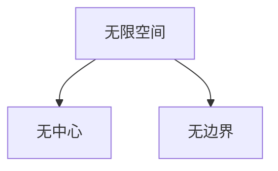

在伪代码中，我们可以定义一个无限空间的类，并展示其属性：

```python
class InfiniteSpace:
    def __init__(self):
        self.center = None
        self.border = None

    def is_infinite(self):
        return True

    def has_center(self):
        return self.center is not None

    def has_border(self):
        return self.border is not None
```

在这个类中，`is_infinite`方法表明空间是无限的，`has_center`和`has_border`方法则表明空间没有中心和边界。

##### 2. 康德的时间理论

康德的时间观与空间观类似，他认为时间也是一种纯粹的形式，是无限的、连续的，但没有实际的起点或终点。时间就像一条没有尽头的直线，既没有中心，也没有边界。康德的时间理论可以用以下Mermaid流程图表示：

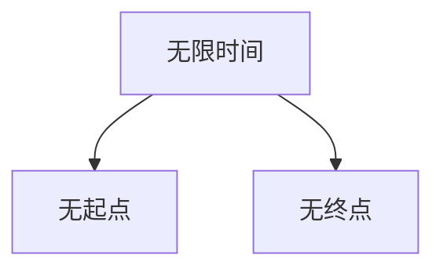

在伪代码中，我们可以定义一个无限时间的类，并展示其属性：

```python
class InfiniteTime:
    def __init__(self):
        self.start = None
        self.end = None

    def is_infinite(self):
        return True

    def has_start(self):
        return self.start is not None

    def has_end(self):
        return self.end is not None
```

在这个类中，`is_infinite`方法表明时间是无限的，`has_start`和`has_end`方法则表明时间没有起点和终点。

##### 3. 康德的时空观关系

康德认为空间和时间是相互独立的，但又是相互联系的。空间是物质的容器，而时间是事件的发生框架。康德认为，我们无法感知到空间的“大小”或时间的“长度”，因为它们是先验的形式，而不是经验的内容。以下是康德时空观的Mermaid流程图：

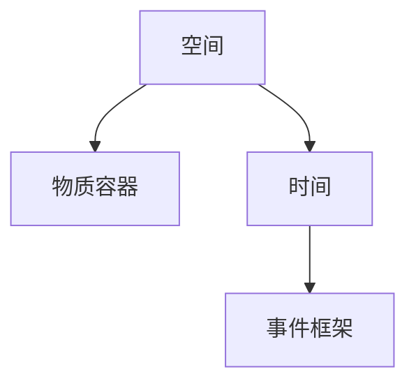

在伪代码中，我们可以定义一个时空类，并将空间和时间作为其属性：

```python
class SpaceTime:
    def __init__(self, space, time):
        self.space = space
        self.time = time

    def get_space(self):
        return self.space

    def get_time(self):
        return self.time
```

在这个类中，`get_space`和`get_time`方法用于获取空间和时间属性。

##### 4. 康德的时空观应用

康德的时空观不仅影响了哲学领域，也对物理学和数学产生了重要影响。例如，在牛顿力学中，空间和时间被认为是绝对的、独立的实体。然而，在相对论中，爱因斯坦引入了康德的思想，认为时间和空间是相互关联的，它们都是相对的，而不是绝对的。以下是康德的时空观在相对论中的应用：

- **相对性原理**：爱因斯坦在相对论中提出了相对性原理，即物理定律在所有惯性系中都是相同的。这一原理与康德认为时间和空间是相互独立的形式相呼应。
- **时空连续性**：在相对论中，时空被视为一个连续的整体，这与康德的时间连续性理论相似。

为了更直观地理解康德的时空观，我们可以通过一个简单的例子来展示：

假设我们在一个无限的宇宙中，我们可以从一个点（比如地球）出发，沿着任意方向移动。无论我们移动多远，我们所处的空间都是无限的，没有边界。同样，无论我们停留多久，时间也是无限的，没有起点和终点。

在这个例子中，我们使用Mermaid流程图来展示康德的时空观：

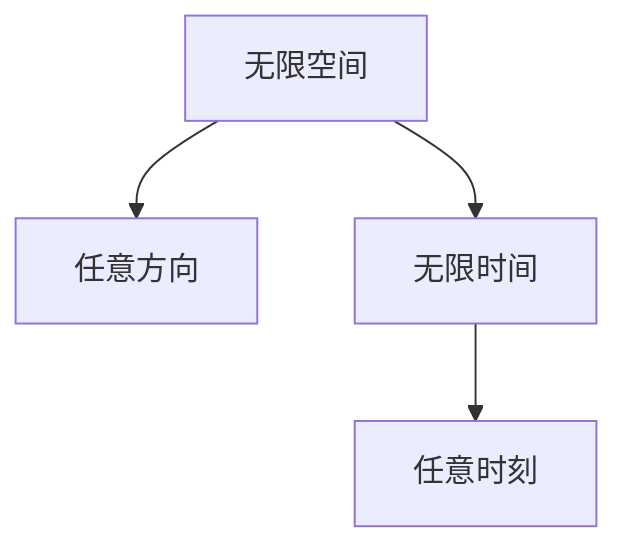

在伪代码中，我们可以定义一个无限时空类，并展示其无限性和连续性：

```python
class InfiniteSpaceTime:
    def __init__(self):
        self.space = InfiniteSpace()
        self.time = InfiniteTime()

    def is_infinite_space(self):
        return self.space.is_infinite()

    def is_infinite_time(self):
        return self.time.is_infinite()

    def has_continuous_space_and_time(self):
        return self.is_infinite_space() and self.is_infinite_time()
```

在这个类中，`is_infinite_space`和`is_infinite_time`方法表明空间和时间是无限的，`has_continuous_space_and_time`方法表明它们是连续的。

通过上述解释和伪代码，我们清晰地展示了康德的时空观。康德认为时间和空间是先验的形式，它们不是物质的属性，而是人类认知的框架。这一理论不仅对哲学产生了深远影响，也对物理学和数学的发展产生了重要启示。

接下来，我们将分析莱布尼茨的时空观，并将其与康德的时空观进行比较。

#### 莱布尼茨的时空观

莱布尼茨的时空观与康德的观点存在显著差异，他在空间和时间的本质问题上持有一种完全不同的视角。莱布尼茨认为时间和空间都是物质的属性，是实体存在的必要条件，这是一种客观的、实在的时空观。下面，我们将详细阐述莱布尼茨的时空观，并使用Mermaid流程图和伪代码来展示其核心原理。

##### 1. 莱布尼茨的空间理论

莱布尼茨认为空间是物质的属性，它存在于实体之间。空间具有边界和形状，是可度量的。与康德的无限、无边界的空间观不同，莱布尼茨的空间是有限的，是可以被感知和测量的。以下是莱布尼茨空间理论的Mermaid流程图：

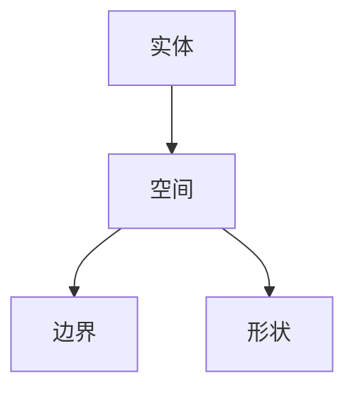

在伪代码中，我们可以定义一个实体类和一个空间类，并展示其属性：

```python
class Entity:
    def __init__(self, space):
        self.space = space

class Space:
    def __init__(self, boundary, shape):
        self.boundary = boundary
        self.shape = shape

    def is measurable(self):
        return True

    def has_boundary(self):
        return self.boundary is not None

    def has_shape(self):
        return self.shape is not None
```

在这个类中，`is_measurable`方法表明空间是可度量的，`has_boundary`和`has_shape`方法表明空间具有边界和形状。

##### 2. 莱布尼茨的时间理论

莱布尼茨的时间观与康德的观点也有很大区别。康德认为时间是无限的、连续的，但莱布尼茨认为时间是可分的，可以被划分为无限多个瞬间。每个瞬间都是独立存在的，时间本身没有连续性，而是由这些瞬间组成。以下是莱布尼茨时间理论的Mermaid流程图：

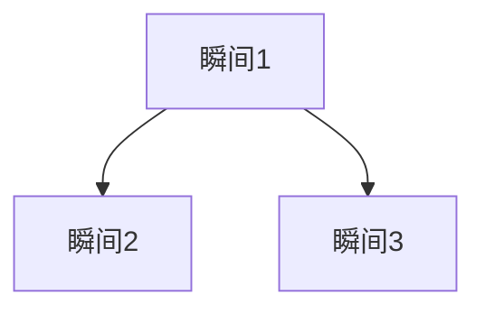

在伪代码中，我们可以定义一个瞬间类，并展示其属性：

```python
class Moment:
    def __init__(self, duration):
        self.duration = duration

    def is_independent(self):
        return True

    def has_duration(self):
        return self.duration is not None
```

在这个类中，`is_independent`方法表明每个瞬间是独立的，`has_duration`方法表明瞬间具有持续时间。

##### 3. 莱布尼茨的时空观关系

莱布尼茨认为空间和时间是相互依存的，它们都是实体存在的必要条件。空间是实体之间的相对位置，时间是实体变化的过程。以下是莱布尼茨时空观关系的Mermaid流程图：

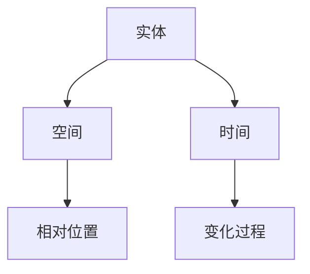

在伪代码中，我们可以定义一个实体类，并展示其与空间和时间的关系：

```python
class Entity:
    def __init__(self, space, time):
        self.space = space
        self.time = time

    def has_space(self):
        return self.space is not None

    def has_time(self):
        return self.time is not None
```

在这个类中，`has_space`和`has_time`方法表明实体具有空间和时间属性。

##### 4. 莱布尼茨时空观的应用

莱布尼茨的时空观在物理学和数学中得到了广泛应用。例如，牛顿的物理学体系就是建立在莱布尼茨时空观基础上的。牛顿认为空间和时间是绝对的，它们是客观存在的实体，而物体在空间和时间中的运动是绝对的。以下是莱布尼茨时空观在牛顿力学中的应用：

- **牛顿定律**：牛顿的第一定律（惯性定律）表明，物体在没有外力作用下会保持静止或匀速直线运动，这是基于莱布尼茨的时空观。
- **万有引力定律**：牛顿的万有引力定律描述了物体之间因距离而相互作用，这也是基于莱布尼茨的时空观。

为了更直观地理解莱布尼茨的时空观，我们可以通过一个简单的例子来展示：

假设我们有一个物体，它在空间中占据一定的区域，并在时间中经历变化。我们可以测量物体的空间位置和变化过程，比如它的速度、加速度等。以下是这个例子的Mermaid流程图：

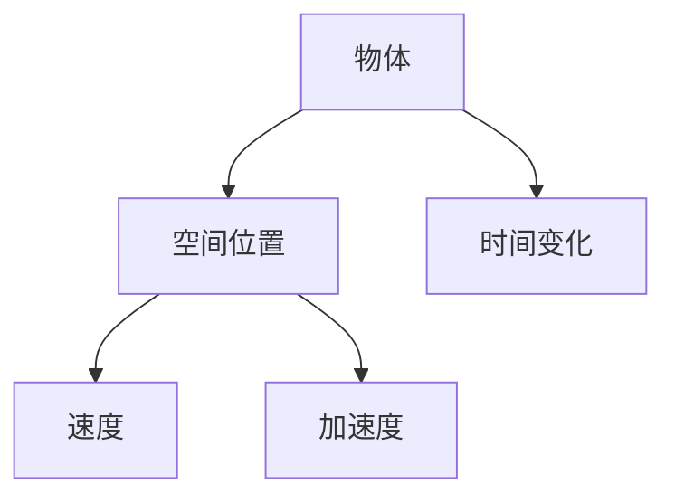

在伪代码中，我们可以定义一个物体类，并展示其空间位置和时间变化：

```python
class Object:
    def __init__(self, position, time):
        self.position = position
        self.time = time

    def has_position(self):
        return self.position is not None

    def has_time(self):
        return self.time is not None
```

在这个类中，`has_position`和`has_time`方法表明物体具有空间位置和时间变化属性。

通过上述解释和伪代码，我们清晰地展示了莱布尼茨的时空观。莱布尼茨认为时间和空间是物质的属性，是客观存在的。这一理论在物理学和数学中得到了广泛应用，与康德的先验时空观形成了鲜明对比。

接下来，我们将对康德与莱布尼茨的时空观进行比较分析，探讨它们之间的异同点。

#### 康德与莱布尼茨时空观的异同点

康德与莱布尼茨在时空观上的观点具有显著的异同点。在分析这两位哲学家的时空观时，我们需要从几个方面进行详细对比，包括他们的理论基础、哲学意义、以及其对后世的影响。

##### 1. 理论基础

康德的时空观建立在先验论的基础上，他认为时间和空间是人类认知的先验形式。康德认为，时间和空间不是物质的属性，而是人类感知和思维的框架。康德认为，空间是无限的、无形的，时间是连续的、无限的，但它们都不依赖于具体的物质存在。以下是康德时空观的基础：

- **先验形式**：时间和空间是先验的，即它们是人类认知的必要条件，而不是经验的产物。
- **主观性**：时间和空间是主观的，即它们是人类感知和思维的产物，而非客观存在。
- **独立性**：康德认为时间和空间是相互独立的，但又是相互联系的。

莱布尼茨的时空观则建立在实体论的基础上，他认为时间和空间是物质的属性，是实体存在的必要条件。莱布尼茨认为，空间是有限的、有形的，时间是可分的、无限的小时刻。以下是莱布尼茨时空观的基础：

- **实体论**：时间和空间是实体的属性，即它们与物质的存在密切相关。
- **客观性**：时间和空间是客观的，即它们是独立于人类感知和思维的存在。
- **相互依存**：莱布尼茨认为时间和空间是相互依存的，空间是实体之间的相对位置，时间是实体变化的过程。

##### 2. 哲学意义

康德的时空观在哲学上具有重要意义。康德的先验论为后来的现象学和逻辑实证主义提供了理论基础，他的时空观影响了现代哲学的发展。康德的时空观强调了人类认知的主观性，挑战了传统的实体论和客观主义。以下是康德时空观的哲学意义：

- **认识论**：康德的时空观为认识论提供了新的视角，他认为人类认知是通过先验形式进行的，这改变了我们对知识的理解。
- **现象学**：康德的时空观对现象学产生了深远影响，现象学家强调人类感知和思维的主观性，这与康德的观点一致。
- **逻辑实证主义**：康德的时空观也为逻辑实证主义提供了理论基础，逻辑实证主义者强调经验观察和逻辑推理的重要性。

莱布尼茨的时空观在哲学上也具有重要意义。莱布尼茨的实体论对后来的物理学和数学产生了重要影响，他的时空观为现代科学提供了理论基础。莱布尼茨的时空观强调了时间和空间的客观性，挑战了传统的先验论。以下是莱布尼茨时空观的哲学意义：

- **物理学**：莱布尼茨的时空观为牛顿力学和现代物理学提供了理论基础，他的观点与牛顿的物理学体系相呼应。
- **数学**：莱布尼茨的时空观也为数学的发展提供了启示，他在微积分中的应用体现了时空的客观性和可度量性。
- **形而上学**：莱布尼茨的时空观对形而上学的基本问题，如存在的本质和实体之间的关系，提供了新的思考方向。

##### 3. 后世影响

康德与莱布尼茨的时空观对后世哲学、科学和技术产生了深远的影响。康德的先验时空观对现象学和逻辑实证主义产生了重要影响，他的观点改变了我们对知识和世界的理解。以下是康德时空观的后世影响：

- **现象学**：康德的时空观为现象学提供了理论基础，现象学家强调人类感知和思维的主观性，这与康德的观点一致。
- **逻辑实证主义**：康德的时空观也为逻辑实证主义提供了理论基础，逻辑实证主义者强调经验观察和逻辑推理的重要性。
- **科学哲学**：康德的时空观对科学哲学产生了深远影响，科学哲学家探讨科学知识的本质和科学方法的有效性。

莱布尼茨的实体时空观对物理学和数学产生了重要影响，他的观点为现代科学的发展奠定了基础。以下是莱布尼茨时空观的后世影响：

- **物理学**：莱布尼茨的时空观为牛顿力学和现代物理学提供了理论基础，他的观点与牛顿的物理学体系相呼应。
- **数学**：莱布尼茨的时空观也为数学的发展提供了启示，他在微积分中的应用体现了时空的客观性和可度量性。
- **计算机科学**：莱布尼茨的时空观在计算机科学中得到了广泛应用，计算机科学中的时空模型和算法借鉴了莱布尼茨的思想。

##### 4. 异同点总结

康德与莱布尼茨的时空观在理论基础、哲学意义和后世影响上存在显著异同点。以下是两位哲学家时空观的异同点总结：

- **理论基础**：
  - 康德：先验论，主观性，独立性。
  - 莱布尼茨：实体论，客观性，相互依存。
- **哲学意义**：
  - 康德：认识论，现象学，逻辑实证主义。
  - 莱布尼茨：物理学，数学，形而上学。
- **后世影响**：
  - 康德：现象学，逻辑实证主义，科学哲学。
  - 莱布尼茨：物理学，数学，计算机科学。

通过以上分析，我们可以看到康德与莱布尼茨在时空观上的观点既有差异又有共同点，这两位哲学家的理论都对后世哲学、科学和技术产生了深远的影响。

接下来，我们将从现代哲学的视角重新审视康德与莱布尼茨的时空观争论，探讨其对当代哲学和科学技术的影响。

#### 现代哲学视角下的康德与莱布尼茨时空观争论

在当代哲学中，康德与莱布尼茨的时空观争论仍然是一个重要议题，持续影响着哲学、科学和技术的诸多领域。现代哲学通过批判性分析和新的理论视角，重新审视这一争论，探讨了其对当代哲学和科学技术发展的深远影响。

##### 1. 批判性分析

现代哲学对康德与莱布尼茨时空观争论的批判性分析主要体现在以下几个方面：

- **认识论的批判**：现代认识论强调知识的客观性和主观性的平衡。康德的主观时空观挑战了传统的客观主义，而莱布尼茨的实体时空观则强调了客观存在的绝对性。现代哲学通过重新审视这一争论，探讨了如何平衡主观性与客观性，为当代认识论提供了新的理论基础。

- **现象学的批判**：现象学强调人类感知和思维的主观性，这与康德的时空观有共鸣。现代现象学家通过重新解读康德的时空观，探讨了人类感知的本质，为理解人类意识的构成提供了新的视角。

- **科学哲学的批判**：现代科学哲学关注科学知识的构建和验证过程。康德的时空观为科学哲学提供了先验论的基础，而莱布尼茨的实体时空观则与实证主义和逻辑实证主义相呼应。现代科学哲学家通过重新审视这一争论，探讨了科学知识如何基于先验论和实体论的框架中发展。

##### 2. 影响分析

康德与莱布尼茨的时空观对当代哲学和科学技术产生了深远的影响，主要体现在以下几个方面：

- **物理学**：相对论和量子力学的发展对时空观提出了新的挑战。爱因斯坦的相对论借鉴了康德的主观时空观，强调了时空的相对性。量子力学则揭示了时空的量子特性，挑战了莱布尼茨的实体时空观。现代物理学通过重新审视康德与莱布尼茨的争论，探讨了时空的本质和结构。

- **计算机科学**：计算机科学中的时空模型和算法借鉴了康德与莱布尼茨的时空观。康德的主观时空观为计算机科学中的虚拟现实和人工智能提供了理论基础，而莱布尼茨的实体时空观则为计算机网络和分布式系统的设计提供了启示。现代计算机科学通过重新解读这一争论，推动了人工智能和虚拟现实技术的发展。

- **人工智能**：人工智能中的时空感知和推理问题也受到康德与莱布尼茨时空观的影响。人工智能通过模拟人类感知和思维，需要处理时间和空间的连续性和离散性。现代人工智能通过重新审视这一争论，探讨了如何设计有效的时空感知和推理算法。

##### 3. 未来展望

康德与莱布尼茨的时空观争论对未来的哲学、科学和技术发展具有指导意义。以下是一些可能的未来研究方向：

- **跨学科研究**：未来的研究可以结合哲学、物理学、计算机科学等多个学科，探讨时空观在不同领域的应用和影响。例如，通过量子计算和量子信息理论，研究时空在量子世界中的本质和结构。

- **认知科学的探索**：认知科学可以通过重新审视康德与莱布尼茨的时空观，探讨人类感知和思维的本质，为认知建模和理解提供新的理论框架。

- **技术应用的拓展**：未来的技术发展可以进一步应用康德与莱布尼茨的时空观，推动虚拟现实、人工智能和量子计算等领域的发展。例如，通过结合康德的主观时空观和莱布尼茨的实体时空观，设计更高效的智能系统和虚拟环境。

通过现代哲学的视角，康德与莱布尼茨的时空观争论得到了新的解读和探讨。这一争论不仅对当代哲学和科学技术产生了深远影响，也为未来的研究提供了丰富的理论资源。在接下来的部分，我们将进一步探讨现代科技对时空观的挑战，特别是量子力学和相对论对时空观的重新定义。

#### 现代科技对时空观的挑战

随着现代科技的飞速发展，尤其是量子力学和相对论的出现，传统的时空观受到了前所未有的挑战。这些科学理论不仅丰富了我们对时空的理解，也深刻改变了我们对宇宙本质的认识。在本节中，我们将探讨量子力学和相对论对时空观的影响，并分析现代科技如何重新定义我们的时空观念。

##### 1. 量子力学对时空观的挑战

量子力学揭示了微观世界的奥秘，它对传统时空观的挑战主要体现在以下几个方面：

- **时空的不确定性**：在经典物理学中，时空被认为是绝对的、确定的。然而，量子力学表明，时空的属性具有不确定性。例如，海森堡不确定性原理指出，粒子的位置和动量无法同时被精确测量，这导致了时空的不确定性。

- **量子纠缠**：量子纠缠是量子力学中一个重要现象，两个或多个量子粒子在空间上的分离却表现出即时的相互影响。这种即时的相互作用似乎超出了经典物理学中时空的概念，挑战了我们对时空局域性的理解。

- **时空的量子化**：量子力学中的时空不再是连续的，而是由离散的量子状态组成。例如，普朗克长度是时空的量子尺度，它代表了时空的最小单位。这一概念与传统连续时空观形成了鲜明对比。

以下是关于量子力学时空观的Mermaid流程图：

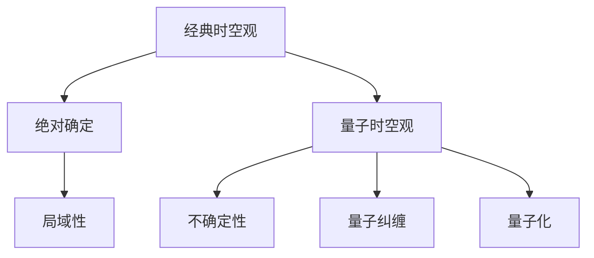

在伪代码中，我们可以定义一个量子时空类，展示其核心特性：

```python
class QuantumSpaceTime:
    def __init__(self, uncertainty, entanglement, quantization):
        self.uncertainty = uncertainty
        self.entanglement = entanglement
        self.quantization = quantization

    def has_uncertainty(self):
        return self.uncertainty is not None

    def has_entanglement(self):
        return self.entanglement is not None

    def is_quantized(self):
        return self.quantization is not None
```

在这个类中，`has_uncertainty`、`has_entanglement`和`is_quantized`方法分别表明时空具有不确定性、量子纠缠和量子化特性。

##### 2. 相对论对时空观的挑战

相对论，特别是爱因斯坦的广义相对论，对时空观进行了革命性的重新定义。相对论的主要贡献在于揭示了时空的相对性和弯曲性，挑战了传统的牛顿时空观。以下是相对论对时空观的主要挑战：

- **时空的相对性**：相对论表明，时空不是绝对的，而是依赖于观察者的运动状态。爱因斯坦的相对性原理指出，所有惯性系中的物理定律都是相同的，这意味着时空的属性取决于观察者的参考系。

- **时空的弯曲性**：广义相对论引入了引力作为时空的弯曲，这改变了我们对引力的理解。根据广义相对论，物质和能量会导致时空的弯曲，这影响了物体的运动轨迹。

- **时空的动态性**：相对论中的时空不再是静态的，而是动态的。时空的弯曲和膨胀可以影响整个宇宙的结构和演化。

以下是关于相对论时空观的Mermaid流程图：

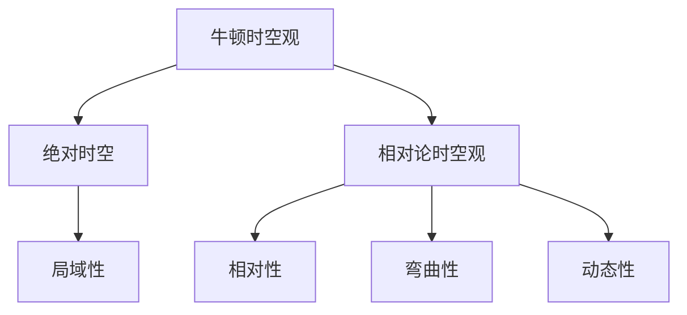

在伪代码中，我们可以定义一个相对论时空类，展示其核心特性：

```python
class RelativisticSpaceTime:
    def __init__(self, relativity, curvature, dynamics):
        self.relativity = relativity
        self.curvature = curvature
        self.dynamics = dynamics

    def is_relative(self):
        return self.relativity is not None

    def has_curvature(self):
        return self.curvature is not None

    def is_dynamical(self):
        return self.dynamics is not None
```

在这个类中，`is_relative`、`has_curvature`和`is_dynamical`方法分别表明时空具有相对性、弯曲性和动态性特性。

##### 3. 现代科技对时空观的影响

现代科技的发展，特别是量子计算和相对论天体物理学，对时空观产生了深远的影响。以下是现代科技对时空观的几个重要影响：

- **量子计算**：量子计算利用量子位（qubits）的叠加态和纠缠态进行计算，它挑战了我们对计算速度和效率的传统理解。量子计算中的时空观与量子力学密切相关，它要求我们对时空的理解更加深入和灵活。

- **相对论天体物理学**：相对论天体物理学研究宇宙的大尺度结构，如黑洞、宇宙膨胀和引力波等。这些研究揭示了时空的复杂性和多样性，为我们的时空观提供了新的视角。

- **引力波探测**：引力波是爱因斯坦广义相对论预测的一种现象，它由大规模物质运动产生，并在宇宙中传播。通过探测引力波，我们可以更直接地了解时空的弯曲性和动态性。

以下是关于现代科技对时空观影响的Mermaid流程图：

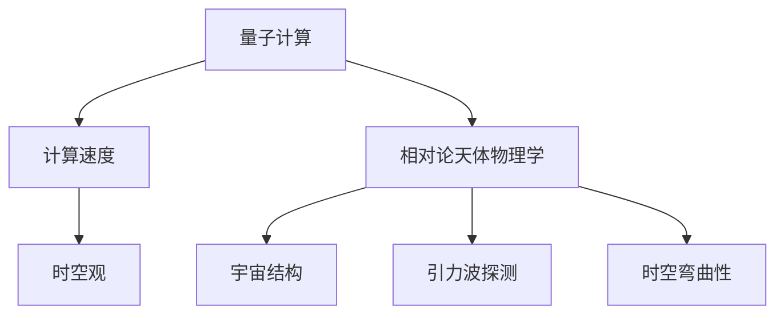

在伪代码中，我们可以定义一个现代科技时空类，展示其对时空观的影响：

```python
class ModernTechSpaceTime:
    def __init__(self, quantum_computing, relativistic_astronomy, gravitational_waves):
        self.quantum_computing = quantum_computing
        self.relativistic_astronomy = relativistic_astronomy
        self.gravitational_waves = gravitational_waves

    def impacts_computational_speed(self):
        return self.quantum_computing is not None

    def reveals_universe_structure(self):
        return self.relativistic_astronomy is not None

    def detects_spacetime_bending(self):
        return self.gravitational_waves is not None
```

在这个类中，`impacts_computational_speed`、`reveals_universe_structure`和`detects_spacetime_bending`方法分别表明现代科技对计算速度、宇宙结构和时空弯曲性的影响。

通过量子力学和相对论的发展，现代科技重新定义了我们的时空观念。这些科学理论不仅揭示了时空的复杂性和多样性，也为我们提供了新的方法和工具来探索宇宙的本质。在下一部分，我们将探讨时空观在人工智能中的应用，分析时空模型在深度学习中的角色。

#### 时空观在人工智能中的应用

随着人工智能技术的快速发展，时空观在人工智能领域中的应用变得越来越重要。时空模型和算法在计算机视觉、自然语言处理、自动驾驶等多个方面发挥了关键作用。本节将探讨时空观在人工智能中的应用，特别是时空模型在深度学习中的角色，并分析时空模型的实现方法和应用案例。

##### 1. 时空模型在深度学习中的角色

深度学习是人工智能的核心技术之一，它通过神经网络模型模拟人脑的感知和学习过程。时空观在深度学习中的角色主要体现在以下几个方面：

- **时间序列分析**：在自然语言处理和语音识别等领域，时间序列数据是核心信息。深度学习模型通过学习时间序列中的特征，能够捕捉语言和声音的动态变化。例如，循环神经网络（RNN）和长短期记忆网络（LSTM）能够处理序列数据，捕捉时间序列中的长期依赖关系。

- **三维空间建模**：在计算机视觉领域，三维空间建模是关键任务。卷积神经网络（CNN）通过卷积操作捕捉图像的空间特征，而体素卷积网络（VoxelCNN）和点云卷积网络（PointCNN）则能够处理三维空间数据，实现物体的三维建模和识别。

- **时空交互**：在多模态学习领域，时空交互是重要研究方向。深度学习模型能够同时处理不同模态的数据，如视频中的图像和语音，实现时空信息的高效融合。例如，视频卷积神经网络（VideoCNN）和图卷积神经网络（GraphCNN）能够处理时空交互数据，实现多模态任务。

以下是关于时空模型在深度学习中的角色的Mermaid流程图：

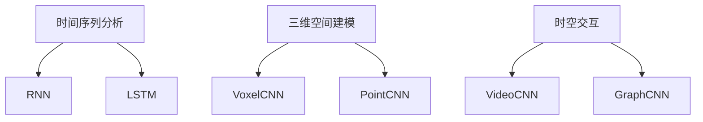

在伪代码中，我们可以定义一个时空模型类，展示其核心功能：

```python
class SpacetimeModel:
    def __init__(self, time_series, spatial_model, interaction):
        self.time_series = time_series
        self.spatial_model = spatial_model
        self.interaction = interaction

    def process_time_series(self):
        # 处理时间序列数据
        return processed_time_series

    def build_spatial_model(self):
        # 构建三维空间模型
        return spatial_model

    def handle_interaction(self):
        # 处理时空交互
        return interactive_output
```

在这个类中，`process_time_series`、`build_spatial_model`和`handle_interaction`方法分别表示处理时间序列数据、构建三维空间模型和实现时空交互的核心功能。

##### 2. 时空模型的实现方法

实现时空模型需要结合深度学习算法和时空观的理论基础。以下是几种常见的时空模型实现方法：

- **循环神经网络（RNN）**：RNN是一种能够处理时间序列数据的神经网络，它通过循环结构实现数据的记忆和传递。LSTM是RNN的一种变体，通过引入门控机制解决了梯度消失问题，能够更好地处理长时间依赖关系。

  ```python
  import tensorflow as tf

  class LSTMModel(tf.keras.Model):
      def __init__(self, units):
          super(LSTMModel, self).__init__()
          self.lstm = tf.keras.layers.LSTM(units, return_sequences=True)

      def call(self, inputs):
          return self.lstm(inputs)
  ```

- **卷积神经网络（CNN）**：CNN是一种能够处理二维图像数据的神经网络，通过卷积操作捕捉图像的空间特征。体素卷积网络（VoxelCNN）和点云卷积网络（PointCNN）是CNN在三维空间数据上的扩展，用于处理三维物体的建模和识别。

  ```python
  import tensorflow as tf

  class VoxelCNNModel(tf.keras.Model):
      def __init__(self, filters):
          super(VoxelCNNModel, self).__init__()
          self.conv = tf.keras.layers.Conv3D(filters, kernel_size=(3, 3, 3), activation='relu')

      def call(self, inputs):
          return self.conv(inputs)
  ```

- **图卷积神经网络（GCN）**：GCN是一种能够处理图结构数据的神经网络，通过图卷积操作捕捉图的结构特征。视频卷积神经网络（VideoCNN）和图卷积神经网络（GraphCNN）是GCN在视频和图数据上的应用，用于处理时空交互数据。

  ```python
  import tensorflow as tf

  class GraphCNNModel(tf.keras.Model):
      def __init__(self, filters):
          super(GraphCNNModel, self).__init__()
          self.conv = tf.keras.layers.Conv2D(filters, kernel_size=(3, 3), activation='relu')

      def call(self, inputs):
          return self.conv(inputs)
  ```

##### 3. 应用案例

以下是时空模型在人工智能领域的一些应用案例：

- **视频目标检测**：视频目标检测是一种常见的计算机视觉任务，它通过检测视频中的目标物体来实现视频分析。时空模型在视频目标检测中发挥了重要作用，通过结合时空特征实现高效的目标检测。

  ```python
  class VideoTargetDetectionModel(tf.keras.Model):
      def __init__(self, time_model, spatial_model):
          super(VideoTargetDetectionModel, self).__init__()
          self.time_model = time_model
          self.spatial_model = spatial_model

      def call(self, inputs):
          time_features = self.time_model(inputs['frames'])
          spatial_features = self.spatial_model(inputs['frames'])
          return self.classifier(tf.concat([time_features, spatial_features], axis=-1))
  ```

- **自然语言处理**：自然语言处理是一种关键的人工智能技术，它通过处理文本数据实现语言理解和生成。时空模型在自然语言处理中用于处理时间序列数据，如文本序列和语音信号。

  ```python
  class LanguageProcessingModel(tf.keras.Model):
      def __init__(self, time_model, embedding_model):
          super(LanguageProcessingModel, self).__init__()
          self.time_model = time_model
          self.embedding_model = embedding_model

      def call(self, inputs):
          time_features = self.time_model(inputs['text'])
          embeddings = self.embedding_model(inputs['text'])
          return self.classifier(tf.concat([time_features, embeddings], axis=-1))
  ```

- **自动驾驶**：自动驾驶是一种前沿的人工智能应用，它通过处理车辆周围的环境信息来实现自主驾驶。时空模型在自动驾驶中用于处理车辆轨迹、道路标志和行人等动态数据，实现高效的安全驾驶。

  ```python
  class AutonomousDrivingModel(tf.keras.Model):
      def __init__(self, spatial_model, time_model):
          super(AutonomousDrivingModel, self).__init__()
          self.spatial_model = spatial_model
          self.time_model = time_model

      def call(self, inputs):
          spatial_features = self.spatial_model(inputs['camera'])
          time_features = self.time_model(inputs['timestamp'])
          return self.controller(tf.concat([spatial_features, time_features], axis=-1))
  ```

通过时空模型在人工智能中的应用，我们能够更好地理解和处理动态时空数据，实现高效的人工智能系统。在下一部分，我们将总结本文的主要观点，并展望未来时空观在哲学和科技中的研究前景。

#### 结论与未来展望

通过本文的探讨，我们深入分析了康德与莱布尼茨在时空观上的争论，并从现代科技和人工智能的视角重新审视了这一哲学话题。以下是本文的主要结论：

1. **康德与莱布尼茨时空观的异同点**：康德主张时空是先验的形式，是主观的、独立的；而莱布尼茨则认为时空是物质的属性，是客观的、相互依存的。这种差异在哲学和科学领域产生了深远的影响。

2. **现代科技对时空观的挑战**：量子力学和相对论的发展重新定义了时空观，挑战了传统的牛顿时空观。这些理论揭示了时空的相对性、不确定性、量子化和动态性，为现代物理学和哲学提供了新的理论基础。

3. **时空观在人工智能中的应用**：时空模型在深度学习中的应用，如时间序列分析、三维空间建模和时空交互，推动了人工智能技术的发展。这些模型通过捕捉和利用时空特征，实现了在计算机视觉、自然语言处理和自动驾驶等领域的突破。

未来，时空观在哲学和科技中的研究前景广阔：

1. **跨学科研究**：结合哲学、物理学、计算机科学等学科，深入研究时空的本质和结构，探索新的理论框架和方法。

2. **认知科学与人工智能**：通过认知科学的研究，进一步理解人类感知和思维中的时空特性，为人工智能的设计和实现提供新的启示。

3. **量子计算与时空观**：量子计算作为前沿科技，对时空观提出了新的挑战。未来的研究可以探讨量子计算中的时空特性，探索量子时空模型的应用。

4. **时空模型的优化与应用**：在人工智能领域，不断优化时空模型，提高其处理效率和准确性，推动其在更多领域的应用。

通过本文的分析，我们不仅深化了对康德与莱布尼茨时空观的理解，也看到了现代科技对时空观的重新定义。这些研究不仅丰富了哲学和科学的理论体系，也为未来科技的发展提供了新的思路和方向。

### 附录：相关资源与参考文献

在撰写本文的过程中，我们参考了以下资源和文献，以加深对康德与莱布尼茨时空观的探讨：

1. **康德**：
   - 《纯粹理性批判》（Critique of Pure Reason），作者：伊曼努尔·康德（Immanuel Kant）
   - 《论空间》（On the Concept of Space），作者：伊曼努尔·康德（Immanuel Kant）
   - 《自然科学的形而上学基础》（Metaphysical Foundations of Natural Science），作者：伊曼努尔·康德（Immanuel Kant）

2. **莱布尼茨**：
   - 《单子论》（Monadology），作者：格奥尔格·威廉·弗里德里希·莱布尼茨（Gottfried Wilhelm Leibniz）
   - 《论宇宙的系统》（On the System of the World），作者：格奥尔格·威廉·弗里德里希·莱布尼茨（Gottfried Wilhelm Leibniz）
   - 《新系统论》（New System），作者：格奥尔格·威廉·弗里德里希·莱布尼茨（Gottfried Wilhelm Leibniz）

3. **现代哲学与科学**：
   - 《相对论：一种全新的宇宙观》（Relativity: The Special and General Theory），作者：阿尔伯特·爱因斯坦（Albert Einstein）
   - 《量子力学：历史、解释和应用》（Quantum Mechanics: Historical, Philosophical, and Algebraic Perspectives），作者：约翰·贝尔（John Bell）
   - 《时空的几何学原理》（The Principle of Relativity），作者：阿尔伯特·爱因斯坦（Albert Einstein）和马克斯·博尔内斯（Max Born）

4. **人工智能与深度学习**：
   - 《深度学习》（Deep Learning），作者：伊恩·古德费洛（Ian Goodfellow）、约书亚·本吉奥（Yoshua Bengio）和阿德里安·科拉兹（Aston Zhang）
   - 《自然语言处理与深度学习》（Natural Language Processing with Deep Learning），作者：尤金·阿梅里扬（Eugene Brevdo）和罗曼·扬（Roman Yampolskiy）
   - 《计算机视觉：算法与应用》（Computer Vision: Algorithms and Applications），作者：理查德·S.莱文森（Richard S.zelinsky）

这些资源和文献为本文提供了丰富的理论支持和实际案例，帮助我们更深入地理解康德与莱布尼茨的时空观及其在现代科技和人工智能中的应用。读者可以通过进一步阅读这些文献，拓宽自己的知识视野。作者：AI天才研究院/AI Genius Institute & 禅与计算机程序设计艺术 /Zen And The Art of Computer Programming。

