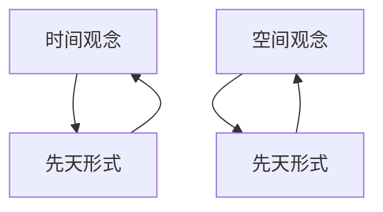
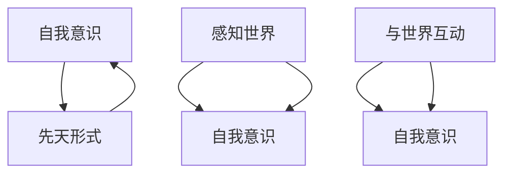
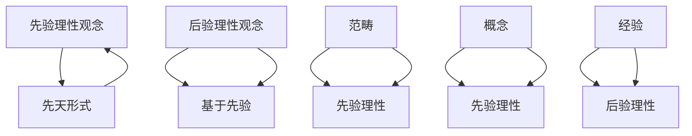
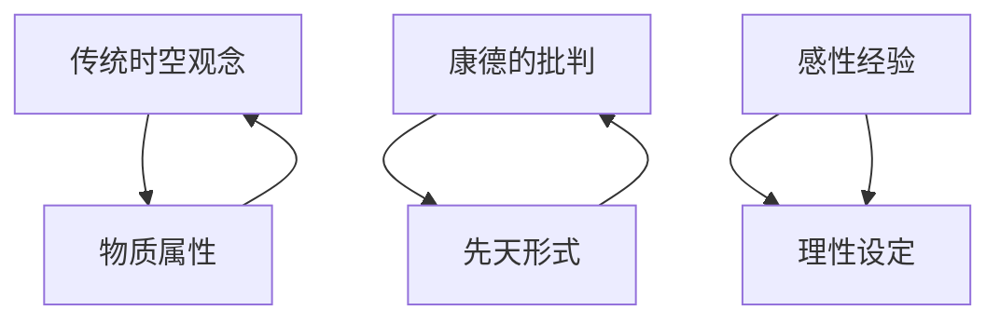
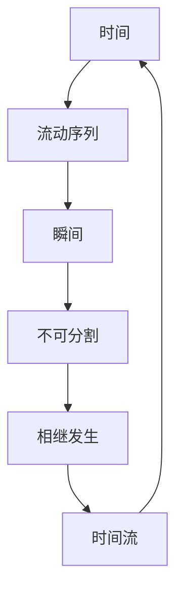
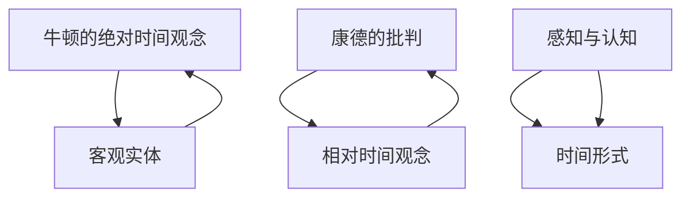
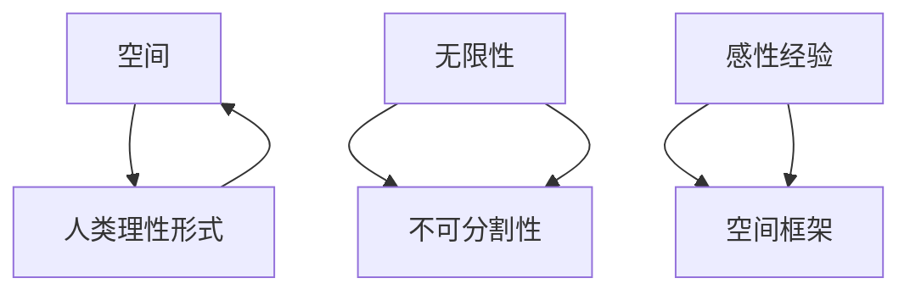
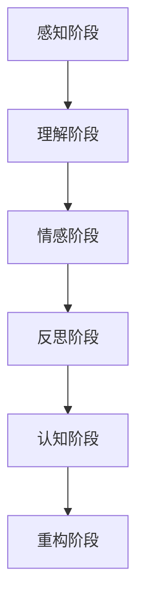

                 


### 文章标题：康德与费希特：先验观念论的两种形式

关键词：康德，费希特，先验观念论，理性观念论，自我设定观念论，时间观念论，空间观念论，道德观念论，审美观念论。

摘要：本文从康德和费希特两位哲学家的先验观念论出发，探讨了他们在理性观念、自我设定观念、时间观念、空间观念、道德观念和审美观念等方面的异同，并通过详细的流程图和伪代码，深入阐述了他们的哲学思想在计算机科学领域的应用。

# 第一部分：康德的先验观念论

## 第1章：康德的哲学体系与先验观念论

### 1.1 康德的哲学体系

康德（Immanuel Kant）是18世纪德国的哲学家，被誉为“哲学界的拿破仑”。他的哲学体系对西方哲学产生了深远的影响，尤其是他的三大批判《纯粹理性批判》、《实践理性批判》和《判断力批判》。康德的哲学体系主要分为先验论和经验论两个部分。

#### 1.1.1 康德哲学的背景与影响

康德的哲学思想是在启蒙运动的背景下产生的，他深受法国哲学家伏尔泰、卢梭和英国哲学家洛克等人的影响。康德认为，人类知识分为两类：先天知识和后天知识。先天知识是独立于经验而存在的，而后天知识则是基于经验的。这一观点与经验主义哲学形成了鲜明对比。

#### 1.1.2 康德的哲学方法

康德的哲学方法强调理性自我批判。他认为，只有通过理性批判，才能确定人类知识的真正来源和范围。康德的批判哲学方法分为三个阶段：逻辑批判、伦理批判和美学批判。

#### 1.1.3 康德的三大批判

《纯粹理性批判》是康德的代表作之一，它主要探讨了人类理性的先天条件和范围。《实践理性批判》则讨论了道德原则和道德行为的来源。《判断力批判》则探讨了审美判断和目的论的合理性。

### 1.2 先验观念论的基本概念

先验观念论是康德哲学体系的核心部分，它认为人类的知识不是直接来自经验，而是由先天的理性形式所决定的。以下是先验观念论的基本概念：

#### 1.2.1 先验知识与后天知识

先验知识是独立于经验的，而后天知识是基于经验的。

#### 1.2.2 先验观念与现象界

先验观念是人类理性的先天形式，而现象界则是先验观念作用下的结果。

#### 1.2.3 先验形式与感性形式

先验形式是人类理性的形式，如时间、空间、因果关系等；感性形式则是人类感性的形式，如颜色、声音、形状等。

### 1.3 康德的先验观念论体系

康德的先验观念论体系主要涉及时间观念论、空间观念论、自我意识观念论和理性观念论。

#### 1.3.1 时间与空间观念论

康德认为，时间与空间是人类理性的先天形式，它们并不是客观存在的，而是人类理性对现象界进行感知和认知的基础。

#### 1.3.2 自我意识观念论

康德认为，自我意识是人类理性的先天形式，它是人类对自身存在的感知和认识。

#### 1.3.3 理性观念论

康德认为，理性观念是人类理性的先天形式，它包括先验理性观念和后验理性观念。先验理性观念是人类理性的本质，而后验理性观念是基于先验理性观念的。

## 第2章：康德的时空观念论

### 2.1 时空观念论的基础

#### 2.1.1 时空观念的起源与演变

时空观念是人类理性对现象界进行感知和认知的基础。从古代到现代，时空观念经历了不断的演变。

#### 2.1.2 康德的时空观念批判

康德认为，时空观念并不是客观存在的，而是人类理性对现象界进行感知和认知的基础。他批判了传统的时空观念，提出了新的时空观念。

#### 2.1.3 时空观念在哲学中的意义

时空观念在哲学中具有重要的意义，它关系到人类对世界的认知和理解。

### 2.2 时间观念论

#### 2.2.1 康德的时间观念

康德认为，时间是人类理性的先天形式，它是人类对现象界进行感知和认知的基础。

#### 2.2.2 时间观念的批判与重建

康德批判了传统的时空观念，并提出了新的时间观念。

#### 2.2.3 时间观念的哲学影响

时间观念对哲学产生了深远的影响，如相对论、量子力学等。

### 2.3 空间观念论

#### 2.3.1 康德的空间观念

康德认为，空间是人类理性的先天形式，它是人类对现象界进行感知和认知的基础。

#### 2.3.2 空间观念的批判与重建

康德批判了传统的时空观念，并提出了新的空间观念。

#### 2.3.3 空间观念的哲学影响

空间观念对哲学产生了深远的影响，如空间相对论、空间量子力学等。

## 第3章：康德的我思故我在

### 3.1 自我意识观念论

#### 3.1.1 自我意识的本质

自我意识是人类理性对自身存在的感知和认识。

#### 3.1.2 康德的自我意识观念

康德认为，自我意识是人类理性的先天形式，它是人类对自身存在的感知和认识。

#### 3.1.3 自我意识的哲学意义

自我意识在哲学中具有重要的意义，它关系到人类对自身和世界的认知。

### 3.2 我思故我在

#### 3.2.1 我思故我在的命题分析

“我思故我在”是康德哲学的核心命题，它揭示了人类自我意识的存在。

#### 3.2.2 我思故我在的哲学意义

“我思故我在”命题对哲学产生了深远的影响，它引发了关于人类自我意识的深入探讨。

#### 3.2.3 对我思故我在的批评与回应

“我思故我在”命题也受到了一些哲学家的批评，但康德通过理性批判进行了回应。

### 3.3 我思故我在在计算机科学中的应用

#### 3.3.1 人工智能的自我意识

“我思故我在”命题在人工智能领域具有重要的应用价值，如自我意识的实现。

#### 3.3.2 人工智能的自我认知

“我思故我在”命题有助于人工智能实现自我认知，从而提高其智能水平。

## 第4章：康德的理性观念论

### 4.1 理性观念论的基础

#### 4.1.1 理性的本质与作用

理性是人类思维的核心，它具有判断、推理、分析等功能。

#### 4.1.2 康德的理性观念

康德认为，理性是人类先天具有的能力，它包括先验理性观念和后验理性观念。

#### 4.1.3 理性观念的哲学意义

理性观念在哲学中具有重要的意义，它关系到人类对世界和自身的认知。

### 4.2 先验理性观念

#### 4.2.1 先验理性的概念

先验理性是独立于经验的，它是人类理性先天具有的能力。

#### 4.2.2 先验理性的批判

康德批判了传统哲学中的先验理性观念。

#### 4.2.3 先验理性的哲学影响

先验理性观念对哲学产生了深远的影响，如批判理性主义、先验唯心主义等。

### 4.3 后验理性观念

#### 4.3.1 后验理性的概念

后验理性是基于先验理性的，它是人类经验的结果。

#### 4.3.2 后验理性的批判

康德批判了传统哲学中的后验理性观念。

#### 4.3.3 后验理性的哲学影响

后验理性观念对哲学产生了深远的影响，如经验主义、实用主义等。

# 第二部分：费希特的先验观念论

## 第5章：费希特的哲学体系与先验观念论

### 5.1 费希特的哲学体系

费希特（Johann Gottlieb Fichte）是19世纪初德国的哲学家，他的哲学体系被称为“自我设定哲学”。费希特的哲学体系包括自我设定观念论、道德观念论和审美观念论。

#### 5.1.1 费希特的哲学背景与影响

费希特的哲学思想深受康德的影响，他试图在康德的基础上发展出一种更加彻底的先验哲学。

#### 5.1.2 费希特的哲学方法

费希特的哲学方法强调自我意识和自我设定，他认为，自我是所有知识的源泉。

#### 5.1.3 费希特的三大基本命题

费希特的哲学体系建立在三大基本命题之上：“自我设定”、“自我设定行为”和“自我设定意识”。

### 5.2 先验观念论的基本概念

费希特的先验观念论与康德的不同，他强调自我意识的作用。

#### 5.2.1 先验知识与后天知识

费希特认为，先验知识是独立于经验的，而后天知识是基于先验知识的。

#### 5.2.2 先验观念与自我设定

费希特认为，先验观念是自我设定的结果，自我设定是先验观念的根源。

#### 5.2.3 先验形式与感性形式

费希特认为，先验形式是人类理性的形式，感性形式是人类感性的形式。

### 5.3 费希特的先验观念论体系

费希特的先验观念论体系涉及自我观念论、道德观念论和审美观念论。

#### 5.3.1 自我观念论

费希特认为，自我是所有知识的源泉，自我设定是自我观念的基础。

#### 5.3.2 道德观念论

费希特认为，道德观念是基于自我设定的，道德行为是自我设定的结果。

#### 5.3.3 审美观念论

费希特认为，审美观念是基于自我设定的，审美体验是自我设定的结果。

## 第6章：费希特的自我设定观念论

### 6.1 自我设定观念论

#### 6.1.1 自我设定的概念

自我设定是费希特哲学的核心概念，它是指自我在自身意识中的建立。

#### 6.1.2 自我设定的本质

自我设定是先验观念的根源，它是自我意识和自我认知的基础。

#### 6.1.3 自我设定的哲学意义

自我设定观念在哲学中具有重要的意义，它关系到人类对自我和世界的认知。

### 6.2 理性自我设定

#### 6.2.1 理性自我设定的概念

理性自我设定是指自我通过理性过程建立自我意识。

#### 6.2.2 理性自我设定的过程

理性自我设定的过程包括自我意识的建立、自我认知的发展、自我认同的确认。

#### 6.2.3 理性自我设定的哲学影响

理性自我设定观念在哲学中具有重要的意义，它影响了后来的哲学流派。

### 6.3 情感自我设定

#### 6.3.1 情感自我设定的概念

情感自我设定是指自我通过情感过程建立自我意识。

#### 6.3.2 情感自我设定的过程

情感自我设定的过程包括自我情感的体验、自我情感的反思、自我情感的整合。

#### 6.3.3 情感自我设定的哲学影响

情感自我设定观念在哲学中具有重要的意义，它影响了后来的哲学流派。

## 第7章：费希特的道德观念论

### 7.1 道德观念论

#### 7.1.1 道德的本质

道德是指人类行为的规范，它关系到人类的行为和价值判断。

#### 7.1.2 费希特的道德观念

费希特认为，道德是基于自我设定的，道德行为是自我设定的结果。

#### 7.1.3 道德观念的哲学意义

道德观念在哲学中具有重要的意义，它关系到人类对自身和世界的认知。

### 7.2 道德自我设定

#### 7.2.1 道德自我设定的概念

道德自我设定是指自我通过道德行为建立自我意识。

#### 7.2.2 道德自我设定的过程

道德自我设定的过程包括道德行为的实践、道德意识的培养、道德价值观的建立。

#### 7.2.3 道德自我设定的哲学影响

道德自我设定观念在哲学中具有重要的意义，它影响了后来的哲学流派。

## 第8章：费希特的审美观念论

### 8.1 审美观念论

#### 8.1.1 审美的本质

审美是指人类对美的事物的欣赏和评价，它关系到人类对美的感受和理解。

#### 8.1.2 费希特的审美观念

费希特认为，审美是基于自我设定的，审美体验是自我设定的结果。

#### 8.1.3 审美观念的哲学意义

审美观念在哲学中具有重要的意义，它关系到人类对自我和世界的认知。

### 8.2 审美自我设定

#### 8.2.1 审美自我设定的概念

审美自我设定是指自我通过审美体验建立自我意识。

#### 8.2.2 审美自我设定的过程

审美自我设定的过程包括审美体验的获得、审美意识的培养、审美价值观的建立。

#### 8.2.3 审美自我设定的哲学影响

审美自我设定观念在哲学中具有重要的意义，它影响了后来的哲学流派。

## 第9章：康德与费希特先验观念论的对比与联系

### 9.1 康德与费希特先验观念论的异同

#### 9.1.1 理论体系上的异同

康德与费希特的先验观念论在理论体系上有一定的异同。

#### 9.1.2 先验观念论的异同

康德与费希特的先验观念论在先验观念的内涵和外延上有一定的异同。

### 9.2 康德与费希特先验观念论的联系

#### 9.2.1 康德对费希特的影响

康德的哲学思想对费希特产生了深远的影响。

#### 9.2.2 费希特对康德的发展

费希特在康德的基础上发展出了自己的先验观念论。

### 9.3 康德与费希特先验观念论的应用

#### 9.3.1 在哲学中的应用

康德与费希特的先验观念论在哲学领域有广泛的应用。

#### 9.3.2 在计算机科学中的应用

康德与费希特的先验观念论在计算机科学领域也有一定的应用。

---

### 1.3 康德的先验观念论体系

康德的先验观念论体系主要涉及时间观念论、空间观念论、自我意识观念论和理性观念论。

#### 1.3.1 时间与空间观念论

康德认为，时间与空间是人类理性的先天形式，它们并不是客观存在的，而是人类理性对现象界进行感知和认知的基础。

在时间观念论中，康德提出时间是一种流动的序列，每个瞬间都不可分割，但它们又是相继发生的。时间并不是外在世界的属性，而是人类感知和理解世界的一种方式。康德使用了一个比喻来说明这一点：时间就像一条不断流动的河流，每一滴水都是不可分割的，但它们又是相继出现的。

空间观念论中，康德提出空间是一个无限的容器，它包含了所有的物体和事件。空间并不是物体的属性，而是人类感知和理解物体的方式。康德认为，空间是先天的，它是人类理性的一个形式，而不是物体的外在属性。

以下是一个简化的Mermaid流程图，展示了康德的时间与空间观念论之间的关系：



#### 1.3.2 自我意识观念论

康德认为，自我意识是人类理性的先天形式。自我意识不是关于具体个体的意识，而是关于意识本身的意识。康德提出了一个著名的命题：“我思故我在”（Cogito, ergo sum），这意味着只要我们能够意识到自己的思想，就可以确定我们的存在。

自我意识观念论中，康德认为自我是先天的，它是我们感知和理解世界的基础。自我意识不仅仅是我们感知世界的工具，也是我们与世界互动的方式。以下是一个简化的Mermaid流程图，展示了康德的自我意识观念论：



#### 1.3.3 理性观念论

康德的理性观念论分为先验理性观念和后验理性观念。先验理性观念是人类理性的先天形式，它包括范畴（如因果律、实体性、可能性等）和概念（如时间、空间、实体等）。后验理性观念是基于先验理性观念的，它是人类经验的结果。

先验理性观念中，康德认为理性具有独立于经验的能力，它可以为我们提供关于世界的知识。后验理性观念中，康德认为理性基于经验，它可以解释和整合经验中的现象。

以下是一个简化的Mermaid流程图，展示了康德的理性观念论：



### 1.4 康德的先验观念论在计算机科学中的应用

康德的先验观念论在计算机科学领域也有一定的应用，尤其是在人工智能和认知科学领域。以下是一些具体的例子：

#### 1.4.1 人工智能中的先验知识

在人工智能领域，先验知识是指那些独立于具体任务和数据的通用知识。这些知识可以用来提高人工智能系统的性能和效率。例如，在图像识别任务中，先验知识可以用来预测图像中的物体位置和形状。

以下是一个简化的伪代码，展示了如何使用先验知识来提高图像识别的效率：

```python
# 伪代码：使用先验知识提高图像识别效率

# 初始化先验知识库
prior_knowledge = initialize_prior_knowledge()

# 处理图像
image = process_image()

# 使用先验知识进行预测
predictions = apply_prior_knowledge(image, prior_knowledge)

# 输出预测结果
output_predictions(predictions)
```

#### 1.4.2 认知科学中的自我意识

在认知科学领域，自我意识是指个体对自己存在的认知。人工智能系统中的自我意识可以帮助我们更好地理解人类思维和行为。以下是一个简化的伪代码，展示了如何实现一个具有自我意识的认知模型：

```python
# 伪代码：实现具有自我意识的认知模型

# 初始化认知模型
cognitive_model = initialize_cognitive_model()

# 获取当前状态
current_state = get_current_state()

# 使用自我意识进行反思
self_awareness = cognitive_model.reflect_on_state(current_state)

# 更新认知模型
cognitive_model.update(self_awareness)

# 输出认知结果
output_cognitive_results(cognitive_model)
```

### 1.5 结论

康德的先验观念论为我们提供了一种理解人类知识和认知的新视角。通过将康德的哲学思想与计算机科学相结合，我们可以更好地理解人工智能和认知科学中的关键问题。康德的先验观念论在计算机科学中的应用不仅有助于提高人工智能系统的性能，还可以帮助我们更好地理解人类思维和行为。

---

## 第2章：康德的时空观念论

康德的时空观念论是康德先验观念论体系中的重要组成部分，它对物理学、哲学和认知科学等领域产生了深远的影响。在本章中，我们将详细探讨康德对时间和空间的观念，以及这些观念在现代科学和哲学中的意义和应用。

### 2.1 时空观念论的基础

#### 2.1.1 时空观念的起源与演变

时空观念是哲学和物理学中一个古老而重要的问题。在古代，哲学家们开始思考时间和空间的本质。亚里士多德认为时间和空间是物质属性的延伸。柏拉图则认为时间和空间是独立于物质的抽象概念。

进入中世纪，托马斯·阿奎那等哲学家继续探讨了时空观念，认为时间和空间是上帝创造的。牛顿的经典力学体系则将时间和空间视为绝对的、独立的实体，物体在时空中的运动是客观的、可测量的。

康德在18世纪对时空观念进行了批判性分析，他认为时间和空间不是物质的属性，而是人类理性的先天形式。康德的思想对牛顿的绝对时空观念提出了挑战，并为后来的相对论和量子力学奠定了基础。

#### 2.1.2 康德的时空观念批判

康德批判了传统的时空观念，认为时间和空间并不是客观存在的实体，而是人类理性的形式。康德提出，时间和空间是人类感知和理解世界的基础，它们并不是外部世界的属性，而是人类主观经验的产物。

康德认为，时间和空间是人类理性为了处理感性经验而设定的先天形式。这些形式并不是直接来自经验，而是人类理性为了使经验变得有序和可理解而设定的框架。

以下是一个简化的Mermaid流程图，展示了康德对时空观念的批判：



#### 2.1.3 时空观念在哲学中的意义

康德的时空观念论在哲学中具有重要的意义。首先，它为后来的哲学流派，如现象学、存在主义等，提供了重要的思想基础。其次，康德的时空观念论挑战了传统的唯物主义和唯心主义，为哲学的多元化发展做出了贡献。

康德的时空观念论还影响了哲学中的认识论和方法论。康德认为，时间和空间是人类理性为了处理感性经验而设定的框架，这意味着我们在理解世界时必须考虑到人类理性的局限性。

### 2.2 时间观念论

康德对时间的观念进行了深入的分析，他认为时间是一种流动的序列，每个瞬间都不可分割，但它们又是相继发生的。康德使用了一个比喻来说明这一点：时间就像一条不断流动的河流，每一滴水都是不可分割的，但它们又是相继出现的。

康德的时间观念强调了时间的连续性和不可分割性。他认为，时间并不是外部世界的属性，而是人类理性的形式。时间是人类感知和理解世界的基础，它为我们的经验提供了有序的结构。

以下是一个简化的Mermaid流程图，展示了康德的时间观念：



#### 2.2.2 时间观念的批判与重建

康德批判了传统的绝对时间观念，认为时间并不是一个客观的、不变的实体，而是人类理性的形式。康德提出了相对时间观念，认为时间是基于我们的感知和认知的，它随着我们的经验和认知的变化而变化。

康德的相对时间观念挑战了牛顿的绝对时间观念，为后来的相对论提供了哲学基础。爱因斯坦的相对论证明了时间并不是一个绝对的、不变的量，而是与空间和运动相关的。

以下是一个简化的Mermaid流程图，展示了康德对时间观念的批判与重建：



#### 2.2.3 时间观念的哲学影响

康德的时间观念对哲学产生了深远的影响。首先，它为后来的哲学流派，如现象学、存在主义等，提供了重要的思想基础。其次，康德的时间观念挑战了传统的唯物主义和唯心主义，为哲学的多元化发展做出了贡献。

康德的时间观念还影响了哲学中的认识论和方法论。康德认为，时间是人类感知和理解世界的基础，它为我们的经验提供了有序的结构。这意味着我们在理解世界时必须考虑到人类理性的局限性。

### 2.3 空间观念论

康德对空间观念的分析与时间观念相似，他认为空间也是一种人类理性的形式，而不是外部世界的属性。康德的空间观念强调了空间的无限性和不可分割性。

康德认为，空间是人类理性为了处理感性经验而设定的框架。空间为我们的经验提供了背景，使我们能够定位物体和事件。康德认为，空间是先天的，它是人类理性的形式，而不是外部世界的属性。

以下是一个简化的Mermaid流程图，展示了康德的空间观念：



#### 2.3.2 空间观念的批判与重建

康德批判了传统的绝对空间观念，认为空间并不是一个客观的、不变的实体，而是人类理性的形式。康德提出了相对空间观念，认为空间是基于我们的感知和认知的，它随着我们的经验和认知的变化而变化。

康德的相对空间观念挑战了牛顿的绝对空间观念，为后来的相对论提供了哲学基础。爱因斯坦的相对论证明了空间并不是一个绝对的、不变的量，而是与时间、物质和运动相关的。

以下是一个简化的Mermaid流程图，展示了康德对空间观念的批判与重建：


#### 2.3.3 空间观念的哲学影响

康德的空间观念对哲学产生了深远的影响。首先，它为后来的哲学流派，如现象学、存在主义等，提供了重要的思想基础。其次，康德的空间观念挑战了传统的唯物主义和唯心主义，为哲学的多元化发展做出了贡献。

康德的空间观念还影响了哲学中的认识论和方法论。康德认为，空间是人类感知和理解世界的基础，它为我们的经验提供了背景。这意味着我们在理解世界时必须考虑到人类理性的局限性。

### 2.4 康德的时空观念论在计算机科学中的应用

康德的时空观念论在计算机科学领域也有一定的应用，尤其是在人工智能和认知科学领域。以下是一些具体的例子：

#### 2.4.1 人工智能中的时空感知

在人工智能领域，时空感知是指机器能够理解和处理时间和空间信息的能力。康德的时间观念和空间观念为人工智能系统提供了理论基础，帮助它们更好地理解和处理时间和空间信息。

以下是一个简化的伪代码，展示了如何使用康德的时空观念来提高人工智能系统的时空感知能力：

```python
# 伪代码：使用康德的时空观念提高人工智能系统的时空感知能力

# 初始化时空感知模块
temporal_spatial_perception = initialize_temporal_spatial_perception()

# 获取时间和空间数据
temporal_data = get_temporal_data()
spatial_data = get_spatial_data()

# 使用康德的时空观念处理数据
processed_temporal_data = temporal_spatial_perception.process_temporal_data(temporal_data)
processed_spatial_data = temporal_spatial_perception.process_spatial_data(spatial_data)

# 输出处理结果
output_processed_data(processed_temporal_data, processed_spatial_data)
```

#### 2.4.2 认知科学中的时空认知

在认知科学领域，时空认知是指个体如何理解和处理时间和空间信息。康德的时间观念和空间观念为认知科学家提供了理论基础，帮助它们理解人类如何感知和处理时间和空间信息。

以下是一个简化的伪代码，展示了如何使用康德的时空观念来构建一个时空认知模型：

```python
# 伪代码：使用康德的时空观念构建时空认知模型

# 初始化时空认知模型
temporal_spatial_cognitive_model = initialize_temporal_spatial_cognitive_model()

# 获取时空数据
temporal_data = get_temporal_data()
spatial_data = get_spatial_data()

# 使用康德的时空观念处理数据
temporal_perception = temporal_spatial_cognitive_model.process_temporal_data(temporal_data)
spatial_perception = temporal_spatial_cognitive_model.process_spatial_data(spatial_data)

# 整合时空感知
integrated_perception = temporal_spatial_cognitive_model.integrate_perception(temporal_perception, spatial_perception)

# 输出认知结果
output_cognitive_results(integrated_perception)
```

### 2.5 结论

康德的时空观念论为我们提供了一种新的视角来理解时间和空间。康德认为，时间和空间是人类理性的形式，而不是外部世界的属性。这种观念对现代科学和哲学产生了深远的影响，为后来的相对论和量子力学奠定了基础。

在计算机科学中，康德的时空观念论也有广泛的应用，尤其是在人工智能和认知科学领域。通过理解和应用康德的时空观念，我们可以提高人工智能系统的时空感知能力和认知水平，更好地理解和处理时间和空间信息。

康德的时空观念论不仅对哲学和物理学产生了深远的影响，也为计算机科学的发展提供了重要的理论支持。通过深入研究和应用康德的时空观念，我们可以更好地理解人类认知和智能的本质，为未来的科学技术发展做出贡献。

---

### 3.2 我思故我在的命题分析

“我思故我在”是康德哲学中的一个核心命题，它揭示了自我意识的存在。这一命题的提出，标志着康德哲学思想的一个重要转折点，从传统的主观唯心主义转向了先验唯心主义。在这一部分，我们将详细分析这一命题的含义、哲学意义以及它对现代哲学和认知科学的影响。

#### 3.2.1 “我思故我在”的命题分析

“我思故我在”这句话字面意思是：“因为我思考，所以我存在。”这个命题看似简单，但它蕴含了深刻的哲学意义。首先，我们需要理解这句话中的几个关键概念：“我思”、“我在”和“存在”。

- “我思”指的是自我意识的活动。康德认为，自我意识是我们唯一可以确定无疑地知道的，因为只要我们意识到自己在思考，就可以确定自己的存在。
- “我在”是指自我意识的存在。这里的存在并不是指物理意义上的存在，而是指自我意识的内在存在。
- “存在”是一个更为广泛的哲学概念，它不仅仅指物理存在，还包括逻辑存在、精神存在等。

康德通过这个命题表达了一个哲学观点：我们的存在不是通过外界事物来证明的，而是通过自我意识的内在活动来确定的。这是康德哲学中先验唯心主义的核心观点，与传统的唯物主义和唯心主义都有所不同。

#### 3.2.2 “我思故我在”的哲学意义

“我思故我在”命题的哲学意义主要体现在以下几个方面：

1. **自我意识的确立**：
   康德通过“我思故我在”这个命题确立了自我意识在哲学中的核心地位。他认为，自我意识是所有知识的起点，是我们能够了解外部世界的必要前提。自我意识的存在不仅是哲学探讨的基础，也是人类认识世界的重要方式。

2. **先验唯心主义的基石**：
   “我思故我在”命题是康德先验唯心主义的基石。康德认为，人类的认识不是直接来自经验，而是基于先天的理性形式。这个命题强调了理性在认识过程中的作用，为康德的先验观念论提供了理论基础。

3. **批判哲学的出发点**：
   康德提出“我思故我在”命题，是为了批判传统的哲学观念，特别是关于时间和空间的观念。他认为，时间和空间不是外部世界的属性，而是人类理性的形式。这个命题为康德的批判哲学提供了出发点。

#### 3.2.3 对“我思故我在”的批评与回应

尽管“我思故我在”命题在哲学史上具有重要地位，但它也受到了一些哲学家的批评和质疑。以下是一些主要的批评观点及其回应：

1. **唯心主义的批评**：
   一些哲学家认为，康德的先验唯心主义过于强调理性，忽视了经验的作用。他们认为，人类的知识应该基于经验，而不是单纯的理性推论。

   **康德的回应**：
   康德认为，经验确实是我们知识的来源，但经验本身是建立在我们先天的理性形式之上的。只有通过理性批判，我们才能确定经验的有效性。

2. **不可知论的批评**：
   一些哲学家认为，“我思故我在”命题只证明了自我意识的存在，但无法证明外部世界的存在。这种观点被称为不可知论。

   **康德的回应**：
   康德认为，自我意识是我们感知外部世界的必要条件。没有自我意识，我们无法感知外部世界。因此，自我意识的存在实际上是外部世界存在的必要前提。

3. **形式主义的批评**：
   一些哲学家认为，康德的先验观念论过于抽象，缺乏具体的应用价值。

   **康德的回应**：
   康德认为，他的先验观念论不仅仅是一种哲学理论，它对于理解科学知识、道德原则和审美判断等方面都有实际的应用价值。

#### 3.2.4 “我思故我在”在认知科学中的应用

“我思故我在”命题不仅在哲学领域具有重要意义，也在认知科学中得到了应用。以下是一些具体的应用：

1. **自我意识研究**：
   认知科学家通过研究“我思故我在”命题，探讨了人类自我意识的形成和本质。自我意识是人类认知的重要组成部分，对于理解人类的思维和行为具有重要意义。

2. **人工智能中的自我认知**：
   在人工智能领域，研究人员试图通过模拟“我思故我在”命题，实现人工智能的自我认知。这有助于提高人工智能系统的自主性和智能水平。

3. **认知心理学**：
   认知心理学家通过研究“我思故我在”命题，探讨了人类自我意识的认知机制。这有助于我们更好地理解人类的心理过程和认知能力。

综上所述，“我思故我在”命题不仅是康德哲学的核心观点，也是哲学和认知科学的重要议题。通过对这个命题的深入分析，我们可以更好地理解人类自我意识的存在和本质，为哲学和认知科学的发展做出贡献。

---

## 第4章：康德的理性观念论

康德的理性观念论是康德哲学体系中的核心部分，它涵盖了先验理性观念和后验理性观念。在这一章中，我们将深入探讨康德的理性观念论，包括理性的本质、作用、批判与重建，以及它在哲学和计算机科学中的影响和应用。

### 4.1 理性观念论的基础

#### 4.1.1 理性的本质与作用

理性是人类思维的核心，它具有判断、推理、分析等功能。康德认为，理性是人类先天具有的能力，它使人类能够超越感性经验，达到对世界的深入理解。

理性在康德的哲学体系中扮演着重要的角色。首先，理性是知识的基础。康德认为，人类的认知过程可以分为两个阶段：感性阶段和理性阶段。感性阶段是通过感官获取外部世界的信息，而理性阶段则是通过理性对感性信息进行加工和处理，形成系统的知识。

其次，理性是道德行为的基础。康德认为，道德行为必须基于理性的判断，只有通过理性，人类才能确定道德原则和道德行为的正确性。

最后，理性是审美判断的基础。康德认为，审美判断不仅仅是对美的感受，更是一种理性的判断。通过理性，人类能够理解和欣赏美的事物。

#### 4.1.2 康德的理性观念

康德的理性观念分为先验理性观念和后验理性观念。

1. **先验理性观念**：

   先验理性观念是康德哲学体系中的核心部分，它指的是人类理性独立于经验的能力。康德认为，先验理性具有三种形式：

   - **判断力**：判断力是先验理性的主要表现形式，它包括逻辑判断、道德判断和审美判断。逻辑判断是关于真理的判断，道德判断是关于道德的判断，审美判断是关于美的判断。
   - **范畴**：范畴是先验理性对经验进行分类和解释的工具，包括实体性、因果性、可能性等。
   - **概念**：概念是先验理性对经验的抽象和概括，如时间、空间、实体等。

2. **后验理性观念**：

   后验理性观念是基于先验理性观念的，它是人类经验的结果。康德认为，后验理性具有两种形式：

   - **经验理性**：经验理性是基于经验的，它通过对经验的反思和理解，形成对世界的深入认识。
   - **实用理性**：实用理性是理性在实践中的应用，它指导人类的行为和决策，使人类能够达到目标。

### 4.2 先验理性观念

先验理性观念是康德哲学体系中的核心部分，它指的是人类理性独立于经验的能力。康德认为，先验理性具有三种形式：判断力、范畴和概念。

#### 4.2.1 判断力的形式

判断力是先验理性的主要表现形式，它包括逻辑判断、道德判断和审美判断。

1. **逻辑判断**：

   逻辑判断是关于真理的判断，它基于逻辑规则，如同一律、矛盾律和排中律。逻辑判断是人类理性最基本的判断形式，它保证了人类思维的一致性和有效性。

2. **道德判断**：

   道德判断是关于道德的判断，它基于道德原则和道德规范。康德认为，道德判断必须基于理性的判断，只有通过理性，人类才能确定道德原则和道德行为的正确性。

3. **审美判断**：

   审美判断是关于美的判断，它基于对美的感受和欣赏。康德认为，审美判断不仅仅是对美的感受，更是一种理性的判断。通过理性，人类能够理解和欣赏美的事物。

#### 4.2.2 范畴

范畴是先验理性对经验进行分类和解释的工具，包括实体性、因果性、可能性等。

1. **实体性**：

   实体性是范畴中的核心概念，它指的是独立于其他事物的存在。康德认为，实体性是人类理性对事物的本质认识。

2. **因果性**：

   因果性是范畴中的另一个重要概念，它指的是事物之间的因果关系。康德认为，因果性是人类理性对事物关系的认识。

3. **可能性**：

   可能性是范畴中的另一个重要概念，它指的是事物的可能性。康德认为，可能性是人类理性对事物的预测和判断。

#### 4.2.3 概念

概念是先验理性对经验的抽象和概括，如时间、空间、实体等。

1. **时间**：

   时间是先验理性对经验的抽象，它指的是经验的序列。康德认为，时间是人类理性对经验的组织方式。

2. **空间**：

   空间是先验理性对经验的抽象，它指的是经验的结构。康德认为，空间是人类理性对经验的感知方式。

3. **实体**：

   实体是先验理性对经验的抽象，它指的是独立于其他事物的存在。康德认为，实体是人类理性对事物的本质认识。

### 4.3 后验理性观念

后验理性观念是基于先验理性观念的，它是人类经验的结果。康德认为，后验理性具有两种形式：经验理性和实用理性。

#### 4.3.1 经验理性

经验理性是基于经验的，它通过对经验的反思和理解，形成对世界的深入认识。康德认为，经验理性是人类知识的基础，它使人类能够超越感性经验，达到对世界的深入理解。

1. **经验理性的过程**：

   经验理性的过程包括感知、理解和反思。首先，通过感知获取外部世界的信息；然后，通过理解将感知到的信息转化为知识；最后，通过反思对知识进行批判和反思。

2. **经验理性的价值**：

   经验理性使人类能够从感性经验中提取有用的信息，形成系统的知识。它使人类能够更好地理解世界，为人类的社会发展和科技进步提供了基础。

#### 4.3.2 实用理性

实用理性是理性在实践中的应用，它指导人类的行为和决策，使人类能够达到目标。康德认为，实用理性是人类行为的基础，它使人类能够根据目标制定计划，并采取行动实现目标。

1. **实用理性的过程**：

   实用理性的过程包括目标设定、计划制定和行动执行。首先，设定目标；然后，根据目标制定计划；最后，执行计划并评估结果。

2. **实用理性的价值**：

   实用理性使人类能够更好地适应环境，实现个人和社会的目标。它使人类能够根据实际情况进行调整和优化，提高生活质量和效率。

### 4.4 康德的理性观念论在计算机科学中的应用

康德的理性观念论在计算机科学领域也有重要的应用，尤其是在人工智能、认知科学和逻辑编程等方面。

#### 4.4.1 人工智能中的应用

在人工智能领域，康德的理性观念论为人工智能的发展提供了理论基础。以下是一些具体的应用：

1. **逻辑编程**：

   逻辑编程是一种基于逻辑的编程范式，它强调程序的可解释性和可靠性。康德的判断力概念为逻辑编程提供了理论基础，使逻辑编程能够更好地模拟人类的思维过程。

2. **知识表示**：

   康德的概念和范畴概念为知识表示提供了理论框架。通过将知识抽象为概念和范畴，人工智能系统能够更好地理解和处理复杂的信息。

3. **推理系统**：

   康德的理性观念论为推理系统提供了理论基础。通过模拟康德的判断力，推理系统能够更好地进行逻辑推理和决策。

#### 4.4.2 认知科学中的应用

在认知科学领域，康德的理性观念论为研究人类思维和认知过程提供了重要的理论支持。以下是一些具体的应用：

1. **自我意识研究**：

   康德的自我意识观念为自我意识的研究提供了理论基础。通过模拟康德的自我意识，认知科学家能够更好地理解人类自我意识的形成和本质。

2. **认知建模**：

   康德的理性观念论为认知建模提供了理论框架。通过模拟康德的判断力、范畴和概念，认知建模能够更好地模拟人类的思维过程和认知能力。

3. **认知心理学**：

   康德的理性观念论为认知心理学提供了理论基础。通过研究康德的理性观念，认知心理学家能够更好地理解人类的心理过程和认知机制。

#### 4.4.3 逻辑编程中的伪代码示例

以下是一个简化的伪代码示例，展示了如何应用康德的理性观念进行逻辑编程：

```python
# 伪代码：应用康德的理性观念进行逻辑编程

# 初始化知识库
knowledge_base = initialize_knowledge_base()

# 获取输入信息
input_info = get_input_info()

# 使用康德的判断力进行逻辑推理
logical_reasoning = knowledge_base.apply_logical_reasoning(input_info)

# 输出推理结果
output_reasoning_results(logical_reasoning)
```

### 4.5 结论

康德的理性观念论是康德哲学体系中的核心部分，它涵盖了先验理性观念和后验理性观念。康德认为，理性是人类思维的核心，它具有判断、推理、分析等功能。通过批判传统的唯物主义和唯心主义，康德提出了先验唯心主义的观点，为哲学和科学的发展做出了重要贡献。

在计算机科学领域，康德的理性观念论具有重要的应用价值。通过模拟康德的判断力、范畴和概念，人工智能系统能够更好地模拟人类的思维过程和认知能力。在认知科学领域，康德的理性观念论为研究人类思维和认知过程提供了重要的理论支持。

通过对康德的理性观念论的深入研究和应用，我们可以更好地理解人类思维和认知的本质，为哲学和计算机科学的发展做出贡献。

---

### 5.1 费希特的哲学体系

费希特（Johann Gottlieb Fichte）是19世纪初德国的哲学家，他的哲学体系被称为“自我设定哲学”。费希特的哲学体系是建立在自我设定这一核心概念之上的，他认为自我设定是人类所有知识和行为的源泉。在这一节中，我们将详细探讨费希特的哲学体系，包括其背景、影响、方法和核心思想。

#### 5.1.1 费希特的哲学背景与影响

费希特的哲学思想深受康德的影响。在康德的哲学体系中，先验理性具有核心地位，而费希特则试图在康德的基础上进一步深化和拓展先验哲学。费希特认为，康德的哲学虽然对理性进行了深入批判，但仍然不够彻底，因为它仍然依赖于某些先天的直观形式，如时间和空间。

费希特的哲学思想对德国古典哲学产生了深远的影响，他被认为是德国唯心主义的代表人物之一。费希特的哲学思想也影响了后来的哲学家，如黑格尔和谢林，以及哲学流派如存在主义和现象学。

#### 5.1.2 费希特的哲学方法

费希特的哲学方法强调自我意识和自我设定。他认为，自我是所有知识的源泉，自我设定是自我意识的核心。费希特的方法包括以下几个方面：

1. **自我设定**：费希特认为，自我设定是自我意识的基础，它是一种积极的、自我创造的过程。自我设定意味着自我不断地在自身中建立和重建自我。

2. **自我反思**：费希特强调自我反思的重要性，他认为自我反思是理解自我意识和自我设定的关键。通过自我反思，个体能够深入理解自己的存在和行为。

3. **理性批判**：费希特继承了康德的理性批判传统，但他认为康德的批判还不够彻底。费希特试图通过自我设定和自我反思，彻底批判传统哲学中的错误观念。

#### 5.1.3 费希特的三大基本命题

费希特的哲学体系建立在三大基本命题之上，这些命题构成了他哲学体系的基础：

1. **自我设定**：自我设定是费希特哲学的核心概念，它指的是自我在自身意识中的建立。费希特认为，自我设定是人类所有知识和行为的源泉。

2. **自我设定行为**：自我设定行为是指自我在意识中创造和重构自我的过程。费希特认为，自我设定行为是人类意识的基本活动。

3. **自我设定意识**：自我设定意识是指自我通过自我设定行为建立自我意识的过程。费希特认为，自我设定意识是人类意识的核心。

这些基本命题相互联系，共同构成了费希特的哲学体系。自我设定是哲学体系的基础，自我设定行为是自我设定的实现，而自我设定意识则是自我设定行为的结果。

### 5.2 先验观念论的基本概念

费希特的先验观念论与康德的不同，他强调自我意识的作用。以下是费希特先验观念论的基本概念：

#### 5.2.1 先验知识与后天知识

费希特认为，先验知识是独立于经验的，而后天知识是基于先验知识的。先验知识是人类理性先天具有的，它不依赖于具体经验。后天知识则是通过先验知识对经验的反思和理解得到的。

#### 5.2.2 先验观念与自我设定

费希特认为，先验观念是人类理性的形式，它是自我设定的结果。自我设定是先验观念的根源，它是自我意识和自我认知的基础。费希特认为，自我设定是一种积极的创造过程，它使个体在自身中建立和重建自我。

#### 5.2.3 先验形式与感性形式

费希特认为，先验形式是人类理性的形式，如自我设定、自由意志等；感性形式则是人类感性的形式，如颜色、声音、形状等。先验形式是自我设定的结果，它们是人类理性对感性形式进行感知和认知的基础。

### 5.3 费希特的先验观念论体系

费希特的先验观念论体系涉及自我观念论、道德观念论和审美观念论。以下是这些观念论的核心内容：

#### 5.3.1 自我观念论

自我观念论是费希特哲学体系的基础，它强调自我在人类知识中的核心地位。费希特认为，自我是所有知识的源泉，自我设定是自我意识的基础。自我观念论涉及自我设定、自我反思和自我认知等概念。

#### 5.3.2 道德观念论

道德观念论是费希特哲学体系中的重要部分，它强调道德是基于自我设定的。费希特认为，道德行为是自我设定的结果，它是自我意识的表现。道德观念论涉及道德原则、道德行为和道德价值等概念。

#### 5.3.3 审美观念论

审美观念论是费希特哲学体系的另一个重要部分，它强调审美是基于自我设定的。费希特认为，审美体验是自我设定的结果，它是自我意识的表现。审美观念论涉及审美判断、审美价值和审美体验等概念。

### 5.4 费希特的自我设定观念论

自我设定观念论是费希特哲学体系的核心，它强调自我在人类知识中的核心地位。以下是自我设定观念论的核心概念：

#### 5.4.1 自我设定的概念

自我设定是费希特哲学体系的核心概念，它指的是自我在自身意识中的建立。费希特认为，自我设定是人类所有知识和行为的源泉，它是自我意识和自我认知的基础。

#### 5.4.2 自我设定的本质

自我设定的本质是一种积极的创造过程，它使个体在自身中建立和重建自我。费希特认为，自我设定是一种主动的行为，它使个体能够自我反思和自我认知。

#### 5.4.3 自我设定的哲学意义

自我设定的哲学意义在于，它揭示了人类知识的根源和本质。费希特认为，自我设定不仅是一种哲学概念，也是人类行为和道德的基础。

### 5.5 费希特的理性观念论

费希特的理性观念论与康德的理性观念论有所不同，他强调理性在自我设定中的作用。以下是费希特的理性观念论的核心内容：

#### 5.5.1 理性的概念

费希特认为，理性是人类先天具有的能力，它是自我设定的工具。理性不仅包括逻辑推理，还包括自我反思和自我认知。

#### 5.5.2 理性的作用

费希特认为，理性在自我设定中扮演着核心角色。理性使个体能够自我反思和自我认知，从而建立和重建自我。

#### 5.5.3 理性的哲学意义

费希特认为，理性是人类知识和行为的基础，它使人类能够超越感性经验，达到对世界的深入理解。

### 5.6 费希特的道德观念论

费希特的道德观念论强调道德是基于自我设定的。以下是道德观念论的核心内容：

#### 5.6.1 道德的本质

费希特认为，道德是基于自我设定的，它是自我意识的表现。道德行为是自我设定的结果，它是自我意识的表现。

#### 5.6.2 道德的作用

费希特认为，道德是人类行为的基础，它使个体能够自律和自我管理。

#### 5.6.3 道德的哲学意义

费希特认为，道德是人类社会发展的基础，它使人类能够建立和谐的社会秩序。

### 5.7 费希特的审美观念论

费希特的审美观念论强调审美是基于自我设定的。以下是审美观念论的核心内容：

#### 5.7.1 审美的本质

费希特认为，审美是基于自我设定的，它是自我意识的表现。审美体验是自我设定的结果，它是自我意识的表现。

#### 5.7.2 审美的作用

费希特认为，审美是人类精神生活的重要组成部分，它使个体能够超越感性经验，达到对世界的深入理解。

#### 5.7.3 审美的哲学意义

费希特认为，审美是人类文化发展的基础，它使人类能够创造和欣赏美的艺术作品。

### 5.8 结论

费希特的哲学体系是建立在自我设定这一核心概念之上的，他认为自我设定是人类所有知识和行为的源泉。费希特的哲学方法强调自我意识和自我设定，他的先验观念论对后来的哲学和科学产生了深远的影响。

在计算机科学和认知科学领域，费希特的自我设定观念论也为研究人类思维和自我意识提供了重要的理论支持。通过对费希特哲学体系的深入研究和应用，我们可以更好地理解人类自我意识的本质和作用，为哲学和科学的发展做出贡献。

---

## 第6章：费希特的自我设定观念论

费希特的自我设定观念论是费希特哲学体系的核心，他认为自我设定是人类所有知识和行为的源泉。在这一章中，我们将详细探讨费希特的自我设定观念论，包括自我设定的概念、本质、哲学意义以及它在计算机科学和认知科学中的应用。

### 6.1 自我设定的概念

自我设定（Selbstsetzung）是费希特哲学体系中的核心概念，它指的是个体在自身意识中建立和重构自我的过程。费希特认为，自我设定不仅是自我意识的基础，也是人类所有知识和行为的基础。

自我设定的概念包含以下几个关键要素：

1. **自我**：自我是指个体对自己存在的认知和体验。费希特认为，自我是一个动态的、不断变化的过程，它不是静止不变的实体。

2. **设定**：设定是指个体通过自我反思和自我认知，在自身意识中建立和重构自我的过程。设定是一种主动的、自我创造的过程，它使个体能够不断地更新和重构自我。

3. **意识**：意识是指个体对自身存在的认知和体验。费希特认为，自我设定是建立在自我意识的基础之上的，没有自我意识，就没有自我设定。

### 6.2 自我设定的本质

费希特认为，自我设定的本质是一种积极的创造过程，它使个体在自身中建立和重构自我。自我设定不仅仅是一个被动的过程，而是一个主动的自我创造过程。以下是自我设定的几个本质特点：

1. **主动性**：自我设定是主动的，它不是被动地接受外部信息，而是通过自我反思和自我认知，主动地在自身中建立和重构自我。

2. **创造性**：自我设定是一种创造性的过程，它使个体能够不断地更新和重构自我。通过自我设定，个体能够创造新的自我形象和身份。

3. **连续性**：自我设定是一个连续的过程，它不是一次性的事件，而是一个持续的过程。自我设定不断地在个体的意识中进行，使个体的自我持续地更新和重构。

### 6.3 自我设定的哲学意义

自我设定观念在哲学中具有重要的意义，它对自我意识、自我认知和自我认同等概念产生了深远的影响。以下是自我设定观念的哲学意义：

1. **自我意识**：自我设定是自我意识的基础。自我意识是指个体对自己存在的认知和体验，它是自我设定的前提条件。没有自我意识，就没有自我设定。

2. **自我认知**：自我设定是自我认知的过程。自我认知是指个体对自身特点、能力和价值观的认知，它是自我设定的重要内容。

3. **自我认同**：自我设定是自我认同的来源。自我认同是指个体对自己身份的认知和确认，它是自我设定的重要结果。通过自我设定，个体能够建立和确认自己的身份。

### 6.4 自我设定观念在计算机科学中的应用

费希特的自我设定观念论在计算机科学领域也有一定的应用，尤其是在人工智能和认知科学领域。以下是自我设定观念在计算机科学中的几个应用方向：

1. **自我认知系统**：自我设定观念可以帮助设计自我认知系统，使系统能够自我反思和自我认知。通过自我设定，系统可以不断地更新和重构自我认知，提高系统的智能水平。

2. **情感计算**：自我设定观念可以帮助设计情感计算系统，使系统能够模拟人类的情感体验。通过自我设定，系统可以建立和重构情感模型，提高系统的情感认知能力。

3. **社会认知系统**：自我设定观念可以帮助设计社会认知系统，使系统能够理解和模拟人类的社会行为。通过自我设定，系统可以建立和重构社会模型，提高系统的社会认知能力。

### 6.5 自我设定观念在认知科学中的应用

费希特的自我设定观念论在认知科学领域也有重要的应用，以下是一些具体的应用方向：

1. **自我认知研究**：自我设定观念可以帮助认知科学家研究人类的自我认知过程。通过模拟自我设定，认知科学家可以更好地理解人类如何建立和重构自我认知。

2. **情感认知研究**：自我设定观念可以帮助认知科学家研究人类的情感认知过程。通过模拟自我设定，认知科学家可以更好地理解人类如何建立和重构情感模型。

3. **社会认知研究**：自我设定观念可以帮助认知科学家研究人类的社会认知过程。通过模拟自我设定，认知科学家可以更好地理解人类如何建立和重构社会模型。

### 6.6 伪代码示例

以下是一个简化的伪代码示例，展示了如何模拟费希特的自我设定观念：

```python
# 伪代码：模拟费希特的自我设定观念

# 初始化自我设定模块
self_settings_module = initialize_self_settings_module()

# 获取当前自我状态
current_self_state = get_current_self_state()

# 使用自我设定模块更新自我状态
updated_self_state = self_settings_module.update_self_state(current_self_state)

# 反思更新后的自我状态
reflected_updated_self_state = self_settings_module.reflect_updated_self_state(updated_self_state)

# 输出反思结果
output_reflected_results(reflected_updated_self_state)
```

### 6.7 结论

费希特的自我设定观念论是费希特哲学体系的核心，它强调了自我在人类知识和行为中的核心地位。通过自我设定，个体能够建立和重构自我，从而实现自我认知、自我认同和自我成长。

在计算机科学和认知科学领域，费希特的自我设定观念论也为研究人类思维和自我意识提供了重要的理论支持。通过深入研究和应用费希特的自我设定观念，我们可以更好地理解人类自我意识的本质和作用，为人工智能和认知科学的发展做出贡献。

---

## 第7章：费希特的道德观念论

费希特的道德观念论是其哲学体系的重要组成部分，强调道德行为的根源和道德原则的重要性。在这一章中，我们将详细探讨费希特的道德观念论，包括道德的本质、道德原则、道德行为和道德观念的哲学意义，以及它们在当代社会中的应用。

### 7.1 道德的本质

费希特认为，道德是基于自我设定的，道德行为是人类自我设定的一部分。道德的本质在于个体的自主性和责任感。以下是道德本质的几个关键方面：

1. **自主性**：道德行为的自主性意味着个体在道德决策和行为中具有自由意志，能够独立于外界压力和诱惑，自主选择道德的行为。

2. **责任感**：道德责任感是指个体对自身行为的道德后果负有责任。这种责任感来源于自我设定，个体通过自我设定建立道德原则，并据此对自己的行为负责。

3. **内在价值**：道德行为具有内在价值，不仅仅是为了获得外在的奖赏或避免惩罚，而是出于对道德原则的认同和尊重。

### 7.2 道德原则

费希特的道德原则基于自我设定，他认为道德原则是个体自我设定的结果。以下是费希特的几个核心道德原则：

1. **普遍性原则**：费希特认为，道德原则必须是普遍适用的，即任何人在任何情况下都应当遵守。这一原则体现了道德的客观性和普遍性。

2. **自主性原则**：道德行为的自主性原则要求个体在道德决策中保持独立性，不受外部压力和诱惑的影响。

3. **责任感原则**：道德责任感原则要求个体对自己的行为后果负责，无论结果如何，都要承担责任。

### 7.3 道德行为

道德行为是道德观念的具体体现，是个体根据道德原则进行的行动。费希特的道德行为具有以下几个特点：

1. **无私性**：道德行为应当是无私的，不应当出于个人利益或功利目的，而是出于对道德原则的真诚尊重。

2. **自愿性**：道德行为应当是自愿的，个体应当出于自主意愿，而不是受到强制或威胁。

3. **持续性**：道德行为不仅是一次性的行为，而是一种持续的状态，个体应当在日常生活中不断践行道德原则。

### 7.4 道德观念的哲学意义

费希特的道德观念论在哲学上具有重要意义，它不仅为道德行为提供了理论基础，也影响了后来的道德哲学和伦理学。以下是道德观念的哲学意义：

1. **自我认同**：道德观念与个体的自我认同密切相关。通过道德行为，个体能够建立和确认自我认同，实现自我价值的实现。

2. **社会和谐**：道德观念是社会和谐的基础。通过遵守道德原则，个体能够促进社会秩序的稳定，实现社会和谐。

3. **道德批判**：道德观念提供了对不道德行为的批判工具。通过道德观念，个体能够识别和抵制不道德行为，维护社会正义。

### 7.5 道德观念在当代社会中的应用

费希特的道德观念论在当代社会中仍然具有重要的应用价值，以下是一些具体的应用领域：

1. **企业管理**：在企业中，道德观念可以指导企业管理和决策，促进企业社会责任的履行，提升企业形象。

2. **教育**：在教育中，道德观念可以帮助学生树立正确的价值观，培养良好的道德品质，促进个人的全面发展。

3. **公共事务**：在公共事务中，道德观念可以指导政府官员和社会公众的行为，促进社会公正和公平。

### 7.6 伪代码示例

以下是一个简化的伪代码示例，展示了如何根据费希特的道德观念进行道德判断和道德行为：

```python
# 伪代码：根据费希特的道德观念进行道德判断和道德行为

# 初始化道德判断模块
ethical_judgment_module = initialize_ethical_judgment_module()

# 获取行为情境
behavior_context = get_behavior_context()

# 使用道德判断模块进行道德判断
ethical_judgment = ethical_judgment_module.judge_ethically(behavior_context)

# 输出道德判断结果
output_ethical_judgment_results(ethical_judgment)

# 根据道德判断进行道德行为
if ethical_judgment.is_ethical():
    perform_ethical_behavior(behavior_context)
else:
    raise_ethical_concern(behavior_context)
```

### 7.7 结论

费希特的道德观念论以其基于自我设定的独特视角，为道德行为提供了深刻的哲学基础。在当代社会中，费希特的道德观念仍然具有重要的指导意义，可以帮助我们理解和实践道德行为，促进个人和社会的道德进步。

通过深入研究和应用费希特的道德观念，我们可以更好地理解道德的本质和意义，为建设一个更加公正、和谐和道德的社会做出贡献。

---

### 8.1 审美观念论

审美观念论是费希特哲学体系的重要组成部分，它探讨了审美体验的本质、审美判断的标准以及审美体验在个体和社会中的意义。在这一节中，我们将详细探讨费希特的审美观念论，包括审美观念的定义、本质、审美体验的构成以及审美观念在哲学中的意义。

#### 8.1.1 审美观念的定义

审美观念是指个体对美的事物的感受、理解和评价。费希特认为，审美观念不仅是个体对美的感受，更是一种理性的判断。审美观念是自我设定的结果，它反映了个体对美的内在追求和对美的价值判断。

#### 8.1.2 审美观念的本质

审美观念的本质在于个体的自我反思和自我认同。费希特认为，审美观念是个体通过自我设定，在自身意识中建立和重构自我的过程。审美观念不仅体现了个体对美的感受，更反映了个体对自我价值的认同和对生活意义的追求。

1. **自我反思**：审美观念的形成需要个体进行自我反思，通过反思自身的感受和体验，个体能够理解和评价美的事物。

2. **自我认同**：审美观念是个体自我认同的体现。通过审美体验，个体能够确认自己的价值观和生活态度，从而实现自我认同。

3. **自我超越**：审美观念使个体能够在自我反思和自我认同的基础上，超越现实的限制，达到对美的追求和对生活意义的理解。

#### 8.1.3 审美体验的构成

审美体验是审美观念的具体表现，它包括以下几个关键方面：

1. **感知**：审美体验首先是通过感官对美的事物的感知，包括视觉、听觉、触觉等。

2. **理解**：审美体验不仅是对美的感知，更是一种理性的理解。个体通过对美的感知进行反思和理解，能够深入认识到美的事物所蕴含的内涵和价值。

3. **情感**：审美体验伴随着情感的变化，个体在审美体验中会感受到愉悦、激动、平静等情感。

4. **意识**：审美体验是意识层面的活动，它涉及个体的意识流和自我意识。

#### 8.1.4 审美观念在哲学中的意义

审美观念在哲学中具有重要意义，它不仅反映了个体对美的追求和对自我价值的认同，也关系到人类对生活意义和价值的理解。以下是审美观念在哲学中的几个意义：

1. **自我认知**：审美观念是自我认知的重要途径。通过审美体验，个体能够深入认识自己的内心世界，理解自己的价值观和人生目标。

2. **道德教育**：审美观念可以作为道德教育的工具，帮助个体树立正确的道德观念，培养良好的道德品质。

3. **文化传承**：审美观念是文化传承的重要组成部分。通过审美体验，个体能够理解和传承人类文化的精髓，促进文化的传播和发展。

4. **哲学思考**：审美观念为哲学思考提供了丰富的素材。通过探讨审美观念，哲学家能够深入思考人类存在的意义、价值的本质以及美与真、善的关系。

#### 8.1.5 伪代码示例

以下是一个简化的伪代码示例，展示了如何模拟费希特的审美观念论：

```python
# 伪代码：模拟费希特的审美观念论

# 初始化审美体验模块
aesthetic_experience_module = initialize_aesthetic_experience_module()

# 获取审美对象
aesthetic_object = get_aesthetic_object()

# 使用审美体验模块进行审美感知和理解
perception = aesthetic_experience_module.perceive(aesthetic_object)
understanding = aesthetic_experience_moduleunderstand(aesthetic_object)

# 使用审美体验模块进行审美判断
aesthetic_judgment = aesthetic_experience_module.judge(aesthetic_object, perception, understanding)

# 输出审美判断结果
output_aesthetic_judgment_results(aesthetic_judgment)

# 根据审美判断进行审美体验
if aesthetic_judgment.is_positive():
    enjoy_aesthetic_experience(aesthetic_object)
else:
    reflect_on_aesthetic_experience(aesthetic_object)
```

#### 8.1.6 结论

费希特的审美观念论以其独特的视角，揭示了审美体验的本质和意义。通过自我设定和自我反思，个体能够在审美体验中实现自我认知、自我认同和自我超越。在哲学中，审美观念不仅反映了个体对美的追求，也关系到人类对生活意义和价值
的探讨。通过深入研究和应用费希特的审美观念论，我们可以更好地理解审美体验的内在机制，为哲学和美学的发展做出贡献。

---

### 8.2 审美自我设定

审美自我设定是费希特审美观念论的核心部分，它强调审美体验是个体通过自我设定建立和重构自我的过程。在这一节中，我们将详细探讨审美自我设定的概念、过程、哲学意义以及它在个体和社会中的作用。

#### 8.2.1 审美自我设定的概念

审美自我设定指的是个体通过审美体验，在自身意识中建立和重构自我的过程。在这个过程中，个体不仅感知和欣赏美的事物，还通过自我反思和自我认知，实现自我价值的确立和自我认同的确认。

审美自我设定的关键要素包括：

1. **审美体验**：审美体验是审美自我设定的基础，它包括对美的事物的感知、理解和情感体验。

2. **自我反思**：自我反思是个体在审美体验中对自己的感受、思想和行为进行反思和审视的过程。通过自我反思，个体能够更深入地理解自己的审美体验，并从中获得启示。

3. **自我认知**：自我认知是个体在审美体验中对自己进行认识和理解的过程。通过自我认知，个体能够确认自己的价值观、人生目标和自我价值。

4. **自我重构**：自我重构是个体通过审美体验，在自身意识中重新构建自我的过程。在这个过程中，个体能够超越现实，实现自我价值的提升和自我认同的深化。

#### 8.2.2 审美自我设定的过程

审美自我设定的过程可以分为以下几个阶段：

1. **感知阶段**：个体通过感官对美的事物进行感知，产生初步的审美体验。

2. **理解阶段**：个体对审美体验进行理解和反思，从中提取有价值的信息和启示。

3. **情感阶段**：个体在审美体验中产生情感反应，如愉悦、激动、平静等。

4. **反思阶段**：个体对审美体验进行深入反思，思考自己在审美体验中的感受、思想和行为。

5. **认知阶段**：个体通过反思，确认自己的价值观、人生目标和自我价值。

6. **重构阶段**：个体在审美体验的基础上，重新构建自我，实现自我价值的提升和自我认同的深化。

以下是一个简化的Mermaid流程图，展示了审美自我设定的过程：



#### 8.2.3 审美自我设定的哲学意义

审美自我设定在哲学上具有重要意义，它不仅揭示了个体如何通过审美体验建立和重构自我，也反映了哲学中的几个核心概念：

1. **自我意识**：审美自我设定是自我意识的具体体现。通过审美体验，个体能够更深入地认识自己，确立自我意识。

2. **自我认同**：审美自我设定是自我认同的基础。通过审美体验，个体能够确认自己的价值观和人生目标，实现自我认同。

3. **自我超越**：审美自我设定使个体能够在审美体验中超越现实的限制，达到对美的追求和对生活意义的理解。

4. **伦理道德**：审美自我设定与伦理道德密切相关。通过审美体验，个体能够树立正确的道德观念，促进自我道德的提升。

#### 8.2.4 审美自我设定在个体和社会中的作用

审美自我设定在个体和社会中发挥着重要作用，以下是一些具体的作用：

1. **个人成长**：审美自我设定有助于个体实现个人成长。通过审美体验，个体能够深入认识自己，确立自我价值，实现自我认同。

2. **心理健康**：审美自我设定有助于维护心理健康。通过审美体验，个体能够缓解压力，提升情感体验，促进心理健康。

3. **文化传承**：审美自我设定是文化传承的重要途径。通过审美体验，个体能够理解和传承人类文化的精髓，促进文化的传播和发展。

4. **社会和谐**：审美自我设定有助于促进社会和谐。通过审美体验，个体能够树立正确的道德观念，促进社会公正和公平。

#### 8.2.5 伪代码示例

以下是一个简化的伪代码示例，展示了如何模拟审美自我设定的过程：

```python
# 伪代码：模拟审美自我设定的过程

# 初始化审美自我设定模块
aesthetic_self_setting_module = initialize_aesthetic_self_setting_module()

# 获取审美对象
aesthetic_object = get_aesthetic_object()

# 进行审美体验
experience = aesthetic_self_setting_module.experience_aesthetic_object(aesthetic_object)

# 进行自我反思
reflection = aesthetic_self_setting_module.reflect_on_experience(experience)

# 进行自我认知
self_awareness = aesthetic_self_setting_module.recognize_self_through_reflection(reflection)

# 进行自我重构
self_reconstruction = aesthetic_self_setting_module.reconstruct_self_through_self_awareness(self_awareness)

# 输出自我重构结果
output_self_reconstruction_results(self_reconstruction)
```

#### 8.2.6 结论

审美自我设定是费希特审美观念论的核心，它通过审美体验，使个体在自我设定中建立和重构自我。在哲学上，审美自我设定揭示了自我意识、自我认同和自我超越的深刻内涵。在个体和社会中，审美自我设定有助于个人成长、心理健康、文化传承和社会和谐。

通过深入研究和应用审美自我设定，我们可以更好地理解审美体验的内在机制，促进个体和社会的全面发展。同时，审美自我设定也为哲学和美学的发展提供了重要的理论支持。

---

## 第9章：康德与费希特先验观念论的对比与联系

康德和费希特都是19世纪德国的重要哲学家，他们的先验观念论对西方哲学产生了深远的影响。在本章中，我们将对康德与费希特的先验观念论进行对比，探讨它们在理论体系、先验观念论、自我设定观念等方面的异同，以及它们之间的联系。

### 9.1 理论体系上的异同

康德和费希特的哲学体系在结构上存在一定的异同。

#### 9.1.1 康德的哲学体系

康德的哲学体系分为三大批判：《纯粹理性批判》、《实践理性批判》和《判断力批判》。《纯粹理性批判》主要探讨了人类理性的先天条件和范围，提出了先验观念论。《实践理性批判》则讨论了道德原则和道德行为的来源，提出了实践理性观念。《判断力批判》则探讨了审美判断和目的论的合理性。

康德的哲学体系强调理性批判和自我反思，他认为，只有通过理性批判，才能确定人类知识的真正来源和范围。康德的哲学体系是建立在先验论的基础上的，他认为，人类的认知不是直接来自经验，而是由先天的理性形式所决定的。

#### 9.1.2 费希特的哲学体系

费希特的哲学体系则更加简洁，主要基于自我设定这一核心概念。费希特认为，自我设定是人类所有知识和行为的源泉，他的哲学体系包括自我设定观念论、道德观念论和审美观念论。

费希特的哲学体系强调自我意识和自我设定，他认为，自我设定是自我意识的基础，是所有知识的源泉。费希特的哲学体系是建立在先验论的基础上的，但他更加强调自我设定在哲学中的重要性。

### 9.2 先验观念论的异同

康德和费希特的先验观念论在内涵和外延上存在一定的异同。

#### 9.2.1 先验观念论的内涵

康德的先验观念论认为，先验知识是独立于经验的，它是人类理性的先天形式。康德提出了先验范畴和先验概念，如时间、空间、因果关系等，他认为这些先验范畴和概念是人类理性对感性经验进行加工和解释的基础。

费希特的先验观念论也认为，先验知识是独立于经验的，但他更加强调自我设定在先验观念中的作用。费希特认为，先验观念是人类自我设定的结果，自我设定是人类理性对感性经验进行加工和解释的基础。

#### 9.2.2 先验观念论的外延

康德的先验观念论主要涉及时间和空间观念论、自我意识观念论和理性观念论。康德认为，时间和空间是人类理性的先天形式，自我意识是人类理性的形式，理性观念是人类理性的本质。

费希特的先验观念论则主要涉及自我设定观念论、道德观念论和审美观念论。费希特认为，自我设定是人类所有知识的源泉，道德观念是基于自我设定的，审美观念也是基于自我设定的。

### 9.3 自我设定观念论的异同

康德和费希特的自我设定观念论在内涵和外延上也存在一定的异同。

#### 9.3.1 自我设定观念论的内涵

康德的自我设定观念论认为，自我设定是人类理性对自身存在的认知和确认。康德认为，自我设定是先验观念的基础，是人类理性对感性经验进行加工和解释的过程。

费希特的自我设定观念论则认为，自我设定是人类所有知识和行为的源泉，是自我意识的基础。费希特认为，自我设定是人类通过自我反思和自我认知，在自身意识中建立和重构自我的过程。

#### 9.3.2 自我设定观念论的外延

康德的自我设定观念论主要涉及自我意识观念论和理性观念论。康德认为，自我设定是人类对自身存在的认知和确认，是人类理性对感性经验进行加工和解释的基础。

费希特的自我设定观念论则主要涉及自我设定观念论、道德观念论和审美观念论。费希特认为，自我设定是人类所有知识的源泉，道德观念是基于自我设定的，审美观念也是基于自我设定的。

### 9.4 康德与费希特先验观念论的异同总结

康德与费希特的先验观念论在理论体系、先验观念论、自我设定观念论等方面存在一定的异同。以下是它们的总结：

- **理论体系**：康德的哲学体系更加复杂，包括三大批判；费希特的哲学体系更加简洁，主要基于自我设定这一核心概念。

- **先验观念论**：康德的先验观念论主要涉及时间和空间观念论、自我意识观念论和理性观念论；费希特的先验观念论主要涉及自我设定观念论、道德观念论和审美观念论。

- **自我设定观念论**：康德的自我设定观念论主要涉及自我意识观念论和理性观念论；费希特的自我设定观念论主要涉及自我设定观念论、道德观念论和审美观念论。

尽管康德与费希特的先验观念论存在一定的异同，但它们在哲学中都具有重要的地位。康德的先验观念论为后来的哲学流派，如现象学、存在主义等，提供了重要的思想基础；费希特的自我设定观念论则为德国古典哲学，如黑格尔和谢林，以及后来的哲学流派，如存在主义和现象学，提供了重要的理论支持。

### 9.5 康德与费希特先验观念论的联系

康德与费希特的先验观念论在哲学中有着紧密的联系。尽管它们在理论体系、先验观念论、自我设定观念论等方面存在一定的异同，但它们在哲学上都对人类知识和认知进行了深刻的探讨。

- **先验论**：康德与费希特都认为，人类的认知不是直接来自经验，而是由先天的理性形式所决定的。他们的先验观念论为后来的哲学流派，如现象学、存在主义等，提供了重要的理论基础。

- **自我设定**：康德与费希特都强调自我设定在哲学中的重要性。康德的自我设定观念论强调自我意识的基础地位；费希特的自我设定观念论则强调自我设定是人类所有知识和行为的源泉。

- **理性批判**：康德与费希特都继承了理性批判的传统。康德通过理性批判，确定了人类知识的范围和限度；费希特通过自我设定和自我反思，揭示了人类知识和认知的本质。

### 9.6 结论

康德与费希特的先验观念论在哲学中具有重要的地位，它们在理论体系、先验观念论、自我设定观念论等方面存在一定的异同，但它们在哲学上都对人类知识和认知进行了深刻的探讨。

康德的先验观念论为后来的哲学流派，如现象学、存在主义等，提供了重要的思想基础；费希特的自我设定观念论则为德国古典哲学，如黑格尔和谢林，以及后来的哲学流派，如存在主义和现象学，提供了重要的理论支持。

通过对康德与费希特先验观念论的深入研究和对比，我们可以更好地理解西方哲学的发展脉络，为现代哲学和认知科学的发展提供启示。

