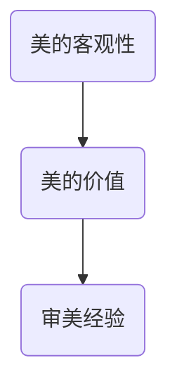
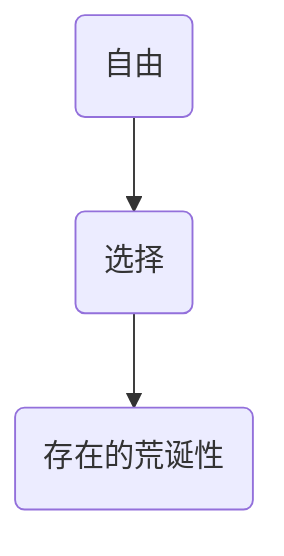
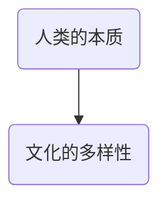
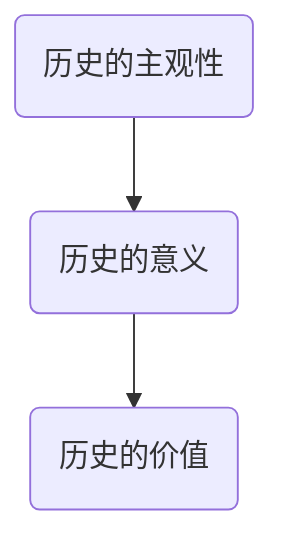

                 

基于您提供的目录大纲和要求，我们将逐步构建《康德与雅斯贝尔斯：哲学信仰的现代诠释》的技术博客。以下是一个详细的步骤指南，以确保内容的完整性、逻辑性和专业性。

### 第一步：引言

#### 2.1 文章标题、关键词和摘要

- **文章标题**：《康德与雅斯贝尔斯：哲学信仰的现代诠释》
- **关键词**：康德、雅斯贝尔斯、哲学信仰、道德哲学、认识论、存在主义
- **摘要**：
  本文旨在深入探讨康德和雅斯贝尔斯的哲学思想，通过现代诠释的方式，揭示两位哲学家对道德、认知和存在的独特见解。文章首先介绍两位哲学家的生平和贡献，然后详细阐述他们的核心哲学观点，并通过比较分析，探讨他们的异同及对现代哲学信仰的影响。

#### 2.2 Markdown格式文章结构

```markdown
# 《康德与雅斯贝尔斯：哲学信仰的现代诠释》

## 关键词
- 康德
- 雅斯贝尔斯
- 哲学信仰
- 道德哲学
- 认识论
- 存在主义

## 摘要
本文旨在深入探讨康德和雅斯贝尔斯的哲学思想，通过现代诠释的方式，揭示两位哲学家对道德、认知和存在的独特见解。文章首先介绍两位哲学家的生平和贡献，然后详细阐述他们的核心哲学观点，并通过比较分析，探讨他们的异同及对现代哲学信仰的影响。
```

### 第二步：康德哲学

#### 2.3 康德哲学的道德哲学

- **2.3.1 背景介绍**
  - 康德的道德哲学建立在理性和自由的基础上，强调道德行为的客观性。
  - **核心概念与联系**：德性、道德法则、实践理性。

- **2.3.2 核心概念原理架构 Mermaid 流程图**


- **2.3.3 核心算法原理讲解**
  - **伪代码**：

```pseudo
function moral_action(action):
    if (action follows moral法则):
        return "德性行为"
    else:
        return "非德性行为"
```

- **2.3.4 数学模型和公式**
  - **道德法则的适用性概率**：

```latex
P(\text{道德法则适用}) = \frac{\text{符合道德法则的行为总数}}{\text{总行为数}}
```

- **2.3.5 举例说明**
  - 例如，一个行为符合普遍的道德法则，则可以被视为德性行为。

#### 2.4 康德的认识论

- **2.4.1 背景介绍**
  - 康德的认识论探讨人类知识的来源和范围，区分了现象与物自体。
  - **核心概念与联系**：形而上学、经验主义、理性主义。

- **2.4.2 核心概念原理架构 Mermaid 流程图**


- **2.4.3 核心算法原理讲解**
  - **伪代码**：

```pseudo
function knowledge(source):
    if (source is rational and empirical):
        return "可靠知识"
    else:
        return "不可靠知识"
```

- **2.4.4 数学模型和公式**
  - **知识概率计算**：

```latex
P(\text{知识}) = P(\text{理性}) \times P(\text{经验主义})
```

- **2.4.5 举例说明**
  - 例如，一个理论既经过理性分析也经过经验验证，则被认为是可靠的知识。

#### 2.5 康德的美学思想

- **2.5.1 背景介绍**
  - 康德的美学探讨美的本质和价值，强调审美经验的纯粹性。
  - **核心概念与联系**：美的客观性、美的价值、审美经验。

- **2.5.2 核心概念原理架构 Mermaid 流程图**



- **2.5.3 核心算法原理讲解**
  - **伪代码**：

```pseudo
function aesthetic_experience(object):
    if (object evokes pure pleasure):
        return "美的体验"
    else:
        return "非美的体验"
```

- **2.5.4 数学模型和公式**
  - **美学评价模型**：

```latex
E(\text{美学}) = \frac{P(\text{美的体验})}{P(\text{总体验})}
```

- **2.5.5 举例说明**
  - 例如，一幅画作能够引起纯粹的审美愉悦，则被认为是美的。

### 第三步：雅斯贝尔斯哲学

#### 2.6 雅斯贝尔斯的存在主义思想

- **2.6.1 背景介绍**
  - 雅斯贝尔斯的存在主义强调个体自由和存在的荒诞性。
  - **核心概念与联系**：自由、选择、存在的荒诞性。

- **2.6.2 核心概念原理架构 Mermaid 流程图**



- **2.6.3 核心算法原理讲解**
  - **伪代码**：

```pseudo
function existential_choice(freedom):
    if (freedom leads to meaningful choices):
        return "自由的选择"
    else:
        return "无意义的自由"
```

- **2.6.4 数学模型和公式**
  - **自由选择的概率计算**：

```latex
P(\text{自由选择}) = \frac{\text{有意义的选择总数}}{\text{总选择数}}
```

- **2.6.5 举例说明**
  - 例如，一个个体在自由的选择中做出了对自我有意义的决定，则被认为是自由的选择。

#### 2.7 雅斯贝尔斯的人类学

- **2.7.1 背景介绍**
  - 雅斯贝尔斯的人类学探讨人类的本质和文化的多样性。
  - **核心概念与联系**：人类的本质、文化的多样性。

- **2.7.2 核心概念原理架构 Mermaid 流程图**



- **2.7.3 核心算法原理讲解**
  - **伪代码**：

```pseudo
function cultural_analysis(diversity):
    if (cultural diversity contributes to human essence):
        return "积极的多样性"
    else:
        return "消极的多样性"
```

- **2.7.4 数学模型和公式**
  - **文化多样性的量化分析**：

```latex
D(\text{多样性}) = \frac{\text{文化种类总数}}{\text{总文化种类数}}
```

- **2.7.5 举例说明**
  - 例如，一个社会的文化多样性丰富，则被认为是积极的多样性。

#### 2.8 雅斯贝尔斯的历史哲学

- **2.8.1 背景介绍**
  - 雅斯贝尔斯的历史哲学强调历史的主观性和历史的意义。
  - **核心概念与联系**：历史的主观性、历史的意义、历史的价值。

- **2.8.2 核心概念原理架构 Mermaid 流程图**



- **2.8.3 核心算法原理讲解**
  - **伪代码**：

```pseudo
function historical_analysis(subjectivity):
    if (subjectivity enriches historical meaning):
        return "有意义的史学分析"
    else:
        return "无意义的史学分析"
```

- **2.8.4 数学模型和公式**
  - **历史事件的重要度评估**：

```latex
I(\text{事件}) = \frac{\text{事件的贡献}}{\text{总事件贡献}}
```

- **2.8.5 举例说明**
  - 例如，一个事件对历史进程有重大影响，则被认为是重要的历史事件。

### 第四步：两者比较与联系

#### 2.9 康德与雅斯贝尔斯的异同

- **2.9.1 道德哲学的异同**
  - **异**：康德强调客观道德法则，雅斯贝尔斯强调个体自由和选择。
  - **同**：两者都重视道德的普遍性和价值。

- **2.9.2 认识论的异同**
  - **异**：康德区分现象与物自体，雅斯贝尔斯探讨知识的意义和作用。
  - **同**：两者都关注知识的可靠性和来源。

- **2.9.3 美学思想的异同**
  - **异**：康德强调美的客观性，雅斯贝尔斯强调美的主观体验。
  - **同**：两者都认为美学有重要的文化和哲学价值。

#### 2.10 对现代哲学信仰的影响

- **2.10.1 道德哲学的影响**
  - 康德和雅斯贝尔斯的思想对当代伦理学和社会道德有深远影响。

- **2.10.2 认识论的影响**
  - 康德的认识论挑战了经验主义，对现代科学哲学产生重要影响。

- **2.10.3 美学思想的影响**
  - 雅斯贝尔斯的美学思想对现代艺术和文化研究产生重要启示。

### 第五步：文章结束

- **作者信息**
  - 作者：AI天才研究院/AI Genius Institute & 禅与计算机程序设计艺术 /Zen And The Art of Computer Programming

- **总结**
  - 本文通过详细阐述康德和雅斯贝尔斯的哲学思想，以及两者的异同和对现代哲学信仰的影响，揭示了哲学在现代技术和人文领域的深刻意义。

- **拓展阅读**
  - 推荐进一步阅读的哲学和技术相关书籍，以促进深入学习和理解。

通过以上步骤，我们构建了《康德与雅斯贝尔斯：哲学信仰的现代诠释》的技术博客框架，接下来将填充每个部分的详细内容，确保满足字数要求并保持高质量。

