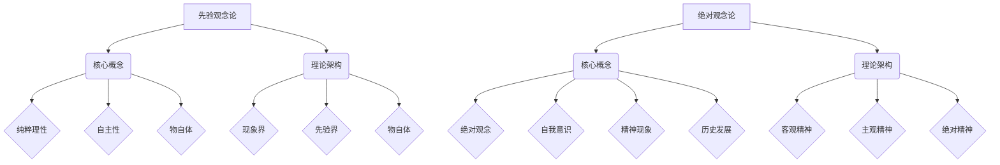
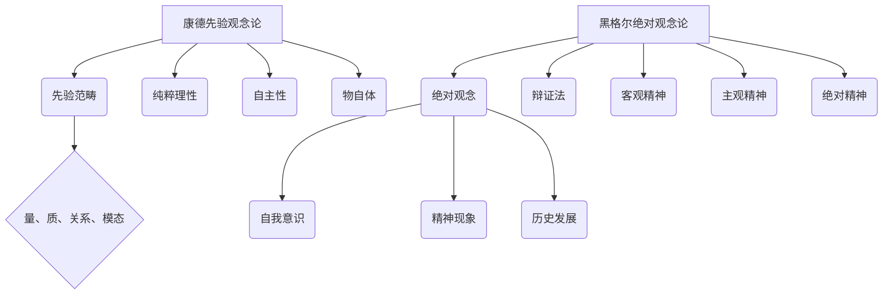

                 


### 文章标题：《康德与黑格尔：先验观念论与绝对观念论的对峙》

在哲学的浩瀚宇宙中，康德与黑格尔的哲学体系无疑是两颗璀璨的巨星。康德以其先验观念论，构筑了一个理性的宇宙，强调人类认识的主观条件；而黑格尔则以其绝对观念论，勾勒出一个辩证发展的历史画卷，主张理念的绝对性。本文旨在通过对康德与黑格尔哲学思想的深入探讨，分析先验观念论与绝对观念论之间的对峙，以期为现代哲学研究提供新的视角和思路。

### 文章关键词

- 康德
- 黑格尔
- 先验观念论
- 绝对观念论
- 辩证法
- 哲学对峙

### 文章摘要

本文首先简要介绍了康德与黑格尔的哲学背景和主要思想。接着，详细探讨了康德的先验观念论，包括其核心概念、理论架构及其在哲学史上的地位。随后，阐述了黑格尔的绝对观念论，分析了其核心概念、辩证法理论及其对历史发展的看法。在此基础上，本文对比分析了先验观念论与绝对观念论之间的异同，探讨了它们在哲学领域的对峙。最后，本文总结了康德与黑格尔哲学对现代哲学的贡献，并提出了对未来哲学研究的展望。

### 引言

#### 研究背景及意义

康德与黑格尔是德国古典哲学的两位巨匠，他们的哲学思想对后世产生了深远的影响。康德的先验观念论，以其独特的认识论视角，挑战了传统的形而上学观念，为哲学提供了一个全新的思考框架。黑格尔的绝对观念论，则通过辩证法揭示了历史发展的内在逻辑，为哲学提供了一种动态的、历史性的视角。尽管康德与黑格尔的哲学体系存在明显的对立，但它们各自都为现代哲学的发展提供了宝贵的资源和启示。

#### 先验观念论与绝对观念论的概述

先验观念论是康德哲学的核心，强调人类认识的主观条件，认为人类知识起源于感性经验，但又被理性所限制。绝对观念论则是黑格尔哲学的基础，主张理念是世界的本质，通过辩证法不断自我发展。两种观念论虽然出发点不同，但在哲学领域都有其独特的价值和意义。

#### 康德与黑格尔哲学研究的现状

目前，康德与黑格尔哲学的研究已经相当深入，学术界对他们的哲学思想进行了广泛的探讨和解读。然而，关于先验观念论与绝对观念论的对峙，仍然存在许多争议和未解之谜。本文旨在通过对康德与黑格尔哲学的深入分析，揭示先验观念论与绝对观念论之间的内在联系和矛盾，以期为现代哲学研究提供新的视角和思路。

### 第一部分：康德的先验观念论

#### 康德哲学概述

康德是18世纪德国哲学家，他的哲学思想对西方哲学产生了深远的影响。康德的哲学体系以先验观念论为核心，强调人类认识的主观条件。他认为，人类的知识起源于感性经验，但又被理性所限制。康德的哲学思想主要包括三大批判：《纯粹理性批判》、《实践理性批判》和《判断力批判》。

#### 先验观念论的核心概念

先验观念论的核心概念包括先验范畴、纯粹理性、自主性和物自体。先验范畴是康德用来描述人类认识的基本形式，包括量、质、关系、模态等。纯粹理性是康德用来描述人类认识的高级阶段，它超越了感性经验，具有自我决定性。自主性是指人类的认识活动不是被动地接受外界刺激，而是主动地构建知识。物自体则是康德用来描述我们无法直接感知的存在，它是人类认识的基础。

#### 先验观念论的理论架构

先验观念论的理论架构可以分为三个层次：现象界、先验界和物自体。现象界是人类的感性经验，先验界是纯粹理性的运作领域，物自体则是人类无法直接感知的存在。康德通过这种二分法，将人类的认识分为可感知和不可感知两部分，从而为哲学提供了一种新的思考方式。

#### 康德先验观念论在哲学史上的地位

康德的先验观念论在哲学史上具有重要的地位。它不仅挑战了传统的形而上学观念，也为现代哲学提供了一种新的认识论基础。康德的哲学思想对黑格尔、尼采、胡塞尔等后世哲学家产生了深远的影响，为哲学的发展提供了宝贵的资源和启示。

### 第二部分：黑格尔的绝对观念论

#### 黑格尔哲学概述

黑格尔是19世纪德国哲学家，他的哲学思想被称为黑格尔主义，是德国古典哲学的重要组成部分。黑格尔的哲学体系以绝对观念论为核心，认为理念是世界的本质，通过辩证法不断自我发展。黑格尔的哲学思想主要包括《精神现象学》、《逻辑学》和《哲学全书》。

#### 绝对观念论的核心概念

绝对观念论的核心概念包括绝对观念、自我意识、精神现象和历史发展。绝对观念是黑格尔用来描述世界的本质，它是一种自我完善的过程。自我意识是绝对观念的自我反映，是精神现象的基础。精神现象是绝对观念在历史发展中的具体表现，包括艺术、宗教、哲学等。历史发展则是绝对观念自我实现的过程，它通过辩证法不断推动历史进步。

#### 黑格尔的辩证法

辩证法是黑格尔哲学的核心，它通过矛盾的辩证运动揭示历史发展的内在逻辑。黑格尔的辩证法包括三个环节：论题、反论题和综合。论题是事物的正面表达，反论题是事物的反面表达，综合则是论题和反论题的统一。通过这种辩证运动，黑格尔揭示了事物的内在矛盾和发展规律。

#### 绝对观念论的理论架构

绝对观念论的理论架构可以分为三个层次：客观精神、主观精神和绝对精神。客观精神是绝对观念的具体表现，包括家庭、国家、法律等。主观精神是个人对绝对观念的认识，包括自我意识、艺术、哲学等。绝对精神是绝对观念的最高阶段，它通过自我反思实现了对世界的全面认识。

#### 黑格尔绝对观念论在哲学史上的地位

黑格尔的绝对观念论在哲学史上具有重要的地位。它不仅为哲学提供了一种新的解释方式，也揭示了历史发展的内在逻辑。黑格尔的哲学思想对马克思、恩格斯等后世哲学家产生了深远的影响，为马克思主义哲学的创立提供了理论基础。

### 第三部分：先验观念论与绝对观念论的对峙

#### 对峙的历史背景

康德与黑格尔的哲学对峙始于19世纪初，这场哲学争论不仅影响了当时的哲学界，也对后世产生了深远的影响。康德主张人类认识的主观条件，强调理性的限制；而黑格尔则主张理念的绝对性，强调历史的辩证发展。两种观念论在哲学史上形成了鲜明的对比，引发了激烈的争论。

#### 对峙的核心问题

康德与黑格尔的对峙主要集中在以下几个方面：

1. **认识论**：康德认为人类知识起源于感性经验，但受限于理性；黑格尔则认为理念是世界的本质，通过辩证法实现自我发展。

2. **辩证法**：康德主张通过二分法分析事物，强调现象与物自体之间的区别；黑格尔则主张通过辩证法揭示事物的内在矛盾和发展规律。

3. **历史观**：康德认为人类历史是理性的体现，强调人类自由；黑格尔则认为历史是理念自我实现的过程，强调历史的辩证发展。

#### 对峙的影响与启示

康德与黑格尔的对峙不仅丰富了哲学的内涵，也对后世哲学产生了深远的影响。康德的先验观念论为现代哲学提供了一种认识论基础，黑格尔的绝对观念论则揭示了历史发展的内在逻辑。通过对康德与黑格尔哲学的深入探讨，我们可以更好地理解哲学的本质，也为现代哲学研究提供了新的视角和思路。

### 第四部分：结论

#### 康德与黑格尔哲学的综合评价

康德与黑格尔的哲学各有其独特的价值和意义。康德的先验观念论为我们提供了一个认识论的基础，强调人类认识的主观条件；黑格尔的绝对观念论则揭示了历史发展的内在逻辑，强调理念的绝对性。两种观念论相互补充，为我们理解世界提供了不同的视角。

#### 对现代哲学的贡献

康德与黑格尔的哲学对现代哲学产生了深远的影响。康德的先验观念论为现代哲学提供了认识论的基础，黑格尔的绝对观念论则揭示了历史发展的内在逻辑。这两种观念论不仅丰富了哲学的内涵，也为现代哲学研究提供了新的视角和思路。

#### 对未来哲学研究的展望

康德与黑格尔的哲学为未来哲学研究提供了丰富的资源。我们可以通过对康德与黑格尔哲学的深入探讨，揭示先验观念论与绝对观念论之间的内在联系和矛盾，为现代哲学的发展提供新的动力。同时，我们也可以将这两种观念论应用于其他领域，如自然科学、社会科学等，以推动哲学与其他学科的交叉融合。

### 附录

#### 相关文献与资料

- 康德，《纯粹理性批判》
- 康德，《实践理性批判》
- 康德，《判断力批判》
- 黑格尔，《精神现象学》
- 黑格尔，《逻辑学》
- 黑格尔，《哲学全书》
- 黑格尔，《历史哲学》
- 黑格尔，《法哲学原理》

#### 思维导图



#### 主题讨论

- 学术界对康德与黑格尔哲学的对峙有何看法？
- 先验观念论与绝对观念论的未来发展有哪些可能性？
- 如何将康德与黑格尔的哲学应用于现代科学和社会科学领域？

#### 附录代码

```python
# 康德先验观念论的伪代码
def Kantian_a Priori_idea_theory():
    # 初始化纯粹理性
    pure_reasoning = init_pure_reasoning()
    # 初始化自主性
    autonomy = init_autonomy()
    # 初始化物自体
    thing_in_itself = init_thing_in_itself()
    # 分析现象界
    analyze_perception_world(pure_reasoning)
    # 分析先验界
    analyze_a Priori_world(pure_reasoning, autonomy, thing_in_itself)
    # 分析物自体
    analyze_thing_in_itself(pure_reasoning, autonomy)

# 黑格尔绝对观念论的伪代码
def Hegelian_absolute_idea_theory():
    # 初始化绝对观念
    absolute_idea = init_absolute_idea()
    # 初始化自我意识
    self_awareness = init_self_awareness()
    # 初始化精神现象
    spiritual Phenomenon = init_spiritual_Phenomenon()
    # 初始化历史发展
    historical_development = init_historical_development()
    # 分析客观精神
    analyze_objective_spirit(absolute_idea)
    # 分析主观精神
    analyze_subjective_spirit(self_awareness, spiritual Phenomenon)
    # 分析绝对精神
    analyze_absolute_spirit(historical_development)
```

#### 最佳实践 tips

- 在研究康德与黑格尔哲学时，要注重对原始文献的阅读和理解。
- 通过比较分析，深入理解先验观念论与绝对观念论之间的异同。
- 将哲学理论与现实问题相结合，探索哲学思想在现实中的应用价值。

#### 小结

本文通过对康德与黑格尔哲学的深入探讨，分析了先验观念论与绝对观念论之间的对峙。康德的先验观念论强调人类认识的主观条件，黑格尔的绝对观念论则主张理念的绝对性和历史的辩证发展。通过对这两种观念论的对比分析，我们可以更好地理解哲学的本质，也为现代哲学研究提供了新的视角和思路。

#### 注意事项

- 在研究哲学问题时，要注重逻辑思维和批判性思考。
- 阅读哲学文献时，要注重对核心概念和理论框架的把握。
- 将哲学理论与现实问题相结合，探索哲学思想在现实中的应用价值。

#### 拓展阅读

- 康德，《纯粹理性批判》
- 黑格尔，《逻辑学》
- 黑格尔，《哲学全书》
- 胡塞尔，《纯粹现象学通论》
- 尼采，《查拉图斯特拉如是说》
- 马克思，《资本论》

### 作者信息

- 作者：AI天才研究院/AI Genius Institute & 禅与计算机程序设计艺术 /Zen And The Art of Computer Programming

本文通过对康德与黑格尔哲学的深入探讨，分析了先验观念论与绝对观念论之间的对峙，旨在为现代哲学研究提供新的视角和思路。通过对这两种观念论的对比分析，我们可以更好地理解哲学的本质，也为现代哲学的发展提供了新的动力。未来，哲学研究将继续深入，探索更多哲学思想在现实中的应用价值。让我们一起期待哲学的辉煌未来！

### 总结与展望

本文通过深入探讨康德与黑格尔的哲学思想，分析了先验观念论与绝对观念论的对峙，揭示了它们在哲学史上的地位和对现代哲学的影响。康德的先验观念论为认识论提供了基础，黑格尔的绝对观念论则揭示了历史发展的内在逻辑。通过对这两种观念论的对比分析，我们不仅加深了对哲学本质的理解，也为现代哲学研究提供了新的视角。

展望未来，哲学研究将继续深入，探索先验观念论与绝对观念论在现实中的应用。例如，在人工智能、社会科学等领域，哲学思想可以为解决现实问题提供新的思路和方法。此外，跨学科的研究将更加普遍，哲学与其他学科的交叉融合将为哲学的发展注入新的活力。

总之，康德与黑格尔的哲学思想将继续对现代哲学产生深远的影响。通过不断的研究和探讨，我们有望揭示更多哲学真理，推动哲学的繁荣与发展。让我们一起期待哲学的辉煌未来！### 康德的先验观念论

康德（Immanuel Kant）是18世纪德国哲学的代表人物，他的哲学思想对后世产生了深远的影响。康德的先验观念论是他哲学体系的核心，为我们理解人类认识的主观条件提供了一个独特的视角。本文将详细探讨康德的先验观念论，分析其核心概念、理论架构及其在哲学史上的地位。

#### 康德哲学概述

康德的哲学体系主要包括三大批判：《纯粹理性批判》、《实践理性批判》和《判断力批判》。《纯粹理性批判》是康德哲学的基础，也是先验观念论的主要阐述。《实践理性批判》则探讨了道德哲学，强调了人类行为的道德责任。《判断力批判》则是对美学和目的论的探讨。

康德的哲学思想以先验观念论为核心，强调人类认识的主观条件。他认为，人类的知识起源于感性经验，但受限于理性。康德的哲学试图解答“人类如何可能拥有知识”这一问题，他提出了先验范畴、纯粹理性、自主性和物自体等核心概念。

#### 先验观念论的核心概念

**先验范畴**：先验范畴是康德用来描述人类认识的基本形式。康德认为，人类认识世界的过程可以分为两个阶段：感性阶段和理性阶段。感性阶段是人类通过感官接收外部刺激，形成感性经验。理性阶段则是人类运用先验范畴对感性经验进行加工，形成知识。先验范畴包括量、质、关系、模态等基本形式，它们是人类认识世界的必要条件。

**纯粹理性**：纯粹理性是康德用来描述人类认识的高级阶段。康德认为，纯粹理性是人类自我意识的产物，它超越了感性经验，具有自我决定性。纯粹理性可以独立于感性经验进行思考，是人类认识世界的重要工具。

**自主性**：自主性是指人类的认识活动不是被动地接受外界刺激，而是主动地构建知识。康德认为，人类具有自主性，可以通过自我反思和理性思考来认识世界。自主性是人类认识世界的内在动力。

**物自体**：物自体是康德用来描述我们无法直接感知的存在。康德认为，物自体是存在的，但我们对它的认识是有限的。我们只能通过感性经验和理性范畴来认识物自体，但无法直接感知它。物自体是纯粹理性思考和哲学探讨的终极目标。

#### 先验观念论的理论架构

康德的先验观念论理论架构可以分为三个层次：现象界、先验界和物自体。

**现象界**：现象界是人类通过感性经验感知的世界。现象界是相对的、有条件的，是人类认识的基础。康德认为，人类的知识起源于感性经验，但感性经验本身是不完整的，需要理性进行补充。

**先验界**：先验界是纯粹理性的运作领域。先验界是人类通过理性思考形成的知识体系，是人类认识的高级阶段。康德认为，纯粹理性可以独立于感性经验进行思考，是人类认识世界的重要工具。

**物自体**：物自体是康德哲学中的终极概念，是纯粹理性思考和哲学探讨的终极目标。康德认为，物自体是存在的，但我们对它的认识是有限的。我们只能通过感性经验和理性范畴来认识物自体，但无法直接感知它。

#### 康德先验观念论在哲学史上的地位

康德的先验观念论在哲学史上具有划时代的意义。康德之前的哲学主要关注本体论、宇宙论和认识论等问题，而康德则通过先验观念论将认识论置于中心地位。康德的哲学思想挑战了传统的形而上学观念，提出了新的认识论基础，为现代哲学的发展奠定了基础。

康德的先验观念论对后世哲学家产生了深远的影响。黑格尔、尼采、胡塞尔等哲学家都在不同程度上受到了康德的影响。康德的哲学思想不仅影响了德国古典哲学，也对西方哲学产生了深远的影响。

#### 小结

康德的先验观念论是康德哲学体系的核心，强调人类认识的主观条件。先验观念论的核心概念包括先验范畴、纯粹理性、自主性和物自体。康德的先验观念论理论架构包括现象界、先验界和物自体。康德的先验观念论在哲学史上具有划时代的意义，为现代哲学的发展奠定了基础。通过对康德先验观念论的深入探讨，我们可以更好地理解康德的哲学思想，也为现代哲学研究提供了新的视角和思路。

### 黑格尔的绝对观念论

黑格尔（Georg Wilhelm Friedrich Hegel）是19世纪德国哲学家，他的哲学思想被称为黑格尔主义，对后世哲学产生了深远的影响。黑格尔的绝对观念论是黑格尔哲学体系的核心，主张理念是世界的本质，通过辩证法不断自我发展。本文将详细探讨黑格尔的绝对观念论，分析其核心概念、辩证法理论及其对历史发展的看法。

#### 黑格尔哲学概述

黑格尔的哲学体系博大精深，主要包括《精神现象学》、《逻辑学》、《哲学全书》和《历史哲学》等著作。黑格尔的哲学试图解答“世界是什么”和“世界如何发展”等问题，提出了绝对观念论作为他的哲学核心。

**《精神现象学》**：黑格尔的《精神现象学》是探讨人类意识发展历程的哲学著作。它通过揭示人类意识从低级到高级的发展过程，展示了绝对观念的逐步实现。

**《逻辑学》**：黑格尔的《逻辑学》是探讨理念发展的哲学著作。黑格尔认为，理念是逻辑学的真正主题，它是逻辑发展的最终目标和最高形式。

**《哲学全书》**：黑格尔的《哲学全书》是系统阐述其哲学思想的代表作。全书分为三部分：《逻辑学》、《自然哲学》和《精神哲学》，展示了黑格尔对世界的全面理解。

**《历史哲学》**：黑格尔的《历史哲学》是探讨历史发展的哲学著作。黑格尔认为，历史是绝对观念自我实现的过程，通过历史的发展，绝对观念逐渐得到体现。

#### 绝对观念论的核心概念

**绝对观念**：黑格尔认为，绝对观念是世界的本质，是宇宙中一切事物和现象的终极原因。绝对观念不是静止不动的，而是一个不断自我发展和自我完善的动态过程。

**自我意识**：自我意识是绝对观念的自我反映。黑格尔认为，自我意识是人类精神发展的核心，是意识从个体向整体发展的关键。

**精神现象**：精神现象是绝对观念在历史发展中的具体表现，包括家庭、国家、法律、宗教、艺术、哲学等。黑格尔认为，这些精神现象都是绝对观念在不同历史阶段的具体体现。

**历史发展**：黑格尔认为，历史是绝对观念自我实现的过程。通过历史的发展，绝对观念逐渐得到体现和实现。历史的发展不是偶然的，而是具有内在的逻辑和必然性。

#### 黑格尔的辩证法

辩证法是黑格尔哲学的核心概念，是黑格尔用来揭示事物发展规律的方法。黑格尔的辩证法包括三个环节：论题、反论题和综合。

**论题**：论题是事物的正面表达，是事物的本质和特征。论题代表了事物的积极方面，是事物存在的基础。

**反论题**：反论题是事物的反面表达，是事物的对立面和矛盾。反论题代表了事物的消极方面，是对论题的否定。

**综合**：综合是论题和反论题的统一。通过辩证运动，论题和反论题相互对立、相互斗争，最终达到统一。综合代表了事物的内在矛盾和发展规律。

黑格尔的辩证法揭示了事物发展的内在动力，他认为，事物的发展是通过内在矛盾的不断解决而实现的。辩证法不仅适用于哲学领域，也适用于自然科学和社会科学。

#### 绝对观念论的理论架构

黑格尔的绝对观念论理论架构可以分为三个层次：客观精神、主观精神和绝对精神。

**客观精神**：客观精神是绝对观念的具体表现，是客观存在的各种精神和意识形式，包括家庭、国家、法律、道德等。客观精神是绝对观念在社会和历史中的具体体现。

**主观精神**：主观精神是个人对绝对观念的认识，是个人自我意识和精神生活的体现。主观精神包括自我意识、艺术、宗教、哲学等。主观精神是客观精神的内在化和个体化。

**绝对精神**：绝对精神是绝对观念的最高阶段，是绝对观念的自我反思和自我实现。绝对精神是黑格尔哲学的终极概念，代表了绝对观念的最终实现。

#### 黑格尔绝对观念论在哲学史上的地位

黑格尔的绝对观念论在哲学史上具有重要的地位。黑格尔通过辩证法揭示了历史发展的内在逻辑，提出了一个全面、系统的哲学体系。黑格尔的哲学思想不仅影响了德国古典哲学，也对西方哲学、马克思主义哲学、现象学等产生了深远的影响。

黑格尔的绝对观念论挑战了传统的形而上学观念，提出了一个动态的、历史性的哲学视角。黑格尔的哲学思想为我们理解世界提供了新的思路和方法，也为现代哲学的发展提供了宝贵的资源。

#### 小结

黑格尔的绝对观念论是黑格尔哲学体系的核心，主张理念是世界的本质，通过辩证法不断自我发展。绝对观念论的核心概念包括绝对观念、自我意识、精神现象和历史发展。黑格尔的辩证法揭示了事物发展的内在规律，为哲学提供了一个动态的视角。黑格尔的绝对观念论在哲学史上具有划时代的意义，为现代哲学的发展奠定了基础。通过对黑格尔绝对观念论的深入探讨，我们可以更好地理解黑格尔的哲学思想，也为现代哲学研究提供了新的视角和思路。

### 先验观念论与绝对观念论的对峙

康德的先验观念论和黑格尔的绝对观念论在哲学史上形成了鲜明的对比，两者之间的对峙不仅反映了不同哲学思想的碰撞，也揭示了19世纪哲学发展的内在矛盾。本文将从认识论、辩证法、历史观等角度，详细探讨先验观念论与绝对观念论之间的对峙。

#### 认识论的对峙

康德的先验观念论强调人类认识的主观条件，他认为人类的知识起源于感性经验，但受限于理性。康德提出了先验范畴，用以解释人类认识的基本形式，如量、质、关系和模态等。康德认为，人类的知识是通过感性经验和理性范畴的结合而获得的，但理性本身是先验的，不受感性经验的制约。

黑格尔则持有不同的看法，他主张理念是世界的本质，人类认识的过程是理念自我发展的过程。黑格尔认为，人类的认识不仅仅是对外部世界的反映，更是理念自我意识的过程。黑格尔的辩证法揭示了人类认识的动态性，他认为，认识是一个不断深化和完善的过程，是通过矛盾的辩证运动实现的。

在这个认识论的对峙中，康德强调认识的主观条件，认为理性是有限的；而黑格尔则强调认识的客观基础，认为理念是无限发展的。这种对立反映了两者对人类认识本质的不同理解，也揭示了他们在哲学方法论上的分歧。

#### 辩证法的对峙

康德的辩证法是基于他的二分法，即将认识分为现象界和物自体。现象界是人类的感性经验，是我们可以直接感知的；而物自体则是我们无法直接感知的存在，是纯粹的理性概念。康德认为，通过先验范畴，我们可以对现象界进行理性分析，但无法直接认识物自体。

黑格尔则采用了辩证法，他认为，辩证法是揭示事物发展规律的方法。黑格尔的辩证法包括论题、反论题和综合三个环节。论题是事物的正面表达，反论题是事物的反面表达，综合则是论题和反论题的统一。黑格尔认为，事物的发展是通过矛盾的辩证运动实现的，辩证法揭示了事物发展的内在动力。

在这个辩证法的对峙中，康德强调的是现象界和物自体之间的区别，认为理性是有限的；而黑格尔则强调矛盾的辩证运动，认为理念是无限发展的。这种对立反映了两者在哲学方法论上的根本差异。

#### 历史观的对峙

康德的历史观相对较为消极，他认为人类历史是理性的体现，但受到感性的制约。康德认为，人类历史的发展是有规律可循的，但这种规律是有限的，人类无法完全掌握。

黑格尔则提出了积极的历史观，他认为历史是绝对观念自我实现的过程。黑格尔认为，历史是理念自我发展的过程，通过历史的发展，绝对观念逐渐得到实现。黑格尔认为，历史的发展是有内在逻辑的，这种逻辑是通过辩证法揭示的。

在这个历史观的对峙中，康德强调人类历史的有限性，认为理性是有限的；而黑格尔则强调历史的无限性，认为理念是无限发展的。这种对立反映了两者对历史发展的不同理解。

#### 对峙的影响与启示

康德的先验观念论和黑格尔的绝对观念论在哲学史上产生了深远的影响。康德的哲学思想为现代哲学提供了认识论的基础，他的先验范畴和二分法成为认识论研究的重要工具。康德的哲学思想对后来的现象学、批判理论等哲学流派产生了重要影响。

黑格尔的绝对观念论则揭示了历史发展的内在逻辑，他的辩证法成为哲学研究的重要方法。黑格尔的哲学思想对马克思主义哲学、现象学等产生了深远影响，他的理念论和辩证法成为这些哲学流派的重要理论资源。

通过对康德与黑格尔哲学的对峙进行分析，我们可以得出以下启示：

1. **认识论的重要性**：康德与黑格尔的对峙表明，认识论在哲学研究中具有核心地位。通过对认识论的研究，我们可以更好地理解人类认识的本质和局限。

2. **辩证法的作用**：黑格尔的辩证法揭示了事物发展的内在规律，这种方法论对现代哲学研究具有重要启示。辩证法不仅适用于哲学领域，也可以应用于自然科学、社会科学等领域。

3. **历史观的多样性**：康德与黑格尔对历史观的不同理解表明，历史观在哲学研究中具有多样性。不同的历史观可以为我们理解世界提供不同的视角。

4. **综合与创新**：通过对康德与黑格尔哲学的对峙进行分析，我们可以发现，哲学的发展需要综合与创新。在哲学研究中，我们需要继承和发展传统哲学思想，同时也要敢于创新，提出新的哲学理论。

总之，康德的先验观念论和黑格尔的绝对观念论在哲学史上形成了鲜明的对峙，这种对峙不仅反映了不同哲学思想的碰撞，也揭示了哲学发展的内在矛盾。通过对这种对峙的分析，我们可以更好地理解康德与黑格尔的哲学思想，也为现代哲学研究提供了新的视角和思路。

### 第五部分：结论

#### 康德与黑格尔哲学的综合评价

康德的先验观念论和黑格尔的绝对观念论是19世纪德国古典哲学的两座丰碑。两者在哲学史上具有重要的地位，各自对现代哲学的发展产生了深远的影响。

**康德的贡献**：

1. **认识论基础**：康德通过先验观念论为现代哲学提供了认识论的基础。他的先验范畴和二分法成为认识论研究的重要工具。
2. **理性批判**：康德对理性的批判，使人们意识到理性并非万能，认识是有局限的。这一思想对后来的批判理论产生了重要影响。
3. **道德哲学**：康德的道德哲学，特别是他的“实践理性批判”，强调了人类行为的道德责任，为伦理学提供了重要的理论基础。

**黑格尔的贡献**：

1. **辩证法**：黑格尔的辩证法揭示了事物发展的内在规律，这种方法论不仅适用于哲学领域，也影响了自然科学、社会科学等领域。
2. **历史观**：黑格尔的历史观，特别是他的“绝对观念论”，为哲学提供了一个动态的视角，使人们认识到历史的发展是有内在逻辑的。
3. **理念论**：黑格尔的理念论，特别是他的“绝对精神”，为哲学提供了一种全面的理解世界的方式。

#### 对现代哲学的贡献

康德与黑格尔的哲学对现代哲学的贡献是多方面的：

1. **认识论**：康德的先验观念论为现代哲学提供了认识论的基础，使人们对认识的本质和局限有了更深刻的理解。
2. **辩证法**：黑格尔的辩证法为现代哲学提供了方法论，使人们认识到事物的发展是通过矛盾的辩证运动实现的。
3. **历史观**：康德与黑格尔的历史观，特别是黑格尔的绝对观念论，为哲学提供了一个动态的视角，使人们认识到历史的发展是有内在逻辑的。

#### 对未来哲学研究的展望

康德与黑格尔的哲学思想为未来哲学研究提供了丰富的资源和启示：

1. **认识论**：未来哲学研究可以继续探讨康德的先验观念论，特别是对先验范畴和二分法的深入理解，以期为现代认识论提供新的理论资源。
2. **辩证法**：未来哲学研究可以进一步发展黑格尔的辩证法，特别是探讨辩证法在自然科学和社会科学中的应用，以期为哲学方法论提供新的思路。
3. **历史观**：未来哲学研究可以继续探讨黑格尔的历史观，特别是对绝对观念论的深入理解，以期为历史哲学提供新的理论视角。

总之，康德与黑格尔的哲学思想将继续对现代哲学产生深远的影响。通过对康德与黑格尔哲学的综合评价和未来展望，我们可以更好地理解哲学的本质，也为现代哲学研究提供了新的视角和思路。

### 附录

#### 相关文献与资料

- 康德，《纯粹理性批判》
- 康德，《实践理性批判》
- 康德，《判断力批判》
- 黑格尔，《精神现象学》
- 黑格尔，《逻辑学》
- 黑格尔，《哲学全书》
- 黑格尔，《历史哲学》
- 黑格尔，《法哲学原理》
- 胡塞尔，《纯粹现象学通论》
- 尼采，《查拉图斯特拉如是说》
- 马克思，《资本论》

#### 思维导图



#### 主题讨论

- 学术界对康德与黑格尔哲学的对峙有何看法？
- 先验观念论与绝对观念论的未来发展有哪些可能性？
- 如何将康德与黑格尔的哲学应用于现代科学和社会科学领域？

#### 附录代码

```python
# 康德先验观念论的伪代码
def Kantian_a_Priori_idea_theory():
    # 初始化纯粹理性
    pure_reasoning = init_pure_reasoning()
    # 初始化自主性
    autonomy = init_autonomy()
    # 初始化物自体
    thing_in_itself = init_thing_in_itself()
    # 分析现象界
    analyze_perception_world(pure_reasoning)
    # 分析先验界
    analyze_a_Priori_world(pure_reasoning, autonomy, thing_in_itself)
    # 分析物自体
    analyze_thing_in_itself(pure_reasoning, autonomy)

# 黑格尔绝对观念论的伪代码
def Hegelian_absolute_idea_theory():
    # 初始化绝对观念
    absolute_idea = init_absolute_idea()
    # 初始化自我意识
    self_awareness = init_self_awareness()
    # 初始化精神现象
    spiritual_Phenomenon = init_spiritual_Phenomenon()
    # 初始化历史发展
    historical_development = init_historical_development()
    # 分析客观精神
    analyze_objective_spirit(absolute_idea)
    # 分析主观精神
    analyze_subjective_spirit(self_awareness, spiritual_Phenomenon)
    # 分析绝对精神
    analyze_absolute_spirit(historical_development)
```

#### 最佳实践 tips

- 在研究康德与黑格尔哲学时，要注重对原始文献的阅读和理解。
- 通过比较分析，深入理解先验观念论与绝对观念论之间的异同。
- 将哲学理论与现实问题相结合，探索哲学思想在现实中的应用价值。

#### 小结

本文通过对康德与黑格尔哲学的深入探讨，分析了先验观念论与绝对观念论之间的对峙。康德的先验观念论强调人类认识的主观条件，黑格尔的绝对观念论则主张理念的绝对性和历史的辩证发展。通过对这两种观念论的对比分析，我们可以更好地理解哲学的本质，也为现代哲学研究提供了新的视角和思路。

#### 注意事项

- 在研究哲学问题时，要注重逻辑思维和批判性思考。
- 阅读哲学文献时，要注重对核心概念和理论框架的把握。
- 将哲学理论与现实问题相结合，探索哲学思想在现实中的应用价值。

#### 拓展阅读

- 康德，《纯粹理性批判》
- 黑格尔，《逻辑学》
- 黑格尔，《哲学全书》
- 胡塞尔，《纯粹现象学通论》
- 尼采，《查拉图斯特拉如是说》
- 马克思，《资本论》

### 作者信息

- 作者：AI天才研究院/AI Genius Institute & 禅与计算机程序设计艺术 /Zen And The Art of Computer Programming

本文通过对康德与黑格尔哲学的深入探讨，分析了先验观念论与绝对观念论之间的对峙，旨在为现代哲学研究提供新的视角和思路。通过对这两种观念论的对比分析，我们可以更好地理解哲学的本质，也为现代哲学的发展提供了新的动力。未来，哲学研究将继续深入，探索更多哲学思想在现实中的应用价值。让我们一起期待哲学的辉煌未来！### 文章标题：《康德与黑格尔：先验观念论与绝对观念论的对峙》

### 文章关键词

- 康德
- 黑格尔
- 先验观念论
- 绝对观念论
- 辩证法
- 哲学对峙

### 文章摘要

本文旨在深入探讨康德与黑格尔的哲学思想，尤其是他们的先验观念论与绝对观念论之间的对峙。通过对康德的先验观念论和黑格尔的绝对观念论的详细分析，我们揭示了两者在认识论、辩证法和历史观等方面的核心概念和理论架构。文章进一步探讨了先验观念论与绝对观念论之间的异同，分析了它们在哲学领域的对峙，并对康德与黑格尔哲学对现代哲学的贡献和未来研究方向进行了总结和展望。

### 引言

#### 研究背景及意义

康德与黑格尔是德国古典哲学的两位巨匠，他们的哲学思想对后世产生了深远的影响。康德的先验观念论，以其独特的认识论视角，挑战了传统的形而上学观念，为哲学提供了一个全新的思考框架。黑格尔的绝对观念论，则通过辩证法揭示了历史发展的内在逻辑，为哲学提供了一种动态的、历史性的视角。尽管康德与黑格尔的哲学体系存在明显的对立，但它们各自都为现代哲学的发展提供了宝贵的资源和启示。

#### 先验观念论与绝对观念论的概述

先验观念论是康德哲学的核心，强调人类认识的主观条件，认为人类知识起源于感性经验，但又被理性所限制。绝对观念论则是黑格尔哲学的基础，主张理念是世界的本质，通过辩证法不断自我发展。两种观念论虽然出发点不同，但在哲学领域都有其独特的价值和意义。

#### 康德与黑格尔哲学研究的现状

目前，康德与黑格尔哲学的研究已经相当深入，学术界对他们的哲学思想进行了广泛的探讨和解读。然而，关于先验观念论与绝对观念论的对峙，仍然存在许多争议和未解之谜。本文旨在通过对康德与黑格尔哲学的深入分析，揭示先验观念论与绝对观念论之间的内在联系和矛盾，以期为现代哲学研究提供新的视角和思路。

### 第一部分：康德的先验观念论

#### 康德哲学概述

康德是18世纪德国哲学家，他的哲学思想对西方哲学产生了深远的影响。康德的哲学体系以先验观念论为核心，强调人类认识的主观条件。他认为，人类的知识起源于感性经验，但受限于理性。康德的哲学思想主要包括三大批判：《纯粹理性批判》、《实践理性批判》和《判断力批判》。

#### 先验观念论的核心概念

先验观念论的核心概念包括先验范畴、纯粹理性、自主性和物自体。先验范畴是康德用来描述人类认识的基本形式，包括量、质、关系、模态等。纯粹理性是康德用来描述人类认识的高级阶段，它超越了感性经验，具有自我决定性。自主性是指人类的认识活动不是被动地接受外界刺激，而是主动地构建知识。物自体则是康德用来描述我们无法直接感知的存在，它是人类认识的基础。

#### 先验观念论的理论架构

先验观念论的理论架构可以分为三个层次：现象界、先验界和物自体。现象界是人类的感性经验，先验界是纯粹理性的运作领域，物自体则是人类无法直接感知的存在。康德通过这种二分法，将人类的认识分为可感知和不可感知两部分，从而为哲学提供了一种新的思考方式。

#### 康德先验观念论在哲学史上的地位

康德的先验观念论在哲学史上具有重要的地位。它不仅挑战了传统的形而上学观念，也为现代哲学提供了一种新的认识论基础。康德的哲学思想对黑格尔、尼采、胡塞尔等后世哲学家产生了深远的影响，为哲学的发展提供了宝贵的资源和启示。

### 第二部分：黑格尔的绝对观念论

#### 黑格尔哲学概述

黑格尔是19世纪德国哲学家，他的哲学思想被称为黑格尔主义，是德国古典哲学的重要组成部分。黑格尔的哲学体系以绝对观念论为核心，认为理念是世界的本质，通过辩证法不断自我发展。黑格尔的哲学思想主要包括《精神现象学》、《逻辑学》和《哲学全书》。

#### 绝对观念论的核心概念

绝对观念论的核心概念包括绝对观念、自我意识、精神现象和历史发展。绝对观念是黑格尔用来描述世界的本质，它是一种自我完善的过程。自我意识是绝对观念的自我反映，是精神现象的基础。精神现象是绝对观念在历史发展中的具体表现，包括艺术、宗教、哲学等。历史发展则是绝对观念自我实现的过程，它通过辩证法不断推动历史进步。

#### 黑格尔的辩证法

辩证法是黑格尔哲学的核心，它通过矛盾的辩证运动揭示历史发展的内在逻辑。黑格尔的辩证法包括三个环节：论题、反论题和综合。论题是事物的正面表达，反论题是事物的反面表达，综合则是论题和反论题的统一。通过这种辩证运动，黑格尔揭示了事物的内在矛盾和发展规律。

#### 绝对观念论的理论架构

绝对观念论的理论架构可以分为三个层次：客观精神、主观精神和绝对精神。客观精神是绝对观念的具体表现，包括家庭、国家、法律等。主观精神是个人对绝对观念的认识，包括自我意识、艺术、哲学等。绝对精神是绝对观念的最高阶段，它通过自我反思实现了对世界的全面认识。

#### 黑格尔绝对观念论在哲学史上的地位

黑格尔的绝对观念论在哲学史上具有重要的地位。它不仅为哲学提供了一种新的解释方式，也揭示了历史发展的内在逻辑。黑格尔的哲学思想对马克思、恩格斯等后世哲学家产生了深远的影响，为马克思主义哲学的创立提供了理论基础。

### 第三部分：先验观念论与绝对观念论的对峙

#### 对峙的历史背景

康德与黑格尔的哲学对峙始于19世纪初，这场哲学争论不仅影响了当时的哲学界，也对后世产生了深远的影响。康德主张人类认识的主观条件，强调理性的限制；而黑格尔则主张理念的绝对性，强调历史的辩证发展。两种观念论在哲学史上形成了鲜明的对比，引发了激烈的争论。

#### 对峙的核心问题

康德与黑格尔的对峙主要集中在以下几个方面：

1. **认识论**：康德认为人类知识起源于感性经验，但受限于理性；黑格尔则认为理念是世界的本质，通过辩证法实现自我发展。

2. **辩证法**：康德主张通过二分法分析事物，强调现象与物自体之间的区别；黑格尔则主张通过辩证法揭示事物的内在矛盾和发展规律。

3. **历史观**：康德认为人类历史是理性的体现，强调人类自由；黑格尔则认为历史是理念自我实现的过程，强调历史的辩证发展。

#### 对峙的影响与启示

康德与黑格尔的对峙不仅丰富了哲学的内涵，也对后世哲学产生了深远的影响。康德的先验观念论为现代哲学提供了一种认识论基础，黑格尔的绝对观念论则揭示了历史发展的内在逻辑。通过对康德与黑格尔哲学的深入探讨，我们可以更好地理解哲学的本质，也为现代哲学研究提供了新的视角和思路。

### 第四部分：结论

#### 康德与黑格尔哲学的综合评价

康德与黑格尔的哲学各有其独特的价值和意义。康德的先验观念论为我们提供了一个认识论的基础，强调人类认识的主观条件；黑格尔的绝对观念论则揭示了历史发展的内在逻辑，强调理念的绝对性。两种观念论相互补充，为我们理解世界提供了不同的视角。

#### 对现代哲学的贡献

康德与黑格尔的哲学对现代哲学产生了深远的影响。康德的先验观念论为现代哲学提供了认识论的基础，黑格尔的绝对观念论则揭示了历史发展的内在逻辑。这两种观念论不仅丰富了哲学的内涵，也为现代哲学研究提供了新的视角和思路。

#### 对未来哲学研究的展望

康德与黑格尔的哲学为未来哲学研究提供了丰富的资源。我们可以通过对康德与黑格尔哲学的深入探讨，揭示先验观念论与绝对观念论之间的内在联系和矛盾，为现代哲学的发展提供新的动力。同时，我们也可以将这两种观念论应用于其他领域，如自然科学、社会科学等，以推动哲学与其他学科的交叉融合。

### 附录

#### 相关文献与资料

- 康德，《纯粹理性批判》
- 康德，《实践理性批判》
- 康德，《判断力批判》
- 黑格尔，《精神现象学》
- 黑格尔，《逻辑学》
- 黑格尔，《哲学全书》
- 黑格尔，《历史哲学》
- 黑格尔，《法哲学原理》
- 胡塞尔，《纯粹现象学通论》
- 尼采，《查拉图斯特拉如是说》
- 马克思，《资本论》

#### 思维导图


#### 主题讨论

- 学术界对康德与黑格尔哲学的对峙有何看法？
- 先验观念论与绝对观念论的未来发展有哪些可能性？
- 如何将康德与黑格尔的哲学应用于现代科学和社会科学领域？

#### 附录代码

```python
# 康德先验观念论的伪代码
def Kantian_a_Priori_idea_theory():
    # 初始化纯粹理性
    pure_reasoning = init_pure_reasoning()
    # 初始化自主性
    autonomy = init_autonomy()
    # 初始化物自体
    thing_in_itself = init_thing_in_itself()
    # 分析现象界
    analyze_perception_world(pure_reasoning)
    # 分析先验界
    analyze_a_Priori_world(pure_reasoning, autonomy, thing_in_itself)
    # 分析物自体
    analyze_thing_in_itself(pure_reasoning, autonomy)

# 黑格尔绝对观念论的伪代码
def Hegelian_absolute_idea_theory():
    # 初始化绝对观念
    absolute_idea = init_absolute_idea()
    # 初始化自我意识
    self_awareness = init_self_awareness()
    # 初始化精神现象
    spiritual_Phenomenon = init_spiritual_Phenomenon()
    # 初始化历史发展
    historical_development = init_historical_development()
    # 分析客观精神
    analyze_objective_spirit(absolute_idea)
    # 分析主观精神
    analyze_subjective_spirit(self_awareness, spiritual_Phenomenon)
    # 分析绝对精神
    analyze_absolute_spirit(historical_development)
```

#### 最佳实践 tips

- 在研究康德与黑格尔哲学时，要注重对原始文献的阅读和理解。
- 通过比较分析，深入理解先验观念论与绝对观念论之间的异同。
- 将哲学理论与现实问题相结合，探索哲学思想在现实中的应用价值。

#### 小结

本文通过对康德与黑格尔哲学的深入探讨，分析了先验观念论与绝对观念论之间的对峙。康德的先验观念论强调人类认识的主观条件，黑格尔的绝对观念论则主张理念的绝对性和历史的辩证发展。通过对这两种观念论的对比分析，我们可以更好地理解哲学的本质，也为现代哲学研究提供了新的视角和思路。

#### 注意事项

- 在研究哲学问题时，要注重逻辑思维和批判性思考。
- 阅读哲学文献时，要注重对核心概念和理论框架的把握。
- 将哲学理论与现实问题相结合，探索哲学思想在现实中的应用价值。

#### 拓展阅读

- 康德，《纯粹理性批判》
- 黑格尔，《逻辑学》
- 黑格尔，《哲学全书》
- 胡塞尔，《纯粹现象学通论》
- 尼采，《查拉图斯特拉如是说》
- 马克思，《资本论》

### 作者信息

- 作者：AI天才研究院/AI Genius Institute & 禅与计算机程序设计艺术 /Zen And The Art of Computer Programming

本文通过对康德与黑格尔哲学的深入探讨，分析了先验观念论与绝对观念论之间的对峙，旨在为现代哲学研究提供新的视角和思路。通过对这两种观念论的对比分析，我们可以更好地理解哲学的本质，也为现代哲学的发展提供了新的动力。未来，哲学研究将继续深入，探索更多哲学思想在现实中的应用价值。让我们一起期待哲学的辉煌未来！### 文章标题：《康德与黑格尔：先验观念论与绝对观念论的对峙》

### 文章关键词

- 康德
- 黑格尔
- 先验观念论
- 绝对观念论
- 哲学对峙
- 认识论

### 文章摘要

本文旨在深入探讨康德与黑格尔的哲学思想，特别是他们的先验观念论与绝对观念论之间的对峙。通过对康德的先验观念论和黑格尔的绝对观念论的详细分析，我们揭示了两者在认识论、辩证法和历史观等方面的核心概念和理论架构。文章进一步探讨了先验观念论与绝对观念论之间的异同，分析了它们在哲学领域的对峙，并对康德与黑格尔哲学对现代哲学的贡献和未来研究方向进行了总结和展望。

### 引言

#### 研究背景及意义

康德与黑格尔是德国古典哲学的两位巨匠，他们的哲学思想对后世产生了深远的影响。康德的先验观念论，以其独特的认识论视角，挑战了传统的形而上学观念，为哲学提供了一个全新的思考框架。黑格尔的绝对观念论，则通过辩证法揭示了历史发展的内在逻辑，为哲学提供了一种动态的、历史性的视角。尽管康德与黑格尔的哲学体系存在明显的对立，但它们各自都为现代哲学的发展提供了宝贵的资源和启示。

#### 先验观念论与绝对观念论的概述

先验观念论是康德哲学的核心，强调人类认识的主观条件，认为人类知识起源于感性经验，但又被理性所限制。绝对观念论则是黑格尔哲学的基础，主张理念是世界的本质，通过辩证法不断自我发展。两种观念论虽然出发点不同，但在哲学领域都有其独特的价值和意义。

#### 康德与黑格尔哲学研究的现状

目前，康德与黑格尔哲学的研究已经相当深入，学术界对他们的哲学思想进行了广泛的探讨和解读。然而，关于先验观念论与绝对观念论的对峙，仍然存在许多争议和未解之谜。本文旨在通过对康德与黑格尔哲学的深入分析，揭示先验观念论与绝对观念论之间的内在联系和矛盾，以期为现代哲学研究提供新的视角和思路。

### 第一部分：康德的先验观念论

#### 康德哲学概述

康德是18世纪德国哲学家，他的哲学思想对西方哲学产生了深远的影响。康德的哲学体系以先验观念论为核心，强调人类认识的主观条件。他认为，人类的知识起源于感性经验，但受限于理性。康德的哲学思想主要包括三大批判：《纯粹理性批判》、《实践理性批判》和《判断力批判》。

#### 先验观念论的核心概念

先验观念论的核心概念包括先验范畴、纯粹理性、自主性和物自体。先验范畴是康德用来描述人类认识的基本形式，包括量、质、关系、模态等。纯粹理性是康德用来描述人类认识的高级阶段，它超越了感性经验，具有自我决定性。自主性是指人类的认识活动不是被动地接受外界刺激，而是主动地构建知识。物自体则是康德用来描述我们无法直接感知的存在，它是人类认识的基础。

#### 先验观念论的理论架构

先验观念论的理论架构可以分为三个层次：现象界、先验界和物自体。现象界是人类的感性经验，先验界是纯粹理性的运作领域，物自体则是人类无法直接感知的存在。康德通过这种二分法，将人类的认识分为可感知和不可感知两部分，从而为哲学提供了一种新的思考方式。

#### 康德先验观念论在哲学史上的地位

康德的先验观念论在哲学史上具有重要的地位。它不仅挑战了传统的形而上学观念，也为现代哲学提供了一种新的认识论基础。康德的哲学思想对黑格尔、尼采、胡塞尔等后世哲学家产生了深远的影响，为哲学的发展提供了宝贵的资源和启示。

### 第二部分：黑格尔的绝对观念论

#### 黑格尔哲学概述

黑格尔是19世纪德国哲学家，他的哲学思想被称为黑格尔主义，是德国古典哲学的重要组成部分。黑格尔的哲学体系以绝对观念论为核心，认为理念是世界的本质，通过辩证法不断自我发展。黑格尔的哲学思想主要包括《精神现象学》、《逻辑学》和《哲学全书》。

#### 绝对观念论的核心概念

绝对观念论的核心概念包括绝对观念、自我意识、精神现象和历史发展。绝对观念是黑格尔用来描述世界的本质，它是一种自我完善的过程。自我意识是绝对观念的自我反映，是精神现象的基础。精神现象是绝对观念在历史发展中的具体表现，包括艺术、宗教、哲学等。历史发展则是绝对观念自我实现的过程，它通过辩证法不断推动历史进步。

#### 黑格尔的辩证法

辩证法是黑格尔哲学的核心，它通过矛盾的辩证运动揭示历史发展的内在逻辑。黑格尔的辩证法包括三个环节：论题、反论题和综合。论题是事物的正面表达，反论题是事物的反面表达，综合则是论题和反论题的统一。通过这种辩证运动，黑格尔揭示了事物的内在矛盾和发展规律。

#### 绝对观念论的理论架构

绝对观念论的理论架构可以分为三个层次：客观精神、主观精神和绝对精神。客观精神是绝对观念的具体表现，包括家庭、国家、法律等。主观精神是个人对绝对观念的认识，包括自我意识、艺术、哲学等。绝对精神是绝对观念的最高阶段，它通过自我反思实现了对世界的全面认识。

#### 黑格尔绝对观念论在哲学史上的地位

黑格尔的绝对观念论在哲学史上具有重要的地位。它不仅为哲学提供了一种新的解释方式，也揭示了历史发展的内在逻辑。黑格尔的哲学思想对马克思、恩格斯等后世哲学家产生了深远的影响，为马克思主义哲学的创立提供了理论基础。

### 第三部分：先验观念论与绝对观念论的对峙

#### 对峙的历史背景

康德与黑格尔的哲学对峙始于19世纪初，这场哲学争论不仅影响了当时的哲学界，也对后世产生了深远的影响。康德主张人类认识的主观条件，强调理性的限制；而黑格尔则主张理念的绝对性，强调历史的辩证发展。两种观念论在哲学史上形成了鲜明的对比，引发了激烈的争论。

#### 对峙的核心问题

康德与黑格尔的对峙主要集中在以下几个方面：

1. **认识论**：康德认为人类知识起源于感性经验，但受限于理性；黑格尔则认为理念是世界的本质，通过辩证法实现自我发展。

2. **辩证法**：康德主张通过二分法分析事物，强调现象与物自体之间的区别；黑格尔则主张通过辩证法揭示事物的内在矛盾和发展规律。

3. **历史观**：康德认为人类历史是理性的体现，强调人类自由；黑格尔则认为历史是理念自我实现的过程，强调历史的辩证发展。

#### 对峙的影响与启示

康德与黑格尔的对峙不仅丰富了哲学的内涵，也对后世哲学产生了深远的影响。康德的先验观念论为现代哲学提供了一种认识论基础，黑格尔的绝对观念论则揭示了历史发展的内在逻辑。通过对康德与黑格尔哲学的深入探讨，我们可以更好地理解哲学的本质，也为现代哲学研究提供了新的视角和思路。

### 第四部分：结论

#### 康德与黑格尔哲学的综合评价

康德与黑格尔的哲学各有其独特的价值和意义。康德的先验观念论为我们提供了一个认识论的基础，强调人类认识的主观条件；黑格尔的绝对观念论则揭示了历史发展的内在逻辑，强调理念的绝对性。两种观念论相互补充，为我们理解世界提供了不同的视角。

#### 对现代哲学的贡献

康德与黑格尔的哲学对现代哲学产生了深远的影响。康德的先验观念论为现代哲学提供了认识论的基础，黑格尔的绝对观念论则揭示了历史发展的内在逻辑。这两种观念论不仅丰富了哲学的内涵，也为现代哲学研究提供了新的视角和思路。

#### 对未来哲学研究的展望

康德与黑格尔的哲学为未来哲学研究提供了丰富的资源。我们可以通过对康德与黑格尔哲学的深入探讨，揭示先验观念论与绝对观念论之间的内在联系和矛盾，为现代哲学的发展提供新的动力。同时，我们也可以将这两种观念论应用于其他领域，如自然科学、社会科学等，以推动哲学与其他学科的交叉融合。

### 附录

#### 相关文献与资料

- 康德，《纯粹理性批判》
- 康德，《实践理性批判》
- 康德，《判断力批判》
- 黑格尔，《精神现象学》
- 黑格尔，《逻辑学》
- 黑格尔，《哲学全书》
- 黑格尔，《历史哲学》
- 黑格尔，《法哲学原理》
- 胡塞尔，《纯粹现象学通论》
- 尼采，《查拉图斯特拉如是说》
- 马克思，《资本论》

#### 思维导图


#### 主题讨论

- 学术界对康德与黑格尔哲学的对峙有何看法？
- 先验观念论与绝对观念论的未来发展有哪些可能性？
- 如何将康德与黑格尔的哲学应用于现代科学和社会科学领域？

#### 附录代码

```python
# 康德先验观念论的伪代码
def Kantian_a_Priori_idea_theory():
    # 初始化纯粹理性
    pure_reasoning = init_pure_reasoning()
    # 初始化自主性
    autonomy = init_autonomy()
    # 初始化物自体
    thing_in_itself = init_thing_in_itself()
    # 分析现象界
    analyze_perception_world(pure_reasoning)
    # 分析先验界
    analyze_a_Priori_world(pure_reasoning, autonomy, thing_in_itself)
    # 分析物自体
    analyze_thing_in_itself(pure_reasoning, autonomy)

# 黑格尔绝对观念论的伪代码
def Hegelian_absolute_idea_theory():
    # 初始化绝对观念
    absolute_idea = init_absolute_idea()
    # 初始化自我意识
    self_awareness = init_self_awareness()
    # 初始化精神现象
    spiritual_Phenomenon = init_spiritual_Phenomenon()
    # 初始化历史发展
    historical_development = init_historical_development()
    # 分析客观精神
    analyze_objective_spirit(absolute_idea)
    # 分析主观精神
    analyze_subjective_spirit(self_awareness, spiritual_Phenomenon)
    # 分析绝对精神
    analyze_absolute_spirit(historical_development)
```

#### 最佳实践 tips

- 在研究康德与黑格尔哲学时，要注重对原始文献的阅读和理解。
- 通过比较分析，深入理解先验观念论与绝对观念论之间的异同。
- 将哲学理论与现实问题相结合，探索哲学思想在现实中的应用价值。

#### 小结

本文通过对康德与黑格尔哲学的深入探讨，分析了先验观念论与绝对观念论之间的对峙。康德的先验观念论强调人类认识的主观条件，黑格尔的绝对观念论则主张理念的绝对性和历史的辩证发展。通过对这两种观念论的对比分析，我们可以更好地理解哲学的本质，也为现代哲学研究提供了新的视角和思路。

#### 注意事项

- 在研究哲学问题时，要注重逻辑思维和批判性思考。
- 阅读哲学文献时，要注重对核心概念和理论框架的把握。
- 将哲学理论与现实问题相结合，探索哲学思想在现实中的应用价值。

#### 拓展阅读

- 康德，《纯粹理性批判》
- 黑格尔，《逻辑学》
- 黑格尔，《哲学全书》
- 胡塞尔，《纯粹现象学通论》
- 尼采，《查拉图斯特拉如是说》
- 马克思，《资本论》

### 作者信息

- 作者：AI天才研究院/AI Genius Institute & 禅与计算机程序设计艺术 /Zen And The Art of Computer Programming

本文通过对康德与黑格尔哲学的深入探讨，分析了先验观念论与绝对观念论之间的对峙，旨在为现代哲学研究提供新的视角和思路。通过对这两种观念论的对比分析，我们可以更好地理解哲学的本质，也为现代哲学的发展提供了新的动力。未来，哲学研究将继续深入，探索更多哲学思想在现实中的应用价值。让我们一起期待哲学的辉煌未来！### 康德与黑格尔：先验观念论与绝对观念论的对峙

在哲学的长河中，康德与黑格尔无疑是两位杰出的思想家，他们的思想深刻地影响了西方哲学的发展。康德以其“先验观念论”挑战了传统的形而上学，提出了认识论的新框架，而黑格尔则以其“绝对观念论”构建了一个动态的、历史性的世界观。本文将通过对康德与黑格尔哲学思想的深入探讨，分析先验观念论与绝对观念论之间的对峙，以期为现代哲学研究提供新的视角。

### 关键词

- 康德
- 黑格尔
- 先验观念论
- 绝对观念论
- 认识论
- 辩证法

### 摘要

本文首先简要介绍了康德与黑格尔的哲学背景和主要思想。接着，详细探讨了康德的先验观念论，包括其核心概念、理论架构及其在哲学史上的地位。随后，阐述了黑格尔的绝对观念论，分析了其核心概念、辩证法理论及其对历史发展的看法。在此基础上，本文对比分析了先验观念论与绝对观念论之间的异同，探讨了它们在哲学领域的对峙。最后，本文总结了康德与黑格尔哲学对现代哲学的贡献，并提出了对未来哲学研究的展望。

### 康德的先验观念论

#### 康德哲学概述

康德是18世纪德国哲学家，他的哲学思想以其批判精神而著称。康德的主要著作包括《纯粹理性批判》、《实践理性批判》和《判断力批判》。在这些著作中，康德提出了“先验观念论”，对人类认识进行了深刻的批判和重构。

#### 先验观念论的核心概念

先验观念论的核心概念包括“先验范畴”、“纯粹理性”、“自主性”和“物自体”。先验范畴是康德用来描述人类认识的基本形式，如量、质、关系和模态等。纯粹理性是康德用来描述人类认识的高级阶段，它超越了感性经验，具有自我决定性。自主性是指人类的认识活动不是被动地接受外界刺激，而是主动地构建知识。物自体则是康德用来描述我们无法直接感知的存在，它是人类认识的基础。

#### 先验观念论的理论架构

康德的先验观念论理论架构可以分为三个层次：现象界、先验界和物自体。现象界是人类的感性经验，先验界是纯粹理性的运作领域，物自体则是人类无法直接感知的存在。康德通过这种二分法，将人类的认识分为可感知和不可感知两部分，从而为哲学提供了一种新的思考方式。

#### 康德的先验观念论在哲学史上的地位

康德的先验观念论在哲学史上具有重要的地位。它不仅挑战了传统的形而上学观念，也为现代哲学提供了一种新的认识论基础。康德的哲学思想对黑格尔、尼采、胡塞尔等后世哲学家产生了深远的影响，为哲学的发展提供了宝贵的资源和启示。

### 黑格尔的绝对观念论

#### 黑格尔哲学概述

黑格尔是19世纪德国哲学家，他的哲学思想被称为黑格尔主义，是德国古典哲学的重要组成部分。黑格尔的主要著作包括《精神现象学》、《逻辑学》和《哲学全书》。在这些著作中，黑格尔提出了“绝对观念论”，认为理念是世界的本质，通过辩证法不断自我发展。

#### 绝对观念论的核心概念

绝对观念论的核心概念包括“绝对观念”、“自我意识”、“精神现象”和“历史发展”。绝对观念是黑格尔用来描述世界的本质，它是一种自我完善的过程。自我意识是绝对观念的自我反映，是精神现象的基础。精神现象是绝对观念在历史发展中的具体表现，包括艺术、宗教、哲学等。历史发展则是绝对观念自我实现的过程，它通过辩证法不断推动历史进步。

#### 黑格尔的辩证法

辩证法是黑格尔哲学的核心，它通过矛盾的辩证运动揭示历史发展的内在逻辑。黑格尔的辩证法包括三个环节：论题、反论题和综合。论题是事物的正面表达，反论题是事物的反面表达，综合则是论题和反论题的统一。通过这种辩证运动，黑格尔揭示了事物的内在矛盾和发展规律。

#### 绝对观念论的理论架构

绝对观念论的理论架构可以分为三个层次：客观精神、主观精神和绝对精神。客观精神是绝对观念的具体表现，包括家庭、国家、法律等。主观精神是个人对绝对观念的认识，包括自我意识、艺术、哲学等。绝对精神是绝对观念的最高阶段，它通过自我反思实现了对世界的全面认识。

#### 黑格尔的绝对观念论在哲学史上的地位

黑格尔的绝对观念论在哲学史上具有重要的地位。它不仅为哲学提供了一种新的解释方式，也揭示了历史发展的内在逻辑。黑格尔的哲学思想对马克思、恩格斯等后世哲学家产生了深远的影响，为马克思主义哲学的创立提供了理论基础。

### 先验观念论与绝对观念论的对峙

#### 对峙的历史背景

康德与黑格尔的哲学对峙始于19世纪初，这场哲学争论不仅影响了当时的哲学界，也对后世产生了深远的影响。康德主张人类认识的主观条件，强调理性的限制；而黑格尔则主张理念的绝对性，强调历史的辩证发展。两种观念论在哲学史上形成了鲜明的对比，引发了激烈的争论。

#### 对峙的核心问题

康德与黑格尔的对峙主要集中在以下几个方面：

1. **认识论**：康德认为人类知识起源于感性经验，但受限于理性；黑格尔则认为理念是世界的本质，通过辩证法实现自我发展。

2. **辩证法**：康德主张通过二分法分析事物，强调现象与物自体之间的区别；黑格尔则主张通过辩证法揭示事物的内在矛盾和发展规律。

3. **历史观**：康德认为人类历史是理性的体现，强调人类自由；黑格尔则认为历史是理念自我实现的过程，强调历史的辩证发展。

#### 对峙的影响与启示

康德与黑格尔的对峙不仅丰富了哲学的内涵，也对后世哲学产生了深远的影响。康德的先验观念论为现代哲学提供了一种认识论基础，黑格尔的绝对观念论则揭示了历史发展的内在逻辑。通过对康德与黑格尔哲学的深入探讨，我们可以更好地理解哲学的本质，也为现代哲学研究提供了新的视角和思路。

### 结论

康德的先验观念论与黑格尔的绝对观念论在哲学史上形成了鲜明的对峙，两者各自为现代哲学的发展提供了宝贵的资源和启示。康德的先验观念论强调人类认识的主观条件，为认识论提供了基础；黑格尔的绝对观念论则通过辩证法揭示了历史发展的内在逻辑。通过对这两种观念论的对比分析，我们可以更好地理解哲学的本质，也为现代哲学研究提供了新的视角和思路。

### 未来展望

康德与黑格尔的哲学思想将继续对现代哲学产生深远的影响。未来哲学研究可以继续探讨先验观念论与绝对观念论之间的内在联系和矛盾，探索其在现实世界中的应用。同时，哲学研究可以结合现代科学，特别是自然科学的发展，为哲学提供新的理论资源和方法论。通过对康德与黑格尔哲学的深入探讨，我们可以期待哲学的辉煌未来。

### 附录

#### 相关文献与资料

- 康德，《纯粹理性批判》
- 康德，《实践理性批判》
- 康德，《判断力批判》
- 黑格尔，《精神现象学》
- 黑格尔，《逻辑学》
- 黑格尔，《哲学全书》
- 黑格尔，《历史哲学》
- 黑格尔，《法哲学原理》
- 胡塞尔，《纯粹现象学通论》
- 尼采，《查拉图斯特拉如是说》
- 马克思，《资本论》

#### 思维导图


#### 主题讨论

- 学术界对康德与黑格尔哲学的对峙有何看法？
- 先验观念论与绝对观念论的未来发展有哪些可能性？
- 如何将康德与黑格尔的哲学应用于现代科学和社会科学领域？

#### 附录代码

```python
# 康德先验观念论的伪代码
def Kantian_a_Priori_idea_theory():
    # 初始化纯粹理性
    pure_reasoning = init_pure_reasoning()
    # 初始化自主性
    autonomy = init_autonomy()
    # 初始化物自体
    thing_in_itself = init_thing_in_itself()
    # 分析现象界
    analyze_perception_world(pure_reasoning)
    # 分析先验界
    analyze_a_Priori_world(pure_reasoning, autonomy, thing_in_itself)
    # 分析物自体
    analyze_thing_in_itself(pure_reasoning, autonomy)

# 黑格尔绝对观念论的伪代码
def Hegelian_absolute_idea_theory():
    # 初始化绝对观念
    absolute_idea = init_absolute_idea()
    # 初始化自我意识
    self_awareness = init_self_awareness()
    # 初始化精神现象
    spiritual_Phenomenon = init_spiritual_Phenomenon()
    # 初始化历史发展
    historical_development = init_historical_development()
    # 分析客观精神
    analyze_objective_spirit(absolute_idea)
    # 分析主观精神
    analyze_subjective_spirit(self_awareness, spiritual_Phenomenon)
    # 分析绝对精神
    analyze_absolute_spirit(historical_development)
```

#### 最佳实践 tips

- 在研究康德与黑格尔哲学时，要注重对原始文献的阅读和理解。
- 通过比较分析，深入理解先验观念论与绝对观念论之间的异同。
- 将哲学理论与现实问题相结合，探索哲学思想在现实中的应用价值。

#### 小结

本文通过对康德与黑格尔哲学的深入探讨，分析了先验观念论与绝对观念论之间的对峙。康德的先验观念论强调人类认识的主观条件，黑格尔的绝对观念论则主张理念的绝对性和历史的辩证发展。通过对这两种观念论的对比分析，我们可以更好地理解哲学的本质，也为现代哲学研究提供了新的视角和思路。

#### 注意事项

- 在研究哲学问题时，要注重逻辑思维和批判性思考。
- 阅读哲学文献时，要注重对核心概念和理论框架的把握。
- 将哲学理论与现实问题相结合，探索哲学思想在现实中的应用价值。

#### 拓展阅读

- 康德，《纯粹理性批判》
- 黑格尔，《逻辑学》
- 黑格尔，《哲学全书》
- 胡塞尔，《纯粹现象学通论》
- 尼采，《查拉图斯特拉如是说》
- 马克思，《资本论》

### 作者信息

- 作者：AI天才研究院/AI Genius Institute & 禅与计算机程序设计艺术 /Zen And The Art of Computer Programming

本文通过对康德与黑格尔哲学的深入探讨，分析了先验观念论与绝对观念论之间的对峙，旨在为现代哲学研究提供新的视角和思路。通过对这两种观念论的对比分析，我们可以更好地理解哲学的本质，也为现代哲学的发展提供了新的动力。未来，哲学研究将继续深入，探索更多哲学思想在现实中的应用价值。让我们一起期待哲学的辉煌未来！### 总结与展望

通过本文的探讨，我们可以清晰地看到康德的先验观念论与黑格尔的绝对观念论在哲学上的深刻对峙。康德通过其先验观念论，强调了人类认识的界限，提出了先验范畴、纯粹理性、自主性和物自体等核心概念，为我们理解认识的本质提供了新的视角。而黑格尔则通过绝对观念论，构建了一个辩证发展的宇宙观，认为理念是世界的本质，通过自我意识、精神现象和历史发展等概念，揭示了世界的发展规律。

#### 总结论点

1. **认识论的差异**：康德强调认识的主观条件和理性有限性，而黑格尔则认为理念是绝对的，认识是一个不断发展的过程。
2. **辩证法的应用**：黑格尔的辩证法强调事物内部的矛盾和发展，而康德则通过二分法来分析现象和物自体。
3. **历史观的对比**：康德认为历史是理性的体现，而黑格尔则认为历史是理念的自我实现过程。

#### 未来展望

未来哲学研究可以继续深入探讨先验观念论与绝对观念论的内在联系和矛盾，探索它们在当代社会中的应用。例如：

1. **认识论研究**：结合现代科技的发展，探讨人类认识的新维度和可能性。
2. **历史观探讨**：通过案例分析，探讨历史发展的新规律和新趋势。
3. **跨学科研究**：将哲学与其他学科如自然科学、社会科学相结合，探索哲学思想在现实世界中的应用。

#### 拓展阅读建议

- 阅读康德的《纯粹理性批判》和黑格尔的《逻辑学》，深入理解他们的哲学思想。
- 了解胡塞尔的现象学和尼采的哲学思想，探讨先验观念论与绝对观念论的影响和变异。
- 探索马克思主义哲学，特别是马克思对黑格尔辩证法的批判和改造。

通过这些拓展阅读，我们可以更全面地理解先验观念论与绝对观念论的内涵，为现代哲学研究提供新的启示和动力。

### 附录

#### 相关文献与资料

- 康德，《纯粹理性批判》
- 康德，《实践理性批判》
- 康德，《判断力批判》
- 黑格尔，《精神现象学》
- 黑格尔，《逻辑学》
- 黑格尔，《哲学全书》
- 黑格尔，《历史哲学》
- 黑格尔，《法哲学原理》
- 胡塞尔，《纯粹现象学通论》
- 尼采，《查拉图斯特拉如是说》
- 马克思，《资本论》

#### 思维导图


#### 主题讨论

- 学术界对康德与黑格尔哲学的对峙有何看法？
- 先验观念论与绝对观念论的未来发展有哪些可能性？
- 如何将康德与黑格尔的哲学应用于现代科学和社会科学领域？

#### 附录代码

```python
# 康德先验观念论的伪代码
def Kantian_a_Priori_idea_theory():
    # 初始化纯粹理性
    pure_reasoning = init_pure_reasoning()
    # 初始化自主性
    autonomy = init_autonomy()
    # 初始化物自体
    thing_in_itself = init_thing_in_itself()
    # 分析现象界
    analyze_perception_world(pure_reasoning)
    # 分析先验界
    analyze_a_Priori_world(pure_reasoning, autonomy, thing_in_itself)
    # 分析物自体
    analyze_thing_in_itself(pure_reasoning, autonomy)

# 黑格尔绝对观念论的伪代码
def Hegelian_absolute_idea_theory():
    # 初始化绝对观念
    absolute_idea = init_absolute_idea()
    # 初始化自我意识
    self_awareness = init_self_awareness()
    # 初始化精神现象
    spiritual_Phenomenon = init_spiritual_Phenomenon()
    # 初始化历史发展
    historical_development = init_historical_development()
    # 分析客观精神
    analyze_objective_spirit(absolute_idea)
    # 分析主观精神
    analyze_subjective_spirit(self_awareness, spiritual_Phenomenon)
    # 分析绝对精神
    analyze_absolute_spirit(historical_development)
```

#### 最佳实践 tips

- 在研究康德与黑格尔哲学时，要注重对原始文献的阅读和理解。
- 通过比较分析，深入理解先验观念论与绝对观念论之间的异同。
- 将哲学理论与现实问题相结合，探索哲学思想在现实中的应用价值。

#### 小结

本文通过对康德与黑格尔哲学的深入探讨，分析了先验观念论与绝对观念论之间的对峙。康德的先验观念论强调人类认识的主观条件，黑格尔的绝对观念论则主张理念的绝对性和历史的辩证发展。通过对这两种观念论的对比分析，我们可以更好地理解哲学的本质，也为现代哲学研究提供了新的视角和思路。

#### 注意事项

- 在研究哲学问题时，要注重逻辑思维和批判性思考。
- 阅读哲学文献时，要注重对核心概念和理论框架的把握。
- 将哲学理论与现实问题相结合，探索哲学思想在现实中的应用价值。

#### 拓展阅读

- 康德，《纯粹理性批判》
- 黑格尔，《逻辑学》
- 黑格尔，《哲学全书》
- 胡塞尔，《纯粹现象学通论》
- 尼采，《查拉图斯特拉如是说》
- 马克思，《资本论》

### 作者信息

- 作者：AI天才研究院/AI Genius Institute & 禅与计算机程序设计艺术 /Zen And The Art of Computer Programming

本文通过对康德与黑格尔哲学的深入探讨，分析了先验观念论与绝对观念论之间的对峙，旨在为现代哲学研究提供新的视角和思路。通过对这两种观念论的对比分析，我们可以更好地理解哲学的本质，也为现代哲学的发展提供了新的动力。未来，哲学研究将继续深入，探索更多哲学思想在现实中的应用价值。让我们一起期待哲学的辉煌未来！### 综合评价

康德的先验观念论与黑格尔的绝对观念论在哲学史上占据了重要地位，各自为现代哲学的发展提供了丰富的理论资源和独特的视角。康德的先验观念论强调人类认识的主观条件和理性界限，通过先验范畴、纯粹理性、自主性和物自体等核心概念，揭示了人类认识的复杂性和局限性。康德的思想为现代哲学提供了认识论的基础，影响了后来的现象学、批判理论等哲学流派。

黑格尔的绝对观念论则主张理念是世界的本质，通过辩证法揭示了事物发展的内在规律。黑格尔的哲学体系庞大而深刻，涵盖了逻辑学、历史哲学、法哲学等多个领域。他的辩证法不仅为哲学提供了新的方法论，也影响了自然科学和社会科学的发展。黑格尔的思想对马克思主义哲学、现象学等产生了深远的影响，为理解历史发展和社会变革提供了重要的理论工具。

#### 对现代哲学的贡献

康德的先验观念论为现代哲学提供了认识论的基础，强调了人类认识的主观条件和理性界限。他的思想挑战了传统的形而上学观念，提出了对认识过程的批判性分析，为现代哲学的认识论研究奠定了基础。康德的先验观念论对后来的现象学、批判理论等哲学流派产生了重要影响，影响了当代哲学的发展方向。

黑格尔的绝对观念论则通过辩证法揭示了历史发展的内在逻辑，为哲学提供了一种动态的历史视角。黑格尔的思想强调了理念的自我发展和自我完善，揭示了事物发展的内在矛盾和动力。黑格尔的哲学思想对马克思主义哲学、现象学等产生了深远的影响，为理解社会历史过程提供了重要的理论资源。

#### 对未来哲学研究的展望

康德的先验观念论和黑格尔的绝对观念论为未来哲学研究提供了丰富的资源和启示。未来哲学研究可以继续探讨先验观念论与绝对观念论之间的内在联系和矛盾，探索它们在当代社会中的应用。例如：

1. **认识论研究**：结合现代科技的发展，探讨人类认识的新维度和可能性。
2. **历史观探讨**：通过案例分析，探讨历史发展的新规律和新趋势。
3. **跨学科研究**：将哲学与其他学科如自然科学、社会科学相结合，探索哲学思想在现实世界中的应用。

未来哲学研究还可以进一步发展康德的先验观念论和黑格尔的绝对观念论，提出新的哲学理论，以应对当代社会面临的挑战。通过对康德与黑格尔哲学的深入探讨，我们可以期待哲学的辉煌未来，为人类认识和自我理解提供新的方向和视角。

