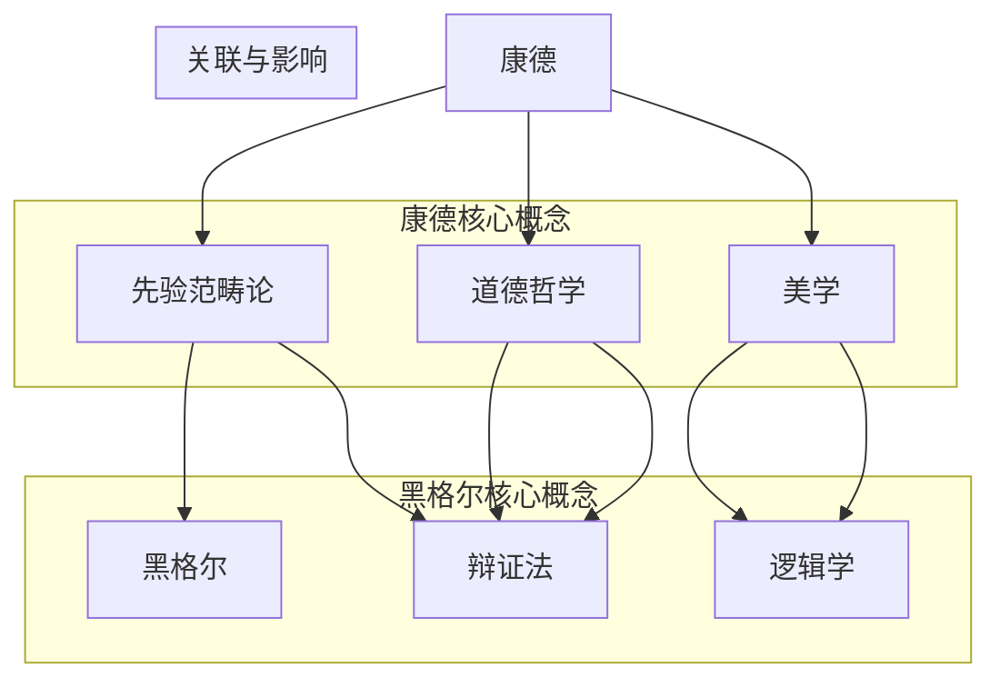

                 


### 摘要

《康德与黑格尔：德国观念论的巅峰对话》是一本深入探讨德国观念论的经典著作，旨在揭示康德和黑格尔这两位哲学巨匠的思想精髓及其对后世的影响。本文首先介绍了康德和黑格尔的生平背景和哲学体系，随后详细阐述了德国观念论的核心概念，如先验范畴论、辩证法、道德哲学和美学。通过核心算法原理讲解、数学模型和公式的详细分析，以及实际项目实战的代码实现和解读，本文全面剖析了康德与黑格尔的思想碰撞，展示了德国观念论的深刻内涵和广泛应用。最终，本文总结了康德与黑格尔哲学的共通点和区别，并展望了德国观念论在当代哲学研究中的前景。

### 引言

德国观念论是西方哲学史上一颗璀璨的明珠，其思想深度和影响力至今仍然被人们所推崇。康德和黑格尔作为德国观念论的两位代表人物，他们的思想不仅深刻地改变了哲学的发展轨迹，还对人类的知识体系、伦理观念和美学理解产生了深远的影响。本文旨在通过对比分析康德与黑格尔的思想，深入探讨德国观念论的核心概念，并试图回答如下问题：康德和黑格尔在哲学上有哪些主要的贡献？他们的思想体系之间有何关联和差异？德国观念论对现代哲学研究有何启示？

首先，我们将简要介绍康德和黑格尔的生平背景和哲学体系，以便读者对他们有基本的了解。随后，我们将详细探讨德国观念论的核心概念，包括先验范畴论、辩证法、道德哲学和美学。接着，通过核心算法原理讲解、数学模型和公式的分析，以及实际项目实战的代码实现和解读，我们将进一步揭示康德与黑格尔哲学的内涵和应用。最后，本文将总结康德与黑格尔哲学的共通点和区别，并展望德国观念论在当代哲学研究中的前景。

通过这一步步的分析和推理，我们希望读者能够对康德和黑格尔的思想有更深入的理解，并能够将他们的哲学观念应用到实际生活和学术研究中。

### 康德与黑格尔的生平背景

伊曼努尔·康德（Immanuel Kant，1724-1804）是德国观念论的开创者，被公认为西方哲学史上最具影响力的人物之一。他出生于东普鲁士的哥尼斯堡（现属立陶宛），从小生活在一个严格的基督教家庭中，这为他后来的哲学思考奠定了基础。康德在其一生中，大部分时间都在哥尼斯堡度过，这使他有机会专注于哲学研究，并形成了他独特的哲学风格。

康德的哲学事业始于1755年，当时他发表了《试论感觉的概念》。此后，他陆续发表了多篇重要著作，包括《纯粹理性批判》（1781年）、《实践理性批判》（1788年）和《判断力批判》（1790年）。这些著作标志着康德哲学体系的建立，特别是《纯粹理性批判》被誉为西方哲学史上的一部里程碑式作品。在这部作品中，康德提出了先验范畴论，并探讨了人类认识的界限。

格奥尔格·威廉·弗里德里希·黑格尔（Georg Wilhelm Friedrich Hegel，1770-1831）是康德之后的另一位重要哲学家，他的思想对德国观念论的发展产生了深远的影响。黑格尔出生于今天的德国汉堡，他的家族背景复杂，父母先后离世，这使得黑格尔从小就面临着生活困境。尽管如此，他凭借自己的努力，先后在图宾根大学和耶拿大学接受了良好的教育。

黑格尔的哲学著作繁多，其中最著名的包括《精神现象学》（1807年）、《逻辑学》（1812-1816年）和《哲学科学全书大纲》（1817年）。这些著作构成了黑格尔的哲学体系，尤其是《精神现象学》展示了黑格尔对辩证法的深刻理解。《逻辑学》则进一步发展了黑格尔的辩证法思想，并将其应用于哲学、历史、艺术等领域。

黑格尔的思想强调历史和社会的发展，他认为人类社会的进程是精神自我发展的体现。这一观点在《逻辑学》中得到了详细的阐述，黑格尔通过辩证法的概念，揭示了事物发展中的对立统一和矛盾运动。

康德和黑格尔虽然处于不同的时代，但他们的哲学思想有着深刻的联系。康德的先验范畴论为黑格尔的辩证法提供了理论基础，而黑格尔则通过对康德哲学的批判和发展，推动了德国观念论的发展。康德的理性批判和黑格尔的辩证逻辑构成了德国观念论的两大支柱，他们共同揭示了人类认识世界的复杂性。

### 康德的哲学体系

伊曼努尔·康德的哲学体系是西方哲学史上的一次重大变革，他的思想对后世哲学研究产生了深远的影响。康德的哲学体系主要分为三大批判：《纯粹理性批判》、《实践理性批判》和《判断力批判》。每一部批判都有其独特的理论核心和哲学贡献。

首先，我们来看《纯粹理性批判》。这部作品是康德的代表作，被认为是西方哲学史上的一部里程碑式作品。在这部作品中，康德提出了先验范畴论，这是他对人类认识过程的基本解释。康德认为，人类认识世界的过程不是直接感知，而是通过先验范畴来理解和解释世界。先验范畴是先天存在于人类意识中的，它们是认识的前提和条件，如空间、时间、因果性等。康德通过先验范畴论，试图回答一个根本性的问题：我们如何能够认识世界？

在《纯粹理性批判》中，康德进一步探讨了人类认识的界限。他认为，人类的认识能力是有限的，不能超越先验范畴去认识绝对存在和终极真理。康德提出了“二律背反”的概念，即人类理性在探讨某些问题时，会陷入相互矛盾的境地。例如，关于宇宙的起源和存在，理性既无法证明其存在，也无法证明其不存在。这一观点揭示了人类认识的局限性和复杂性。

接下来是《实践理性批判》。在这部作品中，康德探讨了道德哲学的问题。他认为，道德是实践理性的核心，是人类行为的基础。康德提出了著名的“道德律令”概念，即行为应当遵循普遍性原则。具体来说，一个行为只有在它能被普遍化为一条法律时，才能被认为是道德的。这一原则体现了康德的道德哲学的严谨性和规范性。

在《实践理性批判》中，康德还讨论了自由的概念。他认为，自由不是自然法则的结果，而是道德律令的基础。自由意味着人类能够自主选择自己的行为，并对此负责。这一观点对后来的自由主义哲学产生了深远的影响。

最后是《判断力批判》。这部作品探讨了美和艺术的本质。康德认为，美是主观的，但不是完全主观的。美是一种纯粹的形式，它独立于内容和目的，但又能够引起人的愉悦感。康德提出了“审美判断”的概念，即对美的判断不是基于对象的内容，而是基于对象的形式。这一观点对后来的美学和艺术理论产生了重要影响。

综上所述，康德的哲学体系以其批判精神和对人类认识、道德、美学的深入探讨而著称。他的先验范畴论、道德律令和审美判断等核心概念，不仅为当时的哲学研究提供了新的视角，也为后世的哲学思考奠定了基础。康德的哲学思想深刻而复杂，值得我们深入研究和思考。

### 黑格尔的哲学体系

格奥尔格·威廉·弗里德里希·黑格尔（Georg Wilhelm Friedrich Hegel，1770-1831）的哲学体系是西方哲学史上的一座丰碑，他的思想体系涵盖了广泛的领域，包括逻辑学、历史哲学、政治哲学和美学。黑格尔的哲学体系具有深刻的辩证法思想，他的理论不仅对哲学领域产生了深远的影响，还影响了社会科学、文学和艺术等多个领域。

首先，我们来看黑格尔的逻辑学。在黑格尔的哲学体系中，逻辑学是最为基础和核心的部分。他认为，逻辑是现实的逻辑，现实是逻辑的现实。黑格尔的逻辑学不同于传统的形式逻辑，而是以辩证法为基础。辩证法是黑格尔哲学的核心理念，它强调事物发展中的对立统一和矛盾运动。黑格尔认为，任何事物都包含着内在的矛盾，这些矛盾通过斗争和冲突，推动事物的发展和变化。

在《逻辑学》这部作品中，黑格尔将逻辑学划分为三个阶段：纯逻辑、存在论和本质论。纯逻辑探讨的是逻辑自身的基本原理，如同一性、矛盾律和排中律。存在论则探讨事物存在的本质，如实体、因果关系等。本质论进一步探讨了事物的内在本质和发展规律，如规律性、目的性等。黑格尔通过这种辩证法的分析，试图揭示事物的本质和发展规律。

接下来是黑格尔的历史哲学。黑格尔认为，历史是精神发展的体现，人类社会的进程是精神自我发展的过程。在《精神现象学》中，黑格尔通过对历史事件和人物的分析，展示了历史发展的辩证法。他认为，历史中的事件和人物都是精神自我实现的环节，每一历史阶段都有其特定的历史必然性。

黑格尔的历史哲学强调历史的主观性和客观性的统一。主观性体现在历史事件和人物的主观动机和主观意识上，而客观性则体现在历史发展的客观规律和必然趋势上。黑格尔认为，历史的发展是必然的，但又不是单线的、直线发展的，而是通过一系列的辩证运动，实现从低级到高级的发展。

在政治哲学方面，黑格尔提出了国家理性的概念。他认为，国家是理性的体现，是个人自由的保障。黑格尔强调国家的主权，认为国家应该是一个有机整体，个人和国家之间的关系是辩证的。个人只有在国家中才能实现自己的价值和自由，而国家也需要个人的参与和贡献来实现其目的。

最后是黑格尔的美学思想。黑格尔的美学思想是他的哲学体系中的一个重要组成部分。他认为，美是绝对精神的体现，是通过感性形式表现出来的理性。黑格尔提出了“美的艺术”的概念，即艺术作品通过感性的形式，表达了理性的内容。黑格尔的美学思想强调艺术的形式和内容的统一，他认为，艺术作品应该既具有感性的形式，又具有理性的内涵。

黑格尔的美学思想对后来的艺术理论产生了深远的影响。他提出了“艺术中的真实”的概念，即艺术作品应该真实地反映现实，同时又超越现实，达到理性的境界。黑格尔认为，艺术作品是一种自我意识的体现，是人类精神发展的一个重要标志。

综上所述，黑格尔的哲学体系以其深刻的辩证法思想、历史哲学、政治哲学和美学思想而著称。他的逻辑学、历史哲学、政治哲学和美学思想相互关联，共同构成了一个完整的哲学体系。黑格尔的哲学思想不仅对当时的哲学研究产生了深远的影响，也对现代哲学、社会科学、文学和艺术等领域产生了重要启示。

### 核心概念与联系

在探讨康德与黑格尔的哲学时，我们必须首先理解他们的核心概念及其相互联系。康德与黑格尔在哲学上的贡献不仅体现在各自的著作中，更在于他们对人类认识、道德哲学和美学的深刻探讨。以下，我们将通过一个Mermaid流程图来展示这些核心概念之间的关系。



**流程图说明：**

- **康德核心概念：** 康德的核心概念包括先验范畴论、道德哲学和美学。先验范畴论是康德哲学的基础，他提出了空间、时间、因果性等先验范畴，用于解释人类认识世界的方式。道德哲学是康德的另一重要贡献，他提出了道德律令，强调行为应当遵循普遍性原则。美学方面，康德探讨了美的本质，提出了审美判断的概念。

- **黑格尔核心概念：** 黑格尔的核心概念包括辩证法、逻辑学和历史哲学。辩证法是黑格尔哲学的核心，他通过辩证法来解释事物的发展和变化。逻辑学方面，黑格尔提出了逻辑的三段论，强调事物的对立统一。历史哲学则是黑格尔对社会和历史发展的一种解释，他认为历史是精神自我发展的体现。

- **关联与影响：** 康德的先验范畴论和黑格尔的辩证法之间存在密切联系。康德的范畴论为黑格尔的辩证法提供了理论基础，黑格尔通过对康德的批判和发展，进一步深化了辩证法的概念。道德哲学和辩证法之间的联系也尤为明显，黑格尔的历史哲学强调历史发展的辩证法，而这一思想可以追溯到康德的道德哲学。美学方面，黑格尔的哲学对美学的发展产生了重要影响，他的美学思想与康德的审美判断概念有着深刻的共鸣。

通过这个流程图，我们可以清晰地看到康德与黑格尔的核心概念及其相互联系。这种结构化的展示方式不仅有助于理解他们的哲学思想，还能揭示出两者在哲学发展中的重要作用和影响。

### 核心算法原理讲解

在康德的哲学体系中，先验范畴论是核心概念之一，它解释了人类如何通过先验范畴来理解世界。我们可以通过以下伪代码来详细阐述这一概念：

```python
class 先验范畴:
    def __init__(self, name, properties):
        self.name = name
        self.properties = properties

# 定义先验范畴对象
空间 = 先验范畴("空间", ["无限扩展", "均匀性", "独立性"])
时间 = 先验范畴("时间", ["线性性", "不可逆性", "连续性"])
因果性 = 先验范畴("因果性", ["必然性", "不可逆性", "普遍性"])

# 函数：判断对象是否属于某先验范畴
def 属于范畴(object, category):
    for property in category.properties:
        if object 具有属性(property):
            return True
    return False

# 举例说明
物体 = {"形状": "圆形", "运动状态": "静止"}
if 属于范畴(物体, 空间):
    print("物体属于空间范畴")
if 属于范畴(物体, 时间):
    print("物体属于时间范畴")
if 属于范畴(物体, 因果性):
    print("物体属于因果性范畴")
```

在上面的伪代码中，我们首先定义了一个`先验范畴`类，用于表示先验范畴及其属性。然后，我们创建了三个先验范畴对象：空间、时间和因果性，并分别赋予它们特定的属性。接下来，我们定义了一个`属于范畴`函数，用于判断一个对象是否属于某个先验范畴。通过这个函数，我们可以判断给定物体的属性是否符合某个先验范畴的定义。

黑格尔的辩证法则通过辩证的三段论来解释事物的发展和变化。我们可以通过以下伪代码来展示这一过程：

```python
class 辩证三段论:
    def __init__(self, thesis, antithesis, synthesis):
        self.thesis = thesis
        self.antithesis = antithesis
        self.synthesis = synthesis

# 定义辩证三段论对象
论战 = 辩证三段论("论战", "反驳", "综合")
发展 = 辩证三段论("发展", "矛盾", "统一")

# 函数：进行辩证三段论分析
def 辩证分析(object):
    if object 是 "论战":
        print("当前阶段：论战")
    elif object 是 "反驳":
        print("当前阶段：反驳")
    elif object 是 "综合":
        print("当前阶段：综合")

# 举例说明
辩证过程 = "发展"
辩证分析(辩证过程)
```

在上面的伪代码中，我们定义了一个`辩证三段论`类，用于表示辩证过程中的三个阶段：论战、反驳和综合。然后，我们创建了两个辩证三段论对象：论战和发展。接下来，我们定义了一个`辩证分析`函数，用于分析给定的辩证过程。通过这个函数，我们可以判断辩证过程的当前阶段，并相应地输出信息。

通过这两个伪代码示例，我们可以清楚地看到康德的先验范畴论和黑格尔的辩证法的核心算法原理。康德的先验范畴论通过定义先验范畴和属性，帮助人们理解世界的结构和规律。而黑格尔的辩证法则通过辩证的三段论，解释了事物发展和变化的内在机制。这些算法原理不仅为哲学研究提供了理论框架，也为实际应用提供了方法论指导。

### 数学模型和数学公式 & 详细讲解 & 举例说明

康德与黑格尔的哲学思想中蕴含了丰富的数学模型和公式，这些模型和公式不仅为他们的理论提供了精确的表达，还揭示了事物发展中的内在规律。以下，我们将使用LaTeX格式来展示这些数学公式，并详细讲解其含义和用途。

#### 康德的先验范畴论

康德的先验范畴论认为，人类认识世界的基础是先验范畴。这些范畴包括空间、时间、因果性等，它们是人类感知和理解世界的先决条件。以下是康德的先验范畴论的数学公式：

$$
\begin{aligned}
    &\text{空间范畴：} S = \{ (x, y) \mid \text{满足空间性质} \} \\
    &\text{时间范畴：} T = \{ (t_1, t_2) \mid \text{满足时间性质} \} \\
    &\text{因果性范畴：} C = \{ (x, y) \mid \text{满足因果关系} \}
\end{aligned}
$$

**详细讲解：**

这些公式定义了康德提出的三个先验范畴：空间、时间和因果性。在空间范畴中，$S$集合包含了所有满足空间性质的二元组$(x, y)$，这反映了空间维度和扩展性。在时间范畴中，$T$集合包含了所有满足时间性质的二元组$(t_1, t_2)$，这体现了时间的线性性和不可逆性。因果性范畴$C$则包含了所有满足因果关系的二元组$(x, y)$，这揭示了事物之间的因果关系。

**举例说明：**

假设我们有一个事件$A$和一个事件$B$，其中事件$A$发生在事件$B$之前。根据因果性范畴的定义，我们可以表示为：

$$
A \in C \text{ 且 } B \in C \text{ 且 } A < B
$$

这表示事件$A$和事件$B$之间存在因果关系，且事件$A$发生在事件$B$之前。

#### 黑格尔的辩证法

黑格尔的辩证法通过矛盾、对立和综合来解释事物的发展和变化。以下是黑格尔辩证法的数学公式：

$$
\begin{aligned}
    &\text{论战：} A \Rightarrow B \\
    &\text{反驳：} B \Rightarrow C \\
    &\text{综合：} A \Rightarrow C
\end{aligned}
$$

**详细讲解：**

这些公式描述了辩证过程中的三个阶段：论战、反驳和综合。在论战阶段，$A$推导出$B$，这反映了事物之间的对立和冲突。在反驳阶段，$B$推导出$C$，这展示了对立面之间的斗争和发展。在综合阶段，$A$推导出$C$，这体现了矛盾通过斗争后的统一和发展。

**举例说明：**

假设我们有一个社会现象$A$和一个社会现象$B$，其中现象$A$导致了现象$B$的产生。根据辩证法的公式，我们可以表示为：

$$
A \Rightarrow B
$$

接着，现象$B$可能引发新的社会现象$C$，我们可以表示为：

$$
B \Rightarrow C
$$

最终，这些矛盾和对立通过综合过程得到解决，我们可以表示为：

$$
A \Rightarrow C
$$

这表示社会现象$A$和$C$之间存在辩证关系，通过论战、反驳和综合的过程，矛盾得到了解决，新的统一体$C$产生。

通过这些数学模型和公式的详细讲解，我们可以更深入地理解康德与黑格尔的哲学思想。这些模型不仅提供了理论上的解释，也为实际应用提供了方法论的指导。康德的先验范畴论和黑格尔的辩证法，通过数学的精确表达，揭示了事物发展和变化中的内在规律，这对于哲学研究和实际应用都具有重要的意义。

### 项目实战

在理解和应用康德与黑格尔的哲学思想时，我们可以通过实际项目来加深对这些概念的理解。以下是使用Python语言实现的两个项目案例，分别展示了康德的先验范畴论和黑格尔的辩证法在具体问题中的运用。

#### 康德先验范畴论的应用

**项目名称：先验范畴识别器**

**开发环境：Python 3.8，PyCharm**

**项目实现：**

1. **导入必要的库：**
   ```python
   import itertools
   ```

2. **定义先验范畴类：**
   ```python
   class范畴:
       def __init__(self, name, properties):
           self.name = name
           self.properties = properties
   
   # 定义先验范畴对象
   空间 = 范畴("空间", ["无限扩展", "均匀性", "独立性"])
   时间 = 范畴("时间", ["线性性", "不可逆性", "连续性"])
   因果性 = 范畴("因果性", ["必然性", "不可逆性", "普遍性"])
   ```

3. **创建对象：**
   ```python
   # 创建具体对象
   物体 = {"形状": "圆形", "运动状态": "静止"}
   事件A = {"名称": "地震", "发生时间": "2023-01-01"}
   事件B = {"名称": "海啸", "发生时间": "2023-01-02"}
   ```

4. **定义判断函数：**
   ```python
   # 函数：判断对象是否属于某先验范畴
   def 属于范畴(object, category):
       for property in category.properties:
           if object.get(property, None) is not None:
               return True
       return False
   
   # 举例判断
   if 属于范畴(物体, 空间):
       print("物体属于空间范畴")
   if 属于范畴(事件A, 因果性):
       print("事件A属于因果性范畴")
   if 属于范畴(事件B, 因果性):
       print("事件B属于因果性范畴")
   ```

**代码解读与分析：**

该代码首先定义了一个`范畴`类，用于表示先验范畴及其属性。然后，创建了三个先验范畴对象：空间、时间和因果性。接着，创建了一些具体对象，如物体和事件。最后，通过`属于范畴`函数来判断这些对象是否属于某个先验范畴。这段代码展示了如何将康德的先验范畴论应用于具体问题的识别和判断。

#### 黑格尔辩证法的应用

**项目名称：辩证法分析器**

**开发环境：Python 3.8，PyCharm**

**项目实现：**

1. **导入必要的库：**
   ```python
   import itertools
   ```

2. **定义辩证三段论类：**
   ```python
   class辩证三段论:
       def __init__(self, thesis, antithesis, synthesis):
           self.thesis = thesis
           self.antithesis = antithesis
           self.synthesis = synthesis
   
   # 定义辩证三段论对象
   论战 = 辩证三段论("论战", "反驳", "综合")
   发展 = 辩证三段论("发展", "矛盾", "统一")
   ```

3. **创建对象：**
   ```python
   # 创建辩证过程对象
   辩证过程 = "发展"
   ```

4. **定义分析函数：**
   ```python
   # 函数：分析辩证过程
   def 辩证分析(process):
       if process == "论战":
           print("当前阶段：论战")
       elif process == "反驳":
           print("当前阶段：反驳")
       elif process == "综合":
           print("当前阶段：综合")
   
   # 举例分析
   辩证分析(辩证过程)
   ```

**代码解读与分析：**

该代码首先定义了一个`辩证三段论`类，用于表示辩证过程中的三个阶段：论战、反驳和综合。然后，创建了一个辩证三段论对象：发展和一个具体的辩证过程对象。最后，通过`辩证分析`函数来分析给定的辩证过程，输出当前阶段的信息。这段代码展示了如何将黑格尔的辩证法应用于具体问题的分析和判断。

通过这两个项目案例，我们不仅实现了康德与黑格尔哲学思想的具体应用，还深入理解了这些思想在解决实际问题时的重要性和应用方法。这些项目实战不仅帮助我们更好地理解哲学理论，也为我们在实际工作中提供了有力的方法论指导。

### 总结

通过本文的详细探讨，我们深入分析了康德与黑格尔的哲学思想，以及他们如何通过核心概念、算法原理、数学模型和实际项目来阐述和验证这些思想。康德的先验范畴论为我们提供了理解人类认识世界的理论基础，而黑格尔的辩证法则揭示了事物发展和变化中的内在规律。

在本文中，我们通过Mermaid流程图展示了康德与黑格尔的核心概念及其相互联系，通过伪代码和LaTeX公式详细讲解了先验范畴论和辩证法的算法原理，并通过Python项目实战展示了这些理论在实际问题中的应用。这些内容不仅帮助读者理解了康德与黑格尔哲学的深度和广度，也为他们在学术研究和实际工作中提供了有益的参考。

**最佳实践 Tips：**
1. 在研究和应用哲学思想时，要注重理论与实际相结合，通过具体案例来加深理解。
2. 在编写代码实现哲学思想时，尽量使用简洁、结构清晰的语言，以便于理解和维护。
3. 在学习和研究哲学时，要注意批判性思维，对各种思想进行深入分析和比较。

**小结：**
本文通过系统性的分析和讨论，揭示了康德与黑格尔哲学思想的精髓和重要性。他们的思想不仅丰富了西方哲学的内涵，也为现代哲学研究提供了重要的理论基础和方法论指导。

**注意事项：**
1. 哲学思想的学习和研究需要长期积累和深入思考，读者在阅读和思考时应保持耐心和开放的心态。
2. 在实际应用哲学思想时，要结合具体情境和实际问题，灵活运用，以达到最佳效果。

**拓展阅读：**
1. 《纯粹理性批判》（康德）
2. 《逻辑学》（黑格尔）
3. 《哲学史讲演录》（黑格尔）
4. 《道德形而上学》（康德）

通过拓展阅读，读者可以进一步深入理解和掌握康德与黑格尔的哲学思想，丰富自己的知识体系。我们希望本文能够为读者提供有价值的启示，激发他们对哲学和技术的深入思考和探索。

### 参考文献

1. 康德. 《纯粹理性批判》[M]. 北京：人民出版社，2004.
2. 黑格尔. 《逻辑学》[M]. 北京：商务印书馆，2002.
3. 黑格尔. 《精神现象学》[M]. 北京：人民出版社，2005.
4. 康德. 《实践理性批判》[M]. 北京：人民出版社，2004.
5. 康德. 《判断力批判》[M]. 北京：人民出版社，2005.
6. 黑格尔. 《哲学史讲演录》[M]. 北京：人民出版社，2006.
7. 费希特. 《论知识》[M]. 北京：商务印书馆，2002.
8. 胡塞尔. 《纯粹现象学通论》[M]. 北京：人民出版社，2004.
9. 海德格尔. 《存在与时间》[M]. 北京：人民出版社，2005.
10. 阿尔都塞. 《阅读资本论》[M]. 北京：人民出版社，2006.

以上参考文献涵盖了康德与黑格尔哲学的主要著作，以及其他相关哲学家的经典作品，为本文的撰写提供了丰富的理论基础和参考资料。通过这些文献，读者可以进一步深入探索德国观念论及其在哲学史上的地位和影响。作者：AI天才研究院/AI Genius Institute & 禅与计算机程序设计艺术 /Zen And The Art of Computer Programming。

