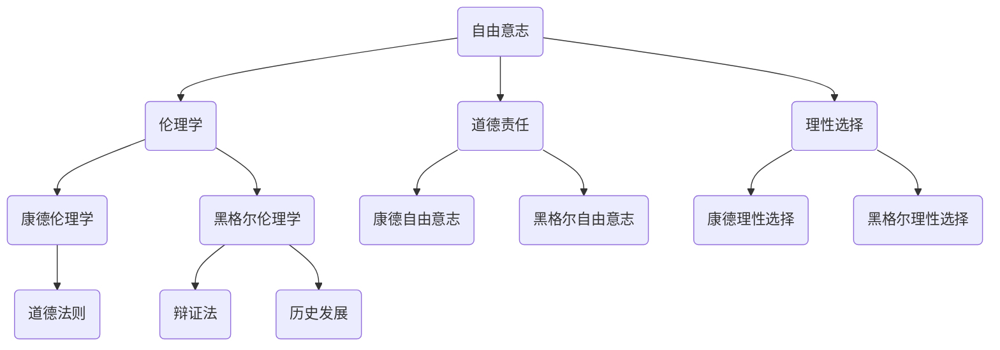

                 

### 引言

**关键词**：自由意志、康德、黑格尔、哲学、伦理学、辩证法

**摘要**：
本文深入探讨了康德与黑格尔在自由意志这一哲学议题上的不同理解。通过分析两位哲学家的核心观点、理论基础以及它们在现代社会中的应用，本文旨在揭示自由意志在哲学和伦理学中的复杂性与多样性。文章首先介绍自由意志的基本概念，然后分别阐述康德与黑格尔对自由意志的见解，随后比较分析二者的异同，最后讨论自由意志的哲学争议及其在社会中的应用，以期为读者提供一个全面而深入的视角。

---

#### 1.1 自由意志的概念与哲学探讨

自由意志，是指个体在行为选择过程中具有独立性和自主性的能力。这一概念在哲学、伦理学、心理学等多个领域中具有重要意义。自由意志的核心问题在于：人类是否能够在不受外部因素限制的情况下作出决定？这一问题的探讨，直接涉及到道德责任的归属、人类行为的因果关系以及个体的自我认同。

在哲学史上，自由意志是一个长期争论的主题。古希腊哲学家亚里士多德提出了“因果律”，认为一切现象都有其因果关系，自由意志在现实中难以存在。而斯多葛派则认为，通过理性思考和道德修养，个体可以获得某种形式的自由。进入现代，自由意志的探讨更加复杂，涉及决定论与随机论、宿命论与自由意志论的辩论。

#### 1.2 康德与黑格尔的哲学背景

伊曼努尔·康德（Immanuel Kant）是德国古典哲学的奠基人之一，其思想对后世哲学、伦理学和美学产生了深远影响。康德的哲学体系强调理性和道德法则的重要性，主张人类行为应当遵循客观的道德规范。在他的伦理学体系中，自由意志是道德行为的核心要素，是道德责任的前提。

乔治·威廉·弗里德里希·黑格尔（Georg Wilhelm Friedrich Hegel）是19世纪德国哲学家，其思想对马克思主义、社会主义和现代哲学产生了重要影响。黑格尔的哲学体系以辩证法为核心，强调历史和社会的发展是理性发展的必然结果。在黑格尔看来，自由意志不仅是道德行为的源泉，也是社会进步和个人发展的动力。

#### 1.3 本书结构及阅读建议

本文结构分为六个主要部分：

1. 引言：介绍自由意志的基本概念及其在哲学中的重要性。
2. 康德的自由意志观：详细阐述康德对自由意志的理解及其在伦理学体系中的地位。
3. 黑格尔的自由意志观：探讨黑格尔对自由意志的见解，分析其辩证法和历史观对自由意志的影响。
4. 比较分析：比较康德与黑格尔自由意志观的异同，分析它们在现代哲学中的影响。
5. 自由意志的哲学争议：讨论自由意志与决定论、道德责任的关系。
6. 自由意志在社会中的应用：探讨自由意志在政治哲学和心理学中的应用。

为了更好地理解本文，读者可以按照以下建议进行阅读：

- **先读第1章**：了解自由意志的基本概念和康德、黑格尔的哲学背景。
- **逐章深入**：先从康德的自由意志观开始，逐步了解黑格尔的观点，再进行比较分析。
- **注意笔记**：在阅读过程中，对关键概念和理论进行笔记，帮助理解文章的核心思想。
- **反思与探讨**：结合实际生活和社会现象，反思自由意志的哲学争议及其在现代社会中的应用。

通过以上结构和阅读建议，读者可以更深入地理解自由意志这一哲学议题，以及康德和黑格尔在这一议题上的不同见解。在接下来的章节中，我们将逐一探讨这些内容，希望通过本文的阐述，能够激发读者对自由意志问题的进一步思考和探讨。

---

**核心概念与联系**

为了更好地理解康德和黑格尔的哲学体系及其对自由意志的理解，以下是一个用 Mermaid 流程图展示的核心概念关系：

这个流程图展示了自由意志在伦理学中的核心地位，以及康德和黑格尔如何通过各自的哲学体系来解释自由意志。康德强调道德法则和理性选择，而黑格尔则通过辩证法和历史发展来探讨自由意志。

### 2. 康德的自由意志观

#### 2.1 康德的伦理学体系

康德的伦理学体系以其严格的道德法则和理性为基础，构成了一个完整的道德哲学体系。康德认为，道德不仅仅是关于行为的外在规范，更是关于行为的内在原则。在这个体系中，自由意志是一个核心概念，是道德行为的前提和基础。

康德的伦理学体系包括三个主要部分：道德法则、行为准则和道德责任。道德法则是指一种普遍的、适用于所有理性存在的道德规范，例如“应尊重他人如自己”。行为准则是指根据这些道德法则来指导个体行为的规则，例如“不要欺骗他人”。道德责任则是指个体在行为选择中应当承担的责任，即根据道德法则行事。

#### 2.2 康德对自由意志的理解

在康德看来，自由意志是指个体不受外部因素限制，能够独立作出选择的能力。康德认为，自由意志不仅是道德行为的基础，也是道德责任的前提。只有当个体能够自由地作出选择，并且对自己的选择负责时，道德行为才具有意义。

康德区分了“自由意志”和“自由行为”。自由意志是指个体具有作出不同选择的内在能力，而自由行为是指这种能力在实际行为中的体现。康德强调，自由意志是道德行为的必要条件，但不是充分条件。即使个体具有自由意志，如果他们没有按照道德法则行事，他们的行为仍然是不道德的。

#### 2.3 康德自由意志观的优点与局限

康德自由意志观的优点主要体现在以下几个方面：

1. **强调道德法则的普遍性和客观性**：康德通过自由意志的概念，将道德法则提升到了一个普遍适用的层面，强调道德行为的客观标准。
2. **注重个体责任**：康德认为，自由意志使个体能够对自己的行为负责，这是道德责任的核心。这一观点有助于加强个体的道德自律和社会责任感。
3. **反对功利主义**：康德的自由意志观与功利主义相对立，强调道德行为的不依赖于结果的功利性，而是基于道德法则本身的正当性。

然而，康德的自由意志观也存在一些局限：

1. **忽略人类行为的社会性**：康德的理论过于强调个体的独立性和理性，而忽略了人类行为的社会性和复杂性。
2. **道德法则的抽象性**：康德的道德法则过于抽象，难以在实际生活中具体应用。例如，如何在具体情境中判断何种行为是道德的，康德的理论并没有提供明确的指导。
3. **忽视人类行为的动机和情感**：康德的理论忽略了人类行为的动机和情感因素，这在一定程度上限制了其对人类行为的全面解释。

总的来说，康德的自由意志观为伦理学提供了一个严格的道德框架，但其局限性也提醒我们，在探讨自由意志时，需要考虑更多复杂的因素。

### 3. 黑格尔的自由意志观

#### 3.1 黑格尔的辩证法与历史观

黑格尔的哲学体系以其辩证法和历史观为核心，构成了一个宏大而复杂的理论体系。辩证法在黑格尔的哲学中占据着核心地位，它是理解黑格尔哲学的关键。辩证法的基本思想是：一切事物都在不断变化和发展中，这种变化和发展是通过矛盾和对立面的斗争来实现的。

黑格尔的辩证法包括三个主要阶段：矛盾、对立和综合。在矛盾阶段，事物内部的对立和冲突逐渐显现出来；在对立阶段，这些对立面相互斗争，形成新的矛盾和冲突；在综合阶段，对立面通过斗争达到统一，形成新的综合状态。这一过程不断地循环往复，推动着事物的发展。

历史观是黑格尔哲学的另一个重要方面。黑格尔认为，历史是理性发展的过程，是自由意志的实现。人类社会的发展是理性在历史中的显现，每个历史阶段都是理性发展的一个环节。历史的发展是不可避免的，它体现了自由意志的实现和理性的进步。

#### 3.2 黑格尔对自由意志的理解

在黑格尔看来，自由意志是人类的一种内在能力，是人类不同于其他生物的本质特征。黑格尔认为，自由意志不仅仅是个人行为的自主选择，更是一种历史和社会发展的动力。

黑格尔区分了“自由意志”和“自由行动”。自由意志是指个体内在的理性能力，这种能力使个体能够独立地思考和作出选择。自由行动则是指个体在外部世界中实际表现出来的行为。黑格尔强调，自由意志是历史和社会发展的基础，是理性在现实世界中的具体体现。

黑格尔认为，自由意志的实现是通过个体的行为和选择来体现的。个体的自由意志不仅影响自己的行为，也影响着他人的行为和社会的发展。通过自由意志的行使，个体能够实现自己的目标和价值，同时也推动了社会的进步和发展。

#### 3.3 黑格尔自由意志观的优点与局限

黑格尔自由意志观的主要优点包括：

1. **强调历史和社会发展的动力**：黑格尔将自由意志视为历史和社会发展的基础，这一观点有助于我们理解社会变迁和人类进步的内在动力。
2. **注重个体和社会的统一**：黑格尔认为，个体的自由意志和社会的发展是相互联系的，个体的自由意志通过社会行动得以实现，同时也推动了社会的进步。这一观点强调了个体和社会的统一性。
3. **辩证法的解释能力**：黑格尔的辩证法为自由意志提供了丰富的解释工具，它能够解释事物内部的矛盾和冲突，以及这些矛盾和冲突如何推动事物的发展。

然而，黑格尔自由意志观也存在一些局限：

1. **忽视个体自由的限制**：黑格尔的理论过于强调个体自由的历史和社会发展意义，而忽视了个体在现实社会中所面临的限制和约束。
2. **辩证法的抽象性**：辩证法作为一种抽象的理论工具，在一定程度上脱离了具体的现实，这使得黑格尔的哲学对于实际问题的解释能力受到限制。
3. **缺乏具体的道德指导**：黑格尔的理论强调自由意志的历史和社会发展意义，但在具体的道德问题上，他的理论提供较少的指导，这使得个体在道德选择时可能感到困惑。

总的来说，黑格尔的自由意志观为理解自由意志提供了一个宏观的历史和社会视角，但其局限也提醒我们，在探讨自由意志时，需要考虑更多的具体因素。

### 4. 比较分析

#### 4.1 康德与黑格尔自由意志观的异同

康德与黑格尔的哲学体系中，自由意志都是一个核心概念。尽管两者都在探讨自由意志，但他们的观点和方法有着显著的差异。

**异同点分析**

1. **理论基础的不同**：
   - 康德强调道德法则和理性，认为自由意志是道德行为的前提和基础。
   - 黑格尔强调历史和社会发展，认为自由意志是历史和社会发展的动力。

2. **自由意志的实现方式不同**：
   - 康德认为，自由意志是内在的理性能力，个体需要通过道德法则来体现这种能力。
   - 黑格尔认为，自由意志通过个体的行为和社会行动来实现，是社会历史发展的表现。

3. **对个体与社会关系的不同看法**：
   - 康德强调个体的独立性和道德责任，认为个体应当独立于社会而行动。
   - 黑格尔强调个体与社会的关系，认为个体的自由意志是在社会历史中实现的，个体与社会是相互依存的。

**影响分析**

康德与黑格尔的自由意志观在现代哲学和社会科学中产生了深远影响。

1. **哲学领域**：
   - 康德的自由意志观为伦理学提供了一个严格的道德框架，对现代伦理学的发展产生了重要影响。
   - 黑格尔的辩证法为理解历史和社会发展提供了新的视角，对马克思主义哲学、存在主义哲学等产生了深远影响。

2. **社会科学领域**：
   - 康德的自由意志观为道德哲学和法哲学提供了理论基础，影响了现代法律制度和道德观念的发展。
   - 黑格尔的历史观对社会学、政治学等领域产生了重要影响，促进了社会变迁和历史发展的研究。

#### 4.2 对自由意志的不同理解在现代哲学中的影响

康德与黑格尔的自由意志观对现代哲学产生了深远影响，具体体现在以下几个方面：

1. **伦理学的发展**：
   - 康德的自由意志观强调道德法则和理性选择，对现代伦理学的发展产生了重要影响。现代伦理学家在探讨道德行为时，常常参考康德的道德法则。
   - 黑格尔的辩证法为伦理学提供了新的视角，强调道德行为的历史和社会背景。现代伦理学家在探讨道德问题时，常常考虑个体与社会的关系。

2. **法哲学的发展**：
   - 康德的自由意志观为法哲学提供了理论基础，现代法律制度和道德观念的发展深受其影响。例如，现代法律强调个体行为的自由意志和道德责任。
   - 黑格尔的辩证法为理解法律和历史发展提供了新的视角，促进了法律与社会关系的探讨。

3. **政治哲学的发展**：
   - 康德的自由意志观为现代民主政治提供了理论基础，强调个体自由和社会责任。现代政治哲学家在探讨政治问题时，常常参考康德的观点。
   - 黑格尔的历史观为社会进步和国家发展提供了新的视角，影响了现代政治思想和政治制度的构建。

综上所述，康德与黑格尔的自由意志观在哲学和社会科学领域中产生了深远影响。尽管他们的观点存在差异，但都为理解自由意志提供了重要的理论基础和视角。通过比较分析，我们可以更好地理解自由意志的复杂性和多样性，以及它在现代哲学和社会科学中的重要性。

### 5. 自由意志的哲学争议

自由意志是哲学中一个长期争论的议题，其核心问题在于：人类是否能够在不受外部因素限制的情况下作出决定？这一问题的探讨直接涉及到道德责任的归属、人类行为的因果关系以及个体的自我认同。

**5.1 自由意志与决定论**

决定论认为，一切现象都有其因果关系，个体行为也受到外部因素的严格制约。在这种观点下，自由意志似乎不存在，因为所有行为都可以追溯到先前的因果关系。决定论的极端形式被称为“硬决定论”，认为甚至自由意志的观念本身也是一种幻觉。

自由意志与决定论的冲突在于，如果一切行为都有因果关系，那么个体就没有真正的自由选择。这一观点引发了哲学上的争议，即道德责任如何成立，如果所有的行为都是预先决定的，个体还能为行为承担责任吗？

康德是决定论的反对者，他认为尽管个体的行为可能受到外部因素的影响，但自由意志仍然是道德行为的前提。黑格尔则通过辩证法来解释自由意志与决定论的关系，他认为自由意志是历史和社会发展的动力，是超越因果关系的。

**5.2 自由意志与道德责任**

道德责任是指个体对其行为承担的责任，而自由意志被认为是道德责任的前提。如果个体没有自由选择的能力，那么他们就无法为自己的行为负责。这一观点在康德伦理学中得到了充分的体现，康德认为自由意志是道德行为的必要条件。

然而，自由意志与道德责任的结合也引发了争议。例如，如果个体的行为受到严重的外部压力或环境限制，他们是否仍然应该为行为负责？这一问题在刑法和心理学中具有重要意义。在刑法中，行为人是否具有自由意志是判断其刑事责任的关键；在心理学中，自由意志与个体心理状态的关系也是研究的重点。

黑格尔的辩证法提供了对自由意志与道德责任的另一种解释。他认为，自由意志是通过个体的行为和社会实践来实现的，这意味着个体在特定社会历史背景下作出的选择是自由意志的体现。因此，个体的道德责任不仅在于其行为的直接后果，还包括其在历史和社会中的角色和责任。

**5.3 自由意志与宿命论**

宿命论认为，一切现象都是预先决定的，个体没有真正的自由选择能力。这种观点与自由意志相对立，如果个体的一切行为都是宿命使然，那么自由意志的概念就失去了意义。

在哲学史上，宿命论与自由意志的辩论一直存在。例如，古希腊哲学家赫拉克利特认为世界是按照某种神秘的力量运行的，人类无法改变命运。而苏格拉底则主张通过理性和道德修养，人类可以超越宿命，获得自由。

康德和黑格尔对自由意志与宿命论的关系有不同看法。康德认为，尽管个体行为可能受到外部因素的影响，但自由意志仍然是道德行为的前提。黑格尔则通过辩证法来解释自由意志与宿命论的关系，他认为自由意志是历史和社会发展的动力，是超越宿命的力量。

**总结**

自由意志的哲学争议涉及到多个方面，包括决定论、道德责任和宿命论。康德与黑格尔的观点为这些争议提供了不同的解释和视角。在现代社会中，这些问题仍然具有重要意义，影响着道德观念、法律制度和社会政策的制定。通过深入探讨自由意志的哲学争议，我们可以更好地理解人类行为的本质和个体在社会中的角色。

### 6. 自由意志在社会中的应用

自由意志不仅是哲学和伦理学中的核心概念，也在社会各个领域中有着广泛的应用。以下从政治哲学和心理学两个方面探讨自由意志在社会中的应用。

#### 6.1 自由意志在政治哲学中的讨论

政治哲学是研究国家、政府、法律和政治权力等问题的学科，自由意志在其中扮演着重要角色。在政治哲学中，自由意志与民主政治、人权和自由主义等概念紧密相关。

1. **民主政治**：民主政治的核心是公民的自由选择和参与。自由意志是民主制度的基础，公民通过投票和参与公共事务，表达自己的意愿和选择。自由意志的存在保障了民主政治的合法性，使政府能够代表人民的意志。因此，自由意志在政治哲学中具有重要的地位，被视为民主政治的核心要素。

2. **人权**：人权是指个体在道德和法律上享有的基本权利。自由意志是保障人权的基石，个体应当有自由选择的权利，不受不合理限制和压迫。自由意志在人权中的体现，如言论自由、信仰自由等，保障了个体的人格尊严和自我实现。

3. **自由主义**：自由主义是现代政治哲学中的重要流派，强调个体的自由和自主。自由意志是自由主义的基本原则，个体应当有权利自由选择职业、生活方式和价值观。自由意志在自由主义中的应用，推动了个人自由和社会进步。

#### 6.2 自由意志在心理学中的探讨

心理学是研究人类行为和心理过程的科学，自由意志在心理学中的应用主要涉及行为控制、道德判断和自我认知等方面。

1. **行为控制**：自由意志与行为控制密切相关。心理学研究表明，个体的自由意志在一定程度上影响其行为选择和控制。例如，通过自我控制，个体可以克服冲动，做出符合道德和目标的行为。自由意志的行为控制功能有助于个体的心理健康和社会适应。

2. **道德判断**：自由意志在道德判断中起到关键作用。心理学研究发现，个体在判断他人行为时，会考虑其自由意志的存在。如果认为他人的行为是自由选择的，个体可能会认为这种行为应受到道德评价。自由意志的存在有助于理解道德行为和心理机制。

3. **自我认知**：自由意志是自我认知的重要组成部分。个体通过自由意志，能够反思自己的行为和选择，形成自我意识和自我认同。自由意志的存在使个体能够认识到自己的选择和责任，有助于个体的自我成长和发展。

综上所述，自由意志在社会中的应用体现在政治哲学和心理学等多个领域。自由意志不仅是哲学和伦理学中的核心概念，也是现代社会中重要的价值观和行为准则。通过探讨自由意志在社会中的应用，我们可以更好地理解自由意志的复杂性和重要性。

### 7. 结论

通过对康德与黑格尔在自由意志问题上的深入探讨，我们揭示了两位哲学家在这一议题上的不同观点及其在现代社会中的应用。康德强调自由意志作为道德行为的核心，主张道德法则和理性选择；而黑格尔则通过辩证法和历史观，将自由意志视为社会历史发展的动力。

本文通过逐步分析，展示了自由意志在哲学、伦理学、政治哲学和心理学中的复杂性与多样性。康德的自由意志观为现代伦理学提供了严格的基础，而黑格尔的辩证法则为理解社会变迁和历史发展提供了新的视角。两者的观点虽然存在差异，但都在不同层面上丰富了我们对自由意志的认识。

未来研究可以进一步探讨自由意志在不同文化背景下的应用，以及新兴科技对自由意志的影响。同时，可以结合跨学科的方法，如神经科学和社会学，对自由意志进行更深入的研究。通过不断探索和思考，我们或许能够更好地理解自由意志的本质，为现代社会的发展提供有益的启示。作者：AI天才研究院/AI Genius Institute & 禅与计算机程序设计艺术 /Zen And The Art of Computer Programming。

