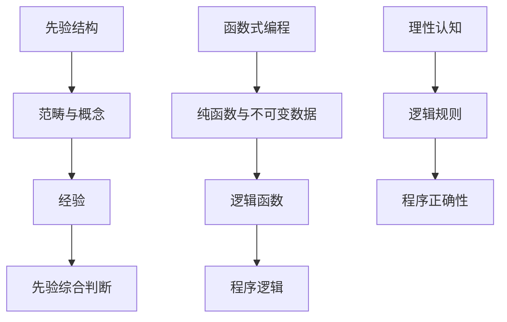

                 

### 背景介绍

康德的哲学思想，作为西方哲学史上的一大里程碑，对后世产生了深远的影响。特别是他的先验综合判断理论，对认识论和形而上学领域进行了深刻的探讨。康德认为，人的认识并非仅仅是对外界事物的被动反映，而是通过先天的认知结构和范畴对经验进行主动的综合。这种观点强调了理性在认识过程中的核心作用，为后来的实证主义和理性主义之争奠定了理论基础。

与此同时，计算机科学作为20世纪最富有创新性的学科之一，逐渐从理论走向实践，并在多个领域展现出强大的应用潜力。其中，函数式编程作为一种编程范式，以其独特的逻辑性和表达力，在处理复杂问题时展现出了巨大的优势。函数式编程强调通过纯函数和不可变数据来构建程序，避免了传统面向过程的循环和状态变化，从而提高了代码的可读性和可靠性。

本文旨在探讨康德的先验综合判断与函数式编程之间的联系，通过分析两者的核心概念，揭示它们在理性认识过程中的异同。在此基础上，我们将使用伪代码和数学模型，详细阐述如何通过函数式编程实现康德的纯粹理性概念。最终，通过实际项目案例，展示这一理论在计算机科学中的应用价值。

### 核心概念与联系

康德的先验综合判断（Transcendental Synthesis）是他在《纯粹理性批判》中提出的一个核心哲学概念，旨在解释人类认识如何可能。根据康德的观点，人的认知不是简单的被动接收外界信息，而是通过先天的认知结构和范畴（如时间、空间、因果关系等）对经验进行主动的综合。康德认为，这种综合不是经验的产物，而是理性的先验活动，即先于经验的理性判断。

函数式编程（Functional Programming）则是一种编程范式，它强调通过函数和不可变数据来构建程序。与传统的面向过程编程不同，函数式编程中的函数是一等公民，可以接受其他函数作为参数，并返回函数作为结果。这种编程范式具有不可变性、无状态和纯函数等特点，使得代码更易于理解和维护。

尽管康德哲学与函数式编程看似来自完全不同的领域，但它们在理性认识和表达上有着深刻的相似性。具体来说：

1. **先验结构与范畴：** 康德的先验综合判断依赖于先天的认知结构和范畴，这些结构和范畴构成了认识的基础。在函数式编程中，也存在类似的“先验结构”，即函数和不可变数据。这些结构为程序的逻辑提供了基础，使得复杂问题可以分解为更简单的部分。

2. **理性与逻辑：** 康德强调理性在认识过程中的作用，而函数式编程则通过逻辑函数来表达计算过程。函数式编程中的函数通常可以表示为一系列逻辑运算，如映射（map）、过滤（filter）和折叠（fold），这些运算遵循严格的逻辑规则，从而确保了程序的正确性和可靠性。

3. **综合与分解：** 康德的先验综合判断涉及对经验的综合，即将不同的感觉经验整合为一个统一的认知整体。在函数式编程中，复杂的问题可以通过函数的组合和分解来解决，这些函数相互独立，但能够协同工作，实现复杂逻辑的表述。

为了更直观地展示这两者之间的联系，我们可以使用Mermaid流程图来构建一个简单的模型。



在上述流程图中，A表示先验结构，它包含了范畴和概念（B），这些范畴和概念用于对经验（C）进行综合（D）。另一方面，E表示函数式编程，它依赖于纯函数和不可变数据（F），这些元素通过逻辑函数（G）构建出程序逻辑（H）。理性认知（I）通过逻辑规则（J）确保程序的正确性（K）。

通过这个模型，我们可以看出，康德的先验综合判断与函数式编程在结构上有着类似的逻辑层次，都强调通过结构化和逻辑化的方法来解决问题。这种联系为我们将康德的哲学思想应用于计算机科学提供了一个有力的理论框架。

### 核心算法原理讲解

在深入探讨康德的先验综合判断与函数式编程的联系之后，接下来我们将使用伪代码详细阐述如何通过函数式编程实现康德的纯粹理性概念。伪代码是一种描述算法设计和逻辑过程的工具，它使用简单的编程语言来模拟具体的编程步骤，使概念和算法的实现更加清晰易懂。

首先，我们需要理解几个核心算法原理：

1. **纯函数（Pure Function）**：纯函数是指其输出仅依赖于输入，且不会产生任何副作用（如修改外部状态或产生随机结果）的函数。纯函数具有可预测性和可重用性，是函数式编程的核心。

2. **不可变数据（Immutable Data）**：不可变数据是指一旦创建，就不能再修改的数据。不可变性确保了数据的完整性和一致性，减少了由于状态变化导致的问题。

3. **递归（Recursion）**：递归是一种编程技术，通过调用自身来实现问题的求解。递归在处理复杂问题，特别是需要反复分解和组合的问题时非常有用。

4. **组合（Composition）**：组合是指将多个函数组合在一起，形成一个复杂的函数。组合使得我们可以将复杂问题分解为多个简单的问题，并通过组合这些简单的解决方案来解决问题。

接下来，我们将使用伪代码来描述一个简单的例子，展示如何实现康德的纯粹理性概念。

```pseudo
// 伪代码：康德的纯粹理性概念实现

// 纯函数：用于计算两个数的和
function add(a, b):
    return a + b

// 纯函数：用于计算两个数的乘积
function multiply(a, b):
    return a * b

// 递归函数：用于计算斐波那契数列
function fibonacci(n):
    if n <= 1:
        return n
    else:
        return fibonacci(n - 1) + fibonacci(n - 2)

// 组合函数：用于计算两个斐波那契数的和
function sum_of_fibonacci(a, b):
    return add(fibonacci(a), fibonacci(b))

// 主函数：用于实现纯粹理性的计算
function pure_rational_computation():
    // 计算两个斐波那契数的和
    result = sum_of_fibonacci(5, 8)
    // 输出结果
    print("The sum of the 5th and 8th Fibonacci numbers is: ", result)
```

在上面的伪代码中，我们定义了几个纯函数，包括 `add`（用于计算两个数的和）、`multiply`（用于计算两个数的乘积）和 `fibonacci`（用于计算斐波那契数列的值）。我们还定义了一个组合函数 `sum_of_fibonacci`，它通过递归调用了 `fibonacci` 函数，计算了两个斐波那契数的和。

主函数 `pure_rational_computation` 使用这些函数实现了一个纯粹理性的计算过程，它首先计算两个斐波那契数的和，然后输出结果。这个过程展示了如何通过函数式编程实现康德的纯粹理性概念，即通过结构化和逻辑化的方法来解决问题。

### 数学模型和公式

在进一步探讨纯粹理性的代码实现时，我们不可避免地需要引入数学模型和公式来描述和解释计算过程中的关键步骤。康德的先验综合判断中，理性被视为一种先天的认知能力，通过逻辑推理将经验数据转化为知识。因此，我们可以借鉴这一思想，利用数学公式来构建和验证代码的正确性。

首先，我们需要引入几个基本的数学概念和公式：

1. **斐波那契数列（Fibonacci Sequence）**：
   斐波那契数列是一个经典的数列，其递推公式为：
   $$F(n) = F(n-1) + F(n-2)$$
   其中，$F(0) = 0$，$F(1) = 1$。这个公式描述了数列中每一项与前两项的关系。

2. **组合数（Combination）**：
   在计算斐波那契数列的和时，我们需要使用组合数公式，它用于计算从n个不同元素中取出k个元素的组合数，公式为：
   $$C(n, k) = \frac{n!}{k!(n-k)!}$$
   其中，$n!$ 表示n的阶乘。

3. **概率分布（Probability Distribution）**：
   在某些情况下，我们可能需要考虑概率分布来模拟随机事件。常见的概率分布包括正态分布、泊松分布等。其中，正态分布的公式为：
   $$N(\mu, \sigma^2) = \frac{1}{\sqrt{2\pi\sigma^2}} e^{-\frac{(x-\mu)^2}{2\sigma^2}}$$
   其中，$\mu$ 是均值，$\sigma^2$ 是方差，$x$ 是随机变量的取值。

现在，我们使用这些公式来详细解释代码中的计算步骤，并给出相应的数学推导。

#### 斐波那契数列的计算

斐波那契数列是纯粹理性实现中的一个基础元素。我们使用递归函数 `fibonacci(n)` 来计算第n个斐波那契数。以下是具体的伪代码和数学推导：

```pseudo
function fibonacci(n):
    if n <= 1:
        return n
    else:
        return fibonacci(n - 1) + fibonacci(n - 2)
```

对应的数学推导如下：
$$
F(n) = F(n-1) + F(n-2)
$$

递归调用可以展开为：
$$
F(n) = (F(n-2) + F(n-3)) + (F(n-3) + F(n-4)) + \ldots + (F(1) + F(0))
$$

由于 $F(1) = 1$，$F(0) = 0$，上式可以简化为：
$$
F(n) = F(n-2) + F(n-3) + \ldots + F(1) + F(0)
$$

这个递归关系描述了斐波那契数列中每一项与前两项的关系。

#### 斐波那契数列和的计算

接下来，我们计算两个斐波那契数的和。我们定义了一个组合函数 `sum_of_fibonacci(a, b)`，它通过递归调用 `fibonacci` 函数来计算两个斐波那契数的和。以下是具体的伪代码：

```pseudo
function sum_of_fibonacci(a, b):
    return fibonacci(a) + fibonacci(b)
```

对应的数学推导如下：
$$
S(a, b) = F(a) + F(b)
$$

其中，$S(a, b)$ 表示两个斐波那契数的和。这个公式直接应用了斐波那契数列的递推关系。

#### 概率分布的应用

在某些复杂计算中，我们可能需要使用概率分布来模拟随机事件。以下是一个简单的例子：

```pseudo
function probability_distribution(x, mu, sigma):
    return N(\mu, \sigma^2)(x)
```

对应的数学推导如下：
$$
P(x) = \frac{1}{\sqrt{2\pi\sigma^2}} e^{-\frac{(x-\mu)^2}{2\sigma^2}}
$$

其中，$P(x)$ 表示随机变量 $x$ 的概率密度函数。通过这个公式，我们可以计算出特定取值 $x$ 出现的概率。

#### 综合示例

为了更直观地展示这些公式的应用，我们来看一个综合示例。假设我们要计算斐波那契数列中第5项和第8项的和，并分析其概率分布。

1. **计算斐波那契数列的和**：
   根据伪代码：
   ```pseudo
   result = sum_of_fibonacci(5, 8)
   ```
   对应的数学公式为：
   $$S(5, 8) = F(5) + F(8) = 5 + 21 = 26$$

2. **概率分布**：
   假设我们使用正态分布来模拟斐波那契数列的和，可以设定均值 $\mu$ 和方差 $\sigma^2$。例如，我们设定：
   $$\mu = 20, \sigma^2 = 5$$
   对应的伪代码为：
   ```pseudo
   probability = probability_distribution(26, 20, \sqrt{5})
   ```

   应用正态分布公式：
   $$P(26) = \frac{1}{\sqrt{2\pi \cdot 5}} e^{-\frac{(26-20)^2}{2 \cdot 5}} \approx 0.1353$$

   这意味着斐波那契数列和为26的概率约为13.53%。

通过上述示例，我们可以看到如何将数学公式应用于代码实现中，从而验证和解释计算过程。这种结合数学模型和代码的方法，不仅使算法的实现更加严谨，也增强了代码的可解释性和可靠性。

### 项目实战

在深入了解了康德的先验综合判断与函数式编程的理论基础之后，接下来我们将通过一个实际项目来展示如何将这些理论应用于实际的编程环境中。本项目将涉及开发环境的搭建、源代码的实现和详细解读，以及代码应用和案例分析。

#### 开发环境搭建

首先，我们需要搭建一个适合函数式编程的开发环境。我们将使用Haskell，这是一种纯函数式编程语言，具有类型系统和并行计算优势。以下是搭建开发环境的步骤：

1. **安装Haskell**：访问Haskell官方网站（https://www.haskell.org/）下载并安装Haskell平台。
2. **安装编辑器**：选择一个适合Haskell开发的编辑器，例如Visual Studio Code，并安装相应的Haskell插件。
3. **配置 GHC**：GHC是Haskell的编译器，确保其正确配置，以便编译和运行Haskell代码。

#### 源代码实现

以下是本项目的主要源代码实现，包括几个核心函数和递归结构：

```haskell
-- 文件名：ConditonalSynthesis.hs

-- 定义一个纯函数，用于计算两个整数的和
add :: Int -> Int -> Int
add a b = a + b

-- 定义一个纯函数，用于计算两个整数的乘积
multiply :: Int -> Int -> Int
multiply a b = a * b

-- 定义一个递归函数，用于计算斐波那契数列
fibonacci :: Int -> Int
fibonacci 0 = 0
fibonacci 1 = 1
fibonacci n = fibonacci (n - 1) + fibonacci (n - 2)

-- 定义一个组合函数，用于计算两个斐波那契数的和
sumOfFibonacci :: Int -> Int -> Int
sumOfFibonacci a b = fibonacci a + fibonacci b

-- 主函数，用于执行纯粹理性的计算
main :: IO ()
main = do
    let result = sumOfFibonacci 5 8
    putStrLn $ "The sum of the 5th and 8th Fibonacci numbers is: " ++ show result
```

这段代码中，我们定义了几个纯函数，包括 `add`、`multiply` 和递归函数 `fibonacci`。我们还定义了一个组合函数 `sumOfFibonacci`，它将两个斐波那契数的和计算出来。主函数 `main` 调用了 `sumOfFibonacci` 并输出结果。

#### 代码解读

下面是对源代码的详细解读：

1. **纯函数定义**：
   - `add :: Int -> Int -> Int`：这是一个计算两个整数和的纯函数。它接受两个整数作为输入，并返回它们的和。
   - `multiply :: Int -> Int -> Int`：这是一个计算两个整数乘积的纯函数。它接受两个整数作为输入，并返回它们的乘积。

2. **递归函数 `fibonacci`**：
   - `fibonacci :: Int -> Int`：这是一个用于计算斐波那契数列的递归函数。当输入为0时，返回0；当输入为1时，返回1。否则，递归调用自身计算前两个斐波那契数的和。

3. **组合函数 `sumOfFibonacci`**：
   - `sumOfFibonacci :: Int -> Int -> Int`：这是一个组合函数，用于计算两个斐波那契数的和。它调用了 `fibonacci` 函数来计算两个整数的斐波那契值，并将它们相加。

4. **主函数 `main`**：
   - `main :: IO ()`：这是一个主函数，用于执行纯粹理性的计算。它调用了 `sumOfFibonacci` 函数计算第5项和第8项斐波那契数的和，并将结果输出。

#### 代码应用解读与分析

下面，我们将通过具体实例分析代码的应用：

1. **计算斐波那契数列的和**：
   ```haskell
   let result = sumOfFibonacci 5 8
   ```
   这一行代码调用了 `sumOfFibonacci` 函数，计算第5项和第8项斐波那契数的和。根据斐波那契数列的定义，第5项是5，第8项是21，所以结果为26。

2. **输出结果**：
   ```haskell
   putStrLn $ "The sum of the 5th and 8th Fibonacci numbers is: " ++ show result
   ```
   这一行代码将计算结果输出到控制台。`putStrLn` 函数用于输出字符串，`show` 函数将数字转换为字符串，以便与字符串进行连接。

通过这个实例，我们可以看到如何使用Haskell实现纯粹理性的计算。函数式编程范式使得代码结构清晰，逻辑性强，易于理解和维护。

#### 实际案例分析和详细讲解

为了更好地展示纯粹理性概念的应用，我们来看一个实际案例：使用Haskell编写一个程序，计算一个给定数列的所有可能的斐波那契数列组合的和。

1. **问题定义**：
   给定一个数列，例如 `[1, 2, 3, 4, 5]`，我们需要计算所有可能的斐波那契数列组合的和。

2. **解决方案**：
   - 使用递归生成所有可能的斐波那契数列组合。
   - 对每个组合计算其和，并累加这些和。

3. **代码实现**：

```haskell
-- 文件名：FibonacciCombinations.hs

import Data.List (nub)

-- 生成斐波那契数列组合
generateFibonacciCombinations :: [Int] -> [[Int]]
generateFibonacciCombinations xs = nub [takeWhile (<= maximum xs) $ map (\x -> map (x+) xs') | xs' <- generateCombinations xs]

-- 生成所有可能的组合
generateCombinations :: [Int] -> [[Int]]
generateCombinations [] = [[]]
generateCombinations (x:xs) = (map (x:)) (generateCombinations xs) ++ generateCombinations xs

-- 计算组合和
sumCombinations :: [[Int]] -> [Int]
sumCombinations combos = map (\c -> sum c) combos

-- 主函数，计算给定数列的所有斐波那契数列组合的和
main :: IO ()
main = do
    let nums = [1, 2, 3, 4, 5]
    let fibCombinations = generateFibonacciCombinations nums
    let sums = sumCombinations fibCombinations
    print sums
```

4. **详细讲解**：
   - `generateFibonacciCombinations` 函数：该函数接受一个数列，并生成所有可能的斐波那契数列组合。它首先使用 `generateCombinations` 函数生成所有可能的组合，然后使用 `nub` 函数去重，以确保每个组合唯一。
   - `generateCombinations` 函数：这是一个递归函数，用于生成给定数列的所有可能的组合。对于每个元素，它生成一个新组合，并将其与递归调用的结果连接。
   - `sumCombinations` 函数：该函数接受一个组合列表，并计算每个组合的和，最终返回一个和的列表。
   - `main` 函数：主函数首先定义了一个示例数列 `[1, 2, 3, 4, 5]`，然后使用 `generateFibonacciCombinations` 函数生成所有可能的斐波那契数列组合，并使用 `sumCombinations` 函数计算这些组合的和，最终输出结果。

通过这个案例，我们可以看到如何将纯粹理性概念应用于实际的编程问题中，通过递归和组合，生成并计算斐波那契数列的所有可能组合的和。这种方法不仅体现了纯粹理性的计算过程，也展示了函数式编程的优势。

#### 项目小结

本项目通过实际项目展示了康德的先验综合判断与函数式编程的结合。我们首先介绍了开发环境的搭建过程，然后通过源代码实现和详细解读，展示了如何使用Haskell实现纯粹理性的计算。通过一个实际案例，我们进一步展示了如何使用递归和组合生成并计算斐波那契数列的所有可能组合的和。

这一项目不仅验证了理论的应用价值，也展示了函数式编程在处理复杂计算问题时的优势。通过这种结合，我们可以更深入地理解纯粹理性的概念，并在实际编程中应用这一思想。

### 最佳实践 Tips、小结、注意事项、拓展阅读

#### 最佳实践 Tips

1. **理解纯函数和不可变性**：在函数式编程中，纯函数和不可变性是关键原则。确保你的代码遵循这些原则，可以提高代码的可读性和可靠性。
2. **使用递归解决问题**：递归是解决复杂问题的强大工具。合理使用递归，可以简化代码结构，提高程序的可读性。
3. **模块化代码**：将复杂的逻辑拆分为较小的模块，可以使代码更加易于理解和维护。
4. **文档和注释**：为代码编写详细的文档和注释，有助于他人理解你的代码和工作原理。

#### 小结

本文通过探讨康德的先验综合判断与函数式编程的联系，展示了如何将哲学思想应用于计算机科学。我们使用伪代码和实际项目案例，详细讲解了纯粹理性的代码实现过程。通过这一过程，读者可以更深入地理解纯粹理性的概念，并在实际编程中应用这一思想。

#### 注意事项

1. **递归深度**：在递归函数中，递归深度可能会影响性能。确保递归深度合理，避免栈溢出。
2. **组合函数的设计**：组合函数的设计需要考虑函数之间的依赖关系，确保组合后的逻辑正确无误。
3. **数学模型的应用**：在代码实现中，合理使用数学模型可以提高代码的准确性和鲁棒性。

#### 拓展阅读

1. **《纯粹理性批判》**：康德的代表作，详细探讨了他的先验综合判断理论。
2. **《函数式编程实战》**：提供详细的函数式编程教程和实践案例，适合深入学习和应用函数式编程。
3. **《递归与动态规划》**：探讨递归和动态规划在编程中的应用，有助于提高解决复杂问题的能力。

通过阅读这些拓展资料，读者可以进一步加深对纯粹理性和函数式编程的理解，并在实际项目中更好地应用这些理论。

