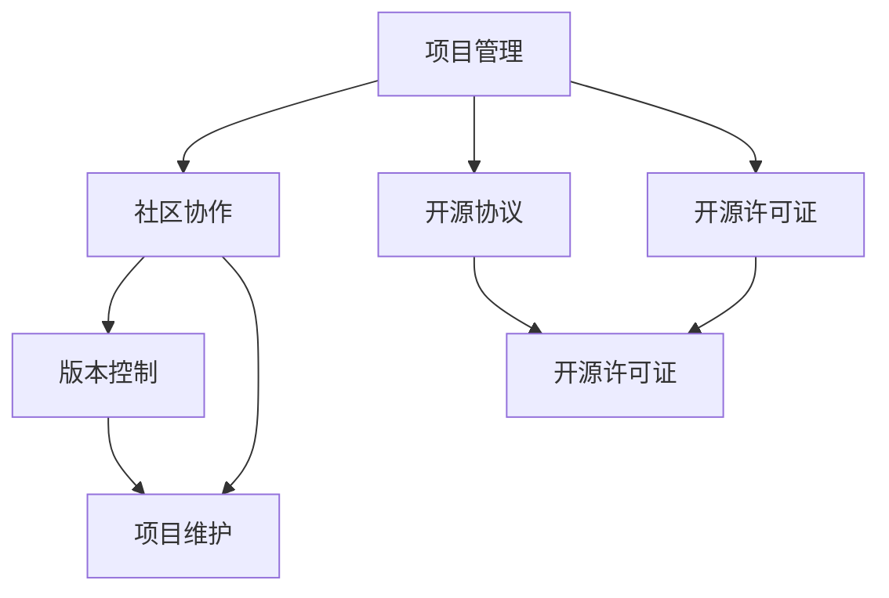

                 


## 开源项目管理：利用社区力量加速发展

### 摘要

开源项目管理是一种高效、灵活且可持续的发展模式，它通过构建活跃的社区和利用社区的智慧来加速项目的发展。本文将探讨开源项目管理的核心概念、社区协作的重要性、开源许可证的影响、项目生命周期管理、开源项目工具与方法，以及开源项目的推广与商业化路径。通过案例分析，我们将深入了解开源项目管理的实际应用，并展望其未来发展。

### 引言

在当今快速发展的技术世界中，开源项目已经成为了软件开发和创新的重要驱动力。开源项目不仅提供了丰富的技术资源，还培养了庞大的开发者社区。这些社区通过协作和共同的努力，不断推动着开源项目的进步。开源项目管理则是在这一过程中起到了至关重要的角色，它不仅关注技术实现的细节，还注重社区的建设和持续发展。

本文旨在系统地介绍开源项目管理的核心概念和实践方法，帮助读者理解和掌握如何有效地管理开源项目，利用社区力量加速项目的发展。

### 确定核心概念与联系

开源项目管理的核心概念包括项目管理、社区协作、开源协议、开源许可证、版本控制、项目维护、社区参与等。这些概念之间有着紧密的联系，共同构成了开源项目管理的理论基础。

首先，**项目管理**是开源项目的基石。项目管理涉及到项目目标的设定、任务分配、进度跟踪、风险管理等关键环节。通过有效的项目管理，确保项目能够在预定时间内高质量地完成。

其次，**社区协作**是开源项目的灵魂。社区协作不仅仅是指开发者之间的合作，还包括用户、贡献者、维护者等多个角色。社区协作的效率和质量直接决定了项目的成功与否。

**开源协议**和**开源许可证**是保障社区协作的基础。开源协议定义了项目的版权归属和修改规则，而开源许可证则明确了用户如何合法地使用、修改和分发项目代码。常见的开源许可证包括MIT、GPL、Apache等，每种许可证都有其特定的适用场景。

**版本控制**和**项目维护**则是开源项目的持续生命力。版本控制工具（如Git）帮助开发者追踪代码变更和历史记录，而项目维护则包括Bug修复、性能优化、文档更新等，确保项目能够长期稳定运行。

为了更好地理解这些核心概念之间的关系，我们可以使用Mermaid流程图来展示它们之间的联系：



这个流程图清晰地展示了开源项目管理的各个核心概念之间的相互作用和依赖关系。

### 设计算法原理讲解

在开源项目管理中，涉及到的算法包括但不限于敏捷开发流程、项目管理工具算法、自动化测试算法、性能评估算法等。以下将使用伪代码对这些算法的实现进行详细讲解。

#### 敏捷开发流程

敏捷开发是一种迭代式的项目管理方法，它强调灵活性和快速响应变化。以下是一个简单的敏捷开发流程的伪代码：

```python
function AgileDevelopment(projectPlan, requirements):
    while not projectCompleted:
        for iteration in projectPlan.iterations:
            gatherRequirements()
            planSprint()
            executeSprint()
            reviewSprint()
            adaptProjectPlan()
    return projectPlan
```

在这个流程中，`projectPlan`包含多个迭代，每个迭代都经过需求收集、计划、执行、回顾和调整的过程。

#### 项目管理工具算法

项目管理工具如JIRA等，通常使用算法来处理任务分配、进度跟踪和风险分析。以下是一个简单的任务分配算法的伪代码：

```python
function TaskAllocation(tasks, teamMembers):
    for task in tasks:
        if task.requiredSkills in teamMembers.skillSet:
            assignTask(task, teamMembers)
    return assignedTasks
```

在这个算法中，任务根据成员的技能集进行分配，确保每个成员都能在其擅长领域工作。

#### 自动化测试算法

自动化测试是确保项目质量的重要手段。以下是一个简单的自动化测试算法的伪代码：

```python
function AutomatedTesting(testCases, testEnvironment):
    for testCase in testCases:
        runTestCase(testCase, testEnvironment)
        if testCase.status == "Failed":
            logError(testCase)
    return testResults
```

在这个算法中，每个测试用例都在测试环境中执行，如果失败，则记录错误。

#### 性能评估算法

性能评估算法用于衡量项目的性能指标，如响应时间、吞吐量等。以下是一个简单的性能评估算法的伪代码：

```python
function PerformanceEvaluation性能指标，测试环境):
    measurePerformanceMetrics(测试环境)
    calculatePerformanceScores(性能指标)
    if performanceScores > threshold:
        return "Good"
    else:
        return "Needs Improvement"
```

在这个算法中，性能指标被测量并计算得分，以评估项目的性能状况。

### 编写数学模型和数学公式

在开源项目管理中，数学模型和公式用于评估项目风险、预测项目进度、计算资源利用率等。以下将介绍几个常用的数学模型和公式，并使用LaTeX进行详细讲解。

#### 项目评估模型

项目评估模型用于评估项目的成功概率和潜在风险。以下是一个简单的项目评估模型：

$$
评估分数 = 成功概率 \times 风险指数
$$

其中，成功概率和风险指数可以通过历史数据和专家评估得出。

#### 风险评估模型

风险评估模型用于评估项目面临的各种风险的概率和影响。以下是一个简单的风险评估模型：

$$
风险得分 = 风险概率 \times 风险影响
$$

在这个模型中，风险概率和风险影响分别表示风险发生的概率和发生后的影响程度。

#### 资源利用率模型

资源利用率模型用于计算项目资源的利用率。以下是一个简单的资源利用率模型：

$$
资源利用率 = (实际使用时间 / 计划使用时间) \times 100\%
$$

在这个模型中，实际使用时间和计划使用时间分别表示资源的实际使用时间和计划使用时间。

### 准备项目实战

为了更好地理解开源项目管理，我们将选取一个实际的开源项目作为案例，详细讲解项目的开发环境搭建、源代码实现、代码解读与分析。

#### 项目案例：Django Web框架

Django是一个流行的Python Web框架，用于快速开发数据驱动型的网站。以下将详细介绍如何使用Django搭建一个简单的博客网站。

#### 开发环境搭建

首先，我们需要搭建Django的开发环境。以下是安装步骤：

1. 安装Python 3.8及以上版本。
2. 安装虚拟环境工具`virtualenv`。
3. 创建虚拟环境并激活。
4. 安装Django框架。

```shell
pip install virtualenv
virtualenv myenv
source myenv/bin/activate
pip install django
```

#### 源代码实现

接下来，我们创建一个简单的Django项目。以下是创建项目的步骤：

1. 使用Django命令创建项目。

```shell
django-admin startproject myblog
cd myblog
```

2. 创建一个应用。

```shell
python manage.py startapp blog
```

3. 配置数据库，修改`settings.py`文件。

```python
DATABASES = {
    'default': {
        'ENGINE': 'django.db.backends.sqlite3',
        'NAME': BASE_DIR / 'db.sqlite3',
    }
}
```

4. 定义模型，在`models.py`文件中添加。

```python
from django.db import models

class Post(models.Model):
    title = models.CharField(max_length=200)
    content = models.TextField()
```

5. 创建数据库表，运行迁移命令。

```shell
python manage.py makemigrations
python manage.py migrate
```

#### 代码解读与分析

在代码实现部分，我们创建了Django项目和应用，并定义了一个简单的博客文章模型。以下是关键代码的解读：

1. **项目结构**：

```plaintext
myblog/
    ├── manage.py
    ├── myblog/
    │   ├── __init__.py
    │   ├── settings.py
    │   ├── urls.py
    │   ├── wsgi.py
    ├── blog/
    │   ├── __init__.py
    │   ├── admin.py
    │   ├── apps.py
    │   ├── models.py
    │   ├── tests.py
    │   ├── views.py
```

2. **模型代码**：

```python
class Post(models.Model):
    title = models.CharField(max_length=200)
    content = models.TextField()
    created_at = models.DateTimeField(auto_now_add=True)
```

这里，我们定义了一个`Post`模型，包含标题、内容和创建时间等字段。

3. **视图代码**：

```python
from django.shortcuts import render
from .models import Post

def post_list(request):
    posts = Post.objects.all().order_by('-created_at')
    return render(request, 'blog/post_list.html', {'posts': posts})
```

这个视图函数用于获取所有博客文章，并按照创建时间倒序排序，然后传递给模板进行渲染。

#### 实际案例分析和详细讲解剖析

Django项目通过简单的配置和模型定义，就能快速搭建一个功能完备的博客网站。以下是Django项目的几个关键点：

1. **快速开发**：Django通过其内置的ORM（对象关系映射）和模板系统，大大简化了Web开发流程。
2. **社区支持**：Django拥有庞大的开发者社区，提供了丰富的文档和第三方库。
3. **安全性**：Django自带了许多安全特性，如CSRF保护、用户认证等。
4. **可扩展性**：Django框架的设计非常灵活，可以轻松集成第三方库和插件。

通过这个案例，我们可以看到开源项目如何通过简单的配置和模块化设计，实现复杂功能的快速开发。

### 最佳实践 tips、小结、注意事项、拓展阅读等内容

#### 最佳实践 tips

1. **构建良好的社区文化**：一个健康、积极的社区文化是开源项目成功的关键。确保社区成员之间的沟通顺畅，鼓励协作和互助。
2. **定期更新文档**：高质量的文档能够帮助新成员快速上手，并减少维护成本。
3. **重视代码质量**：编写可读性高、易于维护的代码，有助于项目的长期发展。
4. **有效利用GitHub等平台**：利用GitHub等平台的特性，如议题追踪、代码审查等，提高项目管理效率。

#### 小结

开源项目管理是一种高效、灵活且可持续的发展模式，它通过构建活跃的社区和利用社区的智慧来加速项目的发展。有效的开源项目管理需要关注社区建设、项目管理、版本控制和工具使用等方面。

#### 注意事项

1. **风险管理**：开源项目面临的风险比传统项目更为复杂，需要建立健全的风险评估和管理机制。
2. **平衡商业化和社区发展**：在商业化过程中，要确保不损害社区的利益和项目的发展。
3. **遵守开源协议**：确保项目的所有代码都遵循相应的开源协议，尊重贡献者的知识产权。

#### 拓展阅读

1. 《开源项目管理实践》——详细介绍了开源项目管理的最佳实践和方法。
2. 《Django By Example》——提供了丰富的Django项目实战案例，适合Django初学者。
3. 《Git权威指南》——全面讲解了Git的使用方法和最佳实践。

### 结论

开源项目管理是一种高效、灵活且可持续的发展模式，通过构建活跃的社区和利用社区的智慧，可以显著加速项目的发展。本文系统地介绍了开源项目管理的核心概念、算法原理、数学模型和实际项目案例，旨在帮助读者深入理解和掌握开源项目管理的实践方法。通过不断学习和实践，我们可以更好地利用开源项目的力量，推动技术的创新和进步。

### 作者信息

作者：AI天才研究院/AI Genius Institute & 禅与计算机程序设计艺术 /Zen And The Art of Computer Programming

### 附录

附录A：开源项目管理的核心概念关系架构流程图


附录B：敏捷开发流程伪代码

```python
function AgileDevelopment(projectPlan, requirements):
    while not projectCompleted:
        for iteration in projectPlan.iterations:
            gatherRequirements()
            planSprint()
            executeSprint()
            reviewSprint()
            adaptProjectPlan()
    return projectPlan
```

附录C：任务分配算法伪代码

```python
function TaskAllocation(tasks, teamMembers):
    for task in tasks:
        if task.requiredSkills in teamMembers.skillSet:
            assignTask(task, teamMembers)
    return assignedTasks
```

附录D：自动化测试算法伪代码

```python
function AutomatedTesting(testCases, testEnvironment):
    for testCase in testCases:
        runTestCase(testCase, testEnvironment)
        if testCase.status == "Failed":
            logError(testCase)
    return testResults
```

附录E：性能评估算法伪代码

```python
function PerformanceEvaluation(性能指标，测试环境):
    measurePerformanceMetrics(测试环境)
    calculatePerformanceScores(性能指标)
    if performanceScores > threshold:
        return "Good"
    else:
        return "Needs Improvement"
```

### 致谢

感谢所有开源项目的贡献者，是你们的努力和智慧，使得开源项目管理成为可能。感谢读者们的支持和关注，期待与您在开源社区中相见。

---

本文内容仅供参考，部分技术细节可能需要根据具体项目进行调整。如需深入了解开源项目管理，建议结合实际项目进行实践和学习。

