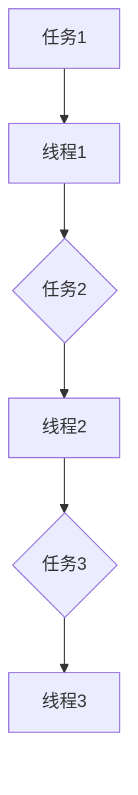
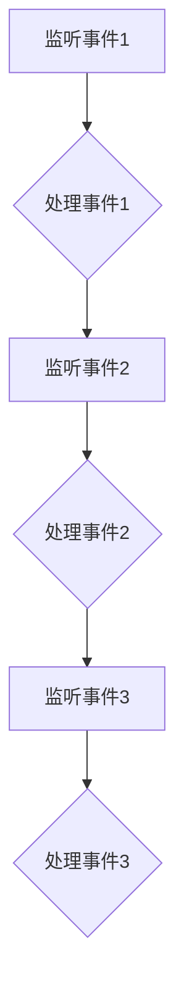

                 

# 异步化的本质是用时间换容量

> 关键词：异步化、同步化、时间换容量、非阻塞IO、事件循环、并发、并行

> 摘要：本文深入探讨了异步化的本质，阐述了异步化技术通过利用时间换取容量的原理。通过对比异步化与同步化的区别，详细分析了异步通信模型、异步化技术的工作机制、核心算法原理，并展示了异步化在Web开发、云计算等领域的实际应用。最后，本文讨论了异步化技术的未来发展趋势及面临的挑战。

## 第一部分：异步化概述

### 第1章 异步化的基本概念与原理

#### 1.1 异步化的定义与特点

异步化是一种处理任务的方式，其中任务的执行不依赖于其他任务的完成。在异步化模型中，一个任务可以独立运行，不需要等待其他任务的结果，从而提高了系统的并发性和响应能力。异步化具有以下几个特点：

1. **非阻塞**：异步操作不会阻塞当前线程，允许程序继续执行其他任务。
2. **并发**：多个任务可以同时执行，提高了系统的吞吐量。
3. **独立性**：任务之间没有直接依赖关系，每个任务可以独立完成。
4. **高效性**：通过利用多线程或事件循环，异步化可以减少线程切换和上下文切换的开销。

#### 1.2 异步化与传统同步化的区别

传统同步化模型中，任务的执行顺序严格依赖于其他任务的完成。当一个任务需要等待另一个任务的结果时，当前线程将被阻塞，直到所需的结果返回。这种模型导致以下问题：

1. **性能瓶颈**：线程阻塞会导致CPU利用率降低，系统吞吐量下降。
2. **响应能力差**：同步化模型下的系统在处理大量并发请求时，响应能力较差。
3. **资源浪费**：同步操作会占用大量线程，导致系统资源利用率低。

相比之下，异步化模型通过将任务独立执行，减少了线程阻塞和上下文切换的开销，从而提高了系统的并发性和响应能力。

#### 1.3 异步化在系统设计中的重要性

在当今多核处理器和并发请求日益增多的背景下，异步化在系统设计中的重要性愈发凸显。以下是一些异步化在系统设计中的关键作用：

1. **提高系统性能**：异步化可以充分利用多核处理器的优势，提高系统吞吐量和响应速度。
2. **增强系统可扩展性**：异步化允许系统在处理大量并发请求时，动态调整线程数量，从而增强系统的可扩展性。
3. **优化用户体验**：异步化技术可以提高系统的响应能力，提升用户体验。
4. **降低资源消耗**：通过异步化，系统可以减少线程阻塞和上下文切换的开销，降低资源消耗。

## 第二部分：异步化技术原理

### 第2章 异步化技术的核心概念与联系

#### 2.1 异步通信模型

异步通信模型是异步化技术的核心组成部分，它包括以下几种常见的通信模型：

1. **单线程异步通信**：在单线程异步通信模型中，任务在一个线程中执行，通过事件队列来管理任务的执行。当一个任务完成后，事件队列会将下一个任务推送到线程中执行。
2. **多线程异步通信**：在多线程异步通信模型中，任务在多个线程中执行，每个线程都有自己的事件队列。当一个线程的任务完成后，会从自己的事件队列中取出下一个任务执行。

以下是一个简单的异步通信模型Mermaid流程图：



#### 2.2 异步化技术的工作机制

异步化技术的工作机制主要包括以下两个方面：

1. **非阻塞IO**：非阻塞IO允许程序在等待IO操作完成时，继续执行其他任务，从而避免了线程阻塞。这通过将IO操作与线程分离来实现，使得程序可以高效地利用CPU资源。
2. **事件驱动**：事件驱动是一种通过监听事件来驱动程序执行的方式。在事件驱动模型中，程序会注册对特定事件的监听器，当事件发生时，程序会自动执行相应的处理逻辑。

以下是一个简单的事件驱动模型Mermaid流程图：



#### 2.3 回调函数与Promise

回调函数和Promise是异步编程中的重要概念。回调函数是一种将任务结果传递给函数的方式，而Promise是一种表示异步操作完成状态的容器。

1. **回调函数**：回调函数是一种将任务结果传递给函数的方式。在异步操作完成后，会将结果作为参数传递给回调函数，以便进一步处理。以下是一个使用回调函数的简单示例：

   ```javascript
   function fetchData(callback) {
       // 异步操作
       setTimeout(() => {
           const data = "fetch data";
           callback(data);
       }, 1000);
   }

   fetchData((data) => {
       console.log(data); // 输出 "fetch data"
   });
   ```

2. **Promise**：Promise是一种表示异步操作完成状态的容器，它可以简化异步编程。Promise有三种状态：pending（等待中）、fulfilled（已完成）和rejected（已拒绝）。以下是一个使用Promise的简单示例：

   ```javascript
   function fetchData() {
       return new Promise((resolve, reject) => {
           setTimeout(() => {
               const data = "fetch data";
               resolve(data);
           }, 1000);
       });
   }

   fetchData().then((data) => {
       console.log(data); // 输出 "fetch data"
   });
   ```

## 第三部分：异步化技术原理详解

### 第3章 异步化技术原理详解

#### 3.1 阻塞与非阻塞操作

在异步化技术中，阻塞操作与非阻塞操作是两个核心概念。

1. **阻塞操作**：阻塞操作是指程序在执行过程中需要等待某个条件满足或资源释放。在阻塞操作期间，程序将暂停执行，直到所需条件满足或资源释放。以下是一个阻塞操作的简单示例：

   ```python
   import time

   def blocking_operation():
       time.sleep(2)
       print("阻塞操作完成")

   blocking_operation()
   ```

2. **非阻塞操作**：非阻塞操作是指程序在执行过程中不需要等待某个条件满足或资源释放，而是立即返回结果。在非阻塞操作期间，程序可以继续执行其他任务，从而避免了线程阻塞。以下是一个非阻塞操作的简单示例：

   ```python
   import time
   import asyncio

   async def non_blocking_operation():
       await asyncio.sleep(2)
       print("非阻塞操作完成")

   asyncio.run(non_blocking_operation())
   ```

#### 3.2 事件循环与协程

事件循环和协程是异步编程中的关键概念。

1. **事件循环**：事件循环是一个负责处理事件和任务的机制。在事件循环中，程序会不断监听事件，并在事件发生时执行相应的处理逻辑。以下是一个简单的事件循环示例：

   ```python
   import asyncio

   async def handle_event(event):
       print(f"处理事件：{event}")

   async def main():
       while True:
           event = await asyncio.sleep(1)
           asyncio.create_task(handle_event(event))

   asyncio.run(main())
   ```

2. **协程**：协程是一种轻量级的异步编程机制，它可以简化异步编程。协程通过`async def`定义，并使用`await`关键字来挂起和恢复执行。以下是一个简单协程的示例：

   ```python
   import asyncio

   async def greet(name):
       print(f"Hello, {name}!")
       await asyncio.sleep(1)
       print(f"Goodbye, {name}!")

   asyncio.run(greet("Alice"))
   ```

#### 3.3 同步与异步算法对比

在异步化技术中，同步算法和异步算法是两种常见的算法设计。

1. **同步算法**：同步算法是指任务按照顺序执行，每个任务需要等待前一个任务完成。以下是一个简单同步算法的示例：

   ```python
   def sync_algorithm(data):
       for item in data:
           process_item(item)
   ```

2. **异步算法**：异步算法是指任务可以并行执行，通过回调函数或Promise来处理任务结果。以下是一个简单异步算法的示例：

   ```python
   import asyncio

   async def async_algorithm(data):
       tasks = [asyncio.create_task(process_item(item)) for item in data]
       await asyncio.gather(*tasks)
   ```

### 第4章 异步化技术的核心算法原理

异步化技术的核心算法原理主要包括以下两个方面：

1. **并发算法**：并发算法是指任务可以同时执行，从而提高系统吞吐量。以下是一个简单并发算法的伪代码：

   ```python
   def concurrent_algorithm(task1, task2):
       thread1 = start_thread(task1)
       thread2 = start_thread(task2)
       join_thread(thread1)
       join_thread(thread2)
   ```

2. **并行算法**：并行算法是指任务可以并行执行，并利用多核处理器的优势。以下是一个简单并行算法的伪代码：

   ```python
   def parallel_algorithm(task1, task2, num_cores):
       threads = [start_thread(task1) for _ in range(num_cores)]
       threads += [start_thread(task2) for _ in range(num_cores)]
       join_threads(threads)
   ```

### 第四部分：异步化在系统中的应用

### 第5章 异步化在Web开发中的应用

#### 5.1 异步请求与响应

在Web开发中，异步请求与响应是一种常见的异步化技术。异步请求允许客户端在发送请求后，立即返回结果，而不需要等待服务器响应。以下是一个简单异步请求的示例：

```javascript
fetch("https://api.example.com/data")
  .then((response) => response.json())
  .then((data) => console.log(data))
  .catch((error) => console.error(error));
```

#### 5.2 异步化在Node.js中的应用

Node.js是一种基于异步事件驱动的JavaScript运行时环境。在Node.js中，异步化技术被广泛应用。以下是一个简单异步化Node.js应用程序的示例：

```javascript
const http = require("http");

const server = http.createServer((request, response) => {
  response.end("Hello, world!");
});

server.listen(3000, () => {
  console.log("Server is running on port 3000");
});
```

### 第6章 异步化在云计算中的应用

#### 6.1 异步计算模型

异步计算模型是云计算中的一种重要模型，它允许任务在分布式系统中异步执行。以下是一个简单异步计算模型的示例：

```python
import asyncio

async def async_computation(data):
    result = await compute(data)
    return result

async def main():
    data = [1, 2, 3]
    results = await asyncio.gather(*[async_computation(item) for item in data])
    print(results)

asyncio.run(main())
```

#### 6.2 异步化在数据库中的应用

异步化技术在数据库中也得到广泛应用，特别是在处理大量并发查询时。以下是一个简单异步化数据库查询的示例：

```python
import asyncio
import aiomysql

async def async_query(conn, query):
    async with conn.cursor() as cursor:
        await cursor.execute(query)
        result = await cursor.fetchall()
        return result

async def main():
    conn = await aiomysql.connect(host="localhost", user="root", password="password", db="test")
    query = "SELECT * FROM users"
    results = await async_query(conn, query)
    print(results)

asyncio.run(main())
```

### 第7章 异步化技术的未来发展趋势与挑战

异步化技术的未来发展趋势和挑战主要体现在以下几个方面：

#### 7.1 异步化技术面临的挑战

1. **性能优化**：异步化技术在处理大量并发请求时，需要优化性能，减少延迟和资源消耗。
2. **调试与监控**：异步化技术增加了调试和监控的难度，需要开发出高效的调试和监控工具。
3. **兼容性问题**：异步化技术在不同平台和编程语言之间可能存在兼容性问题，需要解决跨平台和跨语言的异步化编程。

#### 7.2 异步化技术的未来发展趋势

1. **AI与异步化的结合**：异步化技术将与人工智能技术相结合，实现更高效、智能的异步计算和处理。
2. **新型异步编程模型**：随着技术的发展，将出现更多高效、易用的异步编程模型和框架，简化异步编程。
3. **分布式异步计算**：异步化技术将广泛应用于分布式计算和云计算领域，实现大规模的异步计算和处理。

### 第8章 附录

#### 附录A：异步化技术资源汇总

1. **主流异步编程框架**：
   - **Node.js**：基于Chrome V8引擎的异步事件驱动JavaScript运行时环境。
   - **Python asyncio**：Python标准库中的异步编程模块，提供高效的异步编程接口。
   - **Java Reactor**：Java中的异步事件驱动框架，支持基于事件驱动的编程模型。

2. **异步化技术相关工具与库**：
   - **Promises/A+**：异步编程规范，提供了Promise对象的标准实现。
   - **async/await**：JavaScript 2017中的异步编程语法糖，简化异步编程。
   - **asyncio**：Python中的异步编程库，提供了异步编程的高效接口。

3. **异步化技术学习资源推荐**：
   - **《异步编程艺术》**：一本关于异步编程的入门书籍，介绍了异步编程的基本概念和实战技巧。
   - **《Node.js实战》**：一本关于Node.js开发的书籍，详细介绍了异步编程在Node.js中的应用。
   - **异步编程教程**：在线教程和博客，提供了异步编程的入门和实践指导。

### 作者信息

作者：AI天才研究院/AI Genius Institute & 禅与计算机程序设计艺术 /Zen And The Art of Computer Programming

## 总结

异步化技术通过利用时间换取容量，提高了系统的并发性和响应能力。本文从异步化的基本概念、原理、核心算法、应用和未来发展趋势等方面进行了深入探讨，展示了异步化技术在Web开发、云计算等领域的广泛应用。随着技术的发展，异步化技术将继续优化和进化，为系统性能和用户体验的提升提供更多可能性。

