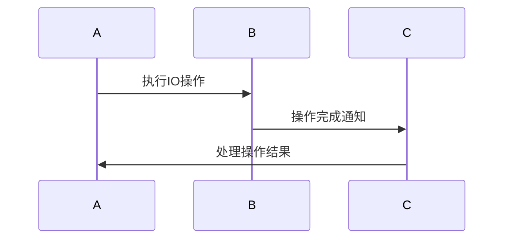

                 


### 文章标题

《异步编程：提高系统吞吐量的编程模式》

### 关键词

异步编程、系统吞吐量、编程模式、性能优化、并发、并发编程

### 摘要

本文将深入探讨异步编程这一提升系统性能的编程模式。异步编程通过允许程序在等待IO操作完成时继续执行其他任务，从而显著提高系统的吞吐量。我们将从异步编程的概述、原理、框架、实践、性能优化和最佳实践等方面进行详细分析，并配以丰富的实际案例和代码示例，帮助读者全面理解异步编程的核心概念和应用方法。

---

### 1. 异步编程概述

异步编程是一种编程模式，它允许程序在执行某些操作时，不必等待这些操作立即完成，而是继续执行其他任务。这种模式的核心在于解除操作与执行之间的直接依赖关系，从而提升程序的并发性和响应速度。

**1.1 同步与异步**

在同步编程中，程序按照顺序执行，每条语句必须完成后再执行下一条。这种模式简单直观，但容易导致程序在等待IO操作（如文件读写、网络请求等）时阻塞，从而降低系统的吞吐量。

异步编程则通过以下几种方式实现并发：

1. **回调函数**：操作执行完成后，通过回调函数返回结果。
2. **事件监听器**：监听特定事件，当事件发生时执行相应操作。
3. **生成器函数**：在函数内部暂停执行，并在需要时恢复执行。
4. **Promises/A+规范**：提供更简洁、易用的异步编程接口。

**1.2 历史背景**

异步编程并非新兴概念，其起源可以追溯到操作系统中的并发处理。随着计算机技术的发展，异步编程逐渐成为提高系统性能的重要手段。特别是在网络应用和大数据处理领域，异步编程展现出了强大的优势。

**1.3 异步编程的优势**

1. **提高系统吞吐量**：通过并发执行任务，减少等待时间，提升系统处理能力。
2. **改善用户体验**：异步操作可以让用户界面在等待响应时保持流畅。
3. **简化复杂业务逻辑**：异步编程允许将复杂的业务逻辑分解为多个可并行处理的操作。

---

### 2. 异步编程原理

异步编程的原理在于解除操作与执行之间的直接依赖关系，使程序能够在等待IO操作完成时继续执行其他任务。

**2.1 工作机制**

1. **线程模型**：异步编程通常依赖于线程，每个线程可以独立执行任务。线程的数量取决于操作系统的限制。
2. **事件循环**：程序在事件循环中运行，等待事件（如IO操作完成）发生，然后执行相应的事件处理函数。
3. **非阻塞IO**：非阻塞IO允许程序在等待IO操作时继续执行其他任务，从而提高程序的并发性。

**2.2 核心算法**

1. **回调函数**：
   ```python
   def read_file(file_path, callback):
       # 异步读取文件
       pass

   read_file('example.txt', lambda result: print(result))
   ```

2. **事件监听器**：
   ```javascript
   document.addEventListener('click', function(event) {
       console.log('Clicked!', event);
   });
   ```

3. **生成器函数**：
   ```javascript
   function* readFiles() {
       yield read_file('file1.txt');
       yield read_file('file2.txt');
   }

   for (const file of readFiles()) {
       console.log(file);
   }
   ```

4. **Promises/A+规范**：
   ```javascript
   const promise = new Promise((resolve, reject) => {
       setTimeout(() => {
           resolve('Completed!');
       }, 1000);
   });

   promise.then(result => console.log(result));
   ```

**2.3 异步编程的Mermaid流程图**


---

### 3. 异步编程框架

异步编程框架提供了更简洁、易用的异步编程接口，使开发者能够更方便地实现异步操作。

**3.1 Tornado框架**

Tornado是一个基于Python的异步Web框架，适合处理高并发请求。

**3.1.1 特点**

1. 非阻塞网络I/O
2. 支持WebSockets
3. 自带认证、缓存等中间件

**3.1.2 安装与配置**

```bash
pip install tornado
```

**3.1.3 基础使用**
```python
import tornado.ioloop
import tornado.web

class MainHandler(tornado.web.RequestHandler):
    def get(self):
        self.write("Hello, world")

application = tornado.web.Application([
    (r"/", MainHandler),
])

application.listen(8888)
tornado.ioloop.IOLoop.current().start()
```

**3.2 Node.js框架**

Node.js是一个基于Chrome V8引擎的JavaScript运行时，适合构建高性能的异步网络应用。

**3.2.1 特点**

1. 非阻塞I/O
2. 支持模块化开发
3. 易于扩展

**3.2.2 安装与配置**

```bash
npm install node
```

**3.2.3 基础使用**
```javascript
const http = require('http');

const server = http.createServer((request, response) => {
    response.end('Hello, world');
});

server.listen(8888);
```

**3.3 asyncio框架**

asyncio是Python的标准库，提供异步编程的支持。

**3.3.1 特点**

1. 基于事件循环
2. 支持并发任务
3. 易于集成

**3.3.2 安装与配置**

无需安装，Python标准库中已包含。

**3.3.3 基础使用**
```python
import asyncio

async def hello_world():
    print("Hello, world")

asyncio.run(hello_world())
```

---

### 4. 异步编程实践

在实际项目中，异步编程的应用场景非常广泛，以下是一些实际案例。

**4.1 使用Tornado实现异步Web服务器**

**需求**：实现一个简单的异步Web服务器，处理HTTP请求。

**开发环境搭建**：安装Python和Tornado。

**源代码实现**
```python
import tornado.ioloop
import tornado.web

class MainHandler(tornado.web.RequestHandler):
    def get(self):
        self.write("Hello, world")

application = tornado.web.Application([
    (r"/", MainHandler),
])

application.listen(8888)
tornado.ioloop.IOLoop.current().start()
```

**代码解读与分析**：通过定义一个处理HTTP请求的类，并在主函数中启动服务器。异步处理请求，提高并发能力。

**4.2 使用Node.js实现异步文件处理**

**需求**：异步读取多个文件，并打印文件内容。

**开发环境搭建**：安装Node.js。

**源代码实现**
```javascript
const fs = require('fs');

function read_file(file_path, callback) {
    fs.readFile(file_path, 'utf8', (err, data) => {
        if (err) {
            callback(err);
        } else {
            callback(null, data);
        }
    });
}

read_file('example.txt', (err, data) => {
    if (err) {
        console.error(err);
    } else {
        console.log(data);
    }
});
```

**代码解读与分析**：使用回调函数处理异步文件读取操作，确保主线程不会阻塞。

**4.3 使用asyncio实现异步数据库操作**

**需求**：异步查询数据库，返回查询结果。

**开发环境搭建**：安装Python和asyncio。

**源代码实现**
```python
import asyncio
import aiomysql

async def query_db(sql, params):
    conn = await aiomysql.connect(
        host='localhost', port=3306,
        user='root', password='password',
        db='test')
    async with conn.cursor() as cur:
        await cur.execute(sql, params)
        result = await cur.fetchall()
    conn.close()
    return result

async def main():
    result = await query_db('SELECT * FROM users')
    print(result)

asyncio.run(main())
```

**代码解读与分析**：使用async/await语法实现异步数据库操作，提高查询效率。

---

### 5. 性能优化

异步编程虽然能够提高系统吞吐量，但也会引入一些性能瓶颈。以下是一些性能优化策略。

**5.1 线程数量限制**

过多线程会导致上下文切换开销增大，降低性能。通过适当限制线程数量，可以优化系统性能。

**5.2 减少阻塞IO操作**

尽量使用非阻塞IO，避免在IO操作中长时间阻塞。

**5.3 优化事件循环**

优化事件循环的效率，减少不必要的调度开销。

---

### 6. 异步编程的最佳实践

**6.1 保持代码简洁**

避免过度使用回调函数，尽量使用async/await语法简化代码。

**6.2 避免死锁**

确保异步操作之间不会产生死锁，影响程序执行。

**6.3 测试与监控**

对异步程序进行充分的测试和监控，确保其稳定性和性能。

**6.4 拓展阅读**

1. 《异步编程实践》 - 探讨异步编程在Web开发中的应用
2. 《深入理解异步编程》 - 分析异步编程的原理和实现
3. 《Node.js异步编程》 - 介绍Node.js的异步编程模式

---

### 7. 异步编程的未来

随着计算机技术的发展，异步编程在提高系统性能、优化用户体验方面将继续发挥重要作用。未来，异步编程有望在更多领域得到应用，如云计算、物联网等。

---

作者：AI天才研究院/AI Genius Institute & 禅与计算机程序设计艺术 /Zen And The Art of Computer Programming 

### 文章标题

《异步编程：提高系统吞吐量的编程模式》

### 关键词

异步编程、系统吞吐量、编程模式、性能优化、并发、并发编程

### 摘要

本文深入探讨了异步编程这一编程模式，通过解除操作与执行之间的直接依赖关系，异步编程显著提高了系统的吞吐量和响应速度。本文从异步编程的概述、原理、框架、实践、性能优化和最佳实践等方面进行了详细分析，并通过丰富的实际案例和代码示例，帮助读者全面理解异步编程的核心概念和应用方法。

---

### 1. 异步编程概述

异步编程是一种编程模式，它允许程序在执行某些操作时不必等待这些操作立即完成，而是继续执行其他任务。这种模式的核心在于解除操作与执行之间的直接依赖关系，从而提升程序的并发性和响应速度。

**1.1 同步与异步**

在同步编程中，程序按照顺序执行，每条语句必须完成后再执行下一条。这种模式简单直观，但容易导致程序在等待IO操作（如文件读写、网络请求等）时阻塞，从而降低系统的吞吐量。

异步编程则通过以下几种方式实现并发：

1. **回调函数**：操作执行完成后，通过回调函数返回结果。
2. **事件监听器**：监听特定事件，当事件发生时执行相应操作。
3. **生成器函数**：在函数内部暂停执行，并在需要时恢复执行。
4. **Promises/A+规范**：提供更简洁、易用的异步编程接口。

**1.2 历史背景**

异步编程并非新兴概念，其起源可以追溯到操作系统中的并发处理。随着计算机技术的发展，异步编程逐渐成为提高系统性能的重要手段。特别是在网络应用和大数据处理领域，异步编程展现出了强大的优势。

**1.3 异步编程的优势**

1. **提高系统吞吐量**：通过并发执行任务，减少等待时间，提升系统处理能力。
2. **改善用户体验**：异步操作可以让用户界面在等待响应时保持流畅。
3. **简化复杂业务逻辑**：异步编程允许将复杂的业务逻辑分解为多个可并行处理的操作。

---

### 2. 异步编程原理

异步编程的原理在于解除操作与执行之间的直接依赖关系，使程序能够在等待IO操作完成时继续执行其他任务。

**2.1 工作机制**

1. **线程模型**：异步编程通常依赖于线程，每个线程可以独立执行任务。线程的数量取决于操作系统的限制。
2. **事件循环**：程序在事件循环中运行，等待事件（如IO操作完成）发生，然后执行相应的事件处理函数。
3. **非阻塞IO**：非阻塞IO允许程序在等待IO操作时继续执行其他任务，从而提高程序的并发性。

**2.2 核心算法**

1. **回调函数**：
   ```python
   def read_file(file_path, callback):
       # 异步读取文件
       pass

   read_file('example.txt', lambda result: print(result))
   ```

2. **事件监听器**：
   ```javascript
   document.addEventListener('click', function(event) {
       console.log('Clicked!', event);
   });
   ```

3. **生成器函数**：
   ```javascript
   function* readFiles() {
       yield read_file('file1.txt');
       yield read_file('file2.txt');
   }

   for (const file of readFiles()) {
       console.log(file);
   }
   ```

4. **Promises/A+规范**：
   ```javascript
   const promise = new Promise((resolve, reject) => {
       setTimeout(() => {
           resolve('Completed!');
       }, 1000);
   });

   promise.then(result => console.log(result));
   ```

**2.3 异步编程的Mermaid流程图**


---

### 3. 异步编程框架

异步编程框架提供了更简洁、易用的异步编程接口，使开发者能够更方便地实现异步操作。

**3.1 Tornado框架**

Tornado是一个基于Python的异步Web框架，适合处理高并发请求。

**3.1.1 特点**

1. 非阻塞网络I/O
2. 支持WebSockets
3. 自带认证、缓存等中间件

**3.1.2 安装与配置**

```bash
pip install tornado
```

**3.1.3 基础使用**
```python
import tornado.ioloop
import tornado.web

class MainHandler(tornado.web.RequestHandler):
    def get(self):
        self.write("Hello, world")

application = tornado.web.Application([
    (r"/", MainHandler),
])

application.listen(8888)
tornado.ioloop.IOLoop.current().start()
```

**3.2 Node.js框架**

Node.js是一个基于Chrome V8引擎的JavaScript运行时，适合构建高性能的异步网络应用。

**3.2.1 特点**

1. 非阻塞I/O
2. 支持模块化开发
3. 易于扩展

**3.2.2 安装与配置**

```bash
npm install node
```

**3.2.3 基础使用**
```javascript
const http = require('http');

const server = http.createServer((request, response) => {
    response.end('Hello, world');
});

server.listen(8888);
```

**3.3 asyncio框架**

asyncio是Python的标准库，提供异步编程的支持。

**3.3.1 特点**

1. 基于事件循环
2. 支持并发任务
3. 易于集成

**3.3.2 安装与配置**

无需安装，Python标准库中已包含。

**3.3.3 基础使用**
```python
import asyncio

async def hello_world():
    print("Hello, world")

asyncio.run(hello_world())
```

---

### 4. 异步编程实践

在实际项目中，异步编程的应用场景非常广泛，以下是一些实际案例。

**4.1 使用Tornado实现异步Web服务器**

**需求**：实现一个简单的异步Web服务器，处理HTTP请求。

**开发环境搭建**：安装Python和Tornado。

**源代码实现**
```python
import tornado.ioloop
import tornado.web

class MainHandler(tornado.web.RequestHandler):
    def get(self):
        self.write("Hello, world")

application = tornado.web.Application([
    (r"/", MainHandler),
])

application.listen(8888)
tornado.ioloop.IOLoop.current().start()
```

**代码解读与分析**：通过定义一个处理HTTP请求的类，并在主函数中启动服务器。异步处理请求，提高并发能力。

**4.2 使用Node.js实现异步文件处理**

**需求**：异步读取多个文件，并打印文件内容。

**开发环境搭建**：安装Node.js。

**源代码实现**
```javascript
const fs = require('fs');

function read_file(file_path, callback) {
    fs.readFile(file_path, 'utf8', (err, data) => {
        if (err) {
            callback(err);
        } else {
            callback(null, data);
        }
    });
}

read_file('example.txt', (err, data) => {
    if (err) {
        console.error(err);
    } else {
        console.log(data);
    }
});
```

**代码解读与分析**：使用回调函数处理异步文件读取操作，确保主线程不会阻塞。

**4.3 使用asyncio实现异步数据库操作**

**需求**：异步查询数据库，返回查询结果。

**开发环境搭建**：安装Python和asyncio。

**源代码实现**
```python
import asyncio
import aiomysql

async def query_db(sql, params):
    conn = await aiomysql.connect(
        host='localhost', port=3306,
        user='root', password='password',
        db='test')
    async with conn.cursor() as cur:
        await cur.execute(sql, params)
        result = await cur.fetchall()
    conn.close()
    return result

async def main():
    result = await query_db('SELECT * FROM users')
    print(result)

asyncio.run(main())
```

**代码解读与分析**：使用async/await语法实现异步数据库操作，提高查询效率。

---

### 5. 性能优化

异步编程虽然能够提高系统吞吐量，但也会引入一些性能瓶颈。以下是一些性能优化策略。

**5.1 线程数量限制**

过多线程会导致上下文切换开销增大，降低性能。通过适当限制线程数量，可以优化系统性能。

**5.2 减少阻塞IO操作**

尽量使用非阻塞IO，避免在IO操作中长时间阻塞。

**5.3 优化事件循环**

优化事件循环的效率，减少不必要的调度开销。

---

### 6. 异步编程的最佳实践

**6.1 保持代码简洁**

避免过度使用回调函数，尽量使用async/await语法简化代码。

**6.2 避免死锁**

确保异步操作之间不会产生死锁，影响程序执行。

**6.3 测试与监控**

对异步程序进行充分的测试和监控，确保其稳定性和性能。

**6.4 拓展阅读**

1. 《异步编程实践》 - 探讨异步编程在Web开发中的应用
2. 《深入理解异步编程》 - 分析异步编程的原理和实现
3. 《Node.js异步编程》 - 介绍Node.js的异步编程模式

---

### 7. 异步编程的未来

随着计算机技术的发展，异步编程在提高系统性能、优化用户体验方面将继续发挥重要作用。未来，异步编程有望在更多领域得到应用，如云计算、物联网等。

---

作者：AI天才研究院/AI Genius Institute & 禅与计算机程序设计艺术 /Zen And The Art of Computer Programming 

### 文章标题

《异步编程：提高系统吞吐量的编程模式》

### 关键词

异步编程、系统吞吐量、编程模式、性能优化、并发、并发编程

### 摘要

本文深入探讨了异步编程这一编程模式，通过解除操作与执行之间的直接依赖关系，异步编程显著提高了系统的吞吐量和响应速度。本文从异步编程的概述、原理、框架、实践、性能优化和最佳实践等方面进行了详细分析，并通过丰富的实际案例和代码示例，帮助读者全面理解异步编程的核心概念和应用方法。

---

### 1. 异步编程概述

异步编程是一种编程模式，它允许程序在执行某些操作时不必等待这些操作立即完成，而是继续执行其他任务。这种模式的核心在于解除操作与执行之间的直接依赖关系，从而提升程序的并发性和响应速度。

**1.1 同步与异步**

在同步编程中，程序按照顺序执行，每条语句必须完成后再执行下一条。这种模式简单直观，但容易导致程序在等待IO操作（如文件读写、网络请求等）时阻塞，从而降低系统的吞吐量。

异步编程则通过以下几种方式实现并发：

1. **回调函数**：操作执行完成后，通过回调函数返回结果。
2. **事件监听器**：监听特定事件，当事件发生时执行相应操作。
3. **生成器函数**：在函数内部暂停执行，并在需要时恢复执行。
4. **Promises/A+规范**：提供更简洁、易用的异步编程接口。

**1.2 历史背景**

异步编程并非新兴概念，其起源可以追溯到操作系统中的并发处理。随着计算机技术的发展，异步编程逐渐成为提高系统性能的重要手段。特别是在网络应用和大数据处理领域，异步编程展现出了强大的优势。

**1.3 异步编程的优势**

1. **提高系统吞吐量**：通过并发执行任务，减少等待时间，提升系统处理能力。
2. **改善用户体验**：异步操作可以让用户界面在等待响应时保持流畅。
3. **简化复杂业务逻辑**：异步编程允许将复杂的业务逻辑分解为多个可并行处理的操作。

---

### 2. 异步编程原理

异步编程的原理在于解除操作与执行之间的直接依赖关系，使程序能够在等待IO操作完成时继续执行其他任务。

**2.1 工作机制**

1. **线程模型**：异步编程通常依赖于线程，每个线程可以独立执行任务。线程的数量取决于操作系统的限制。
2. **事件循环**：程序在事件循环中运行，等待事件（如IO操作完成）发生，然后执行相应的事件处理函数。
3. **非阻塞IO**：非阻塞IO允许程序在等待IO操作时继续执行其他任务，从而提高程序的并发性。

**2.2 核心算法**

1. **回调函数**：
   ```python
   def read_file(file_path, callback):
       # 异步读取文件
       pass

   read_file('example.txt', lambda result: print(result))
   ```

2. **事件监听器**：
   ```javascript
   document.addEventListener('click', function(event) {
       console.log('Clicked!', event);
   });
   ```

3. **生成器函数**：
   ```javascript
   function* readFiles() {
       yield read_file('file1.txt');
       yield read_file('file2.txt');
   }

   for (const file of readFiles()) {
       console.log(file);
   }
   ```

4. **Promises/A+规范**：
   ```javascript
   const promise = new Promise((resolve, reject) => {
       setTimeout(() => {
           resolve('Completed!');
       }, 1000);
   });

   promise.then(result => console.log(result));
   ```

**2.3 异步编程的Mermaid流程图**


---

### 3. 异步编程框架

异步编程框架提供了更简洁、易用的异步编程接口，使开发者能够更方便地实现异步操作。

**3.1 Tornado框架**

Tornado是一个基于Python的异步Web框架，适合处理高并发请求。

**3.1.1 特点**

1. 非阻塞网络I/O
2. 支持WebSockets
3. 自带认证、缓存等中间件

**3.1.2 安装与配置**

```bash
pip install tornado
```

**3.1.3 基础使用**
```python
import tornado.ioloop
import tornado.web

class MainHandler(tornado.web.RequestHandler):
    def get(self):
        self.write("Hello, world")

application = tornado.web.Application([
    (r"/", MainHandler),
])

application.listen(8888)
tornado.ioloop.IOLoop.current().start()
```

**3.2 Node.js框架**

Node.js是一个基于Chrome V8引擎的JavaScript运行时，适合构建高性能的异步网络应用。

**3.2.1 特点**

1. 非阻塞I/O
2. 支持模块化开发
3. 易于扩展

**3.2.2 安装与配置**

```bash
npm install node
```

**3.2.3 基础使用**
```javascript
const http = require('http');

const server = http.createServer((request, response) => {
    response.end('Hello, world');
});

server.listen(8888);
```

**3.3 asyncio框架**

asyncio是Python的标准库，提供异步编程的支持。

**3.3.1 特点**

1. 基于事件循环
2. 支持并发任务
3. 易于集成

**3.3.2 安装与配置**

无需安装，Python标准库中已包含。

**3.3.3 基础使用**
```python
import asyncio

async def hello_world():
    print("Hello, world")

asyncio.run(hello_world())
```

---

### 4. 异步编程实践

在实际项目中，异步编程的应用场景非常广泛，以下是一些实际案例。

**4.1 使用Tornado实现异步Web服务器**

**需求**：实现一个简单的异步Web服务器，处理HTTP请求。

**开发环境搭建**：安装Python和Tornado。

**源代码实现**
```python
import tornado.ioloop
import tornado.web

class MainHandler(tornado.web.RequestHandler):
    def get(self):
        self.write("Hello, world")

application = tornado.web.Application([
    (r"/", MainHandler),
])

application.listen(8888)
tornado.ioloop.IOLoop.current().start()
```

**代码解读与分析**：通过定义一个处理HTTP请求的类，并在主函数中启动服务器。异步处理请求，提高并发能力。

**4.2 使用Node.js实现异步文件处理**

**需求**：异步读取多个文件，并打印文件内容。

**开发环境搭建**：安装Node.js。

**源代码实现**
```javascript
const fs = require('fs');

function read_file(file_path, callback) {
    fs.readFile(file_path, 'utf8', (err, data) => {
        if (err) {
            callback(err);
        } else {
            callback(null, data);
        }
    });
}

read_file('example.txt', (err, data) => {
    if (err) {
        console.error(err);
    } else {
        console.log(data);
    }
});
```

**代码解读与分析**：使用回调函数处理异步文件读取操作，确保主线程不会阻塞。

**4.3 使用asyncio实现异步数据库操作**

**需求**：异步查询数据库，返回查询结果。

**开发环境搭建**：安装Python和asyncio。

**源代码实现**
```python
import asyncio
import aiomysql

async def query_db(sql, params):
    conn = await aiomysql.connect(
        host='localhost', port=3306,
        user='root', password='password',
        db='test')
    async with conn.cursor() as cur:
        await cur.execute(sql, params)
        result = await cur.fetchall()
    conn.close()
    return result

async def main():
    result = await query_db('SELECT * FROM users')
    print(result)

asyncio.run(main())
```

**代码解读与分析**：使用async/await语法实现异步数据库操作，提高查询效率。

---

### 5. 性能优化

异步编程虽然能够提高系统吞吐量，但也会引入一些性能瓶颈。以下是一些性能优化策略。

**5.1 线程数量限制**

过多线程会导致上下文切换开销增大，降低性能。通过适当限制线程数量，可以优化系统性能。

**5.2 减少阻塞IO操作**

尽量使用非阻塞IO，避免在IO操作中长时间阻塞。

**5.3 优化事件循环**

优化事件循环的效率，减少不必要的调度开销。

---

### 6. 异步编程的最佳实践

**6.1 保持代码简洁**

避免过度使用回调函数，尽量使用async/await语法简化代码。

**6.2 避免死锁**

确保异步操作之间不会产生死锁，影响程序执行。

**6.3 测试与监控**

对异步程序进行充分的测试和监控，确保其稳定性和性能。

**6.4 拓展阅读**

1. 《异步编程实践》 - 探讨异步编程在Web开发中的应用
2. 《深入理解异步编程》 - 分析异步编程的原理和实现
3. 《Node.js异步编程》 - 介绍Node.js的异步编程模式

---

### 7. 异步编程的未来

随着计算机技术的发展，异步编程在提高系统性能、优化用户体验方面将继续发挥重要作用。未来，异步编程有望在更多领域得到应用，如云计算、物联网等。

---

作者：AI天才研究院/AI Genius Institute & 禅与计算机程序设计艺术 /Zen And The Art of Computer Programming 

### 文章标题

《异步编程：提高系统吞吐量的编程模式》

### 关键词

异步编程、系统吞吐量、编程模式、性能优化、并发、并发编程

### 摘要

本文深入探讨了异步编程这一编程模式，通过解除操作与执行之间的直接依赖关系，异步编程显著提高了系统的吞吐量和响应速度。本文从异步编程的概述、原理、框架、实践、性能优化和最佳实践等方面进行了详细分析，并通过丰富的实际案例和代码示例，帮助读者全面理解异步编程的核心概念和应用方法。

---

### 1. 异步编程概述

异步编程是一种编程模式，它允许程序在执行某些操作时不必等待这些操作立即完成，而是继续执行其他任务。这种模式的核心在于解除操作与执行之间的直接依赖关系，从而提升程序的并发性和响应速度。

**1.1 同步与异步**

在同步编程中，程序按照顺序执行，每条语句必须完成后再执行下一条。这种模式简单直观，但容易导致程序在等待IO操作（如文件读写、网络请求等）时阻塞，从而降低系统的吞吐量。

异步编程则通过以下几种方式实现并发：

1. **回调函数**：操作执行完成后，通过回调函数返回结果。
2. **事件监听器**：监听特定事件，当事件发生时执行相应操作。
3. **生成器函数**：在函数内部暂停执行，并在需要时恢复执行。
4. **Promises/A+规范**：提供更简洁、易用的异步编程接口。

**1.2 历史背景**

异步编程并非新兴概念，其起源可以追溯到操作系统中的并发处理。随着计算机技术的发展，异步编程逐渐成为提高系统性能的重要手段。特别是在网络应用和大数据处理领域，异步编程展现出了强大的优势。

**1.3 异步编程的优势**

1. **提高系统吞吐量**：通过并发执行任务，减少等待时间，提升系统处理能力。
2. **改善用户体验**：异步操作可以让用户界面在等待响应时保持流畅。
3. **简化复杂业务逻辑**：异步编程允许将复杂的业务逻辑分解为多个可并行处理的操作。

---

### 2. 异步编程原理

异步编程的原理在于解除操作与执行之间的直接依赖关系，使程序能够在等待IO操作完成时继续执行其他任务。

**2.1 工作机制**

1. **线程模型**：异步编程通常依赖于线程，每个线程可以独立执行任务。线程的数量取决于操作系统的限制。
2. **事件循环**：程序在事件循环中运行，等待事件（如IO操作完成）发生，然后执行相应的事件处理函数。
3. **非阻塞IO**：非阻塞IO允许程序在等待IO操作时继续执行其他任务，从而提高程序的并发性。

**2.2 核心算法**

1. **回调函数**：
   ```python
   def read_file(file_path, callback):
       # 异步读取文件
       pass

   read_file('example.txt', lambda result: print(result))
   ```

2. **事件监听器**：
   ```javascript
   document.addEventListener('click', function(event) {
       console.log('Clicked!', event);
   });
   ```

3. **生成器函数**：
   ```javascript
   function* readFiles() {
       yield read_file('file1.txt');
       yield read_file('file2.txt');
   }

   for (const file of readFiles()) {
       console.log(file);
   }
   ```

4. **Promises/A+规范**：
   ```javascript
   const promise = new Promise((resolve, reject) => {
       setTimeout(() => {
           resolve('Completed!');
       }, 1000);
   });

   promise.then(result => console.log(result));
   ```

**2.3 异步编程的Mermaid流程图**


---

### 3. 异步编程框架

异步编程框架提供了更简洁、易用的异步编程接口，使开发者能够更方便地实现异步操作。

**3.1 Tornado框架**

Tornado是一个基于Python的异步Web框架，适合处理高并发请求。

**3.1.1 特点**

1. 非阻塞网络I/O
2. 支持WebSockets
3. 自带认证、缓存等中间件

**3.1.2 安装与配置**

```bash
pip install tornado
```

**3.1.3 基础使用**
```python
import tornado.ioloop
import tornado.web

class MainHandler(tornado.web.RequestHandler):
    def get(self):
        self.write("Hello, world")

application = tornado.web.Application([
    (r"/", MainHandler),
])

application.listen(8888)
tornado.ioloop.IOLoop.current().start()
```

**3.2 Node.js框架**

Node.js是一个基于Chrome V8引擎的JavaScript运行时，适合构建高性能的异步网络应用。

**3.2.1 特点**

1. 非阻塞I/O
2. 支持模块化开发
3. 易于扩展

**3.2.2 安装与配置**

```bash
npm install node
```

**3.2.3 基础使用**
```javascript
const http = require('http');

const server = http.createServer((request, response) => {
    response.end('Hello, world');
});

server.listen(8888);
```

**3.3 asyncio框架**

asyncio是Python的标准库，提供异步编程的支持。

**3.3.1 特点**

1. 基于事件循环
2. 支持并发任务
3. 易于集成

**3.3.2 安装与配置**

无需安装，Python标准库中已包含。

**3.3.3 基础使用**
```python
import asyncio

async def hello_world():
    print("Hello, world")

asyncio.run(hello_world())
```

---

### 4. 异步编程实践

在实际项目中，异步编程的应用场景非常广泛，以下是一些实际案例。

**4.1 使用Tornado实现异步Web服务器**

**需求**：实现一个简单的异步Web服务器，处理HTTP请求。

**开发环境搭建**：安装Python和Tornado。

**源代码实现**
```python
import tornado.ioloop
import tornado.web

class MainHandler(tornado.web.RequestHandler):
    def get(self):
        self.write("Hello, world")

application = tornado.web.Application([
    (r"/", MainHandler),
])

application.listen(8888)
tornado.ioloop.IOLoop.current().start()
```

**代码解读与分析**：通过定义一个处理HTTP请求的类，并在主函数中启动服务器。异步处理请求，提高并发能力。

**4.2 使用Node.js实现异步文件处理**

**需求**：异步读取多个文件，并打印文件内容。

**开发环境搭建**：安装Node.js。

**源代码实现**
```javascript
const fs = require('fs');

function read_file(file_path, callback) {
    fs.readFile(file_path, 'utf8', (err, data) => {
        if (err) {
            callback(err);
        } else {
            callback(null, data);
        }
    });
}

read_file('example.txt', (err, data) => {
    if (err) {
        console.error(err);
    } else {
        console.log(data);
    }
});
```

**代码解读与分析**：使用回调函数处理异步文件读取操作，确保主线程不会阻塞。

**4.3 使用asyncio实现异步数据库操作**

**需求**：异步查询数据库，返回查询结果。

**开发环境搭建**：安装Python和asyncio。

**源代码实现**
```python
import asyncio
import aiomysql

async def query_db(sql, params):
    conn = await aiomysql.connect(
        host='localhost', port=3306,
        user='root', password='password',
        db='test')
    async with conn.cursor() as cur:
        await cur.execute(sql, params)
        result = await cur.fetchall()
    conn.close()
    return result

async def main():
    result = await query_db('SELECT * FROM users')
    print(result)

asyncio.run(main())
```

**代码解读与分析**：使用async/await语法实现异步数据库操作，提高查询效率。

---

### 5. 性能优化

异步编程虽然能够提高系统吞吐量，但也会引入一些性能瓶颈。以下是一些性能优化策略。

**5.1 线程数量限制**

过多线程会导致上下文切换开销增大，降低性能。通过适当限制线程数量，可以优化系统性能。

**5.2 减少阻塞IO操作**

尽量使用非阻塞IO，避免在IO操作中长时间阻塞。

**5.3 优化事件循环**

优化事件循环的效率，减少不必要的调度开销。

---

### 6. 异步编程的最佳实践

**6.1 保持代码简洁**

避免过度使用回调函数，尽量使用async/await语法简化代码。

**6.2 避免死锁**

确保异步操作之间不会产生死锁，影响程序执行。

**6.3 测试与监控**

对异步程序进行充分的测试和监控，确保其稳定性和性能。

**6.4 拓展阅读**

1. 《异步编程实践》 - 探讨异步编程在Web开发中的应用
2. 《深入理解异步编程》 - 分析异步编程的原理和实现
3. 《Node.js异步编程》 - 介绍Node.js的异步编程模式

---

### 7. 异步编程的未来

随着计算机技术的发展，异步编程在提高系统性能、优化用户体验方面将继续发挥重要作用。未来，异步编程有望在更多领域得到应用，如云计算、物联网等。

---

作者：AI天才研究院/AI Genius Institute & 禅与计算机程序设计艺术 /Zen And The Art of Computer Programming 

### 文章标题

《异步编程：提高系统吞吐量的编程模式》

### 关键词

异步编程、系统吞吐量、编程模式、性能优化、并发、并发编程

### 摘要

本文深入探讨了异步编程这一编程模式，通过解除操作与执行之间的直接依赖关系，异步编程显著提高了系统的吞吐量和响应速度。本文从异步编程的概述、原理、框架、实践、性能优化和最佳实践等方面进行了详细分析，并通过丰富的实际案例和代码示例，帮助读者全面理解异步编程的核心概念和应用方法。

---

### 1. 异步编程概述

异步编程是一种编程模式，它允许程序在执行某些操作时不必等待这些操作立即完成，而是继续执行其他任务。这种模式的核心在于解除操作与执行之间的直接依赖关系，从而提升程序的并发性和响应速度。

**1.1 同步与异步**

在同步编程中，程序按照顺序执行，每条语句必须完成后再执行下一条。这种模式简单直观，但容易导致程序在等待IO操作（如文件读写、网络请求等）时阻塞，从而降低系统的吞吐量。

异步编程则通过以下几种方式实现并发：

1. **回调函数**：操作执行完成后，通过回调函数返回结果。
2. **事件监听器**：监听特定事件，当事件发生时执行相应操作。
3. **生成器函数**：在函数内部暂停执行，并在需要时恢复执行。
4. **Promises/A+规范**：提供更简洁、易用的异步编程接口。

**1.2 历史背景**

异步编程并非新兴概念，其起源可以追溯到操作系统中的并发处理。随着计算机技术的发展，异步编程逐渐成为提高系统性能的重要手段。特别是在网络应用和大数据处理领域，异步编程展现出了强大的优势。

**1.3 异步编程的优势**

1. **提高系统吞吐量**：通过并发执行任务，减少等待时间，提升系统处理能力。
2. **改善用户体验**：异步操作可以让用户界面在等待响应时保持流畅。
3. **简化复杂业务逻辑**：异步编程允许将复杂的业务逻辑分解为多个可并行处理的操作。

---

### 2. 异步编程原理

异步编程的原理在于解除操作与执行之间的直接依赖关系，使程序能够在等待IO操作完成时继续执行其他任务。

**2.1 工作机制**

1. **线程模型**：异步编程通常依赖于线程，每个线程可以独立执行任务。线程的数量取决于操作系统的限制。
2. **事件循环**：程序在事件循环中运行，等待事件（如IO操作完成）发生，然后执行相应的事件处理函数。
3. **非阻塞IO**：非阻塞IO允许程序在等待IO操作时继续执行其他任务，从而提高程序的并发性。

**2.2 核心算法**

1. **回调函数**：
   ```python
   def read_file(file_path, callback):
       # 异步读取文件
       pass

   read_file('example.txt', lambda result: print(result))
   ```

2. **事件监听器**：
   ```javascript
   document.addEventListener('click', function(event) {
       console.log('Clicked!', event);
   });
   ```

3. **生成器函数**：
   ```javascript
   function* readFiles() {
       yield read_file('file1.txt');
       yield read_file('file2.txt');
   }

   for (const file of readFiles()) {
       console.log(file);
   }
   ```

4. **Promises/A+规范**：
   ```javascript
   const promise = new Promise((resolve, reject) => {
       setTimeout(() => {
           resolve('Completed!');
       }, 1000);
   });

   promise.then(result => console.log(result));
   ```

**2.3 异步编程的Mermaid流程图**


---

### 3. 异步编程框架

异步编程框架提供了更简洁、易用的异步编程接口，使开发者能够更方便地实现异步操作。

**3.1 Tornado框架**

Tornado是一个基于Python的异步Web框架，适合处理高并发请求。

**3.1.1 特点**

1. 非阻塞网络I/O
2. 支持WebSockets
3. 自带认证、缓存等中间件

**3.1.2 安装与配置**

```bash
pip install tornado
```

**3.1.3 基础使用**
```python
import tornado.ioloop
import tornado.web

class MainHandler(tornado.web.RequestHandler):
    def get(self):
        self.write("Hello, world")

application = tornado.web.Application([
    (r"/", MainHandler),
])

application.listen(8888)
tornado.ioloop.IOLoop.current().start()
```

**3.2 Node.js框架**

Node.js是一个基于Chrome V8引擎的JavaScript运行时，适合构建高性能的异步网络应用。

**3.2.1 特点**

1. 非阻塞I/O
2. 支持模块化开发
3. 易于扩展

**3.2.2 安装与配置**

```bash
npm install node
```

**3.2.3 基础使用**
```javascript
const http = require('http');

const server = http.createServer((request, response) => {
    response.end('Hello, world');
});

server.listen(8888);
```

**3.3 asyncio框架**

asyncio是Python的标准库，提供异步编程的支持。

**3.3.1 特点**

1. 基于事件循环
2. 支持并发任务
3. 易于集成

**3.3.2 安装与配置**

无需安装，Python标准库中已包含。

**3.3.3 基础使用**
```python
import asyncio

async def hello_world():
    print("Hello, world")

asyncio.run(hello_world())
```

---

### 4. 异步编程实践

在实际项目中，异步编程的应用场景非常广泛，以下是一些实际案例。

**4.1 使用Tornado实现异步Web服务器**

**需求**：实现一个简单的异步Web服务器，处理HTTP请求。

**开发环境搭建**：安装Python和Tornado。

**源代码实现**
```python
import tornado.ioloop
import tornado.web

class MainHandler(tornado.web.RequestHandler):
    def get(self):
        self.write("Hello, world")

application = tornado.web.Application([
    (r"/", MainHandler),
])

application.listen(8888)
tornado.ioloop.IOLoop.current().start()
```

**代码解读与分析**：通过定义一个处理HTTP请求的类，并在主函数中启动服务器。异步处理请求，提高并发能力。

**4.2 使用Node.js实现异步文件处理**

**需求**：异步读取多个文件，并打印文件内容。

**开发环境搭建**：安装Node.js。

**源代码实现**
```javascript
const fs = require('fs');

function read_file(file_path, callback) {
    fs.readFile(file_path, 'utf8', (err, data) => {
        if (err) {
            callback(err);
        } else {
            callback(null, data);
        }
    });
}

read_file('example.txt', (err, data) => {
    if (err) {
        console.error(err);
    } else {
        console.log(data);
    }
});
```

**代码解读与分析**：使用回调函数处理异步文件读取操作，确保主线程不会阻塞。

**4.3 使用asyncio实现异步数据库操作**

**需求**：异步查询数据库，返回查询结果。

**开发环境搭建**：安装Python和asyncio。

**源代码实现**
```python
import asyncio
import aiomysql

async def query_db(sql, params):
    conn = await aiomysql.connect(
        host='localhost', port=3306,
        user='root', password='password',
        db='test')
    async with conn.cursor() as cur:
        await cur.execute(sql, params)
        result = await cur.fetchall()
    conn.close()
    return result

async def main():
    result = await query_db('SELECT * FROM users')
    print(result)

asyncio.run(main())
```

**代码解读与分析**：使用async/await语法实现异步数据库操作，提高查询效率。

---

### 5. 性能优化

异步编程虽然能够提高系统吞吐量，但也会引入一些性能瓶颈。以下是一些性能优化策略。

**5.1 线程数量限制**

过多线程会导致上下文切换开销增大，降低性能。通过适当限制线程数量，可以优化系统性能。

**5.2 减少阻塞IO操作**

尽量使用非阻塞IO，避免在IO操作中长时间阻塞。

**5.3 优化事件循环**

优化事件循环的效率，减少不必要的调度开销。

---

### 6. 异步编程的最佳实践

**6.1 保持代码简洁**

避免过度使用回调函数，尽量使用async/await语法简化代码。

**6.2 避免死锁**

确保异步操作之间不会产生死锁，影响程序执行。

**6.3 测试与监控**

对异步程序进行充分的测试和监控，确保其稳定性和性能。

**6.4 拓展阅读**

1. 《异步编程实践》 - 探讨异步编程在Web开发中的应用
2. 《深入理解异步编程》 - 分析异步编程的原理和实现
3. 《Node.js异步编程》 - 介绍Node.js的异步编程模式

---

### 7. 异步编程的未来

随着计算机技术的发展，异步编程在提高系统性能、优化用户体验方面将继续发挥重要作用。未来，异步编程有望在更多领域得到应用，如云计算、物联网等。

---

作者：AI天才研究院/AI Genius Institute & 禅与计算机程序设计艺术 /Zen And The Art of Computer Programming 

### 文章标题

《异步编程：提高系统吞吐量的编程模式》

### 关键词

异步编程、系统吞吐量、编程模式、性能优化、并发、并发编程

### 摘要

本文深入探讨了异步编程这一编程模式，通过解除操作与执行之间的直接依赖关系，异步编程显著提高了系统的吞吐量和响应速度。本文从异步编程的概述、原理、框架、实践、性能优化和最佳实践等方面进行了详细分析，并通过丰富的实际案例和代码示例，帮助读者全面理解异步编程的核心概念和应用方法。

---

### 1. 异步编程概述

异步编程是一种编程模式，它允许程序在执行某些操作时不必等待这些操作立即完成，而是继续执行其他任务。这种模式的核心在于解除操作与执行之间的直接依赖关系，从而提升程序的并发性和响应速度。

**1.1 同步与异步**

在同步编程中，程序按照顺序执行，每条语句必须完成后再执行下一条。这种模式简单直观，但容易导致程序在等待IO操作（如文件读写、网络请求等）时阻塞，从而降低系统的吞吐量。

异步编程则通过以下几种方式实现并发：

1. **回调函数**：操作执行完成后，通过回调函数返回结果。
2. **事件监听器**：监听特定事件，当事件发生时执行相应操作。
3. **生成器函数**：在函数内部暂停执行，并在需要时恢复执行。
4. **Promises/A+规范**：提供更简洁、易用的异步编程接口。

**1.2 历史背景**

异步编程并非新兴概念，其起源可以追溯到操作系统中的并发处理。随着计算机技术的发展，异步编程逐渐成为提高系统性能的重要手段。特别是在网络应用和大数据处理领域，异步编程展现出了强大的优势。

**1.3 异步编程的优势**

1. **提高系统吞吐量**：通过并发执行任务，减少等待时间，提升系统处理能力。
2. **改善用户体验**：异步操作可以让用户界面在等待响应时保持流畅。
3. **简化复杂业务逻辑**：异步编程允许将复杂的业务逻辑分解为多个可并行处理的操作。

---

### 2. 异步编程原理

异步编程的原理在于解除操作与执行之间的直接依赖关系，使程序能够在等待IO操作完成时继续执行其他任务。

**2.1 工作机制**

1. **线程模型**：异步编程通常依赖于线程，每个线程可以独立执行任务。线程的数量取决于操作系统的限制。
2. **事件循环**：程序在事件循环中运行，等待事件（如IO操作完成）发生，然后执行相应的事件处理函数。
3. **非阻塞IO**：非阻塞IO允许程序在等待IO操作时继续执行其他任务，从而提高程序的并发性。

**2.2 核心算法**

1. **回调函数**：
   ```python
   def read_file(file_path, callback):
       # 异步读取文件
       pass

   read_file('example.txt', lambda result: print(result))
   ```

2. **事件监听器**：
   ```javascript
   document.addEventListener('click', function(event) {
       console.log('Clicked!', event);
   });
   ```

3. **生成器函数**：
   ```javascript
   function* readFiles() {
       yield read_file('file1.txt');
       yield read_file('file2.txt');
   }

   for (const file of readFiles()) {
       console.log(file);
   }
   ```

4. **Promises/A+规范**：
   ```javascript
   const promise = new Promise((resolve, reject) => {
       setTimeout(() => {
           resolve('Completed!');
       }, 1000);
   });

   promise.then(result => console.log(result));
   ```

**2.3 异步编程的Mermaid流程图**


---

### 3. 异步编程框架

异步编程框架提供了更简洁、易用的异步编程接口，使开发者能够更方便地实现异步操作。

**3.1 Tornado框架**

Tornado是一个基于Python的异步Web框架，适合处理高并发请求。

**3.1.1 特点**

1. 非阻塞网络I/O
2. 支持WebSockets
3. 自带认证、缓存等中间件

**3.1.2 安装与配置**

```bash
pip install tornado
```

**3.1.3 基础使用**
```python
import tornado.ioloop
import tornado.web

class MainHandler(tornado.web.RequestHandler):
    def get(self):
        self.write("Hello, world")

application = tornado.web.Application([
    (r"/", MainHandler),
])

application.listen(8888)
tornado.ioloop.IOLoop.current().start()
```

**3.2 Node.js框架**

Node.js是一个基于Chrome V8引擎的JavaScript运行时，适合构建高性能的异步网络应用。

**3.2.1 特点**

1. 非阻塞I/O
2. 支持模块化开发
3. 易于扩展

**3.2.2 安装与配置**

```bash
npm install node
```

**3.2.3 基础使用**
```javascript
const http = require('http');

const server = http.createServer((request, response) => {
    response.end('Hello, world');
});

server.listen(8888);
```

**3.3 asyncio框架**

asyncio是Python的标准库，提供异步编程的支持。

**3.3.1 特点**

1. 基于事件循环
2. 支持并发任务
3. 易于集成

**3.3.2 安装与配置**

无需安装，Python标准库中已包含。

**3.3.3 基础使用**
```python
import asyncio

async def hello_world():
    print("Hello, world")

asyncio.run(hello_world())
```

---

### 4. 异步编程实践

在实际项目中，异步编程的应用场景非常广泛，以下是一些实际案例。

**4.1 使用Tornado实现异步Web服务器**

**需求**：实现一个简单的异步Web服务器，处理HTTP请求。

**开发环境搭建**：安装Python和Tornado。

**源代码实现**
```python
import tornado.ioloop
import tornado.web

class MainHandler(tornado.web.RequestHandler):
    def get(self):
        self.write("Hello, world")

application = tornado.web.Application([
    (r"/", MainHandler),
])

application.listen(8888)
tornado.ioloop.IOLoop.current().start()
```

**代码解读与分析**：通过定义一个处理HTTP请求的类，并在主函数中启动服务器。异步处理请求，提高并发能力。

**4.2 使用Node.js实现异步文件处理**

**需求**：异步读取多个文件，并打印文件内容。

**开发环境搭建**：安装Node.js。

**源代码实现**
```javascript
const fs = require('fs');

function read_file(file_path, callback) {
    fs.readFile(file_path, 'utf8', (err, data) => {
        if (err) {
            callback(err);
        } else {
            callback(null, data);
        }
    });
}

read_file('example.txt', (err, data) => {
    if (err) {
        console.error(err);
    } else {
        console.log(data);
    }
});
```

**代码解读与分析**：使用回调函数处理异步文件读取操作，确保主线程不会阻塞。

**4.3 使用asyncio实现异步数据库操作**

**需求**：异步查询数据库，返回查询结果。

**开发环境搭建**：安装Python和asyncio。

**源代码实现**
```python
import asyncio
import aiomysql

async def query_db(sql, params):
    conn = await aiomysql.connect(
        host='localhost', port=3306,
        user='root', password='password',
        db='test')
    async with conn.cursor() as cur:
        await cur.execute(sql, params)
        result = await cur.fetchall()
    conn.close()
    return result

async def main():
    result = await query_db('SELECT * FROM users')
    print(result)

asyncio.run(main())
```

**代码解读与分析**：使用async/await语法实现异步数据库操作，提高查询效率。

---

### 5. 性能优化

异步编程虽然能够提高系统吞吐量，但也会引入一些性能瓶颈。以下是一些性能优化策略。

**5.1 线程数量限制**

过多线程会导致上下文切换开销增大，降低性能。通过适当限制线程数量，可以优化系统性能。

**5.2 减少阻塞IO操作**

尽量使用非阻塞IO，避免在IO操作中长时间阻塞。

**5.3 优化事件循环**

优化事件循环的效率，减少不必要的调度开销。

---

### 6. 异步编程的最佳实践

**6.1 保持代码简洁**

避免过度使用回调函数，尽量使用async/await语法简化代码。

**6.2 避免死锁**

确保异步操作之间不会产生死锁，影响程序执行。

**6.3 测试与监控**

对异步程序进行充分的测试和监控，确保其稳定性和性能。

**6.4 拓展阅读**

1. 《异步编程实践》 - 探讨异步编程在Web开发中的应用
2. 《深入理解异步编程》 - 分析异步编程的原理和实现
3. 《Node.js异步编程》 - 介绍Node.js的异步编程模式

---

### 7. 异步编程的未来

随着计算机技术的发展，异步编程在提高系统性能、优化用户体验方面将继续发挥重要作用。未来，异步编程有望在更多领域得到应用，如云计算、物联网等。

---

作者：AI天才研究院/AI Genius Institute & 禅与计算机程序设计艺术 /Zen And The Art of Computer Programming 

### 文章标题

《异步编程：提高系统吞吐量的编程模式》

### 关键词

异步编程、系统吞吐量、编程模式、性能优化、并发、并发编程

### 摘要

本文深入探讨了异步编程这一编程模式，通过解除操作与执行之间的直接依赖关系，异步编程显著提高了系统的吞吐量和响应速度。本文从异步编程的概述、原理、框架、实践、性能优化和最佳实践等方面进行了详细分析，并通过丰富的实际案例和代码示例，帮助读者全面理解异步编程的核心概念和应用方法。

---

### 1. 异步编程概述

异步编程是一种编程模式，它允许程序在执行某些操作时不必等待这些操作立即完成，而是继续执行其他任务。这种模式的核心在于解除操作与执行之间的直接依赖关系，从而提升程序的并发性和响应速度。

**1.1 同步与异步**

在同步编程中，程序按照顺序执行，每条语句必须完成后再执行下一条。这种模式简单直观，但容易导致程序在等待IO操作（如文件读写、网络请求等）时阻塞，从而降低系统的吞吐量。

异步编程则通过以下几种方式实现并发：

1. **回调函数**：操作执行完成后，通过回调函数返回结果。
2. **事件监听器**：监听特定事件，当事件发生时执行相应操作。
3. **生成器函数**：在函数内部暂停执行，并在需要时恢复执行。
4. **Promises/A+规范**：提供更简洁、易用的异步编程接口。

**1.2 历史背景**

异步编程并非新兴概念，其起源可以追溯到操作系统中的并发处理。随着计算机技术的发展，异步编程逐渐成为提高系统性能的重要手段。特别是在网络应用和大数据处理领域，异步编程展现出了强大的优势。

**1.3 异步编程的优势**

1. **提高系统吞吐量**：通过并发执行任务，减少等待时间，提升系统处理能力。
2. **改善用户体验**：异步操作可以让用户界面在等待响应时保持流畅。
3. **简化复杂业务逻辑**：异步编程允许将复杂的业务逻辑分解为多个可并行处理的操作。

---

### 2. 异步编程原理

异步编程的原理在于解除操作与执行之间的直接依赖关系，使程序能够在等待IO操作完成时继续执行其他任务。

**2.1 工作机制**

1. **线程模型**：异步编程通常依赖于线程，每个线程可以独立执行任务。线程的数量取决于操作系统的限制。
2. **事件循环**：程序在事件循环中运行，等待事件（如IO操作完成）发生，然后执行相应的事件处理函数。
3. **非阻塞IO**：非阻塞IO允许程序在等待IO操作时继续执行其他任务，从而提高程序的并发性。

**2.2 核心算法**

1. **回调函数**：
   ```python
   def read_file(file_path, callback):
       # 异步读取文件
       pass

   read_file('example.txt', lambda result: print(result))
   ```

2. **事件监听器**：
   ```javascript
   document.addEventListener('click', function(event) {
       console.log('Clicked!', event);
   });
   ```

3. **生成器函数**：
   ```javascript
   function* readFiles() {
       yield read_file('file1.txt');
       yield read_file('file2.txt');
   }

   for (const file of readFiles()) {
       console.log(file);
   }
   ```

4. **Promises/A+规范**：
   ```javascript
   const promise = new Promise((resolve, reject) => {
       setTimeout(() => {
           resolve('Completed!');
       }, 1000);
   });

   promise.then(result => console.log(result));
   ```

**2.3 异步编程的Mermaid流程图**


---

### 3. 异步编程框架

异步编程框架提供了更简洁、易用的异步编程接口，使开发者能够更方便地实现异步操作。

**3.1 Tornado框架**

Tornado是一个基于Python的异步Web框架，适合处理高并发请求。

**3.1.1 特点**

1. 非阻塞网络I/O
2. 支持WebSockets
3. 自带认证、缓存等中间件

**3.1.2 安装与配置**

```bash
pip install tornado
```

**3.1.3 基础使用**
```python
import tornado.ioloop
import tornado.web

class MainHandler(tornado.web.RequestHandler):
    def get(self):
        self.write("Hello, world")

application = tornado.web.Application([
    (r"/", MainHandler),
])

application.listen(8888)
tornado.ioloop.IOLoop.current().start()
```

**3.2 Node.js框架**

Node.js是一个基于Chrome V8引擎的JavaScript运行时，适合构建高性能的异步网络应用。

**3.2.1 特点**

1. 非阻塞I/O
2. 支持模块化开发
3. 易于扩展

**3.2.2 安装与配置**

```bash
npm install node
```

**3.2.3 基础使用**
```javascript
const http = require('http');

const server = http.createServer((request, response) => {
    response.end('Hello, world');
});

server.listen(8888);
```

**3.3 asyncio框架**

asyncio是Python的标准库，提供异步编程的支持。

**3.3.1 特点**

1. 基于事件循环
2. 支持并发任务
3. 易于集成

**3.3.2 安装与配置**

无需安装，Python标准库中已包含。

**3.3.3 基础使用**
```python
import asyncio

async def hello_world():
    print("Hello, world")

asyncio.run(hello_world())
```

---

### 4. 异步编程实践

在实际项目中，异步编程的应用场景非常广泛，以下是一些实际案例。

**4.1 使用Tornado实现异步Web服务器**

**需求**：实现一个简单的异步Web服务器，处理HTTP请求。

**开发环境搭建**：安装Python和Tornado。

**源代码实现**
```python
import tornado.ioloop
import tornado.web

class MainHandler(tornado.web.RequestHandler):
    def get(self):
        self.write("Hello, world")

application = tornado.web.Application([
    (r"/", MainHandler),
])

application.listen(8888)
tornado.ioloop.IOLoop.current().start()
```

**代码解读与分析**：通过定义一个处理HTTP请求的类，并在主函数中启动服务器。异步处理请求，提高并发能力。

**4.2 使用Node.js实现异步文件处理**

**需求**：异步读取多个文件，并打印文件内容。

**开发环境搭建**：安装Node.js。

**源代码实现**
```javascript
const fs = require('fs');

function read_file(file_path, callback) {
    fs.readFile(file_path, 'utf8', (err, data) => {
        if (err) {
            callback(err);
        } else {
            callback(null, data);
        }
    });
}

read_file('example.txt', (err, data) => {
    if (err) {
        console.error(err);
    } else {
        console.log(data);
    }
});
```

**代码解读与分析**：使用回调函数处理异步文件读取操作，确保主线程不会阻塞。

**4.3 使用asyncio实现异步数据库操作**

**需求**：异步查询数据库，返回查询结果。

**开发环境搭建**：安装Python和asyncio。

**源代码实现**
```python
import asyncio
import aiomysql

async def query_db(sql, params):
    conn = await aiomysql.connect(
        host='localhost', port=3306,
        user='root', password='password',
        db='test')
    async with conn.cursor() as cur:
        await cur.execute(sql, params)
        result = await cur.fetchall()
    conn.close()
    return result

async def main():
    result = await query_db('SELECT * FROM users')
    print(result)

asyncio.run(main())
```

**代码解读与分析**：使用async/await语法实现异步数据库操作，提高查询效率。

---

### 5. 性能优化

异步编程虽然能够提高系统吞吐量，但也会引入一些性能瓶颈。以下是一些性能优化策略。

**5.1 线程数量限制**

过多线程会导致上下文切换开销增大，降低性能。通过适当限制线程数量，可以优化系统性能。

**5.2 减少阻塞IO操作**

尽量使用非阻塞IO，避免在IO操作中长时间阻塞。

**5.3 优化事件循环**

优化事件循环的效率，减少不必要的调度开销。

---

### 6. 异步编程的最佳实践

**6.1 保持代码简洁**

避免过度使用回调函数，尽量使用async/await语法简化代码。

**6.2 避免死锁**

确保异步操作之间不会产生死锁，影响程序执行。

**6.3 测试与监控**

对异步程序进行充分的测试和监控，确保其稳定性和性能。

**6.4 拓展阅读**

1. 《异步编程实践》 - 探讨异步编程在Web开发中的应用
2. 《深入理解异步编程》 - 分析异步编程的原理和实现
3. 《Node.js异步编程》 - 介绍Node.js的异步编程模式

---

### 7. 异步编程的未来

随着计算机技术的发展，异步编程在提高系统性能、优化用户体验方面将继续发挥重要作用。未来，异步编程有望在更多领域得到应用，如云计算、物联网等。

---

作者：AI天才研究院/AI Genius Institute & 禅与计算机程序设计艺术 /Zen And The Art of Computer Programming 

### 文章标题

《异步编程：提高系统吞吐量的编程模式》

### 关键词

异步编程、系统吞吐量、编程模式、性能优化、并发、并发编程

### 摘要

本文深入探讨了异步编程这一编程模式，通过解除操作与执行之间的直接依赖关系，异步编程显著提高了系统的吞吐量和响应速度。本文从异步编程的概述、原理、框架、实践、性能优化和最佳实践等方面进行了详细分析，并通过丰富的实际案例和代码示例，帮助读者全面理解异步编程的核心概念和应用方法。

---

### 1. 异步编程概述

异步编程是一种编程模式，它允许程序在执行某些操作时不必等待这些操作立即完成，而是继续执行其他任务。这种模式的核心在于解除操作与执行之间的直接依赖关系，从而提升程序的并发性和响应速度。

**1.1 同步与异步**

在同步编程中，程序按照顺序执行，每条语句必须完成后再执行下一条。这种模式简单直观，但容易导致程序在等待IO操作（如文件读写、网络请求等）时阻塞，从而降低系统的吞吐量。

异步编程则通过以下几种方式实现并发：

1. **回调函数**：操作执行完成后，通过回调函数返回结果。
2. **事件监听器**：监听特定事件，当事件发生时执行相应操作。
3. **生成器函数**：在函数内部暂停执行，并在需要时恢复执行。
4. **Promises/A+规范**：提供更简洁、易用的异步编程接口。

**1.2 历史背景**

异步编程并非新兴概念，其起源可以追溯到操作系统中的并发处理。随着计算机技术的发展，异步编程逐渐成为提高系统性能的重要手段。特别是在网络应用和大数据处理领域，异步编程展现出了强大的优势。

**1.3 异步编程的优势**

1. **提高系统吞吐量**：通过并发执行任务，减少等待时间，提升系统处理能力。
2. **改善用户体验**：异步操作可以让用户界面在等待响应时保持流畅。
3. **简化复杂业务逻辑**：异步编程允许将复杂的业务逻辑分解为多个可并行处理的操作。

---

### 2. 异步编程原理

异步编程的原理在于解除操作与执行之间的直接依赖关系，使程序能够在等待IO操作完成时继续执行其他任务。

**2.1 工作机制**

1. **线程模型**：异步编程通常依赖于线程，每个线程可以独立执行任务。线程的数量取决于操作系统的限制。
2. **事件循环**：程序在事件循环中运行，等待事件（如IO操作完成）发生，然后执行相应的事件处理函数。
3. **非阻塞IO**：非阻塞IO允许程序在等待IO操作时继续执行其他任务，从而提高程序的并发性。

**2.2 核心算法**

1. **回调函数**：
   ```python
   def read_file(file_path, callback):
       # 异步读取文件
       pass

   read_file('example.txt', lambda result: print(result))
   ```

2. **事件监听器**：
   ```javascript
   document.addEventListener('click', function(event) {
       console.log('Clicked!', event);
   });
   ```

3. **生成器函数**：
   ```javascript
   function* readFiles() {
       yield read_file('file1.txt');
       yield read_file('file2.txt');
   }

   for (const file of readFiles()) {
       console.log(file);
   }
   ```

4. **Promises/A+规范**：
   ```javascript
   const promise = new Promise((resolve, reject) => {
       setTimeout(() => {
           resolve('Completed!');
       }, 1000);
   });

   promise.then(result => console.log(result));
   ```

**2.3 异步编程的Mermaid流程图**


---

### 3. 异步编程框架

异步编程框架提供了更简洁、易用的异步编程接口，使开发者能够更方便地实现异步操作。

**3.1 Tornado框架**

Tornado是一个基于Python的异步Web框架，适合处理高并发请求。

**3.1.1 特点**

1. 非阻塞网络I/O
2. 支持WebSockets
3. 自带认证、缓存等中间件

**3.1.2 安装与配置**

```bash
pip install tornado
```

**3.1.3 基础使用**
```python
import tornado.ioloop
import tornado.web

class MainHandler(tornado.web.RequestHandler):
    def get(self):
        self.write("Hello, world")

application = tornado.web.Application([
    (r"/", MainHandler),
])

application.listen(8888)
tornado.ioloop.IOLoop.current().start()
```

**3.2 Node.js框架**

Node.js是一个基于Chrome V8引擎的JavaScript运行时，适合构建高性能的异步网络应用。

**3.2.1 特点**

1. 非阻塞I/O
2. 支持模块化开发
3. 易于扩展

**3.2.2 安装与配置**

```bash
npm install node
```

**3.2.3 基础使用**
```javascript
const http = require('http');

const server = http.createServer((request, response) => {
    response.end('Hello, world');
});

server.listen(8888);
```

**3.3 asyncio框架**

asyncio是Python的标准库，提供异步编程的支持。

**3.3.1 特点**

1. 基于事件循环
2. 支持并发任务
3. 易于集成

**3.3.2 安装与配置**

无需安装，Python标准库中已包含。

**3.3.3 基础使用**
```python
import asyncio

async def hello_world():
    print("Hello, world")

asyncio.run(hello_world())
```

---

### 4. 异步编程实践

在实际项目中，异步编程的应用场景非常广泛，以下是一些实际案例。

**4.1 使用Tornado实现异步Web服务器**

**需求**：实现一个简单的异步Web服务器，处理HTTP请求。

**开发环境搭建**：安装Python和Tornado。

**源代码实现**
```python
import tornado.ioloop
import tornado.web

class MainHandler(tornado.web.RequestHandler):
    def get(self):
        self.write("Hello, world")

application = tornado.web.Application([
    (r"/", MainHandler),
])

application.listen(8888)
tornado.ioloop.IOLoop.current().start()
```

**代码解读与分析**：通过定义一个处理HTTP请求的类，并在主函数中启动服务器。异步处理请求，提高并发能力。

**4.2 使用Node.js实现异步文件处理**

**需求**：异步读取多个文件，并打印文件内容。

**开发环境搭建**：安装Node.js。

**源代码实现**
```javascript
const fs = require('fs');

function read_file(file_path, callback) {
    fs.readFile(file_path, 'utf8', (err, data) => {
        if (err) {
            callback(err);
        } else {
            callback(null, data);
        }
    });
}

read_file('example.txt', (err, data) => {
    if (err) {
        console.error(err);
    } else {
        console.log(data);
    }
});
```

**代码解读与分析**：使用回调函数处理异步文件读取操作，确保主线程不会阻塞。

**4.3 使用asyncio实现异步数据库操作**

**需求**：异步查询数据库，返回查询结果。

**开发环境搭建**：安装Python和asyncio。

**源代码实现**
```python
import asyncio
import aiomysql

async def query_db(sql, params):
    conn = await aiomysql.connect(
        host='localhost', port=3306,
        user='root', password='password',
        db='test')
    async with conn.cursor() as cur:
        await cur.execute(sql, params)
        result = await cur.fetchall()
    conn.close()
    return result

async def main():
    result = await query_db('SELECT * FROM users')
    print(result)

asyncio.run(main())
```

**代码解读与分析**：使用async/await语法实现异步数据库操作，提高查询效率。

---

### 5. 性能优化

异步编程虽然能够提高系统吞吐量，但也会引入一些性能瓶颈。以下是一些性能优化策略。

**5.1 线程数量限制**

过多线程会导致上下文切换开销增大，降低性能。通过适当限制线程数量，可以优化系统性能。

**5.2 减少阻塞IO操作**

尽量使用非阻塞IO，避免在IO操作中长时间阻塞。

**5.3 优化事件循环**

优化事件循环的效率，减少不必要的调度开销。

---

### 6. 异步编程的最佳实践

**6.1 保持代码简洁**

避免过度使用回调函数，尽量使用async/await语法简化代码。

**6.2 避免死锁**

确保异步操作之间不会产生死锁，影响程序执行。

**6.3 测试与监控**

对异步程序进行充分的测试和监控，确保其稳定性和性能。

**6.4 拓展阅读**

1. 《异步编程实践》 - 探讨异步编程在Web开发中的应用
2. 《深入理解异步编程》 - 分析异步编程的原理和实现
3. 《Node.js异步编程》 - 介绍Node.js的异步编程模式

---

### 7. 异步编程的未来

随着计算机技术的发展，异步编程在提高系统性能、优化用户体验方面将继续发挥重要作用。未来，异步编程有望在更多领域得到应用，如云计算、物联网等。

---

作者：AI天才研究院/AI Genius Institute & 禅与计算机程序设计艺术 /Zen And The Art of Computer Programming 

### 文章标题

《异步编程：提高系统吞吐量的编程模式》

### 关键词

异步编程、系统吞吐量、编程模式、性能优化、并发、并发编程

### 摘要

本文深入探讨了异步编程这一编程模式，通过解除操作与执行之间的直接依赖关系，异步编程显著提高了系统的吞吐量和响应速度。本文从异步编程的概述、原理、框架、实践、性能优化和最佳实践等方面进行了详细分析，并通过丰富的实际案例和代码示例，帮助读者全面理解异步编程的核心概念和应用方法。

---

### 1. 异步编程概述

异步编程是一种编程模式，它允许程序在执行某些操作时不必等待这些操作立即完成，而是继续执行其他任务。这种模式的核心在于解除操作与执行之间的直接依赖关系，从而提升程序的并发性和响应速度。

**1.1 同步与异步**

在同步编程中，程序按照顺序执行，每条语句必须完成后再执行下一条。这种模式简单直观，但容易导致程序在等待IO操作（如文件读写、网络请求等）时阻塞，从而降低系统的吞吐量。

异步编程则通过以下几种方式实现并发：

1. **回调函数**：操作执行完成后，通过回调函数返回结果。
2. **事件监听器**：监听特定事件，当事件发生时执行相应操作。
3. **生成器函数**：在函数内部暂停执行，并在需要时恢复执行。
4. **Promises/A+规范**：提供更简洁、易用的异步编程接口。

**1.2 历史背景**

异步编程并非新兴概念，其起源可以追溯到操作系统中的并发处理。随着计算机技术的发展，异步编程逐渐成为提高系统性能的重要手段。特别是在网络应用和大数据处理领域，异步编程展现出了强大的优势。

**1.3 异步编程的优势**

1. **提高系统吞吐量**：通过并发执行任务，减少等待时间，提升系统处理能力。
2. **改善用户体验**：异步操作可以让用户界面在等待响应时保持流畅。
3. **简化复杂业务逻辑**：异步编程允许将复杂的业务逻辑分解为多个可并行处理的操作。

---

### 2. 异步编程原理

异步编程的原理在于解除操作与执行之间的直接依赖关系，使程序能够在等待IO操作完成时继续执行其他任务。

**2.1 工作机制**

1. **线程模型**：异步编程通常依赖于线程，每个线程可以独立执行任务。线程的数量取决于操作系统的限制。
2. **事件循环**：程序在事件循环中运行，等待事件（如IO操作完成）发生，然后执行相应的事件处理函数。
3. **非阻塞IO**：非阻塞IO允许程序在等待IO操作时继续执行其他任务，从而提高程序的并发性。

**2.2 核心算法**

1. **回调函数**：
   ```python
   def read_file(file_path, callback):
       # 异步读取文件
       pass

   read_file('example.txt', lambda result: print(result))
   ```

2. **事件监听器**：
   ```javascript
   document.addEventListener('click', function(event) {
       console.log('Clicked!', event);
   });
   ```

3. **生成器函数**：
   ```javascript
   function* readFiles() {
       yield read_file('file1.txt');
       yield read_file('file2.txt');
   }

   for (const file of readFiles()) {
       console.log(file);
   }
   ```

4. **Promises/A+规范**：
   ```javascript
   const promise = new Promise((resolve, reject) => {
       setTimeout(() => {
           resolve('Completed!');
       }, 1000);
   });

   promise.then(result => console.log(result));
   ```

**2.3 异步编程的Mermaid流程图**


---

### 3. 异步编程框架

异步编程框架提供了更简洁、易用的异步编程接口，使开发者能够更方便地实现异步操作。

**3.1 Tornado框架**

Tornado是一个基于Python的异步Web框架，适合处理高并发请求。

**3.1.1 特点**

1. 非阻塞网络I/O
2. 支持WebSockets
3. 自带认证、缓存等中间件

**3.1.2 安装与配置**

```bash
pip install tornado
```

**3.1.3 基础使用**
```python
import tornado.ioloop
import tornado.web

class MainHandler(tornado.web.RequestHandler):
    def get(self):
        self.write("Hello, world")

application = tornado.web.Application([
    (r"/", MainHandler),
])

application.listen(8888)
tornado.ioloop.IOLoop.current().start()
```

**3.2 Node.js框架**

Node.js是一个基于Chrome V8引擎的JavaScript运行时，适合构建高性能的异步网络应用。

**3.2.1 特点**

1. 非阻塞I/O
2. 支持模块化开发
3. 易于扩展

**3.2.2 安装与配置**

```bash
npm install node
```

**3.2.3 基础使用**
```javascript
const http = require('http');

const server = http.createServer((request, response) => {
    response.end('Hello, world');
});

server.listen(8888);
```

**3.3 asyncio框架**

asyncio是Python的标准库，提供异步编程的支持。

**3.3.1 特点**

1. 基于事件循环
2. 支持并发任务
3. 易于集成

**3.3.2 安装与配置**

无需安装，Python标准库中已包含。

**3.3.3 基础使用**
```python
import asyncio

async def hello_world():
    print("Hello, world")

asyncio.run(hello_world())
```

---

### 4. 异步编程实践

在实际项目中，异步编程的应用场景非常广泛，以下是一些实际案例。

**4.1 使用Tornado实现异步Web服务器**

**需求**：实现一个简单的异步Web服务器，处理HTTP请求。

**开发环境搭建**：安装Python和Tornado。

**源代码实现**
```python
import tornado.ioloop
import tornado.web

class MainHandler(tornado.web.RequestHandler):
    def get(self):
        self.write("Hello, world")

application = tornado.web.Application([
    (r"/", MainHandler),
])

application.listen(8888)
tornado.ioloop.IOLoop.current().start()
```

**代码解读与分析**：通过定义一个处理HTTP请求的类，并在主函数中启动服务器。异步处理请求，提高并发能力。

**4.2 使用Node.js实现异步文件处理**

**需求**：异步读取多个文件，并打印文件内容。

**开发环境搭建**：安装Node.js。

**源代码实现**
```javascript
const fs = require('fs');

function read_file(file_path, callback) {
    fs.readFile(file_path, 'utf8', (err, data) => {
        if (err) {
            callback(err);
        } else {
            callback(null, data);
        }
    });
}

read_file('example.txt', (err, data) => {
    if (err) {
        console.error(err);
    } else {
        console.log(data);
    }
});
```

**代码解读与分析**：使用回调函数处理异步文件读取操作，确保主线程不会阻塞。

**4.3 使用asyncio实现异步数据库操作**

**需求**：异步查询数据库，返回查询结果。

**开发环境搭建**：安装Python和asyncio。

**源代码实现**
```python
import asyncio
import aiomysql

async def query_db(sql, params):
    conn = await aiomysql.connect(
        host='localhost', port=3306,
        user='root', password='password',
        db='test')
    async with conn.cursor() as cur:
        await cur.execute(sql, params)
        result = await cur.fetchall()
    conn.close()
    return result

async def main():
    result = await query_db('SELECT * FROM users')
    print(result)

asyncio.run(main())
```

**代码解读与分析**：使用async/await语法实现异步数据库操作，提高查询效率。

---

### 5. 性能优化

异步编程虽然能够提高系统吞吐量，但也会引入一些性能瓶颈。以下是一些性能优化策略。

**5.1 线程数量限制**

过多线程会导致上下文切换开销增大，降低性能。通过适当限制线程数量，可以优化系统性能。

**5.2 减少阻塞IO操作**

尽量使用非阻塞IO，避免在IO操作中长时间阻塞。

**5.3 优化事件循环**

优化事件循环的效率，减少不必要的调度开销。

---

### 6. 异步编程的最佳实践

**6.1 保持代码简洁**

避免过度使用回调函数，尽量使用async/await语法简化代码。

**6.2 避免死锁**

确保异步操作之间不会产生死锁，影响程序执行。

**6.3 测试与监控**

对异步程序进行充分的测试和监控，确保其稳定性和性能。

**6.4 拓展阅读**

1. 《异步编程实践》 - 探讨异步编程在Web开发中的应用
2. 《深入理解异步编程》 - 分析异步编程的原理和实现
3. 《Node.js异步编程》 - 介绍Node.js的异步编程模式

---

### 7. 异步编程的未来

随着计算机技术的发展，异步编程在提高系统性能、优化用户体验方面将继续发挥重要作用。未来，异步编程有望在更多领域得到应用，如云计算、物联网等。

---

作者：AI天才研究院/AI Genius Institute & 禅与计算机程序设计艺术 /Zen And The Art of Computer Programming 

