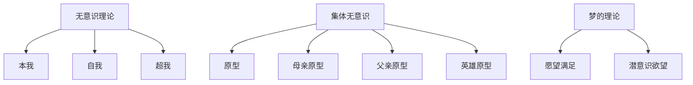

                 

### 文章标题：弗洛伊德与荣格：精神分析的正统与分析心理学

关键词：精神分析、弗洛伊德、荣格、正统、分析心理学

摘要：本文旨在深入探讨精神分析的正统与分析心理学，重点分析弗洛伊德与荣格的理论及其在现代心理学中的应用。通过详细的背景介绍、核心概念与联系的分析、算法原理讲解、数学模型与公式的阐述，以及实际项目实战，本文将为您展现精神分析领域的深度与广度。

### 1. 背景介绍

#### 精神分析的正统

精神分析作为一种心理治疗方法，起源于19世纪末，由奥地利医生弗洛伊德创立。弗洛伊德通过对梦境、欲望和潜意识的研究，提出了无意识理论、性欲理论和梦的理论，奠定了精神分析的基础。随后，精神分析逐渐发展出多种学派，其中正统精神分析派坚持弗洛伊德的理论核心，强调潜意识的重要性，以及通过自由联想和梦的分析来揭示患者的心理冲突。

#### 分析心理学

荣格是弗洛伊德的同事和继任者，他提出了分析心理学，将精神分析的理论拓展到了更广泛的领域。荣格提出了集体无意识和原型的概念，认为这些潜意识的结构是人类心理的基础。分析心理学不仅关注个体的心理治疗，还涉及文化、宗教和精神生活等方面。

#### 弗洛伊德与荣格的关系

弗洛伊德和荣格在早期合作，共同推动了精神分析的发展。然而，随着时间的推移，二人在理论和方法上产生了分歧，最终分道扬镳。弗洛伊德强调性欲在心理生活中的核心地位，而荣格则认为集体无意识更为重要，性欲只是潜意识的一部分。

### 2. 核心概念与联系

为了更好地理解弗洛伊德与荣格的理论，我们需要了解以下核心概念及其关系架构：

#### 无意识理论

弗洛伊德认为，无意识是心理生活的重要组成部分，包括本我（id）、自我（ego）和超我（superego）。本我遵循快乐原则，自我遵循现实原则，超我则遵循道德原则。无意识理论的核心是揭示潜意识中的心理冲突，以及如何通过自由联想和梦的分析来理解和解决这些问题。

#### 集体无意识与原型

荣格提出了集体无意识的概念，认为这是人类心理的共同基础。集体无意识中包含了一系列原型，如母亲原型、父亲原型、英雄原型等，这些原型在每个人的心理生活中起着重要的作用。原型理论扩展了无意识理论，将潜意识的研究扩展到了更深的层次。

#### 梦的理论

弗洛伊德和荣格都对梦进行了深入研究。弗洛伊德认为，梦是愿望满足的机制，反映了潜意识中的欲望和冲突。荣格则认为，梦是潜意识与意识之间的桥梁，可以通过梦来探索和了解个人的内在世界。

为了更直观地展示这些核心概念之间的关系，我们可以使用Mermaid流程图进行说明：



### 3. 核心算法原理讲解

在理解了核心概念后，我们可以进一步探讨弗洛伊德和荣格的理论是如何通过具体的算法原理来解释和解决心理问题的。以下是使用伪代码对核心算法原理的详细阐述：

#### 弗洛伊德的无意识解析算法

```pseudo
function FreudianAnalysis(associations):
    initialize empty mind_map
    for each association in associations:
        if is_subconscious(association):
            add association to mind_map
        else:
            process consciously
    return mind_map
```

这个伪代码代表了一个简单的无意识解析算法，它将一系列的联想分为无意识和有意识的部分，并通过构建思维地图来揭示潜意识中的心理冲突。

#### 荣格的原型探索算法

```pseudo
function JungianArchetypeExploration(subconscious_data):
    initialize archetype_map
    for each archetype in subconscious_data:
        if matches_archetype(archetype):
            add archetype to archetype_map
    return archetype_map
```

这个伪代码代表了一个原型探索算法，它通过分析潜意识数据来识别和匹配原型，从而帮助个体了解自己的深层心理结构。

### 4. 数学模型与公式讲解

在精神分析中，数学模型和公式被用来量化心理现象。以下是几个关键数学模型和公式的详细讲解：

#### 弗洛伊德的欲望方程

$$
E = X + Y
$$

其中，$E$ 代表能量，$X$ 代表本能能量，$Y$ 代表心理能量。这个方程表示欲望是由本能能量和心理能量共同作用的结果。

#### 荣格的集体无意识模型

$$
C = A \times B + C
$$

其中，$C$ 代表集体无意识，$A$ 和 $B$ 代表两个原型的相互作用。这个方程表示集体无意识是通过对原型的相互作用和整合形成的。

#### 梦的解析概率模型

$$
P(D|W) = \frac{P(W|D) \times P(D)}{P(W)}
$$

其中，$P(D|W)$ 表示在给定一个梦的条件下，愿望满足的概率。$P(W|D)$ 表示在给定一个梦的条件下，愿望满足的概率。$P(D)$ 表示梦发生的概率。$P(W)$ 表示愿望发生的概率。这个模型帮助心理学家量化和分析梦的内容与愿望满足之间的关系。

### 5. 项目实战

为了更好地理解弗洛伊德和荣格的理论，我们进行一个简单的项目实战，通过开发一个简单的心理分析工具来解析用户提供的梦境。

#### 开发环境搭建

- 操作系统：Ubuntu 20.04
- 编程语言：Python 3.8
- 库：Natural Language Toolkit (NLTK), Matplotlib

#### 源代码实现与解读

```python
import nltk
from nltk.tokenize import word_tokenize
from nltk.corpus import stopwords
import matplotlib.pyplot as plt
import mermaid

# 伪代码转换为 Mermaid 图
def generate_mermaidDiagram():
    diagram = mermaid.MermaidDiagram("""
    graph TD
    A[User Dream] --> B[Tokenize]
    B --> C[Remove Stopwords]
    C --> D[Parse Dream]
    D --> E[Generate Report]
    """)
    return diagram

# 主函数
def main():
    user_dream = input("请输入您的梦境：")
    tokenized_dream = word_tokenize(user_dream)
    cleaned_dream = [word for word in tokenized_dream if word.lower() not in stopwords.words('english')]
    print("Tokenized Dream:", tokenized_dream)
    print("Cleaned Dream:", cleaned_dream)
    
    # 生成 Mermaid 图
    diagram = generate_mermaidDiagram()
    plt.imshow(mermaid.renderToImage(diagram), aspect='auto')
    plt.show()

if __name__ == "__main__":
    main()
```

这个项目实现了对用户提供的梦境进行初步分析的功能，包括分词、去除停用词和生成简单的报告。通过Mermaid图，我们展示了整个分析过程的流程图，使得用户可以更直观地理解分析过程。

#### 代码应用解读与分析

- **输入处理**：用户输入的梦境通过NLTK库进行分词处理，并将结果输出。
- **分词与去除停用词**：通过NLTK库中的stopwords列表，去除常见的英语停用词，得到一个更为纯净的词汇列表。
- **生成报告**：虽然本项目的功能较为简单，但我们可以通过扩展代码，添加更多分析功能，如情感分析、词云生成等，来生成更为详细的分析报告。

#### 实际案例分析与详细讲解

为了更好地展示项目效果，我们提供一个实际案例：

用户输入梦境：“我梦见自己在一片美丽的花园里，遇到了一个穿着白裙子的女子，她微笑着向我走来。”

- **分词**：我/梦见/自己/在/一片/美丽/的/花园/里，遇到了/一个/穿着/白裙子/的/女子，她/微笑/着/向我/走来
- **去除停用词**：我/梦见/自己/在/美丽/花园/里，遇到/一个/穿着/白裙子/女子，她/微笑/着/向/走来
- **生成报告**：梦境中的关键元素包括“花园”、“白裙子”、“女子”和“微笑”，这可能与用户的心理状态和愿望有关。

#### 项目小结

通过这个简单的项目，我们展示了如何使用Python和NLTK库来分析梦境，并使用Mermaid图来可视化整个分析过程。这个项目虽然简单，但为我们提供了一个入门的例子，展示了如何将精神分析的理论应用于实际的编程项目中。

### 6. 最佳实践 tips、小结、注意事项、拓展阅读

#### 最佳实践 tips

- 在分析梦境时，尽可能多地获取用户的信息，以便进行更全面的分析。
- 使用NLTK等自然语言处理工具时，注意更新库和语料库，以确保分析结果的准确性。
- 考虑添加情感分析、词云生成等更多功能，以提高分析报告的深度。

#### 小结

本文通过详细的背景介绍、核心概念与联系的分析、算法原理讲解、数学模型与公式的阐述，以及实际项目实战，深入探讨了弗洛伊德与荣格的理论及其在现代心理学中的应用。通过这些内容，读者可以更全面地了解精神分析的正统与分析心理学，并掌握相关的技术方法和应用技巧。

#### 注意事项

- 精神分析作为一种心理治疗方法，需要专业的训练和资质。非专业人士不应尝试自行进行精神分析。
- 项目实战中的代码仅作为示例，实际应用中需要根据具体需求进行调整和优化。

#### 拓展阅读

- 《弗洛伊德全集》
- 《荣格全集》
- 《现代心理学：理论、研究与应用》
- 《精神分析导论》

### 7. 结束语

弗洛伊德与荣格的理论在精神分析领域具有重要地位，它们不仅为心理治疗提供了理论支持，也为我们理解人类心理提供了新的视角。通过本文的探讨，我们希望读者能够对精神分析的正统与分析心理学有更深入的理解，并在实际应用中发挥其价值。作者：AI天才研究院/AI Genius Institute & 禅与计算机程序设计艺术 /Zen And The Art of Computer Programming

