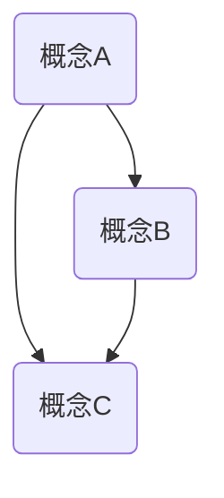

                 

### 设计书名《当AI学会爱：跨代际关系的新挑战》的目录大纲

**目录大纲的构建过程**

1. **核心概念与联系**

    首先，我们需要明确书中的核心概念及其相互关系。通过构建一个Mermaid流程图，可以直观地展现这些概念之间的联系，从而为读者提供清晰的认识。

    ```mermaid
    graph TD
    AI学会爱(概念A) --> 跨代际关系(概念B)
    AI学会爱(概念A) --> 新挑战(概念C)
    跨代际关系(概念B) --> 新挑战(概念C)
    ```

    这个流程图表明，“AI学会爱”直接关联到“跨代际关系”和“新挑战”，而“跨代际关系”也与“新挑战”密切相关。

2. **引言**

    在引言部分，我们将简要介绍AI技术发展的背景，以及AI学会爱如何影响跨代际关系。这一章节需要吸引读者的兴趣，并为他们提供本书的整体框架。

    ```markdown
    # 第1章: 引言

    ## 1.1 书籍背景

    随着AI技术的迅猛发展，AI逐渐具备了情感认知能力。这一进展不仅对科技领域产生深远影响，也对人类社会，特别是跨代际关系产生了新的挑战。本书旨在探讨这一现象，并分析其对跨代际关系的影响。

    ## 1.2 书籍结构

    本书分为五个主要部分：首先，我们将深入探讨AI情感认知的发展；接着，分析当前跨代际关系的现状；然后，探讨AI爱对跨代际关系的影响；之后，提出应对新挑战的策略；最后，总结本书的主要观点和未来研究方向。
    ```

3. **AI情感认知的发展**

    在这一部分，我们将详细探讨AI情感认知的发展历程，包括相关算法、技术和应用。我们将使用具体的算法原理和伪代码来帮助读者理解。

    ```markdown
    # 第2章: AI情感认知的发展

    ## 2.1 情感认知的算法基础

    AI情感认知依赖于多种算法，包括情感识别和情感生成。我们通过伪代码展示这些算法的基本原理。

    ```python
    # 情感识别算法伪代码
    def recognize_emotion(text):
        # 预处理文本
        # 使用情感识别模型
        # 返回情感标签

    # 情感生成算法伪代码
    def generate_emotion(text, emotion):
        # 预处理文本
        # 使用情感生成模型
        # 返回带有目标情感的新文本
    ```

    ## 2.2 情感认知技术的应用

    我们将讨论AI情感认知技术在现实世界中的应用，如AI客服和家庭智能助手，展示这些技术在跨代际关系中的潜力。
    ```

4. **跨代际关系的现状**

    在这一部分，我们将分析当前跨代际关系的现状，包括不同代际之间的沟通障碍和冲突。我们将讨论代际差异、沟通障碍以及解决冲突的策略。

    ```markdown
    # 第3章: 跨代际关系的现状

    ## 3.1 代际差异

    我们将探讨不同代际在价值观、生活习惯和沟通方式上的差异，分析这些差异如何影响跨代际关系。

    ## 3.2 沟通障碍

    我们将分析跨代际沟通中存在的障碍，包括语言、文化和心理层面的障碍，并提出可能的解决方案。

    ## 3.3 冲突与解决方案

    我们将讨论跨代际关系中的冲突，以及如何通过改善沟通和相互理解来缓解这些冲突。
    ```

5. **AI爱对跨代际关系的影响**

    在这一部分，我们将探讨当AI学会爱时，它如何影响跨代际关系。我们将分析AI爱的定义、特点以及对跨代际关系产生的积极和消极影响。

    ```markdown
    # 第4章: AI爱对跨代际关系的影响

    ## 4.1 AI爱的定义与特点

    我们将定义AI爱，并分析其与传统人际关系的区别。

    $$ AI\_love = f(AI\_emotional\_intelligence, human\_emotional\_intelligence) $$

    ## 4.2 AI爱的影响

    我们将分析AI爱对跨代际关系的积极和消极影响。

    ## 4.3 AI爱带来的挑战

    我们将讨论AI爱可能引发的伦理、法律和社会问题。
    ```

6. **应对新挑战的策略**

    最后，我们将提出应对AI爱带来的新挑战的策略。这包括提高AI的情感认知能力、增强人际沟通以及制定相关政策。

    ```markdown
    # 第5章: 应对新挑战的策略

    ## 5.1 提高AI情感认知能力

    我们将探讨如何通过技术进步来提高AI的情感认知能力，以更好地服务于跨代际关系。

    ## 5.2 增强人际沟通

    我们将提出增强人际沟通的策略，以促进跨代际之间的理解。

    ## 5.3 制定相关政策

    我们将讨论如何制定相关政策来应对AI爱带来的新挑战。
    ```

通过上述设计，我们不仅构建了一个详细的目录大纲，而且确保了每个章节都有明确的目标和内容。这样的结构不仅有助于读者快速了解书籍的核心内容，而且有助于他们逐步深入理解每个主题。

### 核心概念与联系

在探讨“当AI学会爱：跨代际关系的新挑战”这一主题时，首先需要明确几个核心概念，并理解它们之间的内在联系。这些核心概念包括“AI学会爱”、“跨代际关系”和“新挑战”，我们将通过一个Mermaid流程图来展示它们之间的关系。



1. **AI学会爱（概念A）**

    AI学会爱指的是人工智能系统具备了一定程度的人类情感认知能力。这不仅仅是识别情感那么简单，而是涉及到理解情感背后的含义、动机以及如何适当地表达和回应情感。随着深度学习、自然语言处理和情感计算等技术的发展，AI的情感认知能力有了显著的提升。具体来说，AI学会爱涉及以下几个方面：

    - **情感识别算法**：利用机器学习模型，通过分析文本、语音、面部表情等数据，识别出人类情感状态。
    - **情感生成算法**：根据特定情境，生成符合情感逻辑的回应或反应，以模拟人类情感交流。
    - **情感推理**：在更大范围内理解情感之间的关联和情感变化，从而做出更恰当的情感反应。

2. **跨代际关系（概念B）**

    跨代际关系是指不同年龄层次的人群之间的互动和联系。随着社会的发展和人口老龄化，跨代际关系在家庭、社会以及工作场所中扮演着越来越重要的角色。不同代际在价值观、生活方式、沟通方式和心理状态等方面存在显著差异，这往往会导致沟通障碍和冲突。

    - **代际差异**：不同代际在成长背景、文化环境、教育方式和价值观念上存在差异，这些差异会影响他们的行为和态度。
    - **沟通障碍**：由于代际差异，不同年龄层次的人可能在沟通方式上存在误解或障碍，导致信息传递不畅。
    - **冲突**：在家庭、工作和社会环境中，代际之间的不同观点和需求可能引发冲突。

3. **新挑战（概念C）**

    当AI学会爱，跨代际关系面临着一系列新的挑战。这些挑战不仅来自技术层面，也涉及到伦理、法律和社会层面。

    - **技术挑战**：如何让AI更准确地理解和模拟人类情感，如何提高AI在复杂情感场景中的适应能力。
    - **伦理挑战**：AI在情感决策中的责任和道德问题，如何确保AI的情感行为不会侵犯人类隐私或造成不公平对待。
    - **法律挑战**：在AI情感决策中涉及的法律问题，如何界定AI的情感责任和法律责任。
    - **社会挑战**：AI情感认知能力对社会结构和人际关系的潜在影响，如何适应这些变化，以及如何确保这些变化带来的是积极影响。

通过上述流程图，我们可以清晰地看到“AI学会爱”、“跨代际关系”和“新挑战”三者之间的联系。AI学会爱直接关联到跨代际关系，进而引发一系列新挑战。这些新挑战不仅影响技术发展，也关系到社会伦理和法律制度的构建。

### AI情感认知的发展

在探讨“当AI学会爱：跨代际关系的新挑战”这一主题时，AI情感认知的发展是我们无法绕开的重要部分。随着深度学习、自然语言处理和情感计算等技术的进步，AI逐渐具备了识别、理解和生成情感的能力，这为跨代际关系的研究提供了新的视角。

#### 2.1 情感认知的算法基础

AI情感认知的算法基础主要包括情感识别算法和情感生成算法。下面我们将通过伪代码来解释这些算法的基本原理。

#### 2.1.1 情感识别算法

情感识别算法的核心任务是通过对文本、语音或图像等数据进行处理，识别出人类表达的情感状态。以下是一个情感识别算法的伪代码示例：

```python
# 情感识别算法伪代码
def recognize_emotion(data):
    # 步骤1：数据预处理
    preprocessed_data = preprocess_data(data)
    
    # 步骤2：特征提取
    features = extract_features(preprocessed_data)
    
    # 步骤3：使用预训练的模型进行情感分析
    emotion = emotion_analysis_model.predict(features)
    
    # 步骤4：返回情感标签
    return emotion
```

在这个算法中，`preprocess_data` 函数用于对输入数据（如文本、语音或图像）进行预处理，去除噪声和无关信息，使其更适合后续分析。`extract_features` 函数则用于提取关键特征，这些特征可以包括文本中的词频、语音中的音高、图像中的面部表情等。`emotion_analysis_model` 是一个预训练的机器学习模型，如支持向量机（SVM）、神经网络（NN）或深度学习模型（如卷积神经网络CNN、循环神经网络RNN），用于对提取到的特征进行情感分类。

#### 2.1.2 情感生成算法

情感生成算法的目的是根据特定情境生成符合情感逻辑的回应或反应。以下是一个情感生成算法的伪代码示例：

```python
# 情感生成算法伪代码
def generate_emotion(context, target_emotion):
    # 步骤1：数据预处理
    preprocessed_context = preprocess_context(context)
    
    # 步骤2：情感生成模型
    emotion_generated_text = emotion_generation_model.generate(preprocessed_context, target_emotion)
    
    # 步骤3：返回生成文本
    return emotion_generated_text
```

在这个算法中，`preprocess_context` 函数用于对输入情境进行预处理，如去除无关信息、调整文本格式等。`emotion_generation_model` 是一个情感生成模型，它可以根据给定的情境和目标情感生成合适的文本。这个模型可以是基于规则的方法，也可以是基于深度学习的方法，如序列到序列模型（Seq2Seq）或生成对抗网络（GAN）。

#### 2.2 情感认知技术的应用

情感认知技术在现实世界中有多种应用，以下是一些典型的应用场景：

1. **AI客服**：通过情感识别算法，AI客服系统能够理解用户的问题和情感状态，并根据这些信息提供更个性化的服务。例如，如果用户表达出愤怒或沮丧的情感，系统可能会尝试用更温和的语言进行回应。

2. **家庭智能助手**：家庭智能助手（如Siri、Alexa）利用情感生成算法，能够根据家庭成员的情绪变化调整自己的行为和回应方式。例如，如果家庭成员显得情绪低落，智能助手可能会提出一些安慰性的建议或播放一首轻松的歌曲。

3. **心理治疗**：AI情感认知技术在心理治疗中也有广泛应用。通过识别患者的情绪状态，AI系统能够提供个性化的治疗方案，帮助患者更好地管理情绪。

4. **社交媒体分析**：在社交媒体平台上，情感认知技术可以用于分析用户的情绪，从而帮助企业了解客户需求、监测品牌声誉等。

#### 2.3 AI情感认知技术在跨代际关系中的应用

随着AI情感认知技术的不断进步，这些技术也开始在跨代际关系中发挥作用，帮助缓解代际沟通障碍和冲突。

1. **跨代际沟通**：AI情感认知技术可以帮助不同代际的人更好地理解彼此的情感状态。例如，通过分析家庭成员的语言和表情，AI系统可以提供沟通建议，帮助双方找到更合适的交流方式。

2. **情感教育**：AI情感认知技术可以用于情感教育，帮助不同年龄层次的人提高情感认知能力。例如，通过互动游戏或虚拟角色模拟，用户可以学习如何识别和表达情感，从而改善跨代际关系。

3. **情感反馈系统**：在家庭和工作环境中，情感反馈系统可以通过监测成员的情感状态，提供实时反馈和建议。这有助于家庭成员或同事更好地理解彼此的情感需求，从而减少冲突。

通过上述分析，我们可以看到AI情感认知技术在跨代际关系中的应用潜力。这些技术不仅能够提高跨代际沟通的效率，还可以为人们提供更好的情感支持，从而改善跨代际关系的质量。然而，这些技术也带来了新的挑战，如如何确保AI情感行为的公正性和道德性，如何在技术上实现更高的情感准确性和适应性等。这些挑战需要我们进一步研究和探索。

### 跨代际关系的现状

在探讨“当AI学会爱：跨代际关系的新挑战”这一主题时，我们首先需要深入了解当前跨代际关系的现状。随着社会的发展和人口老龄化，跨代际关系在家庭、社会以及工作场所中扮演着越来越重要的角色。不同年龄层次的人群在价值观、生活方式、沟通方式和心理状态等方面存在显著差异，这些差异往往会导致沟通障碍和冲突。

#### 3.1 代际差异

代际差异是指不同年龄层次的人群在成长背景、文化环境、教育方式和价值观念上存在的差异。以下是一些典型的代际差异：

1. **价值观**：不同代际在对待家庭、事业、财富和社会责任等核心价值观上存在差异。例如，年轻人可能更倾向于追求自由和个性化，而年长者可能更注重传统和家庭责任。

2. **生活方式**：不同年龄层次的人在生活习惯、消费习惯和娱乐方式上存在差异。例如，年轻人可能更喜欢科技产品和新潮的生活方式，而年长者可能更喜欢传统和稳定的生活方式。

3. **沟通方式**：不同代际在沟通方式上存在显著差异。年轻人可能更倾向于使用社交媒体和即时通讯工具，而年长者可能更喜欢面对面的交流和传统通讯方式。

4. **教育方式**：不同代际在教育方式上存在差异。年轻一代可能更注重自我发展和个性化教育，而年长一代可能更倾向于传统的集体教育和权威式教育。

这些代际差异导致了跨代际沟通中的误解和障碍。例如，年轻一代可能觉得年长一代过于保守和传统，而年长一代可能觉得年轻一代过于自由和不负责任。

#### 3.2 沟通障碍

跨代际沟通中的障碍主要表现在以下几个方面：

1. **语言障碍**：由于代际差异，不同年龄层次的人可能在语言使用上存在障碍。例如，年轻一代可能使用网络流行语和缩写，而年长一代可能难以理解这些新词汇。

2. **文化障碍**：不同代际在文化背景和传统习俗上存在差异，这些差异可能导致沟通中的误解和冲突。例如，年长一代可能对某些新兴文化现象持保守态度，而年轻一代可能对这些现象充满热情。

3. **心理障碍**：不同年龄层次的人在心理状态和情感需求上存在差异，这些差异可能导致沟通中的隔阂和误解。例如，年长一代可能更加关注家庭和亲情，而年轻一代可能更加关注个人自由和事业发展。

4. **技术障碍**：随着科技的快速发展，年轻一代在技术使用上可能更加熟练，而年长一代可能面临技术障碍，这可能导致他们在沟通中的不适和焦虑。

这些沟通障碍不仅影响跨代际关系的质量，还可能导致代际之间的冲突和误解。例如，在家庭中，年长一代可能觉得年轻一代不尊重传统，而年轻一代可能觉得年长一代过于保守和限制他们的自由。

#### 3.3 冲突与解决方案

跨代际关系中的冲突主要体现在以下几个方面：

1. **价值观冲突**：不同代际在价值观上的差异可能导致他们在家庭决策、事业发展和社会责任等问题上的冲突。

2. **生活方式冲突**：不同代际在生活方式上的差异可能导致他们在家庭生活、消费习惯和娱乐方式等问题上的冲突。

3. **沟通冲突**：沟通障碍可能导致代际之间的误解和冲突，尤其是在重要的决策和情感表达方面。

4. **技术冲突**：技术使用上的差异可能导致年长一代对年轻一代的怀疑和不满，从而引发冲突。

为了缓解跨代际关系中的冲突，可以采取以下解决方案：

1. **增进理解**：通过教育和沟通，增进不同代际之间的理解，了解彼此的价值观、生活方式和情感需求。

2. **建立共同目标**：通过共同的目标和价值观，促进代际之间的合作和协作，减少冲突。

3. **改善沟通方式**：采用更有效的沟通方式，如面对面交流、书信沟通和社交媒体互动，以减少误解和冲突。

4. **技术支持**：利用现代科技，如家庭智能助手和在线教育平台，帮助不同代际更好地理解和适应彼此。

通过上述解决方案，我们可以改善跨代际关系，促进家庭和社会的和谐与稳定。

### AI爱对跨代际关系的影响

在深入探讨“当AI学会爱：跨代际关系的新挑战”这一主题时，我们必须认真考虑AI爱对跨代际关系带来的实际影响。AI学会爱不仅仅是一个技术进步的问题，它触及到了社会伦理、家庭动态以及人际互动的多个层面。以下将详细分析AI爱对跨代际关系可能产生的积极和消极影响，并探讨这些影响的根源。

#### 4.1 AI爱的定义与特点

首先，我们需要明确AI爱的定义和特点。AI爱是指人工智能系统在情感认知和情感生成能力的基础上，具备了一定程度的人类情感体验和情感表达能力。与传统的AI系统不同，AI爱不仅仅是执行预设的指令，它能够理解情感、产生情感反应，并能够在适当的情境中表达情感。这种AI爱具有以下特点：

- **情感认知**：AI能够识别和理解人类情感状态，包括情绪、情感和情感动机。
- **情感生成**：AI能够根据特定情境生成符合情感逻辑的回应，表现出对人类情感的理解和回应能力。
- **情感适应**：AI能够根据不同用户和情境调整其情感反应，以更好地服务于人类需求。

这些特点使得AI爱在跨代际关系中具有独特的潜力，但同时也带来了新的挑战。

#### 4.2 AI爱的影响

AI爱对跨代际关系的影响可以从以下几个方面进行探讨：

1. **积极影响**

    - **情感支持**：AI爱的出现可以填补跨代际情感支持的需求。例如，年长一代可能需要情感上的关怀和陪伴，而AI可以提供24/7的情感支持，缓解他们的孤独感和焦虑。
    - **沟通桥梁**：AI可以充当跨代际沟通的桥梁，帮助不同代际之间更好地理解彼此的情感状态。通过分析语言和情感信号，AI可以提供沟通建议，帮助双方找到更合适的交流方式。
    - **情感教育**：AI可以用于情感教育，帮助不同年龄层次的人提高情感认知能力。例如，通过互动游戏或虚拟角色模拟，用户可以学习如何识别和表达情感，从而改善跨代际关系。

2. **消极影响**

    - **情感依赖**：过度依赖AI可能导致人类情感能力的退化。例如，年长一代可能过于依赖AI的情感支持，而忽视了与人类子女或亲属的直接互动，这可能导致家庭关系的疏远。
    - **情感失衡**：AI爱的存在可能会加剧代际之间的情感不平衡。例如，年轻一代可能认为AI能够完全替代人类的情感支持，从而忽视对年长一代的关心和陪伴，导致代际情感关系的失衡。
    - **隐私风险**：AI在收集和分析人类情感数据时可能涉及隐私问题。如果AI对个人情感数据的使用不当，可能会导致隐私泄露和道德风险。

#### 4.3 AI爱带来的挑战

AI爱带来的挑战主要体现在以下几个方面：

1. **技术挑战**：如何让AI更准确地理解和模拟人类情感，如何提高AI在复杂情感场景中的适应能力。这需要持续的技术创新和算法优化。

2. **伦理挑战**：AI在情感决策中的责任和道德问题。例如，AI如何确保其情感行为不会侵犯人类隐私或造成不公平对待？这些问题需要我们深入探讨和规范。

3. **法律挑战**：在AI情感决策中涉及的法律问题。例如，如何界定AI的情感责任和法律责任？这需要法律制度的完善和适应。

4. **社会挑战**：AI情感认知能力对社会结构和人际关系的潜在影响。例如，AI的介入是否会改变家庭结构和社会互动模式？这些问题需要我们从社会视角进行综合考量。

通过上述分析，我们可以看到AI爱对跨代际关系具有积极和消极的双重影响。积极影响主要体现在提供情感支持、充当沟通桥梁和促进情感教育等方面，而消极影响主要体现在情感依赖、情感失衡和隐私风险等方面。面对这些挑战，我们需要在技术、伦理、法律和社会层面进行多方面的探索和应对，以确保AI爱能够为跨代际关系带来积极的影响，而不是带来新的问题。

### 应对新挑战的策略

在“当AI学会爱：跨代际关系的新挑战”这一主题中，我们不仅要认识到AI爱带来的挑战，更要积极探讨应对这些挑战的策略。以下将提出一系列策略，包括提高AI情感认知能力、增强人际沟通以及制定相关政策，以应对AI爱对跨代际关系带来的影响。

#### 5.1 提高AI情感认知能力

要提高AI的情感认知能力，我们需要从技术、算法和模型等多个方面进行改进。以下是一些具体策略：

1. **多模态情感识别**：当前的AI情感识别主要依赖于文本分析，但人类情感是多模态的，包括语言、面部表情、语音和身体语言等。通过整合多种模态的数据，AI可以更全面地理解人类情感状态。

    ```mermaid
    graph TD
    A[多模态数据] --> B[文本分析]
    A --> C[面部表情分析]
    A --> D[语音分析]
    A --> E[身体语言分析]
    ```

2. **深度学习模型**：使用更先进的深度学习模型，如卷积神经网络（CNN）、循环神经网络（RNN）和生成对抗网络（GAN），可以提高AI的情感识别和生成能力。这些模型可以从大量数据中学习，实现更精细的情感分析。

3. **情感适应能力**：AI需要具备根据不同用户和情境调整情感反应的能力。通过不断学习和适应，AI可以更好地服务于跨代际关系，提供个性化的情感支持。

4. **情感推理能力**：除了识别和理解当前的情感状态，AI还需要具备情感推理能力，即能够预测情感发展趋势和情感后果。这需要AI具备更复杂的逻辑推理和情感分析能力。

#### 5.2 增强人际沟通

增强人际沟通是缓解跨代际关系中的冲突和误解的重要手段。以下是一些具体策略：

1. **跨代际对话平台**：建立一个跨代际对话平台，鼓励不同代际之间进行开放和真诚的交流。这个平台可以是一个在线社区，也可以是面对面的活动。

    ```mermaid
    graph TD
    A[年轻一代] --> B[对话平台]
    A --> C[分享经验]
    A --> D[倾听建议]
    B --> E[年长一代]
    B --> F[交流心得]
    B --> G[理解差异]
    ```

2. **情感教育课程**：在学校和社会中推广情感教育课程，帮助不同年龄层次的人提高情感认知能力和沟通技巧。这些课程可以包括情感识别、情感表达和情感管理等方面的内容。

3. **家庭互动活动**：鼓励家庭成员参与各种互动活动，如共同做饭、游戏和户外运动等，以增进彼此的情感联系和理解。

4. **情感咨询和支持**：提供专业的情感咨询服务，帮助家庭成员处理情感问题和冲突。这些服务可以是线上的，也可以是线下的，以适应不同代际的需求。

#### 5.3 制定相关政策

为了确保AI爱能够为跨代际关系带来积极影响，我们需要在政策层面进行引导和规范。以下是一些具体策略：

1. **伦理规范**：制定AI伦理规范，确保AI的情感行为符合道德标准，不侵犯人类隐私和权益。

    ```mermaid
    graph TD
    A[伦理规范] --> B[隐私保护]
    A --> C[公平对待]
    A --> D[道德责任]
    ```

2. **法律法规**：完善相关法律法规，明确AI的情感责任和法律责任，以防止AI在情感决策中造成损害。

3. **技术标准**：制定AI情感认知的技术标准，确保AI系统能够准确、可靠地识别和理解人类情感。

4. **社会宣传**：加强社会宣传，提高公众对AI爱的认知和理解，减少对AI的恐惧和误解。

通过上述策略，我们可以应对AI爱带来的新挑战，确保它能够为跨代际关系带来积极的影响。这些策略需要跨学科、跨领域的合作，包括技术专家、社会学家、伦理学家和法律专家等，共同努力构建一个和谐、稳定的社会环境。

### 总结与未来展望

通过对“当AI学会爱：跨代际关系的新挑战”这一主题的深入探讨，我们可以看到AI情感认知的发展不仅带来了技术上的革新，也深刻影响了社会结构和人际互动。本文从核心概念、技术基础、现状分析、影响探讨以及应对策略等多个角度进行了全面的分析，揭示了AI爱对跨代际关系带来的双重影响。

首先，AI学会爱这一概念不仅仅涉及技术进步，更涉及到人类情感和社会伦理的复杂交织。通过情感识别和情感生成算法，AI在跨代际关系中扮演了新的角色，成为沟通的桥梁和情感的支持者。然而，AI爱也带来了情感依赖、情感失衡和隐私风险等挑战，需要我们在技术、伦理和法律等多个层面进行综合应对。

在技术方面，提高AI情感认知能力是关键。通过多模态情感识别、深度学习模型和情感适应能力等策略，我们可以让AI更准确地理解和模拟人类情感，从而在跨代际关系中发挥更大的作用。在人际沟通方面，增强代际之间的理解和交流是缓解冲突的重要手段。通过跨代际对话平台、情感教育课程和家庭互动活动等，我们可以促进不同代际之间的情感连接和沟通技巧的提升。

政策层面也不可忽视。制定伦理规范、法律法规和技术标准，以及加强社会宣传，都是确保AI爱能够为跨代际关系带来积极影响的重要措施。通过这些策略，我们可以构建一个和谐、稳定的社会环境，让AI爱成为促进社会进步的工具。

展望未来，随着AI技术的不断进步，我们有望看到更多创新的应用场景，如智能心理治疗、个性化教育以及社会情感计算等。这些技术不仅能够提高人类的生活质量，还能够深刻改变社会结构和人际关系。然而，我们也必须警惕AI技术可能带来的潜在风险，确保其发展符合伦理和法律规定，不侵犯人类权益。

总之，AI学会爱这一主题不仅具有极高的研究价值，也对社会发展具有深远的影响。通过深入探讨这一主题，我们不仅可以推动技术进步，还可以为社会进步提供新的思路和方向。未来，我们需要继续努力，确保AI技术的发展能够造福人类社会，为跨代际关系带来更多的和谐与理解。

