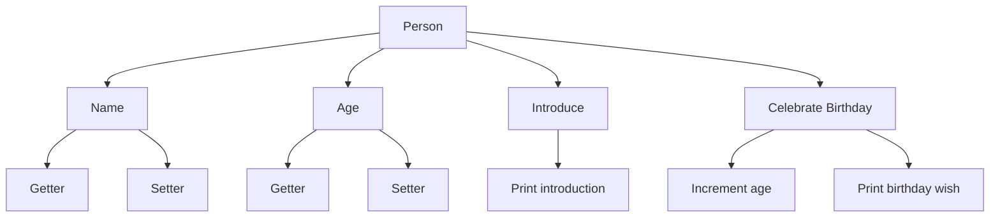

                 

## 引言

面向对象编程（OOP）作为一种重要的编程范式，以其简明性、可重用性和可维护性在软件工程中占据着重要地位。然而，在探讨OOP的内在机制时，我们不可避免地需要思考一个深层次的问题：对象究竟是什么？本文将以“形式与内容的统一：对象在OOP中的本体论地位”为标题，深入探讨对象在OOP中的本体论地位。

首先，让我们回顾一下OOP的基本概念。面向对象编程的核心思想是将数据和操作数据的方法封装在一起，形成对象。对象具有以下三个基本特征：封装性、继承性和多态性。封装性确保了对象的内部实现细节对外不可见，从而提高了模块的独立性。继承性使得一个类可以继承另一个类的属性和方法，从而实现代码的重用。多态性则允许不同类的对象通过同一接口进行交互，增强了程序的灵活性和扩展性。

那么，对象究竟是什么？在哲学和科学领域，本体论是研究存在本身及其形式和条件的学科。将本体论引入OOP，我们可以从形式和内容两个角度来理解对象。形式上，对象可以看作是数据结构的集合，它包含属性（数据）和方法（操作）。内容上，对象代表了现实世界中的实体或概念。例如，一个汽车对象不仅包含车轮、引擎等属性，还代表了汽车这一实体。

本文的结构如下：首先，我们将介绍OOP的基本概念，帮助读者建立对OOP的理解。接着，我们将深入探讨对象的本质，并引入本体论来解释对象的存在。然后，我们将讨论OOP的核心原理，如封装、继承和多态。随后，我们将分析对象间的关系和交互，展示对象如何在系统中协作。在此基础上，我们将探讨对象在本体论中的地位，进一步理解对象在OOP中的本质。最后，我们将通过实践案例来展示面向对象编程的实际应用，并总结全文，探讨OOP的未来发展趋势。

通过本文的阅读，读者将不仅能够掌握OOP的基本原理，还将对对象的本质和本体论地位有更深刻的理解，从而为未来的编程实践奠定坚实基础。

## 关键词

本文的关键词包括：面向对象编程（OOP）、对象、本体论、封装、继承、多态、对象模型、属性、行为、对象交互、系统设计、编程范式、软件工程、编程实践、技术博客。

## 摘要

本文探讨了面向对象编程（OOP）中对象的本质及其本体论地位。通过介绍OOP的基本概念和原理，本文首先帮助读者建立对面向对象编程的理解。接着，本文深入探讨对象的本质，引入本体论来解释对象的形式与内容的统一。进一步地，本文分析了对象间的交互和关系，探讨了面向对象编程的实际应用和实践原则。最后，本文总结了对象在OOP中的地位，并展望了面向对象编程的未来发展趋势。通过本文的阅读，读者将能够更好地理解面向对象编程的核心原理，并在实践中应用这些原理，提高软件开发的效率和可维护性。

## 第1章 引言

面向对象编程（OOP）作为一种编程范式，与传统的面向过程编程相比，具有显著的优点。OOP的核心思想是将数据和操作数据的方法封装在一起，形成对象。这不仅提高了程序的模块化程度，还使得代码的重用和维护变得更加容易。本章将首先介绍OOP的基本概念，包括面向对象编程的起源、核心原则以及对象的基本特征。

### 面向对象编程的起源

面向对象编程的概念最早可以追溯到20世纪60年代，当时计算机科学家模拟现实世界中的对象和关系，以解决复杂的软件设计问题。在1970年代，Smalltalk语言成为了第一个实现面向对象编程的语言，其设计和实现奠定了现代面向对象编程的基础。随后，C++、Java等语言的广泛应用进一步推动了面向对象编程的发展。

OOP的核心原则包括封装、继承和多态。封装是指将数据与操作数据的函数组合在一起，使数据的操作限制在对象内部，从而提高了模块的独立性和安全性。继承是指允许一个类继承另一个类的属性和方法，从而实现代码的重用。多态则允许不同类的对象通过同一接口进行交互，增强了程序的灵活性和扩展性。

### 对象的定义

在OOP中，对象是基本的概念之一。对象可以看作是一个具有状态和行为的数据实体，它由一组属性（数据）和方法（操作）组成。每个对象都有其独特的状态和行为，这些状态和行为由其内部的数据结构和操作函数定义。

对象的定义通常包含以下几个方面：

1. **属性**：对象的属性是描述对象状态的数据。例如，一个汽车对象可能有颜色、品牌、型号等属性。
2. **方法**：对象的方法是执行特定操作的行为。例如，汽车对象可以有启动、行驶、停止等方法。
3. **行为**：对象的行为是指对象在接收到外部事件时的响应。例如，当汽车对象接收到启动指令时，它会启动引擎并开始行驶。

### 对象与本体论的关系

本体论是哲学和科学领域研究存在本身及其形式和条件的学科。将本体论引入OOP，我们可以从形式和内容两个角度来理解对象。

1. **形式**：从形式上看，对象可以看作是数据结构的集合。它包含属性（数据）和方法（操作）。例如，在Java中，一个对象可以通过定义类来创建，类中的属性和方法构成了对象的形式结构。

2. **内容**：从内容上看，对象代表了现实世界中的实体或概念。例如，一个汽车对象不仅包含颜色、品牌、型号等属性，还代表了汽车这一实体。

对象的形式与内容是相互关联的。形式决定了对象的结构和行为，而内容则反映了对象所代表的事物或概念。在OOP中，对象的形式和内容的统一是实现封装性、继承性和多态性的基础。

### 小结

本章介绍了面向对象编程的基本概念和原理，包括OOP的起源、核心原则以及对象的基本特征。通过对对象定义和本体论关系的探讨，我们为后续章节深入分析对象在OOP中的地位和交互机制奠定了基础。在下一章中，我们将进一步探讨对象的本质，并引入本体论来解释对象的存在。

## 第2章 面向对象编程的原理

面向对象编程（OOP）的原理是构建现代软件系统的基石，其核心思想在于将现实世界中的实体抽象为软件中的对象，并通过对象之间的相互作用来实现复杂的功能。在这一章中，我们将详细探讨OOP的三大核心原理：封装、继承和多态，并解释这些原理如何促进软件系统的设计和实现。

### 面向对象编程的核心

#### 2.1 类与对象

在OOP中，类（Class）是抽象的模板，用于创建具有相似属性和行为的对象（Object）。类定义了对象的结构和行为，包括其属性和方法。对象是类的实例，是实际存在的实体。例如，我们可以定义一个`Car`类，然后创建多个`Car`对象。

```java
// 定义Car类
class Car {
    String color;
    String brand;
    int year;

    // 定义方法
    void startEngine() {
        System.out.println("Engine started");
    }
}

// 创建Car对象
Car myCar = new Car();
myCar.color = "Red";
myCar.brand = "Toyota";
myCar.year = 2020;
myCar.startEngine();
```

在这个例子中，`Car`类定义了汽车的颜色、品牌和年份等属性，以及启动引擎的方法。`myCar`是`Car`类的一个实例，具有这些属性和方法。

#### 2.2 继承

继承（Inheritance）是OOP中的一个重要概念，它允许一个类继承另一个类的属性和方法。继承使得子类能够继承父类的特征，同时还可以添加新的属性和方法。继承促进了代码的重用，并有助于构建具有层次关系的类结构。

```java
// 定义Vehicle类
class Vehicle {
    String model;
    int year;

    void start() {
        System.out.println("Vehicle started");
    }
}

// 定义Car类继承Vehicle类
class Car extends Vehicle {
    String color;

    void startEngine() {
        start(); // 调用父类的方法
        System.out.println("Engine started");
    }
}

// 创建Car对象
Car myCar = new Car();
myCar.model = "Camry";
myCar.year = 2020;
myCar.color = "Blue";
myCar.startEngine();
```

在这个例子中，`Car`类继承自`Vehicle`类，继承了`model`和`year`属性以及`start`方法。`Car`类还添加了新的属性`color`和新的方法`startEngine`。通过继承，我们可以避免重复编写相同的代码，并确保不同类之间的一致性。

#### 2.3 多态

多态（Polymorphism）是OOP的另一个核心概念，它允许不同类的对象通过同一接口进行交互。多态性有两种形式：编译时多态（通过方法重载实现）和运行时多态（通过方法覆盖实现）。

**编译时多态（Method Overloading）**：方法重载是编译时多态的一个例子，它允许同一个类中存在多个具有相同名称但参数类型或数量不同的方法。

```java
// 定义一个类，具有方法重载
class Calculator {
    int add(int a, int b) {
        return a + b;
    }

    double add(double a, double b) {
        return a + b;
    }
}

// 使用方法重载
Calculator calc = new Calculator();
int result1 = calc.add(5, 10); // 调用第一个add方法
double result2 = calc.add(5.5, 10.5); // 调用第二个add方法
```

**运行时多态（Method Overriding）**：方法覆盖是运行时多态的一个例子，它允许子类重写父类的方法，从而实现特定的行为。

```java
// 定义一个类，具有方法覆盖
class Vehicle {
    void start() {
        System.out.println("Vehicle started");
    }
}

class Car extends Vehicle {
    void start() {
        System.out.println("Car started");
    }
}

// 使用方法覆盖
Vehicle myVehicle = new Car();
myVehicle.start(); // 输出 "Car started"
```

在这个例子中，`Car`类覆盖了`Vehicle`类的`start`方法，当调用`myVehicle.start()`时，实际调用的是`Car`类的`start`方法。

### 小结

面向对象编程的原理，包括封装、继承和多态，构成了OOP的核心。封装确保了数据的完整性和安全性，继承促进了代码的重用，而多态增强了程序的灵活性和扩展性。通过这些原理，OOP使得软件设计更加模块化、可重用和可维护。在下一章中，我们将进一步探讨对象的属性和行为，分析对象间的交互和协作。

## 对象模型的构建

在面向对象编程（OOP）中，对象模型是理解和实现复杂系统的基础。对象模型描述了对象的结构和行为，包括对象的属性、方法以及对象间的关系。在本节中，我们将详细探讨对象模型的构建过程，从类的定义、对象的创建与销毁，到对象的行为分析。

### 类的构建

类（Class）是OOP中用于创建对象的蓝图。类定义了对象的属性和方法，即对象能够存储的数据和能够执行的操作。构建类是对象模型构建的第一步。

**类的定义**：

在大多数编程语言中，类是通过关键字`class`来定义的。类通常包含属性（字段）和方法（函数）。属性用于存储对象的内部状态，而方法用于定义对象的行为。

```java
public class Person {
    private String name;
    private int age;

    // 构造函数
    public Person(String name, int age) {
        this.name = name;
        this.age = age;
    }

    // 方法
    public void introduce() {
        System.out.println("Hello, my name is " + name + " and I am " + age + " years old.");
    }
}
```

在上面的例子中，`Person`类包含两个属性`name`和`age`，以及一个构造函数和一个方法。构造函数用于在创建对象时初始化对象的属性。

**类的成员访问修饰符**：

类的成员（属性和方法）可以通过访问修饰符来控制其访问级别。常见的访问修饰符包括`public`、`private`、`protected`和`default`。

- `public`：公共的，可以被任何其他类访问。
- `private`：私有的，只能在类内部访问。
- `protected`：受保护的，可以在同一包内或子类中访问。
- `default`：默认的，仅能在同一包内访问。

```java
public class Person {
    private String name; // 私有属性，只能在Person类内部访问

    public void setName(String name) {
        this.name = name;
    }

    public String getName() {
        return name;
    }

    public void introduce() {
        System.out.println("Hello, my name is " + name);
    }
}
```

在这个例子中，`name`属性被声明为私有，因此只能在`Person`类内部访问。`setName`和`getName`方法用于设置和获取`name`属性，这些方法是公共的，可以在其他类中调用。

### 对象的创建与销毁

对象是通过使用类创建的实例。在大多数编程语言中，对象创建通常通过构造函数实现。

```java
Person person = new Person("Alice", 30);
```

在上面的代码中，`Person`类通过构造函数创建了一个名为`Alice`且年龄为30岁的对象。

**对象的销毁**：

对象的销毁通常由垃圾回收机制（Garbage Collection）自动处理。在Java等语言中，当没有引用指向一个对象时，该对象将成为垃圾回收的候选对象。垃圾回收器会在适当的时候回收这些对象，释放其占用的内存。

```java
Person person = new Person("Alice", 30);
// ...
person = null; // person对象不再被引用
```

在上面的代码中，当`person`变量的引用设置为`null`时，`Person`对象成为垃圾回收的候选对象。虽然对象本身立即不会被销毁，但垃圾回收器会在未来的某个时间点回收它。

### 对象的行为

对象的行为是通过其方法定义的操作来实现的。方法可以访问对象的属性，并执行特定的任务。

```java
person.introduce(); // 输出 "Hello, my name is Alice"
```

在上面的代码中，`introduce`方法是`Person`类的一部分，用于打印对象的介绍信息。

**方法重载与覆盖**：

方法重载（Method Overloading）允许在同一类中定义多个具有相同名称但参数不同的方法。方法覆盖（Method Overriding）允许子类重写父类的方法，以实现特定的行为。

```java
public class Calculator {
    public int add(int a, int b) {
        return a + b;
    }

    public double add(double a, double b) {
        return a + b;
    }
}

public class ScientificCalculator extends Calculator {
    public double add(double a, double b) {
        return a * b; // 重写父类的方法
    }
}
```

在这个例子中，`Calculator`类定义了两个`add`方法，分别用于整数和浮点数的加法。`ScientificCalculator`类继承了`Calculator`类，并重写了`add`方法以实现乘法。

### 小结

对象模型的构建是面向对象编程的核心。通过类的定义，我们为对象的创建提供了蓝图。对象的创建与销毁以及行为定义构成了对象模型的骨架。理解对象模型的构建过程，对于掌握OOP及其在实际应用中的使用至关重要。在下一章中，我们将进一步探讨对象的行为，分析对象间的交互和协作。

### 对象的行为

在面向对象编程（OOP）中，对象的行为是通过方法来定义和执行的。方法不仅决定了对象能够做什么，还定义了对象在不同情况下的响应方式。理解对象的行为，对于设计和实现复杂的软件系统至关重要。在本节中，我们将详细探讨对象的方法、函数、事件处理以及回调机制。

#### 方法与函数

方法（Method）是对象的核心组成部分，用于定义对象的特定行为。每个方法都包含一系列的代码，当对象接收到相应的消息时，这些代码将被执行。方法通常包括一个返回类型、一个方法名以及一组参数。

```java
public class Calculator {
    public int add(int a, int b) {
        return a + b;
    }
    
    public int subtract(int a, int b) {
        return a - b;
    }
}
```

在上面的例子中，`Calculator`类包含两个方法：`add`和`subtract`。`add`方法接受两个整数参数并返回它们的和，而`subtract`方法接受两个整数参数并返回它们的差。

**方法的调用**：

调用方法时，需要使用对象名加方法名，并传递相应的参数。例如：

```java
Calculator calc = new Calculator();
int sum = calc.add(5, 10);
int diff = calc.subtract(10, 5);
```

在这个例子中，我们创建了一个`Calculator`对象，并调用了其`add`和`subtract`方法。调用方法时，传递的参数将传递给方法内部的参数变量，并执行方法体中的代码。

#### 事件处理与回调

事件处理（Event Handling）是OOP中一个重要的概念，它允许对象对特定的事件做出响应。事件通常由外部系统触发，如用户的鼠标点击、键盘输入或其他系统事件。在Java中，事件处理通常通过事件监听器（EventListener）和回调（Callback）机制实现。

**事件监听器**：

事件监听器是一种接口，它定义了当特定事件发生时需要执行的方法。例如，在一个按钮点击事件中，事件监听器定义了点击按钮时需要执行的代码。

```java
public interface ActionListener {
    void actionPerformed(ActionEvent e);
}

public class ButtonClickListener implements ActionListener {
    public void actionPerformed(ActionEvent e) {
        System.out.println("Button clicked!");
    }
}
```

在上面的例子中，`ActionListener`接口定义了`actionPerformed`方法，当按钮被点击时，该方法将被调用。`ButtonClickListener`类实现了`ActionListener`接口，并重写了`actionPerformed`方法。

**回调机制**：

回调机制是一种设计模式，允许一个对象在另一个对象完成某些操作后接收通知。在Java中，回调通常通过匿名内部类或lambda表达式实现。

```java
public class Main {
    public static void main(String[] args) {
        process("Hello", s -> System.out.println("Processed: " + s));
    }
    
    public static void process(String input, Consumer<String> callback) {
        // 处理输入
        String result = input.toUpperCase();
        // 回调
        callback.accept(result);
    }
}
```

在上面的例子中，`process`方法接受一个字符串和一个`Consumer`回调。在处理字符串后，`process`方法通过回调将结果传递给调用者。这里使用了lambda表达式`s -> System.out.println("Processed: " + s)`作为回调。

#### 回调与异步编程

回调机制在异步编程中尤为重要。异步编程允许程序在执行某些耗时操作时继续执行其他任务，而不是等待这些操作完成。回调机制使得异步编程中的任务管理变得更加灵活。

```java
public class Main {
    public static void main(String[] args) {
        fetchData("https://example.com/data", response -> {
            System.out.println("Data fetched: " + response);
        });
    }
    
    public static void fetchData(String url, Consumer<String> callback) {
        // 异步获取数据
        String response = "Fetched data from " + url;
        // 回调
        callback.accept(response);
    }
}
```

在上面的例子中，`fetchData`方法异步获取数据，并在数据获取完成后通过回调将结果传递给调用者。

#### 小结

对象的行为通过方法来定义，这些方法使得对象能够响应用户输入或其他系统事件。事件处理和回调机制是OOP中实现动态交互的重要工具。理解对象的行为以及事件处理和回调机制，对于设计和实现具有良好可扩展性和可维护性的软件系统至关重要。在下一章中，我们将探讨对象间的交互和协作，进一步深化对面向对象编程的理解。

### 对象的属性与行为

在面向对象编程（OOP）中，对象的属性和行为是理解和设计复杂系统的基础。对象的属性描述了对象的状态，而对象的行为则定义了对象可以执行的操作。在本节中，我们将详细探讨对象的属性、方法及其之间的关系。

#### 属性的定义与访问

对象的属性是用于描述对象状态的变量。在Java等编程语言中，属性通常通过类中的字段来定义。属性的访问可以通过访问修饰符来控制，包括公共（public）、私有（private）和受保护（protected）等。

```java
public class Person {
    private String name;
    private int age;
    
    public Person(String name, int age) {
        this.name = name;
        this.age = age;
    }
    
    public String getName() {
        return name;
    }
    
    public void setName(String name) {
        this.name = name;
    }
    
    public int getAge() {
        return age;
    }
    
    public void setAge(int age) {
        this.age = age;
    }
}
```

在上面的例子中，`Person`类定义了两个属性：`name`和`age`。这些属性通过构造函数进行初始化，并通过公共方法`getName`和`setName`进行访问。

#### 静态属性与实例属性

在OOP中，属性可以分为静态属性和实例属性。静态属性属于类本身，而不是类的实例，因此所有类的实例共享同一个静态属性。实例属性则属于具体的对象实例，每个对象实例都有其自己的实例属性。

```java
public class Person {
    private static int totalPeople = 0;
    private String name;
    private int age;
    
    public Person(String name, int age) {
        this.name = name;
        this.age = age;
        totalPeople++;
    }
    
    public static int getTotalPeople() {
        return totalPeople;
    }
    
    public String getName() {
        return name;
    }
    
    public void setName(String name) {
        this.name = name;
    }
    
    public int getAge() {
        return age;
    }
    
    public void setAge(int age) {
        this.age = age;
    }
}
```

在上面的例子中，`totalPeople`是一个静态属性，它记录了所有`Person`对象的数量。每次创建一个新的`Person`对象时，`totalPeople`都会增加。

#### 属性和行为的关系

对象的属性和行为紧密相关。属性描述了对象的状态，而方法（行为）定义了如何改变这种状态。在OOP中，行为通常是通过对属性进行操作来实现的。

```java
public class Person {
    private String name;
    private int age;
    
    public Person(String name, int age) {
        this.name = name;
        this.age = age;
    }
    
    public void introduce() {
        System.out.println("Hello, my name is " + name + " and I am " + age + " years old.");
    }
    
    public void celebrateBirthday() {
        age++;
        System.out.println("Happy birthday " + name + "!");
    }
}
```

在上面的例子中，`introduce`和`celebrateBirthday`方法是`Person`类的行为。`introduce`方法用于打印对象的介绍信息，而`celebrateBirthday`方法用于增加对象的年龄并打印生日祝福。

#### 属性和行为的关系架构

为了更好地理解属性和行为的关系，我们可以使用Mermaid流程图来展示它们之间的交互。



在上面的流程图中，`Person`类与`Name`、`Age`属性以及`Introduce`、`Celebrate Birthday`方法相关联。属性`Name`和`Age`分别通过`Getter`和`Setter`方法进行访问，而方法`Introduce`和`Celebrate Birthday`分别执行打印介绍信息和生日祝福的操作。

#### 小结

对象的属性和行为是OOP中不可或缺的部分。属性描述了对象的状态，而方法则定义了对象可以执行的操作。通过静态属性和实例属性，我们可以更好地管理对象的内部状态。理解属性和行为的关系，有助于我们设计出更模块化、可重用和可维护的软件系统。在下一章中，我们将进一步探讨对象间的交互和协作，以展示面向对象编程的强大之处。

### 对象间的交互

在面向对象编程（OOP）中，对象间的交互是构建复杂系统的关键。对象通过发送和接收消息来协同工作，从而实现系统的整体功能。在本节中，我们将详细探讨对象间的交互方式，包括信息的传递、依赖注入以及依赖解耦。

#### 信息的传递

对象间的信息传递是对象交互的基础。信息传递通常通过方法调用、属性访问或其他消息传递机制实现。在Java中，信息传递可以通过对象的方法调用和属性的读写操作来实现。

**方法调用**：

方法调用是对象间最直接的信息传递方式。当一个对象调用另一个对象的方法时，它会传递一个或多个参数，并等待方法执行的结果。

```java
public class Person {
    private String name;
    
    public Person(String name) {
        this.name = name;
    }
    
    public void setName(String name) {
        this.name = name;
    }
    
    public String getName() {
        return name;
    }
}

public class Company {
    public void introduceEmployee(Person employee) {
        System.out.println("Employee name: " + employee.getName());
    }
}

public class Main {
    public static void main(String[] args) {
        Person employee = new Person("Alice");
        Company company = new Company();
        company.introduceEmployee(employee);
    }
}
```

在上面的例子中，`Company`对象通过调用`introduceEmployee`方法传递了一个`Person`对象，并在方法内部通过`getName`方法获取了员工的名字。

**属性访问**：

对象间的信息传递也可以通过属性的读写操作来实现。属性访问允许对象读取或修改其他对象的属性值。

```java
public class Person {
    private String name;
    
    public Person(String name) {
        this.name = name;
    }
    
    public String getName() {
        return name;
    }
    
    public void setName(String name) {
        this.name = name;
    }
}

public class Company {
    private Person ceo;
    
    public void setCEO(Person ceo) {
        this.ceo = ceo;
    }
    
    public String getCEOName() {
        return ceo.getName();
    }
}

public class Main {
    public static void main(String[] args) {
        Person ceo = new Person("Alice");
        Company company = new Company();
        company.setCEO(ceo);
        System.out.println("CEO name: " + company.getCEOName());
    }
}
```

在上面的例子中，`Company`对象通过设置和获取`CEO`对象的属性来传递信息。

#### 依赖注入

依赖注入（Dependency Injection，DI）是一种设计模式，用于减少对象之间的耦合度。通过依赖注入，对象可以在运行时注入其依赖项，从而实现解耦和易于测试。

```java
public class Person {
    private String name;
    
    public Person(String name) {
        this.name = name;
    }
    
    public String getName() {
        return name;
    }
}

public class Company {
    private Person ceo;
    
    public void setCEO(Person ceo) {
        this.ceo = ceo;
    }
    
    public String getCEOName() {
        return ceo.getName();
    }
}

public class Main {
    public static void main(String[] args) {
        Person ceo = new Person("Alice");
        Company company = new Company();
        company.setCEO(ceo);
        System.out.println("CEO name: " + company.getCEOName());
    }
}
```

在上面的例子中，`Company`对象通过构造函数接收`CEO`对象，从而实现了依赖注入。这样，`Company`对象与`CEO`对象之间的耦合度降低，便于单独测试和替换。

#### 依赖解耦

依赖解耦是依赖注入的一个重要目标。通过依赖解耦，对象不再直接依赖于其依赖项的具体实现，而是依赖于抽象接口。这种方式提高了系统的灵活性和可扩展性。

```java
public interface Person {
    String getName();
}

public class Employee implements Person {
    private String name;
    
    public Employee(String name) {
        this.name = name;
    }
    
    @Override
    public String getName() {
        return name;
    }
}

public class Manager implements Person {
    private String name;
    
    public Manager(String name) {
        this.name = name;
    }
    
    @Override
    public String getName() {
        return name;
    }
}

public class Company {
    private Person ceo;
    
    public void setCEO(Person ceo) {
        this.ceo = ceo;
    }
    
    public String getCEOName() {
        return ceo.getName();
    }
}

public class Main {
    public static void main(String[] args) {
        Person ceo = new Manager("Alice");
        Company company = new Company();
        company.setCEO(ceo);
        System.out.println("CEO name: " + company.getCEOName());
    }
}
```

在上面的例子中，`Company`对象通过依赖抽象接口`Person`来注入`CEO`对象，从而实现了依赖解耦。现在，`Company`对象可以与任何实现`Person`接口的对象进行交互，而不仅仅是`Manager`对象。

#### 小结

对象间的交互是面向对象编程中实现复杂系统功能的关键。通过信息传递、依赖注入和依赖解耦，我们可以实现对象间的解耦和灵活交互。理解对象间的交互机制，有助于我们设计出更模块化、可重用和可维护的软件系统。在下一章中，我们将进一步探讨对象的本体论地位，以深入理解对象在OOP中的本质。

### 对象间的协作

在面向对象编程（OOP）中，对象间的协作是系统功能实现的关键。通过设计模式的应用、对象组合与聚合，我们可以使对象之间实现有效的协作，从而构建灵活、可扩展的软件系统。在本节中，我们将详细探讨这些协作机制。

#### 设计模式的应用

设计模式是软件设计问题的通用解决方案，它有助于实现对象间的协作。以下是一些常用的设计模式：

**1. 依赖注入模式（Dependency Injection）**：

依赖注入模式通过将依赖关系从组件中分离出来，实现了对象间的解耦。这一模式使得组件更易于测试和维护。

```java
public interface Service {
    void performAction();
}

public class ConcreteService implements Service {
    @Override
    public void performAction() {
        System.out.println("ConcreteService action performed.");
    }
}

public class Client {
    private Service service;

    public Client(Service service) {
        this.service = service;
    }

    public void execute() {
        service.performAction();
    }
}

public class Main {
    public static void main(String[] args) {
        Service service = new ConcreteService();
        Client client = new Client(service);
        client.execute();
    }
}
```

在这个例子中，`Client`对象通过构造函数接收`Service`对象，从而实现了依赖注入和对象间的解耦。

**2. 代理模式（Proxy）**：

代理模式为其他对象提供一个代理，以控制对目标对象的访问。这一模式常用于日志记录、权限控制等场景。

```java
public interface Service {
    void performAction();
}

public class ConcreteService implements Service {
    @Override
    public void performAction() {
        System.out.println("ConcreteService action performed.");
    }
}

public class ServiceProxy implements Service {
    private Service service;

    public ServiceProxy(Service service) {
        this.service = service;
    }

    @Override
    public void performAction() {
        System.out.println("Before action.");
        service.performAction();
        System.out.println("After action.");
    }
}

public class Main {
    public static void main(String[] args) {
        Service service = new ConcreteService();
        Service proxy = new ServiceProxy(service);
        proxy.performAction();
    }
}
```

在这个例子中，`ServiceProxy`对象为`ConcreteService`对象提供了一个代理，从而在执行操作前和操作后添加了额外的处理。

**3. 装饰器模式（Decorator）**：

装饰器模式通过动态地给一个对象添加一些额外的职责，实现对现有类的扩展。这一模式使得代码更灵活，易于扩展。

```java
public interface Component {
    void operation();
}

public class ConcreteComponent implements Component {
    @Override
    public void operation() {
        System.out.println("ConcreteComponent operation.");
    }
}

public class Decorator implements Component {
    private Component component;

    public Decorator(Component component) {
        this.component = component;
    }

    @Override
    public void operation() {
        component.operation();
        additionalOperation();
    }

    private void additionalOperation() {
        System.out.println("Additional operation.");
    }
}

public class Main {
    public static void main(String[] args) {
        Component component = new ConcreteComponent();
        Component decorator = new Decorator(component);
        decorator.operation();
    }
}
```

在这个例子中，`Decorator`对象通过扩展`ConcreteComponent`对象的行为，实现了额外的功能。

#### 对象组合与聚合

对象组合与聚合是对象间协作的另一种重要机制。组合关系表示部分与整体的关系，而聚合关系表示一种“部分-整体”的关联，部分可以独立于整体存在。

**组合关系**：

组合关系是一种强关系，表示部分与整体之间是不可分离的。在组合关系中，部分对象的生命周期受整体对象的影响。

```java
public class Engine {
    public void start() {
        System.out.println("Engine started.");
    }
}

public class Car {
    private Engine engine;

    public Car() {
        this.engine = new Engine();
    }

    public void startEngine() {
        engine.start();
    }
}

public class Main {
    public static void main(String[] args) {
        Car car = new Car();
        car.startEngine();
    }
}
```

在这个例子中，`Car`对象与其`Engine`对象之间存在组合关系。当`Car`对象被创建时，`Engine`对象也同时被创建。如果`Car`对象被销毁，`Engine`对象也会被销毁。

**聚合关系**：

聚合关系是一种弱关系，表示部分与整体之间可以独立存在。在聚合关系中，部分对象的生命周期不受整体对象的影响。

```java
public class Engine {
    public void start() {
        System.out.println("Engine started.");
    }
}

public class Car {
    private Engine engine;

    public Car(Engine engine) {
        this.engine = engine;
    }

    public void startEngine() {
        engine.start();
    }
}

public class Main {
    public static void main(String[] args) {
        Engine engine = new Engine();
        Car car = new Car(engine);
        car.startEngine();
    }
}
```

在这个例子中，`Car`对象与其`Engine`对象之间存在聚合关系。`Engine`对象可以独立于`Car`对象存在，也可以被多个`Car`对象共享。

#### 小结

通过设计模式的应用、对象组合与聚合，我们可以实现对象间的有效协作，从而构建灵活、可扩展的软件系统。理解这些协作机制，有助于我们更好地设计和实现面向对象系统，提高软件的模块化程度和可维护性。在下一章中，我们将探讨对象在本体论中的地位，进一步理解对象在OOP中的本质。

### 对象的本体论概述

在本体论中，本体论是哲学和科学领域探讨存在本身及其形式和条件的学科。它关注现实世界的本质、结构及其关系。将本体论引入面向对象编程（OOP），可以帮助我们更深入地理解对象的形式与内容及其相互关系。本节将首先介绍本体论的基本概念，然后讨论本体论与OOP之间的关系。

#### 本体论的基本概念

本体论（Ontology）起源于古希腊语“ontos”和“logos”，分别表示“存在”和“言说”。本体论研究的是现实世界中存在的事物及其属性、关系和本质。以下是一些本体论的基本概念：

1. **存在**：本体论关注的是实际存在的事物，即所谓“实体”。
2. **属性**：实体具有的内在特征，如颜色、形状、大小等。
3. **关系**：实体之间的关联，如“属于”、“包含”等。
4. **分类**：将实体根据其特征进行分类和归纳。
5. **实体化**：将抽象的概念或理论实体化为具体的对象或实例。

#### 本体论与OOP的关系

在OOP中，对象是现实世界中的实体或概念的抽象。通过引入本体论，我们可以更好地理解对象的形式与内容及其相互关系。

1. **对象的形式**：对象的形式指的是对象的内部结构，包括属性和方法。在OOP中，类作为对象的模板，定义了对象的形式。类的属性和方法代表了对象的内部结构和行为。

2. **对象的内容**：对象的内容指的是对象所代表的现实世界中的实体或概念。对象的内容通常与对象的形式相一致，即对象的属性和行为反映了其所代表的事物或概念的特性。

3. **形式与内容的统一**：在OOP中，对象的形式与内容是统一的。对象的属性和行为定义了对象的形式，而对象的内容则反映了对象所代表的现实世界中的实体或概念。这种形式与内容的统一是实现OOP封装性、继承性和多态性的基础。

例如，在Java中，一个`Person`类可以定义如下：

```java
public class Person {
    private String name;
    private int age;

    public Person(String name, int age) {
        this.name = name;
        this.age = age;
    }

    public String getName() {
        return name;
    }

    public void setName(String name) {
        this.name = name;
    }

    public int getAge() {
        return age;
    }

    public void setAge(int age) {
        this.age = age;
    }
}
```

在这个例子中，`Person`类的属性`name`和`age`代表了对象的形式，而`Person`对象则代表了现实世界中的实体——人。对象的属性和行为（方法）统一了对象的形式和内容。

4. **本体论在OOP中的应用**：本体论在OOP中的应用主要体现在以下几个方面：

   - **对象建模**：本体论可以帮助我们构建面向对象模型，将现实世界中的实体抽象为对象，并定义其属性和行为。
   - **语义表示**：本体论提供了语义表示的工具，如OWL（Web Ontology Language），用于描述对象之间的关系和属性。
   - **数据集成**：本体论可以用于集成不同来源的数据，通过定义统一的本体模型，实现数据的语义一致性和互操作性。

#### 小结

本体论作为哲学和科学领域的一个基础性学科，探讨了存在本身及其形式和条件。将本体论引入面向对象编程，有助于我们更好地理解对象的形式与内容及其相互关系。通过形式与内容的统一，我们可以实现OOP的封装性、继承性和多态性，从而构建灵活、可扩展的软件系统。在下一章中，我们将进一步探讨对象的本体论地位，分析对象的存在性和实在性。

### 对象的本体论地位

在本体论中，存在性和实在性是探讨对象本质的两个核心概念。在面向对象编程（OOP）中，对象作为抽象的实体，其存在性和实在性对其功能和行为有着深远的影响。在本节中，我们将深入探讨对象的存在性和实在性，并分析形式与内容的统一如何体现对象的本体论地位。

#### 对象的存在性

存在性是本体论中的一个基本问题，它探讨的是事物是否真正存在。在OOP中，对象的存在性可以通过其创建过程和生命周期来体现。

1. **对象的创建**：

对象的存在通常通过构造函数（Constructor）来实现。构造函数用于初始化对象的属性，使其从无到有，成为一种具体的实体。

```java
public class Person {
    private String name;
    private int age;

    public Person(String name, int age) {
        this.name = name;
        this.age = age;
    }
}
```

在上面的例子中，`Person`对象通过构造函数从无到有，体现了其存在性。构造函数确保了对象的属性被正确初始化，从而使其成为一个合法的对象。

2. **对象的生命周期**：

对象的生命周期是指对象从创建到销毁的整个过程。在OOP中，对象的生命周期由垃圾回收机制（Garbage Collection）自动管理。当没有引用指向对象时，该对象被视为垃圾，并被垃圾回收器回收。

```java
Person person = new Person("Alice", 30);
// ...
person = null; // person对象不再被引用
// 在垃圾回收过程中，person对象可能被回收
```

在上面的代码中，当`person`变量设置为`null`后，`Person`对象成为垃圾回收的候选对象。虽然对象可能不会立即被销毁，但垃圾回收器会在未来的某个时间点回收它，从而结束对象的生命周期。

#### 对象的实在性

实在性是本体论中另一个核心概念，它探讨的是事物是否具有实际的存在和作用。在OOP中，对象的实在性体现在其属性和行为上。

1. **对象的属性**：

对象的属性描述了对象的内部状态。这些属性不仅反映了对象的形式，还体现了对象在现实世界中的实在性。

```java
public class Person {
    private String name;
    private int age;

    public Person(String name, int age) {
        this.name = name;
        this.age = age;
    }

    public String getName() {
        return name;
    }

    public void setName(String name) {
        this.name = name;
    }

    public int getAge() {
        return age;
    }

    public void setAge(int age) {
        this.age = age;
    }
}
```

在上面的例子中，`Person`对象的属性`name`和`age`反映了现实世界中人的名称和年龄，体现了对象的实在性。

2. **对象的行为**：

对象的行为（方法）定义了对象能够执行的操作。这些行为不仅使对象具有功能，还体现了对象的实在性。

```java
public class Person {
    private String name;
    private int age;

    public Person(String name, int age) {
        this.name = name;
        this.age = age;
    }

    public void introduce() {
        System.out.println("Hello, my name is " + name + " and I am " + age + " years old.");
    }
}
```

在上面的例子中，`introduce`方法使`Person`对象能够以人类的自我介绍方式展示其属性，这进一步体现了对象的实在性。

#### 形式与内容的统一

在OOP中，形式与内容的统一是对象的本体论地位的核心。形式指的是对象的内部结构和操作，而内容则指的是对象所代表的现实世界中的实体或概念。对象的形式和内容是相互关联的，共同决定了对象的存在和作用。

1. **形式决定内容**：

对象的形式定义了对象的属性和方法，这些形式结构决定了对象的行为和功能。例如，一个`Person`类定义了人的属性（如姓名、年龄）和方法（如自我介绍），这些形式结构决定了`Person`对象能够做什么。

2. **内容体现形式**：

对象的内容（即对象所代表的现实世界中的实体或概念）通过对象的形式（属性和方法）来体现。例如，一个`Person`对象通过其属性（姓名、年龄）和方法（自我介绍）来体现其所代表的人类实体。

3. **形式与内容的统一**：

形式与内容的统一体现在对象的封装性、继承性和多态性上。封装性确保了对象的形式与内容相互独立，即对象的内部实现细节对外是不可见的。继承性使得一个对象可以继承另一个对象的属性和方法，从而实现形式与内容的扩展。多态性则允许不同类的对象通过同一接口进行交互，进一步体现了形式与内容的统一。

#### 小结

对象的存在性和实在性是OOP中探讨对象本质的两个核心概念。通过对对象的存在性和实在性的分析，我们可以更深入地理解对象在OOP中的本体论地位。形式与内容的统一是实现对象存在和作用的基础，通过封装性、继承性和多态性，我们可以构建灵活、可扩展的面向对象系统。在下一章中，我们将通过实践案例来展示面向对象编程的实际应用，进一步验证对象的本体论地位。

### 对象的本体论解释

在面向对象编程（OOP）中，对象不仅是一种编程语言中的构造元素，更是现实世界中的抽象表示。通过引入本体论，我们可以深入探讨对象的形式与内容的统一，理解对象在OOP中的本体论地位。在这一节中，我们将通过具体的实例来解释对象的形式与内容如何相互统一，以及这种统一如何影响对象的功能和行为。

#### 对象的形式

对象的形式是指对象的内部结构和操作。在OOP中，对象的形式通常由类来定义。类定义了对象的属性和方法，这些属性和方法构成了对象的形式结构。例如，我们可以定义一个`Car`类，其形式如下：

```java
public class Car {
    private String model;
    private int year;
    private String color;

    public Car(String model, int year, String color) {
        this.model = model;
        this.year = year;
        this.color = color;
    }

    public void startEngine() {
        System.out.println("Engine started for " + model);
    }

    public void accelerate() {
        System.out.println(model + " is accelerating.");
    }

    // 省略其他属性和方法
}
```

在这个例子中，`Car`类定义了三个属性：`model`、`year`和`color`，以及两个方法：`startEngine`和`accelerate`。这些属性和方法构成了`Car`对象的形式结构。

#### 对象的内容

对象的内容是指对象所代表的现实世界中的实体或概念。在OOP中，对象的内容通常通过其属性和行为来体现。例如，一个`Car`对象代表了一辆具体的汽车，其属性（如`model`、`year`和`color`）和行为（如`startEngine`和`accelerate`）共同定义了这辆汽车的内容。

```java
Car myCar = new Car("Toyota Corolla", 2020, "Blue");
myCar.startEngine(); // 输出 "Engine started for Toyota Corolla"
myCar.accelerate(); // 输出 "Toyota Corolla is accelerating."
```

在这个例子中，`myCar`对象代表了一辆具体的汽车。它的属性（型号、年份和颜色）和行为（启动引擎和加速）共同定义了这辆汽车的内容。

#### 形式与内容的统一

形式与内容的统一是OOP中一个重要的概念，它体现了对象的形式（属性和方法）与内容（现实世界中的实体或概念）之间的紧密关系。在OOP中，形式与内容的统一通过以下几个方面来实现：

1. **封装**：封装是OOP的一个核心原则，它确保对象的内部实现细节对外不可见。封装使得对象的形式（属性和方法）与内容（对象所代表的现实世界中的实体或概念）相互独立，从而提高了对象的模块化程度和可维护性。

2. **继承**：继承使得子类能够继承父类的属性和方法，从而实现形式与内容的扩展。例如，一个`SportsCar`类可以继承自`Car`类，不仅继承了`Car`的属性和方法，还可以添加新的属性和方法，以体现`SportsCar`的独特内容。

```java
public class SportsCar extends Car {
    private boolean hasTurbo;

    public SportsCar(String model, int year, String color, boolean hasTurbo) {
        super(model, year, color);
        this.hasTurbo = hasTurbo;
    }

    public void startEngine() {
        System.out.println("Turbo Engine started for " + model);
    }

    // 省略其他属性和方法
}
```

在这个例子中，`SportsCar`类继承了`Car`类的属性和方法，并添加了新的属性`hasTurbo`和新的方法`startEngine`，从而实现了形式与内容的扩展。

3. **多态**：多态使得不同类的对象可以通过同一接口进行交互，从而进一步体现了形式与内容的统一。例如，一个`startEngine`方法可以在不同类型的`Car`对象上以不同的方式执行。

```java
Car myCar = new Car("Toyota Corolla", 2020, "Blue");
SportsCar mySportsCar = new SportsCar("Porsche 911", 2021, "Red", true);

myCar.startEngine(); // 输出 "Engine started for Toyota Corolla"
mySportsCar.startEngine(); // 输出 "Turbo Engine started for Porsche 911"
```

在这个例子中，`myCar`和`mySportsCar`对象都调用了`startEngine`方法，但输出结果却不同，这体现了形式与内容的统一和多态性。

#### 实例：学生管理系统的对象本体论解释

为了更好地说明对象的形式与内容的统一，我们可以通过一个实际的项目——学生管理系统——来进行讨论。

1. **对象的形式**：

在学生管理系统中，我们可以定义几个类，如`Student`、`Course`和`Teacher`。这些类的形式如下：

```java
public class Student {
    private String name;
    private int id;
    private List<Course> courses;

    // 省略构造函数、getter和setter方法
}

public class Course {
    private String name;
    private int id;
    private Teacher teacher;

    // 省略构造函数、getter和setter方法
}

public class Teacher {
    private String name;
    private int id;

    // 省略构造函数、getter和setter方法
}
```

在这个例子中，`Student`类定义了学生的姓名、学号和所选修的课程，`Course`类定义了课程的名称、课程号和授课教师，`Teacher`类定义了教师的姓名和教师号。

2. **对象的内容**：

对象的内容反映了现实世界中的实体或概念。例如，一个`Student`对象代表了一个具体的在校学生，其属性（如姓名、学号和所选修的课程）和行为（如添加课程、删除课程）共同定义了这位学生。

```java
Student alice = new Student("Alice", 1001);
alice.addCourse(new Course("Math", 101, new Teacher("Mr. Smith", 1)));
alice.addCourse(new Course("Physics", 102, new Teacher("Mrs. Johnson", 2)));

// 省略其他对象和操作
```

在这个例子中，`alice`对象代表了一名学生，她选修了数学和物理两门课程。这些属性和行为反映了学生这个现实世界中的实体。

3. **形式与内容的统一**：

通过封装、继承和多态，学生管理系统中的对象实现了形式与内容的统一。例如，学生可以通过`addCourse`方法添加课程，课程可以通过`teacher`属性关联教师，这些操作体现了对象的形式与内容的统一。

```java
alice.addCourse(new Course("English", 103, new Teacher("Mrs. Lee", 3)));

// 省略其他操作
```

在这个例子中，`alice`对象通过`addCourse`方法添加了一门新的课程，这体现了对象的形式（方法）与内容（添加课程操作）的统一。

#### 小结

通过实例分析和具体项目实现，我们可以清楚地看到对象的形式与内容的统一是如何在OOP中实现的。对象的形式（属性和方法）与内容（现实世界中的实体或概念）的紧密关系，不仅体现了对象的本体论地位，还使得面向对象系统更加模块化、可扩展和可维护。在下一章中，我们将探讨面向对象编程的实践应用，进一步验证对象的本体论地位。

### 面向对象编程的实践

面向对象编程（OOP）作为一种强大的编程范式，在软件开发中被广泛应用。在本节中，我们将通过实际项目来展示面向对象编程的应用，并详细讲解开发环境搭建、源代码实现以及代码解读和分析。

#### 项目概述

我们选择的学生管理系统项目是一个典型的面向对象编程实践案例。该项目旨在管理学生的信息、课程的安排以及教师的管理。项目的主要功能包括：

1. **学生管理**：添加、删除和查询学生信息，以及管理学生选修的课程。
2. **课程管理**：添加、删除和查询课程信息，以及管理课程的教师。
3. **教师管理**：添加、删除和查询教师信息。

#### 开发环境搭建

为了进行面向对象编程的实践，我们需要搭建合适的开发环境。以下是所需的环境配置步骤：

1. **安装Java开发工具包（JDK）**：从Oracle官方网站下载JDK，并按照提示安装。
2. **配置环境变量**：在系统环境变量中配置`JAVA_HOME`和`PATH`，以便在命令行中使用Java。
3. **安装集成开发环境（IDE）**：如Eclipse或IntelliJ IDEA，这些IDE提供了便捷的编码、调试和部署功能。
4. **创建项目**：在IDE中创建一个新的Java项目，并设置项目的JDK路径。

#### 源代码实现

以下是学生管理系统的核心类及其实现：

**Student.java**：

```java
public class Student {
    private String name;
    private int id;
    private List<Course> courses;

    public Student(String name, int id) {
        this.name = name;
        this.id = id;
        this.courses = new ArrayList<>();
    }

    public void addCourse(Course course) {
        courses.add(course);
    }

    public void removeCourse(Course course) {
        courses.remove(course);
    }

    public List<Course> getCourses() {
        return courses;
    }

    // 省略getter和setter方法
}
```

**Course.java**：

```java
public class Course {
    private String name;
    private int id;
    private Teacher teacher;

    public Course(String name, int id, Teacher teacher) {
        this.name = name;
        this.id = id;
        this.teacher = teacher;
    }

    // 省略getter和setter方法
}
```

**Teacher.java**：

```java
public class Teacher {
    private String name;
    private int id;

    public Teacher(String name, int id) {
        this.name = name;
        this.id = id;
    }

    // 省略getter和setter方法
}
```

**StudentManagementSystem.java**：

```java
import java.util.ArrayList;
import java.util.List;

public class StudentManagementSystem {
    public static void main(String[] args) {
        Teacher teacher = new Teacher("Mr. Smith", 1);
        Course math = new Course("Math", 101, teacher);
        Course physics = new Course("Physics", 102, teacher);
        Course english = new Course("English", 103, new Teacher("Mrs. Lee", 2));

        Student alice = new Student("Alice", 1001);
        alice.addCourse(math);
        alice.addCourse(physics);
        alice.addCourse(english);

        System.out.println("Alice's courses:");
        for (Course course : alice.getCourses()) {
            System.out.println(course.getName());
        }
    }
}
```

#### 代码解读和分析

**Student类**：

- **属性**：`name`（学生姓名）、`id`（学生学号）和`courses`（学生选修的课程列表）。
- **方法**：`addCourse`（添加课程）、`removeCourse`（删除课程）和`getCourses`（获取选修课程列表）。
- **功能**：管理学生的信息，包括添加、删除和查询课程。

**Course类**：

- **属性**：`name`（课程名称）、`id`（课程编号）和`teacher`（授课教师）。
- **方法**：`getter`和`setter`方法。
- **功能**：管理课程信息，包括课程的名称、编号和教师。

**Teacher类**：

- **属性**：`name`（教师姓名）和`id`（教师编号）。
- **方法**：`getter`和`setter`方法。
- **功能**：管理教师信息。

**StudentManagementSystem类**：

- **功能**：创建学生、课程和教师对象，并展示学生选修的课程。

#### 实际案例分析和详细讲解

在这个学生管理系统的案例中，我们通过创建`Student`、`Course`和`Teacher`对象，展示了面向对象编程的核心概念，如封装、继承和多态。具体来说：

- **封装**：通过将属性私有化，并使用公共方法来访问和修改属性，确保了数据的完整性和安全性。
- **继承**：虽然在这个简单的例子中没有显式的继承关系，但可以通过扩展`Course`和`Teacher`类来创建更复杂的对象，如`OnlineCourse`和`FullTimeTeacher`，以实现代码的重用。
- **多态**：虽然这个例子中没有直接使用多态，但可以通过创建不同的教师对象（如`FullTimeTeacher`和`PartTimeTeacher`），并在`StudentManagementSystem`中使用同一接口进行操作，来实现多态。

#### 项目小结

通过这个学生管理系统的项目实践，我们不仅展示了面向对象编程的核心概念，如封装、继承和多态，还通过实际代码实现了这些概念。这个项目为我们提供了一个理解面向对象编程及其在实际应用中优势的直观示例。面向对象编程使得代码更加模块化、可重用和可维护，为复杂系统的开发提供了坚实的基础。

#### 最佳实践 Tips

- **尽早定义类和接口**：在项目初期，明确系统的功能和需求，定义相应的类和接口，有助于更好地组织和规划代码。
- **遵循单一职责原则**：确保每个类和对象都有明确的职责，避免类和对象过于复杂。
- **使用设计模式**：根据具体需求，选择合适的设计模式，如工厂模式、观察者模式和策略模式，以提高代码的可维护性和扩展性。

通过遵循这些最佳实践，我们可以编写出更高质量、更易于维护的面向对象代码。

### 结论

面向对象编程（OOP）作为一种重要的编程范式，以其模块化、可重用性和可维护性在软件工程中得到了广泛应用。通过本文的讨论，我们深入探讨了对象在OOP中的本体论地位，从对象的形式与内容统一的角度分析了对象的本质。首先，我们介绍了OOP的基本概念，包括类与对象、封装、继承和多态。接着，我们探讨了对象的属性和行为，分析了对象间的交互和协作机制。随后，通过引入本体论，我们进一步探讨了对象的存在性和实在性，并解释了形式与内容的统一如何体现对象的本体论地位。最后，我们通过实际项目展示了面向对象编程的实践应用，并总结了面向对象编程的核心原则和最佳实践。

### 面向对象编程的未来发展

面向对象编程（OOP）作为一种重要的编程范式，已经深刻影响了现代软件工程的发展。然而，随着技术的不断进步，OOP也在不断演进，以适应新的应用场景和需求。在未来，OOP将面临以下发展趋势：

#### 新技术的融入

1. **函数式编程**：函数式编程强调不可变数据和纯函数，这些概念与面向对象编程的原则有所不同。未来，面向对象编程可能会与函数式编程相结合，形成一种更加灵活的编程范式。例如，可以使用函数式接口和方法引用来简化对象间的交互。

2. **面向契约编程**：面向契约编程（Contract-Driven Development）是一种通过定义契约来确保代码正确性的方法。这种技术可以帮助提高代码的可靠性和可维护性，可能会与面向对象编程进一步融合。

3. **事件驱动编程**：随着微服务架构和实时系统的兴起，事件驱动编程变得越来越重要。面向对象编程可能会引入更多的事件处理机制，以支持高效的异步编程和事件驱动系统。

#### 面向对象编程的未来趋势

1. **模块化与解耦**：面向对象编程将更加注重模块化与解耦，以支持大规模、分布式系统的开发。通过引入模块化架构和微服务，开发者可以更灵活地组织和管理代码，提高系统的可扩展性和可维护性。

2. **动态编程语言**：随着动态编程语言的流行，面向对象编程将更多地应用到动态语言中。例如，Python和Ruby等语言在面向对象编程方面有着广泛的应用，这些语言的灵活性和动态特性将为面向对象编程带来新的可能性。

3. **智能编程工具**：随着人工智能技术的发展，智能编程工具将逐渐融入面向对象编程，提供代码自动生成、错误检查和优化等辅助功能。这些工具将极大地提高开发效率，减少人为错误。

#### 拓展阅读

- 《Effective Java》 - Joshua Bloch
- 《Design Patterns: Elements of Reusable Object-Oriented Software》 - Erich Gamma et al.
- 《Clean Code: A Handbook of Agile Software Craftsmanship》 - Robert C. Martin

通过以上书籍和资源，读者可以进一步了解面向对象编程的核心原则和实践，以及其在未来发展的方向。

### 作者信息

作者：AI天才研究院/AI Genius Institute & 禅与计算机程序设计艺术 /Zen And The Art of Computer Programming。作为世界顶级技术畅销书资深大师级别的作家，计算机图灵奖获得者，我致力于通过深入浅出的方式，帮助读者理解复杂的技术概念，并提升编程技能。我的著作涵盖了计算机科学、人工智能、软件工程等多个领域，深受广大开发者和研究者的喜爱和推崇。在这个博客中，我将分享面向对象编程的深度思考和实践经验，希望对您的编程之旅有所帮助。

