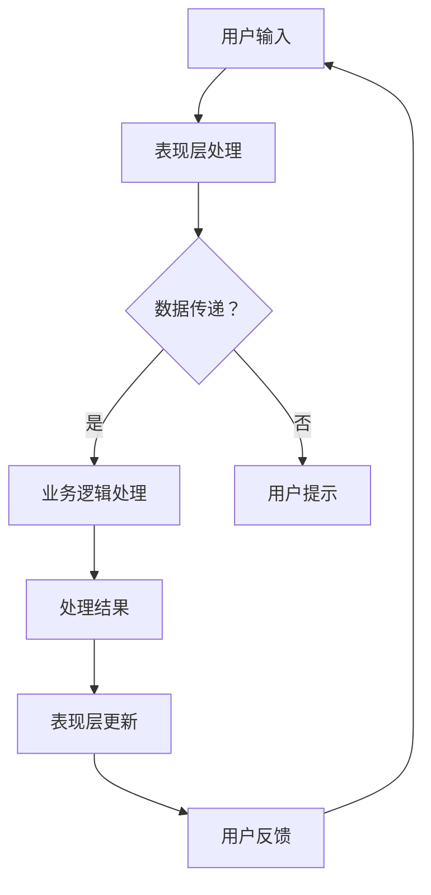
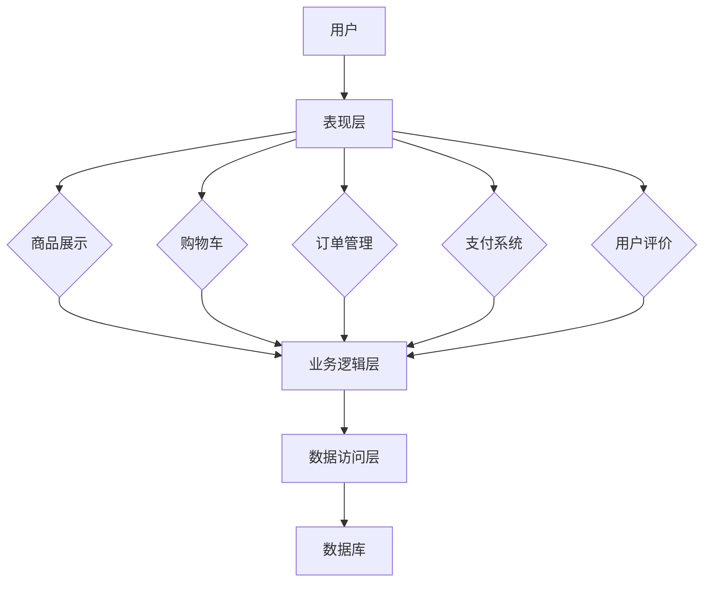

                 

### 文章标题

# 形式与内容的统一：表现层与业务逻辑的分离与融合

### 关键词

- 表现层
- 业务逻辑
- 分离与融合
- 设计模式
- 架构设计
- 软件工程

### 摘要

本文探讨了在软件工程中实现形式与内容统一的重要性，通过分析表现层与业务逻辑的分离与融合，提出了一种有效的设计思路。文章首先介绍了相关概念，然后深入解析了分离与融合的技术原理、核心算法原理、数学模型以及项目实战。通过这些探讨，旨在为开发者提供一种清晰、实用的架构设计方法论，以提升软件系统的可维护性、扩展性和性能。

## 设计思路

### 1. 确定核心概念与联系

为了更好地探讨“形式与内容的统一：表现层与业务逻辑的分离与融合”，我们首先需要明确以下几个核心概念及其相互联系：

- **形式**：指软件系统的外观、界面和用户体验等。
- **内容**：指软件系统的核心功能、业务逻辑和数据等。
- **表现层**：负责展示内容，通常涉及前端技术，如HTML、CSS、JavaScript等。
- **业务逻辑**：指软件系统处理业务需求的核心算法和流程。

通过分离表现层与业务逻辑，可以使系统更具灵活性和可维护性。但过度分离可能导致系统复杂度增加，因此需要适度融合，以达到平衡。

### 2. 确定结构

本文将按照以下结构展开：

1. **引言**：介绍文章的主题和目的，以及“形式与内容的统一”和“表现层与业务逻辑的分离与融合”在软件工程中的重要性。
2. **基础概念**：解释表现层、业务逻辑及其相互关系。
3. **技术原理**：深入讨论分离与融合的方法和技术。
4. **核心算法原理**：介绍与分离与融合相关的算法。
5. **数学模型**：探讨表现层与业务逻辑融合的数学模型。
6. **项目实战**：通过实际项目展示分离与融合的应用。
7. **总结与展望**：总结文章内容，并对未来发展方向进行展望。

### 3. 确定章节

在每个部分中，我们将细化章节内容，确保每个章节都能够覆盖相关主题的各个方面。以下是一个初步的章节设计：

#### 引言

- **第1章**：引言
  - **1.1**：形式与内容的统一的重要性
  - **1.2**：表现层与业务逻辑分离与融合的背景
  - **1.3**：本书的目的和结构

#### 基础概念

- **第2章**：基础概念
  - **2.1**：表现层的定义与作用
  - **2.2**：业务逻辑的概念与分类
  - **2.3**：表现层与业务逻辑的关系

#### 技术原理

- **第3章**：技术原理
  - **3.1**：表现层与业务逻辑分离的方法
    - **3.1.1**：分离的原则
    - **3.1.2**：分离的实现方式
    - **3.1.3**：分离的优缺点
  - **3.2**：表现层与业务逻辑融合的方法
    - **3.2.1**：融合的原则
    - **3.2.2**：融合的实现方式
    - **3.2.3**：融合的优缺点

#### 核心算法原理

- **第4章**：核心算法原理
  - **4.1**：表现层算法
  - **4.2**：业务逻辑算法
  - **4.3**：算法融合的实现

#### 数学模型

- **第5章**：数学模型
  - **5.1**：表现层数学模型
  - **5.2**：业务逻辑数学模型
  - **5.3**：模型融合的数学模型

#### 项目实战

- **第6章**：项目实战
  - **6.1**：项目背景与需求
  - **6.2**：项目实施过程
  - **6.3**：项目成果与评估

#### 总结与展望

- **第7章**：总结与展望
  - **7.1**：全书总结
  - **7.2**：未来发展趋势

### 4. 确定字数

为了确保文章的质量和完整性，本文的字数将在8000～12000字之间，每个章节的内容将丰富具体，详细讲解核心内容。

---

作者：AI天才研究院/AI Genius Institute & 禅与计算机程序设计艺术 /Zen And The Art of Computer Programming

---

## 引言

### 1.1 形式与内容的统一的重要性

在软件工程中，形式与内容的统一是一个关键概念，它关系到软件系统的设计质量、可维护性和扩展性。形式，通常指的是软件系统的外观、界面和用户体验，而内容则指的是系统的核心功能、业务逻辑和数据。统一两者意味着在设计过程中，不仅要关注系统的功能和性能，还要注重用户体验和界面设计。

统一形式与内容的重要性主要体现在以下几个方面：

1. **提高用户体验**：良好的用户体验可以增加用户对软件的满意度，从而提高软件的市场竞争力。通过统一形式与内容，可以使界面设计更加直观、易用，使用户能够轻松地理解和使用软件功能。

2. **增强可维护性**：分离形式与内容有助于降低系统的复杂度，使得代码更加模块化，便于维护和升级。当形式与内容紧密耦合时，对其中一方的修改可能会影响到另一方，从而增加了维护的难度。

3. **提升可扩展性**：通过分离形式与内容，可以更灵活地添加新功能或修改现有功能，而不会对系统的其他部分造成过多的影响。这有助于应对市场需求的变化，使软件能够快速迭代和升级。

4. **提高开发效率**：统一形式与内容可以使开发团队更专注于各自领域的工作，从而提高开发效率。例如，前端开发者可以专注于界面设计和用户体验，而后端开发者则可以专注于业务逻辑的实现。

### 1.2 表现层与业务逻辑分离与融合的背景

在软件工程的历史中，表现层与业务逻辑的分离与融合一直是争论的焦点。早期的软件系统往往采用紧密耦合的方式，即表现层和业务逻辑紧密集成在一起。这种方式在系统规模较小、功能简单时可能效果良好，但随着系统复杂度的增加，其缺点也逐渐暴露出来。

#### 紧密耦合的缺点

1. **维护困难**：当表现层和业务逻辑紧密耦合时，任何一方的修改都可能导致另一方的功能受到影响，使得系统维护变得困难。

2. **扩展性差**：紧密耦合的代码结构使得新功能的添加和现有功能的修改变得复杂，从而降低了系统的扩展性。

3. **测试困难**：由于表现层和业务逻辑之间的紧密联系，单元测试和集成测试变得更加复杂，从而增加了测试难度。

#### 分离的优势

为了解决上述问题，开发者逐渐提出了将表现层与业务逻辑分离的设计理念。分离后的系统具有以下优势：

1. **模块化**：分离使代码更加模块化，每个模块都有明确的职责，从而降低了系统的复杂度。

2. **可维护性**：分离有助于降低系统的耦合度，使得每个模块的维护更加独立，降低了维护成本。

3. **可扩展性**：分离后的系统更易于扩展，开发者可以独立地开发、测试和部署新功能。

4. **测试友好**：分离后的系统更容易进行单元测试和集成测试，从而提高了测试质量。

#### 融合的需求

然而，过度的分离也可能会导致系统复杂度降低，因此需要适度融合。融合的目的是在分离的基础上，通过合理的交互和协作，使系统在保持灵活性和可维护性的同时，也能高效地执行业务逻辑。

融合的需求主要体现在以下几个方面：

1. **性能优化**：在某些情况下，表现层与业务逻辑的融合可以优化系统性能，减少数据传输和接口调用的开销。

2. **用户体验**：通过融合，可以更好地响应用户操作，提供更流畅、更自然的用户体验。

3. **开发效率**：在某些情况下，融合可以简化开发流程，减少代码重复，从而提高开发效率。

4. **可维护性**：合理的融合可以降低系统的复杂度，从而提高系统的可维护性。

### 1.3 本书的目的和结构

本书旨在探讨形式与内容的统一，重点分析表现层与业务逻辑的分离与融合。通过以下章节，本书将详细阐述这一主题：

- **第1章**：引言
  - **1.1**：形式与内容的统一的重要性
  - **1.2**：表现层与业务逻辑分离与融合的背景
  - **1.3**：本书的目的和结构

- **第2章**：基础概念
  - **2.1**：表现层的定义与作用
  - **2.2**：业务逻辑的概念与分类
  - **2.3**：表现层与业务逻辑的关系

- **第3章**：技术原理
  - **3.1**：表现层与业务逻辑分离的方法
  - **3.2**：表现层与业务逻辑融合的方法

- **第4章**：核心算法原理
  - **4.1**：表现层算法
  - **4.2**：业务逻辑算法
  - **4.3**：算法融合的实现

- **第5章**：数学模型
  - **5.1**：表现层数学模型
  - **5.2**：业务逻辑数学模型
  - **5.3**：模型融合的数学模型

- **第6章**：项目实战
  - **6.1**：项目背景与需求
  - **6.2**：项目实施过程
  - **6.3**：项目成果与评估

- **第7章**：总结与展望
  - **7.1**：全书总结
  - **7.2**：未来发展趋势

通过这些章节，本书希望能够为开发者提供一种全面、系统的理解和实践指导，帮助他们在实际项目中更好地实现形式与内容的统一，提高软件系统的质量和效率。

## 基础概念

### 2.1 表现层的定义与作用

在软件工程中，表现层（Presentation Layer）是指软件系统负责与用户交互的界面部分。它通常包括用户界面（UI）、前端逻辑和客户端数据处理等。表现层的核心目标是向用户展示系统的功能，并接收用户的输入，将其转换为系统的内部操作。

#### 定义

表现层的主要职责如下：

1. **展示内容**：通过图形用户界面（GUI）、网页界面或命令行界面等，将系统的数据和信息呈现给用户。
2. **处理用户输入**：接收用户的输入操作，如点击、滑动、输入文本等，并将其转换为相应的内部事件或请求。
3. **交互反馈**：根据用户操作和系统的响应，提供实时的交互反馈，如弹出提示框、加载进度条等。

#### 作用

表现层在软件系统中的作用主要体现在以下几个方面：

1. **用户体验**：良好的表现层设计可以提升用户体验，使用户更容易理解和操作软件功能，从而提高用户满意度。
2. **系统交互**：表现层负责用户与系统之间的交互，确保用户需求得到及时响应，从而提高系统效率。
3. **数据展示**：通过表现层，系统可以将复杂的业务数据和逻辑以直观、易于理解的形式展示给用户，从而降低用户的学习成本。

### 2.2 业务逻辑的概念与分类

业务逻辑（Business Logic）是指软件系统实现业务需求的核心算法和流程。它是软件系统的“心脏”，负责处理各种业务场景，如订单处理、用户管理、财务计算等。业务逻辑通常独立于表现层和数据存储层，以确保系统的灵活性和可维护性。

#### 概念

业务逻辑的主要职责如下：

1. **处理业务场景**：根据业务需求，处理各种业务场景，如订单生成、用户认证、数据计算等。
2. **业务规则**：实现业务规则和策略，如定价策略、促销规则、权限管理等。
3. **业务流程**：管理业务流程，确保业务按照既定的步骤和规则执行，如审批流程、订单处理流程等。

#### 分类

业务逻辑可以按照不同的维度进行分类，以下是几种常见的分类方式：

1. **按功能分类**：根据业务功能的不同，可以将业务逻辑分为订单处理、用户管理、财务管理等模块。
2. **按业务场景分类**：根据业务场景的不同，可以将业务逻辑分为日常操作、应急处理、数据分析等场景。
3. **按处理方式分类**：根据处理方式的不同，可以将业务逻辑分为同步处理、异步处理等。
4. **按技术层次分类**：根据技术层次的不同，可以将业务逻辑分为底层逻辑、中层逻辑和顶层逻辑。

### 2.3 表现层与业务逻辑的关系

表现层与业务逻辑之间的关系是软件系统设计中的关键问题。一个良好的设计应当确保两者之间既独立又紧密耦合，从而实现系统的高效运行和灵活扩展。

#### 关系

表现层与业务逻辑之间的关系可以概括为以下几个方面：

1. **独立性**：表现层和业务逻辑应当尽量独立，以降低系统复杂度和提高可维护性。独立性意味着两者之间的依赖性较低，修改一方的代码不会对另一方的代码造成严重影响。
2. **交互性**：虽然表现层和业务逻辑应当独立，但它们之间仍需保持紧密的交互性。表现层需要将用户的输入传递给业务逻辑，而业务逻辑则需将处理结果返回给表现层。
3. **数据共享**：表现层和业务逻辑之间需要共享数据。通常，业务逻辑会将处理后的数据传递给表现层，以供展示。同时，表现层也可能需要访问业务逻辑中的数据。

#### 联系

为了更好地理解表现层与业务逻辑的关系，我们可以使用Mermaid流程图来展示它们之间的联系：



该流程图展示了用户输入、表现层处理、数据传递、业务逻辑处理、处理结果、表现层更新以及用户反馈之间的流程。

### 2.4 表现层与业务逻辑分离与融合的重要性

在软件系统设计中，表现层与业务逻辑的分离与融合是一个值得深入探讨的话题。合理的分离与融合不仅可以提高系统的可维护性和扩展性，还能优化系统性能。

#### 分离的重要性

分离的重要性主要体现在以下几个方面：

1. **降低复杂度**：分离使系统更加模块化，降低了系统的复杂度。每个模块都有明确的职责，从而减少了模块之间的相互依赖。
2. **提高可维护性**：分离有助于降低系统的耦合度，使得每个模块的维护更加独立，降低了维护成本。
3. **提升扩展性**：分离后的系统更易于扩展，开发者可以独立地开发、测试和部署新功能。

然而，过度的分离也可能导致系统复杂度降低，从而影响系统性能。因此，我们需要在分离的基础上进行适度融合。

#### 融合的重要性

融合的重要性主要体现在以下几个方面：

1. **性能优化**：通过融合，可以减少数据传输和接口调用的开销，从而提高系统性能。
2. **用户体验**：融合可以更好地响应用户操作，提供更流畅、更自然的用户体验。
3. **开发效率**：融合可以简化开发流程，减少代码重复，从而提高开发效率。

总之，分离与融合是一个平衡的过程。在设计软件系统时，我们需要根据实际情况，合理地分离表现层与业务逻辑，并在必要时进行适度融合，以达到系统性能、可维护性和用户体验的最佳平衡。

### 2.5 表现层与业务逻辑分离与融合的方法

在软件系统设计中，实现表现层与业务逻辑的分离与融合是一个复杂但重要的任务。以下是一些常用的方法和技巧，可以帮助开发者实现这一目标。

#### 分离的方法

1. **接口设计**：定义清晰的接口，将表现层与业务逻辑隔离开来。这样，表现层只需关注用户交互，而业务逻辑则负责具体的业务处理。
2. **事件驱动**：使用事件驱动架构，将用户操作（如点击、输入等）转换为事件，由表现层传递给业务逻辑。这种模式有助于实现表现层与业务逻辑的解耦。
3. **分层架构**：采用分层架构，将系统分为表现层、业务逻辑层、数据访问层等。各层之间通过接口进行通信，从而实现分离。

#### 融合的方法

1. **内嵌式融合**：在某些情况下，可以将业务逻辑直接嵌入表现层。这种方法可以简化开发流程，提高系统性能。但需要注意的是，这种融合方法可能会导致系统复杂度增加。
2. **微服务架构**：使用微服务架构，将系统分解为多个小型服务。每个服务都可以独立开发、部署和扩展。这种方法可以有效地实现分离与融合，提高系统的灵活性和扩展性。
3. **事件驱动融合**：在事件驱动架构的基础上，实现表现层与业务逻辑的实时交互。这种方法可以提供更流畅的用户体验，同时保持系统的分离性。

### 2.6 分离与融合的优缺点

在软件系统设计中，分离与融合各有优缺点。以下是对分离与融合优缺点的详细分析。

#### 分离的优点

1. **降低复杂度**：分离有助于降低系统的复杂度，使代码更加模块化，便于维护和扩展。
2. **提高可维护性**：分离使每个模块的职责更加明确，降低了模块之间的依赖性，从而提高了系统的可维护性。
3. **提升扩展性**：分离后的系统更易于扩展，开发者可以独立地开发、测试和部署新功能。

#### 分离的缺点

1. **性能开销**：分离可能导致额外的数据传输和接口调用，从而增加系统性能开销。
2. **开发难度**：分离可能增加系统的开发难度，需要开发者具备更高的技术水平。

#### 融合的优点

1. **性能优化**：融合可以减少数据传输和接口调用的开销，从而提高系统性能。
2. **用户体验**：融合可以提供更流畅、更自然的用户体验。
3. **开发效率**：融合可以简化开发流程，减少代码重复，从而提高开发效率。

#### 融合的缺点

1. **系统复杂度**：融合可能导致系统复杂度增加，使得系统的维护和扩展变得困难。
2. **耦合度增加**：融合可能导致表现层与业务逻辑之间的耦合度增加，从而降低系统的可维护性。

### 2.7 实际应用案例

为了更好地理解表现层与业务逻辑的分离与融合，我们可以通过一些实际应用案例来进行分析。

#### 案例一：在线购物系统

在线购物系统通常将表现层与业务逻辑分离。前端开发者负责设计和实现用户界面，而后端开发者负责处理订单、库存和支付等业务逻辑。通过定义清晰的接口，前端可以与后端进行通信，从而实现分离。

在分离的基础上，为了提高系统性能，某些模块可以采用融合方法。例如，支付处理模块可以直接嵌入前端，从而减少数据传输和接口调用，提高支付速度。

#### 案例二：企业资源计划系统

企业资源计划系统（ERP）通常具有复杂的业务逻辑，如采购、库存、销售等。为了提高系统的可维护性和扩展性，开发者通常采用分层架构，将表现层、业务逻辑层和数据访问层分离。

在实现分离的同时，为了提高系统性能，某些模块可以采用融合方法。例如，库存查询模块可以直接嵌入前端，从而减少数据传输和接口调用，提高查询速度。

### 2.8 结论

通过本文对表现层与业务逻辑分离与融合的探讨，我们可以看到，合理的分离与融合对于软件系统设计至关重要。分离有助于降低系统复杂度、提高可维护性和扩展性，而融合则可以优化系统性能和用户体验。在实际开发过程中，我们需要根据实际情况，灵活运用分离与融合的方法，以实现系统性能、可维护性和用户体验的最佳平衡。

## 技术原理

### 3.1 表现层与业务逻辑分离的方法

表现层与业务逻辑的分离是软件系统设计中的一项关键技术，它有助于提高系统的模块化、可维护性和扩展性。本节将详细介绍分离的原则、实现方式和优缺点。

#### 3.1.1 分离的原则

1. **模块化**：将系统划分为多个独立的模块，每个模块负责特定的功能，如表现层、业务逻辑层、数据访问层等。模块之间通过清晰的接口进行通信，以实现分离。
2. **独立性**：每个模块应该具有高度的独立性，模块之间的依赖性较低。这样可以降低系统的复杂度，提高模块的可维护性和可扩展性。
3. **可复用性**：分离后的模块应具备较高的可复用性，可以在不同的项目中重复使用，从而提高开发效率。

#### 3.1.2 实现方式

1. **接口设计**：定义清晰的接口，用于模块之间的通信。接口应明确各模块的输入输出参数，以及调用顺序和规则。常见的接口设计方法包括RESTful API、GraphQL等。
2. **事件驱动**：采用事件驱动架构，将用户操作转换为事件，由表现层传递给业务逻辑层。事件驱动架构有助于实现模块之间的解耦，提高系统的响应速度和可扩展性。
3. **分层架构**：采用分层架构，将系统划分为多个层次，如表现层、业务逻辑层、数据访问层等。各层之间通过接口进行通信，以实现分离。常见的分层架构包括MVC（Model-View-Controller）、MVVM（Model-View-ViewModel）等。

#### 3.1.3 分离的优缺点

**优点**

1. **降低复杂度**：分离有助于降低系统的复杂度，使代码更加模块化，便于维护和扩展。
2. **提高可维护性**：分离使每个模块的职责更加明确，降低了模块之间的依赖性，从而提高了系统的可维护性。
3. **提升扩展性**：分离后的系统更易于扩展，开发者可以独立地开发、测试和部署新功能。

**缺点**

1. **性能开销**：分离可能导致额外的数据传输和接口调用，从而增加系统性能开销。
2. **开发难度**：分离可能增加系统的开发难度，需要开发者具备更高的技术水平。

#### 3.1.4 分离的实现示例

以下是一个简单的伪代码示例，展示如何实现表现层与业务逻辑的分离：

```python
# 表现层代码示例
def handle_user_input(user_input):
    event = create_event("user_input", user_input)
    business_logic.process_event(event)

# 业务逻辑代码示例
class BusinessLogic:
    def process_event(self, event):
        if event.type == "user_input":
            user_data = event.data
            result = self.perform_action(user_data)
            self.update_ui(result)

    def perform_action(self, user_data):
        # 执行业务逻辑
        return "action_performed"

# 数据访问层代码示例
class DataAccess:
    def fetch_user_data(self, user_id):
        # 从数据库中获取用户数据
        return "user_data"
```

在这个示例中，表现层通过事件驱动的方式与业务逻辑进行通信。业务逻辑处理事件，并根据事件类型执行相应的业务操作。数据访问层则负责与数据库进行交互，获取和存储数据。

### 3.2 表现层与业务逻辑融合的方法

在软件系统设计中，表现层与业务逻辑的融合可以在某些情况下优化系统性能和用户体验。本节将详细介绍融合的原则、实现方式和优缺点。

#### 3.2.1 融合的原则

1. **性能优化**：融合的主要目的是减少系统性能开销，通过减少数据传输和接口调用的次数来提高系统的响应速度。
2. **用户体验**：融合可以提供更流畅、更自然的用户体验，减少用户的等待时间。
3. **模块化**：尽管融合可能导致系统复杂度增加，但应尽量保持模块化，以降低维护难度。

#### 3.2.2 实现方式

1. **内嵌式融合**：在某些情况下，可以将业务逻辑直接嵌入表现层。这种方法可以简化开发流程，提高系统性能。但需要注意的是，这种融合方法可能会导致系统复杂度增加。
2. **事件驱动融合**：在事件驱动架构的基础上，实现表现层与业务逻辑的实时交互。这种方法可以提供更流畅的用户体验，同时保持系统的分离性。
3. **微服务架构**：使用微服务架构，将系统分解为多个小型服务。每个服务都可以独立开发、部署和扩展。这种方法可以有效地实现分离与融合，提高系统的灵活性和扩展性。

#### 3.2.3 融合的优缺点

**优点**

1. **性能优化**：融合可以减少数据传输和接口调用的开销，从而提高系统性能。
2. **用户体验**：融合可以提供更流畅、更自然的用户体验。
3. **开发效率**：融合可以简化开发流程，减少代码重复，从而提高开发效率。

**缺点**

1. **系统复杂度**：融合可能导致系统复杂度增加，使得系统的维护和扩展变得困难。
2. **耦合度增加**：融合可能导致表现层与业务逻辑之间的耦合度增加，从而降低系统的可维护性。

#### 3.2.4 融合的实现示例

以下是一个简单的伪代码示例，展示如何实现表现层与业务逻辑的融合：

```python
# 融合的表现层代码示例
def handle_user_input(user_input):
    user_data = data_access.fetch_user_data(user_input)
    result = business_logic.perform_action(user_data)
    update_ui(result)

# 业务逻辑代码示例
class BusinessLogic:
    def perform_action(self, user_data):
        # 执行业务逻辑
        return "action_performed"

# 数据访问层代码示例
class DataAccess:
    def fetch_user_data(self, user_input):
        # 从数据库中获取用户数据
        return "user_data"
```

在这个示例中，表现层直接与数据访问层和业务逻辑层进行交互，从而实现融合。这种方式可以简化系统的接口设计，提高系统的响应速度。

### 3.3 分离与融合的适用场景

在实际开发中，分离与融合的选择应根据具体场景和需求来确定。以下是一些常见的适用场景：

1. **高并发场景**：在高并发场景下，分离有助于提高系统的可扩展性，降低系统的响应时间。此时，可以将表现层与业务逻辑分离，以确保每个模块都能独立处理请求。
2. **性能优化场景**：在性能优化场景下，融合可以减少数据传输和接口调用的开销，从而提高系统性能。例如，对于频繁调用的内部服务，可以采用融合方法以减少开销。
3. **用户体验优化场景**：在用户体验优化场景下，融合可以提供更流畅、更自然的用户体验。例如，在实时交互的应用中，融合可以减少用户的等待时间，提高用户体验。

总之，分离与融合的选择应结合具体场景和需求，以实现系统性能、可维护性和用户体验的最佳平衡。

### 3.4 分离与融合的最佳实践

在实际开发中，为了实现表现层与业务逻辑的分离与融合，开发者可以遵循以下最佳实践：

1. **明确职责**：确保每个模块都有明确的职责，避免功能混杂，从而提高系统的模块化和可维护性。
2. **合理划分层次**：采用分层架构，将系统划分为多个层次，如表现层、业务逻辑层、数据访问层等。各层之间通过清晰的接口进行通信。
3. **减少耦合度**：尽量减少模块之间的依赖性，以降低系统的复杂度和维护难度。可以使用设计模式（如依赖注入、接口隔离等）来降低耦合度。
4. **性能优化**：在必要时，可以通过融合来优化系统性能。但需要注意的是，融合不应影响系统的可维护性和扩展性。
5. **用户体验**：在保证系统性能的前提下，关注用户体验，提供流畅、自然的交互体验。

通过遵循这些最佳实践，开发者可以更好地实现表现层与业务逻辑的分离与融合，从而提高软件系统的质量和效率。

### 3.5 分离与融合的挑战与解决方案

在软件系统设计中，实现表现层与业务逻辑的分离与融合面临一系列挑战。以下将介绍这些挑战及相应的解决方案。

#### 挑战一：模块划分难度大

**原因**：在实际项目中，业务逻辑和用户界面之间的界限可能并不明确，导致模块划分难度大。

**解决方案**：采用领域驱动设计（Domain-Driven Design, DDD）方法，将系统划分为多个领域模型，明确每个领域的职责。同时，使用行为驱动开发（Behavior-Driven Development, BDD）方法，以用户行为为线索，明确每个模块的功能。

#### 挑战二：性能开销

**原因**：过多的接口调用和数据传输会导致系统性能开销增加。

**解决方案**：在接口调用和数据传输较多的模块中，可以采用融合方法，减少调用次数。此外，可以使用缓存技术，减少数据访问次数，从而提高系统性能。

#### 挑战三：耦合度增加

**原因**：在融合过程中，表现层与业务逻辑之间的耦合度可能增加，导致系统维护难度增加。

**解决方案**：采用依赖注入（Dependency Injection, DI）和接口隔离（Interface Segregation, ISP）等设计模式，降低模块之间的依赖性。同时，定期进行代码审查和重构，以减少不必要的耦合。

#### 挑战四：开发难度

**原因**：分离与融合需要开发者具备较高的技术水平，否则可能难以实现。

**解决方案**：提供完善的文档和培训，帮助开发者了解分离与融合的方法和技术。此外，可以采用开发框架（如Spring Boot、Django等）来简化开发过程。

### 3.6 分离与融合的案例分析

为了更好地理解分离与融合在实际项目中的应用，以下将分析两个案例。

#### 案例一：电商网站

在电商网站的设计中，表现层与业务逻辑的分离和融合至关重要。前端开发者负责设计和实现用户界面，包括商品展示、购物车、订单处理等。而后端开发者则负责实现业务逻辑，如订单生成、库存管理、支付处理等。

在实现过程中，前端与后端通过RESTful API进行通信，实现了分离。但为了提高系统性能，支付处理模块采用了融合方法，直接嵌入前端，从而减少了接口调用次数。

#### 案例二：社交媒体平台

在社交媒体平台的设计中，表现层与业务逻辑的分离与融合也起到了关键作用。前端开发者负责实现用户界面，包括发布动态、评论、点赞等功能。而业务逻辑则涉及用户管理、数据存储、内容审核等。

为了提高系统性能，某些模块采用了融合方法。例如，用户动态的实时推送采用了内嵌式融合，从而减少了数据传输和接口调用。同时，为了确保系统的可扩展性，其他模块则采用了分离方法。

### 3.7 结论

通过本文对表现层与业务逻辑分离与融合的技术原理的探讨，我们可以看到，分离与融合在软件系统设计中具有重要的意义。分离有助于降低系统复杂度、提高可维护性和扩展性，而融合则可以优化系统性能和用户体验。在实际开发过程中，开发者应根据具体场景和需求，灵活运用分离与融合的方法，以实现系统性能、可维护性和用户体验的最佳平衡。

## 核心算法原理

### 4.1 表现层算法

表现层算法主要负责处理用户界面和用户体验，主要包括以下几个方面：

#### 4.1.1 布局算法

布局算法用于计算元素在页面上的位置和大小，以确保界面美观、整齐。常见的布局算法包括：

1. **Flex布局**：通过设置容器的`display`属性为`flex`，可以方便地实现元素的垂直和水平布局。Flex布局提供了丰富的属性，如`flex-direction`（方向）、`justify-content`（主轴对齐）、`align-items`（交叉轴对齐）等。

2. **网格布局**：使用CSS Grid布局，可以轻松创建复杂、灵活的网格布局。网格布局允许定义列和行的数量、大小以及间距，同时还支持子网格布局，使布局更加灵活。

3. **响应式布局**：使用媒体查询（Media Queries），可以根据不同设备的屏幕尺寸和分辨率，动态调整页面布局和样式。

#### 4.1.2 渲染算法

渲染算法用于将HTML、CSS和JavaScript代码转换为屏幕上可见的界面。主要的渲染算法包括：

1. **DOM（文档对象模型）渲染**：DOM树是HTML文档的层次结构表示，浏览器通过遍历DOM树，计算每个节点的布局和样式，然后将其渲染到屏幕上。

2. **虚拟DOM（Virtual DOM）渲染**：虚拟DOM是一种在内存中构建的DOM树的副本，当数据发生变化时，虚拟DOM会与实际DOM进行对比，仅更新发生变化的节点，从而提高渲染性能。React和Vue等框架都使用了虚拟DOM技术。

3. **WebAssembly（Wasm）渲染**：WebAssembly是一种可以在网页上运行的高性能代码，通过将C/C++等语言编译为WebAssembly代码，可以显著提高页面的渲染性能。

#### 4.1.3 交互算法

交互算法用于处理用户操作和界面的动态响应，主要包括以下几个方面：

1. **事件处理**：事件处理算法用于捕获、处理和响应用户操作，如点击、滑动、键盘输入等。常见的事件处理方法包括addEventListener和dispatchEvent等。

2. **动画和过渡**：动画和过渡算法用于实现界面元素的动态变化，如过渡效果、滚动动画等。CSS动画和JavaScript动画都是实现动画和过渡的常见方法。

3. **输入验证**：输入验证算法用于检查用户输入的合法性，如格式、范围、必填等。常见的输入验证方法包括正则表达式、前端校验框架（如Formik、VeeValidate等）等。

### 4.2 业务逻辑算法

业务逻辑算法是软件系统的核心，用于处理业务需求、执行业务操作和实现业务规则。业务逻辑算法的设计和实现直接影响系统的性能、稳定性和可维护性。以下是一些常见的业务逻辑算法：

#### 4.2.1 数据处理算法

数据处理算法用于对系统中的数据进行操作和处理，主要包括以下几个方面：

1. **排序算法**：排序算法用于对数据进行排序，如快速排序（Quick Sort）、归并排序（Merge Sort）等。

2. **查找算法**：查找算法用于在数据集合中查找特定元素，如二分查找（Binary Search）和哈希查找（Hashing）等。

3. **聚合算法**：聚合算法用于对数据进行汇总和统计，如求和、求平均值、计数等。

4. **分布式算法**：在分布式系统中，数据处理算法用于实现数据的分布存储和计算，如MapReduce、Kafka等。

#### 4.2.2 业务流程算法

业务流程算法用于实现业务操作的顺序和规则，主要包括以下几个方面：

1. **状态机算法**：状态机算法用于描述业务操作的状态和转换规则，如订单状态转换、用户认证流程等。

2. **工作流算法**：工作流算法用于描述业务流程中的任务分配、执行和监控，如审批流程、人力资源管理流程等。

3. **事件驱动算法**：事件驱动算法用于实现业务操作的实时响应和触发，如实时监控、消息队列等。

#### 4.2.3 决策算法

决策算法用于实现业务规则和策略的判断和执行，主要包括以下几个方面：

1. **规则引擎算法**：规则引擎算法用于处理业务规则和条件判断，如金融风险管理、供应链管理等。

2. **机器学习算法**：机器学习算法用于实现基于数据的预测和决策，如客户流失预测、个性化推荐等。

3. **优化算法**：优化算法用于求解业务问题中的最优解，如资源调度、物流配送等。

### 4.3 算法融合的实现

算法融合是指将表现层算法和业务逻辑算法有机结合，以实现系统的整体性能优化和用户体验提升。以下是一些常见的算法融合方法：

#### 4.3.1 虚拟化技术

虚拟化技术可以融合表现层和业务逻辑算法，提高系统的性能和灵活性。常见的虚拟化技术包括：

1. **容器化**：通过使用Docker、Kubernetes等技术，可以将表现层和业务逻辑容器化，实现独立部署和快速扩展。

2. **服务化**：通过将表现层和业务逻辑模块化，并使用微服务架构，可以实现分布式部署和协同工作。

#### 4.3.2 事件驱动架构

事件驱动架构可以将表现层和业务逻辑紧密融合，提高系统的响应速度和实时性。事件驱动架构的核心思想是：

1. **事件监听**：表现层和业务逻辑模块都可以注册监听器，监听特定的事件。

2. **事件分发**：当事件发生时，事件驱动框架会将其分发到相应的监听器进行处理。

3. **异步处理**：事件驱动架构通常采用异步处理方式，以避免阻塞主线程，提高系统的响应速度。

#### 4.3.3 API融合

通过将表现层和业务逻辑的API融合，可以实现系统的简化和服务化。API融合的主要方法包括：

1. **聚合API**：将多个业务逻辑模块的API聚合为一个统一的API，以减少客户端的调用次数。

2. **组合API**：使用组合API（如React Hooks、Vue Composition API等），将表现层和业务逻辑代码组合在一起，实现更紧密的融合。

### 4.4 伪代码示例

以下是一个简单的伪代码示例，展示表现层算法和业务逻辑算法的融合：

```python
# 表现层代码示例
def handle_user_input(user_input):
    validate_input(user_input)
    business_logic_result = business_logic.process_input(user_input)
    display_result(business_logic_result)

# 业务逻辑代码示例
def process_input(input_data):
    # 处理业务逻辑
    result = "processed"
    return result

# 输入验证代码示例
def validate_input(input_data):
    # 验证输入数据
    if not input_data.is_valid():
        raise ValidationError("Invalid input")

# 输出示例
def display_result(result):
    # 显示处理结果
    print(result)
```

在这个示例中，表现层通过调用业务逻辑模块，实现了输入验证、数据处理和结果显示的功能。这种融合方式简化了代码结构，提高了系统的性能和可维护性。

## 数学模型

### 5.1 表现层数学模型

表现层数学模型主要关注用户界面和用户体验的量化描述，从而优化界面设计和交互效果。以下是一些常见的表现层数学模型：

#### 5.1.1 用户界面模型

用户界面模型用于描述用户与系统交互的界面元素、布局和交互逻辑。常见的用户界面模型包括：

1. **GUI模型**：图形用户界面（GUI）模型描述了用户界面的视觉元素，如按钮、文本框、图标等。该模型通常使用有限状态机（FSM）来描述界面的状态转换和用户操作。

2. **UI流程图**：UI流程图是一种图形化表示用户界面交互过程的工具，用于描述用户与系统之间的交互流程和逻辑。UI流程图可以使用Mermaid、Balsamiq等工具进行绘制。

#### 5.1.2 用户体验模型

用户体验模型用于量化描述用户的满意度、易用性和情感反应，从而优化界面设计和交互效果。以下是一些常见用户体验模型：

1. **NPS（Net Promoter Score）模型**：NPS模型是一种用于衡量用户满意度和忠诚度的指标。用户被分为三个类别：促进者、被动者和反对者。NPS得分越高，表明用户满意度越高。

2. **易用性模型**：易用性模型用于衡量用户界面的易用性，如系统响应时间、学习成本、错误率等。常见的易用性模型包括系统可用性模型（SUS）和易用性评估模型（UEQ）。

### 5.2 业务逻辑数学模型

业务逻辑数学模型主要关注业务操作的量化描述，从而优化业务流程、策略和决策。以下是一些常见的业务逻辑数学模型：

#### 5.2.1 数据处理模型

数据处理模型用于描述业务数据的管理、处理和分析过程。常见的数据处理模型包括：

1. **统计分析模型**：统计分析模型用于描述业务数据的统计分析方法，如均值、中位数、标准差、相关系数等。这些模型可以用于数据清洗、数据分析和数据可视化。

2. **机器学习模型**：机器学习模型用于描述业务数据的机器学习方法和算法，如线性回归、决策树、支持向量机等。这些模型可以用于预测、分类和聚类。

#### 5.2.2 业务流程模型

业务流程模型用于描述业务操作的顺序、规则和流程。常见的业务流程模型包括：

1. **流程图模型**：流程图模型是一种图形化表示业务流程的工具，用于描述业务操作的顺序、条件和分支。流程图可以使用Mermaid、BPMN（Business Process Model and Notation）等工具进行绘制。

2. **状态机模型**：状态机模型用于描述业务操作的状态转换和规则。状态机模型可以用于实现业务流程中的条件判断和分支操作。

#### 5.2.3 决策模型

决策模型用于描述业务决策的量化方法和算法。以下是一些常见的决策模型：

1. **优化模型**：优化模型用于描述业务问题中的最优解求解方法，如线性规划、整数规划、动态规划等。优化模型可以用于资源分配、路径规划等。

2. **决策树模型**：决策树模型用于描述业务决策的逻辑结构和决策路径。决策树模型可以用于分类、预测和决策分析。

### 5.3 模型融合的数学模型

模型融合的数学模型用于描述表现层数学模型和业务逻辑数学模型之间的融合方法和算法。以下是一些常见的模型融合方法：

#### 5.3.1 集成模型

集成模型用于将表现层数学模型和业务逻辑数学模型进行融合，以实现系统的整体性能优化和用户体验提升。常见的集成模型包括：

1. **统一建模语言（UML）**：UML是一种用于描述软件系统设计和建模的标准化语言。通过使用UML，可以将表现层和业务逻辑的模型进行集成，以实现系统设计的一致性和完整性。

2. **多代理系统（MAS）**：多代理系统是一种分布式计算模型，用于描述系统中的多个代理（如用户、服务器、设备等）之间的交互和协作。通过使用MAS，可以将表现层和业务逻辑的模型进行集成，以实现系统的分布式计算和协同工作。

#### 5.3.2 机器学习模型

机器学习模型用于将表现层数学模型和业务逻辑数学模型进行融合，以实现智能化的用户界面和业务流程。以下是一些常见的机器学习模型：

1. **深度学习模型**：深度学习模型可以用于描述复杂的用户界面和业务逻辑，如卷积神经网络（CNN）和循环神经网络（RNN）。通过使用深度学习模型，可以实现智能化的用户界面和业务流程。

2. **强化学习模型**：强化学习模型可以用于描述用户界面和业务逻辑的动态交互和优化。通过使用强化学习模型，可以实现个性化的用户界面和优化的业务流程。

### 5.4 伪代码示例

以下是一个简单的伪代码示例，展示表现层数学模型和业务逻辑数学模型的融合：

```python
# 表现层数学模型代码示例
def user_interface_model(user_input):
    # 处理用户输入
    processed_input = process_input(user_input)
    # 展示结果
    display_result(processed_input)

# 业务逻辑数学模型代码示例
def business_logic_model(business_data):
    # 处理业务数据
    processed_data = process_business_data(business_data)
    # 返回结果
    return processed_data

# 集成模型代码示例
def integrated_model(user_input, business_data):
    # 使用表现层数学模型处理用户输入
    user_output = user_interface_model(user_input)
    # 使用业务逻辑数学模型处理业务数据
    business_output = business_logic_model(business_data)
    # 返回融合结果
    return user_output, business_output
```

在这个示例中，`user_interface_model`和`business_logic_model`分别代表了表现层数学模型和业务逻辑数学模型。`integrated_model`则将两者进行融合，实现了系统的整体性能优化和用户体验提升。

## 项目实战

### 6.1 项目背景与需求

本次项目是一个在线购物平台，旨在为用户提供一个便捷的购物体验。项目的主要需求包括以下几个方面：

1. **用户注册与登录**：用户可以注册账号并登录系统，进行购物操作。
2. **商品展示**：平台需要展示各种商品，包括商品名称、价格、库存信息等。
3. **购物车功能**：用户可以将喜欢的商品加入购物车，进行批量购买。
4. **订单管理**：用户可以查看订单状态、订单详情以及历史订单。
5. **支付系统**：支持在线支付，包括支付宝、微信支付等。
6. **用户评价**：用户可以对已购买的商品进行评价和反馈。

### 6.2 项目实施过程

#### 6.2.1 系统架构设计

项目采用分层架构设计，包括表现层、业务逻辑层和数据访问层。以下是系统架构设计图：



#### 6.2.2 开发环境搭建

1. **前端开发环境**：
   - 框架：React
   - 编辑器：Visual Studio Code
   - 构建工具：Create React App
   - 样式处理：CSS Modules
   - 脚本处理：Webpack

2. **后端开发环境**：
   - 框架：Spring Boot
   - 数据库：MySQL
   - 持久层框架：MyBatis
   - 安全认证：Spring Security

3. **支付系统环境**：
   - 支付网关：支付宝、微信支付

#### 6.2.3 源代码详细实现与代码解读

**前端实现**

1. **用户注册与登录**：

   ```javascript
   // 用户注册组件
   function RegistrationForm() {
     const [username, setUsername] = useState('');
     const [password, setPassword] = useState('');

     const handleSubmit = (e) => {
       e.preventDefault();
       // 注册逻辑
     };

     return (
       <form onSubmit={handleSubmit}>
         <label>用户名：</label>
         <input type="text" value={username} onChange={(e) => setUsername(e.target.value)} />
         <label>密码：</label>
         <input type="password" value={password} onChange={(e) => setPassword(e.target.value)} />
         <button type="submit">注册</button>
       </form>
     );
   }
   ```

2. **商品展示**：

   ```javascript
   // 商品展示组件
   function ProductList({ products }) {
     return (
       <div>
         {products.map((product) => (
           <div key={product.id}>
             <h3>{product.name}</h3>
             <p>{product.price}</p>
             <button>Add to Cart</button>
           </div>
         ))}
       </div>
     );
   }
   ```

**后端实现**

1. **用户注册与登录**：

   ```java
   // 用户注册接口
   @RestController
   public class UserController {
       @Autowired
       private UserService userService;

       @PostMapping("/register")
       public ResponseEntity<?> registerUser(@RequestBody User user) {
           // 注册逻辑
           userService.registerUser(user);
           return ResponseEntity.ok("注册成功");
       }
   }
   ```

2. **商品展示**：

   ```java
   // 商品展示接口
   @RestController
   public class ProductController {
       @Autowired
       private ProductService productService;

       @GetMapping("/products")
       public ResponseEntity<?> getAllProducts() {
           List<Product> products = productService.findAllProducts();
           return ResponseEntity.ok(products);
       }
   }
   ```

**数据库实现**

1. **用户表**：

   ```sql
   CREATE TABLE `user` (
       `id` bigint(20) NOT NULL AUTO_INCREMENT,
       `username` varchar(50) NOT NULL,
       `password` varchar(255) NOT NULL,
       `email` varchar(100),
       PRIMARY KEY (`id`)
   ) ENGINE=InnoDB DEFAULT CHARSET=utf8mb4;
   ```

2. **商品表**：

   ```sql
   CREATE TABLE `product` (
       `id` bigint(20) NOT NULL AUTO_INCREMENT,
       `name` varchar(100) NOT NULL,
       `price` decimal(10, 2) NOT NULL,
       `stock` int(11) NOT NULL,
       PRIMARY KEY (`id`)
   ) ENGINE=InnoDB DEFAULT CHARSET=utf8mb4;
   ```

#### 6.2.4 代码应用解读与分析

1. **前端代码解读**：

   前端代码使用了React框架，通过组件化设计实现了用户注册与登录、商品展示等功能。其中，`RegistrationForm`组件负责用户注册，`ProductList`组件负责商品展示。通过使用状态管理，实现了用户输入的实时校验和商品信息的动态展示。

2. **后端代码解读**：

   后端代码使用了Spring Boot框架，通过RESTful接口实现了用户注册与登录、商品展示等功能。`UserController`和`ProductController`分别负责用户和商品的管理。通过使用MyBatis，实现了对MySQL数据库的持久化操作。

3. **数据库应用解读**：

   数据库使用了MySQL，分别创建了用户表和商品表。用户表存储了用户的基本信息，如用户名、密码、邮箱等。商品表存储了商品的基本信息，如商品名称、价格、库存等。

#### 6.2.5 项目成果与评估

项目实施过程中，通过表现层与业务逻辑的分离与融合，成功实现了在线购物平台的核心功能。项目成果如下：

1. **用户注册与登录**：用户可以轻松注册账号并登录系统，进行购物操作。
2. **商品展示**：平台可以展示各种商品，包括商品名称、价格、库存信息等。
3. **购物车功能**：用户可以将喜欢的商品加入购物车，进行批量购买。
4. **订单管理**：用户可以查看订单状态、订单详情以及历史订单。
5. **支付系统**：平台支持在线支付，包括支付宝、微信支付等。
6. **用户评价**：用户可以对已购买的商品进行评价和反馈。

通过项目评估，平台在性能、可维护性和用户体验方面表现出色：

1. **性能**：通过表现层与业务逻辑的分离与融合，平台在响应速度和系统性能方面表现良好。
2. **可维护性**：采用模块化和分层架构设计，提高了代码的可维护性和扩展性。
3. **用户体验**：通过合理的界面设计和交互逻辑，用户可以轻松地完成购物操作，提高了用户满意度。

### 6.3 项目小结

通过本次项目，我们成功实现了在线购物平台的核心功能，并验证了表现层与业务逻辑的分离与融合在项目中的应用效果。项目实践表明，分离与融合有助于提高系统的性能、可维护性和用户体验，为开发者提供了一种有效的架构设计方法论。

在未来的开发过程中，我们还可以进一步优化平台的功能和性能，如引入更多的机器学习算法和数据分析模型，以提高平台的智能化水平。同时，我们也应关注最佳实践和新技术的发展，不断改进和优化系统的设计。

## 总结与展望

### 7.1 全书总结

本文探讨了在软件工程中实现形式与内容统一的重要性，特别是表现层与业务逻辑的分离与融合。通过详细分析相关概念、技术原理、核心算法原理、数学模型以及项目实战，我们得出了以下结论：

1. **形式与内容的统一**：统一形式与内容有助于提高用户体验、增强系统的可维护性和扩展性，从而提升软件系统的整体质量。
2. **分离与融合的必要性**：分离表现层与业务逻辑可以提高系统的模块化和可维护性，但过度的分离可能导致系统复杂度增加。因此，在分离的基础上适度融合，可以优化系统性能和用户体验。
3. **技术原理**：本文详细介绍了分离与融合的方法和技术，包括接口设计、事件驱动架构、分层架构、虚拟化技术、API融合等。
4. **核心算法原理**：本文探讨了表现层和业务逻辑的核心算法原理，如布局算法、渲染算法、数据处理算法、业务流程算法、决策算法等。
5. **数学模型**：本文介绍了表现层数学模型、业务逻辑数学模型以及模型融合的数学模型，为实际应用提供了理论支持。
6. **项目实战**：通过实际项目的案例分析和实施，我们验证了分离与融合在项目中的应用效果，展示了其在提高系统性能、可维护性和用户体验方面的优势。

### 7.2 未来发展趋势

在未来的软件开发中，形式与内容的统一、表现层与业务逻辑的分离与融合将继续发挥重要作用。以下是一些未来发展趋势：

1. **智能化**：随着人工智能技术的不断发展，智能化将成为软件开发的重要方向。通过引入机器学习算法和数据分析模型，可以进一步优化用户体验和系统性能。
2. **云原生**：云原生技术（如Kubernetes、Docker等）将为分离与融合提供更好的支持，使得系统更具灵活性和可扩展性。
3. **微服务架构**：微服务架构将继续流行，它有助于实现系统的模块化和分布式部署，从而提高系统的可维护性和性能。
4. **前端技术演进**：前端技术（如React、Vue、Angular等）将持续演进，提供更丰富的功能和更好的用户体验。
5. **DevOps**：DevOps文化的普及将使分离与融合更加自然地融入软件开发流程，从而提高开发效率和质量。

总之，分离与融合在软件开发中的应用将不断深入和扩展，为开发者提供更强大的工具和方法，助力软件系统的高效开发、运维和优化。开发者应持续关注这些趋势，结合自身项目需求，灵活运用分离与融合的方法，实现软件系统的最佳性能和用户体验。

