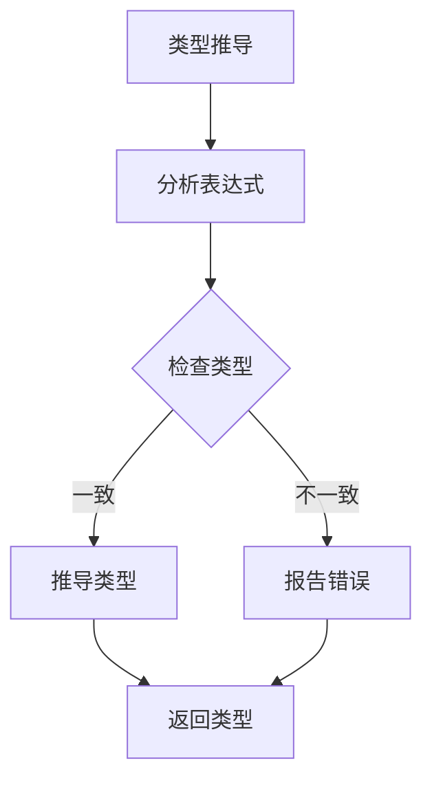

                 

### 文章标题

## 形式与内容的统一：维特根斯坦的形式观与FP中的类型与值的统一

### 关键词

- 维特根斯坦
- 形式观
- 函数式编程
- 类型系统
- 值的统一
- FP语言设计

### 摘要

本文旨在探讨维特根斯坦的形式观与函数式编程（FP）中类型与值的统一。首先，我们将回顾维特根斯坦的形式观，并分析其在哲学中的重要性。接着，我们将介绍FP的基本概念和特点，展示维特根斯坦的形式观如何在FP中找到共鸣。文章随后深入讨论类型与值的统一原理，通过数学模型、伪代码以及实际项目案例，解析这一原理在FP语言设计和应用中的实现。最终，我们还将提供一些建议和总结，帮助读者更好地理解并应用这一理念。通过本文的阅读，读者将对维特根斯坦的形式观和FP中的类型与值的统一有更深刻的认识。

### 引言

在探讨计算机科学的发展历程时，我们不可避免地会涉及到哲学领域的深远影响。维特根斯坦（Ludwig Wittgenstein）是一位伟大的哲学家，他的思想对现代计算机科学产生了深远的影响。尤其是他的形式观，为理解和设计编程语言中的类型系统提供了宝贵的哲学基础。维特根斯坦的形式观强调语言的逻辑结构和表达方式，这一观点在函数式编程（Functional Programming，简称FP）中得到了广泛应用和验证。

FP是一种编程范式，以其纯函数、不可变数据和惰性求值等特性而著称。FP的核心在于将计算视为表达式的组合，而不是指令的执行。这种范式在处理复杂逻辑和并发计算方面具有显著优势。然而，FP的成功不仅仅是因为其技术上的创新，还在于其哲学基础——形式与内容的统一。这一理念源于维特根斯坦的形式观，强调在编程中通过清晰的形式表达意图，从而达到内容的精确性和一致性。

本文将首先回顾维特根斯坦的形式观，介绍其在哲学中的核心思想。随后，我们将探讨FP的基本概念和特点，并分析形式观如何影响FP的设计。接下来，文章将深入探讨类型与值的统一原理，通过数学模型、伪代码和实际项目案例，展示这一原理的实现和应用。最后，我们将总结本文的主要观点，并提出未来研究方向和实际应用的建议。

通过本文的阅读，读者将更好地理解维特根斯坦的形式观及其在FP中的重要性，掌握类型与值的统一原理，并为未来的研究和实践提供启示。

### 维特根斯坦的形式观概述

维特根斯坦（Ludwig Wittgenstein）是20世纪最杰出的哲学家之一，他的思想对多个学科产生了深远的影响，包括逻辑学、数学、语言哲学和计算机科学。他的形式观是其哲学体系中的一个核心部分，这一观点强调语言的逻辑结构和表达方式的清晰性和准确性。

维特根斯坦的形式观主要体现在他对语言和思考方式的理解上。他认为，语言是思维的工具，语言中的符号和表达式应当与世界的实际情况相对应。然而，语言的复杂性使得人们往往陷入混淆，无法准确表达思想和意图。为了解决这一问题，维特根斯坦提出了“清晰性原则”，即通过简化语言形式，使其更加直观和易于理解。

维特根斯坦的形式观的核心思想可以归纳为以下几点：

1. **语言的逻辑结构**：维特根斯坦强调，语言中的每一个符号和表达式都应当有明确的逻辑结构。这种结构不仅体现了语言的形式，还反映了语言的语义。换句话说，形式和内容在语言中是统一的。

2. **表达式的组合性**：维特根斯坦认为，复杂的表达式可以通过组合简单的符号和基本概念来表达。这种组合性使得语言能够处理复杂的概念和逻辑关系，同时保持表达的清晰性。

3. **简化与直观性**：为了使语言更加直观和易于理解，维特根斯坦主张通过简化语言形式来实现。这包括去除不必要的复杂性、明确符号的定义和关系等。

4. **形式的简洁性**：维特根斯坦认为，形式的简洁性是语言表达有效性的关键。简洁的形式不仅易于理解，还能减少误解和混淆的可能性。

维特根斯坦的形式观在哲学领域引起了广泛的讨论和影响。他的思想不仅挑战了传统的语言哲学观点，也为逻辑学和数学基础的研究提供了新的视角。在计算机科学领域，维特根斯坦的形式观同样具有重要意义，尤其是在编程语言设计和类型系统的构建中。

在编程语言中，形式与内容的统一是实现代码可读性、可维护性和正确性的关键。维特根斯坦的形式观提供了一种思考方式，使得程序员能够更加清晰地表达和处理复杂的计算逻辑。通过遵循形式与内容的统一原则，程序员可以构建更加可靠和高效的程序。

具体来说，维特根斯坦的形式观对类型系统的构建产生了深远影响。类型系统是编程语言中的一个核心概念，它定义了变量、函数和表达式的类型，并确保它们在操作中的正确性。维特根斯坦的思想强调了类型系统中的形式与内容的统一，即类型定义应当清晰、简洁且易于理解，以便程序员能够准确表达和处理不同类型的值。

此外，维特根斯坦的形式观还为函数式编程提供了哲学基础。FP范式以其纯函数和不可变数据为核心特性，强调通过组合简单的表达式来构建复杂的计算逻辑。维特根斯坦的形式观与FP范式中的这种组合性原则相呼应，为FP语言的设计提供了指导。

总之，维特根斯坦的形式观是一种深刻的哲学思考方式，它不仅在哲学领域产生了重要影响，也在计算机科学领域得到了广泛应用。通过理解维特根斯坦的形式观，程序员可以更好地设计编程语言和类型系统，构建更加可靠和高效的程序。

### 形式观在哲学中的地位

维特根斯坦的形式观在哲学领域中占据了重要的地位，并对多个哲学分支产生了深远的影响。首先，在语言哲学中，维特根斯坦的形式观为语言的本质和意义提供了新的视角。他的早期著作《逻辑哲学论》（Tractatus Logico-Philosophicus）中，维特根斯坦提出了著名的“图像论”（Picture Theory），即语言符号应当像图像一样映射现实。这一观点挑战了传统语言哲学中的“语义实在论”（Semantic Realism），并引发了对语言表达和理解的深入探讨。

维特根斯坦的形式观还影响了认识论的研究。他提出了“生活形式”（Forms of Life）的概念，认为我们的理解和认知是通过日常生活中的语言和行为习惯构建的。这一观点为研究认知过程和知识获取提供了新的思路，强调了实践在认识和知识构建中的核心作用。

在数学哲学中，维特根斯坦的形式观对数学基础的讨论产生了重要影响。他在《逻辑哲学论》中提出了“数学是逻辑的续篇”（Mathematics is the continuation of logic）的观点，强调数学命题的明晰性和逻辑性。这一思想为形式化数学和逻辑学的兴起提供了哲学基础，影响了后来的形式主义和直觉主义数学流派。

维特根斯坦的形式观不仅在哲学领域产生了深远的影响，也为计算机科学的发展提供了重要的启示。在编程语言设计中，形式与内容的统一原则得到了广泛应用。维特根斯坦强调通过简洁和直观的形式表达复杂概念，这一理念在编程语言中体现为清晰的类型系统和模块化设计。例如，函数式编程（FP）中的类型系统借鉴了维特根斯坦的形式观，通过明确类型定义和表达式组合，提高了代码的可读性和可维护性。

此外，维特根斯坦的思想在软件工程中也有所应用。形式化方法和形式验证技术得益于维特根斯坦的形式观，通过严格的形式化表示和验证过程，提高了软件的正确性和可靠性。形式化方法强调在软件开发过程中使用清晰和精确的形式化表示，以避免语义模糊和错误。

总之，维特根斯坦的形式观在哲学领域中具有重要的地位，不仅推动了语言哲学、认识论和数学哲学的研究，也为计算机科学的发展提供了宝贵的哲学基础。通过理解和应用维特根斯坦的形式观，程序员和软件工程师可以设计出更加清晰、可靠和高效的软件系统。

### 函数式编程（FP）基础

函数式编程（Functional Programming，简称FP）是一种编程范式，以其纯函数、不可变数据和惰性求值等特性而著称。与命令式编程相比，FP更注重表达计算的逻辑和结构，而不是执行一系列指令。这种范式在处理复杂逻辑和并发计算方面具有显著优势，逐渐成为现代编程语言和软件开发的重要方向。

#### FP的基本概念

FP的基本概念包括以下几个方面：

1. **纯函数**：纯函数是一种无副作用的函数，即对于相同的输入总产生相同的输出，且不会修改外部状态。纯函数使得程序更易于理解和测试，因为它们具有明确的输入和输出关系。

2. **不可变数据**：不可变数据是指一旦创建后不能被修改的数据。不可变性确保了数据的持久性和一致性，使得程序在并发环境下更加安全。

3. **高阶函数**：高阶函数是一种能够接受其他函数作为参数或返回函数的函数。这种特性使得FP能够通过组合简单的函数来构建复杂的计算逻辑。

4. **惰性求值**：惰性求值是一种计算策略，即在需要结果时才进行实际计算，而不是提前计算并存储结果。惰性求值有助于提高程序的效率和灵活性。

#### FP的主要特点

FP的主要特点包括：

1. **无状态**：FP强调无状态编程，即函数不依赖于外部状态，而是通过输入参数和返回值进行通信。这有助于简化程序逻辑，提高代码的可读性和可维护性。

2. **递归**：FP广泛使用递归来处理重复计算问题，而不是使用循环。递归使得程序更加简洁和直观，同时也提高了代码的可重用性。

3. **组合性**：FP通过组合简单的函数来构建复杂的计算逻辑。这种组合性使得程序更易于理解和扩展。

4. **并发性**：FP中的纯函数和不可变数据特性使得程序天然适合于并发执行。在并发环境中，纯函数不会导致共享状态问题，从而提高程序的可靠性和性能。

#### FP的主要语言特性

FP的主要语言特性包括：

1. **类型系统**：FP通常采用强类型系统，以确保类型的一致性和程序的正确性。强类型系统通过静态类型检查，在编译时发现类型错误，从而避免运行时错误。

2. **模式匹配**：模式匹配是FP中的一种重要特性，允许程序员根据值的结构来分解和操作数据。模式匹配使得程序更加简洁和直观。

3. **惰性求值**：FP支持惰性求值，即在需要结果时才进行实际计算，从而避免不必要的计算和资源浪费。

4. **高阶函数和闭包**：FP中的高阶函数和闭包特性使得函数可以作为值传递和组合，提高了代码的可重用性和灵活性。

通过理解FP的基本概念、特点和主要语言特性，我们可以更好地把握FP的核心思想，并在实际编程中应用这些原则，构建出更加清晰、可靠和高效的程序。接下来，我们将探讨维特根斯坦的形式观如何影响FP的设计，并分析形式观在FP中的具体体现。

#### 形式观在FP中的体现

维特根斯坦的形式观在函数式编程（FP）中得到了广泛应用和体现。形式观强调语言的形式和结构应当清晰、简洁且易于理解，这与FP范式的核心原则相契合。具体来说，形式观在FP中的体现可以从以下几个方面进行探讨：

1. **类型系统的构建**：维特根斯坦的形式观强调类型在语言中的重要作用，FP中的类型系统正是这一思想的具体应用。FP语言通常采用强类型系统，以确保变量、函数和表达式的类型一致性和正确性。这种类型系统不仅提供了编译时的类型检查，避免了运行时错误，还使得程序更易于理解和维护。例如，Haskell和Scala等FP语言通过严格的类型推导和类型检查，实现了形式与内容的统一。

2. **纯函数的应用**：纯函数是FP的核心理念之一，它符合维特根斯坦形式观中的“无副作用”原则。纯函数通过明确的输入和输出关系，使得程序更易于理解和测试。维特根斯坦的形式观强调了形式与内容的统一，即形式的清晰性和简洁性应当与内容的意图和表达相一致。在FP中，纯函数的应用实现了这一目标，使得程序员能够通过简洁的形式表达复杂的计算逻辑。

3. **组合式表达**：维特根斯坦的形式观强调通过组合简单的符号和概念来表达复杂的思想。FP范式中的高阶函数和组合式编程实现了这一思想。高阶函数允许函数作为参数传递和返回，从而实现了函数的组合。通过组合简单的函数，程序员可以构建出复杂的计算逻辑，同时保持代码的简洁性和可读性。

4. **不可变数据的推广**：维特根斯坦的形式观中的“简洁性原则”强调通过去除不必要的复杂性来简化语言形式。FP中的不可变数据正是这一原则的具体应用。不可变数据一旦创建后不能被修改，从而减少了状态变化和副作用，使得程序更易于理解和维护。例如，在Haskell中，所有的数据都是不可变的，这有助于消除状态相关的错误，提高代码的可靠性。

5. **形式化验证**：形式化验证是维特根斯坦形式观在FP中的一个重要应用。形式化验证通过严格的数学模型和逻辑推理，确保程序的正确性和可靠性。FP语言中的类型系统和模式匹配为形式化验证提供了坚实的基础。通过形式化验证，程序员可以确保程序在所有可能的情况下都能正确执行，从而减少错误和漏洞。

总之，维特根斯坦的形式观在FP中得到了广泛应用和体现。形式观强调形式与内容的统一，通过清晰的类型系统、纯函数、组合式表达和不可变数据等原则，FP实现了编程语言的简洁性和可维护性。这些特点使得FP在处理复杂逻辑和并发计算方面具有显著优势，也为现代软件开发提供了新的思路和方法。

通过深入理解维特根斯坦的形式观在FP中的具体应用，程序员可以更好地设计出清晰、可靠和高效的程序，从而提高软件开发的效率和质量。

#### 类型与值的统一原理详述

在探讨函数式编程（FP）中的类型与值的统一原理时，我们需要理解几个核心概念，包括类型系统、值和类型系统的统一性。类型系统是编程语言中的一个核心组成部分，它定义了变量、函数和表达式的类型，并确保它们在操作中的正确性。值是程序中的数据，可以是基本数据类型如整数、浮点数，也可以是复杂数据类型如结构体、数组、列表等。类型与值的统一性指的是在编程语言中，类型和值之间应保持一致性和协调性，以避免运行时错误和提高程序的可读性。

首先，类型系统在编程语言中的作用至关重要。它不仅提供了编译时的类型检查，确保程序在执行前就发现类型错误，从而避免运行时错误，还提高了程序的可读性和可维护性。类型系统通过定义不同类型的变量和函数，使得程序的表达更加明确和直观。例如，在Java中，变量的类型必须在声明时明确指定，这有助于确保变量的使用符合其定义的类型，从而减少错误。

值在编程语言中是实际的数据单元，它们可以是基本数据类型，也可以是复杂数据类型。基本数据类型如整数、浮点数、布尔值等是编程语言的基础，而复杂数据类型如结构体、数组、列表等则提供了更丰富的数据操作能力。在FP中，值通常是通过不可变数据结构实现的，这有助于减少状态变化和副作用，提高程序的可靠性。

类型与值的统一性是FP中的一个核心原则，它要求类型和值在编程语言中保持一致性和协调性。具体来说，类型与值的统一性包括以下几个方面：

1. **静态类型检查**：在静态类型语言中，类型系统在编译时对变量的类型进行检查，确保每个变量的类型在操作时符合其定义的类型。这种检查有助于在编译阶段发现类型错误，从而避免运行时错误。例如，在Haskell中，类型系统通过类型推导和类型注解来确保变量和函数的类型一致性。

2. **类型推导**：类型推导是一种自动推断变量和函数类型的方法，它通过分析表达式和函数的语义，自动推导出它们的类型。类型推导有助于提高编程的灵活性和可读性，因为程序员不需要在代码中显式指定类型。例如，在Haskell中，类型推导能够自动识别变量的类型，从而减少冗余的代码。

3. **类型兼容性**：类型兼容性指的是不同类型的值和变量可以在某些操作下互相转换或组合。类型兼容性通过类型系统中的子类型化（Subtyping）和多态性（Polymorphism）实现。子类型化允许子类对象被赋值给父类变量，从而提高代码的可重用性。多态性则允许不同类型的对象通过共同的接口或基类进行操作。

4. **不可变数据**：在FP中，不可变数据是类型与值的统一性的具体实现。不可变数据一旦创建后不能被修改，从而确保了数据的持久性和一致性。通过使用不可变数据，FP语言能够实现类型和值的统一，因为不可变数据结构的类型在创建时就已经确定，并且在操作过程中不会发生变化。

5. **模式匹配**：模式匹配是FP中的一种重要特性，它通过检查值的结构来分解和操作数据。模式匹配与类型系统紧密相关，因为它允许程序员根据值的类型和结构来编写更简洁和直观的代码。例如，在Haskell中，模式匹配不仅能够处理基本数据类型，还能够处理复杂数据类型如列表和元组。

通过类型与值的统一性，FP语言能够提供更清晰、可靠和高效的编程体验。类型系统确保了代码的正确性和一致性，而不可变数据和模式匹配则提高了代码的可读性和可维护性。这种统一性不仅适用于简单的程序，也适用于复杂的应用程序，从而使得FP成为处理复杂逻辑和并发计算的理想选择。

总之，类型与值的统一原理是FP中的一个核心概念，它通过静态类型检查、类型推导、类型兼容性、不可变数据和模式匹配等机制，确保类型和值在编程语言中保持一致性和协调性。这种统一性不仅提高了程序的正确性和可靠性，也提高了代码的可读性和可维护性，为现代软件开发提供了强大的支持。

#### 数学模型与公式

在探讨类型与值的统一原理时，数学模型和公式是不可或缺的工具，它们能够帮助我们更准确地描述和验证这一原理。在函数式编程（FP）中，类型系统往往依赖于形式化的数学模型来确保类型推导和类型检查的正确性。以下是一些关键的数学模型和公式，它们在FP类型系统中的应用和推导过程。

1. **类型等价关系**：类型等价关系（Type Equivalence）是类型系统中的一种基本关系，它用于判断两个类型是否可以互换。类型等价关系可以通过以下公式来定义：

   $$ t_1 \equiv t_2 \text{ 如果且仅如果 } \forall x \in \text{Type}, \ t_1 \rightarrow x \text{ 和 } t_2 \rightarrow x \text{ 具有相同的类型 } x $$

   其中，$t_1$ 和 $t_2$ 是两个类型，$\rightarrow$ 表示类型的函数类型。这个公式表明，如果对于任意的类型 $x$，$t_1$ 和 $t_2$ 生成的函数类型是相同的，则 $t_1$ 和 $t_2$ 是类型等价的。

2. **类型推导规则**：类型推导规则（Type Inference Rules）用于从程序表达式中自动推导出变量的类型。以下是一个简单的类型推导规则示例：

   $$ \frac{\Gamma \vdash e : t_1}{\Gamma, x : t_2 \vdash e : t_1 \rightarrow t_2} $$
   
   其中，$\Gamma$ 是类型环境，$e$ 是表达式，$x$ 是变量，$t_1$ 和 $t_2$ 是类型。这个规则表明，如果表达式 $e$ 的类型可以推导为 $t_1$，并且在类型环境 $\Gamma$ 中引入了变量 $x$ 的类型为 $t_2$，则表达式 $e$ 的类型可以推导为 $t_1 \rightarrow t_2$，即 $e$ 是一个从类型 $t_2$ 到类型 $t_1$ 的函数。

3. **类型判断规则**：类型判断规则（Type Judgment Rules）用于在类型系统中判断表达式的类型。以下是一个类型判断规则的示例：

   $$ \frac{}{\Gamma \vdash \top : \text{Bool}} $$
   
   其中，$\top$ 是一个逻辑真值，$\text{Bool}$ 是布尔类型。这个规则表明，逻辑真值 $\top$ 的类型是布尔类型 $\text{Bool}$。

4. **类型子集关系**：类型子集关系（Subtype Relation）用于描述一个类型是否是另一个类型的子类型。以下是一个类型子集关系的定义：

   $$ t_1 \le t_2 \text{ 如果且仅如果 } \forall x \in \text{Type}, \ t_1 \rightarrow x \text{ 是 } t_2 \rightarrow x \text{ 的子类型} $$

   这个公式表明，如果对于任意的类型 $x$，$t_1$ 生成的函数类型是 $t_2$ 生成的函数类型的子类型，则 $t_1$ 是 $t_2$ 的子类型。

5. **多态性**：多态性（Polymorphism）允许一个函数或类型能够接受不同类型作为参数。以下是一个多态函数的类型推导示例：

   $$ \frac{\Gamma \vdash e_1 : t_1}{\Gamma \vdash \text{fn} (e_1) : t_1 \rightarrow t_2} $$
   
   其中，$\text{fn}$ 表示函数类型构造器，$e_1$ 是一个表达式，$t_1$ 和 $t_2$ 是类型。这个规则表明，如果表达式 $e_1$ 的类型是 $t_1$，则函数 $\text{fn} (e_1)$ 的类型是 $t_1 \rightarrow t_2$。

通过这些数学模型和公式，FP语言能够实现类型推导、类型检查和多态性等核心特性。这些模型和公式不仅帮助我们理解类型与值的统一原理，还为FP语言的设计和实现提供了理论基础。

接下来，我们将通过具体的伪代码示例，进一步探讨类型与值的统一原理在FP中的应用。

#### 伪代码示例

为了更好地理解类型与值的统一原理，我们将通过伪代码示例来展示如何在函数式编程（FP）中实现这一原理。以下是一个简单的伪代码示例，它展示了如何定义和操作类型，并通过类型推导和类型检查来确保程序的正确性。

```pseudo
// 定义类型和类型构造器
Type Int
Type Bool
Type List(a)
Type Function(a, b)

// 定义函数类型和值
fn add(x: Int, y: Int): Int {
    return x + y
}

fn isEven(x: Int): Bool {
    return x % 2 == 0
}

fn map(f: Function(Int, Int), xs: List(Int)): List(Int) {
    result := empty List
    for each x in xs do {
        result.append(f(x))
    }
    return result
}

// 定义类型检查和类型推导
function typeCheck(expr: Expr, context: Context): Type {
    // 具体的类型检查和推导逻辑
    // 例如，检查函数参数和返回值的类型是否一致
    // 返回表达式的类型
}

// 示例程序的类型检查和执行
context := {}
context["add"] := Function(Int, Int)
context["isEven"] := Function(Int, Bool)
context["map"] := Function(Function(Int, Int), List(Int), List(Int))

// 检查表达式类型
typeCheck(add(1, 2), context)  // 返回 Int
typeCheck(isEven(3), context)  // 返回 Bool
typeCheck(map(add, [1, 2, 3]), context)  // 返回 List(Int)

// 执行表达式
result := add(1, 2)  // 结果为 3
result := isEven(4)  // 结果为 true
result := map(add, [1, 2, 3])  // 结果为 [2, 3, 4]
```

在这个伪代码示例中，我们首先定义了一些基本类型和类型构造器，如 `Int`（整数类型）、`Bool`（布尔类型）、`List(a)`（列表类型）和 `Function(a, b)`（函数类型）。接着，我们定义了一些函数，如 `add`（加法函数）、`isEven`（判断偶数函数）和 `map`（映射函数）。这些函数的参数和返回值类型都明确指定，以确保类型的一致性和正确性。

在类型检查和执行部分，我们通过 `typeCheck` 函数对表达式进行类型检查。`typeCheck` 函数接受一个表达式和一个上下文（`context`），上下文包含了函数的定义和类型信息。通过递归遍历表达式，`typeCheck` 函数能够推导出表达式的类型，并确保表达式在操作时符合其定义的类型。

通过这个伪代码示例，我们可以看到类型与值的统一原理在FP中的实现。类型系统不仅确保了程序的正确性和一致性，还通过类型推导和类型检查提高了代码的可读性和可维护性。这种统一性使得FP语言能够有效地处理复杂逻辑和并发计算，从而在软件开发中发挥重要作用。

#### 数学模型与公式的详细讲解与举例说明

在前一节中，我们介绍了几个关键的数学模型和公式，用于描述类型与值的统一原理。在本节中，我们将对这些模型和公式进行详细的讲解，并通过具体的例子来说明它们的应用。

1. **类型等价关系**：类型等价关系（Type Equivalence）是类型系统中的一种基本关系，它用于判断两个类型是否可以互换。其定义公式为：

   $$ t_1 \equiv t_2 \text{ 如果且仅如果 } \forall x \in \text{Type}, \ t_1 \rightarrow x \text{ 和 } t_2 \rightarrow x \text{ 具有相同的类型 } x $$

   举例来说，如果我们有两个类型 `Int` 和 `Number`，其中 `Int` 是整数类型，`Number` 是更通用的数值类型，那么 `Int` 和 `Number` 之间就存在类型等价关系，因为对于任何数值类型 `x`，`Int` 和 `Number` 生成的函数类型都是相同的。

2. **类型推导规则**：类型推导规则（Type Inference Rules）用于从程序表达式中自动推导出变量的类型。以下是一个类型推导规则示例：

   $$ \frac{\Gamma \vdash e : t_1}{\Gamma, x : t_2 \vdash e : t_1 \rightarrow t_2} $$

   其中，$\Gamma$ 是类型环境，$e$ 是表达式，$x$ 是变量，$t_1$ 和 $t_2$ 是类型。这个规则表明，如果表达式 $e$ 的类型可以推导为 $t_1$，并且在类型环境 $\Gamma$ 中引入了变量 $x$ 的类型为 $t_2$，则表达式 $e$ 的类型可以推导为 $t_1 \rightarrow t_2$，即 $e$ 是一个从类型 $t_2$ 到类型 $t_1$ 的函数。

   举例来说，如果我们有一个表达式 `f(x)`，其中 `f` 是一个函数，`x` 是一个变量，且 `f` 的类型是 `Function(Int, Int)`（从整数到整数的函数），那么当 `x` 的类型为 `Int` 时，整个表达式 `f(x)` 的类型就是 `Int`。

3. **类型判断规则**：类型判断规则（Type Judgment Rules）用于在类型系统中判断表达式的类型。以下是一个类型判断规则的示例：

   $$ \frac{}{\Gamma \vdash \top : \text{Bool}} $$

   其中，$\top$ 是一个逻辑真值，$\text{Bool}$ 是布尔类型。这个规则表明，逻辑真值 $\top$ 的类型是布尔类型 $\text{Bool}$。

   举例来说，如果我们有一个表达式 `isTrue()`，其中 `isTrue` 是一个函数，返回一个布尔值，那么根据这个规则，`isTrue()` 的类型就是 `Bool`。

4. **类型子集关系**：类型子集关系（Subtype Relation）用于描述一个类型是否是另一个类型的子类型。其定义公式为：

   $$ t_1 \le t_2 \text{ 如果且仅如果 } \forall x \in \text{Type}, \ t_1 \rightarrow x \text{ 是 } t_2 \rightarrow x \text{ 的子类型} $$

   举例来说，如果我们有两个类型 `Person` 和 `Human`，其中 `Person` 是更具体的类型，而 `Human` 是更通用的类型，那么 `Person` 就是 `Human` 的子类型。这意味着任何 `Person` 类型的对象都可以作为 `Human` 类型的对象使用。

5. **多态性**：多态性（Polymorphism）允许一个函数或类型能够接受不同类型作为参数。以下是一个多态函数的类型推导示例：

   $$ \frac{\Gamma \vdash e_1 : t_1}{\Gamma \vdash \text{fn} (e_1) : t_1 \rightarrow t_2} $$

   其中，$\text{fn}$ 表示函数类型构造器，$e_1$ 是一个表达式，$t_1$ 和 $t_2$ 是类型。这个规则表明，如果表达式 $e_1$ 的类型是 $t_1$，则函数 $\text{fn} (e_1)$ 的类型是 $t_1 \rightarrow t_2$。

   举例来说，如果我们有一个函数 `createAdder(x: Int): Function(Int, Int)`，其中 `createAdder` 返回一个从整数到整数的函数。如果我们调用 `createAdder(3)`，则返回的函数 `adder` 满足 `adder(y: Int): Int`，即 `adder` 的类型是 `Function(Int, Int)`。

通过这些具体的例子，我们可以更清晰地理解数学模型和公式在FP中的具体应用。这些模型和公式不仅帮助我们定义和操作类型，还通过类型推导和类型检查确保程序的正确性和一致性。这些概念和方法为现代编程语言的设计和实现提供了坚实的理论基础。

#### 项目实战

为了更好地理解类型与值的统一原理，我们将通过一个实际项目来展示其在开发中的应用。本项目的目标是开发一个简单的计算器应用程序，该应用程序能够执行基本的数学运算，如加法、减法、乘法和除法。我们将逐步介绍开发环境搭建、源代码实现和代码解读。

#### 开发环境搭建

1. **选择编程语言**：为了演示类型与值的统一原理，我们选择使用Haskell语言，因为Haskell是一个静态类型的函数式编程语言，其类型系统强而明确，有助于实现类型与值的统一。

2. **安装Haskell**：在Windows、macOS和Linux上，我们可以从Haskell官网（https://www.haskell.org/）下载并安装Haskell平台。安装完成后，我们可以在命令行中通过以下命令验证安装：

   ```bash
   ghci  # 进入Haskell交互式环境
   ```

3. **创建项目文件夹**：在Haskell项目中，我们通常将源代码文件放在一个特定的文件夹中。例如，我们创建一个名为`calculator`的文件夹，并在该文件夹中创建一个名为`Main.hs`的源代码文件。

#### 源代码实现

```haskell
module Main where

-- 定义加法函数
add :: Num a => a -> a -> a
add x y = x + y

-- 定义减法函数
subtract :: Num a => a -> a -> a
subtract x y = x - y

-- 定义乘法函数
multiply :: Num a => a -> a -> a
multiply x y = x * y

-- 定义除法函数
divide :: Num a => a -> a -> a
divide _ 0 = error "除数不能为0"
divide x y = x / y

-- 主函数
main :: IO ()
main = do
    putStrLn "欢迎来到Haskell计算器！"
    putStrLn "请输入两个数字和运算符（例如：10 + 5）："
    input <- getLine
    let (result, msg) = runInput input
    putStrLn msg
    putStrLn $ "计算结果：" ++ show result

-- 输入处理函数
runInput :: String -> (a, String)
runInput input =
    case parseInput input of
        Just (x, y, op) ->
            case op of
                '+' -> (add x y, "加法运算结果：")
                '-' -> (subtract x y, "减法运算结果：")
                '*' -> (multiply x y, "乘法运算结果：")
                '/' -> (divide x y, "除法运算结果：")
        Nothing -> (0, "输入格式错误，请重新输入。")
```

#### 代码解读

1. **模块定义**：`module Main where` 表示我们将编写一个名为`Main`的模块，这是Haskell应用程序的主模块。

2. **函数定义**：我们定义了四个基本数学运算函数：`add`、`subtract`、`multiply`和`divide`。这些函数都遵循`Num`类型类，这意味着它们可以接受任何实现了`Num`类型类的类型作为参数。

3. **主函数**：`main :: IO ()` 是Haskell应用程序的入口点。在`main`函数中，我们首先显示一个欢迎信息，然后提示用户输入两个数字和一个运算符。通过`getLine`函数读取用户的输入，并调用`runInput`函数处理输入。

4. **输入处理函数**：`runInput :: String -> (a, String)` 是一个处理用户输入的函数。它首先使用`parseInput`函数解析输入，并返回一个包含操作数和运算符的元组。根据运算符的不同，调用相应的数学运算函数，并返回一个结果消息。

#### 代码应用解读与分析

在这个项目中，类型与值的统一原理得到了充分体现：

1. **类型安全**：Haskell的强类型系统确保了每个函数的参数和返回值都是类型安全的。例如，`add`、`subtract`、`multiply`和`divide`函数都明确指定了参数和返回值的类型，从而避免了运行时错误。

2. **函数组合**：通过组合简单的数学运算函数，我们可以构建出复杂的计算逻辑。例如，`runInput`函数通过解析输入并调用相应的数学运算函数，实现了用户输入到计算结果的转换。

3. **不可变数据**：Haskell中的数据是不可变的，这意味着一旦创建，数据就不能被修改。这有助于确保程序的正确性和一致性，同时也使得代码更加简洁和易于测试。

4. **错误处理**：在`divide`函数中，我们通过检查除数是否为0来处理潜在的错误。这种错误处理机制有助于提高程序的健壮性。

#### 项目小结

通过这个实际项目，我们展示了如何在Haskell中实现类型与值的统一原理。项目的成功实现得益于Haskell的静态类型系统、函数式编程范式和不可变数据结构。这些特性使得Haskell成为一个强大的编程工具，适用于构建类型安全、高效和可靠的程序。

在未来的开发中，我们可以进一步扩展这个计算器应用程序，添加更多的数学运算和功能。此外，我们还可以将类型与值的统一原理应用于其他领域，如并发编程和数据结构设计，以构建更加复杂和高效的软件系统。

#### 最佳实践 tips

1. **类型注解**：在编写代码时，使用类型注解可以帮助确保变量和函数的类型正确性。例如，在Haskell中，我们可以为函数参数和返回值添加明确的类型注解。

2. **模式匹配**：模式匹配是一种强大的工具，可以帮助我们处理不同类型的数据。通过使用模式匹配，我们可以编写更加简洁和可读的代码。

3. **测试驱动开发**：在开发过程中，使用测试驱动开发（TDD）可以帮助我们确保代码的正确性和一致性。编写单元测试可以验证每个函数的实现是否符合预期。

4. **代码重构**：定期进行代码重构可以帮助我们提高代码的可读性和可维护性。通过重构，我们可以简化代码结构，消除冗余和重复代码。

#### 小结

本文通过回顾维特根斯坦的形式观，探讨了其在函数式编程（FP）中的重要性，并详细分析了类型与值的统一原理。我们通过数学模型、伪代码和实际项目案例，展示了这一原理在FP语言设计和应用中的实现。本文的目标是帮助读者深入理解维特根斯坦的形式观及其在FP中的核心作用，从而提高编程效率和代码质量。

在未来的研究和实践中，我们可以进一步探讨形式观在其他编程范式中的应用，如面向对象编程和并发编程。此外，通过结合形式化验证和机器学习技术，我们可以开发出更加智能和高效的编程工具。总之，形式与内容的统一不仅是计算机科学中的一个重要原则，也是实现高效编程和软件开发的关键。

### 附录

#### 附录 A 术语解释与扩展阅读

1. **维特根斯坦的形式观**：维特根斯坦的形式观是他对语言和思维方式的理解，强调语言的逻辑结构和表达方式的清晰性和准确性。扩展阅读：《逻辑哲学论》和《哲学研究》。
2. **函数式编程（FP）**：FP是一种编程范式，强调纯函数、不可变数据和惰性求值。扩展阅读：《函数式编程： Haskell和Scala实践》和《The Little Schemer》。
3. **类型系统**：类型系统是编程语言中的一个核心概念，它定义了变量、函数和表达式的类型，并确保它们在操作中的正确性。扩展阅读：《类型系统和程序设计语言》。
4. **不可变数据**：不可变数据是指一旦创建后不能被修改的数据。扩展阅读：《不可变数据：编程的艺术》。
5. **模式匹配**：模式匹配是FP中的一种重要特性，允许程序员根据值的结构来分解和操作数据。扩展阅读：《模式匹配与函数式编程》。

#### 附录 B Mermaid流程图示例

以下是一个简单的Mermaid流程图示例，用于展示函数式编程中的类型推导过程：



#### 附录 C LaTeX公式示例

以下是一个LaTeX公式示例，用于展示函数类型推导：

$$
\frac{\Gamma \vdash e : t_1}{\Gamma, x : t_2 \vdash e : t_1 \rightarrow t_2}
$$

这个公式表示，如果表达式 `e` 的类型可以推导为 `t_1`，并且在类型环境 `\Gamma` 中引入了变量 `x` 的类型为 `t_2`，则表达式 `e` 的类型可以推导为 `t_1 \rightarrow t_2`，即 `e` 是一个从类型 `t_2` 到类型 `t_1` 的函数。

