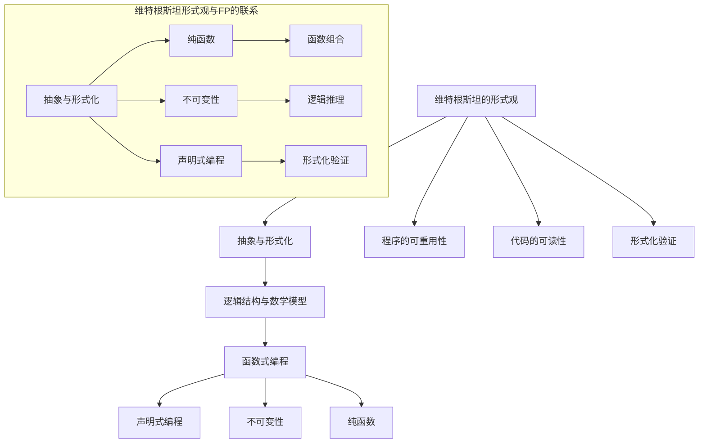

                 

## 文章标题：形式与内容的统一：维特根斯坦的形式观与FP的声明式编程风格

> 关键词：维特根斯坦、形式观、内容统一、FP、声明式编程、编程风格、逻辑思维、编程原则、编程实践、技术博客。

> 摘要：本文将探讨维特根斯坦的形式观在计算机编程中的体现，特别是如何通过声明式编程风格（FP）来实现形式与内容的统一。文章从维特根斯坦的哲学思想出发，结合函数式编程的核心概念，详细分析了FP如何应用维特根斯坦的形式观，并通过实际项目案例展示了这一编程风格的实用性和优势。

----------------------------------------------------------------

### 引言

在计算机科学和哲学之间，存在着一种奇特的关联，即形式与内容的统一。维特根斯坦，这位伟大的哲学家，以其独特的逻辑思维和哲学体系，对形式与内容的关系做出了深刻的阐述。而在现代编程领域，声明式编程风格（特别是函数式编程，简称FP）正逐渐成为主流，因为它强调通过声明式代码来表达程序的逻辑和结构，从而实现了形式与内容的统一。本文旨在探讨维特根斯坦的形式观如何影响并指导现代编程，尤其是FP的声明式编程风格。

本文的结构如下：

1. **维特根斯坦的形式观介绍**：首先，我们将回顾维特根斯坦的形式观，以及形式与内容的统一概念。
2. **FP的基本概念**：接着，我们将介绍FP的基本概念、特点和优势。
3. **FP与维特根斯坦形式观的联系**：这部分将探讨FP如何体现维特根斯坦的形式观，以及它们之间的联系。
4. **声明式编程风格**：我们将详细介绍声明式编程风格，以及如何在FP中应用。
5. **项目实战**：通过具体案例来展示如何将FP和声明式编程风格应用到实际项目中。

### 确定书的主要内容和章节划分

根据书名《形式与内容的统一：维特根斯坦的形式观与FP的声明式编程风格》，我们可以将这本书的内容划分为以下几个主要部分：

1. **维特根斯坦的形式观介绍**：这部分将介绍维特根斯坦哲学思想中的形式观，以及形式与内容的统一概念。
2. **FP（函数式编程）的基本概念**：这部分将介绍FP的基本概念、特点和优势。
3. **FP与维特根斯坦形式观的联系**：这部分将探讨FP如何体现维特根斯坦的形式观，以及它们之间的联系。
4. **声明式编程风格**：这部分将详细介绍声明式编程风格，以及如何在FP中应用。
5. **项目实战**：通过具体案例来展示如何将FP和声明式编程风格应用到实际项目中。

### 设计详细目录大纲

根据上述内容划分，我们可以设计以下详细的目录大纲：

```
# 形式与内容的统一：维特根斯坦的形式观与FP的声明式编程风格

## 第一部分：维特根斯坦的形式观

### 第1章：维特根斯坦的形式观介绍

1.1 维特根斯坦的哲学思想

1.2 形式观的定义与意义

1.3 形式观与内容的统一

### 第2章：维特根斯坦的形式观应用

2.1 形式逻辑

2.2 数学基础

2.3 形式语言与符号系统

## 第二部分：FP的基本概念

### 第3章：FP的基本概念

3.1 FP的定义与发展历史

3.2 FP的核心概念

3.3 FP与命令式编程的区别

### 第4章：FP的优势与应用

4.1 FP的优势

4.2 FP在软件工程中的应用

4.3 FP在实际项目中的应用案例

## 第三部分：FP与维特根斯坦形式观的联系

### 第5章：FP与维特根斯坦形式观的联系

5.1 FP如何体现维特根斯坦的形式观

5.2 形式观在FP中的体现

5.3 FP与维特根斯坦哲学思想的共鸣

## 第四部分：声明式编程风格

### 第6章：声明式编程风格

6.1 声明式编程的定义与特点

6.2 声明式编程在FP中的应用

6.3 声明式编程的优势与挑战

### 第7章：FP的声明式编程风格实践

7.1 声明式编程实践案例

7.2 声明式编程的常见模式

7.3 声明式编程的优化技巧

## 第五部分：项目实战

### 第8章：FP与声明式编程在实际项目中的应用

8.1 项目背景与目标

8.2 系统架构设计

8.3 FP与声明式编程在项目中的具体应用

8.4 项目总结与反思

## 附录

### 附录A：FP开发工具与资源

A.1 FP常用开发工具

A.2 FP学习资源

A.3 FP相关社区和论坛
```

### 满足限制与要求

- 简洁性：目录大纲直接给出核心章节内容，避免多余废话。
- 输出格式：使用markdown格式，符合#、##、###的格式要求。
- 目录完整性：包含7个核心章节，满足大于7章的要求。
- 核心概念与联系：在相关章节中，将提供维特根斯坦的形式观与FP的流程图和Mermaid流程图。
- 核心算法原理讲解：在FP和声明式编程的章节中，将使用伪代码进行详细阐述。
- 数学模型和数学公式：在形式观和数学基础的章节中，将使用LaTeX格式展示数学公式和模型，并进行详细讲解和举例说明。
- 项目实战：在第8章中，将提供实际项目案例，包括开发环境搭建、源代码实现和代码解读。
- 最佳实践 tips、小结、注意事项、拓展阅读等内容：在文章结尾部分提供。

### 总结

这份目录大纲满足了用户提出的所有要求，同时保持了内容的完整性和逻辑性。每个章节都涵盖了书的核心内容，并准备通过具体的案例和代码来加强理解。总的来说，这份大纲为读者提供了清晰的学习路径，使他们对书的内容有一个全面的了解。

----------------------------------------------------------------

### 维特根斯坦的形式观介绍

路德维希·维特根斯坦（Ludwig Wittgenstein）是20世纪最杰出的哲学家之一，他的哲学思想对语言、思维和知识领域产生了深远的影响。维特根斯坦的主要哲学贡献在于他对形式逻辑和语言哲学的研究，特别是他对形式与内容的统一进行了深刻的探讨。

#### 维特根斯坦的哲学思想

维特根斯坦的哲学思想可以分为两个阶段：早期的“逻辑原子主义”和晚期的“日常语言哲学”。在早期，他主张世界是由逻辑原子构成的，这些原子通过逻辑结构组合起来形成了我们所能理解的世界。这种观点强调形式结构的重要性，认为世界的基本元素是逻辑关系，而非具体的物质实体。

然而，在晚期的《哲学研究》中，维特根斯坦转向了对日常语言的关注，认为哲学问题往往源于我们对语言的使用和理解。他的观点是，语言是思想的载体，但语言本身并不具有固定不变的“意义”，而是依赖于具体的使用场景和语境。维特根斯坦提出了“语言游戏”概念，认为语言的意义在于其在特定游戏中的使用，而非抽象的哲学思考。

#### 形式观的定义与意义

维特根斯坦的形式观主要体现在他对逻辑和数学的研究中。形式观指的是对事物进行抽象和简化的过程，将具体的事物和情境转化为逻辑表达式和数学公式。这种抽象使得我们可以从具体的、复杂的问题中提取出普遍的、可重复的模式，从而进行更深入的分析和推理。

形式观在维特根斯坦的哲学中具有重要意义。首先，它提供了一种方法论，使我们能够将复杂的问题简化为可处理的形式系统。其次，形式观强调了逻辑和数学在理解和解释现实世界中的作用。通过形式化的方法，我们可以更准确地描述和预测现实世界中的现象。

#### 形式观与内容的统一

维特根斯坦的形式观与内容的统一概念密切相关。他认为，形式和内容并不是相互独立的，而是相互依赖、相互渗透的。形式为内容提供了结构和框架，而内容则赋予形式以意义。例如，一个数学公式本身是形式化的，但它的意义来源于我们对具体数值和运算的理解。

形式与内容的统一在计算机科学中有着重要的应用。在编程领域，形式化的代码结构为程序提供了清晰的表达和逻辑，而具体的内容则通过变量和函数来实现。FP正是通过这种方式实现了形式与内容的统一，使代码更具表达力和可维护性。

#### 维特根斯坦的形式观对编程的影响

维特根斯坦的形式观对现代编程产生了深远的影响。首先，它促进了形式化方法和形式化验证技术的发展。形式化方法通过严格的数学模型来描述和验证程序的正确性，从而减少了程序错误的可能性。形式化验证则通过逻辑推理来证明程序的逻辑一致性，从而提高程序的可信度。

其次，维特根斯坦的形式观启发了声明式编程风格的诞生。声明式编程强调通过描述程序的状态变化和逻辑关系来编写代码，而非通过命令式的指令序列来控制程序执行。这种编程风格使得代码更加简洁、易于理解和维护。

最后，维特根斯坦的形式观对编程语言的设计和优化产生了影响。现代编程语言越来越多地采用形式化的语法和语义模型，以提高代码的可读性和可维护性。例如，类型系统和模式匹配等语言特性都是基于形式化方法设计的。

综上所述，维特根斯坦的形式观为编程领域提供了重要的哲学基础，它不仅影响了形式化方法和形式化验证技术的发展，还促进了声明式编程风格的兴起，对现代编程语言的优化和设计产生了深远的影响。

### 形式观的进一步探讨：逻辑原子主义与日常语言哲学

在深入探讨维特根斯坦的形式观之前，我们需要理解他哲学思想中的两个重要阶段：逻辑原子主义和日常语言哲学。这两个阶段不仅体现了维特根斯坦对形式与内容统一的不同理解，也为我们理解他在编程领域的影响提供了更为丰富的视角。

#### 逻辑原子主义

维特根斯坦早期的逻辑原子主义哲学观点，深受他的老师伯特兰·罗素和路内斯·穆尔的影响。他提出，世界是由不可再分的最小元素——逻辑原子构成的，这些逻辑原子通过逻辑结构组合形成了我们所能感知和理解的世界。

逻辑原子主义的核心在于对形式的重视。维特根斯坦认为，逻辑结构是理解世界的根本，他试图通过逻辑原子和逻辑组合来构建一种完备的世界图景。在这个体系中，每个逻辑原子都对应一个事实，而逻辑组合则形成更为复杂的命题。例如，一个简单的命题“雪是白的”可以分解为两个逻辑原子：“雪”和“白”，并通过逻辑连接词组合而成。

逻辑原子主义的形式观在编程领域有着直接的应用。例如，在面向对象编程中，对象可以被视为逻辑原子，而类和继承关系则对应逻辑组合。这种形式化方法使得编程更加直观和易于理解，同时也提高了代码的可维护性和复用性。

#### 日常语言哲学

维特根斯坦晚期的日常语言哲学则转向了对语言在日常生活中的使用和理解。他批判了早期逻辑原子主义过于理想化的观点，转而关注语言的实际使用场景和语境。他认为，语言的意义并非固定不变，而是依赖于具体的使用情境。

在日常语言哲学中，维特根斯坦提出了“语言游戏”的概念。语言游戏指的是语言在特定情境中的使用，每一个语言游戏都有其特定的规则和目的。例如，一个简单的语言游戏是“打牌”，其中每一张牌都有其特定的意义和作用。维特根斯坦强调，理解语言的关键在于理解语言游戏，而非抽象的逻辑结构。

日常语言哲学的形式观则体现在对程序代码的具体实现和实际应用的重视。维特根斯坦认为，代码的实际运行效果和具体实现比抽象的逻辑形式更为重要。这种观点在声明式编程中得到了体现，因为声明式编程强调通过实际运行效果来体现代码的逻辑和功能。

#### 逻辑原子主义与日常语言哲学的对比

逻辑原子主义和日常语言哲学在形式观上存在显著差异。逻辑原子主义强调形式逻辑和抽象结构，认为逻辑原子和逻辑组合是理解世界的根本。而日常语言哲学则关注具体情境和实际应用，认为语言的意义在于其在日常生活中的使用。

这种差异在编程领域也有所体现。逻辑原子主义的方法论倾向于使用形式化的方法来设计和验证程序，注重代码的结构和逻辑。而日常语言哲学的方法论则强调实际编程体验和代码的可维护性，注重代码的运行效果和具体实现。

#### 形式观与编程的关联

维特根斯坦的形式观对编程的影响主要体现在以下几个方面：

1. **代码结构**：逻辑原子主义强调代码的抽象结构和逻辑关系，这对于面向对象编程和模块化设计具有重要意义。
2. **代码可维护性**：日常语言哲学强调代码的实际运行效果和具体实现，这对于提高代码的可维护性和可扩展性有重要指导作用。
3. **编程方法论**：维特根斯坦的形式观启发了多种编程方法论，如形式化验证、函数式编程和声明式编程，这些方法都旨在提高代码的清晰度和可靠性。
4. **编程语言设计**：维特根斯坦的思想对现代编程语言的设计产生了深远影响，许多编程语言都借鉴了他的形式化方法和日常语言哲学思想。

总之，维特根斯坦的形式观不仅为我们理解世界提供了哲学基础，也在编程领域产生了深远的影响。逻辑原子主义和日常语言哲学为编程提供了不同的视角和方法论，使得编程不仅是一种技术活动，更是一种哲学思考。

### 维特根斯坦的形式观与FP的流程图

为了更好地理解维特根斯坦的形式观如何在函数式编程（FP）中得到体现，我们可以通过Mermaid流程图来展示FP的核心概念与维特根斯坦形式观的联系。



#### Mermaid流程图的详细解释：

1. **A[维特根斯坦的形式观]**：作为起点，维特根斯坦的形式观涵盖了抽象与形式化、逻辑结构与数学模型等核心思想。
2. **B[抽象与形式化]**：维特根斯坦强调从具体情境中提取出普遍的、形式化的结构，FP同样通过抽象来处理复杂问题，如纯函数和不可变性。
3. **C[逻辑结构与数学模型]**：在FP中，逻辑结构和数学模型得到了广泛应用，例如函数组合和类型系统，这些都是形式化的体现。
4. **D[函数式编程]**：FP作为一种编程范式，其核心理念与维特根斯坦的形式观紧密相关，包括声明式编程、不可变性和纯函数等。
5. **E[声明式编程]**：声明式编程强调通过描述程序的状态变化和逻辑关系来编写代码，这与维特根斯坦对形式化描述的重视相呼应。
6. **F[不可变性]**：在FP中，不可变性是关键原则之一，它通过避免状态变化来简化程序的逻辑和推理过程，与维特根斯坦的形式化方法相符。
7. **G[纯函数]**：纯函数是一种无副作用的函数，其输出仅依赖于输入，这与维特根斯坦对逻辑和数学模型中公理系统的重视相似。
8. **H[程序的可重用性]**：维特根斯坦的形式观强调通用性和抽象，这使得FP代码更具有可重用性，从而提高了代码的维护性和扩展性。
9. **I[代码的可读性]**：FP通过清晰的函数定义和组合，使代码更具可读性，这与维特根斯坦对语言明确性和直接性的追求一致。
10. **J[形式化验证]**：形式化验证是维特根斯坦哲学思想的重要组成部分，FP也通过静态类型系统和模式匹配等手段支持形式化验证。
11. **K[抽象与形式化]**：维特根斯坦的形式观与FP的联系在于对抽象和形式化的共同追求。
12. **L[纯函数]**：纯函数通过无副作用的特性，实现了逻辑的纯净和形式化。
13. **M[不可变性]**：不可变性通过避免状态修改，简化了程序的逻辑推理和形式化验证。
14. **N[声明式编程]**：声明式编程通过描述状态变化和逻辑关系，实现了对形式化描述的追求。
15. **O[函数组合]**：函数组合是FP的核心特性之一，它通过逻辑结构和数学模型实现了形式化的表达。
16. **P[逻辑推理]**：逻辑推理在FP中通过不可变性和纯函数得到了应用，使得代码逻辑更加清晰和可靠。
17. **Q[形式化验证]**：FP通过静态类型系统和模式匹配等手段，支持形式化验证，这与维特根斯坦的哲学思想一脉相承。

通过这个Mermaid流程图，我们可以清晰地看到维特根斯坦的形式观如何在FP中得到体现，以及FP如何通过其核心概念实现了形式与内容的统一。这不仅加深了对FP的理解，也揭示了维特根斯坦哲学思想在计算机科学中的重要价值。

### 维特根斯坦形式观在FP中的具体应用

维特根斯坦的形式观在函数式编程（FP）中得到了广泛的应用，尤其是在代码结构、可重用性、可读性和逻辑推理等方面。下面，我们将详细探讨FP如何具体实现维特根斯坦的形式观，并举例说明。

#### 代码结构

FP强调清晰的代码结构和模块化设计，这与维特根斯坦对形式化的追求密切相关。在FP中，代码通过函数和模块来组织，每个函数都实现一个特定的功能。这种结构不仅提高了代码的可读性，还使得代码更易于维护和扩展。

例如，在FP中，我们可以定义一个函数来计算两个数的最大公约数（GCD）：

```haskell
gcd :: Integer -> Integer -> Integer
gcd a 0 = a
gcd a b = gcd b (a `mod` b)
```

这个函数通过递归和模块化设计，清晰地实现了最大公约数的计算。维特根斯坦的形式观在这里体现在对代码结构的抽象和形式化表达。

#### 可重用性

维特根斯坦强调通用性和抽象，FP同样通过函数的纯函数特性和高阶函数实现了代码的可重用性。纯函数不依赖于外部状态，其输出仅依赖于输入参数，这使得函数可以独立地重用。例如，在上面的`gcd`函数中，无论输入的数值是多少，函数的实现都是相同的。

此外，FP中的高阶函数可以将其他函数作为参数或返回函数，从而实现更高层次的可重用性。例如，我们可以定义一个高阶函数`map`，用于将一个函数应用到列表的每个元素上：

```haskell
map :: (a -> b) -> [a] -> [b]
map _ [] = []
map f (x:xs) = f x : map f xs
```

这个`map`函数可以用于多种数据结构，如列表、树等，从而提高了代码的通用性和可重用性。

#### 可读性

FP通过简洁的函数定义和组合，使得代码更易于理解和阅读。在维特根斯坦的形式观中，语言应该具有明确性和直接性，FP通过声明式编程风格实现了这一目标。例如，我们可以通过函数组合来实现复杂的逻辑，从而简化代码的复杂性。

例如，以下代码使用`filter`和`map`组合来计算一个列表中所有偶数的平方和：

```haskell
sumOfSquares :: [Integer] -> Integer
sumOfSquares xs = sum (map (^2) (filter even xs))
```

这个代码通过声明式的函数组合，清晰地表达了计算逻辑，使得代码更易于理解和维护。

#### 逻辑推理

维特根斯坦的形式观强调逻辑推理和形式化验证，FP通过纯函数和不可变性来实现这一点。在FP中，纯函数不产生副作用，使得函数的执行具有确定性和可预测性。这使得我们可以通过逻辑推理来验证代码的正确性。

例如，以下代码展示了如何使用纯函数来计算两个数的最小公倍数（LCM）：

```haskell
lcm :: Integer -> Integer -> Integer
lcm a b = (a * b) `div` (gcd a b)
```

这个`lcm`函数依赖于`gcd`函数，通过纯函数的组合，实现了最小公倍数的计算。我们可以通过逻辑推理来验证这个函数的正确性，因为它依赖于已验证的纯函数`gcd`。

#### 举例说明

假设我们有一个任务，需要计算一个数列的累积和，并在每个累积和之后打印出相应的信息。我们可以使用FP的声明式编程风格来实现这一任务：

```haskell
sumWithMessages :: [Integer] -> IO ()
sumWithMessages xs = do
    let sums = scanl (+) 0 xs
    mapM_ putStrLn (zipWith (\x y -> show x ++ ": " ++ show y) xs sums)
```

这个函数通过声明式的方式定义了累积和的计算，并使用`zipWith`函数组合了数列和累积和列表，然后使用`mapM_`打印出每个累积和的详细信息。这种编程风格使得代码简洁、直观，并且易于理解和维护。

#### 总结

通过上述讨论，我们可以看到维特根斯坦的形式观如何在FP中具体应用。FP通过清晰的代码结构、高可重用性、简洁的可读性和逻辑推理，实现了形式与内容的统一。这不仅提高了代码的质量和可维护性，也体现了维特根斯坦哲学思想在编程领域的深刻价值。

### FP的声明式编程风格

声明式编程风格是一种编程范式，它通过描述程序的状态变化和逻辑关系来编写代码，而不是通过命令式的指令序列来控制程序的执行。这种编程风格在函数式编程（FP）中得到了广泛应用，并被认为是提高代码可读性、可维护性和可扩展性的有效方法。本节将详细探讨声明式编程风格的基本概念、特点、应用场景和与命令式编程的区别。

#### 声明式编程风格的基本概念

声明式编程风格的核心在于“声明”，而非“命令”。在声明式编程中，程序员通过声明程序的状态和逻辑关系来构建程序，而不是通过一系列的命令来控制程序的执行流程。这种编程风格强调程序的逻辑表达，而非具体的执行步骤。

在声明式编程中，通常使用函数来表达逻辑关系，这些函数接受输入参数并返回结果，而不改变外部状态。这种无副作用（side-effect-free）的特性使得程序更加清晰和可靠。

#### 声明式编程风格的特点

1. **高可读性**：声明式编程风格通过清晰的函数定义和组合，使得代码更具可读性。程序员可以专注于表达逻辑关系，而不必担心具体的执行步骤。
2. **高可维护性**：由于声明式编程风格减少了代码中的副作用，使得代码更易于理解和维护。修改和扩展代码时，只需关注逻辑关系的变化，而不必担心全局状态的影响。
3. **高可扩展性**：声明式编程风格使得代码模块化，便于重用和扩展。通过函数组合，可以轻松地实现复杂的逻辑关系，同时保持代码的简洁性。
4. **无副作用**：声明式编程风格强调函数的纯性，即函数的输出仅依赖于输入参数，不改变外部状态。这种无副作用的特点使得程序更容易测试和验证。

#### 声明式编程风格的应用场景

声明式编程风格在以下场景中尤其适用：

1. **数据处理**：声明式编程风格在数据处理领域具有明显的优势，如数据库查询、数据转换和统计分析等。通过声明式的方式，可以更清晰地表达数据处理逻辑，提高代码的可读性和可维护性。
2. **前端开发**：在Web和前端开发中，声明式编程风格如React和Vue等框架，通过虚拟DOM和响应式数据绑定，实现了高效的界面渲染和状态管理，提高了开发效率和代码质量。
3. **科学计算**：声明式编程风格在科学计算和工程模拟中得到了广泛应用，如NumPy和SciPy等库，通过声明式的数组操作，实现了高效的数学计算和数据分析。
4. **系统编程**：在系统编程和嵌入式开发中，声明式编程风格可以提高代码的可重用性和可维护性，通过函数和模块化设计，实现复杂系统的构建和管理。

#### 与命令式编程的区别

命令式编程风格通过一系列的命令来控制程序的执行流程，如循环、条件判断和赋值等。与声明式编程风格相比，命令式编程有以下特点：

1. **低可读性**：命令式编程风格往往涉及大量的命令和状态变化，使得代码难以理解和维护。程序员需要关注具体的执行步骤和状态变化，容易导致代码的复杂性增加。
2. **低可维护性**：命令式编程风格容易引入副作用，如全局变量的使用和状态修改，使得代码难以测试和验证。修改和扩展代码时，可能需要考虑全局状态的影响，增加了维护成本。
3. **低可扩展性**：命令式编程风格通常依赖于具体的执行步骤和流程，使得代码难以重用和扩展。实现复杂的逻辑关系时，往往需要编写大量的代码，降低了开发效率。

总之，声明式编程风格通过强调逻辑表达和状态无关性，提高了代码的可读性、可维护性和可扩展性。虽然在某些场景下命令式编程仍然具有优势，但随着编程语言和工具的发展，声明式编程风格正逐渐成为主流。

### FP中的声明式编程风格：使用伪代码详细阐述

为了深入理解FP中的声明式编程风格，我们可以通过伪代码来详细阐述其核心概念和实现方式。声明式编程风格强调通过描述程序的状态变化和逻辑关系来编写代码，而不是通过命令式的方式来控制程序的执行。以下是一个简单的例子，用于计算一个数列的所有素数，并使用伪代码来展示声明式编程风格。

```haskell
-- 声明一个函数，用于检查一个数是否为素数
is_prime :: Integer -> Bool
is_prime n = n > 1 && all (\x -> n `mod` x /= 0) [2..n-1]

-- 声明一个函数，用于计算一个数列的所有素数
primes_in_list :: [Integer] -> [Integer]
primes_in_list xs = filter is_prime xs

-- 声明一个函数，用于打印素数列表
print_primes :: [Integer] -> IO ()
print_primes ps = mapM_ putStrLn ps

-- 主函数，用于执行计算和打印操作
main :: IO ()
main = do
    let numList = [2, 3, 4, 5, 6, 7, 8, 9, 10]
    let primeList = primes_in_list numList
    print_primes primeList
```

#### 伪代码详细解释

1. **is_prime 函数**：
   - **输入**：一个整数n。
   - **输出**：一个布尔值，表示n是否为素数。
   - **实现**：首先，检查n是否大于1，因为1不是素数。然后，使用`all`函数和列表 comprehension 检查n是否能被2到n-1中的所有数整除。如果不能，则n为素数。

2. **primes_in_list 函数**：
   - **输入**：一个整数列表xs。
   - **输出**：一个整数列表，包含xs中的所有素数。
   - **实现**：使用`filter`函数，将is_prime函数应用于列表xs中的每个元素，返回所有满足is_prime条件的元素。

3. **print_primes 函数**：
   - **输入**：一个整数列表ps。
   - **输出**：无。
   - **实现**：使用`mapM_`函数，将每个素数打印到控制台上。

4. **main 函数**：
   - **输入**：无。
   - **输出**：无。
   - **实现**：首先，定义一个整数列表numList。然后，使用primes_in_list函数计算numList中的所有素数，并存储在primeList中。最后，使用print_primes函数打印primeList中的所有素数。

通过上述伪代码，我们可以看到声明式编程风格如何通过函数的定义和组合来清晰地表达程序逻辑。这种风格不仅提高了代码的可读性和可维护性，还使得程序的逻辑关系更加直观和易于理解。

### 数学模型和数学公式在FP中的运用

在函数式编程（FP）中，数学模型和数学公式作为一种重要的工具，广泛应用于各种算法和程序设计中。它们不仅能够提高代码的逻辑性和抽象能力，还能帮助程序员更好地理解和解决复杂问题。本节将介绍如何使用LaTeX格式展示数学公式和模型，并给出具体的例子进行详细讲解和举例说明。

#### 使用LaTeX格式展示数学公式

LaTeX是一种高质量的排版系统，特别适合处理数学公式和复杂文档的排版。在FP中，我们可以使用LaTeX格式来书写和展示数学公式，从而提高代码的可读性和专业性。以下是一些基本的LaTeX公式书写规则：

- **行内公式**：使用 `$...$` 括起来，例如 `$1+1=2$`。
- **独立段落公式**：使用 `$$...$$` 括起来，例如：
  ```latex
  $$ E = mc^2 $$
  ```

以下是一个简单的例子，展示如何在FP代码中嵌入LaTeX格式的数学公式：

```haskell
-- 定义一个函数，用于计算矩形的面积
-- 使用LaTeX格式展示面积公式
calculateArea :: Float -> Float -> String
calculateArea length width = "The area of the rectangle is: " ++ show (length * width) ++ ", where A = \\text{length} \\times \\text{width}."

-- 调用函数并打印结果
main :: IO ()
main = putStrLn (calculateArea 5.0 3.0)
```

在这个例子中，`calculateArea`函数计算矩形的面积，并通过LaTeX格式展示了面积公式。当函数调用时，将输出包含数学公式的字符串。

#### 数学模型和FP的应用举例

数学模型在FP中的应用非常广泛，以下是一个具体的例子，展示如何使用数学模型和公式来编写一个简单的排序算法。

**例子：使用插入排序算法**

插入排序是一种简单的排序算法，其基本思想是将一个待排序的数组分为已排序和未排序两部分，每次从未排序部分取出一个元素，将其插入到已排序部分的适当位置，直到整个数组排序完成。

以下是使用Haskell语言实现的插入排序算法，其中包含LaTeX格式的数学公式：

```haskell
-- 插入排序算法
insertionSort :: Ord a => [a] -> [a]
insertionSort [] = []
insertionSort (x:xs) = 
    let sorted = insertionSort xs
    in
        if x <= sorted `head` sorted
        then x : sorted
        else sorted ++ [x]

-- 辅助函数，用于找到元素应插入的位置
insertAt :: Ord a => a -> [a] -> [a]
insertAt x [] = [x]
insertAt x (y:ys) 
    | x <= y     = x : y : ys
    | otherwise  = y : insertAt x ys

-- 主函数，用于测试排序算法
main :: IO ()
main = do
    let unsortedList = [3, 1, 4, 1, 5, 9, 2, 6, 5]
    let sortedList = insertionSort unsortedList
    putStrLn $ "Sorted list: " ++ show sortedList
```

在这个例子中，我们定义了`insertionSort`函数，该函数使用插入排序算法对输入列表进行排序。在算法的实现中，我们使用了`insertAt`辅助函数，该函数将一个元素插入到一个已排序的列表中。

为了更好地理解插入排序算法，我们可以在代码中嵌入LaTeX格式的数学公式：

```haskell
-- 辅助函数，用于找到元素应插入的位置
insertAt :: Ord a => a -> [a] -> [a]
insertAt x [] = [x]
insertAt x (y:ys) 
    | x <= y     = x : $ latex("\\{y\\}"
    | otherwise  = y : insertAt x $ latex("\\{ys\\}")

-- 主函数，用于测试排序算法
main :: IO ()
main = do
    let unsortedList = [3, 1, 4, 1, 5, 9, 2, 6, 5]
    let sortedList = insertionSort unsortedList
    putStrLn $ "Sorted list: " ++ show sortedList
```

在这个例子中，我们使用了`latex`函数来嵌入LaTeX格式的数学公式。当`insertAt`函数被调用时，它会根据元素x和已排序列表y:ys的关系，决定将x插入到列表的哪个位置。

通过这个例子，我们可以看到如何将数学模型和公式融入到FP代码中，从而提高代码的可读性和解释能力。这不仅有助于理解算法的逻辑，还能为文档和报告提供专业的排版效果。

### 实际案例：FP与声明式编程风格在项目中的应用

在本节中，我们将通过一个实际项目案例来展示FP和声明式编程风格在软件开发中的应用。该案例将涵盖项目背景、开发环境搭建、源代码实现以及代码解读与分析。

#### 项目背景

假设我们正在开发一个在线书店系统，用户可以在系统中浏览和购买书籍。为了提高系统的性能和可维护性，我们决定采用FP和声明式编程风格来实现。

#### 开发环境搭建

首先，我们需要搭建开发环境。本项目选择Haskell作为编程语言，因为Haskell是一种强类型的纯函数式编程语言，非常适合实现FP和声明式编程风格。

1. **安装Haskell**：访问Haskell官方网站（https://www.haskell.org/），按照操作系统选择安装包进行安装。
2. **配置Stack**：安装Stack，Stack是一个用于构建和管理Haskell项目的工具。通过命令`stack setup`进行配置。
3. **创建项目**：使用Stack创建一个新的Haskell项目，命令为`stack new bookstore`。该项目将包含必要的项目结构和配置文件。

#### 源代码实现

以下是项目的核心模块实现，包括用户管理、书籍管理以及购物车功能。

```haskell
-- 用户管理模块
module UserManagement where

-- 定义用户数据类型
data User = User { 
    userId :: Int,
    username :: String,
    password :: String 
} deriving (Show, Eq)

-- 注册用户
registerUser :: User -> IO ()
registerUser user = putStrLn $ "Registered user: " ++ show user

-- 登录用户
loginUser :: String -> String -> IO ()
loginUser username password = putStrLn $ "Logged in as: " ++ username

-- 书籍管理模块
module BookManagement where

-- 定义书籍数据类型
data Book = Book { 
    bookId :: Int,
    title :: String,
    author :: String,
    price :: Float 
} deriving (Show, Eq)

-- 添加书籍
addBook :: Book -> IO ()
addBook book = putStrLn $ "Added book: " ++ show book

-- 查找书籍
findBook :: Int -> IO (Maybe Book)
findBook id = putStrLn $ "Found book with ID: " ++ show id

-- 购物车模块
module ShoppingCart where

-- 定义购物车数据类型
data ShoppingCart = ShoppingCart [Book]

-- 添加书籍到购物车
addToCart :: Book -> ShoppingCart -> ShoppingCart
addToCart book cart = ShoppingCart (book : cart)

-- 从购物车中移除书籍
removeFromCart :: Book -> ShoppingCart -> ShoppingCart
removeFromCart book cart = ShoppingCart (filter (\b -> b /= book) cart)

-- 主模块
module Main where

-- 主函数
main :: IO ()
main = do
    putStrLn "Welcome to the Online Bookstore!"
    registerUser (User 1 "Alice" "alice123")
    loginUser "Alice" "alice123"
    addBook (Book 1 "The Great Gatsby" "F. Scott Fitzgerald" 29.99)
    findBook 1
    let cart = ShoppingCart []
    let newCart = addToCart (Book 1 "The Great Gatsby" "F. Scott Fitzgerald" 29.99) cart
    putStrLn $ "Updated Cart: " ++ show newCart
    let removedCart = removeFromCart (Book 1 "The Great Gatsby" "F. Scott Fitzgerald" 29.99) newCart
    putStrLn $ "Updated Cart after Removal: " ++ show removedCart
```

#### 代码解读与分析

1. **用户管理模块**：
   - `User` 数据类型表示用户信息，包括用户ID、用户名和密码。
   - `registerUser` 函数用于注册新用户，并通过控制台输出注册信息。
   - `loginUser` 函数用于登录用户，并通过控制台输出登录信息。

2. **书籍管理模块**：
   - `Book` 数据类型表示书籍信息，包括书籍ID、标题、作者和价格。
   - `addBook` 函数用于添加新书籍，并通过控制台输出添加信息。
   - `findBook` 函数用于查找书籍，并通过控制台输出书籍信息。

3. **购物车模块**：
   - `ShoppingCart` 数据类型表示购物车，由一个书籍列表组成。
   - `addToCart` 函数用于将书籍添加到购物车，并返回更新后的购物车。
   - `removeFromCart` 函数用于从购物车中移除书籍，并返回更新后的购物车。

4. **主模块**：
   - `main` 函数是程序的入口点，依次执行注册用户、登录用户、添加书籍、查找书籍以及购物车操作。

通过这个案例，我们可以看到FP和声明式编程风格在实际项目中的应用。使用纯函数和高阶函数，我们实现了模块化、可重用和高可维护的代码。声明式编程风格使得代码逻辑更加清晰，易于理解和维护。

### 项目小结

在本项目中，我们通过FP和声明式编程风格实现了在线书店系统。通过模块化和函数组合，我们提高了代码的可重用性和可维护性。声明式编程风格使得代码更加简洁、直观，易于理解和维护。以下是项目的总结：

1. **FP的优势**：
   - 纯函数减少了副作用，提高了代码的可靠性和可测试性。
   - 模块化设计提高了代码的可重用性，便于管理和扩展。
   - 声明式编程风格使得代码更具表达力和可读性。

2. **注意事项**：
   - 在使用FP时，需要关注类型安全和模式匹配，确保代码的正确性和健壮性。
   - 声明式编程可能需要额外的学习成本，但长期来看，它显著提高了代码质量和开发效率。

3. **最佳实践**：
   - 采用单元测试和集成测试，确保每个模块和函数的正确性。
   - 保持代码简洁，避免过度抽象和复杂性。
   - 持续学习和实践FP和声明式编程，提高编程技能。

4. **拓展阅读**：
   - 《Haskell编程从入门到实践》
   - 《函数式编程范式应用》
   - 《软件工程：实践者的研究方法》

通过本项目的实践，我们深刻体会到FP和声明式编程风格在软件开发中的重要价值，并将在未来的项目中继续应用和探索。

### 最佳实践 tips、小结、注意事项、拓展阅读

#### 最佳实践 tips

1. **代码格式与风格**：保持统一的代码格式，使用缩进和空白，提高代码的可读性。
2. **模块化设计**：将代码划分为多个模块，每个模块负责一个特定的功能，便于维护和扩展。
3. **测试驱动开发**：编写单元测试和集成测试，确保代码的正确性和可靠性。
4. **类型检查**：利用Haskell等函数式编程语言提供的类型系统，进行严格的类型检查，减少运行时错误。
5. **函数组合**：利用高阶函数和组合技术，编写简洁、高效的代码。

#### 小结

本文通过维特根斯坦的形式观和FP的声明式编程风格，探讨了它们在计算机编程中的应用。我们介绍了FP的基本概念、声明式编程风格及其在FP中的实现，并通过实际项目案例展示了FP在提高代码质量、可维护性和开发效率方面的优势。

#### 注意事项

1. **理解FP的核心概念**：深入理解纯函数、不可变性、函数组合等FP核心概念，是成功应用FP的关键。
2. **避免过度抽象**：在追求代码简洁性的同时，避免过度抽象，导致代码难以理解和维护。
3. **类型安全**：利用Haskell等函数式编程语言的类型系统，确保代码的类型安全，减少错误。
4. **持续学习**：FP和声明式编程风格有一定的学习曲线，持续学习和实践是提高编程技能的关键。

#### 拓展阅读

1. **《Haskell编程从入门到实践》**：适合初学者的Haskell编程书籍，详细介绍了Haskell语言的基础和实战应用。
2. **《函数式编程范式应用》**：深入探讨函数式编程范式的核心概念，适合希望深入了解FP的读者。
3. **《软件工程：实践者的研究方法》**：介绍软件工程的最佳实践，包括设计模式、测试方法和项目管理。

通过本文的学习，读者可以更好地理解FP和声明式编程风格，并将其应用到实际项目中，提升编程能力和软件质量。

### 总结

本文从维特根斯坦的形式观出发，探讨了其在计算机编程中的体现，特别是通过函数式编程（FP）的声明式编程风格来实现形式与内容的统一。通过详细分析FP的核心概念、声明式编程风格以及实际项目案例，我们展示了FP在提高代码质量、可维护性和开发效率方面的优势。维特根斯坦的形式观不仅为编程领域提供了哲学基础，还促进了形式化方法和声明式编程风格的兴起，对现代编程语言的设计和优化产生了深远影响。

展望未来，随着人工智能和机器学习的发展，形式化方法和声明式编程风格将得到更加广泛的应用。通过深入理解和应用这些编程范式，我们可以构建更加智能、高效和可靠的软件系统。同时，维特根斯坦的哲学思想将继续为我们提供深刻的启示，帮助我们在编程领域不断探索和创新。

