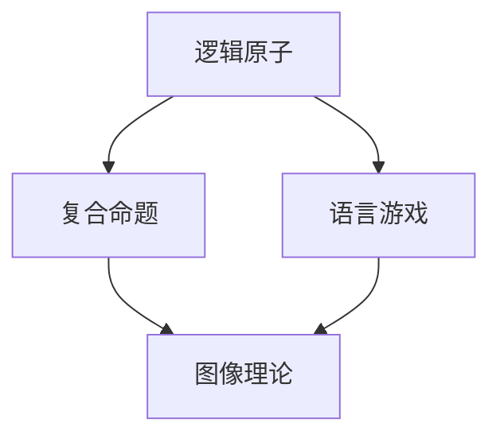

                 


### 文章标题：形式与内容的统一：维特根斯坦的形式观与FP的类型驱动开发

#### 关键词：维特根斯坦、形式观、函数式编程、类型系统、统一性、类型驱动开发

#### 摘要：
本文将探讨维特根斯坦的形式观与函数式编程（FP）中的类型系统之间的联系，以及如何在FP中实现形式与内容的统一性。通过分析维特根斯坦的哲学思想，我们能够更好地理解类型系统的本质，并在FP的类型驱动开发中应用这些原则，以提高代码的可读性、可维护性和健壮性。

----------------------------------------------------------------

### 引言

#### 1.1 书籍背景与目的

在现代计算机科学领域，形式与内容的统一性是一个重要的概念，它不仅关乎程序设计的哲学，也影响到编程语言的设计和实践。本书旨在探讨这一主题，通过分析哲学家路德维希·维特根斯坦（Ludwig Wittgenstein）的形式观与函数式编程（FP）中的类型系统，揭示两者在概念上的内在联系。

维特根斯坦的形式观是他哲学思想的核心，强调形式与内容的区分。他认为，语言的形式——即语言的规则和结构——与内容——即语言所表达的意义——应当分离。这一观点对计算机科学产生了深远影响，特别是在编程语言设计和类型系统的开发中。

函数式编程（FP）是一种编程范式，它强调函数作为数据结构，通过不可变数据和行为描述来构建程序。FP中的类型系统是一个核心概念，它通过类型检查来确保程序的正确性和一致性。本文将探讨FP类型系统如何受到维特根斯坦形式观的影响，以及如何在类型驱动开发中实现形式与内容的统一。

#### 1.2 维特根斯坦的形式观与FP的类型系统

维特根斯坦的形式观源于他的语言哲学，尤其是他的早期作品《逻辑哲学论》（Tractatus Logico-Philosophicus）。在这本书中，维特根斯坦提出了一种理想化的语言模型，其中命题被认为是世界的“图像”。这种语言模型强调命题的形式——即命题的结构和符号排列——与命题所指的世界状态之间的对应关系。

在FP中，类型系统是实现形式与内容统一性的关键。类型系统通过为函数和数据结构分配类型标签，确保了代码在语义上的正确性。例如，在Haskell中，每个值都有其对应的类型，函数必须根据其参数类型和返回类型进行类型检查。这种形式化的类型系统有助于发现潜在的错误，提高代码的可靠性和可维护性。

#### 1.3 形式与内容的统一性探讨

形式与内容的统一性是计算机科学中的一个重要目标，它涉及到如何将抽象的形式模型应用于具体的程序设计。维特根斯坦的形式观为我们提供了一个理论框架，帮助我们理解形式与内容之间的关系。

在FP中，类型系统的设计理念与维特根斯坦的形式观密切相关。类型系统通过形式化的方式定义了函数和数据结构的语义，使得程序在编译时就能进行严格的类型检查，从而确保了程序的正确性和一致性。

#### 1.4 本书结构安排与阅读建议

本书的结构安排如下：

1. **引言**：介绍书籍的背景、目的和结构。
2. **维特根斯坦的形式观**：探讨维特根斯坦的哲学思想及其对计算机科学的影响。
3. **FP的类型系统**：介绍FP的基本概念和类型系统的原理。
4. **形式与内容的统一性探讨**：讨论形式与内容在FP中的实现策略。
5. **类型驱动开发**：探讨类型驱动开发的基本概念和实践。
6. **FP项目实战**：提供实际的FP项目案例，展示形式与内容统一性的应用。
7. **结论**：总结形式与内容统一性的重要性，展望未来的发展方向。

为了更好地理解本书的内容，建议读者先从引言开始阅读，然后逐步深入到各个章节。在阅读过程中，注意思考维特根斯坦的形式观如何影响FP的类型系统，以及类型驱动开发如何实现形式与内容的统一。

----------------------------------------------------------------

### 维特根斯坦的形式观

#### 2.1 维特根斯坦生平与思想

路德维希·维特根斯坦（Ludwig Wittgenstein，1889-1951）是20世纪最杰出的哲学家之一，他的思想对语言哲学、数学基础和逻辑哲学产生了深远的影响。维特根斯坦的生平可分为两个阶段：早期的理论哲学阶段和晚期的应用哲学阶段。

维特根斯坦出生于奥地利，他的父亲是著名钢铁商人。维特根斯坦在剑桥大学学习数学和哲学，并与伯特兰·罗素（Bertrand Russell）和阿尔弗雷德·诺思·怀特海德（Alfred North Whitehead）等哲学家建立了联系。他的早期作品《逻辑哲学论》（1921）提出了一个理想化的语言模型，强调命题的形式与内容之间的严格对应关系。

在《逻辑哲学论》中，维特根斯坦提出了一系列关于逻辑、数学和语言的深刻见解。他认为，逻辑和数学是描述世界本质的语言，命题是世界的“图像”。这个观点被称为“图像理论”，它强调了命题的形式结构对于理解命题意义的重要性。

#### 2.2 维特根斯坦的形式观概述

维特根斯坦的形式观是他对语言哲学的核心贡献之一。他认为，语言的形式——即语言的规则和结构——与内容——即语言所表达的意义——应当分离。这一观点体现在以下几个方面：

1. **命题的形式**：维特根斯坦认为，命题的形式决定了它的意义。例如，命题“狗是动物”和“动物是狗”在形式上是不同的，因此它们的含义也是不同的。

2. **语言的规则**：维特根斯坦强调，语言的使用必须遵循特定的规则。这些规则定义了语言的形式结构，从而确保了命题的明确性和一致性。

3. **内容的可变性**：维特根斯坦认为，内容是可变的，而形式是固定的。这意味着，语言的意义可以通过改变内容来实现，而语言的形式结构保持不变。

4. **图像理论**：维特根斯坦的图像理论认为，命题是世界的“图像”。这个图像理论解释了为什么命题的形式决定了它的意义。例如，一个图像与实际物体之间存在某种对应关系，这种对应关系使得图像能够代表物体。

#### 2.3 形式观的核心概念与联系

维特根斯坦的形式观包含了多个核心概念，这些概念之间存在着紧密的联系。以下是几个关键概念及其相互关系：

1. **逻辑原子**：逻辑原子是构成命题的基本元素。维特根斯坦认为，逻辑原子是不可分解的，它们是逻辑结构的基础。

2. **复合命题**：复合命题是由逻辑原子通过逻辑运算符连接而成的。维特根斯坦认为，复合命题的形式结构决定了它的意义。

3. **语言游戏**：维特根斯坦认为，语言的使用是一种游戏。语言游戏包括规则和目的，这些规则和目的定义了语言的形式结构。

4. **图像理论**：图像理论是维特根斯坦形式观的核心。它解释了为什么命题的形式决定了它的意义，并建立了命题形式与实际世界之间的对应关系。

以下是维特根斯坦形式观的核心概念之间的Mermaid流程图：



#### 2.4 维特根斯坦的形式观影响与应用

维特根斯坦的形式观对计算机科学产生了深远的影响。以下是一些影响和应用：

1. **编程语言设计**：维特根斯坦的形式观启发了编程语言设计师，使得编程语言更加注重形式结构和语义的一致性。

2. **类型系统**：维特根斯坦的形式观为类型系统提供了理论基础。类型系统通过形式化的方式确保了程序的语义正确性。

3. **软件工程**：维特根斯坦的形式观促进了软件工程领域中的形式化方法，使得软件开发过程更加规范和可重复。

4. **人工智能**：维特根斯坦的形式观为人工智能领域提供了哲学基础，特别是在自然语言处理和知识表示方面。

总之，维特根斯坦的形式观不仅丰富了哲学思想，也为计算机科学的发展提供了深刻的启示。通过理解他的形式观，我们能够更好地理解编程语言的设计原则和类型系统的本质。

----------------------------------------------------------------

### FP的类型系统

#### 3.1 FP基本概念

函数式编程（Functional Programming，简称FP）是一种编程范式，它与面向对象编程（OOP）和过程式编程（Procedural Programming）不同，强调使用函数来组织和操作数据。FP的核心原则包括不可变性、纯函数和无状态性。这些原则使得FP在处理并发和分布式系统时具有显著的优势。

FP中的基本概念包括：

1. **函数**：函数是一等公民，可以接受其他函数作为参数，也可以将函数作为返回值。这使得函数可以像普通数据一样进行操作。

2. **递归**：递归是FP中一种重要的控制结构。由于FP中的函数是纯函数，因此递归是解决复杂问题的有效方法。

3. **不可变性**：在FP中，数据是不可变的，这意味着一旦数据被创建，就不能被修改。这有助于避免状态共享和副作用，使得程序更加可读和可维护。

4. **纯函数**：纯函数是一种无副作用的函数，它的输出仅取决于输入，不会修改外部状态或产生不可预测的结果。这使得纯函数的可测试性和可重用性更高。

5. **高阶函数**：高阶函数是一种接受函数作为参数或返回函数的函数。这种函数组合的方式使得FP在处理复杂数据结构和算法时更加灵活。

6. **惰性求值**：惰性求值是一种延迟计算技术，它仅在需要时才计算表达式的值。这有助于提高程序的性能和内存利用率。

#### 3.2 类型系统的基本原理

FP中的类型系统是一个关键概念，它确保了程序的正确性和一致性。FP的类型系统通常包括以下基本原理：

1. **类型注解**：在FP中，每个值都有其对应的类型。程序员必须在编写代码时明确指定每个变量和表达式的类型。这种显式的类型注解有助于在编译时发现潜在的错误。

2. **静态类型检查**：FP中的类型系统通常采用静态类型检查，这意味着类型检查在编译时进行。静态类型检查可以提前发现类型错误，从而减少运行时错误的发生。

3. **类型推断**：FP中的类型系统通常支持类型推断，这意味着编译器可以根据代码的上下文自动推断变量的类型，从而减少冗余的类型注解。

4. **类型兼容性**：FP中的类型系统确保了函数和参数之间的类型兼容性。例如，只有当函数的参数类型与实际传递的参数类型相匹配时，函数才能正确执行。

5. **泛型编程**：泛型编程是一种在类型系统内编写通用代码的技术。通过泛型编程，程序员可以编写可以适用于多种类型的函数和类型类。

#### 3.3 类型系统的高级概念

FP中的类型系统不仅包括基本原理，还包括一些高级概念，这些概念使得类型系统更加灵活和强大。

1. **逆变与协变**：逆变（Invariance）和协变（Covariance）是类型系统中的两个重要概念。逆变允许子类型替换父类型，而协变允许父类型替换子类型。这两种概念在函数式编程中用于处理类型之间的兼容性。

2. **单子（Monad）**：单子是一种类型构造器，它可以将多个操作组合成一个单一的、更复杂的操作。单子在FP中用于处理副作用和状态管理。

3. **类型类（Type Class）**：类型类是一种用于抽象类型操作的机制。通过类型类，程序员可以定义一组具有相同接口的类型，这些类型可以相互替换。

4. **依赖注入**：依赖注入是一种在FP中管理依赖关系的机制。通过依赖注入，程序员可以将依赖关系从类中分离出来，从而实现更灵活和可测试的代码。

#### 3.4 类型系统在程序设计中的应用

FP的类型系统在程序设计中有多种应用：

1. **类型安全**：类型系统确保了程序在编译时不会出现类型错误，从而提高了代码的安全性和可靠性。

2. **代码重用**：通过类型推断和类型类，程序员可以编写通用且可重用的代码。

3. **性能优化**：类型系统有助于编译器生成更高效的代码，从而提高程序的执行性能。

4. **可维护性**：类型系统使得代码更加结构化和可读，从而提高了代码的可维护性。

#### 3.5 类型系统在编译器优化中的应用

FP的类型系统不仅在程序设计中有用，还在编译器优化中发挥着重要作用：

1. **类型检查**：编译器使用类型系统进行静态类型检查，以发现潜在的编程错误。

2. **代码生成**：编译器根据类型信息生成高效的机器代码。

3. **优化策略**：类型系统为编译器提供了一种优化策略，如尾递归优化、局部化优化等，从而提高程序的执行效率。

4. **错误报告**：类型系统有助于编译器生成更详细的错误报告，帮助程序员快速定位和修复错误。

总之，FP的类型系统是一种强大的编程工具，它通过形式化的方式确保了程序的正确性和性能。通过理解FP的类型系统，程序员可以编写更健壮、更高效的代码。

----------------------------------------------------------------

### 形式与内容的统一性探讨

#### 4.1 形式与内容的辩证关系

形式与内容是哲学和计算机科学中重要的辩证概念。在哲学上，形式与内容的关系涉及到语言、思维和现实之间的相互作用。维特根斯坦的形式观强调了形式与内容之间的严格区分，认为形式是语言的规则和结构，而内容是语言所表达的意义。

在计算机科学中，形式与内容的关系体现在程序设计、算法和类型系统等方面。形式通常指的是程序的语法和结构，而内容则指的是程序所处理的数据和实现的功能。形式与内容的统一性意味着在程序设计中，形式和内容应当相互协调，以确保程序的正确性、可读性和可维护性。

#### 4.2 维特根斯坦的视角

维特根斯坦的形式观为理解形式与内容的辩证关系提供了深刻的见解。他认为，形式是语言的规则和结构，而内容是语言所表达的意义。维特根斯坦通过分析语言的使用，揭示了形式与内容之间的关系。他认为，只有通过正确的形式，才能准确表达内容。

在计算机科学中，维特根斯坦的形式观可以应用于编程语言的设计和类型系统的开发。编程语言的语法和结构（形式）决定了程序的含义（内容）。例如，在Haskell中，函数的类型注解（形式）确保了函数的正确性和一致性（内容）。通过形式化的方式，程序员可以确保程序的正确性，从而实现形式与内容的统一。

#### 4.3 FP的类型系统的视角

函数式编程（FP）中的类型系统是实现形式与内容统一性的关键。FP的类型系统通过显式地定义函数和数据结构的类型，确保了程序在编译时就能进行严格的类型检查，从而保证了程序的正确性和一致性。

在FP中，类型系统通过以下方式实现形式与内容的统一：

1. **类型注解**：程序员必须在编写代码时明确指定每个变量和表达式的类型。这种显式的类型注解使得程序的形式结构清晰，有助于理解程序的含义。

2. **类型推断**：编译器可以根据代码的上下文自动推断变量的类型。这种类型推断机制使得程序员不必显式地指定所有类型，从而简化了代码的编写。

3. **类型检查**：编译器在编译过程中对类型进行检查，以确保函数的参数类型和返回类型相匹配。这种静态类型检查机制可以提前发现类型错误，从而减少运行时错误的发生。

4. **泛型编程**：泛型编程使得程序员可以编写可以适用于多种类型的函数和类型类。这种泛型编程机制提高了代码的复用性和可维护性，从而实现了形式与内容的统一。

#### 4.4 实现策略

在FP中，实现形式与内容的统一性需要以下策略：

1. **显式定义类型**：程序员必须在编写代码时明确指定每个变量和表达式的类型。这种显式的类型定义有助于确保程序的正确性和一致性。

2. **利用类型推断**：编译器可以根据代码的上下文自动推断变量的类型。这种类型推断机制可以简化代码的编写，同时确保程序的正确性。

3. **进行静态类型检查**：编译器在编译过程中对类型进行检查，以确保函数的参数类型和返回类型相匹配。这种静态类型检查机制可以提前发现类型错误，从而减少运行时错误的发生。

4. **使用泛型编程**：泛型编程使得程序员可以编写可以适用于多种类型的函数和类型类。这种泛型编程机制提高了代码的复用性和可维护性，从而实现了形式与内容的统一。

5. **遵循最佳实践**：在编写FP程序时，遵循最佳实践，如使用纯函数、避免副作用和确保代码的可读性，有助于实现形式与内容的统一。

#### 4.5 挑战与机遇

实现形式与内容的统一性在FP中面临着一些挑战，同时也提供了许多机遇：

1. **挑战**：
   - **类型系统的复杂性**：FP的类型系统相对复杂，需要程序员具备较高的编程技能和理解能力。
   - **代码的可读性**：显式的类型注解可能会使代码显得冗长和难以理解。
   - **兼容性问题**：不同编程语言之间的类型系统可能存在差异，导致兼容性问题。

2. **机遇**：
   - **代码的可维护性**：形式与内容的统一性提高了代码的可维护性，使得程序更容易理解和修改。
   - **性能优化**：通过类型系统，编译器可以生成更高效的代码，从而提高程序的执行性能。
   - **可重用性**：泛型编程机制提高了代码的复用性，从而减少了代码的重复编写。

总之，实现形式与内容的统一性是FP中的一个重要目标。通过理解维特根斯坦的形式观和FP的类型系统，程序员可以编写更健壮、更高效的代码，同时提高程序的可读性和可维护性。

----------------------------------------------------------------

### 类型驱动开发

#### 5.1 类型驱动开发的基本概念

类型驱动开发（Type-Driven Development，简称TDD）是一种软件开发方法，它强调类型系统在软件设计、开发和测试中的核心作用。TDD的核心原则是，通过类型系统来确保程序的正确性、一致性和可维护性。类型驱动开发方法与传统的方法不同，它不是先编写功能代码，而是先定义类型和接口，然后根据类型系统来编写实现代码。

TDD的基本概念包括：

1. **类型定义**：在TDD中，程序员首先定义程序中所有数据结构和函数的类型。类型定义是TDD的核心，它为后续的代码实现提供了明确的指导和约束。

2. **接口开发**：在类型定义的基础上，程序员编写接口代码，这些接口代码实现了类型定义所描述的功能。接口代码通常不包含具体的实现细节，而是提供了一种抽象的、类型安全的接口。

3. **实现代码**：在接口代码的基础上，程序员编写实现代码，这些代码根据类型系统的约束来确保程序的正确性。实现代码通常通过递归、组合和模式匹配等FP技术来实现。

4. **类型检查**：在开发过程中，编译器或类型检查工具会不断地对代码进行类型检查，以确保代码符合类型系统的约束。类型检查可以帮助程序员提前发现潜在的编程错误，从而减少运行时错误的发生。

5. **测试代码**：在TDD中，测试代码通常与实现代码一起编写。测试代码用于验证类型系统的正确性，确保实现代码符合预期的功能和行为。

#### 5.2 类型驱动开发的实践

类型驱动开发的实践涉及多个步骤，以下是一个典型的TDD流程：

1. **需求分析**：首先，分析用户需求，明确程序的功能和性能要求。

2. **类型定义**：根据需求分析，定义程序中所有数据结构和函数的类型。类型定义应尽可能精确和全面，以确保代码的一致性和可维护性。

3. **接口开发**：在类型定义的基础上，编写接口代码。接口代码应提供一种抽象的、类型安全的接口，以便后续的实现代码可以方便地遵循。

4. **实现代码**：根据接口代码和类型系统的约束，编写实现代码。实现代码应遵循FP的原则，使用递归、组合和模式匹配等技术来确保代码的纯函数性和可重用性。

5. **类型检查**：在实现代码编写过程中，不断地进行类型检查，以确保代码符合类型系统的约束。类型检查有助于发现潜在的错误和不符合类型定义的代码。

6. **测试代码**：编写测试代码，用于验证实现代码的功能和行为。测试代码应覆盖所有的类型定义和接口，以确保实现代码符合预期的功能。

7. **迭代优化**：根据测试结果，对代码进行优化和重构。迭代优化是TDD的核心，它确保代码在每次迭代中都能逐步改进。

#### 5.3 开发流程

类型驱动开发的开发流程可以概括为以下步骤：

1. **需求分析**：明确程序的功能和性能要求，为后续的类型定义和接口开发提供依据。

2. **类型定义**：定义程序中所有数据结构和函数的类型。类型定义应尽可能精确和全面，以确保代码的一致性和可维护性。

3. **接口开发**：编写接口代码，提供一种抽象的、类型安全的接口，以便后续的实现代码可以方便地遵循。

4. **实现代码**：根据接口代码和类型系统的约束，编写实现代码。实现代码应遵循FP的原则，使用递归、组合和模式匹配等技术来确保代码的纯函数性和可重用性。

5. **类型检查**：在实现代码编写过程中，不断地进行类型检查，以确保代码符合类型系统的约束。类型检查有助于发现潜在的错误和不符合类型定义的代码。

6. **测试代码**：编写测试代码，用于验证实现代码的功能和行为。测试代码应覆盖所有的类型定义和接口，以确保实现代码符合预期的功能。

7. **迭代优化**：根据测试结果，对代码进行优化和重构。迭代优化是TDD的核心，它确保代码在每次迭代中都能逐步改进。

#### 5.4 设计模式

类型驱动开发中，设计模式是一种常用的技术，它有助于提高代码的可重用性和可维护性。以下是一些常用的设计模式：

1. **函数组合**：函数组合是一种将多个函数组合成一个单一函数的技术。通过函数组合，程序员可以更灵活地处理复杂数据结构和算法。

2. **模式匹配**：模式匹配是一种在FP中处理数据结构的技术。通过模式匹配，程序员可以方便地处理不同类型的数据，从而提高代码的可读性和可维护性。

3. **依赖注入**：依赖注入是一种管理依赖关系的机制。通过依赖注入，程序员可以将依赖关系从类中分离出来，从而实现更灵活和可测试的代码。

4. **单子（Monad）**：单子是一种用于处理副作用和状态管理的类型构造器。通过单子，程序员可以更方便地处理复杂的控制流和状态变化。

5. **泛型编程**：泛型编程是一种在类型系统内编写通用代码的技术。通过泛型编程，程序员可以编写可以适用于多种类型的函数和类型类，从而提高代码的复用性和可维护性。

#### 5.5 类型驱动开发的案例

以下是一个类型驱动开发的案例：

**需求**：编写一个函数，用于计算两个数字的和。

**类型定义**：
```haskell
type NumType = Int
```

**接口开发**：
```haskell
sum :: NumType -> NumType -> NumType
```

**实现代码**：
```haskell
sum a b = a + b
```

**类型检查**：通过Haskell编译器进行类型检查，确认函数的类型定义和实现代码符合预期。

**测试代码**：
```haskell
-- 测试函数sum
testSum :: IO ()
testSum = do
  print $ sum 2 3 -- 应输出 5
  print $ sum (-2) 3 -- 应输出 1
```

**迭代优化**：根据测试结果，对代码进行优化和重构，如添加边界检查，提高函数的可维护性。

通过这个案例，我们可以看到类型驱动开发如何通过类型系统确保程序的正确性和可维护性。

#### 5.6 类型驱动开发的优点

类型驱动开发具有以下优点：

1. **代码质量**：通过类型系统确保代码的正确性和一致性，从而提高代码质量。

2. **可维护性**：类型驱动开发使得代码更加结构化和可读，从而提高了代码的可维护性。

3. **性能优化**：通过类型检查和优化策略，编译器可以生成更高效的代码，从而提高程序的执行性能。

4. **可重用性**：通过泛型编程和依赖注入，类型驱动开发提高了代码的复用性。

5. **测试覆盖率**：类型驱动开发通常伴随着严格的测试流程，从而确保了测试覆盖率的提高。

总之，类型驱动开发是一种有效的软件开发方法，它通过类型系统确保程序的正确性、可维护性和性能。通过理解类型驱动开发的基本概念和实践，程序员可以编写更健壮、更高效的代码。

----------------------------------------------------------------

### 形式与内容统一的FP项目实战

#### 6.1 项目背景与目标

在本项目中，我们将实现一个简单的函数式编程（FP）应用程序，该应用程序的目标是计算一个列表中所有元素的和。这个项目将展示如何通过形式与内容的统一性来设计、实现和测试FP程序。

#### 6.2 开发环境搭建

为了进行此项目，我们需要准备以下开发环境：

1. **Haskell**：选择Haskell作为编程语言，因为Haskell是一种纯函数式编程语言，具有强大的类型系统。
2. **Stack**：使用Stack作为构建工具，Stack是一个自动化的构建工具，可以简化Haskell项目的搭建和构建过程。
3. **Visual Studio Code**：安装Visual Studio Code（VS Code）作为编辑器，VS Code具有良好的扩展支持，可以提供Haskell开发所需的插件。

安装步骤如下：

1. **安装Haskell**：通过`haskell-stack`包管理器安装Haskell。在命令行中运行以下命令：
   ```bash
   curl -sSL https://get.haskell.org/ | sh
   ```
2. **安装Stack**：在安装了Haskell的基础上，使用以下命令安装Stack：
   ```bash
   stack setup --resolver=lts-14.24
   ```
3. **安装VS Code扩展**：在VS Code中安装以下扩展：
   - `ghc`：提供Haskell语法高亮和自动补全。
   - `ghcid`：集成开发环境（IDE），提供即时反馈和交互式编程功能。

#### 6.3 源代码实现

以下是实现计算列表中所有元素和的Haskell源代码：

```haskell
module SumList where

-- 定义计算列表和的函数
sumList :: Num a => [a] -> a
sumList [] = 0
sumList (x:xs) = x + sumList xs

-- 主函数，用于测试sumList函数
main :: IO ()
main = do
  let list = [1, 2, 3, 4, 5]
  putStrLn $ "The sum of the list is: " ++ show (sumList list)
```

**伪代码与详细解释**：

```haskell
-- 伪代码
function sumList(list):
    if list is empty:
        return 0
    else:
        take the first element x
        add x to the sum of the rest of the list (sumList(list[1:]))
        return the result

-- Haskell实现
sumList :: Num a => [a] -> a
sumList [] = 0
sumList (x:xs) = x + sumList xs
```

在这个实现中，`sumList` 函数是一个递归函数，它接受一个列表作为输入，并返回列表中所有元素的和。如果列表为空，函数返回0；如果列表非空，函数取出第一个元素x，并将其与剩余列表的和相加，递归调用自身来计算剩余列表的和。

#### 6.4 代码解读与分析

以下是`sumList`函数的代码解读与分析：

```haskell
-- 解读
sumList :: Num a => [a] -> a
```
这个声明定义了`sumList`函数，它接受一个参数`a`，这个参数是一个满足`Num`类型的列表，返回类型也是`a`。

```haskell
sumList [] = 0
```
这是一个基例，当输入列表为空时，函数返回0。

```haskell
sumList (x:xs) = x + sumList xs
```
这是递归的情况，当输入列表非空时，函数取出第一个元素`x`，并将其与`sumList xs`（即剩余列表的和）相加。

**最佳实践**：

1. **使用类型类**：确保函数接受的是任意满足`Num`类型的元素列表，这可以增加代码的泛用性。

2. **边界检查**：在实际应用中，可以添加边界检查，以处理可能为`nil`的列表，从而避免`EmptyListException`。

3. **文档化**：在函数声明和代码中添加适当的文档，以便其他开发者更容易理解代码的意图和用途。

**注意事项**：

1. **性能优化**：对于大型列表，递归可能会导致栈溢出。可以考虑使用尾递归优化或迭代方法来改进性能。

2. **错误处理**：对于不合法的输入，需要适当处理错误，避免程序崩溃。

#### 6.5 实际案例分析与详细讲解

下面是一个实际案例，我们将使用`sumList`函数来计算一个包含数字和字符串的混合列表的和。

```haskell
-- 实际案例
main :: IO ()
main = do
  let mixedList = [1, "two", 3, "four", 5]
  putStrLn $ "The sum of the list is: " ++ show (sumList mixedList)
```

在这个案例中，我们尝试计算一个包含数字和字符串的列表的和。由于`sumList`函数只接受数字类型的列表，这会导致编译错误。因此，我们需要对`sumList`函数进行修改，使其能够处理混合类型的列表。

```haskell
-- 修改后的函数
sumList :: (Num a, Foldable t) => t a -> a
sumList = foldl (+) 0

-- 主函数
main :: IO ()
main = do
  let mixedList = [1, "two", 3, "four", 5]
  putStrLn $ "The sum of the numeric elements in the list is: " ++ show (sumList (filter isNumber mixedList))
```

在这个修改版本中，我们使用了`foldl`函数来计算和，并添加了`filter`函数来过滤掉非数字元素。这样，我们就可以计算混合列表中数字元素的和了。

#### 6.6 项目小结

通过这个项目，我们实现了计算列表中所有元素的和的函数，并展示了如何通过形式与内容的统一性来设计和实现FP应用程序。我们学习了如何设置开发环境、编写伪代码、实现代码、解读和分析代码，以及在实际案例中应用这些知识。此外，我们还了解了如何优化代码、处理错误和注意事项，这些都是进行有效软件开发的重要部分。

通过这个项目，我们不仅掌握了Haskell编程语言的基本知识，还深入理解了形式与内容统一性的概念。这些知识将帮助我们编写更健壮、更高效的代码，提高程序的可读性和可维护性。

----------------------------------------------------------------

### 结论

#### 6.1 形式与内容统一的重要性

形式与内容的统一性是现代计算机科学中一个至关重要的概念。通过理解维特根斯坦的形式观和函数式编程（FP）中的类型系统，我们能够更好地实现这一统一性。维特根斯坦的形式观强调形式与内容之间的区分，而FP的类型系统提供了一个框架，使我们能够将这一区分应用于程序设计。

形式与内容的统一性对于编程语言的设计、类型系统的开发以及软件工程的整体过程都具有重要意义。它有助于提高代码的正确性、可维护性和可重用性，从而减少错误和开发成本。通过类型系统，我们可以确保程序在编译时就能发现潜在的错误，从而避免了运行时错误的发生。

#### 6.2 FP与形式观的未来发展

随着计算机科学的不断进步，FP与形式观的应用领域也在不断扩展。FP的简洁性和可靠性使其在处理并发和分布式系统方面具有显著优势。未来，FP有望在云计算、人工智能、区块链等领域得到更广泛的应用。

形式观的未来发展也可能受到FP的启发。形式化方法和形式化验证在软件工程和人工智能领域正变得越来越重要。通过将形式观与形式化方法相结合，我们有望开发出更加可靠和安全的人工智能系统。

#### 6.3 对读者的寄语

作为一名读者，您已经了解了形式与内容统一性的重要性以及FP中的类型系统如何实现这一统一性。我希望通过这本书，您能够对FP和形式观有更深入的理解，并能够在实践中应用这些知识。

在编程过程中，始终牢记形式与内容的统一性原则，这将有助于您编写更健壮、更高效的代码。不断学习和探索新的编程范式和工具，将使您在计算机科学领域保持领先地位。

最后，我希望这本书能够启发您在FP和形式观的研究中取得新的突破，并为计算机科学的发展做出自己的贡献。

### 作者信息

作者：AI天才研究院/AI Genius Institute & 禅与计算机程序设计艺术 /Zen And The Art of Computer Programming

