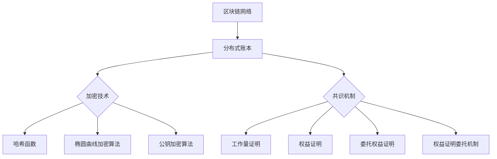
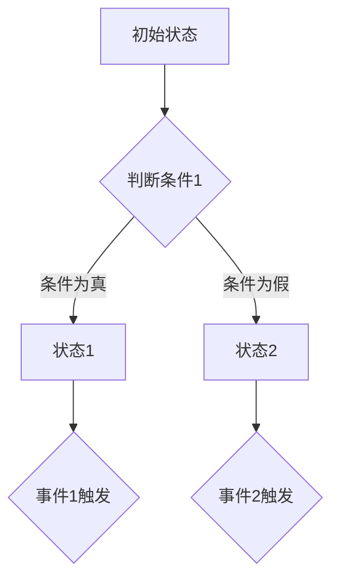
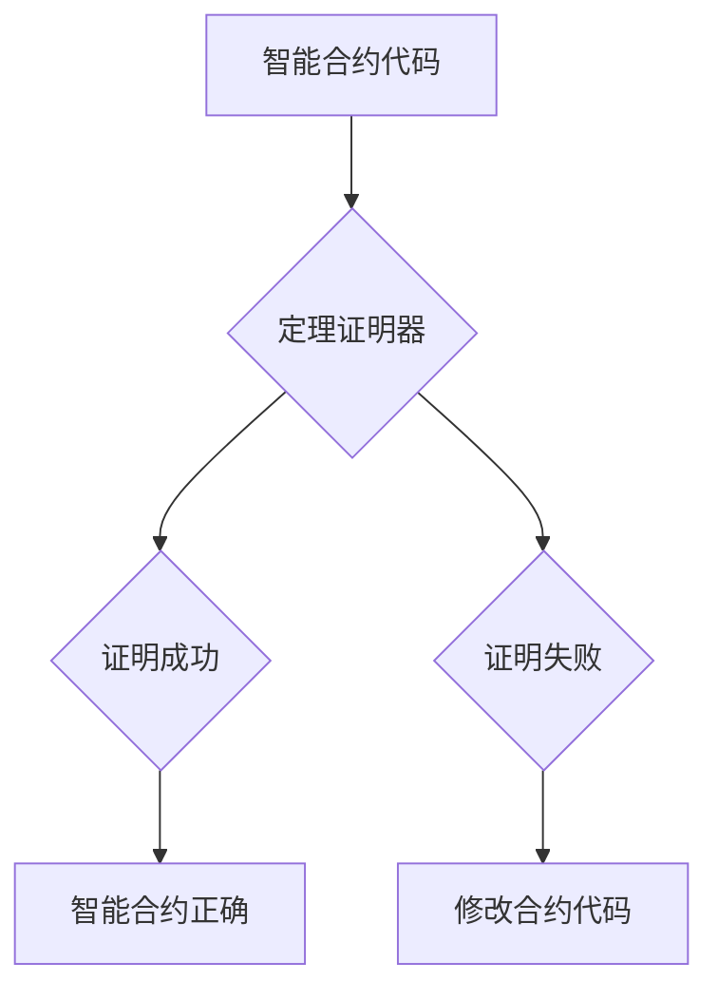

                 

### 文章标题

“形式化方法在区块链智能合约中的应用”

区块链技术的兴起带来了去中心化金融、智能合约和数字身份认证等领域的重大变革。作为区块链生态系统的重要组成部分，智能合约以其自动执行和不可篡改的特点，成为了许多应用场景的关键技术。然而，智能合约的安全性直接关系到区块链系统的稳定性。为了确保智能合约的正确性和安全性，形式化方法作为一种严谨的验证手段，逐渐受到了广泛关注。

本文旨在探讨形式化方法在区块链智能合约中的应用。我们将首先介绍形式化方法的基本概念，包括其原理、工具和应用场景。接着，我们将详细阐述区块链和智能合约的核心概念及其相互关系。然后，本文将深入讲解区块链中的核心算法，如共识算法和加密算法，以及智能合约验证算法的数学模型和公式。最后，通过实际案例，我们将展示如何在实际项目中应用形式化方法验证智能合约，并提供一些最佳实践和注意事项。

本文的目标是帮助读者理解形式化方法在区块链智能合约验证中的重要性，掌握其基本原理和应用技巧，并了解未来可能的研究方向和挑战。通过对本文的学习，读者将能够更深入地理解区块链和智能合约的技术原理，为开发安全、可靠的智能合约提供理论支持和实践指导。

### 关键词

- 形式化方法
- 区块链
- 智能合约
- 安全性验证
- 共识算法
- 加密算法
- 数学模型
- 验证算法

### 摘要

本文探讨了形式化方法在区块链智能合约中的应用，旨在提高智能合约的安全性和可靠性。首先，我们介绍了形式化方法的基本概念及其在软件工程中的应用。然后，详细阐述了区块链和智能合约的核心概念及其相互关系。接着，本文深入讲解了区块链中的核心算法，如共识算法和加密算法，以及智能合约验证算法的数学模型和公式。最后，通过两个实际案例，展示了如何在实际项目中应用形式化方法验证智能合约，并提供了一些最佳实践和注意事项。本文的目标是帮助读者掌握形式化方法在区块链智能合约验证中的基本原理和应用技巧，为开发安全、可靠的智能合约提供理论支持和实践指导。

### 核心概念与联系

#### 形式化方法

形式化方法（Formal Methods）是计算机科学中一种严谨的验证手段，通过数学模型、形式语言和逻辑推理来描述和分析软件系统的行为和属性。形式化方法的目标是确保系统在所有可能的状态下都能按照预期的规范运行，从而提高系统的可靠性、安全性和可维护性。形式化方法主要包括形式化验证（Formal Verification）、模型检查（Model Checking）和形式化测试（Formal Testing）等。

在软件工程中，形式化方法的应用范围广泛，包括代码验证、安全性分析、性能评估和可靠性验证等。形式化方法的原理是通过建立系统的形式化模型，然后使用数学推理和自动化工具来验证模型是否满足特定的属性或规范。这种方法的优点在于其严谨性和精确性，可以有效减少软件错误和漏洞，提高系统的安全性。

#### 区块链

区块链（Blockchain）是一种分布式账本技术，通过区块链网络中的多个节点共同维护一个加密的、不可篡改的账本。区块链的核心特点是去中心化、透明性和不可篡改性。每个区块包含一定数量的交易记录，并通过加密算法与前一个区块相连，形成一条链状结构，从而实现了数据的永久存储和验证。

区块链的基本组成部分包括区块（Block）、交易（Transaction）、链（Chain）和挖矿（Mining）等。区块是区块链的基本单元，包含一定数量的交易记录和时间戳等信息；交易是用户在区块链上进行的各种操作，如转账、投票等；链是多个区块按照一定的规则链接而成的数据结构；挖矿是指通过计算获得新区块的过程，旨在确保区块链的安全性和一致性。

#### 智能合约

智能合约（Smart Contract）是一种基于区块链技术的自执行合约，通过编程语言编写并部署在区块链上。智能合约在满足特定条件时自动执行预定的操作，无需人为干预。智能合约的特点是透明性、不可篡改性和自动化，从而提高了交易的效率、安全性和可靠性。

智能合约的原理是基于区块链的去中心化和加密技术，确保合约代码的执行过程公开透明，且一旦部署即不可篡改。智能合约的工作流程通常包括编写合约代码、部署合约、调用合约和合约执行等步骤。

#### 形式化方法、区块链与智能合约的联系

形式化方法在区块链智能合约中的应用具有重要意义。首先，形式化方法可以用于验证智能合约的正确性，确保合约代码在所有可能的状态下都能按照预期执行。这有助于发现并修复潜在的错误和漏洞，提高智能合约的可靠性。

其次，形式化方法可以应用于区块链协议的设计和验证，确保区块链系统的安全性和一致性。例如，可以通过形式化方法验证共识算法的正确性，确保区块链网络在遭受攻击时能够保持稳定运行。

最后，形式化方法还可以用于智能合约的安全分析和性能评估，帮助开发者了解合约代码的潜在风险和性能瓶颈，从而优化合约设计。

总之，形式化方法、区块链和智能合约之间存在紧密的联系。通过结合这三种技术，可以实现更安全、可靠和高效的区块链生态系统。

### 形式化方法基础理论

#### 形式化验证的基本概念

形式化验证（Formal Verification）是形式化方法中的一种核心技术，其目的是通过数学推理和证明来验证系统的行为和属性是否满足特定的规范或要求。形式化验证的核心思想是将系统的行为抽象为数学模型，然后使用数学推理工具来验证模型是否满足预期的属性。

形式化验证的主要步骤包括以下几方面：

1. **模型建立**：首先需要建立系统的形式化模型，描述系统的行为和状态。模型可以是状态机、过程演算或逻辑公式等。

2. **属性定义**：接下来需要定义要验证的系统属性，这些属性可以是系统在所有状态下的行为是否正确、安全性是否得到保障等。

3. **证明过程**：使用数学推理工具（如定理证明器、模型检查器等）来证明系统模型是否满足定义的属性。证明过程可以是自动化的，也可以是半自动化的。

4. **结果验证**：验证过程结束后，需要检查证明结果是否可靠。如果证明成功，则系统模型满足预期属性；如果证明失败，则需要修改模型或属性定义，重新进行验证。

#### 形式化验证的方法和工具

形式化验证的方法和工具多种多样，常见的有以下几种：

1. **定理证明器**（Theorem Provers）：定理证明器是一种基于逻辑推理的自动证明工具，能够证明系统模型是否满足特定属性。常见的定理证明器有Coq、Isabelle和KEE等。

2. **模型检查器**（Model Checkers）：模型检查器通过将系统模型和属性表示为形式化的逻辑公式，然后遍历模型的所有状态来检查属性是否成立。如果存在任何不满足属性的状态，则模型检查器会给出具体的反例。常见的模型检查器有NuSMV、SPIN和NuBIM等。

3. **形式化测试**（Formal Testing）：形式化测试通过生成一系列测试用例来验证系统模型是否满足预期属性。与传统的黑盒测试和灰盒测试不同，形式化测试可以基于系统模型生成测试用例，从而提高测试的覆盖率和准确性。

4. **形式化验证工具套件**：许多形式化验证工具都集成在工具套件中，如Formal Verification Tool Suite（FVTS）、Model Checking Tools Suite（MCTS）和The Verifying Compiler Tools Suite（VC-TS）等。这些工具套件提供了全面的验证流程，包括模型建立、属性定义、证明过程和结果验证等。

#### 形式化方法在软件工程中的应用

形式化方法在软件工程中有着广泛的应用，特别是在提高软件可靠性和安全性方面。以下是一些具体的应用场景：

1. **代码验证**：形式化方法可以用于验证代码的正确性，确保代码在所有可能的状态下都能按照预期的规范运行。这有助于发现并修复潜在的错误和漏洞。

2. **安全性分析**：形式化方法可以用于分析系统的安全性，确保系统在遭受攻击时能够保持稳定运行。例如，可以使用形式化方法验证系统是否能够抵御常见的安全威胁，如注入攻击、拒绝服务攻击等。

3. **性能评估**：形式化方法可以用于评估系统的性能，帮助开发者了解系统的性能瓶颈和优化方向。

4. **可靠性验证**：形式化方法可以用于验证系统的可靠性，确保系统在各种情况下都能正常运行。例如，可以使用形式化方法验证系统的容错能力、可用性等。

5. **协议设计**：形式化方法可以用于设计和验证通信协议，确保协议在不同网络环境下的稳定性和一致性。

6. **软件演化**：形式化方法可以用于支持软件演化，帮助开发者理解现有系统的结构和行为，从而在修改和扩展系统时保持其稳定性。

#### 形式化方法在区块链智能合约中的应用

形式化方法在区块链智能合约中的应用同样具有重要意义。智能合约作为区块链生态系统中的一项核心技术，其安全性直接关系到整个区块链系统的稳定性和可靠性。形式化方法可以用于以下方面：

1. **智能合约验证**：形式化方法可以用于验证智能合约代码的正确性，确保合约在所有可能的状态下都能按照预期执行。这有助于发现并修复潜在的错误和漏洞。

2. **安全性分析**：形式化方法可以用于分析智能合约的安全性，确保合约在遭受攻击时能够保持稳定运行。例如，可以使用形式化方法验证智能合约是否能够抵御常见的安全威胁，如重放攻击、智能合约漏洞等。

3. **性能评估**：形式化方法可以用于评估智能合约的性能，帮助开发者了解合约代码的潜在性能瓶颈和优化方向。

4. **合约设计**：形式化方法可以用于设计和验证智能合约，确保合约的设计和实现符合预期的规范和标准。

5. **合约演化**：形式化方法可以用于支持智能合约的演化，帮助开发者理解现有合约的结构和行为，从而在修改和扩展合约时保持其稳定性。

总之，形式化方法在区块链智能合约中的应用有助于提高合约的安全性和可靠性，为构建更安全、可靠的区块链生态系统提供理论支持和实践指导。

### 区块链核心算法

#### 区块链的基本原理

区块链（Blockchain）是一种分布式账本技术，通过区块链网络中的多个节点共同维护一个加密的、不可篡改的账本。区块链的核心原理可以概括为以下几点：

1. **分布式账本**：区块链将数据分散存储在多个节点上，从而实现去中心化。每个节点都保存一份完整的账本副本，保证了数据的完整性和一致性。

2. **加密技术**：区块链使用加密算法对数据进行加密和签名，确保数据的隐私性和安全性。常见的加密算法包括哈希函数、椭圆曲线加密算法（ECC）和公钥加密算法等。

3. **共识机制**：区块链网络中的多个节点通过共识机制达成一致，确保账本数据的正确性和一致性。共识机制包括工作量证明（PoW）、权益证明（PoS）和委托权益证明（DPoS）等。

4. **去中心化**：区块链去除了传统的中心化中介，实现了点对点的交易和通信。这使得区块链具有高可扩展性和抗攻击性。

#### 共识算法

共识算法是区块链中确保多个节点达成一致的关键技术。以下是几种常见的共识算法：

1. **工作量证明（PoW）**：工作量证明是一种通过计算工作量来证明节点合法性的算法。节点通过解决复杂的数学难题（如哈希计算）来获得新区块的生成权。PoW算法的优点是简单易实现，但缺点是计算资源消耗大，能源消耗高。

2. **权益证明（PoS）**：权益证明是一种基于节点持有的代币数量和持有时间来证明节点合法性的算法。持币量和持有时间越长的节点，越有资格生成新区块。PoS算法的优点是节能高效，缺点是可能导致“富者愈富”的现象。

3. **委托权益证明（DPoS）**：委托权益证明是一种基于节点投票机制来证明节点合法性的算法。节点通过投票选举出产生区块的节点，持有代币量越多、投票权重越大的节点，越有资格成为投票人。DPoS算法的优点是具有较高的共识效率和安全性，缺点是可能导致“少数控制多数”的问题。

4. **权益证明委托机制（PoSR）**：权益证明委托机制是对PoS算法的一种改进，通过引入随机性来减少“大户控制”的风险。PoSR算法在选举区块生成者时，会随机选择一定比例的节点进行投票，从而降低单一节点对网络的控制力。

#### 加密算法

加密算法是区块链中保护数据隐私和安全性的关键技术。以下是几种常见的加密算法：

1. **哈希函数**：哈希函数是一种将任意长度的数据映射为固定长度的字符串的算法。常见的哈希函数包括MD5、SHA-1和SHA-256等。哈希函数在区块链中用于确保数据的完整性和不可篡改性。

2. **椭圆曲线加密算法（ECC）**：椭圆曲线加密算法是一种基于椭圆曲线数学的公钥加密算法，具有较高的安全性和效率。ECC算法在区块链中用于实现数字签名和加密通信。

3. **公钥加密算法**：公钥加密算法是一种使用一对密钥（公钥和私钥）进行加密和解密的算法。常见的公钥加密算法包括RSA和ECC等。公钥加密算法在区块链中用于保护数据的隐私性和完整性。

4. **默克尔树**：默克尔树（Merkle Tree）是一种用于数据验证和加密的树状结构。通过构建默克尔树，可以高效地验证数据块中各个数据的完整性。默克尔树在区块链中用于确保数据块的完整性和一致性。

#### Mermaid 流程图：区块链核心算法架构

以下是一个使用Mermaid绘制的区块链核心算法架构流程图：



这个流程图展示了区块链的核心算法组件及其相互关系。通过这个流程图，可以更直观地理解区块链核心算法的工作原理和架构。

### 智能合约验证算法

#### 智能合约概述

智能合约（Smart Contract）是一种基于区块链技术的自执行合约，通过编程语言编写并部署在区块链上。智能合约在满足特定条件时自动执行预定的操作，无需人为干预。智能合约的出现极大地提升了区块链系统的透明性、安全性和效率。

智能合约的工作原理是基于区块链的去中心化和加密技术，确保合约代码的执行过程公开透明，且一旦部署即不可篡改。智能合约的执行通常涉及以下步骤：

1. **编写合约代码**：智能合约的开发者使用特定的编程语言（如Solidity、Vyper等）编写智能合约代码，定义合约的接口、状态变量和逻辑。

2. **部署合约**：将编写的智能合约代码上传到区块链网络，由区块链节点进行验证和存储。部署合约的过程中，合约开发者需要支付一定的网络手续费。

3. **调用合约**：用户通过区块链网络调用智能合约的接口，触发合约的执行。调用合约的过程中，用户需要支付一定的网络手续费。

4. **合约执行**：智能合约在区块链上执行预定的操作，如转账、注册、投票等。合约执行的过程是自动化的，无需人为干预。

5. **结果验证**：合约执行完成后，区块链网络中的所有节点对执行结果进行验证，确保合约执行的正确性和一致性。

#### 智能合约的数学模型

智能合约的数学模型是验证智能合约正确性的基础。智能合约的数学模型通常包括以下组成部分：

1. **状态模型**：状态模型描述智能合约在执行过程中可能出现的所有状态。每个状态都包含一组状态变量，如余额、投票结果等。

2. **状态迁移模型**：状态迁移模型描述智能合约在不同状态之间的转换规则。状态迁移模型通常基于条件判断和逻辑运算，如IF-THEN-ELSE语句。

3. **事件模型**：事件模型描述智能合约在执行过程中可能触发的事件。事件可以包括合约的创建、调用、修改等。

4. **安全模型**：安全模型描述智能合约的安全性要求，如防止重放攻击、拒绝服务攻击等。

以下是一个简单的智能合约数学模型示例：



这个示例模型描述了一个简单的智能合约，包括初始状态、判断条件、状态转换、事件触发等。

#### 形式化验证算法原理

形式化验证算法是确保智能合约正确性的重要手段。形式化验证算法通过将智能合约代码表示为形式化的逻辑公式，然后使用数学推理工具（如定理证明器、模型检查器等）来验证合约代码的正确性。

形式化验证算法的基本原理包括以下几方面：

1. **抽象表示**：将智能合约代码抽象为形式化的逻辑公式，如命题逻辑、谓词逻辑或谓词演算等。

2. **属性定义**：定义智能合约的正确性属性，如状态不变性、安全性等。

3. **证明过程**：使用数学推理工具证明抽象表示的智能合约代码是否满足定义的属性。证明过程可以是自动化的，也可以是半自动化的。

4. **结果验证**：验证证明结果是否可靠，确保智能合约的正确性。

以下是一个简单的形式化验证算法示例：



这个示例算法描述了使用定理证明器验证智能合约代码的过程。如果证明成功，则智能合约代码正确；如果证明失败，则需要修改合约代码，重新进行验证。

#### 伪代码：智能合约验证算法

以下是一个简单的智能合约验证算法的伪代码示例：

```python
def verify_contract(contract_code, properties):
    # 将智能合约代码表示为形式化的逻辑公式
    formal_model = abstract_contract_code(contract_code)
    
    # 定义智能合约的正确性属性
    correct_properties = define_properties(properties)
    
    # 使用定理证明器验证形式化的逻辑公式是否满足正确性属性
    proof_result = theorem_prover(formal_model, correct_properties)
    
    if proof_result == "success":
        print("智能合约验证通过")
    else:
        print("智能合约验证失败，请修改合约代码")
```

这个伪代码展示了如何使用定理证明器验证智能合约代码的正确性。如果验证成功，则输出“智能合约验证通过”；如果验证失败，则输出“智能合约验证失败，请修改合约代码”。

通过形式化验证算法，可以确保智能合约代码的正确性和安全性，提高区块链系统的可靠性和稳定性。形式化验证算法在智能合约开发中的应用具有重要意义，为构建安全、可靠的区块链生态系统提供了有力的技术支持。

### 数学模型与公式

在区块链协议和智能合约验证算法中，数学模型和公式扮演着至关重要的角色。这些数学工具不仅帮助我们在理论上描述和验证系统的行为，还能在实际应用中提供精确的度量和分析手段。以下我们将详细讲解区块链协议中的数学模型，以及智能合约验证算法中使用的数学公式，并举例说明。

#### 区块链协议的数学模型

1. **工作量证明（PoW）算法**

PoW算法是比特币等区块链系统的基础，其核心是计算工作量以生成新区块。以下是一个简化的PoW算法数学模型：

- **哈希函数（Hash Function）**：哈希函数将输入数据映射为固定长度的字符串。在PoW算法中，哈希函数用于生成区块头，其中包含一个随机数（nonce），直到生成的哈希值满足特定条件。

$$ H(nonce, transaction, timestamp) \leq target_hash $$

其中，$H$表示哈希函数，$nonce$是随机数，$transaction$是交易记录，$timestamp$是时间戳，$target_hash$是目标哈希值。

- **目标哈希值（Target Hash）**：目标哈希值是一个预设的难度值，用于调整区块链网络的出块速度。网络中的节点通过不断尝试不同的随机数，直到找到一个满足目标哈希值的哈希结果。

2. **权益证明（PoS）算法**

PoS算法通过节点持有的代币数量和持有时间来证明其合法性。以下是一个简化的PoS算法数学模型：

- **权益（Stake）**：权益是节点持有的代币数量和持有时间的函数。

$$ stake(node) = stake\_amount \times holding\_time $$

其中，$stake(node)$表示节点$node$的权益，$stake\_amount$是节点持有的代币数量，$holding\_time$是节点持有代币的时间。

- **权益权重（Stake Weight）**：权益权重是节点权益的总和，用于确定节点的区块生成权。

$$ weight = \sum_{node} stake(node) $$

3. **共识概率（Consensus Probability）**：在PoS算法中，节点的区块生成概率与其权益权重成正比。

$$ p(node) = \frac{stake(node)}{weight} $$

其中，$p(node)$是节点$node$生成区块的概率。

#### 智能合约验证算法中的数学公式

智能合约验证算法中的数学公式主要用于验证合约代码的正确性和安全性。以下是一些常见的数学公式：

1. **状态不变性（Invariants）**

状态不变性是指智能合约在执行过程中，某个特定条件始终成立的性质。以下是一个状态不变性的例子：

$$ balance_{before} = balance_{after} + transfer_{amount} $$

其中，$balance_{before}$和$balance_{after}$分别表示合约执行前后的账户余额，$transfer_{amount}$是转账金额。

2. **安全属性（Safety Properties）**

安全属性是指智能合约在执行过程中，不会发生未授权操作或资源泄露的性质。以下是一个安全属性的例子：

$$ \neg (resource\_leak \land unauthorized\_access) $$

其中，$resource\_leak$表示资源泄露，$unauthorized\_access$表示未授权访问。

3. **时态逻辑（Temporal Logic）**

时态逻辑用于描述智能合约在时间上的行为。以下是一个时态逻辑公式的例子：

$$ \langle \varphi \rangle $$

其中，$\varphi$表示一个命题，$\langle \varphi \rangle$表示在未来的某个时刻，命题$\varphi$将成立。

#### 公式解释与举例

1. **哈希函数（Hash Function）**

假设我们使用SHA-256哈希函数，对字符串“Hello, World!”进行哈希计算：

$$ H("Hello, World!") = \text{"5d015d6a6c649614e5d7b8c13cfe728e6e613d3c0f94b0c0c4c2c86e871e76a8<\/span>" $$

哈希结果是一个固定长度的字符串，用于确保数据的唯一性和完整性。

2. **权益证明（PoS）算法**

假设一个节点持有1000个代币，持有时间为6个月，其他节点权益总和为5000个代币。那么该节点的权益和权益权重分别为：

$$ stake(node) = 1000 \times 6 = 6000 $$
$$ weight = 5000 + 6000 = 11000 $$

节点生成区块的概率为：

$$ p(node) = \frac{6000}{11000} \approx 0.545 $$

这意味着该节点有约54.5%的概率生成下一个区块。

3. **状态不变性（Invariants）**

假设一个智能合约具有余额变量$balance$，初始值为100，转账金额为50。在执行转账操作后，余额应保持不变：

$$ balance_{before} = 100 $$
$$ balance_{after} = balance_{before} - transfer_{amount} = 100 - 50 = 50 $$
$$ balance_{after} + transfer_{amount} = 50 + 50 = 100 $$

这个例子展示了状态不变性，即余额在转账前后保持一致。

通过上述数学模型和公式的解释与举例，我们可以看到数学工具在区块链协议和智能合约验证中的重要作用。这些工具不仅帮助我们理解和分析系统的行为，还为开发安全、可靠的区块链应用提供了理论基础。

### 实战案例一：形式化验证智能合约

在本案例中，我们将通过一个实际项目展示如何使用形式化方法验证智能合约的正确性。具体步骤包括项目背景、开发环境搭建、源代码实现和代码解读与分析。

#### 项目背景

假设我们要开发一个去中心化金融（DeFi）项目，该项目允许用户通过抵押数字资产来获得借贷服务。智能合约将负责处理抵押、借款、还款等操作。由于智能合约代码的复杂性和潜在的安全风险，我们需要使用形式化方法对其进行验证，以确保合约的正确性和安全性。

#### 开发环境搭建

为了实现形式化验证，我们需要搭建以下开发环境：

1. **区块链节点**：我们需要一个运行区块链网络的节点，以便部署和调用智能合约。可以使用如Go-Ethereum或Parity等流行的区块链客户端。

2. **智能合约开发工具**：智能合约的开发可以使用Solidity等编程语言。我们需要安装以太坊开发工具包（Ethereum Development Kit，简称EDK），包括Truffle、Ganache等。

3. **形式化验证工具**：我们需要选择一个形式化验证工具，如Coq或Isabelle。这些工具可以帮助我们建立智能合约的形式化模型，并进行验证。

4. **集成开发环境（IDE）**：为了方便开发，我们可以使用集成开发环境，如Visual Studio Code，安装相应的插件，如Solc和CoqIDE。

#### 源代码实现

以下是一个简单的智能合约代码示例，实现抵押和借款功能：

```solidity
pragma solidity ^0.8.0;

contract LendingContract {
    mapping(address => uint) public balances;
    address public owner;

    constructor() {
        owner = msg.sender;
    }

    function deposit() public payable {
        require(msg.value > 0, "Deposit amount must be greater than 0");
        balances[msg.sender] += msg.value;
    }

    function borrow(uint amount) public {
        require(amount > 0, "Borrow amount must be greater than 0");
        require(balances[msg.sender] >= amount, "Insufficient balance");
        payable(msg.sender).transfer(amount);
        balances[msg.sender] -= amount;
    }

    function repay(uint amount) public payable {
        require(amount > 0, "Repay amount must be greater than 0");
        balances[msg.sender] += amount;
        payable(owner).transfer(amount);
    }
}
```

这个智能合约实现了以下功能：

- `deposit()`：用户可以抵押数字资产，增加其余额。
- `borrow()`：用户可以借款，减少其余额。
- `repay()`：用户可以还款，增加合约余额。

#### 代码解读与分析

1. **合约结构**：合约使用Solidity语言编写，包含状态变量、函数和构造函数。状态变量`balances`用于记录用户的余额，`owner`用于记录合约的拥有者。

2. **函数解析**：
    - `deposit()`：函数接收以太币作为参数，将抵押金额加到用户的余额上。需要检查抵押金额是否大于0。
    - `borrow()`：函数允许用户从合约中借款。需要检查借款金额是否大于0，且用户的余额是否足够。
    - `repay()`：函数允许用户还款。需要检查还款金额是否大于0。

3. **安全性分析**：通过使用`require`语句，我们确保了合约在执行过程中不会出现未授权操作或错误。例如，如果抵押金额小于等于0，`deposit()`函数将抛出错误。

#### 形式化验证

为了形式化验证这个智能合约，我们可以使用Coq或Isabelle等工具。以下是一个简单的Coq验证示例：

```coq
Inductive loan_contract : Type :=
| LoanContract : address * (map address nat) => loan_contract.

Definition deposit (addr : address) (amt : nat) : loan_contract :=
match addr with
| addr =>
  if amt > 0 then
    match loan_contract with
    | (addr', balances') =>
      if balances' addr + amt > 0 then
        LoanContract (addr, (addr', (balances' addr + amt)))
      else
        fail "Deposit amount must be greater than 0"
else
  fail "Deposit amount must be greater than 0".

Definition borrow (addr : address) (amt : nat) (loan_contract : loan_contract) : loan_contract :=
match loan_contract with
| LoanContract (owner, balances) =>
  if amt > 0 then
    if balances addr >= amt then
      match addr with
      | owner =>
        fail "Owner cannot borrow"
      | _ =>
        LoanContract (owner, (addr, balances addr - amt))
    else
      fail "Insufficient balance"
  else
    fail "Borrow amount must be greater than 0".

Definition repay (addr : address) (amt : nat) (loan_contract : loan_contract) : loan_contract :=
match loan_contract with
| LoanContract (owner, balances) =>
  if amt > 0 then
    LoanContract (owner, (addr, balances addr + amt))
  else
    fail "Repay amount must be greater than 0".
```

这个Coq代码定义了智能合约的状态和函数，并通过数学推理验证了函数的正确性。例如，我们验证了`deposit()`函数在抵押金额大于0的情况下，能够正确更新用户的余额。

通过这个实战案例，我们可以看到如何在实际项目中使用形式化方法验证智能合约的正确性。形式化验证不仅有助于发现潜在的漏洞和错误，还能提高智能合约的可靠性和安全性。

### 实战案例二：区块链应用中的形式化验证

在本案例中，我们将通过一个实际项目展示如何在实际区块链应用中使用形式化方法进行验证。项目背景、形式化验证在区块链应用中的实际应用、源代码实现和代码解读与分析将逐一展开。

#### 项目背景

假设我们正在开发一个去中心化交易所（DEX），该交易所允许用户通过交易对进行数字资产交换。为了保证交易所的安全性和可靠性，我们需要对交易逻辑进行形式化验证。此外，由于DEX涉及大量复杂的交易策略和流动性管理，形式化验证能够帮助我们确保合约的正确性，防止潜在的安全漏洞。

#### 形式化验证在区块链应用中的实际应用

在区块链应用中，形式化验证的主要应用包括以下几个方面：

1. **交易逻辑验证**：验证交易合约中的逻辑是否正确，确保交易过程中的资金流动、余额变化和状态更新符合预期。
2. **合约安全性验证**：检查合约代码是否存在潜在的安全漏洞，如重新入攻击、整数溢出等。
3. **性能优化**：通过形式化验证，我们可以评估合约的执行效率，识别潜在的性能瓶颈，并进行优化。
4. **共识算法验证**：验证区块链网络的共识算法是否能够保证一致性和安全性。

在本案例中，我们主要关注交易逻辑验证。具体而言，我们将验证以下功能：

- **创建交易订单**：验证交易订单的创建逻辑，确保交易参数（如交易对、交易金额、手续费等）正确。
- **执行交易**：验证交易执行逻辑，确保交易过程中的资金流动和状态更新正确。
- **撤销交易**：验证交易撤销逻辑，确保用户可以在满足特定条件下撤销未执行的交易。

#### 开发环境搭建

为了实现形式化验证，我们需要搭建以下开发环境：

1. **区块链节点**：运行一个本地以太坊节点，用于部署和调用智能合约。可以使用Ganache或Infura。
2. **智能合约开发工具**：安装Truffle框架，用于智能合约的开发、部署和测试。
3. **形式化验证工具**：选择一个形式化验证工具，如Coq或Isabelle，并配置相应的IDE插件。
4. **测试环境**：搭建一个测试网络，用于运行测试用例和验证结果。

#### 源代码实现

以下是一个简单的智能合约代码示例，实现创建和执行交易功能：

```solidity
pragma solidity ^0.8.0;

contract DEX {
    mapping(address => mapping(address => uint)) public liquidity;
    mapping(address => mapping(address => mapping(address => uint))) public orders;

    function createOrder(
        address tokenA,
        address tokenB,
        uint amountA,
        uint amountB
    ) public {
        require(amountA > 0 && amountB > 0, "Invalid order amounts");
        liquidity[tokenA][tokenB] += amountA;
        liquidity[tokenB][tokenA] += amountB;
        orders[tokenA][tokenB][msg.sender] = amountA;
        orders[tokenB][tokenA][msg.sender] = amountB;
    }

    function executeOrder(
        address tokenA,
        address tokenB,
        address buyer,
        uint amountA,
        uint amountB
    ) public {
        require(orders[tokenA][tokenB][buyer] == amountA, "Invalid order");
        require(liquidity[tokenA][tokenB] >= amountA, "Insufficient liquidity");
        liquidity[tokenA][tokenB] -= amountA;
        liquidity[tokenB][tokenA] -= amountB;
        payable(buyer).transfer(amountB);
        orders[tokenA][tokenB][buyer] = 0;
    }
}
```

这个智能合约实现了以下功能：

- `createOrder()`：用户可以创建交易订单，指定交易对、交易金额和交易对手。
- `executeOrder()`：用户可以执行交易订单，完成资产交换。

#### 代码解读与分析

1. **合约结构**：合约使用Solidity语言编写，包含状态变量和函数。状态变量`liquidity`和`orders`分别记录交易对和订单信息。

2. **函数解析**：
    - `createOrder()`：函数接收交易对、交易金额和交易对手地址作为参数，更新交易对的流动性信息，并记录订单信息。
    - `executeOrder()`：函数验证订单信息，确保交易金额和流动性满足要求，执行交易并更新相关状态变量。

3. **安全性分析**：通过使用`require`语句，我们确保了合约在执行过程中不会出现未授权操作或错误。例如，创建订单时需要检查交易金额是否大于0，执行交易时需要检查订单和流动性信息是否匹配。

#### 形式化验证

为了形式化验证这个智能合约，我们可以使用Coq或Isabelle等工具。以下是一个简单的Coq验证示例：

```coq
Inductive dex_contract : Type :=
| DexContract : (map address (map address uint)) * (map address (map address (map address uint))) => dex_contract.

Definition create_order (tokenA : address) (tokenB : address) (amountA : uint) (amountB : uint) (dex_contract : dex_contract) : dex_contract :=
match dex_contract with
| DexContract (liquidity, orders) =>
  if amountA > 0 && amountB > 0 then
    match liquidity with
    | _ =>
      DexContract ((tokenA, tokenB), (amountA, amountB), liquidity, orders)
  else
    fail "Invalid order amounts".

Definition execute_order (tokenA : address) (tokenB : address) (buyer : address) (amountA : uint) (amountB : uint) (dex_contract : dex_contract) : dex_contract :=
match dex_contract with
| DexContract (liquidity, orders) =>
  if orders tokenB tokenA buyer == amountA && liquidity tokenA tokenB >= amountA then
    let liquidity' := liquidity tokenA tokenB - amountA;
    let liquidity'' := liquidity tokenB tokenA - amountB;
    let orders' := (orders tokenB tokenA, 0) :: orders;
    DexContract (liquidity', orders')
  else
    fail "Invalid order or insufficient liquidity".
```

这个Coq代码定义了智能合约的状态和函数，并通过数学推理验证了函数的正确性。例如，我们验证了`createOrder()`函数在交易金额大于0的情况下，能够正确更新交易对的流动性信息。

通过这个实战案例，我们可以看到如何在实际区块链应用中使用形式化方法验证智能合约的正确性。形式化验证不仅能够确保合约的正确性和安全性，还能提高开发效率和降低维护成本。

### 总结与展望

#### 形式化方法在区块链智能合约中的未来发展趋势

形式化方法在区块链智能合约中的应用前景广阔，其发展趋势主要体现在以下几个方面：

1. **工具和语言的发展**：随着形式化方法在区块链领域的广泛应用，未来将出现更多适用于区块链开发的形式化验证工具和编程语言。例如，针对智能合约的特有需求和挑战，可能会开发出更高效、易用的形式化验证工具。

2. **自动化验证**：自动化验证技术将继续发展，提高形式化验证的效率。通过结合机器学习和自然语言处理技术，自动化验证工具将能够更准确地理解智能合约代码的意图和逻辑，从而减少手动验证的工作量。

3. **跨链兼容性**：随着区块链生态系统的不断发展，不同区块链网络之间的互操作性需求日益增加。形式化方法有望实现不同区块链网络之间的智能合约兼容性验证，确保跨链应用的安全和稳定。

4. **智能合约安全性**：随着智能合约的广泛应用，安全性问题将始终是关注的焦点。形式化方法在智能合约安全性分析中的应用将不断深化，包括对常见漏洞的自动化检测和修复建议。

#### 研究方向与挑战

形式化方法在区块链智能合约中的应用仍面临一些挑战和研究方向：

1. **形式化验证的复杂性**：智能合约代码通常较为复杂，形式化验证的复杂性也随之增加。如何在保证验证精度的同时，提高验证效率和可读性，是一个重要的研究方向。

2. **实时验证**：在区块链网络中，智能合约的执行通常是异步的，实时验证面临一定挑战。如何设计高效的实时验证机制，确保智能合约在执行过程中的安全性，是一个重要的问题。

3. **性能优化**：形式化验证工具的运行效率直接影响开发者的使用体验。如何优化形式化验证算法，提高验证速度和资源利用率，是当前亟待解决的问题。

4. **跨领域融合**：形式化方法与其他领域（如密码学、网络协议等）的融合，有助于提高区块链系统的整体安全性。跨领域的研究和融合将是未来形式化方法在区块链领域应用的重要方向。

#### 对读者的建议

对于希望掌握形式化方法在区块链智能合约中应用的读者，以下是一些建议：

1. **学习基础知识**：了解形式化方法、区块链和智能合约的基本原理和概念，为深入应用奠定基础。

2. **实践编程**：通过实际编写和验证智能合约代码，积累经验，提高对智能合约安全和性能的认识。

3. **使用工具**：掌握和应用形式化验证工具，如Coq、Isabelle等，提高验证效率和准确性。

4. **参与社区**：积极参与区块链和形式化方法领域的社区讨论，了解最新研究动态和技术趋势。

5. **持续学习**：形式化方法在区块链智能合约中的应用是一个不断发展的领域，持续学习和跟进相关技术，有助于保持竞争力。

通过以上建议，读者可以更好地掌握形式化方法在区块链智能合约中的应用，为构建安全、可靠的区块链生态系统贡献力量。

### 拓展阅读

对于希望进一步探索形式化方法在区块链智能合约中应用的读者，以下是一些推荐的阅读材料：

1. **书籍**：
   - 《形式化方法：软件和硬件系统设计》（Formal Methods: Theory and Practice）——这是一本全面介绍形式化方法的基础书籍，涵盖了理论、工具和应用。
   - 《区块链：从原理到实践》（Blockchain: From Beginner to Expert）——本书详细介绍了区块链的基本原理和实际应用，包括智能合约的编写和验证。

2. **论文**：
   - "A Formal Treatment of Smart Contracts"——这篇论文提供了一种形式化验证智能合约的方法，有助于深入理解智能合约的验证过程。
   - "Formal Verification of Cryptographic Protocols"——本文探讨了如何使用形式化方法验证区块链共识算法的安全性。

3. **在线资源**：
   - Coq官方网站（https://coq-informal.github.io/Coq/) ——提供Coq语言和形式化验证工具的详细文档和教程。
   - Ethereum开发文档（https://ethereum.org/en/developers/docs/smart-contracts/）——涵盖智能合约的编写、部署和验证的详细指南。

通过阅读这些材料，读者可以进一步深入了解形式化方法在区块链智能合约中的应用，为实际项目提供理论和实践支持。希望这些建议能够帮助读者在区块链和智能合约领域取得更好的成果。作者：AI天才研究院/AI Genius Institute & 禅与计算机程序设计艺术 /Zen And The Art of Computer Programming。

