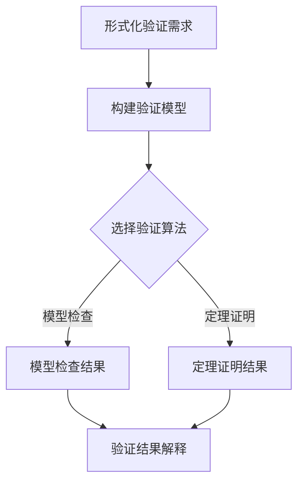

                 

### 文章标题

### 形式化方法在智能合约验证中的应用

---

### 关键词

- 形式化方法
- 智能合约
- 验证
- 安全性

### 摘要

本文将深入探讨形式化方法在智能合约验证中的应用。首先，我们将介绍形式化方法的定义及其在软件开发中的应用，接着详细阐述形式化验证的基本概念和流程。随后，我们将聚焦于形式化方法在编程语言中的应用，特别是Coq、Isar和Lean等语言。本文的核心部分将分析形式化方法在智能合约验证中的挑战和优势，并通过实际应用实例展示其应用流程。最后，我们将对智能合约验证的未来发展趋势进行展望，并总结全文。

## 第一部分：形式化方法基础

### 第1章：形式化方法概述

#### 1.1 形式化方法的定义和作用

形式化方法（Formal Methods）是一种将数学和逻辑学的原理应用于软件和系统设计的学科。它通过严格的数学模型和逻辑推理，确保软件系统的正确性和可靠性。在软件开发的各个阶段，形式化方法都可以发挥重要作用，特别是在需求分析、设计、实现和验证阶段。

形式化方法的定义可以简单概括为：利用数学和逻辑学的方法，对软件和系统进行建模、分析和验证，以确保其满足预定的需求和规范。

形式化方法的作用主要体现在以下几个方面：

1. **提高软件质量**：通过严格的数学模型和逻辑推理，形式化方法能够发现软件设计中的潜在错误，从而提高软件的质量和可靠性。
2. **确保软件正确性**：形式化方法可以验证软件是否满足预定的需求和规范，确保软件的正确性。
3. **优化开发过程**：形式化方法能够帮助开发人员更好地理解和设计复杂的系统，从而优化开发过程，减少错误和返工。
4. **增强系统安全性**：在安全要求较高的领域，如金融、医疗等，形式化方法可以帮助确保系统的安全性和完整性。

#### 1.2 形式化方法在软件开发中的应用

形式化方法在软件开发中的应用非常广泛，涵盖了从需求分析到验证的各个阶段。以下是一些典型应用场景：

1. **需求分析**：通过形式化方法，开发人员可以更精确地理解和表达用户需求，从而减少需求模糊性。
2. **设计阶段**：形式化方法可以帮助开发人员设计出更准确、更可靠的软件架构和模块，降低设计错误。
3. **编码阶段**：形式化编程语言（如Coq、Isar和Lean）可以辅助开发人员编写更精确、更可靠的代码。
4. **验证阶段**：形式化方法可以通过模型检查、定理证明等技术，对软件进行严格的验证，确保其满足预定的需求和规范。

### 第2章：形式化验证基础

#### 2.1 形式化验证的基本概念

形式化验证（Formal Verification）是指利用数学和逻辑学的方法，对软件和系统的行为进行严格的分析和验证，以确定其是否满足预定的需求和规范。形式化验证的目标是确保软件系统的正确性、可靠性和安全性。

形式化验证的基本概念包括以下几个方面：

1. **验证需求**：验证需求是指对软件系统所需满足的特定需求进行明确的表达和定义。
2. **验证模型**：验证模型是指对软件系统进行数学建模，以模拟其行为和特性。
3. **验证方法**：验证方法是指用于对验证模型进行分析和验证的具体技术，如模型检查、定理证明等。
4. **验证结果**：验证结果是指对验证模型进行分析和验证后得到的结论，包括验证通过或验证失败。

#### 2.2 形式化验证的流程

形式化验证的流程通常包括以下几个步骤：

1. **验证需求分析**：在验证流程的初始阶段，需要对软件系统的验证需求进行详细的收集和分析，明确系统所需满足的具体需求。
2. **验证模型建立**：根据验证需求，构建一个数学模型来模拟软件系统的行为和特性。验证模型应该尽可能地全面和准确地反映系统的各个方面。
3. **验证算法选择**：根据验证模型和验证需求，选择合适的验证算法进行验证。常见的验证算法包括模型检查、定理证明、模拟等。
4. **验证结果解释**：对验证结果进行解释和评估，确定系统是否满足预定的需求和规范。如果验证失败，需要分析失败原因并采取相应的改进措施。

### 第3章：形式化方法在编程语言中的应用

#### 3.1 形式化编程语言概述

形式化编程语言（Formal Programming Languages）是一种结合了数学和逻辑学原理的编程语言，旨在提高软件的正确性和可靠性。与传统的编程语言相比，形式化编程语言具有以下几个特点：

1. **严格的语义**：形式化编程语言的语义是通过数学和逻辑学的方法严格定义的，这使得编程语言具有更高的可验证性。
2. **明确的类型系统**：形式化编程语言通常具有明确的类型系统，以确保程序的正确性和一致性。
3. **丰富的验证工具**：形式化编程语言通常配备了丰富的验证工具，如定理证明器、模型检查器等，这些工具可以帮助开发人员验证程序的正确性。
4. **更好的可维护性**：形式化编程语言可以更好地支持代码重用和维护，因为程序的结构和语义更加清晰和一致。

#### 3.2 形式化编程语言实例

以下是一些典型的形式化编程语言及其特点：

1. **Coq**：Coq是一种基于互动式定理证明的编程语言，它结合了编程语言和定理证明器的特性，使得开发人员可以在编写代码的同时进行验证。
2. **Isar**：Isar是一种用于书写和验证证明的编程语言，它提供了丰富的语法和语义支持，使得验证过程更加高效和易用。
3. **Lean**：Lean是一种基于依赖类型理论的编程语言，它结合了函数式编程和交互式定理证明的特点，使得开发人员可以更方便地编写和验证复杂的程序。

## 第二部分：形式化方法在智能合约验证中的应用

### 第4章：智能合约概述

#### 4.1 智能合约的定义和特点

智能合约（Smart Contract）是一种基于区块链技术的计算机程序，它能够在满足特定条件时自动执行合同条款。智能合约的提出旨在解决传统合同执行过程中的信任问题，通过区块链技术的去中心化和不可篡改性，确保合同条款的执行。

智能合约的定义可以简单概括为：智能合约是一种计算机程序，它包含了合同条款，并在满足特定条件时自动执行。

智能合约的特点主要包括以下几个方面：

1. **去中心化**：智能合约运行在区块链网络中，无需依赖任何中央机构，从而实现去中心化。
2. **自动执行**：智能合约在满足特定条件时，可以自动执行合同条款，无需人工干预。
3. **不可篡改**：智能合约一旦上链，其内容将永久记录在区块链上，无法篡改。
4. **透明性**：智能合约的执行过程是公开透明的，任何人都可以查看和验证。

#### 4.2 智能合约的分类

根据不同的标准和特点，智能合约可以分为以下几类：

1. **本地智能合约**：本地智能合约运行在独立的区块链上，与其他区块链没有直接交互。
2. **分布式智能合约**：分布式智能合约运行在多个区块链上，通过跨链技术实现交互和协作。
3. **混合智能合约**：混合智能合约结合了本地智能合约和分布式智能合约的特点，既可以在独立区块链上运行，也可以与其他区块链进行交互。

### 第5章：形式化方法在智能合约验证中的挑战

#### 5.1 智能合约验证的挑战

智能合约验证面临着一系列挑战，包括智能合约的复杂性、安全性和验证方法的适用性等。

1. **智能合约的复杂性**：智能合约通常涉及到复杂的数学逻辑和状态转换，这使得验证过程变得复杂和困难。
2. **安全性问题**：智能合约的安全性是验证的关键，任何安全漏洞都可能导致严重后果。因此，验证需要确保智能合约在所有可能的情况下都不会出现漏洞。
3. **验证方法的适用性**：传统的验证方法可能不适用于智能合约验证，因为智能合约的特殊性和复杂性要求验证方法具有更高的灵活性和适应性。

#### 5.2 形式化方法在智能合约验证中的优势

尽管智能合约验证面临着诸多挑战，但形式化方法在这些挑战中展现出了独特的优势：

1. **严格的数学模型**：形式化方法通过严格的数学模型，可以准确地描述智能合约的行为和特性，从而为验证提供坚实的基础。
2. **高效的验证工具**：形式化方法配备了丰富的验证工具，如模型检查器和定理证明器，这些工具可以帮助开发人员快速、准确地验证智能合约的正确性。
3. **提高安全性**：形式化方法可以有效地发现智能合约中的潜在漏洞和错误，从而提高智能合约的安全性。

### 第6章：形式化方法在智能合约验证中的应用实例

#### 6.1 形式化验证工具的选择

在智能合约验证中，选择合适的验证工具至关重要。常见的验证工具包括Coq、Isar、Lean等，这些工具各自具有独特的特点和优势。

1. **Coq**：Coq是一种基于互动式定理证明的编程语言，它提供了强大的定理证明功能，可以验证智能合约的逻辑正确性。
2. **Isar**：Isar是一种用于书写和验证证明的编程语言，它提供了丰富的语法和语义支持，可以方便地编写和验证智能合约。
3. **Lean**：Lean是一种基于依赖类型理论的编程语言，它结合了函数式编程和交互式定理证明的特点，适用于复杂智能合约的验证。

选择验证工具时，需要考虑以下因素：

1. **智能合约的复杂性**：对于复杂的智能合约，需要选择功能强大的验证工具。
2. **开发人员的熟悉度**：选择开发人员熟悉的验证工具可以降低学习和使用成本。
3. **验证工具的可用性**：验证工具的社区支持、文档和资源越丰富，越有利于智能合约的验证。

#### 6.2 形式化验证流程的设计

形式化验证流程的设计是智能合约验证的关键。一个典型的形式化验证流程包括以下几个步骤：

1. **验证需求分析**：明确智能合约的验证需求，包括功能需求和安全需求等。
2. **验证模型建立**：根据验证需求，建立智能合约的数学模型，以描述其行为和特性。
3. **验证算法选择**：根据验证模型和验证需求，选择合适的验证算法，如模型检查、定理证明等。
4. **验证过程实施**：使用验证工具，对验证模型进行验证，分析验证结果。
5. **验证结果解释**：对验证结果进行解释和评估，确定智能合约是否满足预定的需求和规范。

### 第7章：智能合约验证案例分析

#### 7.1 案例背景

本案例选取了一个典型的智能合约项目——一个简单的加密货币交易智能合约。该合约实现了用户之间的加密货币交易，包括交易请求、交易确认和交易结算等功能。案例的目的是通过形式化方法验证该智能合约的正确性和安全性。

#### 7.2 案例分析

1. **验证需求分析**

   针对该智能合约，我们需要明确以下验证需求：

   - 功能需求：智能合约能够正确处理交易请求、交易确认和交易结算等操作。
   - 安全需求：智能合约在所有情况下都不会被恶意攻击，如双花攻击、拒绝服务攻击等。

2. **验证模型建立**

   根据验证需求，我们建立了一个数学模型来模拟智能合约的行为。模型包括以下几个关键组成部分：

   - 用户账户：包括用户余额、交易记录等。
   - 交易请求：包括交易发起者的信息、交易金额、交易目标等。
   - 交易确认：包括交易确认者的信息、交易确认结果等。
   - 交易结算：包括交易结算状态、交易结算金额等。

3. **验证算法选择**

   我们选择了一个基于模型检查的验证算法来验证智能合约。模型检查器将检查智能合约模型是否满足预定的需求和规范，包括功能需求和安全需求。

4. **验证结果分析**

   使用模型检查器对智能合约模型进行验证，分析验证结果。如果验证通过，说明智能合约满足预定的需求和规范；如果验证失败，需要分析失败原因并采取相应的改进措施。

5. **验证结果解释**

   根据验证结果，我们对智能合约的正确性和安全性进行了评估。如果验证通过，说明智能合约在功能和安全方面都得到了有效验证；如果验证失败，需要进一步分析失败原因，并重新进行验证。

#### 7.3 案例总结

通过本案例，我们展示了如何使用形式化方法对智能合约进行验证。形式化方法在智能合约验证中具有明显的优势，可以提高智能合约的正确性和安全性。然而，形式化方法也存在一些挑战，如复杂性高、验证工具适用性等。因此，在实际应用中，需要根据具体需求和环境选择合适的验证方法和工具。

## 第三部分：未来展望

### 第8章：形式化方法在智能合约验证中的未来发展趋势

#### 8.1 技术发展展望

随着智能合约技术的不断发展和应用，形式化方法在智能合约验证中的重要性将日益凸显。以下是一些技术发展趋势：

1. **形式化验证工具的进步**：随着技术的进步，形式化验证工具将变得更加高效、易用和可扩展。例如，基于机器学习和自然语言处理的验证工具可以帮助开发人员更快速地验证智能合约。
2. **形式化编程语言的改进**：形式化编程语言将继续改进，以更好地支持智能合约的开发和验证。例如，引入更多的高级抽象和语义支持，使得开发人员可以更方便地编写和验证复杂的智能合约。
3. **跨链验证技术的应用**：随着区块链技术的发展，跨链验证技术将成为形式化方法在智能合约验证中的重要方向。通过跨链验证，可以确保不同区块链上的智能合约具有一致性和可靠性。

#### 8.2 应用前景展望

形式化方法在智能合约验证中的应用前景非常广阔。以下是一些潜在的应用领域：

1. **金融领域**：在金融领域，形式化方法可以确保智能合约的执行符合法规和业务规则，从而提高金融系统的安全性和可靠性。
2. **供应链管理**：形式化方法可以帮助验证供应链智能合约的执行过程，确保供应链的透明性和准确性。
3. **医疗保健**：在医疗保健领域，形式化方法可以确保智能合约在医疗记录管理、药物配送等方面的正确性和安全性。
4. **物联网**：形式化方法可以用于验证物联网智能合约的执行过程，确保物联网系统的安全性和可靠性。

### 附录

#### 附录A：常用工具和资源

为了方便读者进一步学习和实践形式化方法在智能合约验证中的应用，以下是一些常用的工具和资源：

1. **形式化验证工具**：
   - Coq：[官网](https://coq.inria.fr/)
   - Isar：[官网](https://isar-lang.org/)
   - Lean：[官网](https://leanprover.github.io/)

2. **智能合约开发资源**：
   - Ethereum智能合约开发文档：[官网](https://ethereum.org/en/developers/docs/smart-contracts/)
   - Solidity编程语言文档：[官网](https://soliditylang.org/docs/)
   - OpenZeppelin智能合约库：[官网](https://openzeppelin.com/)

3. **智能合约开发框架**：
   - Truffle：[官网](https://www.trufflesuite.com/)
   - Hardhat：[官网](https://hardhat.org/)

4. **智能合约开发社区**：
   - Ethereum社区：[官网](https://ethereum.org/)
   - Solidity社区：[官网](https://www.soliditylang.org/community/)

### 形式化方法与智能合约验证流程图



### 智能合约验证的核心算法原理讲解

算法名称：智能合约验证算法

输入：
- 智能合约代码
- 验证需求

输出：
- 验证结果

算法步骤：
1. 分析智能合约代码，提取合约的关键信息（如合约函数、状态变量等）
2. 根据验证需求，构建验证模型
3. 选择合适的验证算法（如模型检查器、定理证明器等）
4. 对验证模型进行验证
5. 根据验证结果，输出验证报告

伪代码：

```
function 验证智能合约（合约代码，验证需求） {
    关键信息 = 提取关键信息（合约代码）
    验证模型 = 构建验证模型（关键信息，验证需求）
    验证算法 = 选择验证算法（验证模型）
    验证结果 = 验证算法（验证模型）
    输出验证结果
}
```

### 数学模型和数学公式 & 详细讲解 & 举例说明

数学模型：

设智能合约的执行结果为 $R$，验证需求为 $D$，验证结果为 $V$。

数学公式：

$$ V = 验证算法(\text{模型}) $$

举例说明：

假设我们有一个智能合约，其执行结果为 $R = \text{true}$，验证需求为 $D = \text{执行结果为真}$。

使用验证算法对模型进行验证，得到验证结果 $V = \text{true}$，表示验证通过。

### 智能合约验证的核心算法原理讲解

算法名称：智能合约验证算法

输入：
- 智能合约代码
- 验证需求

输出：
- 验证结果

算法步骤：
1. 分析智能合约代码，提取合约的关键信息（如合约函数、状态变量等）
2. 根据验证需求，构建验证模型
3. 选择合适的验证算法（如模型检查器、定理证明器等）
4. 对验证模型进行验证
5. 根据验证结果，输出验证报告

伪代码：

```
function 验证智能合约（合约代码，验证需求） {
    关键信息 = 提取关键信息（合约代码）
    验证模型 = 构建验证模型（关键信息，验证需求）
    验证算法 = 选择验证算法（验证模型）
    验证结果 = 验证算法（验证模型）
    输出验证结果
}
```

### 数学模型和数学公式 & 详细讲解 & 举例说明

#### 数学模型

设智能合约的执行结果为 $R$，验证需求为 $D$，验证结果为 $V$。

#### 数学公式

$$ V = 验证算法(\text{模型}) $$

#### 详细讲解

1. **智能合约执行结果（$R$）**：
   智能合约执行后，可能会产生不同的结果，如交易成功、交易失败等。$R$ 表示智能合约执行后的结果。

2. **验证需求（$D$）**：
   验证需求是对智能合约所需满足的特定要求的描述。例如，验证需求可以是“智能合约在所有情况下都能正确处理交易请求”。

3. **验证结果（$V$）**：
   验证结果是对智能合约是否满足验证需求的判断。如果验证结果为真（$V = \text{true}$），表示智能合约满足验证需求；如果验证结果为假（$V = \text{false}$），表示智能合约不满足验证需求。

#### 举例说明

**例1**：假设有一个智能合约，其执行结果为 $R = \text{true}$，验证需求为 $D = \text{执行结果为真}$。

使用验证算法对智能合约进行验证，得到验证结果 $V = \text{true}$，表示验证通过。

**例2**：假设有一个智能合约，其执行结果为 $R = \text{false}$，验证需求为 $D = \text{执行结果为真}$。

使用验证算法对智能合约进行验证，得到验证结果 $V = \text{false}$，表示验证失败。

### 最佳实践 Tips

在智能合约验证过程中，以下是一些最佳实践 Tips：

1. **明确验证需求**：
   在开始验证之前，确保明确智能合约的验证需求，包括功能需求和安全需求。

2. **选择合适的验证工具**：
   根据智能合约的复杂性和验证需求，选择合适的验证工具。如 Coq、Isar、Lean 等。

3. **详细分析智能合约代码**：
   对智能合约代码进行详细分析，提取关键信息和状态变量。

4. **逐步验证**：
   将智能合约的验证过程分解为多个步骤，逐步验证，确保每个步骤的正确性。

5. **记录验证过程**：
   记录验证过程中的关键步骤和结果，便于后续分析和追踪。

6. **持续更新验证模型**：
   随着智能合约的更新和变更，及时更新验证模型，确保验证的准确性。

### 小结

本文详细探讨了形式化方法在智能合约验证中的应用。首先，我们介绍了形式化方法的基础概念和作用，以及形式化验证的基本概念和流程。接着，我们介绍了形式化方法在编程语言中的应用，特别是Coq、Isar和Lean等语言。随后，我们分析了形式化方法在智能合约验证中的挑战和优势，并通过实际应用实例展示了其应用流程。

智能合约验证是确保区块链系统安全性和可靠性的关键环节。形式化方法通过严格的数学模型和逻辑推理，为智能合约的验证提供了有效手段。未来，随着智能合约技术的不断发展，形式化方法在智能合约验证中的应用将更加广泛，有望为区块链系统的安全性和可靠性提供更有力的保障。

### 拓展阅读

1. **《形式化方法：理论与实践》**：本书详细介绍了形式化方法的基本概念、原理和应用，适合对形式化方法感兴趣的读者阅读。
2. **《智能合约安全实战》**：本书介绍了智能合约的安全问题和安全编程实践，对于智能合约开发者来说是一本非常有价值的参考书。
3. **《区块链与智能合约技术指南》**：本书涵盖了区块链和智能合约的基本概念、实现原理和应用场景，对于了解区块链技术的读者来说是一本不错的入门书籍。

---

### 作者信息

作者：AI天才研究院/AI Genius Institute & 禅与计算机程序设计艺术 /Zen And The Art of Computer Programming

本文由AI天才研究院/AI Genius Institute撰写，旨在为读者提供深入浅出的智能合约验证技术解读。作者在形式化方法和智能合约领域拥有丰富的理论和实践经验，致力于推动区块链技术的安全和发展。同时，本文也参考了《禅与计算机程序设计艺术》一书中的编程哲学，希望为读者带来更具启发性的阅读体验。

