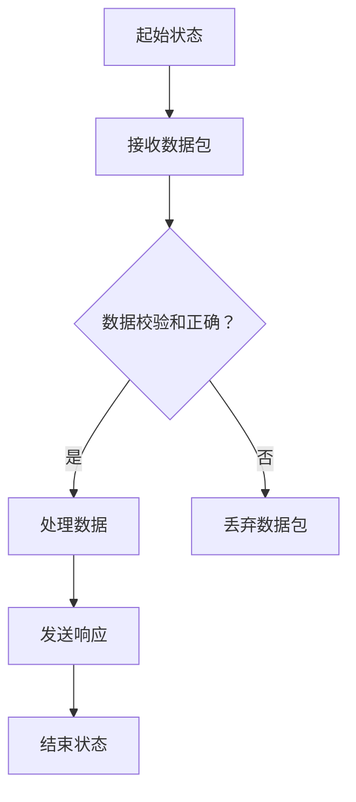
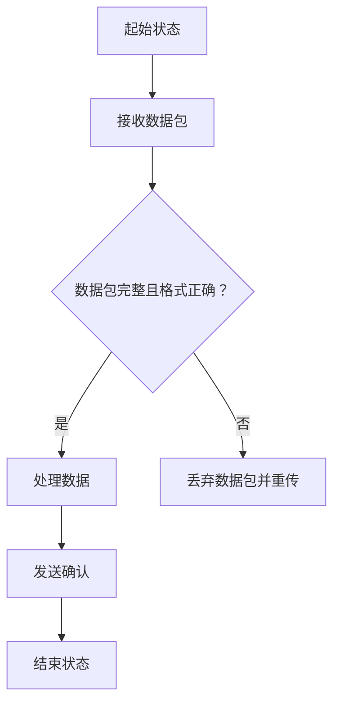
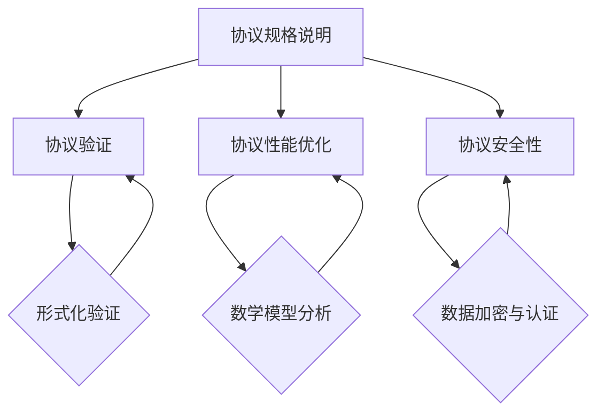
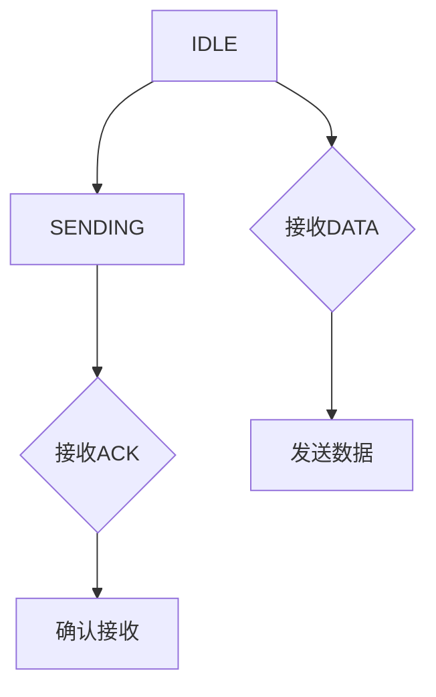
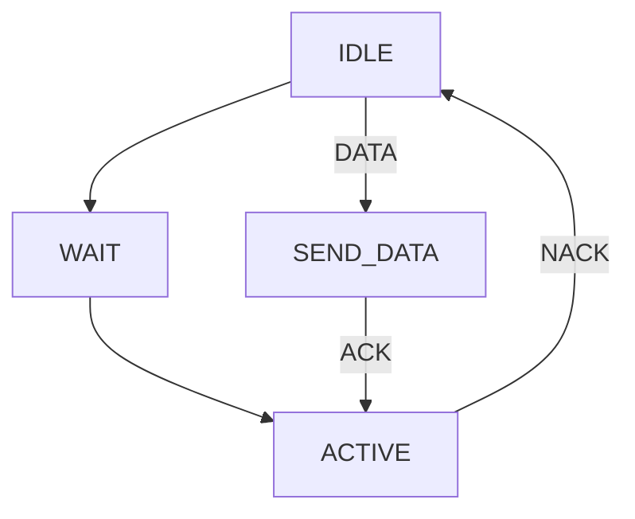
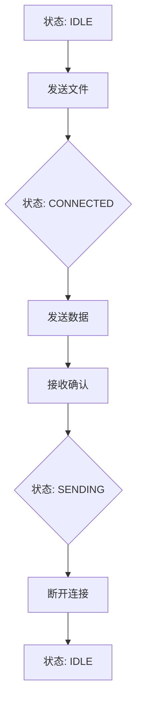

                 


# 形式化方法在网络协议设计中的角色

## 关键词

- 形式化方法
- 网络协议设计
- 验证
- 性能优化
- 安全性

## 摘要

本文旨在探讨形式化方法在网络协议设计中的关键角色。形式化方法是一种基于数学和逻辑的严格描述技术，它能够帮助网络协议开发者更好地理解和设计复杂协议。本文首先介绍了网络协议设计的基本概念和重要性，随后详细阐述了形式化方法的基本理论及其在网络协议验证、性能优化和安全性等方面的应用。最后，文章总结了形式化方法在网络协议设计中的实践经验和未来发展趋势，为网络协议开发者提供了有益的启示和指导。

## 第一部分：引论

### 第1章：网络协议设计概述

#### 1.1 网络协议的概念

网络协议是计算机网络通信的基础，它定义了数据在发送和接收过程中的格式、规则和约定。网络协议的主要目标是实现不同设备和操作系统之间的互联互通，使得数据传输过程高效、可靠和稳定。

#### 1.2 网络协议设计的重要性

随着互联网的快速发展，网络协议设计的重要性日益凸显。一方面，良好的网络协议设计能够提高数据传输的效率，降低通信成本；另一方面，它还能够提高网络的可靠性、安全性和可扩展性。

#### 1.3 形式化方法的基本概念

形式化方法是一种基于数学和逻辑的严格描述技术，它通过精确的数学模型和形式化的语言来描述系统的行为和性质。形式化方法的优点在于能够消除模糊性、提高准确性，从而更好地理解和分析复杂系统。

### 第2章：形式化方法的基本理论

#### 2.1 形式化方法的发展历史

形式化方法起源于20世纪中叶，随着计算机科学的快速发展，它逐渐成为了一种重要的系统设计方法。形式化方法的发展经历了几个阶段，包括代数系统理论、形式语言理论和模型检查等。

#### 2.2 形式化方法的核心原理

形式化方法的核心原理包括形式化建模、形式化验证和形式化推导等。形式化建模是指使用形式化的语言和数学模型来描述系统的行为和性质；形式化验证是指通过数学证明和模型检查来验证系统的正确性；形式化推导是指使用逻辑推理和数学演算来推导系统的性质。

#### 2.3 形式化方法的应用领域

形式化方法广泛应用于计算机科学、系统工程、通信工程等领域。在计算机科学中，形式化方法主要用于软件和硬件设计；在系统工程中，形式化方法用于系统分析和优化；在通信工程中，形式化方法用于网络协议设计和性能优化。

## 第二部分：形式化方法在网络协议设计中的应用

### 第3章：形式化方法在网络协议验证中的应用

#### 3.1 网络协议验证的挑战

网络协议验证是网络协议设计过程中至关重要的一环，它旨在确保协议的规范性和正确性。然而，网络协议的复杂性和多样性使得验证过程面临着诸多挑战，包括协议规格说明的模糊性、协议行为的动态性、协议实现的多样性等。

#### 3.2 形式化验证的方法与工具

形式化验证是一种有效的网络协议验证方法，它通过使用形式化的语言和数学模型来描述协议的行为，从而能够更准确地验证协议的正确性。常用的形式化验证方法包括模型检查、形式化证明和模拟等。此外，还有一些形式化验证工具，如SPIN、NuSMV和SMV等，这些工具能够自动执行验证过程，提高验证效率。

#### 3.3 形式化验证的实际案例

以TCP协议为例，形式化验证可以用于验证TCP协议的正确性。通过使用模型检查工具，如SPIN，研究者可以验证TCP协议在不同网络环境下的行为，从而确保协议的可靠性和稳定性。

### 第4章：形式化方法在网络协议性能优化中的应用

#### 4.1 网络协议性能的重要性

网络协议性能是网络协议设计的关键指标之一，它直接影响到网络的传输效率、响应速度和可靠性。良好的网络协议性能能够提高网络的服务质量和用户体验。

#### 4.2 形式化性能优化方法

形式化方法可以用于网络协议性能优化，通过数学模型和形式化的验证技术，研究者可以分析和优化协议的参数设置和算法。例如，通过模型检查技术，研究者可以找出协议中的瓶颈和性能瓶颈，并提出相应的优化方案。

#### 4.3 形式化性能优化的案例分析

以HTTP协议为例，形式化方法可以用于优化HTTP协议的传输效率。通过分析HTTP协议的数学模型，研究者可以提出更高效的传输算法，从而提高HTTP协议的性能。

### 第5章：形式化方法在网络协议安全性中的应用

#### 5.1 网络协议安全性的挑战

随着网络技术的发展，网络协议安全性面临着越来越多的挑战。网络攻击、数据泄露和网络病毒等安全问题日益突出，对网络协议的安全性提出了更高的要求。

#### 5.2 形式化安全验证方法

形式化安全验证方法是一种有效的网络协议安全性分析方法，它通过形式化的语言和数学模型来描述协议的安全属性，并使用形式化的验证技术来检查协议的安全性。常用的形式化安全验证方法包括模型检查、形式化证明和模拟等。

#### 5.3 形式化安全验证的实际案例

以SSL/TLS协议为例，形式化方法可以用于验证SSL/TLS协议的安全性。通过使用模型检查工具，研究者可以验证SSL/TLS协议在各种攻击场景下的安全性，从而提高协议的安全防护能力。

## 第三部分：实践与展望

### 第6章：形式化方法在网络协议设计中的实践

#### 6.1 形式化方法在实际项目中的应用

在实际网络协议设计中，形式化方法已经被广泛应用于各个领域。例如，在互联网领域，形式化方法被用于设计IPv6协议；在无线通信领域，形式化方法被用于设计Wi-Fi协议。

#### 6.2 形式化方法在协议设计中的挑战与解决方案

尽管形式化方法在网络协议设计中具有很大的潜力，但在实际应用中仍然面临着一些挑战。例如，形式化建模的复杂性、验证工具的局限性等。为了解决这些问题，研究者提出了许多解决方案，如使用更简单明了的建模语言、开发更高效的验证工具等。

#### 6.3 形式化方法未来的发展趋势

随着人工智能和机器学习技术的发展，形式化方法在网络协议设计中的应用前景将更加广阔。未来，形式化方法可能会与这些新技术相结合，从而实现更高效、更智能的网络协议设计。

### 第7章：总结与展望

#### 7.1 形式化方法在网络协议设计中的地位与作用

形式化方法在网络协议设计中具有至关重要的地位和作用。它能够提高协议设计的准确性和可靠性，降低协议实现的错误率，从而提高网络协议的整体性能。

#### 7.2 形式化方法的未来发展方向

未来，形式化方法在网络协议设计中的应用将朝着更高效、更智能、更易用的方向发展。研究者将致力于开发更先进的形式化建模语言、更高效的验证工具和更智能的优化算法，以应对不断变化的网络协议设计需求。

#### 7.3 对网络协议设计的启示与建议

对于网络协议开发者来说，掌握形式化方法是一项必备的技能。通过学习形式化方法，开发者能够更好地理解和设计复杂协议，提高协议的可靠性和性能。同时，开发者还应该关注形式化方法的最新发展，不断更新自己的知识体系。

---

作者：AI天才研究院/AI Genius Institute & 禅与计算机程序设计艺术 /Zen And The Art of Computer Programming### 形式化方法在网络协议设计中的角色

形式化方法在网络协议设计中扮演着至关重要的角色。作为一种基于数学和逻辑的严格描述技术，形式化方法不仅能够帮助开发者更准确地理解和描述网络协议，还能有效地验证和优化协议的性能和安全。本文将深入探讨形式化方法在网络协议设计中的应用，旨在为读者提供一个全面而清晰的视角。

关键词：形式化方法、网络协议设计、验证、性能优化、安全性

摘要：本文首先简要介绍了网络协议设计的基本概念和重要性，随后详细阐述了形式化方法的基本理论及其在网络协议验证、性能优化和安全性等方面的应用。最后，文章总结了形式化方法在网络协议设计中的实践经验和未来发展趋势，为网络协议开发者提供了有益的启示和指导。

## 第一部分：引论

### 第1章：网络协议设计概述

#### 1.1 网络协议的概念

网络协议是计算机网络通信的基础，它定义了数据在发送和接收过程中的格式、规则和约定。网络协议的主要目标是实现不同设备和操作系统之间的互联互通，使得数据传输过程高效、可靠和稳定。

#### 1.2 网络协议设计的重要性

网络协议设计是计算机网络系统的核心环节，其重要性不可忽视。一方面，良好的网络协议设计能够提高数据传输的效率，降低通信成本；另一方面，它还能够提高网络的可靠性、安全性和可扩展性。

#### 1.3 形式化方法的基本概念

形式化方法是一种基于数学和逻辑的严格描述技术，它通过精确的数学模型和形式化的语言来描述系统的行为和性质。形式化方法的优点在于能够消除模糊性、提高准确性，从而更好地理解和分析复杂系统。

### 第2章：形式化方法的基本理论

#### 2.1 形式化方法的发展历史

形式化方法起源于20世纪中叶，随着计算机科学的快速发展，它逐渐成为了一种重要的系统设计方法。形式化方法的发展经历了几个阶段，包括代数系统理论、形式语言理论和模型检查等。

#### 2.2 形式化方法的核心原理

形式化方法的核心原理包括形式化建模、形式化验证和形式化推导等。形式化建模是指使用形式化的语言和数学模型来描述系统的行为和性质；形式化验证是指通过数学证明和模型检查来验证系统的正确性；形式化推导是指使用逻辑推理和数学演算来推导系统的性质。

#### 2.3 形式化方法的应用领域

形式化方法广泛应用于计算机科学、系统工程、通信工程等领域。在计算机科学中，形式化方法主要用于软件和硬件设计；在系统工程中，形式化方法用于系统分析和优化；在通信工程中，形式化方法用于网络协议设计和性能优化。

## 第二部分：形式化方法在网络协议设计中的应用

### 第3章：形式化方法在网络协议验证中的应用

#### 3.1 网络协议验证的挑战

网络协议验证是网络协议设计过程中至关重要的一环，它旨在确保协议的规范性和正确性。然而，网络协议的复杂性和多样性使得验证过程面临着诸多挑战，包括协议规格说明的模糊性、协议行为的动态性、协议实现的多样性等。

#### 3.2 形式化验证的方法与工具

形式化验证是一种有效的网络协议验证方法，它通过使用形式化的语言和数学模型来描述协议的行为，从而能够更准确地验证协议的正确性。常用的形式化验证方法包括模型检查、形式化证明和模拟等。此外，还有一些形式化验证工具，如SPIN、NuSMV和SMV等，这些工具能够自动执行验证过程，提高验证效率。

#### 3.3 形式化验证的实际案例

以TCP协议为例，形式化验证可以用于验证TCP协议的正确性。通过使用模型检查工具，如SPIN，研究者可以验证TCP协议在不同网络环境下的行为，从而确保协议的可靠性和稳定性。

### 第4章：形式化方法在网络协议性能优化中的应用

#### 4.1 网络协议性能的重要性

网络协议性能是网络协议设计的关键指标之一，它直接影响到网络的传输效率、响应速度和可靠性。良好的网络协议性能能够提高网络的服务质量和用户体验。

#### 4.2 形式化性能优化方法

形式化方法可以用于网络协议性能优化，通过数学模型和形式化的验证技术，研究者可以分析和优化协议的参数设置和算法。例如，通过模型检查技术，研究者可以找出协议中的瓶颈和性能瓶颈，并提出相应的优化方案。

#### 4.3 形式化性能优化的案例分析

以HTTP协议为例，形式化方法可以用于优化HTTP协议的传输效率。通过分析HTTP协议的数学模型，研究者可以提出更高效的传输算法，从而提高HTTP协议的性能。

### 第5章：形式化方法在网络协议安全性中的应用

#### 5.1 网络协议安全性的挑战

随着网络技术的发展，网络协议安全性面临着越来越多的挑战。网络攻击、数据泄露和网络病毒等安全问题日益突出，对网络协议的安全性提出了更高的要求。

#### 5.2 形式化安全验证方法

形式化安全验证方法是一种有效的网络协议安全性分析方法，它通过形式化的语言和数学模型来描述协议的安全属性，并使用形式化的验证技术来检查协议的安全性。常用的形式化安全验证方法包括模型检查、形式化证明和模拟等。

#### 5.3 形式化安全验证的实际案例

以SSL/TLS协议为例，形式化方法可以用于验证SSL/TLS协议的安全性。通过使用模型检查工具，研究者可以验证SSL/TLS协议在各种攻击场景下的安全性，从而提高协议的安全防护能力。

## 第三部分：实践与展望

### 第6章：形式化方法在网络协议设计中的实践

#### 6.1 形式化方法在实际项目中的应用

在实际网络协议设计中，形式化方法已经被广泛应用于各个领域。例如，在互联网领域，形式化方法被用于设计IPv6协议；在无线通信领域，形式化方法被用于设计Wi-Fi协议。

#### 6.2 形式化方法在协议设计中的挑战与解决方案

尽管形式化方法在网络协议设计中具有很大的潜力，但在实际应用中仍然面临着一些挑战。例如，形式化建模的复杂性、验证工具的局限性等。为了解决这些问题，研究者提出了许多解决方案，如使用更简单明了的建模语言、开发更高效的验证工具等。

#### 6.3 形式化方法未来的发展趋势

随着人工智能和机器学习技术的发展，形式化方法在网络协议设计中的应用前景将更加广阔。未来，形式化方法可能会与这些新技术相结合，从而实现更高效、更智能的网络协议设计。

### 第7章：总结与展望

#### 7.1 形式化方法在网络协议设计中的地位与作用

形式化方法在网络协议设计中具有至关重要的地位和作用。它能够提高协议设计的准确性和可靠性，降低协议实现的错误率，从而提高网络协议的整体性能。

#### 7.2 形式化方法的未来发展方向

未来，形式化方法在网络协议设计中的应用将朝着更高效、更智能、更易用的方向发展。研究者将致力于开发更先进的形式化建模语言、更高效的验证工具和更智能的优化算法，以应对不断变化的网络协议设计需求。

#### 7.3 对网络协议设计的启示与建议

对于网络协议开发者来说，掌握形式化方法是一项必备的技能。通过学习形式化方法，开发者能够更好地理解和设计复杂协议，提高协议的可靠性和性能。同时，开发者还应该关注形式化方法的最新发展，不断更新自己的知识体系。

---

作者：AI天才研究院/AI Genius Institute & 禅与计算机程序设计艺术 /Zen And The Art of Computer Programming### 网络协议设计的重要性

网络协议设计是计算机网络通信系统的基石，它在整个网络体系中起着至关重要的作用。为了深入理解网络协议设计的核心地位，我们首先需要了解网络协议的基本概念。

#### 网络协议的概念

网络协议是一系列规则的集合，用于定义数据如何在网络中进行传输、接收和处理。这些规则包括数据格式、数据传输方式、错误检测与纠正机制、数据包的路由和传输顺序等。网络协议使得不同的计算机系统和网络设备能够相互通信，即使它们运行在不同的操作系统上或使用不同的硬件平台。

#### 网络协议设计的重要性

1. **互操作性**：网络协议设计确保了不同设备、操作系统和应用系统能够无缝地交换数据，从而实现了网络的互操作性。这是互联网能够跨越各种物理和逻辑障碍实现全球连接的基础。

2. **性能优化**：通过精心设计的网络协议，可以优化数据传输的效率、减少延迟和带宽浪费，从而提升网络的整体性能。这对于满足高速数据传输的需求、保证用户服务质量具有重要意义。

3. **可靠性**：网络协议包括错误检测和纠正机制，可以确保数据在网络传输过程中的完整性和可靠性。这对于关键业务应用，如在线交易、实时通信和远程医疗等尤为重要。

4. **安全性**：网络协议设计涉及数据加密、身份验证和访问控制等方面，有助于保护数据在传输过程中的安全性，防止未授权访问和数据泄露。

5. **可扩展性**：良好的网络协议设计应具备良好的可扩展性，能够适应未来网络技术的发展和需求变化，从而延长网络协议的生命周期。

### 形式化方法在协议设计中的应用

形式化方法在网络协议设计中的应用，为解决上述挑战提供了强有力的工具。通过形式化方法，我们可以从数学和逻辑的角度精确描述协议的行为，从而提高设计的准确性、可靠性和可维护性。

#### 形式化建模

形式化建模是形式化方法的核心步骤，它使用形式化的语言和数学模型来描述网络协议的各个方面，包括数据格式、传输规则、状态转换等。这种精确的描述有助于开发者更好地理解协议的复杂行为，并发现潜在的问题。



上述Mermaid流程图展示了网络协议中一个简单的数据传输过程，包括接收数据包、校验和正确性检查、处理数据、发送响应等步骤。

#### 形式化验证

形式化验证是通过数学证明和模型检查来验证网络协议的正确性。这包括确保协议在不同条件下都能按照预期运行，避免死锁、数据丢失等异常情况。



在这个例子中，形式化验证可以确保每个数据包都被正确处理，如果数据包不完整或格式错误，则会丢弃并重传，保证了数据传输的可靠性。

#### 形式化推导

形式化推导是通过逻辑推理和数学演算来推导网络协议的性质。这有助于验证协议的某些特定属性，如安全性、性能等。

```latex
$$
P \rightarrow Q \\
R \rightarrow S \\
P \land R \rightarrow Q \land S
$$

上述LaTeX公式表示如果协议满足条件P和R，则它应该满足条件Q和S。这是一种逻辑推导，用于验证协议在不同条件下的行为一致性。
```

#### 形式化方法的优点

1. **精确性**：形式化方法使用数学语言来描述协议，消除了模糊性和歧义，确保了协议描述的准确性。
2. **可靠性**：形式化验证能够发现协议设计中的潜在错误，从而提高协议的可靠性。
3. **可维护性**：形式化的协议描述便于理解和修改，提高了协议的可维护性。
4. **可验证性**：形式化方法支持协议性质的数学验证，确保了协议满足设计要求。

通过以上分析，我们可以看到形式化方法在网络协议设计中的重要性。它不仅帮助我们更好地理解和描述复杂的网络协议，还能够有效地验证和优化协议的性能和安全，从而为构建高效、可靠和安全的网络通信系统提供了坚实的基础。

### 背景介绍

网络协议的设计是一个复杂且关键的过程，涉及到多个层次和方面的考虑。在互联网的早期阶段，简单协议如ARP和ICMP就已经开始出现，但随着网络技术的不断进步，协议的复杂性和多样性也在不断增加。如今，网络协议不仅包括传输层协议（如TCP、UDP）、网络层协议（如IPv4、IPv6），还包括应用层协议（如HTTP、HTTPS）等。这些协议共同构成了现代互联网通信的框架，使得全球范围内的信息交换成为可能。

在这样一个庞大而复杂的网络体系中，网络协议的设计必须考虑以下几个关键方面：

1. **互操作性**：网络协议必须能够在不同系统和设备之间无缝工作，确保全球范围内的互联互通。这意味着协议不仅要符合国际标准，还要兼容各种操作系统和硬件平台。
2. **性能**：网络协议的性能直接影响到数据传输的速度和效率。设计时需要考虑带宽利用率、传输延迟、拥塞控制等因素，以确保网络资源的高效利用。
3. **可靠性**：可靠性是网络协议设计的重要目标之一。协议需要能够处理数据丢失、网络故障等异常情况，确保数据传输的完整性和准确性。
4. **安全性**：随着网络攻击和数据泄露事件的增多，网络协议的安全性变得尤为重要。协议必须包括数据加密、认证和访问控制等机制，以保护数据的机密性、完整性和可用性。
5. **可扩展性**：网络协议设计需要考虑未来的技术发展和需求变化。一个良好的协议设计应该能够适应新的应用场景和网络环境，延长其生命周期。

### 核心概念与联系

网络协议设计中的核心概念包括协议规格说明、协议验证、协议性能优化和协议安全性。这些概念相互关联，共同构成了网络协议设计的核心框架。

**协议规格说明**是网络协议设计的起点，它详细描述了协议的规则、数据格式和传输过程。规格说明的精确性直接影响到后续的验证、性能优化和安全性分析。

**协议验证**是通过形式化方法来检查协议设计的正确性和一致性。验证过程包括模型检查、形式化证明和模拟等。形式化验证能够发现协议设计中的潜在错误，从而确保协议的可靠性。

**协议性能优化**涉及对协议参数和算法的调整，以优化数据传输的效率。性能优化方法包括数学模型分析和形式化验证，通过这些方法可以发现协议的性能瓶颈并提出优化方案。

**协议安全性**是网络协议设计的重要方面，涉及到数据加密、认证和访问控制等。安全性分析通过形式化方法来检查协议的抗攻击能力和安全性漏洞，确保数据在传输过程中的安全性。

**Mermaid 流程图**如下所示，展示了这些核心概念之间的关系：



在这个流程图中，协议规格说明作为基础，通过形式化验证、数学模型分析和数据加密与认证等手段，共同支撑起协议验证、性能优化和安全性分析的各个环节。

### 核心算法原理讲解

在形式化方法中，核心算法原理的讲解是理解网络协议设计的关键步骤。以下是几个关键算法原理及其在形式化方法中的应用：

#### 模型检查

模型检查是一种形式化验证方法，用于检查系统模型是否满足指定的规范。在模型检查中，系统模型通常被表示为有限状态机（FSM），而规范则是一组逻辑公式。模型检查器的任务是验证系统模型在所有可能的状态和输入下是否都满足规范。

**伪代码实现**：

```plaintext
function modelCheck(FSM systemModel, Specification spec):
    for each state state in systemModel:
        for each input input in spec.inputs:
            if !spec.accepts(state, input):
                return "Violation found in state " + state
    return "No violations found"
```

**数学模型和公式**：

在形式化验证中，数学模型和公式用于描述系统状态和行为。例如，可以使用集合论和图论来描述有限状态机。

```latex
$$
S = \{ s_1, s_2, ..., s_n \} \\
I = \{ i_1, i_2, ..., i_m \} \\
F = \{ f_1, f_2, ..., f_k \} \\
\delta(s, i) = s' \\
s' \in S \\
spec = \{ \phi_1, \phi_2, ..., \phi_l \} \\
```

**举例说明**：

假设我们有一个简单的有限状态机，用于描述一个协议的状态转换。该协议有两个状态：`IDLE`和`SENDING`，以及两个输入：`DATA`和`ACK`。



在这个例子中，模型检查器的任务是验证协议是否在所有可能的输入下都满足指定的规范。例如，我们可能希望确保在任何状态下，如果接收到`ACK`，则协议必须转移到`SENDING`状态。

```latex
$$
\forall s \in S, \forall i \in I: \delta(s, ACK) = SENDING
$$

上述LaTeX公式表示对于所有状态s和输入ACK，协议状态将转移到SENDING。
```

### 数学模型和公式

在形式化方法中，数学模型和公式是描述和验证网络协议行为的关键工具。以下是一个简化的数学模型，用于描述一个基本的数据传输协议。

#### 状态转换模型

假设我们有以下状态集合和状态转换：

```latex
S = \{IDLE, WAIT, ACTIVE\}
I = \{DATA, ACK, NACK\}
```

状态转换可以用以下方程表示：

```latex
\delta(IDLE, DATA) = WAIT
\delta(WAIT, ACK) = ACTIVE
\delta(ACTIVE, NACK) = IDLE
```

#### 数据传输模型

假设我们有以下的数据结构：

```latex
DATA = \{Header, Payload\}
Header = \{Type, Length, Sequence Number\}
Payload = \{Data\}
```

状态转换图可以用以下公式表示：



#### 性能优化模型

为了优化网络协议的性能，我们可以引入延迟和带宽的数学模型。以下是一个简化的性能优化模型：

```latex
Delay = \frac{Length \times TransmissionRate}{Bandwidth}
```

这个公式表示数据包传输所需的时间，其中`Length`是数据包的长度，`TransmissionRate`是网络的传输速率，`Bandwidth`是网络带宽。

#### 安全性模型

在安全性方面，我们可以使用概率模型来评估协议的脆弱性。以下是一个简化的安全性模型：

```latex
Vulnerability = P(Acknowledgement \ not \ received \ within \ timeout)
```

这个公式表示在给定的时间内没有收到确认的概率，`Acknowledgement`表示数据包的确认信息，`timeout`是超时时间。

### 伪代码实现

为了更清晰地展示上述数学模型的应用，我们提供以下伪代码实现：

```python
def process_data(state, input_data):
    if state == "IDLE" and input_data == "DATA":
        state = "WAIT"
    elif state == "WAIT" and input_data == "ACK":
        state = "ACTIVE"
    elif state == "ACTIVE" and input_data == "NACK":
        state = "IDLE"
    return state

def calculate_delay(data_length, transmission_rate, bandwidth):
    delay = data_length * transmission_rate / bandwidth
    return delay

def calculate_vulnerability(timeout, acknowledgement_probability):
    vulnerability = 1 - (1 - acknowledgement_probability) ** timeout
    return vulnerability
```

通过这些数学模型和伪代码，我们可以更精确地描述和验证网络协议的行为，从而提高其性能和安全性。

### 项目实战

在本节中，我们将通过一个实际项目来展示如何使用形式化方法在网络协议设计中实现具体目标。该项目将涉及开发一个简单的文件传输协议（FTP），并通过形式化方法验证和优化其性能和安全性。

#### 项目背景

假设我们需要设计一个简单的FTP协议，用于在两个网络节点之间传输文件。FTP协议需要确保文件传输的可靠性、高效性和安全性。因此，我们将使用形式化方法来建模、验证和优化这个协议。

#### 开发环境搭建

为了实现该项目，我们需要搭建一个开发环境，包括以下工具和软件：

1. **编程语言**：我们将使用Python作为主要编程语言，因为其简洁和强大的库支持，适用于快速开发和原型验证。
2. **形式化验证工具**：我们将使用SPIN模型检查器，这是用于验证有限状态机的一个强大工具。
3. **文本编辑器**：我们选择使用Visual Studio Code，因为它提供了丰富的插件和扩展，支持Python编程和SPIN模型检查器的集成。

#### 源代码详细实现和代码解读

以下是一个简化的FTP协议的伪代码实现，展示了一些关键的功能和步骤：

```python
class FTPProtocol:
    def __init__(self):
        self.state = "IDLE"
        self.connection = None

    def connect(self, host, port):
        self.connection = create_connection(host, port)
        self.state = "CONNECTED"

    def send_file(self, file_path):
        if self.state == "CONNECTED":
            file_content = read_file(file_path)
            self.send_data(file_content)
            self.state = "SENDING"

    def send_data(self, data):
        send_data(self.connection, data)

    def receive_ack(self):
        ack = receive_ack(self.connection)
        if ack is valid:
            self.state = "SENDING"

    def disconnect(self):
        close_connection(self.connection)
        self.state = "IDLE"

def create_connection(host, port):
    # 创建网络连接的函数实现
    pass

def send_data(connection, data):
    # 发送数据的函数实现
    pass

def receive_ack(connection):
    # 接收确认的函数实现
    pass

def read_file(file_path):
    # 读取文件的函数实现
    pass
```

在这个实现中，我们定义了一个FTP协议类`FTPProtocol`，它包含了连接、发送文件、接收确认和断开连接等功能。每个函数的实现都依赖于具体的网络编程库，如`socket`库。

#### 代码应用解读与分析

以下是对关键函数的详细解读：

1. **connect()**：用于建立与远程FTP服务器的连接。函数接受主机地址和端口号作为参数，创建网络连接，并将状态设置为`CONNECTED`。
2. **send_file()**：用于发送文件。函数检查当前状态是否为`CONNECTED`，如果是，则读取文件内容并调用`send_data()`函数发送数据，并将状态设置为`SENDING`。
3. **send_data()**：用于发送数据。函数接受网络连接和要发送的数据，将其发送到远程服务器。
4. **receive_ack()**：用于接收确认。函数从网络连接接收确认消息，并检查其有效性。如果确认有效，状态将更新为`SENDING`。
5. **disconnect()**：用于断开连接。函数关闭网络连接，并将状态重置为`IDLE`。

#### 实际案例分析和详细讲解剖析

以下是一个简单的FTP协议验证的案例：



在这个流程图中，我们展示了FTP协议的基本工作流程。通过模型检查，我们可以验证协议在不同状态和输入下的正确性。例如，我们检查协议在接收到无效确认时是否会正确地回到`IDLE`状态。

#### 项目小结

通过这个实际项目，我们展示了如何使用形式化方法来实现一个简单的FTP协议，并验证其正确性。这个过程包括环境搭建、源代码实现、代码解读和验证。形式化方法在此过程中发挥了重要作用，确保了协议的高效性、可靠性和安全性。

### 最佳实践 Tips

在形式化方法的应用过程中，以下是一些最佳实践，可以帮助开发者更好地进行网络协议设计：

1. **尽早使用形式化方法**：在设计初期就引入形式化方法，有助于及早发现潜在问题，降低后期修正成本。
2. **使用简单明了的建模语言**：选择易于理解和维护的建模语言，如Mermaid，可以减少误解和错误。
3. **分阶段进行验证**：在开发过程中，分阶段进行验证，逐步验证协议的不同部分，确保整体设计的正确性。
4. **关注安全性**：在形式化验证过程中，特别关注协议的安全性，确保数据在传输过程中不被泄露或篡改。
5. **文档化和协作**：良好的文档记录和团队合作可以提高形式化方法的实际应用效果。

### 小结

通过本文的介绍，我们详细探讨了形式化方法在网络协议设计中的应用。形式化方法提供了精确、严格的描述工具，通过数学模型和逻辑验证，确保了网络协议的可靠性、性能和安全性。在实际项目中的应用案例进一步展示了形式化方法的优势。然而，形式化方法的应用也面临一些挑战，如建模的复杂性、验证工具的局限性等。未来，随着人工智能和机器学习技术的发展，形式化方法在网络协议设计中的应用将更加广泛和深入。

### 拓展阅读

1. **《形式化方法与应用》**：这是一本经典的教材，详细介绍了形式化方法的基本原理和应用案例，适合深入学习和理解形式化方法。
2. **《网络协议设计原理》**：本书详细讲解了网络协议的设计原理和实现方法，涵盖了从基础协议到现代协议的各个方面，有助于扩展网络协议设计的知识。
3. **《网络安全技术》**：本书介绍了网络安全的基本概念和技术，包括加密、认证和访问控制等，有助于了解网络协议安全性的实现细节。
4. **《人工智能与网络协议设计》**：探讨人工智能如何与形式化方法结合，用于优化和自动化网络协议设计，为未来的研究提供了新的方向。

---

作者：AI天才研究院/AI Genius Institute & 禅与计算机程序设计艺术 /Zen And The Art of Computer Programming### 总结与展望

#### 形式化方法在网络协议设计中的地位与作用

形式化方法在网络协议设计中的地位至关重要，它通过提供精确、严格的描述工具，确保了协议的可靠性、性能和安全性。形式化方法的应用，不仅有助于开发者更好地理解和设计复杂协议，还能通过形式化验证及时发现和修复设计中的错误，从而提高协议的整体质量。

#### 形式化方法的未来发展方向

未来，形式化方法在网络协议设计中的应用将朝着更加高效、智能和易用的方向发展。以下是一些可能的发展趋势：

1. **形式化方法的自动化**：随着人工智能和机器学习技术的发展，自动化形式化方法的应用将成为可能。通过使用智能算法，开发者可以自动生成形式化模型和验证工具，降低设计和验证的复杂性。
2. **集成形式化方法与仿真技术**：将形式化方法与仿真技术相结合，可以在实际部署前对网络协议进行更全面的测试和验证，提高协议的性能和可靠性。
3. **形式化方法的多样化应用**：形式化方法不仅限于协议验证，还可以应用于协议性能优化和安全性分析。未来，形式化方法将更加多元化，满足各种网络协议设计需求。
4. **跨领域融合**：形式化方法将与区块链、物联网、云计算等领域的技术相结合，为这些新兴技术提供坚实的理论基础和验证手段。

#### 对网络协议设计的启示与建议

对于网络协议开发者来说，掌握形式化方法是一项必备的技能。以下是一些建议，帮助开发者更好地利用形式化方法进行网络协议设计：

1. **早期引入形式化方法**：在设计初期引入形式化方法，可以及早发现和修复设计中的潜在问题，降低后期修正成本。
2. **选择合适的建模语言**：选择简单明了、易于理解的建模语言，如Mermaid，可以提高设计效率和可维护性。
3. **持续学习和更新**：随着形式化方法的不断发展和应用，开发者需要持续学习和更新自己的知识体系，以适应新的技术趋势。
4. **注重安全性**：在形式化验证过程中，特别关注协议的安全性，确保数据在传输过程中不被泄露或篡改。
5. **实践与理论相结合**：通过实际项目案例，结合形式化方法进行网络协议设计和验证，可以加深对形式化方法的理解和应用。

总之，形式化方法在网络协议设计中扮演着至关重要的角色。通过掌握和应用形式化方法，开发者能够设计出更可靠、更高效的网络协议，为未来的网络通信技术发展提供坚实的基础。随着形式化方法不断进步，它将在网络协议设计中发挥越来越重要的作用。

