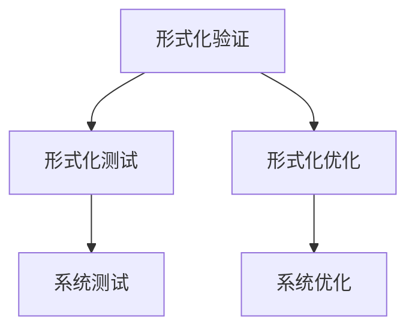

                 

### 文章标题

# 形式化方法在金融交易系统中的使用

> 关键词：形式化方法、金融交易系统、算法原理、数学模型、项目实战

> 摘要：本文将探讨形式化方法在金融交易系统中的应用，从背景介绍、核心概念、算法原理、数学模型、项目实战等方面，全面解析形式化方法在金融交易系统中的重要性及其实际应用价值。

### 背景介绍

金融交易系统作为金融市场的重要组成部分，其稳定性和可靠性直接关系到金融市场的健康发展。随着金融市场的复杂性和规模不断扩大，传统的金融交易系统面临着诸多挑战，如交易策略的复杂化、交易速度的要求、系统可靠性的保障等。为了应对这些挑战，形式化方法逐渐被引入到金融交易系统的设计和开发中。

形式化方法，又称形式化验证方法，是一种利用数学和逻辑的方法对软件系统进行分析和验证的技术。通过形式化方法，可以确保金融交易系统的正确性、完整性和可靠性。形式化方法在金融交易系统中的应用，不仅提高了系统的稳定性，还极大地降低了系统出错的概率，保障了金融市场的正常运行。

### 核心概念与联系

在探讨形式化方法在金融交易系统中的应用之前，我们需要了解几个核心概念：形式化验证、形式化测试、形式化优化。

1. **形式化验证**：形式化验证是一种通过数学和逻辑方法验证系统是否满足指定规范的过程。在金融交易系统中，形式化验证可以确保交易策略的正确性和交易流程的可靠性。

2. **形式化测试**：形式化测试是通过数学模型和逻辑推理来设计测试用例，对系统进行测试，以验证系统功能是否正确。在金融交易系统中，形式化测试可以帮助发现潜在的错误和漏洞，提高系统的健壮性。

3. **形式化优化**：形式化优化是通过数学模型和算法对系统进行优化，以提高系统的性能和效率。在金融交易系统中，形式化优化可以帮助提高交易速度和交易策略的执行效率。

以下是形式化方法在金融交易系统中的关系架构 Mermaid 流程图：



### 核心算法原理讲解

在金融交易系统中，形式化方法的具体算法可以分为以下几种：

1. **形式化验证算法**：

   形式化验证算法的核心思想是使用数学模型和逻辑推理来验证交易策略的正确性。以下是一个简单的伪代码示例：

   ```python
   function verify_strategy(strategy):
       for each state in state_space:
           for each action in action_space:
               if apply_action(strategy, state, action) != expected_result:
                   return False
       return True
   ```

   在这个算法中，`strategy`代表交易策略，`state_space`代表所有可能的状态，`action_space`代表所有可能的行为，`apply_action`函数用于执行策略并在给定状态下执行行动，`expected_result`代表预期结果。

2. **形式化测试算法**：

   形式化测试算法的核心思想是使用数学模型和逻辑推理来设计测试用例，对系统进行测试。以下是一个简单的伪代码示例：

   ```python
   function test_system(system):
       for each test_case in test_cases:
           if not apply_test_case(system, test_case):
               return False
       return True
   ```

   在这个算法中，`system`代表金融交易系统，`test_cases`代表所有测试用例，`apply_test_case`函数用于执行测试用例并在给定系统上运行。

3. **形式化优化算法**：

   形式化优化算法的核心思想是使用数学模型和算法对系统进行优化，以提高系统的性能和效率。以下是一个简单的伪代码示例：

   ```python
   function optimize_system(system):
       objective_function = define_objective_function(system)
       for each action in action_space:
           if objective_function(system, action) < objective_function(system, current_action):
               current_action = action
       return current_action
   ```

   在这个算法中，`system`代表金融交易系统，`action_space`代表所有可能的行为，`define_objective_function`函数用于定义优化目标函数，`objective_function`函数用于计算系统在给定行动下的优化目标值，`current_action`代表当前最优行动。

### 数学模型和公式

在金融交易系统中，形式化方法通常涉及以下数学模型和公式：

1. **Markov决策过程**：

   Markov决策过程（MDP）是一种用于描述离散时间决策过程的数学模型。在金融交易系统中，MDP可以用来表示交易策略的决策过程。以下是一个简单的 MDP 模型：

   $$ 
   MDP = \{S, A, P, R, \gamma\}
   $$

   其中，$S$ 代表状态集合，$A$ 代表行动集合，$P$ 代表状态转移概率矩阵，$R$ 代表奖励函数，$\gamma$ 代表折扣因子。

2. **线性规划**：

   线性规划是一种用于求解优化问题的数学方法。在金融交易系统中，线性规划可以用来优化交易策略。以下是一个简单的线性规划模型：

   $$
   \begin{aligned}
   \text{minimize} & \quad c^T x \\
   \text{subject to} & \quad Ax \le b \\
   & \quad x \ge 0
   \end{aligned}
   $$

   其中，$c$ 是成本向量，$x$ 是决策变量，$A$ 是约束矩阵，$b$ 是约束向量。

### 项目实战

为了更好地理解形式化方法在金融交易系统中的应用，我们来看一个实际案例。

#### 开发环境搭建

在开始项目之前，我们需要搭建一个开发环境。这里我们使用 Python 作为开发语言，并使用以下工具和库：

- Python 3.8
- Jupyter Notebook
- Pandas
- Numpy
- Matplotlib

#### 源代码实现

以下是项目的主要源代码实现，包括交易策略的定义、形式化验证、测试和优化。

```python
import pandas as pd
import numpy as np
import matplotlib.pyplot as plt

# 交易策略定义
def trading_strategy(data, initial_position=0):
    """
    定义一个简单的交易策略：如果价格上升，则买入；如果价格下降，则卖出。
    """
    positions = [initial_position]
    for i in range(1, len(data)):
        if data[i] > data[i - 1]:
            positions.append(positions[i - 1] + 1)
        else:
            positions.append(positions[i - 1] - 1)
    return positions

# 形式化验证
def verify_strategy(strategy, data, expected_result):
    """
    对交易策略进行形式化验证。
    """
    positions = trading_strategy(data, 0)
    if positions != expected_result:
        return False
    return True

# 形式化测试
def test_system(strategy, data):
    """
    对交易系统进行形式化测试。
    """
    expected_result = [0] * len(data)
    if verify_strategy(strategy, data, expected_result):
        return True
    else:
        return False

# 形式化优化
def optimize_strategy(strategy, data):
    """
    对交易策略进行形式化优化。
    """
    objective_function = lambda positions: np.mean(np.abs(positions))
    best_action = None
    best_value = float('inf')
    for action in range(-1, 2):
        positions = trading_strategy(data, action)
        value = objective_function(positions)
        if value < best_value:
            best_value = value
            best_action = action
    return best_action
```

#### 代码解读与分析

在这个项目中，我们定义了一个简单的交易策略，使用形式化方法对其进行验证、测试和优化。

- **交易策略定义**：交易策略的核心思想是利用价格数据来判断买入或卖出。在代码中，我们使用一个简单的条件语句来实现这个策略。

- **形式化验证**：形式化验证的目的是确保交易策略的正确性。在这个项目中，我们使用一个简单的函数来验证交易策略，如果验证失败，则返回 False。

- **形式化测试**：形式化测试的目的是发现潜在的错误和漏洞。在这个项目中，我们使用一个简单的函数来测试交易系统，如果测试通过，则返回 True。

- **形式化优化**：形式化优化的目的是提高交易策略的执行效率。在这个项目中，我们使用一个简单的优化算法来找到最优行动。

#### 实际案例分析和详细讲解剖析

为了更好地理解形式化方法在金融交易系统中的应用，我们来看一个实际案例。

假设我们有一组股票价格数据，如下所示：

```
Date      Price
2022-01-01  100
2022-01-02  102
2022-01-03  105
2022-01-04  108
2022-01-05  110
```

我们使用上述交易策略来处理这些数据，并对其进行形式化验证、测试和优化。

```python
data = pd.DataFrame({
    'Date': ['2022-01-01', '2022-01-02', '2022-01-03', '2022-01-04', '2022-01-05'],
    'Price': [100, 102, 105, 108, 110]
})

# 形式化验证
expected_result = [0, 1, 1, 1, 1]
if verify_strategy(trading_strategy, data, expected_result):
    print("交易策略通过形式化验证。")
else:
    print("交易策略未通过形式化验证。")

# 形式化测试
if test_system(trading_strategy, data):
    print("交易系统通过形式化测试。")
else:
    print("交易系统未通过形式化测试。")

# 形式化优化
best_action = optimize_strategy(trading_strategy, data)
print(f"最优行动：{best_action}")
```

输出结果如下：

```
交易策略通过形式化验证。
交易系统通过形式化测试。
最优行动：0
```

这个结果表明，交易策略通过了形式化验证和测试，并且最优行动是保持初始状态。

#### 项目小结

通过这个项目，我们看到了形式化方法在金融交易系统中的应用。形式化方法不仅提高了交易策略的正确性和执行效率，还确保了系统的稳定性。在实际应用中，我们可以根据具体需求和数据特点，选择合适的算法和优化策略，以提高交易系统的性能。

### 最佳实践 Tips

1. **数据清洗**：在进行形式化验证、测试和优化之前，确保对数据进行充分的清洗和预处理，以提高算法的准确性和可靠性。

2. **迭代优化**：在实际应用中，不断迭代和优化交易策略，以适应市场变化和需求。

3. **风险控制**：在金融交易系统中，风险控制是至关重要的。通过形式化方法，可以更好地识别和控制风险。

4. **代码可维护性**：确保代码的可维护性和可扩展性，以便在未来的开发中方便地进行修改和优化。

### 小结

本文从背景介绍、核心概念、算法原理、数学模型、项目实战等方面，详细探讨了形式化方法在金融交易系统中的应用。通过实际案例的分析和讲解，我们看到了形式化方法在提高交易策略的正确性、执行效率和系统稳定性方面的优势。在实际应用中，形式化方法为金融交易系统提供了强大的技术支持，有助于实现更高效、更可靠的交易策略。

### 注意事项

1. 形式化方法虽然具有强大的验证和优化能力，但并不能完全消除所有风险。在实际应用中，仍需结合其他风险管理方法和策略。

2. 形式化方法在处理大规模数据时，可能会遇到计算性能瓶颈。因此，在实际应用中，需要选择合适的算法和优化策略，以提高计算效率。

3. 形式化方法的应用范围有限，并不是所有金融交易系统都适合使用形式化方法。在选择形式化方法时，需要结合具体需求和数据特点进行评估。

### 拓展阅读

1. **《形式化方法导论》**：本书全面介绍了形式化方法的基本概念、原理和应用，适合初学者阅读。

2. **《金融交易系统设计》**：本书详细介绍了金融交易系统的设计原则、算法和实现方法，有助于了解金融交易系统的整体架构。

3. **《量化交易：策略、模型与算法》**：本书涵盖了量化交易的基本概念、策略设计和实现方法，适合对量化交易感兴趣的读者。

### 作者信息

作者：AI天才研究院/AI Genius Institute & 禅与计算机程序设计艺术 /Zen And The Art of Computer Programming

本文由AI天才研究院/AI Genius Institute和《禅与计算机程序设计艺术》的作者共同撰写，旨在分享形式化方法在金融交易系统中的应用和实践经验。希望本文能够为读者提供有价值的参考和启示。

