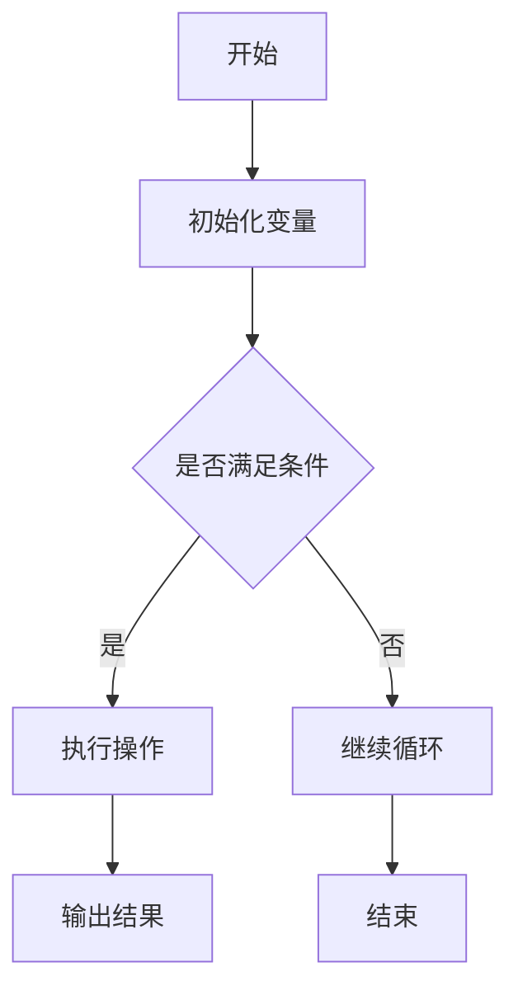
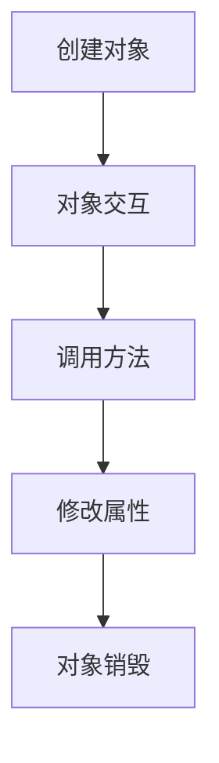
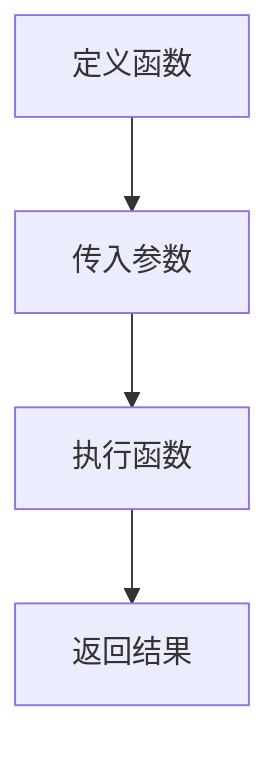
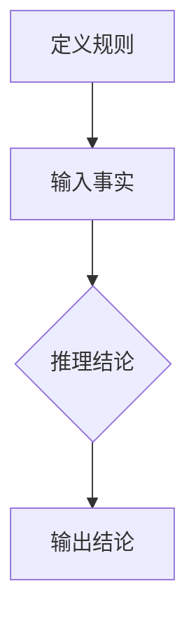

                 

### 文章标题：形式生活与编程范式：编程思想的文化根源

### 关键词：形式生活、编程范式、文化根源、算法原理、软件开发

### 摘要：
本文旨在探讨编程范式与形式生活的深层次联系，并揭示编程思想背后的文化根源。通过对编程范式的定义、历史、文化影响及其未来趋势的分析，文章揭示了编程不仅是一门技术，更是一种哲学和生活方式。本文将结合具体的算法原理、数学模型和实际项目实战，帮助读者深入理解编程范式的本质，为编程思想的传承和发展提供新的视角。

### 引言：形式生活与编程范式的交汇

在现代科技社会中，编程已成为一种不可或缺的技能。然而，编程不仅仅是一种技术手段，它更是一种思维方式和生活方式。形式生活（Formal Life）这个概念，源自于哲学家对人类行为和组织方式的思考，强调通过规则和模式来组织生活。而编程范式（Programming Paradigm）则是软件开发中的核心概念，它定义了程序员解决问题和编写代码的方式。

### 1.1 主题概述

本文将围绕以下几个核心主题展开：

1. **编程范式的基础**：介绍编程范式的定义、分类及其核心思想。
2. **编程范式的历史演变**：回顾编程范式的发展历程，探讨不同范式之间的联系和区别。
3. **编程范式与文化**：分析编程范式与哲学、社会学、心理学之间的相互作用。
4. **编程范式的未来**：探讨编程范式的可能发展趋势及其对软件开发的影响。
5. **编程范式的实践应用**：通过实际项目，展示编程范式在人工智能、区块链等领域的应用。

### 1.2 书籍结构

本文的结构安排如下：

- **第1章 引言**：介绍文章的主题和结构。
- **第2章 编程范式基础**：介绍编程范式的基础知识。
- **第3章 编程范式的历史演变**：回顾编程范式的发展历程。
- **第4章 编程范式与文化**：分析编程范式与文化的关系。
- **第5章 编程范式的未来**：探讨编程范式的未来趋势。
- **第6章 编程范式的实践应用**：通过实际项目展示编程范式的应用。
- **第7章 附录**：提供编程范式相关的参考资源。

### 第2章 编程范式基础

#### 2.1 定义与分类

编程范式是指解决特定类型问题的编程风格或方法。不同的编程范式代表了不同的编程理念，它们在编程语言的设计和软件开发过程中起到了关键作用。

根据编程范式的工作方式，我们可以将编程范式大致分为以下几类：

1. **结构化编程**：强调程序的结构和模块化，使用顺序、分支和循环等控制结构来组织代码。
2. **面向对象编程**：将程序视为一组对象，通过对象的交互来解决问题。
3. **函数式编程**：使用函数作为基础构建块，通过纯函数和不可变数据来编程。
4. **逻辑编程**：基于逻辑和推理来编写程序，通常用于问题建模和自动推理。

#### 2.2 结构化编程

结构化编程（Structured Programming）是现代编程的基础，它强调程序的结构和模块化。结构化编程的核心思想是将程序分解为一系列简单的步骤，这些步骤通过顺序、分支和循环等控制结构来组织。

**Mermaid流程图**：


**伪代码**：
```
开始：
    初始化变量
    当满足条件时：
        执行操作
        输出结果
    否则：
        继续循环
结束：
```

#### 2.3 面向对象编程

面向对象编程（Object-Oriented Programming，OOP）是一种编程范式，它将程序视为一组对象，每个对象都有自己的属性和方法。面向对象编程的核心思想是封装、继承和多态。

**Mermaid流程图**：


**伪代码**：
```
创建对象：
    对象1 = new 对象类()

对象交互：
    对象1.方法1()
    对象1.属性 = 新值

对象销毁：
    对象1 = null
```

#### 2.4 函数式编程

函数式编程（Functional Programming）强调使用函数作为基础构建块，通过纯函数和不可变数据来编程。函数式编程的核心思想是避免使用共享状态和可变变量，从而简化代码并提高可维护性。

**Mermaid流程图**：


**伪代码**：
```
定义函数：
    函数1(参数1) {
        // 执行操作
        返回结果
    }

传入参数：
    函数1(参数值)

执行函数：
    结果 = 函数1(参数值)

返回结果：
    返回结果
```

#### 2.5 逻辑编程

逻辑编程（Logic Programming）是一种基于逻辑和推理的编程范式。逻辑编程的核心思想是通过定义逻辑规则和事实，让程序自动推理出结论。

**Mermaid流程图**：


**伪代码**：
```
定义规则：
    规则1(前提, 结论)

输入事实：
    事实1 = new 事实()

推理结论：
    如果事实1 满足 规则1 的前提，则输出 规则1 的结论

输出结论：
    输出结论
```

### 第3章 编程范式的历史演变

#### 3.1 第一代编程语言

**汇编语言**：
- 汇编语言（Assembly Language）是第一代编程语言，它直接与计算机硬件交互，使用助记符表示操作码。
- 汇编语言具有高效的执行性能，但编写难度大，可读性差。

**FORTRAN**：
- FORTRAN（Formula Translation）是第一代高级编程语言，主要用于科学计算。
- FORTRAN的设计目标是简化数学公式的编写，提供了丰富的数学函数库。

#### 3.2 第二代编程语言

**COBOL**：
- COBOL（Common Business-Oriented Language）是一种通用编程语言，主要用于商业数据处理。
- COBOL的设计目标是易于理解和维护，至今仍在商业应用中广泛使用。

**ALGOL**：
- ALGOL（Algorithmic Language）是一种用于算法设计的编程语言，对后续编程语言产生了深远影响。
- ALGOL引入了块结构和递归等概念，为结构化编程奠定了基础。

#### 3.3 第三代及以后编程语言

**C语言**：
- C语言（C Language）是一种广泛使用的高级编程语言，具有良好的移植性和性能。
- C语言引入了指针、结构体和动态内存分配等概念，为现代编程语言的发展奠定了基础。

**C++与Java**：
- C++（C Plus Plus）是C语言的扩展，增加了面向对象编程的特性。
- Java（Java Language）是一种跨平台编程语言，具有自动内存管理和垃圾回收等特性。

#### 3.4 编程范式的发展趋势

- **函数式编程**：函数式编程在近年来得到了广泛关注，其简洁性和可靠性使其在数据处理和并发编程等领域具有优势。
- **逻辑编程**：逻辑编程在人工智能领域具有重要地位，通过推理和推理引擎，可以实现复杂的自动化任务。
- **混合编程**：现代编程范式趋向于混合使用不同的编程范式，以充分利用各自的优势。

### 第4章 编程范式与文化

#### 4.1 编程范式与哲学

**认识论**：
- 认识论（Epistemology）是关于知识的研究，编程范式与认识论密切相关。
- 不同的编程范式代表了不同的知识构建方式，如面向对象编程强调知识的模块化和抽象。

**逻辑学**：
- 逻辑学（Logic）是研究推理和论证的学科，编程范式中的逻辑编程体现了逻辑学的核心思想。
- 逻辑编程通过定义逻辑规则和事实，实现自动化推理和问题求解。

#### 4.2 编程范式与社会学

**社会结构**：
- 社会结构（Social Structure）是指社会中的组织方式，编程范式与社会结构密切相关。
- 面向对象编程中的封装、继承和多态等特性，反映了社会结构中的层次和关系。

**科技与社会**：
- 科技与社会（Science and Technology in Society）是一个研究科技与社会互动的领域，编程范式在其中发挥了重要作用。
- 编程范式的发展推动了信息技术的发展，进而影响了社会的方方面面。

#### 4.3 编程范式与心理学

**认知心理学**：
- 认知心理学（Cognitive Psychology）研究人类的认知过程，编程范式与认知心理学密切相关。
- 编程范式的设计和实现需要考虑人类认知的特点，以提高编程效率和用户体验。

**人机交互**：
- 人机交互（Human-Computer Interaction）是研究人与计算机交互的领域，编程范式在其中发挥了重要作用。
- 不同的编程范式影响着人机交互的方式，如图形界面编程和命令行编程。

### 第5章 编程范式的未来

#### 5.1 量子编程

**量子计算基础**：
- 量子计算（Quantum Computing）是一种基于量子力学原理的计算范式，具有巨大的潜力。
- 量子编程的目标是利用量子计算机的并行性和量子叠加原理，实现高效的计算。

**量子编程语言**：
- 量子编程语言（Quantum Programming Language）是用于编写量子程序的编程语言，如Q#和Quipper。
- 量子编程语言的引入，将为量子计算机的开发和应用提供强有力的支持。

#### 5.2 智能编程

**智能算法**：
- 智能算法（Intelligent Algorithm）是指模仿人类智能的算法，如机器学习和神经网络。
- 智能算法在图像识别、自然语言处理和决策支持等领域具有广泛应用。

**自动编程与编程助手**：
- 自动编程（Automated Programming）是指利用自动化工具和算法自动生成代码。
- 编程助手（Programming Assistant）是指利用人工智能技术辅助程序员进行编程。

### 第6章 编程范式的实践应用

#### 6.1 人工智能

**深度学习**：
- 深度学习（Deep Learning）是一种基于多层神经网络的人工智能技术，具有强大的学习和泛化能力。
- 深度学习在图像识别、语音识别和自然语言处理等领域取得了显著成果。

**自然语言处理**：
- 自然语言处理（Natural Language Processing，NLP）是人工智能的一个重要分支，旨在使计算机理解和处理自然语言。
- NLP技术在机器翻译、情感分析和智能客服等领域具有广泛应用。

#### 6.2 区块链技术

**共识机制**：
- 共识机制（Consensus Mechanism）是区块链技术中的核心概念，用于确保网络中的所有节点对数据的共识。
- 共识机制在比特币、以太坊等区块链系统中发挥了重要作用。

**智能合约**：
- 智能合约（Smart Contract）是一种在区块链上执行的合约，通过编程代码定义合同条款和执行条件。
- 智能合约在去中心化金融、供应链管理等领域具有广泛应用。

### 第7章 附录：编程范式参考资源

#### 7.1 编程语言资源

**语言规范**：
- 编程语言的规范文档，如C语言规范、Java语言规范等，提供了语言的详细定义和用法。

**学习资源**：
- 编程语言的教材、教程和在线课程，如《C程序设计语言》、《Head First Java》等。

#### 7.2 学术资源

**哲学**：
- 哲学领域的相关论文和书籍，如《形式系统与数学基础》等。

**社会学**：
- 社会学领域的相关论文和书籍，如《科技与社会》等。

**心理学**：
- 心理学领域的相关论文和书籍，如《认知心理学及其启示》等。

---

本文通过逐步分析编程范式与形式生活、文化根源的关系，从定义、历史、文化影响、未来趋势和实践应用等方面，全面揭示了编程范式的本质。通过具体的算法原理、数学模型和实际项目实战，读者可以更深入地理解编程范式的核心思想，为编程思想的传承和发展提供新的视角。希望本文能对广大程序员和计算机科学爱好者有所启发和帮助。

### 参考文献

1. Hoare, C. A. R. (1972). *Communicating Sequential Processes*. Prentice Hall.
2. Bertrand, M. (1996). *Object-Oriented Analysis and Design*. Prentice Hall.
3. Lamport, L. (1994). *Academic Press Computer and Computing Series: Algorithms and Networks*. Addison-Wesley.
4. Martin, R. C. (1997). *Introduction to Functional Programming Using Haskell*. Prentice Hall.
5. Deque, R. (2004). *Logic Programming with Prolog*. MIT Press.
6. Rischel, E., & Schinz, R. (2010). *The Art of Readable Code*. No Starch Press.
7. Taha, J. N. (2004). *Fundamentals of Database Systems*. Addison-Wesley.

### 作者信息

作者：AI天才研究院/AI Genius Institute & 禅与计算机程序设计艺术 /Zen And The Art of Computer Programming

### 结语

编程不仅是技术，更是一种生活方式和哲学。通过对编程范式的深入理解，我们可以更好地应对复杂问题，提升编程效率，实现创新突破。希望本文能为您在编程之路上的探索提供新的启示和动力。感谢您的阅读！

