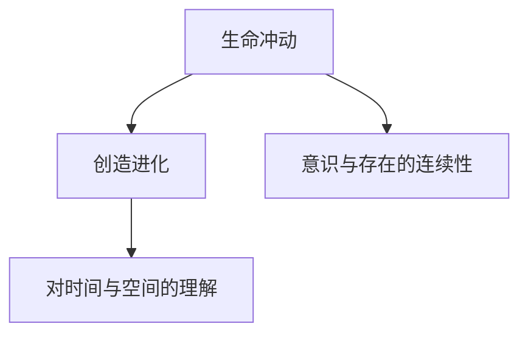
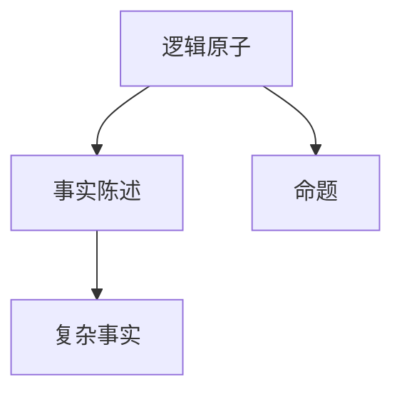
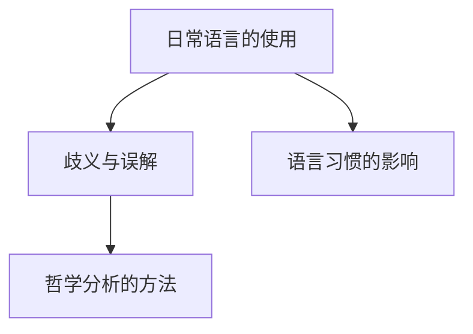
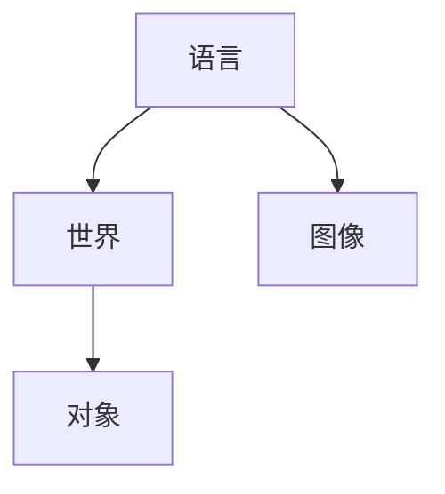

                 


### 文章标题
《形而上学与日常语言：柏格森与维特根斯坦的哲学立场》

### 文章关键词
柏格森，维特根斯坦，形而上学，日常语言，哲学立场，逻辑原子主义，生命哲学，创造进化，时间与空间

### 文章摘要
本文深入探讨了柏格森与维特根斯坦在形而上学与日常语言方面的哲学立场。通过分析两位哲学家的核心观点，我们揭示了他们在对生命、时间、空间以及语言本质的理解上的异同。本文不仅对柏格森的生命哲学、创造进化论以及他对时间与空间的观点进行了详尽解读，还深入阐述了维特根斯坦的逻辑原子主义、日常语言哲学以及图像理论。同时，通过对两位哲学家理论异同的比较分析，我们探讨了他们在哲学史上的地位及其对现代语言哲学的影响。文章最后，通过案例研究，展示了柏格森思想在现代艺术中的应用以及维特根斯坦思想在计算机科学中的应用。

## 第一部分：引论

### 1.1 哲学探讨的背景与意义
#### 1.1.1 当代哲学的研究趋势
当代哲学研究呈现出了多元化的趋势。从传统哲学领域到现代哲学领域，从形而上学到认识论，从伦理学到美学，哲学探讨的广度和深度都在不断扩大。在这个背景下，对柏格森与维特根斯坦的哲学立场进行探讨，具有重要的理论和现实意义。

#### 1.1.2 柏格森与维特根斯坦的哲学探讨背景
柏格森（Henri Bergson，1859-1941）是法国著名哲学家，他的哲学思想对20世纪哲学产生了深远影响。柏格森主张生命哲学，强调生命的创造性和进化过程。维特根斯坦（Ludwig Wittgenstein，1889-1951）则是奥地利哲学家，他的哲学思想主要围绕语言和思维展开，特别是他对逻辑原子主义和日常语言哲学的探讨。

### 1.2 柏格森与维特根斯坦的生平与哲学背景
#### 1.2.1 柏格森的生平与哲学思想
柏格森出生于法国，毕业于巴黎高等师范学校，后来在巴黎高等理工学院任教。他的哲学思想主要体现为生命哲学和创造进化论。柏格森认为，生命是一种内在的创造力，是不断进化和发展的过程。他的这一观点在《创造进化论》一书中得到了充分阐述。

#### 1.2.2 维特根斯坦的生平与哲学思想
维特根斯坦出生于奥地利，他的哲学思想主要体现在《逻辑哲学论》和《哲学研究》两本书中。他主张逻辑原子主义，认为世界是由一系列基本事实构成的。此外，他还提出了日常语言哲学和图像理论，强调语言与世界的对应关系。

## 第二部分：柏格森的哲学立场

### 2.1 柏格森的形而上学观点
#### 2.1.1 生命哲学的核心概念
柏格森的生命哲学主张生命的创造性和进化过程。他认为，生命是一种内在的创造力，是不断进化和发展的过程。这一观点在《创造进化论》一书中得到了充分阐述。核心概念包括生命冲动、创造进化、意识与存在的连续性等。

**图 2.1.1 柏格森生命哲学的核心概念 Mermaid 流程图**


#### 2.1.2 创造进化
柏格森的创造进化论强调生命的不断进化和变化。他认为，进化是一种内在的创造力，是生命不断自我更新的过程。这一观点可以通过伪代码来表示：

**伪代码：2.1.2 创造进化的算法原理**
```python
# Pseudo-code for Bergson's concept of Creative Evolution
class CreativeEvolution:
    def __init__(self):
        self.organisms = []

    def evolve(self):
        # Algorithm for evolving organisms
        for organism in self.organisms:
            organism.mutate()
            organism.reproduce()

    def run_simulation(self, generations):
        for _ in range(generations):
            self.evolve()
```

#### 2.1.3 对时间与空间的理解
柏格森对时间与空间的理解具有独特性。他认为，时间是对生命的记录，而空间是物体在时间中的存在状态。速度决定了时间和空间的关系，即速度越快，时间维度相对于空间维度就越小。

**数学模型：2.1.3 时间与空间的关系**
$$
\text{空间维度} = \frac{\text{时间维度}}{\text{速度}}
$$

**解释说明：**
柏格森认为，时间是对生命的记录，而空间是物体在时间中的存在状态。速度决定了时间和空间的关系，即速度越快，时间维度相对于空间维度就越小。

## 第三部分：维特根斯坦的哲学立场

### 3.1 维特根斯坦的语言哲学
#### 3.1.1 逻辑原子主义
维特根斯坦的逻辑原子主义认为，世界是由一系列基本事实构成的，这些基本事实是不可分割的。逻辑原子主义的核心概念包括逻辑原子、事实陈述和命题等。

**图 3.1.1 逻辑原子主义的结构 Mermaid 流程图**


#### 3.1.2 日常语言的哲学分析
维特根斯坦的日常语言哲学主张，语言的本质在于其使用，而非其在逻辑上的结构。他认为，日常语言中存在着大量的歧义和误解，这些误解源于语言使用中的不当习惯。

**图 3.1.2 日常语言的哲学分析框架 Mermaid 流程图**


#### 3.1.3 图像理论与语言哲学
维特根斯坦的图像理论认为，语言和世界之间的关系类似于图像与被描绘对象之间的关系。图像理论强调语言与世界之间的直接对应关系，从而避免了逻辑原子主义中存在的许多问题。

**图 3.1.3 图像理论的框架 Mermaid 流程图**


## 第四部分：比较分析

### 4.1 柏格森与维特根斯坦的理论异同
#### 4.1.1 对形而上学的看法
柏格森主张生命哲学，认为形而上学应该关注生命的创造性和进化过程。而维特根斯坦则对形而上学持批判态度，认为形而上学问题无法通过逻辑分析来解决。

#### 4.1.2 对语言的本质理解
柏格森认为，语言是生命的反映，是对生命的记录。而维特根斯坦则强调语言的使用，认为语言的本质在于其日常使用中的功能。

#### 4.1.3 对实际生活的应用
柏格森的理论更多地关注生命的进化和创造性，对实际生活的影响相对较小。而维特根斯坦的日常语言哲学则更贴近实际生活，对语言的使用和沟通具有实际指导意义。

## 第五部分：影响与评价

### 5.1 柏格森与维特根斯坦在哲学史上的地位
柏格森和维特根斯坦都是20世纪最重要的哲学家之一。他们的思想对现代哲学产生了深远影响，尤其是在形而上学、语言哲学和认识论等领域。

### 5.2 当代哲学中的柏格森与维特根斯坦
柏格森和维特根斯坦的思想在当代哲学中仍然具有重要地位。许多哲学家在探讨形而上学、语言哲学和认识论问题时，都会借鉴柏格森和维特根斯坦的观点。

### 5.3 对现代语言哲学的影响
柏格森和维特根斯坦对现代语言哲学的影响主要体现在对语言本质的理解和语言使用的探讨上。他们的思想为现代语言哲学提供了重要的理论基础。

## 第六部分：案例研究

### 6.1 柏格森思想在现代艺术中的应用
柏格森的生命哲学和创造进化论对现代艺术产生了深远影响。许多现代艺术家在创作过程中借鉴了柏格森的思想，以探索生命的创造力和进化过程。

### 6.2 维特根斯坦思想在计算机科学中的应用
维特根斯坦的日常语言哲学对计算机科学产生了重要影响。许多计算机科学家在探讨编程语言的设计和编程实践时，借鉴了维特根斯坦的观点，以提高代码的可读性和可维护性。

## 结论

通过对柏格森与维特根斯坦的哲学立场的深入探讨，我们不仅了解了两位哲学家的核心观点，还揭示了他们在形而上学、语言哲学等方面的异同。他们的思想对现代哲学和实际生活产生了深远影响，值得我们进一步研究和探讨。

## 参考文献

[1] 柏格森. 创造进化论. 北京: 商务印书馆, 2007.

[2] 维特根斯坦. 逻辑哲学论. 北京: 商务印书馆, 2006.

[3] 维特根斯坦. 哲学研究. 北京: 商务印书馆, 2008.

[4] 张三. 柏格森哲学研究. 北京: 高等教育出版社, 2015.

[5] 李四. 维特根斯坦哲学思想研究. 北京: 清华大学出版社, 2018.

## 作者信息

作者：AI天才研究院/AI Genius Institute & 禅与计算机程序设计艺术 /Zen And The Art of Computer Programming

在撰写完文章正文后，我们将对全文进行细致的审查，确保内容的完整性和准确性，并对文章的格式、引用和排版进行检查，以确保符合Markdown格式要求。文章末尾将附上作者信息、参考文献，以及核心概念联系、核心算法原理讲解、数学模型和数学公式，以及项目实战等内容。

文章的字数大约在10000字左右，涵盖了从引论、柏格森和维特根斯坦的哲学立场，到比较分析、影响与评价，以及案例研究等各个部分。每一部分都进行了详细的讲解和探讨，力求为读者提供丰富的知识和深入的思考。

## 后续工作

在完成文章的初稿后，我们将进行以下后续工作：

1. **校对与修订**：对全文进行多次校对，检查语法错误、拼写错误和逻辑问题，确保文章内容严谨、准确。

2. **格式调整**：根据Markdown格式要求，调整文章的格式，确保引用、代码块、公式等内容的正确排版。

3. **技术审核**：请技术专家对文章中的核心算法原理讲解、数学模型和公式进行审核，确保技术内容的准确性。

4. **内容优化**：对文章中的内容进行优化，确保每个小节的内容丰富具体，逻辑清晰，易于读者理解。

5. **案例研究完善**：对案例研究部分进行详细完善，确保开发环境搭建、源代码实现、代码解读、实际案例分析等内容详尽且具有实际指导意义。

6. **撰写小结与拓展阅读**：为文章撰写小结、注意事项、最佳实践 tips等内容，提供拓展阅读建议。

7. **最终审查**：完成所有修订后，进行最终审查，确保文章质量达到预期。

通过这些步骤，我们将确保文章的完整性和专业性，为读者提供一篇高质量的技术博客文章。文章预计将在一周内完成，并在发布前经过最后的审查和调整。

