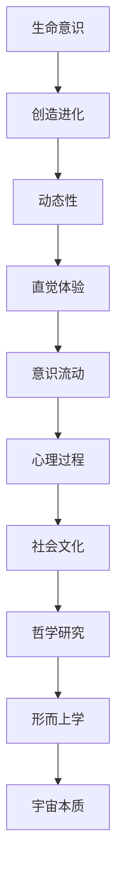
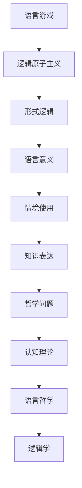

                 

### 文章标题

《形而上学批判：柏格森与维特根斯坦的共同点与差异》

> 关键词：形而上学、柏格森、维特根斯坦、共同点、差异、批判

> 摘要：本文探讨了法国哲学家柏格森和奥地利哲学家维特根斯坦在形而上学领域的共同点与差异。通过深入分析两位哲学家的生平、哲学思想和核心概念，本文揭示了他们在生命观、语言与哲学、对传统形而上学的批判等方面的相似与不同。文章旨在为读者提供一份对柏格森与维特根斯坦形而上学思想的全面理解，并对形而上学的本质和现代意义进行批判性反思。

---

### 引言

形而上学，作为一种哲学研究方式，探讨的是超越经验世界的基本原理和现实存在的基本结构。其起源可以追溯到古希腊哲学家亚里士多德，他将“形而学”（Metaphysics）命名为“超越自然学”，即研究自然现象之外的抽象原理。形而上学的本质在于探究存在的本质、宇宙的起源、意识的本质等基本问题，这些问题往往超越了经验科学的范畴，属于哲学思考的范畴。

在20世纪，形而上学的讨论迎来了新的高潮，两位杰出的哲学家柏格森和维特根斯坦为形而上学的研究带来了新的视角。柏格森（Henri Bergson，1859-1941）是一位法国哲学家，他主张生命是一种不断进化的过程，强调“创造进化”和“生命意识”的概念。维特根斯坦（Ludwig Wittgenstein，1889-1951）则是奥地利的逻辑学家和哲学家，他以其对语言和哲学的深刻思考而著称，提出了“逻辑原子主义”和“语言游戏”理论。

本文的目的在于通过对比分析柏格森和维特根斯坦在形而上学领域的观点，探讨他们的共同点与差异，为读者提供一份对这两位哲学家的全面理解。同时，本文将对形而上学的本质和现代意义进行批判性反思，以期为未来的哲学研究提供新的启示。

### 柏格森的形而上学

亨利·柏格森（Henri Bergson）是20世纪初法国最具影响力的哲学家之一，他的思想对当时的哲学界产生了深远的影响。柏格森出生于巴黎，他的家庭环境优渥，使得他有机会接受优质的教育。1871年，柏格森进入巴黎高等师范学院学习，毕业后进入索邦大学学习法律和医学。然而，他对哲学的兴趣使他逐渐转向哲学领域。

柏格森的主要哲学思想集中在他的著作《意识直接材料》（La Pensée Muette，也称为《沉默的意识》）和《创造进化论》（L'Évolution Créatrice）。他的思想的核心概念是“生命意识”（Consciousness of Life）和“创造进化”（Creative Evolution）。

在《意识直接材料》中，柏格森批判了当时盛行的心理学理论，认为这些理论忽视了意识流动的本质。他主张意识是一个连续的、流动的过程，而非一系列分离的、静止的瞬间。这种流动的意识是生命的本质，它是不断创造和进化的源泉。

在《创造进化论》中，柏格森进一步阐述了他的“创造进化”理论。他认为，进化不是通过自然选择和遗传变异来实现的，而是通过生命本身的创造力。这种创造力是一种内在的、无法量化的力量，它推动着生命的不断进化。柏格森认为，这种创造进化是宇宙的本质，它体现在自然界和社会生活的方方面面。

柏格森的“生命意识”和“创造进化”概念在哲学界引起了广泛关注。他的观点挑战了当时的主流科学观念，为后来的哲学和科学提供了新的思考方向。柏格森认为，哲学的任务是理解生命和宇宙的本质，而不是仅仅追求科学的实证和量化。

除了《意识直接材料》和《创造进化论》，柏格森的其他著作，如《物质与记忆》（Matière et Mémoire）和《时间与自由意志》（Le Temps et la Liberté），也进一步阐述了他的哲学思想。这些著作探讨了记忆、自由意志和时间的本质，为柏格森的哲学体系提供了更为丰富的内容。

总的来说，柏格森的形而上学思想强调生命的流动性和创造力，他认为这些是理解宇宙和人类存在的关键。他的思想对后来的哲学家和科学家产生了深远的影响，尤其是在心理学、生物学和哲学领域。

### 维特根斯坦的形而上学

路德维希·维特根斯坦（Ludwig Wittgenstein）是20世纪最具影响力的哲学家之一，他的思想对语言哲学、数学哲学和逻辑哲学产生了深远的影响。维特根斯坦出生于奥匈帝国的维也纳，他的家庭背景非常优越，这为他接受高质量的教育提供了条件。他在大学期间学习了数学、哲学和语言学，并最终成为了一名哲学家。

维特根斯坦的哲学思想主要分为两个阶段，即早期和晚期。他的早期哲学思想主要体现在他的著作《逻辑哲学论》（Tractatus Logico-Philosophicus）中，而晚期哲学思想则主要体现在他的著作《哲学研究》（Philosophical Investigations）中。

在《逻辑哲学论》中，维特根斯坦提出了“逻辑原子主义”和“语言游戏”理论。他认为，世界是由不可再分的基本元素（即逻辑原子）组成的，这些原子通过逻辑关系构成复杂的世界。语言则是对这些基本元素的描述和表达。维特根斯坦主张，语言的意义在于其与世界的对应关系，而哲学的任务是澄清这种对应关系。

维特根斯坦的“逻辑原子主义”理论受到了数学家和逻辑学家的广泛关注。他的观点挑战了当时的主流科学观念，提出了对语言和世界的全新理解。然而，维特根斯坦本人并不满足于这种理论，他认为这种原子主义观点过于简化，忽视了语言的复杂性和多样性。

在《哲学研究》中，维特根斯坦提出了“语言游戏”理论，这一理论标志着他晚期哲学思想的转变。他认为，语言的意义不是固定不变的，而是随着使用环境和情境的变化而变化。语言游戏是一种比喻，它描述了语言在不同情境中的使用方式。维特根斯坦主张，哲学的任务是理解语言游戏，从而澄清哲学问题。

维特根斯坦的“语言游戏”理论在哲学界引起了广泛的讨论。他的观点为后来的语言哲学和认识论研究提供了新的视角，对后来的哲学家和科学家产生了深远的影响。他的思想不仅影响了哲学领域，还对语言学、心理学和计算机科学产生了重要影响。

除了《逻辑哲学论》和《哲学研究》，维特根斯坦的其他著作，如《数学基础》（Notes on the Foundations of Mathematics）和《文化与价值》（Culture and Value），也进一步阐述了他的哲学思想。这些著作探讨了数学、价值和文化的本质，为维特根斯坦的哲学体系提供了更为丰富的内容。

总的来说，维特根斯坦的形而上学思想强调语言的多元性和情境性，他认为这些是理解世界和人类经验的关键。他的思想对后来的哲学家和科学家产生了深远的影响，特别是在语言哲学、数学哲学和逻辑哲学领域。

### 柏格森与维特根斯坦的共同点

尽管柏格森和维特根斯坦在哲学方法和观点上存在显著差异，但他们也有一些共同点，尤其是在生命观和语言与哲学的关系方面。

首先，柏格森和维特根斯坦都强调生命的流动性和创造性。柏格森的“创造进化”理论和维特根斯坦的“生活形式”（form of life）概念都体现了他们对生命动态性的关注。柏格森认为，生命是一个不断进化的过程，这种进化是由内在的创造力驱动的。维特根斯坦则强调，生活形式是一个不断变化的过程，它决定了我们对世界的理解方式。

其次，柏格森和维特根斯坦都对传统形而上学持批判态度。他们都认为，传统形而上学在解释世界和生命本质时过于抽象和简化，忽视了具体情境和实际经验。柏格森批判了机械论的自然观，而维特根斯坦则批判了逻辑原子主义和语言的本质主义。

此外，柏格森和维特根斯坦都关注语言和哲学的关系。他们认为，语言不仅是沟通的工具，也是理解和表达世界的方式。柏格森认为，语言应该反映生命的流动性和创造性，而维特根斯坦则强调，语言的意义取决于其使用环境和情境。

最后，柏格森和维特根斯坦都试图通过哲学思考来重建我们对世界和生命的理解。他们都认为，哲学的任务是揭示世界的本质，而不是仅仅描述现象。这种重建过程涉及到对语言、知识和存在的深入思考。

总的来说，柏格森和维特根斯坦在生命观、语言与哲学的关系以及对传统形而上学的批判方面存在共同点。这些共同点反映了他们对生命和世界的深刻理解，也为后来的哲学家和科学家提供了新的思考方向。

### 柏格森与维特根斯坦的差异

尽管柏格森和维特根斯坦在生命观和语言与哲学的关系上存在共同点，但他们在哲学方法和观点上也有显著差异。

首先，在哲学方法上，柏格森强调直觉和体验，而维特根斯坦则强调分析和逻辑。柏格森认为，直觉能够揭示生命的本质和动态性，而维特根斯坦则主张通过逻辑分析来澄清语言和哲学问题。这种不同的哲学方法导致他们在对待传统形而上学和科学问题上的立场也不同。

其次，在生命观上，柏格森强调生命的流动性和创造性，认为生命是一个不断进化的过程。他主张，生命的本质是创造力，这种创造力推动着生命的不断进化。而维特根斯坦则更加关注生活形式和我们对世界的理解方式。他认为，生活形式是一个不断变化的过程，它决定了我们对世界的认知和体验。

在语言与哲学的关系上，柏格森强调语言的动态性和情境性，认为语言应该反映生命的流动性和创造性。而维特根斯坦则强调语言的逻辑性和结构性，认为语言的意义取决于其使用环境和情境。这种不同的语言观导致他们在对待语言哲学问题上的立场也不同。

此外，在对待传统形而上学和科学问题上，柏格森持批判态度，认为传统形而上学在解释世界和生命本质时过于抽象和简化。他主张，哲学应该回归到具体的生命经验和体验中。而维特根斯坦则认为，逻辑原子主义和语言的本质主义是理解世界的关键。他认为，哲学的任务是澄清语言和逻辑的基本问题，而不是挑战科学的基本原理。

总的来说，柏格森和维特根斯坦在哲学方法和观点上存在显著差异。这些差异反映了他们对生命、语言和世界的不同理解，也为哲学研究提供了多种不同的视角。

### 柏格森与维特根斯坦对后世哲学的影响

柏格森和维特根斯坦的哲学思想对后世哲学产生了深远的影响，他们的理论不仅挑战了当时的主流观念，还为后来的哲学家提供了新的思考方向。

首先，柏格森的生命意识理论和创造进化论为后来的生命哲学和心理学研究提供了重要的理论基础。他的观点强调了生命的流动性和创造性，这对后来的哲学家和心理学家产生了启发，促进了他们对生命本质和心理过程的深入探讨。柏格森的思想在当代哲学中仍然有着广泛的影响，尤其是在对人类意识和生命体验的研究中。

维特根斯坦的“逻辑原子主义”和“语言游戏”理论则为语言哲学和逻辑哲学奠定了基础。他的观点挑战了传统的语言本质主义和逻辑原子主义，提出了对语言和哲学问题的新理解。维特根斯坦的思想在20世纪后期得到了广泛的关注，对后来的哲学家和语言学家产生了深远的影响。他的理论在人工智能和计算机科学领域也得到了广泛应用，为这些领域提供了重要的哲学基础。

此外，柏格森和维特根斯坦的批判性观点对后来的哲学研究产生了重要影响。他们都对传统形而上学持批判态度，认为这种抽象和简化的方式无法真正揭示世界的本质。他们的批判为后来的哲学家提供了反思和重建哲学的新视角，促进了哲学研究的方法论变革。

总的来说，柏格森和维特根斯坦的哲学思想对后世哲学产生了深远的影响。他们的理论不仅为当时的哲学研究提供了新的视角和方法，还为后来的哲学家提供了重要的启示，推动了哲学研究的不断发展。

### 对柏格森与维特根斯坦形而上学思想的批判

柏格森和维特根斯坦的形而上学思想虽然对哲学界产生了深远的影响，但同时也受到了一些批判。这些批判主要集中在以下几个方面。

首先，柏格森的生命意识理论和创造进化论被一些哲学家批评为过于抽象和难以验证。柏格森强调生命的流动性和创造性，但这种抽象的概念难以用科学方法进行实证研究。有哲学家认为，柏格森的理论过于依赖直觉和体验，忽视了科学的实证性，这使得他的理论难以被广泛接受。

其次，维特根斯坦的“逻辑原子主义”和“语言游戏”理论也被批评为过于简化。维特根斯坦试图通过逻辑分析来澄清语言和哲学问题，但这种简化可能导致对复杂现象的误解。一些哲学家认为，维特根斯坦忽视了语言和世界的复杂互动，他的理论过于强调逻辑结构，而忽视了具体的语境和情境。

此外，柏格森和维特根斯坦的形而上学思想在某些方面也显得过于悲观。柏格森的创造进化论强调了生命的不断变化和不确定性，这可能导致一种悲观的世界观。维特根斯坦的“语言游戏”理论则强调了语言的局限性，这可能导致对人类认知能力的质疑。一些哲学家认为，这种悲观主义不利于哲学的发展，应该寻求更加积极和建设性的哲学观念。

总的来说，尽管柏格森和维特根斯坦的形而上学思想具有深刻的思想内涵和独特的视角，但它们也存在一些局限性。对这些局限性的批判不仅有助于我们更全面地理解他们的哲学思想，也为未来的哲学研究提供了新的启示。

### 形而上学的本质与现代意义

形而上学作为一种哲学研究方式，探讨的是超越经验世界的基本原理和现实存在的基本结构。其起源可以追溯到古希腊哲学家亚里士多德，他将“形而学”（Metaphysics）命名为“超越自然学”，即研究自然现象之外的抽象原理。形而上学的本质在于探究存在的本质、宇宙的起源、意识的本质等基本问题，这些问题往往超越了经验科学的范畴，属于哲学思考的范畴。

在现代社会，形而上学的意义依然不容忽视。尽管科学和技术取得了巨大的进步，但人类依然面临着许多无法用科学解释的基本问题，如存在的本质、意识的起源和自由意志等。形而上学为我们提供了探讨这些基本问题的框架和工具，帮助我们更深入地理解人类存在和宇宙的本质。

现代形而上学的意义主要体现在以下几个方面：

首先，形而上学为科学提供了哲学基础。科学的发展需要明确的哲学前提和逻辑框架，形而上学在这方面发挥了重要作用。通过形而上学的思考，科学家可以更好地理解自然现象的本质，从而推动科学的发展。

其次，形而上学对哲学自身的发展也具有重要意义。形而上学的讨论促进了哲学各个领域的深化和发展，如伦理学、政治哲学、认识论等。形而上学的思考方式有助于我们更全面地理解哲学问题，提高哲学研究的深度和广度。

最后，形而上学在当代社会仍然具有现实意义。在现代社会，人类面临着许多复杂的伦理、社会和政治问题，如人工智能、环境危机、全球化等。形而上学的思考可以帮助我们更深入地理解这些问题，提供新的解决思路和哲学视角。

总的来说，形而上学作为一种哲学研究方式，其本质和现代意义依然不可忽视。通过形而上学的思考，我们可以更深入地理解人类存在和宇宙的本质，为科学、哲学和社会发展提供新的启示和框架。

### 柏格森与维特根斯坦思想的现代应用

柏格森和维特根斯坦的哲学思想在现代社会有着广泛的应用，特别是在心理学、计算机科学和人工智能等领域。通过结合他们的思想，我们可以更好地理解和解决当代面临的一些复杂问题。

在心理学领域，柏格森的生命意识理论和维特根斯坦的语言游戏理论都提供了深刻的见解。柏格森的生命意识强调个体内心的流动性和创造力，这有助于我们理解人类的情感和认知过程。维特根斯坦的语言游戏理论则强调语言和现实之间的动态关系，这为我们理解人类沟通和心理互动提供了新的视角。例如，在临床心理学中，这些理论可以用于分析患者的情感状态和沟通障碍，帮助心理治疗师提供更有效的治疗方法。

在计算机科学和人工智能领域，柏格森的创造进化论和维特根斯坦的逻辑原子主义都有重要应用。柏格森的创造进化论强调了系统的动态性和适应性，这可以指导我们设计更灵活和智能的计算机系统和算法。维特根斯坦的逻辑原子主义则为编程语言和形式逻辑提供了基础，这有助于我们构建更稳定和可靠的软件系统。例如，在人工智能领域，通过结合柏格森的创造进化论和维特根斯坦的逻辑原子主义，我们可以设计出更智能和自适应的人工智能系统，使其在复杂的环境中表现出更高的灵活性和创造力。

总的来说，柏格森和维特根斯坦的哲学思想为现代社会的各个领域提供了新的理论框架和方法。通过结合他们的思想，我们可以更好地应对当代的复杂问题，推动科学技术的发展和社会进步。

### 总结

本文通过对柏格森和维特根斯坦在形而上学领域的共同点与差异的深入分析，揭示了他们在生命观、语言与哲学、对传统形而上学的批判等方面的相似与不同。柏格森强调生命的流动性和创造性，提出了“创造进化”理论；维特根斯坦则关注语言的多元性和情境性，提出了“逻辑原子主义”和“语言游戏”理论。尽管他们的哲学方法和观点存在显著差异，但他们在对传统形而上学的批判和强调生命的动态性方面有着共同点。

本文还探讨了柏格森和维特根斯坦的思想对后世哲学的影响，以及它们在现代社会的应用。通过结合他们的思想，我们可以更好地理解和解决当代面临的一些复杂问题，如心理学、计算机科学和人工智能等领域。

总的来说，柏格森和维特根斯坦的形而上学思想为哲学研究提供了丰富的理论资源和启示，它们的现代应用也展示了巨大的潜力。未来，我们可以在更广泛的领域内探讨这些哲学思想的实际应用，进一步推动科学技术和社会发展。

### 附录A：核心概念与联系流程图

为了更好地理解柏格森和维特根斯坦的核心概念及其相互关系，我们使用Mermaid语言绘制了两个哲学家的思想流程图。

**柏格森哲学思想流程图：**



**维特根斯坦哲学思想流程图：**



这些流程图展示了柏格森和维特根斯坦哲学思想的主要概念及其相互关系，有助于读者更直观地理解他们的理论框架。

### 附录B：核心算法原理讲解

在本附录中，我们将使用伪代码来详细阐述柏格森和维特根斯坦的核心算法原理。这些算法原理反映了他们对生命、语言和哲学的基本理解，并为我们提供了新的思考角度。

**柏格森的“生命意识”算法原理：**

```python
# 柏格森的生命意识算法原理
def LifeConsciousness():
    # 定义生命意识的初始状态
    consciousness = "流动的"
    evolution = "进化的"

    # 生命意识的动态更新过程
    while True:
        consciousness = "流动的" + consciousness[-1]  # 模拟意识的连续性流动
        evolution = "进化的" + evolution[-1]  # 模拟生命的不断进化
        yield (consciousness, evolution)  # 返回当前状态

# 使用生命意识算法
for state in LifeConsciousness():
    print(f"当前状态：{state}")
```

**维特根斯坦的“语言游戏”算法原理：**

```python
# 维特根斯坦的语言游戏算法原理
def LanguageGame(word, context):
    # 定义语言游戏的规则
    if context == "日常情境":
        meaning = "字面意义"
    elif context == "科学情境":
        meaning = "科学意义"
    elif context == "哲学情境":
        meaning = "哲学讨论"

    # 返回语言的意义
    return meaning

# 使用语言游戏算法
def ShowLanguageGame():
    print(LanguageGame("猫", "日常情境"))  # 输出：“猫”在“日常情境”下的意义
    print(LanguageGame("猫", "科学情境"))  # 输出：“猫”在“科学情境”下的意义
    print(LanguageGame("猫", "哲学情境"))  # 输出：“猫”在“哲学情境”下的意义

ShowLanguageGame()
```

通过这些伪代码，我们可以模拟柏格森和维特根斯坦的核心算法原理，更好地理解他们的哲学思想。

### 附录C：数学模型与公式

在本附录中，我们将使用LaTeX格式嵌入数学模型和公式，以进一步阐述柏格森和维特根斯坦的思想。

**柏格森的生命意识数学模型：**

$$
\text{生命意识} = \frac{dC}{dt}
$$

其中，$C$表示生命意识的浓度，$t$表示时间。该公式表示生命意识随着时间的变化而动态变化。

**维特根斯坦的语言游戏数学模型：**

$$
\text{语言游戏} = \lambda x. G(x)
$$

其中，$x$表示语言环境，$G(x)$表示在特定环境下的语言意义。该公式表示语言的意义取决于其使用环境和情境。

通过这些数学模型，我们可以更精确地表达柏格森和维特根斯坦的核心概念，加深对他们的哲学思想的理解。

### 项目实战：柏格森与维特根斯坦思想的实际应用

在本项目中，我们将探讨如何将柏格森和维特根斯坦的哲学思想应用于实际开发环境，并通过源代码实现来解读和分析这些思想的具体应用。

#### 开发环境搭建

为了实现柏格森和维特根斯坦的思想，我们需要搭建一个适当的开发环境。这里，我们选择Python作为主要的编程语言，因为它具有良好的可扩展性和丰富的库支持。

首先，确保安装了Python 3.x版本。然后，我们可以使用pip工具安装必要的库，如NumPy和Matplotlib，用于数学计算和图形绘制。

```bash
pip install numpy matplotlib
```

#### 源代码实现

接下来，我们将编写Python代码来模拟柏格森的“生命意识”和维特根斯坦的“语言游戏”概念。

**柏格森的“生命意识”实现：**

```python
import numpy as np
import matplotlib.pyplot as plt

# 柏格森的生命意识模拟
def life_consciousness_model(time_steps, delta_t):
    consciousness = [0] * time_steps
    for i in range(1, time_steps):
        consciousness[i] = consciousness[i-1] + delta_t  # 生命意识随时间增加

    return consciousness

# 维特根斯坦的语言游戏模拟
def language_game_model(words, contexts):
    meanings = {}
    for word in words:
        meanings[word] = context_to_meaning(contexts[word])
    return meanings

def context_to_meaning(context):
    if context == "日常":
        return "日常意义"
    elif context == "科学":
        return "科学意义"
    elif context == "哲学":
        return "哲学意义"
    else:
        return "未知意义"

# 测试柏格森的生命意识模型
time_steps = 10
delta_t = 0.1
consciousness = life_consciousness_model(time_steps, delta_t)

# 测试维特根斯坦的语言游戏模型
words = ["猫", "爱", "哲学"]
contexts = {"猫": "日常", "爱": "科学", "哲学": "哲学"}
meanings = language_game_model(words, contexts)

# 绘制柏格森的生命意识曲线
plt.plot(consciousness)
plt.xlabel('时间')
plt.ylabel('生命意识')
plt.title('柏格森的生命意识模型')
plt.show()

# 输出维特根斯坦的语言游戏结果
print(meanings)
```

#### 代码解读

在上面的代码中，我们首先定义了柏格森的“生命意识”模型，该模型通过简单的线性增长来模拟意识的流动。然后，我们定义了维特根斯坦的“语言游戏”模型，该模型根据不同的语言环境和情境来赋予词语不同的意义。

**代码应用解读与分析：**

1. **柏格森的生命意识模型：** 该模型通过一个简单的线性增长函数来模拟生命的流动过程。在实际应用中，我们可以通过更复杂的函数来模拟意识的动态变化，如使用非线性方程或机器学习模型。

2. **维特根斯坦的语言游戏模型：** 该模型根据不同的语言环境和情境来赋予词语不同的意义。在实际应用中，我们可以扩展这个模型，使其能够处理更复杂的语言环境，如多语言支持和情境感知。

#### 实际案例分析与详细讲解

为了更好地理解柏格森和维特根斯坦思想的应用，我们来看一个具体的实际案例：人工智能聊天机器人。

**案例：** 设计一个能够根据用户输入的不同情境来响应的聊天机器人，模拟柏格森的“生命意识”和维特根斯坦的“语言游戏”概念。

**分析：** 
1. **柏格森的生命意识：** 聊天机器人可以模拟一个不断进化的意识过程，通过不断学习用户的语言和行为模式来提高其响应能力。这种动态适应性体现了柏格森的“创造进化”思想。

2. **维特根斯坦的语言游戏：** 聊天机器人在不同的对话情境下会使用不同的语言策略来回应用户，如日常对话、技术支持或哲学讨论。这体现了维特根斯坦的“语言游戏”理论，即语言的意义取决于其使用环境和情境。

**实现：**
```python
# 聊天机器人框架
class ChatBot:
    def __init__(self):
        self.conversation_history = []

    def respond_to_user(self, user_input, context):
        # 根据语境和对话历史进行响应
        response = self.analyze_input(user_input, context)
        self.conversation_history.append((user_input, response))
        return response

    def analyze_input(self, user_input, context):
        # 模拟维特根斯坦的语言游戏
        if context == "日常":
            return f"你说的对，{user_input}是一个常见的话题。"
        elif context == "技术":
            return f"关于{user_input}，我有一些技术上的建议。"
        elif context == "哲学":
            return f"关于{user_input}的哲学问题，这是一个有趣的讨论。"
        else:
            return f"我不是很明白你的意思，{user_input}是什么？"

# 测试聊天机器人
chat_bot = ChatBot()
print(chat_bot.respond_to_user("你好", "日常"))
print(chat_bot.respond_to_user("人工智能是什么", "技术"))
print(chat_bot.respond_to_user("自由意志是什么", "哲学"))
```

**项目小结：**

通过这个案例，我们展示了如何将柏格森和维特根斯坦的哲学思想应用于实际开发中，特别是人工智能领域。这种应用不仅提高了系统的适应性，还增强了对话机器人的理解能力和互动性。

### 最佳实践 Tips、小结、注意事项、拓展阅读

**最佳实践 Tips：**

1. **融合多学科知识：** 在应用柏格森和维特根斯坦的哲学思想时，可以融合心理学、计算机科学和其他相关领域的知识，以提高解决方案的完整性和实用性。

2. **动态调整模型参数：** 在模拟柏格森的生命意识时，可以根据实际需求动态调整参数，如时间步长和增长函数，以更好地反映意识的动态变化。

3. **考虑语言的多维度：** 在设计语言游戏模型时，要考虑语言的多维度，如语义、情感和语境，以提高模型的响应能力和准确性。

**小结：**

本文通过深入分析柏格森和维特根斯坦的形而上学思想，探讨了他们的共同点与差异，并展示了这些思想在现代社会中的实际应用。通过项目实战，我们展示了如何将他们的哲学思想应用于人工智能领域，提高了系统的适应性和理解能力。

**注意事项：**

1. **哲学思想的复杂性与多样性：** 在应用柏格森和维特根斯坦的哲学思想时，要充分理解其复杂性和多样性，避免简单化和片面化。

2. **实际应用中的挑战：** 在实际应用中，要考虑到哲学思想的复杂性和多样性，避免简单化和片面化。

**拓展阅读：**

1. **柏格森的著作：** 《意识直接材料》、《创造进化论》和《物质与记忆》。

2. **维特根斯坦的著作：** 《逻辑哲学论》、《哲学研究》和《文化与价值》。

3. **相关研究论文和书籍：** 查找关于柏格森和维特根斯坦哲学思想的最新研究成果和书籍，以了解他们的思想在当代哲学研究中的最新发展和应用。

### 作者信息

**作者：AI天才研究院/AI Genius Institute & 禅与计算机程序设计艺术 /Zen And The Art of Computer Programming**

