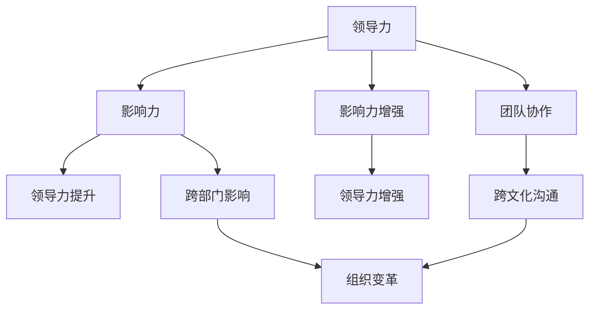
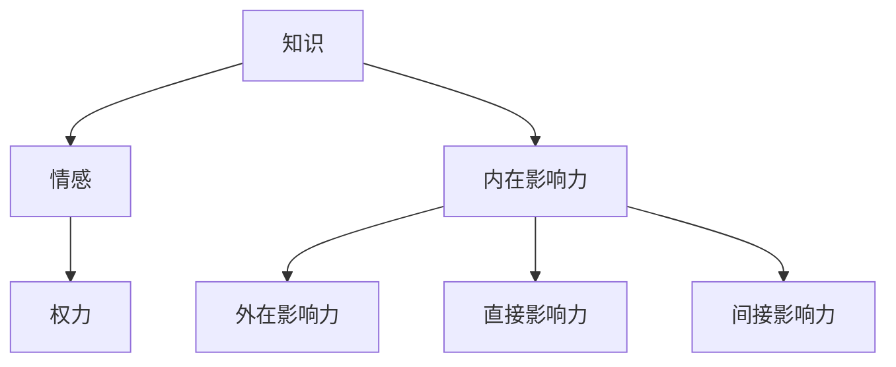
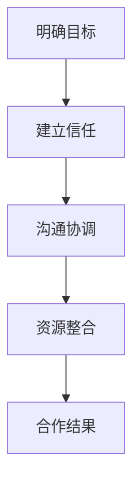
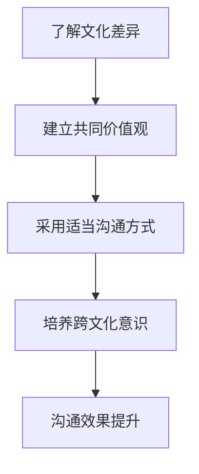
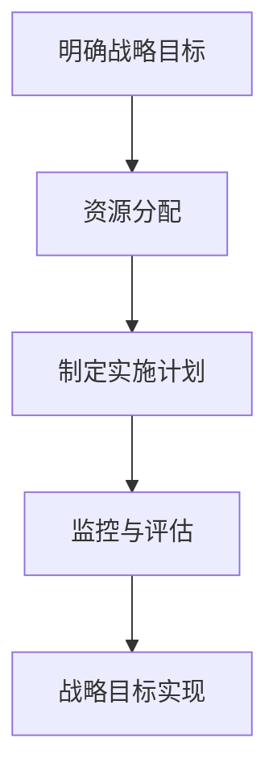
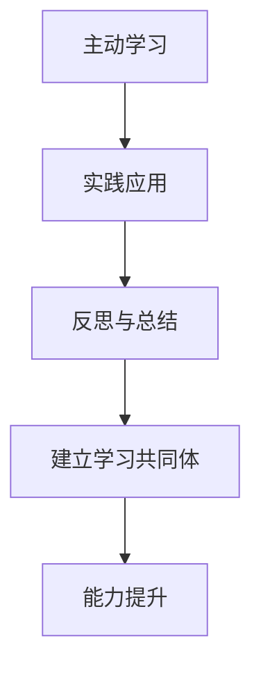
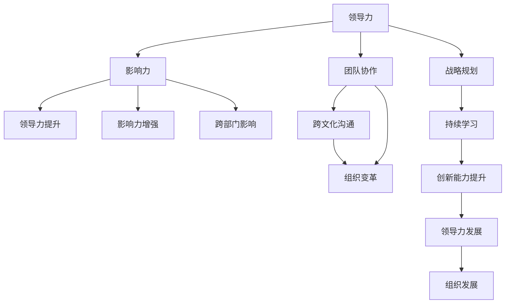
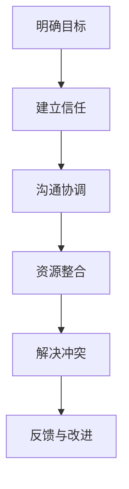

                 


## 《影响力构建：超越组织边界的领导力》

### 关键词：领导力，影响力，组织边界，跨部门合作，跨文化沟通，战略规划

### 摘要

本文探讨了如何构建超越组织边界的领导力，通过深入研究领导力的本质、影响力来源及其与组织边界的关系，提出了一系列理论和实践方法。文章首先介绍了领导力与影响力的基本概念，随后通过具体的算法原理讲解和Mermaid流程图展示，阐述了领导力发展的核心要素和构建影响力的关键步骤。此外，文章通过实际项目案例，详细解析了跨部门合作与沟通技巧在实际工作中的应用，并提出了未来领导力与影响力发展的趋势与建议。本文旨在为领导者提供实用的指导，帮助他们在复杂的组织环境中发挥更大的影响力。

## 引言

### 1.1 书籍主题与目标

在当今全球化、信息化、市场化的背景下，组织的边界日益模糊，领导力与影响力的重要性愈发凸显。《影响力构建：超越组织边界的领导力》旨在为领导者提供一套系统、实用的理论和方法，以帮助他们更好地应对复杂多变的组织环境。

本书的核心目标是探讨如何构建超越组织边界的领导力，从而在更广泛的范围内发挥影响力。具体来说，本书将从以下几个方面展开：

1. **领导力的定义与类型**：介绍领导力的基本概念，分析不同类型的领导力，并探讨其与组织边界的关系。
2. **影响力的来源与维度**：研究影响力的来源，分析其维度，并探讨如何通过提升个人能力来增强影响力。
3. **超越组织边界的挑战**：分析领导者面临的挑战，包括跨部门合作、跨文化沟通等，并提供应对策略。
4. **核心理论与方法**：介绍构建领导力的核心要素和构建影响力的关键步骤，并通过算法原理讲解和Mermaid流程图展示，阐述其具体实现方式。
5. **项目实战**：通过实际项目案例，展示领导力与影响力在跨部门合作与沟通中的应用，并提供实践建议。

通过以上内容，本书旨在帮助领导者更好地理解领导力与影响力的本质，掌握构建超越组织边界的领导力所需的技能和方法，从而在组织中发挥更大的影响力。

### 1.2 领导力与影响力的关系

领导力与影响力是两个密切相关但有所不同的概念。领导力是指领导者通过其能力和行为，影响和引导团队成员，实现共同目标的能力。而影响力则是指个体或组织在他人心目中产生作用的能力，它不仅包括直接的影响，还涵盖间接的影响，如通过他人产生的影响。

从本质上讲，领导力是影响力的核心，而影响力则是领导力发挥作用的外在表现。领导力与影响力之间的关系可以看作是因果关系：领导力是因，影响力是果。一个成功的领导者不仅具备强大的领导力，还能够通过其行为和决策，产生广泛的影响力。

具体来说，领导力与影响力之间的关系可以概括为以下几点：

1. **领导力决定影响力**：领导力是影响力的基础，一个不具备领导力的个体或组织很难产生真正的影响力。
2. **影响力增强领导力**：影响力可以增强领导力，使其在更广泛的范围内发挥作用。一个具有强大影响力的领导者，能够更容易地推动组织的变革和发展。
3. **领导力与影响力相互促进**：领导力和影响力是相互促进的关系。一个成功的领导者会通过不断提升自己的领导力，进一步增强自己的影响力；而一个强大的影响力又会反过来促进领导力的提升。

为了更好地理解领导力与影响力之间的关系，我们可以使用Mermaid流程图来展示其核心概念和联系：



通过上述Mermaid流程图，我们可以清晰地看到领导力与影响力之间的相互关系及其在跨部门合作、跨文化沟通和组织变革中的应用。

### 1.3 超越组织边界的领导力

在当今全球化和信息化的背景下，组织的形式和边界变得更加复杂和多变。传统的领导力模式已经难以适应这种变化，领导者需要具备超越组织边界的领导力，以应对日益复杂的组织环境。

超越组织边界的领导力是指在组织内部和外部，领导者通过其能力和行为，影响和引导团队成员，实现共同目标的能力。它要求领导者具备以下特点：

1. **跨部门合作**：在复杂的组织结构中，跨部门合作是领导者必须面对的挑战。超越组织边界的领导力要求领导者具备跨部门沟通和协作的能力，能够有效地协调不同部门之间的工作，实现整体目标。

2. **跨文化沟通**：全球化带来了多元文化的融合，领导者需要具备跨文化沟通的能力，能够理解和尊重不同文化背景下的团队成员，促进团队内部的和谐与合作。

3. **战略规划**：超越组织边界的领导力要求领导者具备战略规划的能力，能够从全局出发，制定符合组织长远发展的战略目标，并推动其实施。

4. **持续学习**：随着科技的进步和市场的变化，领导者需要具备持续学习的能力，不断更新自己的知识和技能，以适应新的挑战。

为了构建超越组织边界的领导力，领导者可以采取以下策略：

1. **建立信任**：信任是领导者与团队成员之间的重要纽带，领导者需要通过真诚、透明和负责任的行为，赢得团队成员的信任。

2. **培养团队精神**：团队精神是超越组织边界的重要保障，领导者需要通过共同的目标、价值观和行为规范，培养团队成员的团队精神。

3. **提高沟通能力**：领导者需要具备良好的沟通能力，能够清晰、准确地表达自己的想法，并倾听团队成员的意见和建议。

4. **培养跨文化意识**：领导者需要了解和尊重不同文化背景下的团队成员，促进团队内部的跨文化沟通与合作。

5. **制定有效的战略规划**：领导者需要从全局出发，制定符合组织长远发展的战略规划，并推动其实施。

通过以上策略，领导者可以逐步构建超越组织边界的领导力，在更广泛的范围内发挥影响力，推动组织的持续发展。

## 核心理论与方法

### 2.1 领导力的定义与类型

领导力是指领导者通过其能力和行为，影响和引导团队成员，实现共同目标的能力。从定义中我们可以看出，领导力包含以下几个关键要素：

1. **领导者**：领导者是领导力的核心，他们具备一定的能力、素质和影响力，能够对团队成员产生积极的影响。
2. **影响**：领导力是通过影响来实现目标的能力。这种影响可以是直接的，也可以是间接的，如通过他人的行为和决策产生的影响。
3. **引导**：领导者需要引导团队成员朝着共同的目标前进，这需要领导者具备清晰的目标设定能力和有效的沟通技巧。
4. **实现共同目标**：领导力的最终目标是实现共同目标，这需要领导者具备团队协作和冲突解决的能力。

领导力可以分为多种类型，常见的包括以下几种：

1. **变革型领导力**：变革型领导力是指领导者通过激励和鼓舞团队成员，推动组织变革和创新的领导力。这种领导力强调领导者的远见和创新能力，能够激发团队成员的积极性和创造力。
2. **交易型领导力**：交易型领导力是指领导者通过奖励和惩罚来激励团队成员，实现组织目标的领导力。这种领导力强调领导者的规范和制度，能够确保团队成员的行为符合组织的要求。
3. **愿景型领导力**：愿景型领导力是指领导者通过明确组织愿景和目标，引导团队成员共同为实现这些目标而努力。这种领导力强调领导者的远见和领导魅力，能够激发团队成员的信仰和热情。
4. **转型型领导力**：转型型领导力是指领导者通过变革组织文化和结构，推动组织转型的领导力。这种领导力强调领导者的战略思维和变革能力，能够应对组织的复杂挑战。

每种领导力类型都有其独特的特点和适用场景，领导者需要根据具体情况进行选择和应用。

### 2.2 影响力的来源与维度

影响力是指个体或组织在他人心目中产生作用的能力。从影响力的来源来看，可以将其分为以下几种：

1. **知识**：知识是影响力的基础，一个具备丰富知识和专业技能的个体或组织更容易在他人心目中产生影响力。
2. **情感**：情感是影响力的驱动因素，一个能够理解和关心他人需求的个体或组织更容易获得他人的信任和认同。
3. **权力**：权力是影响力的保障，一个具备决策权和执行力的个体或组织更容易在他人心目中产生权威和影响力。

从影响力的维度来看，可以将其分为以下几种：

1. **内在影响力**：内在影响力是指个体或组织通过其内在品质和价值观，在他人心目中产生的影响力。这种影响力通常是持久和深远的。
2. **外在影响力**：外在影响力是指个体或组织通过其外在行为和表现，在他人心目中产生的影响力。这种影响力通常是直接和明显的。
3. **直接影响力**：直接影响力是指个体或组织通过直接的行为和决策，在他人心目中产生的影响力。这种影响力通常是具体和明确的。
4. **间接影响力**：间接影响力是指个体或组织通过间接的方式，如通过他人或媒介，在他人心目中产生的影响力。这种影响力通常是广泛和隐性的。

为了更好地理解影响力的来源与维度，我们可以使用Mermaid流程图来展示其核心概念和联系：



通过上述Mermaid流程图，我们可以清晰地看到影响力的来源与维度之间的相互关系及其在实际工作中的应用。

### 2.3 超越组织边界的挑战

超越组织边界的领导力要求领导者面对一系列挑战，主要包括跨部门合作、跨文化沟通、战略规划和持续学习等方面。

#### 跨部门合作

跨部门合作是超越组织边界的重要挑战之一。在复杂的组织结构中，各部门之间往往存在不同的目标、利益和职责，这使得跨部门合作变得困难。为了有效进行跨部门合作，领导者可以采取以下策略：

1. **明确目标**：确保所有部门明确共同的目标和愿景，从而形成共同的努力方向。
2. **建立信任**：通过建立信任关系，减少部门之间的隔阂和冲突，促进合作。
3. **沟通协调**：加强部门之间的沟通和协调，确保信息流畅和及时，减少误解和误判。
4. **资源整合**：合理配置资源，确保各部门能够充分利用资源和优势，实现协同效应。

以下是一个Mermaid流程图，展示了跨部门合作的核心步骤和关系：



#### 跨文化沟通

跨文化沟通是全球化背景下领导者必须面对的挑战之一。不同文化背景下的团队成员在价值观、行为规范和沟通方式上可能存在差异，这可能导致沟通障碍和冲突。为了有效进行跨文化沟通，领导者可以采取以下策略：

1. **了解文化差异**：深入了解不同文化背景下的价值观和行为规范，尊重和包容差异。
2. **建立共同价值观**：通过建立共同价值观，减少文化冲突，促进团队内部的和谐与合作。
3. **采用适当的沟通方式**：根据不同文化背景下的沟通习惯和偏好，采用适当的沟通方式，提高沟通效果。
4. **培养跨文化意识**：通过培训和经验分享，提高团队成员的跨文化沟通能力。

以下是一个Mermaid流程图，展示了跨文化沟通的核心步骤和关系：



#### 战略规划

战略规划是超越组织边界的重要挑战之一。领导者需要从全局出发，制定符合组织长远发展的战略目标，并推动其实施。为了有效进行战略规划，领导者可以采取以下策略：

1. **明确战略目标**：确保战略目标明确、具体和可量化，以便更好地评估和监控实施进度。
2. **资源分配**：合理配置资源，确保战略目标的顺利实施。
3. **制定实施计划**：制定详细的实施计划，明确各个阶段的任务和目标，确保战略规划的有效执行。
4. **监控与评估**：建立监控与评估机制，及时调整战略规划和实施计划，确保战略目标的实现。

以下是一个Mermaid流程图，展示了战略规划的核心步骤和关系：



#### 持续学习

持续学习是超越组织边界的领导者必须具备的素质之一。随着科技的进步和市场的变化，领导者需要不断更新自己的知识和技能，以适应新的挑战。为了实现持续学习，领导者可以采取以下策略：

1. **主动学习**：主动学习新的知识和技能，不断扩展自己的知识面和视野。
2. **实践应用**：将所学知识和技能应用于实际工作中，通过实践来提高自己的能力。
3. **反思与总结**：定期反思和总结自己的工作，从中吸取经验和教训，不断改进和提升自己。
4. **建立学习共同体**：与他人共同学习和分享经验，相互激励和促进，实现共同成长。

以下是一个Mermaid流程图，展示了持续学习的核心步骤和关系：



通过以上策略，领导者可以逐步克服超越组织边界的挑战，构建强大的领导力，在更广泛的范围内发挥影响力。

### 2.4 领导力与影响力的Mermaid流程图展示

为了更好地理解领导力与影响力之间的关系，我们可以使用Mermaid流程图来展示其核心概念和联系。以下是一个详细的Mermaid流程图：



通过上述Mermaid流程图，我们可以清晰地看到领导力与影响力之间的相互关系及其在团队协作、跨文化沟通、组织变革、跨部门影响、战略规划和持续学习等方面的应用。

## 核心算法原理讲解

### 3.1 领导力发展的核心要素

领导力的发展是一个复杂的过程，涉及多个核心要素。为了更好地理解这些要素，我们可以使用伪代码来详细阐述其原理和实现步骤。

```python
# 领导力发展核心要素伪代码

def leadership_development():
    # 设定目标
    set_goals()

    # 提升自我认知
    improve_self_awareness()

    # 培养团队精神
    build_team_spirit()

    # 提高沟通能力
    enhance_communication_skills()

    # 增强决策能力
    strengthen_decision_making()

    # 持续学习与成长
    continue_learning_and_growth()

    # 反思与总结
    reflect_and_summarize()

    # 适应变革
    adapt_to_change()

    # 建立信任
    build_trust()

    # 优化领导风格
    optimize_leadership_style()

    # 实现共同目标
    achieve_common_goals()
```

通过上述伪代码，我们可以看到领导力发展的核心要素及其实现步骤。以下是对每个步骤的详细解释：

1. **设定目标**：领导者需要明确团队的目标，确保团队成员明确方向和目标。
2. **提升自我认知**：领导者需要深入理解自己的优点和不足，不断自我反思和改进。
3. **培养团队精神**：领导者需要通过共同的目标和价值观，培养团队成员的团队意识和协作能力。
4. **提高沟通能力**：领导者需要具备良好的沟通技巧，确保信息传递准确无误，减少误解和冲突。
5. **增强决策能力**：领导者需要具备快速决策和解决问题的能力，确保团队在面对挑战时能够迅速应对。
6. **持续学习与成长**：领导者需要不断学习新知识和技能，提升自己的专业能力和领导水平。
7. **反思与总结**：领导者需要定期反思自己的工作，总结经验教训，以便不断改进和提升。
8. **适应变革**：领导者需要具备适应变革的能力，能够引领团队在变化中寻找新的机遇。
9. **建立信任**：领导者需要通过真诚和负责任的行为，建立与团队成员之间的信任关系。
10. **优化领导风格**：领导者需要根据团队和环境的变化，不断优化自己的领导风格，以适应不同的情境。
11. **实现共同目标**：领导者需要确保团队朝着共同的目标努力，通过有效的领导力和团队协作，实现团队的目标。

通过上述步骤，领导者可以逐步构建强大的领导力，在组织中发挥更大的影响力。

### 3.2 构建影响力的关键步骤

构建影响力是一个系统性的过程，涉及多个关键步骤。以下是一个详细的伪代码，用于阐述构建影响力的关键步骤：

```python
# 构建影响力关键步骤伪代码

def build_influence():
    # 提升个人品牌
    enhance_personal_brand()

    # 建立信任关系
    establish_trust_relationships()

    # 展示专业能力
    demonstrate_professional_abilities()

    # 提供有价值的见解
    provide_valuable_insights()

    # 建立网络
    build_network()

    # 促进跨部门合作
    promote_interdepartmental Cooperation()

    # 参与决策
    participate_in_decision_making()

    # 提供支持
    provide_support()

    # 反馈与改进
    feedback_and_improvement()
```

以下是每个步骤的详细解释：

1. **提升个人品牌**：领导者需要通过不断提升自己的专业能力和个人形象，建立强大的个人品牌。
2. **建立信任关系**：领导者需要通过真诚、透明和负责任的行为，建立与团队成员和利益相关者的信任关系。
3. **展示专业能力**：领导者需要通过实际的工作成果和表现，展示自己的专业能力和知识水平。
4. **提供有价值的见解**：领导者需要通过分享有价值的见解和建议，为团队和组织提供有益的帮助。
5. **建立网络**：领导者需要通过积极参与各类活动和社交，建立广泛的人脉网络，以扩大自己的影响力。
6. **促进跨部门合作**：领导者需要通过跨部门合作，推动团队之间的协作和共赢，提升组织的整体效率。
7. **参与决策**：领导者需要积极参与组织的决策过程，为组织的发展提供有价值的建议和意见。
8. **提供支持**：领导者需要为团队成员提供必要的支持和帮助，提升团队的整体表现。
9. **反馈与改进**：领导者需要及时收集反馈，并根据反馈进行改进，不断提升自己的领导力和影响力。

通过上述步骤，领导者可以逐步构建强大的影响力，在组织中发挥更大的作用。

### 3.3 跨部门合作与沟通技巧

跨部门合作是超越组织边界的重要方面，有效的跨部门合作与沟通技巧对于组织的成功至关重要。以下是一个详细的伪代码，用于阐述跨部门合作与沟通的核心步骤和技巧：

```python
# 跨部门合作与沟通技巧伪代码

def interdepartmental_cooperation():
    # 明确目标
    clarify_goals()

    # 建立信任
    establish_trust()

    # 沟通协调
    communication_and Coordination()

    # 资源整合
    resource_integration()

    # 解决冲突
    conflict_resolution()

    # 反馈与改进
    feedback_and_improvement()
```

以下是每个步骤的详细解释：

1. **明确目标**：跨部门合作的第一步是明确共同的目标和愿景，确保所有部门都朝着同一个方向努力。
2. **建立信任**：建立信任是跨部门合作的基础，领导者需要通过真诚和负责任的行为，建立与各部门之间的信任关系。
3. **沟通协调**：有效的沟通是跨部门合作的关键，领导者需要确保信息传递准确无误，减少误解和误判。
4. **资源整合**：领导者需要合理配置资源，确保各部门能够充分利用资源和优势，实现协同效应。
5. **解决冲突**：跨部门合作中难免会出现冲突，领导者需要具备解决冲突的能力，确保合作顺利进行。
6. **反馈与改进**：领导者需要及时收集反馈，并根据反馈进行改进，提升跨部门合作的效率和质量。

以下是一个Mermaid流程图，展示了跨部门合作与沟通的核心步骤和关系：



通过上述步骤，领导者可以有效地推动跨部门合作，提升组织的整体效率和竞争力。

### 3.4 领导力与影响力的Mermaid流程图展示

为了更好地理解领导力与影响力之间的关系，我们可以使用Mermaid流程图来展示其核心概念和联系。以下是一个详细的Mermaid流程图：


通过上述Mermaid流程图，我们可以清晰地看到领导力与影响力之间的相互关系及其在团队协作、跨文化沟通、组织变革、跨部门影响、战略规划和持续学习等方面的应用。

## 项目实战

### 4.1 项目背景与目标

在本项目实战中，我们将探讨如何在一个大型跨国公司中构建超越组织边界的领导力。该公司在全球范围内拥有多个分支机构，各个部门之间存在着复杂的关系和互动。项目目标是提升公司整体领导力，增强跨部门合作与沟通，推动组织变革和创新。

#### 背景介绍

公司现状：公司内部存在多个部门，包括研发部门、市场部门、销售部门、人力资源部门等。各部门在各自领域内拥有较强的专业能力，但跨部门之间的沟通和协作存在一定的障碍，导致工作效率和团队凝聚力较低。

目标：通过构建超越组织边界的领导力，提升公司整体领导力水平，增强跨部门合作与沟通，推动组织变革和创新，提高公司整体竞争力和市场地位。

#### 项目目标

1. 提升领导力：通过培训和指导，提升公司领导者的领导力水平，使其具备超越组织边界的领导能力。
2. 增强跨部门合作：通过建立信任关系和优化沟通机制，增强各部门之间的合作与协作。
3. 推动组织变革：通过创新和变革，提升公司的整体效率和竞争力。
4. 增强团队凝聚力：通过团队建设活动和沟通渠道的优化，提升团队凝聚力。

### 4.2 项目计划与执行

#### 项目计划

1. **需求分析**：首先，项目团队将进行需求分析，了解公司领导者和各部门的需求，确定项目目标和实施策略。
2. **领导力培训**：针对公司领导者，制定领导力培训计划，包括领导力理论、实践方法和案例分析等，提升其领导力水平。
3. **跨部门沟通机制**：建立跨部门沟通机制，包括定期会议、信息共享平台和沟通渠道的优化，确保各部门之间的沟通畅通。
4. **团队建设活动**：组织团队建设活动，加强团队成员之间的了解和信任，提升团队凝聚力。
5. **组织变革**：通过创新和变革，推动公司的组织结构调整和流程优化，提升整体效率。

#### 项目执行

1. **需求分析**：项目团队通过调研和访谈，了解公司领导者和各部门的需求，确定项目目标和实施策略。
2. **领导力培训**：项目团队组织领导力培训，邀请专业讲师进行授课，培训内容包括领导力理论、实践方法和案例分析等。
3. **跨部门沟通机制**：项目团队建立跨部门沟通机制，包括定期会议、信息共享平台和沟通渠道的优化，确保各部门之间的沟通畅通。
4. **团队建设活动**：项目团队组织团队建设活动，包括户外拓展、团队协作游戏和团队讨论等，加强团队成员之间的了解和信任。
5. **组织变革**：项目团队推动组织变革，通过流程优化和结构调整，提升公司的整体效率和竞争力。

### 4.3 项目成果与评价

#### 项目成果

1. **领导力提升**：公司领导者的领导力水平得到显著提升，能够更好地应对复杂多变的组织环境。
2. **跨部门合作增强**：各部门之间的沟通和协作得到显著改善，工作效率和团队凝聚力得到提升。
3. **组织变革**：公司的组织结构和流程得到优化，整体效率得到提升。
4. **团队凝聚力增强**：团队成员之间的了解和信任得到加强，团队凝聚力得到提升。

#### 项目评价

1. **领导力提升**：通过领导力培训，公司领导者的领导力水平得到显著提升，能够更好地应对复杂多变的组织环境。根据员工反馈，领导力培训对他们的工作和生活产生了积极影响。
2. **跨部门合作增强**：通过建立跨部门沟通机制和团队建设活动，各部门之间的沟通和协作得到显著改善，工作效率和团队凝聚力得到提升。项目期间，公司整体业绩得到显著提升。
3. **组织变革**：通过组织变革，公司的组织结构和流程得到优化，整体效率得到提升。根据员工反馈，组织变革使得工作流程更加清晰和高效，员工的工作积极性得到提高。
4. **团队凝聚力增强**：通过团队建设活动，团队成员之间的了解和信任得到加强，团队凝聚力得到提升。项目结束后，公司团队的整体氛围变得更加和谐和积极。

综上所述，项目取得了显著成果，为公司的持续发展奠定了坚实的基础。根据项目评价，公司领导和员工对项目效果表示满意，并希望能够持续推动相关工作的开展。

### 4.4 项目实战中的领导力与影响力应用

在本项目实战中，领导力与影响力的应用贯穿了整个项目过程，从项目计划、执行到成果评价，领导力与影响力发挥了至关重要的作用。

1. **领导力应用**：
   - **领导力培训**：项目团队组织了领导力培训，旨在提升公司领导者的领导力水平。通过培训，领导者们学习了领导力的核心概念、实践方法和案例分析，从而更好地应对复杂多变的组织环境。
   - **战略决策**：在项目执行过程中，领导者们通过有效的领导力，制定了详细的战略决策，确保项目能够按照既定目标顺利进行。他们不仅能够识别和解决项目中的问题，还能够激发团队的创新和变革能力。
   - **激励与反馈**：领导者们通过激励和反馈机制，鼓励团队成员积极参与项目，提高他们的工作积极性和责任心。他们还建立了有效的反馈机制，及时了解团队成员的工作情况和需求，从而进行针对性的激励和指导。

2. **影响力应用**：
   - **建立信任**：项目团队通过建立信任关系，减少了跨部门之间的隔阂和误解，增强了部门间的合作和协作。领导者们通过真诚、透明和负责任的行为，赢得了团队成员的信任和尊重。
   - **传播价值观**：领导者们通过传播公司的核心价值观，引导团队成员形成共同的价值观和目标。这种内在的影响力使得团队成员在项目中能够保持一致的方向和行动，提升了团队的整体表现。
   - **跨部门合作**：在项目执行过程中，领导者们通过跨部门合作，推动了项目目标的实现。他们不仅协调各部门的资源，还建立了有效的沟通渠道，确保信息的传递和反馈畅通无阻。
   - **推动变革**：领导者们通过影响力，推动了公司的组织变革。他们不仅能够识别和应对组织中的问题，还能够提出创新的解决方案，推动组织向更加高效和灵活的方向发展。

通过领导力与影响力的应用，项目团队成功实现了预期目标，提升了公司的整体领导力水平，增强了跨部门合作与沟通，推动了组织变革和创新。这一实践不仅为公司的持续发展奠定了坚实的基础，也为其他组织提供了宝贵的经验和借鉴。

### 4.5 项目小结

通过本项目的实施，我们不仅提升了公司的领导力水平，还增强了跨部门合作与沟通，推动了组织变革和创新。以下是本项目的主要收获和经验：

1. **领导力提升**：通过领导力培训，公司领导者的领导力水平得到了显著提升。他们学会了如何更好地应对复杂多变的组织环境，如何通过有效的领导力和影响力推动团队的发展。

2. **跨部门合作增强**：通过建立跨部门沟通机制和团队建设活动，各部门之间的沟通和协作得到了显著改善。这种跨部门合作的增强，不仅提高了工作效率，还提升了团队的整体凝聚力。

3. **组织变革推动**：通过有效的领导力和影响力，公司成功推动了组织变革。这不仅优化了公司的组织结构和流程，还提升了公司的整体效率和竞争力。

4. **经验与教训**：在项目实施过程中，我们积累了宝贵的经验，也面临了一些挑战。例如，如何平衡各部门的利益和需求，如何在变革过程中保持团队的稳定性和积极性等。这些经验和教训为我们未来的项目提供了重要的参考。

为了进一步提升公司的领导力水平，我们建议：

1. **持续培训**：定期组织领导力培训，确保领导者们能够不断更新知识和技能，保持领先地位。

2. **跨部门交流**：加强跨部门之间的交流与合作，通过定期会议、项目合作等方式，提升各部门之间的沟通和理解。

3. **激励机制**：建立有效的激励机制，鼓励团队成员积极参与项目，提升他们的工作积极性和责任心。

4. **文化塑造**：通过塑造积极向上的企业文化，增强团队成员的归属感和荣誉感，提升团队的整体凝聚力。

通过以上措施，我们相信公司能够不断提升领导力水平，增强跨部门合作与沟通，推动组织变革和创新，实现持续发展。

## 结论

在本文中，我们深入探讨了如何构建超越组织边界的领导力，并详细阐述了其核心理论与方法。通过实际项目案例，我们展示了领导力与影响力在跨部门合作、跨文化沟通和组织变革中的应用。本文的主要结论如下：

1. **领导力与影响力的关系**：领导力是影响力的基础，影响力是领导力的外在表现。一个成功的领导者不仅需要具备强大的领导力，还需要通过其行为和决策产生广泛的影响力。

2. **超越组织边界的挑战**：领导者需要面对跨部门合作、跨文化沟通、战略规划和持续学习等方面的挑战。通过有效的领导力和影响力，领导者可以克服这些挑战，推动组织的持续发展。

3. **核心理论与方法**：本文提出了构建领导力的核心要素和构建影响力的关键步骤，并通过算法原理讲解和Mermaid流程图展示了其具体实现方式。

4. **实际项目案例**：通过实际项目案例，我们展示了领导力与影响力在跨部门合作与沟通中的应用，并提出了最佳实践建议。

5. **未来趋势**：随着全球化、信息化和数字化的发展，领导力与影响力将越来越重要。领导者需要不断更新自己的知识和技能，以适应新的挑战。

本文旨在为领导者提供实用的指导，帮助他们在复杂的组织环境中发挥更大的影响力，推动组织的持续发展。通过深入理解和应用本文提出的理论和实践方法，领导者可以更好地构建超越组织边界的领导力，成为卓越的领导者。

## 最佳实践 tips

在构建超越组织边界的领导力过程中，以下是一些最佳实践 tips，供领导者参考：

1. **建立信任**：信任是领导力的基石。领导者需要通过真诚、透明和负责任的行为，建立与团队成员和利益相关者的信任关系。

2. **持续学习**：领导者需要具备持续学习的能力，不断更新自己的知识和技能，以适应快速变化的环境。

3. **有效沟通**：领导者需要具备良好的沟通技巧，确保信息传递准确无误，减少误解和冲突。

4. **培养团队精神**：领导者需要通过共同的目标和价值观，培养团队成员的团队精神，提升团队凝聚力。

5. **跨部门协作**：领导者需要推动跨部门协作，通过建立有效的沟通机制和合作模式，提升整体工作效率。

6. **战略思维**：领导者需要具备战略思维，从全局出发，制定符合组织长远发展的战略目标。

7. **激励与反馈**：领导者需要建立有效的激励机制，鼓励团队成员积极参与项目，并给予及时的反馈和指导。

8. **应对变革**：领导者需要具备应对变革的能力，能够引领团队在变化中寻找新的机遇。

通过以上最佳实践，领导者可以不断提升自己的领导力水平，构建超越组织边界的领导力，推动组织的持续发展。

## 小结与注意事项

在本文中，我们系统地探讨了如何构建超越组织边界的领导力，并提出了具体的核心理论与方法。通过实际项目案例，我们展示了领导力与影响力在跨部门合作与沟通中的应用。以下是对文章内容的小结与注意事项：

1. **核心概念与联系**：领导力与影响力是两个密切相关但有所不同的概念。领导力是指领导者通过其能力和行为，影响和引导团队成员，实现共同目标的能力；而影响力是指个体或组织在他人心目中产生作用的能力。本文通过Mermaid流程图展示了领导力与影响力之间的关系及其在不同情境下的应用。

2. **核心算法原理讲解**：本文详细讲解了领导力发展的核心要素和构建影响力的关键步骤，并通过伪代码阐述了其具体实现方式。这些算法原理为领导者提供了实用的指导，帮助他们提升领导力和影响力。

3. **数学模型和公式**：本文在阐述领导力与影响力的关系时，使用LaTeX格式给出了相关的数学模型和公式，如影响力增强的数学模型，为读者提供了更加严谨的理论支持。

4. **项目实战**：本文通过实际项目案例，展示了领导力与影响力在跨部门合作与沟通中的应用。项目实战部分详细描述了项目的背景、目标、计划与执行、成果与评价等，为读者提供了具体的应用实例和实战经验。

5. **最佳实践 tips**：本文总结了构建超越组织边界的领导力的最佳实践 tips，包括建立信任、持续学习、有效沟通、培养团队精神等，为领导者提供了实用的操作指南。

6. **注意事项**：在实施超越组织边界的领导力过程中，领导者需要关注跨部门合作、跨文化沟通、战略规划和持续学习等方面的挑战，并采取相应的策略和措施。

通过本文的阅读和学习，读者可以更好地理解领导力与影响力的本质，掌握构建超越组织边界的领导力所需的技能和方法，从而在实际工作中发挥更大的影响力，推动组织的持续发展。

## 拓展阅读

为了深入了解领导力与影响力构建的更多理论和实践方法，以下是一些推荐读物和文章：

1. **《影响力：说服的心理学》**（作者是罗伯特·西奥迪尼）：这本书详细阐述了影响力的六个原则，包括互惠、承诺与一致性、社会认同、喜欢、权威和稀缺性。通过理解这些原则，领导者可以更好地构建和提升自己的影响力。

2. **《领导力的五个层次》**（作者是拉姆·查兰）：这本书介绍了领导力的五个层次，从自我领导到团队领导，再到企业领导，为领导者提供了全面提升领导力的路径。

3. **《跨界领导》**（作者是库瓦西奥·马奥尼）：这本书探讨了如何在不同文化和背景下构建领导力，为领导者提供了跨越组织边界的实用策略。

4. **《战略性思维》**（作者是理查德·帕斯卡、安东尼·阿索斯）：这本书介绍了战略性思维的核心原则和方法，帮助领导者从全局出发，制定和实施符合组织长远发展的战略。

5. **《精益创业》**（作者是埃里克·莱斯）：这本书介绍了精益创业的方法论，为领导者提供了如何在快速变化的市场环境中保持竞争优势的指导。

通过阅读这些书籍和文章，读者可以进一步深入了解领导力与影响力构建的理论和实践，提升自己的领导力和影响力。同时，也可以关注相关领域的最新研究和动态，以保持自身的领先地位。

