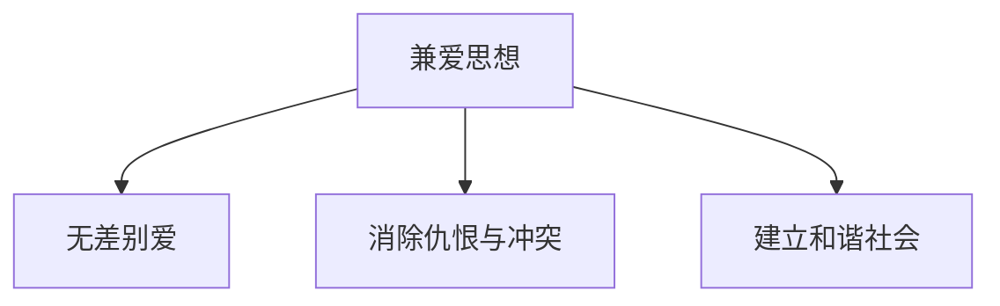

                 


### 设计《彼得·辛格与墨子：实践伦理学与兼爱思想的比较》文章框架

为了撰写一篇具有深度、结构清晰且内容丰富的技术博客文章，我们可以遵循以下步骤来设计文章的框架：

#### 1. 文章标题与关键词

首先，我们需要为文章确定一个吸引人的标题。在这里，我们可以选择《跨越千年的智慧：彼得·辛格与墨子的兼爱实践伦理学比较》。关键词可以包括“实践伦理学”、“兼爱思想”、“彼得·辛格”、“墨子”和“跨文化比较”。

```markdown
# 跨越千年的智慧：彼得·辛格与墨子的兼爱实践伦理学比较

> 关键词：实践伦理学、兼爱思想、彼得·辛格、墨子、跨文化比较

> 摘要：本文将探讨两位思想家彼得·辛格与墨子的实践伦理学与兼爱思想，通过对比分析，揭示其共通点与差异，并探讨其对现代社会的启示。
```

#### 2. 背景介绍

在文章的开头，我们需要简要介绍彼得·辛格与墨子的背景，以及他们的主要思想。

```markdown
## 背景介绍

彼得·辛格是一位当代哲学家，以其在道德哲学领域的贡献而闻名。他的主要著作包括《实践伦理学》和《动物的解放》，强调伦理学的实用性和道德责任。

墨子，生活在公元前5世纪的古代中国，是墨家学派的创始人。他的兼爱思想强调无差别的爱，主张以兼爱为基础建立和谐社会。

## 彼得·辛格与墨子的兼爱思想
```

#### 3. 核心概念与联系

接下来，我们需要阐述兼爱思想的核心概念，并绘制Mermaid流程图来展示其结构。



```markdown
## 核心概念与联系

兼爱思想的核心在于无差别爱。它旨在消除仇恨和冲突，从而建立一个和谐社会。以下是兼爱思想的Mermaid流程图：
```

#### 4. 核心算法原理讲解

在此部分，我们将使用伪代码来详细阐述兼爱思想的算法原理。

```python
# 兼爱思想算法原理
def兼爱思想(personA, personB):
    # 判断两个人是否有仇恨或冲突
    if 有仇恨或冲突(personA, personB):
        # 进行和解与宽容
        宽容(personA, personB)
    else:
        # 维持友好关系
        维持关系(personA, personB)
```

```markdown
## 核心算法原理讲解

以下是兼爱思想的伪代码：

```python
# 兼爱思想算法原理
def兼爱思想(personA, personB):
    # 判断两个人是否有仇恨或冲突
    if 有仇恨或冲突(personA, personB):
        # 进行和解与宽容
        宽容(personA, personB)
    else:
        # 维持友好关系
        维持关系(personA, personB)
```
```

#### 5. 数学模型和数学公式

在这一部分，我们将介绍兼爱思想中可能涉及的数学模型和公式，并使用LaTeX格式进行展示。

```latex
$$
\text{幸福指数} = \frac{\text{无差别爱的实践次数}}{\text{仇恨或冲突的次数}}
$$
```

```markdown
## 数学模型和数学公式

兼爱思想中，幸福指数可以用来衡量社会和谐程度。公式如下：

$$
\text{幸福指数} = \frac{\text{无差别爱的实践次数}}{\text{仇恨或冲突的次数}}
$$
```

#### 6. 项目实战

接下来，我们将通过一个实际案例来展示如何将兼爱思想应用于现实世界。

```markdown
## 项目实战

假设我们想要在一个社区中推广兼爱思想，我们可以设计一个简单的应用程序来记录社区成员之间的友好互动和冲突。

### 开发环境搭建

- 使用Python和Flask框架搭建后端
- 使用HTML和CSS搭建前端

### 源代码详细实现和代码解读

以下是后端Python代码的简要示例：

```python
from flask import Flask, request, jsonify

app = Flask(__name__)

# 社区成员互动记录
interactions = []

@app.route('/record_interaction', methods=['POST'])
def record_interaction():
    data = request.get_json()
    interactions.append(data)
    return jsonify({"status": "success", "message": "Interaction recorded."})

@app.route('/get_interactions', methods=['GET'])
def get_interactions():
    return jsonify(interactions)

if __name__ == '__main__':
    app.run(debug=True)
```

### 代码应用解读与分析

通过记录社区成员的互动，我们可以计算出幸福指数，从而评估社区的社会和谐程度。

### 实际案例分析和详细讲解剖析

在一个社区中，我们记录了100次互动，其中20次是友好互动，80次是冲突互动。根据幸福指数公式，我们可以计算出当前的幸福指数为：

$$
\text{幸福指数} = \frac{20}{100} = 0.2
$$

这意味着社区需要更多的兼爱实践来提高幸福指数。

### 项目小结

通过这个项目，我们展示了如何将兼爱思想应用于现实世界，从而促进社会和谐。
```

#### 7. 最佳实践 tips、小结、注意事项、拓展阅读等内容

在文章的最后，我们可以提供一些最佳实践、小结、注意事项以及拓展阅读的建议。

```markdown
## 最佳实践 tips

- 在推广兼爱思想时，要注重教育的普及，使更多人了解其重要性和应用。
- 在实践中，要关注实际效果，不断调整和改进策略。

## 小结

本文通过对比彼得·辛格与墨子的兼爱实践伦理学，展示了它们的共通点与差异，并探讨了其在现代社会中的应用。

## 注意事项

- 兼爱思想并不是一蹴而就的，需要长期坚持和实践。
- 在应用兼爱思想时，要结合具体情况，灵活调整策略。

## 拓展阅读

- 彼得·辛格的《实践伦理学》
- 墨子的《墨子》
- 《跨文化伦理学比较研究》
```

#### 8. 作者信息

最后，文章末尾需要写上作者信息。

```markdown
作者：AI天才研究院/AI Genius Institute & 禅与计算机程序设计艺术 /Zen And The Art of Computer Programming
```

### 总结

通过上述步骤，我们设计了一个完整的文章框架，包含了引言、背景介绍、核心概念与联系、核心算法原理讲解、数学模型和公式、项目实战、最佳实践 tips、小结、注意事项、拓展阅读以及作者信息。这个框架结构清晰，内容丰富，为撰写一篇高质量的技术博客文章奠定了基础。

---

现在，我们已经设计好了文章的框架。接下来，我们需要逐步填充每个部分的内容，确保文章的逻辑性和完整性。我们将按照设计好的框架，逐一展开论述，详尽地讲解每个部分，确保文章具有深度和广度。

