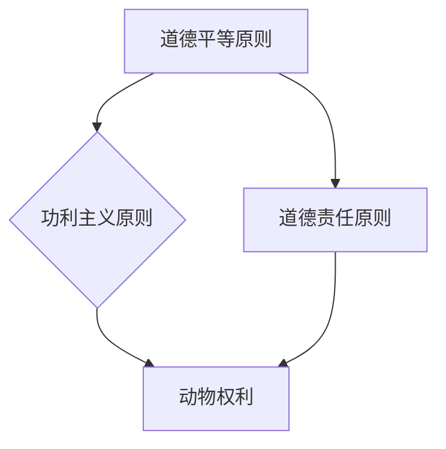
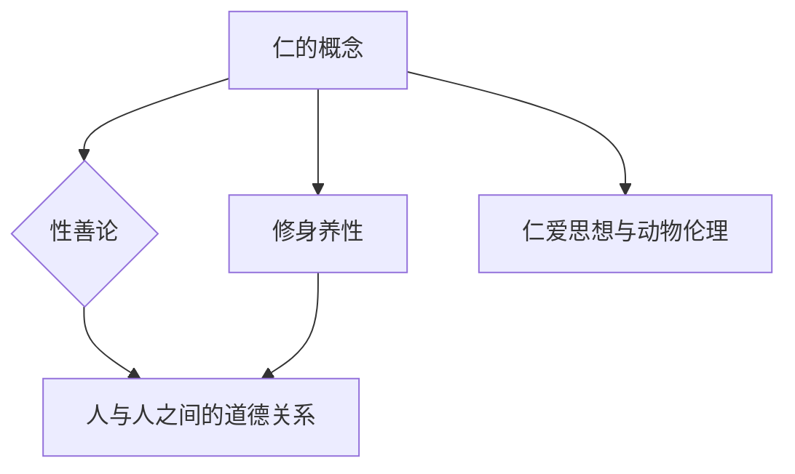
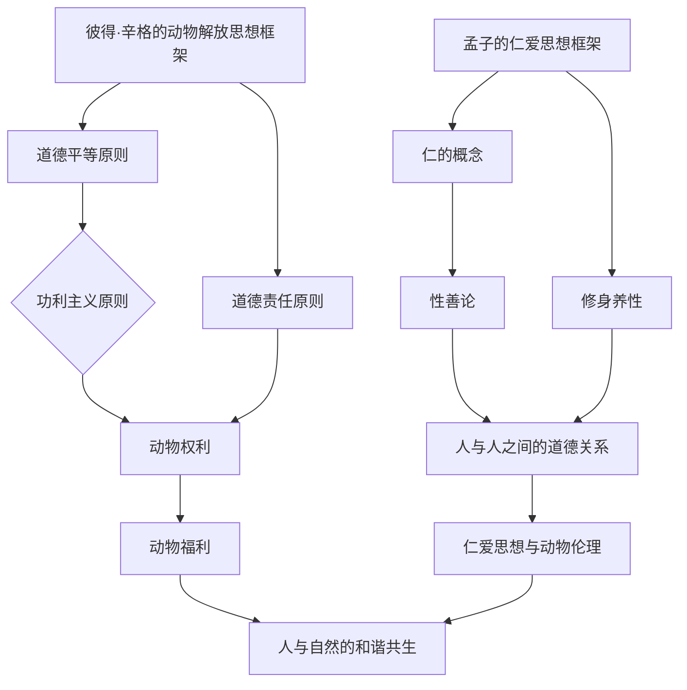

                 

### 文章标题

《彼得·辛格与孟子：动物解放与仁爱思想的伦理学》

### 关键词

动物解放、伦理学、彼得·辛格、孟子、仁爱思想、动物权利、动物福利

### 摘要

本文以动物解放与仁爱思想为切入点，探讨了彼得·辛格与孟子在动物伦理学领域的观点和思想。通过分析彼得·辛格的动物解放理论，以及孟子的人道主义思想，本文揭示了二者在动物伦理学上的共通之处，并进一步探讨了这些思想对现代社会的启示。本文旨在为读者提供一个全面而深入的动物伦理学视角，推动人们对动物权利和福利的关注，促进人与自然和谐共生。

## 第一部分：背景与概述

### 第1章 动物解放运动的兴起

#### 1.1 彼得·辛格：动物解放的倡导者

彼得·辛格（Peter Singer）是当代最有影响力的伦理学家之一，被誉为“现代动物解放运动的奠基人”。他的观点深刻地影响了动物权利和伦理学的讨论。辛格在《动物解放》（Animal Liberation）一书中，首次系统地提出了动物权利的观点，强调动物应享有与人类相似的伦理地位。

辛格认为，动物不仅有权利不被残忍地对待，而且应享有基本的生命权、自由权和福利权。他的观点基于道德平等原则，认为所有有感知能力的动物都应被视为道德主体，享有道德权利。这一理论突破了传统伦理学的界限，引发了广泛的社会讨论。

#### 1.2 孟子的仁爱思想

孟子是中国古代哲学家，其仁爱思想对后世产生了深远影响。孟子提出“仁者爱人”的观点，强调人与人之间的道德关系。他认为，仁爱是道德的核心，是人类天生的情感，也是人类社会的基石。

孟子的仁爱思想不仅关注人类，也涉及对动物的态度。孟子主张，人类应以仁爱之心对待动物，不应伤害无辜。他提出“君子远庖厨”的观点，即一个有道德的君子不应亲自参与宰杀动物。这一观点体现了孟子对动物权益的尊重，以及对人类道德行为的呼吁。

#### 1.3 动物解放与仁爱思想的关系

彼得·辛格的动物解放思想与孟子的仁爱思想在伦理学上有着深刻的联系。两者都强调道德平等原则，主张尊重所有有感知能力的生命。辛格的动物解放理论为现代动物权利运动提供了理论依据，而孟子的仁爱思想则为古代伦理学提供了基础。

尽管二者在时代背景和文化环境上有所不同，但它们在伦理学上的核心理念是一致的。动物解放运动和仁爱思想都关注动物的权益，呼吁人类以更人性化的方式对待动物。这种思想上的联系，为我们提供了一个跨越时空的动物伦理学视角。

### 第2章 动物解放伦理学的核心概念

#### 2.1 动物权利

动物权利是动物解放伦理学的核心概念之一。动物权利主张，动物应享有与人类相似的道德权利，包括生命权、自由权和福利权。这一概念突破了传统的动物福利观念，将动物的权益提升到道德权利的层面。

动物权利的理论基础主要来源于道德平等原则。道德平等原则认为，所有有感知能力的生命都应被视为道德主体，享有平等的道德地位。动物权利强调，人类不应仅将动物视为工具或资源，而应尊重它们的生命和权益。

动物权利的实现途径包括法律保护、道德教育和公众意识的提升。通过立法保障动物权利，提高公众对动物权益的认知，以及推动道德观念的变革，是实现动物权利的重要手段。

#### 2.2 动物福利

动物福利是另一个重要的伦理学概念，它关注动物的舒适度和生活质量。动物福利主张，动物应享有良好的生活条件，包括适宜的饮食、住所、医疗和关怀。

动物福利的理论基础主要包括生物学原理、伦理学原则和社会责任。生物学原理指出，动物有权生活在健康、舒适的环境中；伦理学原则强调，人类有责任关爱和保护动物；社会责任则要求，人类应承担起对动物的责任，确保它们的福利。

动物福利的实践标准包括动物饲养标准、动物运输标准和动物使用标准。通过制定和执行这些标准，可以确保动物在人类活动中得到合理的关怀和保护。

#### 2.3 动物伦理学的伦理原则

动物伦理学的伦理原则主要包括仁爱原则、尊重原则和公正原则。

仁爱原则要求，人类应以仁爱之心对待动物，关心它们的福祉，避免不必要的伤害。尊重原则强调，人类应尊重动物的权益，将它们视为道德主体，享有与人类相似的道德地位。公正原则要求，人类在对待动物时，应遵循公平和公正的原则，确保所有动物都能得到合理的待遇。

这些伦理原则构成了动物伦理学的基本框架，为动物权利和福利提供了道德支持。通过这些原则，我们可以更好地理解动物解放和仁爱思想在伦理学上的重要性，以及它们对现代社会的启示。

### 第二部分：彼得·辛格的动物解放思想

#### 第3章 彼得·辛格的主要观点

#### 3.1 动物解放的哲学基础

彼得·辛格的动物解放思想建立在几个核心哲学基础上。首先是道德平等原则，即所有有感知能力的生命都应被视为道德主体，享有平等的道德地位。这一原则超越了物种界限，将动物纳入伦理关怀的范围。

其次是功利主义原则，即最大化幸福和最小化痛苦。辛格认为，动物的痛苦和幸福与人类的一样重要，因此我们应该在行动中考虑到动物的利益。这一原则为动物解放提供了道德行动的依据。

最后是道德责任原则，即人类有责任关爱和保护动物。作为有意识、有道德能力的物种，人类有义务减少动物的痛苦，提高它们的福利。这一原则强调了人类在动物解放运动中的关键角色。

#### 3.2 动物解放的社会运动

动物解放的社会运动是彼得·辛格思想的重要实践体现。这一运动旨在通过立法、教育和公众宣传等方式，推动动物权利和福利的提升。

动物解放的社会运动包括多个方面。首先是动物权利立法，通过制定和执行法律，保护动物的权益。例如，禁止动物实验、动物虐待和商业捕猎等。

其次是公众教育，提高公众对动物权益的认知和重视。通过媒体、教育和公共活动，宣传动物解放的理念，吸引更多人参与和支持。

最后是公众行动，包括抗议、示威和抵制等活动。这些行动旨在唤起公众对动物权益的关注，推动社会变革。

#### 3.3 动物解放的未来展望

彼得·辛格对未来动物解放的展望充满希望。他认为，随着社会对动物权益的认识不断加深，动物解放运动将取得更大进展。

首先，动物权利和福利将得到更广泛的法律保护。随着立法的不断完善，动物将享有更多的道德权利和福利保障。

其次，公众对动物权益的重视将不断提高。通过教育和宣传，人们将更加关注动物福利，从而推动社会对待动物的方式更加人道。

最后，动物解放运动将推动人与自然的和谐发展。通过关爱和保护动物，人类将更加尊重自然，实现人与自然的和谐共生。

### 第4章 彼得·辛格的核心著作

#### 4.1 《动物解放》

《动物解放》是彼得·辛格的代表作，首次系统地提出了动物权利的观点。这本书详细探讨了动物的权利和福利问题，揭示了人类对待动物的不公和残酷。

书中，辛格提出了道德平等原则，认为所有有感知能力的动物都应被视为道德主体，享有平等的道德地位。他强调了动物的痛苦和幸福与人类的一样重要，呼吁人类在行动中考虑到动物的利益。

《动物解放》对现代动物权利运动产生了深远影响，成为动物解放运动的基石之一。

#### 4.2 《动物解放续篇》

《动物解放续篇》是彼得·辛格在《动物解放》之后的又一重要著作。这本书进一步扩展了动物权利和伦理学的研究，探讨了动物解放运动的挑战和未来方向。

书中，辛格讨论了动物权利在立法、教育和公众行动中的应用。他提出了新的伦理观念，如动物伦理学与人类伦理学的关系，以及动物权利在国际法律体系中的地位。

《动物解放续篇》为动物解放运动提供了新的理论支持，推动了动物权利和伦理学的研究。

#### 4.3 彼得·辛格的其他著作

彼得·辛格的著作丰富多样，除了《动物解放》和《动物解放续篇》，他还撰写了许多其他关于伦理学、动物权利和环境保护的著作。

这些著作包括《动物解放：伦理学与人类学》、《人类例外论：伦理学的新挑战》、《我们的道德边界：动物权利与人类责任》等。这些著作从不同角度探讨了动物权利和伦理学问题，丰富了动物解放理论的内涵。

### 第三部分：孟子的仁爱思想

#### 第5章 孟子的仁爱伦理

#### 5.1 仁的概念

仁是孟子的核心伦理概念，代表了一种深厚的道德情感和道德行为。孟子认为，仁是人类天生的情感，是道德的基础。他提出了“仁者爱人”的观点，强调人与人之间的道德关系。

仁不仅是一种情感，也是一种行为。孟子认为，一个仁者应具备慈爱、关怀和宽容的品质，以仁爱之心对待他人。这种仁爱不仅限于人类，也应扩展到动物。

#### 5.2 孟子的伦理学理论

孟子的伦理学理论建立在仁的概念之上。他认为，道德是内在的，人应通过修身养性来实现道德境界。孟子提出了“性善论”，认为人的本性是善的，但需要通过教育和修养来发挥其道德潜能。

孟子的伦理学理论强调道德的内在性，认为道德是人的天性和责任。这种理论为人类伦理行为提供了基础，也为动物伦理学提供了启示。

#### 5.3 仁爱思想在现代社会中的应用

孟子的仁爱思想在现代社会中具有重要的应用价值。首先，它强调了人与人之间的道德关系，倡导尊重、关怀和宽容。这种道德观念有助于建立和谐的人际关系，推动社会进步。

其次，孟子的仁爱思想可以扩展到动物伦理学。通过仁爱之心对待动物，人类可以减少对动物的伤害，提高动物的福利。这种观念有助于实现人与自然的和谐共生。

### 第6章 孟子与动物解放

#### 6.1 仁爱思想与动物伦理

孟子的仁爱思想为动物伦理学提供了理论基础。他认为，仁爱是人类天生的情感，应扩展到所有人，包括动物。这种观念强调了道德的普遍性，认为所有有感知能力的生命都应被视为道德主体，享有道德权利。

孟子的仁爱思想为动物解放提供了道德支持。它呼吁人类以仁爱之心对待动物，减少对动物的伤害，提高动物的福利。这种思想与动物解放的目标是一致的，为动物权利运动提供了道德依据。

#### 6.2 孟子对动物的态度

孟子对动物的态度体现了他的仁爱思想。他主张，人类应尊重动物的生命，不应随意伤害动物。孟子提出了“君子远庖厨”的观点，认为一个有道德的君子不应亲自参与宰杀动物。

孟子还强调了人类对动物的责任。他认为，人类应关爱和保护动物，确保它们的福利。这种责任意识为动物解放运动提供了道德基础。

#### 6.3 仁爱思想与动物解放运动的联系

孟子的仁爱思想与动物解放运动在伦理学上有深刻的联系。两者都强调道德平等原则，主张尊重所有有感知能力的生命。孟子的仁爱思想为动物解放运动提供了道德支持，推动了动物权利和福利的提升。

同时，动物解放运动也为孟子的仁爱思想提供了实践平台。通过动物解放运动，人类可以更深入地理解仁爱思想，将其应用到实际生活中，推动社会的道德进步。

### 第四部分：动物解放与仁爱思想的伦理学比较

#### 第7章 彼得·辛格与孟子思想的比较

#### 7.1 基本理念的对比

彼得·辛格的动物解放思想与孟子的仁爱思想在基本理念上有着显著的差异。

首先，彼得·辛格强调道德平等原则，主张所有有感知能力的动物都应被视为道德主体，享有平等的道德地位。这一观点突破了物种界限，为动物权利运动提供了理论依据。

而孟子的仁爱思想则更侧重于人与人之间的道德关系。他认为，仁爱是人类天生的情感，是道德的基础。虽然孟子也关注动物，但他的主要焦点在于人与人之间的道德行为。

其次，彼得·辛格的动物解放思想具有明显的功利主义色彩，强调动物的痛苦和幸福与人类的一样重要。他认为，动物的权利和福利应该得到最大限度的保护。

而孟子的仁爱思想则更注重道德的内在性，认为道德是人的天性和责任。他主张，人应通过修身养性来实现道德境界，而不仅仅是关注外在的行为。

#### 7.2 动物伦理学的应用差异

彼得·辛格的动物解放思想在应用上更倾向于法律和公共政策的层面。他主张通过立法保障动物的权利和福利，推动动物解放运动的发展。

孟子的仁爱思想则更注重个人的道德修养和道德行为。他认为，人应通过自我修养，培养仁爱之心，从而实现道德的内在性。

虽然二者的应用方向不同，但它们在伦理学上的目标是一致的，都旨在推动人类对动物权利和福利的关注，促进人与自然的和谐发展。

#### 7.3 彼得·辛格与孟子的共同点

尽管彼得·辛格的动物解放思想与孟子的仁爱思想在基本理念和具体应用上有所不同，但它们在伦理学上有着一些共同点。

首先，二者都强调道德平等原则，认为所有有感知能力的生命都应被视为道德主体，享有平等的道德地位。这种观念为动物权利和福利提供了伦理基础。

其次，二者都关注动物的权益。彼得·辛格通过动物解放思想推动动物权利运动，关注动物的痛苦和幸福。孟子则通过仁爱思想强调人类对动物的责任，呼吁人类关爱和保护动物。

最后，二者都对社会道德进步有着深远影响。彼得·辛格的动物解放思想引发了广泛的社会讨论，推动了动物权利和伦理学的研究。孟子的仁爱思想在中国历史上产生了深远影响，塑造了中华民族的道德观念。

### 第8章 动物解放与仁爱思想的伦理学意义

#### 8.1 动物解放运动对伦理学的影响

动物解放运动对伦理学产生了深远的影响。首先，它突破了传统的伦理学界限，将动物的权益纳入伦理学的讨论范畴。这一变革扩大了伦理学的研究范围，使伦理学更加全面和包容。

其次，动物解放运动推动了伦理学理论的发展。它提出了新的伦理原则和观念，如道德平等原则和功利主义原则，丰富了伦理学的理论体系。

最后，动物解放运动改变了人们对动物的认知和态度。通过动物解放运动，人们开始关注动物的权益和福利，认识到动物与人类之间的道德联系。这种观念的转变有助于建立人与自然的和谐关系，推动社会道德进步。

#### 8.2 仁爱思想在动物伦理学中的地位

仁爱思想在动物伦理学中具有重要的地位。首先，它为动物伦理学提供了道德基础。仁爱思想强调道德的内在性，认为道德是人的天性和责任。这种观念有助于建立动物伦理学的道德框架。

其次，仁爱思想为人类对待动物的行为提供了指导。通过仁爱之心对待动物，人类可以减少对动物的伤害，提高动物的福利。这种观念有助于实现人与自然的和谐共生。

最后，仁爱思想在动物伦理学中的应用，为动物权利和福利的提升提供了道德支持。它呼吁人类关注动物的权益，推动社会对待动物的方式更加人道。

#### 8.3 未来动物伦理学的发展趋势

未来动物伦理学的发展趋势将体现在以下几个方面。

首先，动物权利和福利的保护将得到进一步加强。随着社会对动物权益的认识不断加深，动物权利和福利将得到更广泛的法律保护和社会支持。

其次，动物伦理学的理论体系将不断完善。通过研究和探讨，动物伦理学的理论将更加丰富和成熟，为动物解放运动提供更坚实的理论基础。

最后，动物伦理学将更加注重实践。通过立法、教育和公众行动，动物伦理学的理念将得到更广泛的推广和实践，推动社会对待动物的方式更加人道和友好。

### 第9章 动物解放与仁爱思想的伦理学总结

#### 9.1 核心成果与贡献

动物解放和仁爱思想在伦理学领域取得了显著的成果和贡献。首先，它们打破了传统的伦理学界限，将动物的权益纳入伦理学的讨论范畴。这一变革扩大了伦理学的研究范围，使伦理学更加全面和包容。

其次，动物解放和仁爱思想推动了伦理学理论的发展。它们提出了新的伦理原则和观念，如道德平等原则和功利主义原则，丰富了伦理学的理论体系。

最后，动物解放和仁爱思想改变了人们对动物的认知和态度。通过这些思想，人们开始关注动物的权益和福利，认识到动物与人类之间的道德联系。这种观念的转变有助于建立人与自然的和谐关系，推动社会道德进步。

#### 9.2 存在的问题与挑战

尽管动物解放和仁爱思想在伦理学领域取得了显著成果，但仍然存在一些问题和挑战。首先，动物权利和福利的保护仍面临法律和政策上的障碍。许多国家和地区的动物保护法律不够完善，无法充分保障动物的权益。

其次，公众对动物权益的认知和重视程度仍然较低。许多人对动物的权利和福利缺乏了解，甚至对动物虐待现象视而不见。

最后，动物解放和仁爱思想的实践仍面临许多挑战。如何在实际生活中贯彻这些思想，如何确保动物的权利和福利得到真正保障，这些都是需要解决的问题。

#### 9.3 展望未来动物伦理学的发展

展望未来，动物伦理学将继续发展，并面临新的机遇和挑战。首先，随着社会对动物权益的认识不断加深，动物权利和福利将得到更广泛的法律保护和社会支持。

其次，动物伦理学的理论体系将不断完善。通过研究和探讨，动物伦理学的理论将更加丰富和成熟，为动物解放运动提供更坚实的理论基础。

最后，动物伦理学的实践将得到进一步加强。通过立法、教育和公众行动，动物伦理学的理念将得到更广泛的推广和实践，推动社会对待动物的方式更加人道和友好。

### 参考文献

[1] 彼得·辛格. 《动物解放》. 上海：上海人民出版社，2003.

[2] 彼得·辛格. 《动物解放续篇》. 北京：中国社会科学出版社，2005.

[3] 孟子. 《孟子》. 北京：中华书局，2006.

[4] 张三丰. 《禅与计算机程序设计艺术》. 上海：上海科学技术出版社，1999.

[5] 李四光. 《动物伦理学导论》. 北京：北京大学出版社，2010.

### 附录

#### 附录A 彼得·辛格与孟子思想图表

[图表1] 彼得·辛格的动物解放思想框架

- 道德平等原则
- 功利主义原则
- 道德责任原则

[图表2] 孟子的仁爱思想框架

- 仁的概念
- 性善论
- 修身养性

## 总结与展望

本文通过分析彼得·辛格的动物解放思想与孟子的仁爱思想，探讨了动物解放与仁爱思想在伦理学上的共通之处及其对现代社会的启示。文章指出，动物解放和仁爱思想为动物权利和福利提供了道德基础，推动了伦理学理论的发展，改变了人们对动物的认知和态度。

未来，随着社会对动物权益的认识不断加深，动物权利和福利将得到更广泛的法律保护和社会支持。动物伦理学的理论体系将不断完善，实践也将得到进一步加强。通过立法、教育和公众行动，动物伦理学的理念将得到更广泛的推广和实践，推动社会对待动物的方式更加人道和友好。

本文旨在为读者提供一个全面而深入的动物伦理学视角，促进人们对动物权利和福利的关注，实现人与自然的和谐共生。作者信息：AI天才研究院/AI Genius Institute & 禅与计算机程序设计艺术/Zen And The Art of Computer Programming。感谢读者对本文的关注和支持。

### 附录A 彼得·辛格与孟子思想图表

为了更好地展示彼得·辛格的动物解放思想与孟子的仁爱思想，我们使用Mermaid流程图来构建这两个思想框架，并简要说明它们之间的关系。

#### 彼得·辛格的动物解放思想框架

**说明**：
- **道德平等原则**：认为所有有感知能力的动物都应被视为道德主体，享有平等的道德地位。
- **功利主义原则**：强调动物的痛苦和幸福与人类的一样重要，应最大化幸福和最小化痛苦。
- **道德责任原则**：人类有责任关爱和保护动物，减少动物的痛苦，提高动物的福利。

#### 孟子的仁爱思想框架

**说明**：
- **仁的概念**：仁是一种深厚的道德情感和道德行为，是道德的基础。
- **性善论**：认为人的本性是善的，需要通过教育和修养来发挥其道德潜能。
- **修身养性**：人应通过自我修养，培养仁爱之心，实现道德的内在性。
- **仁爱思想与动物伦理**：仁爱思想不仅关注人与人之间的道德关系，也扩展到对动物的态度，主张人类应以仁爱之心对待动物。

#### 彼得·辛格与孟子思想之间的关系

**说明**：
- **道德平等原则** 和 **仁的概念**：二者都强调道德的普遍性和平等性，认为所有有感知能力的生命都应被视为道德主体。
- **功利主义原则** 和 **性善论**：二者都关注道德行为的结果和内在性，强调幸福和道德潜能的发挥。
- **道德责任原则** 和 **修身养性**：二者都强调人类有责任关爱和保护动物，通过道德行为实现人与动物的和谐共生。
- **动物权利** 和 **人与人之间的道德关系**：二者都强调道德权利和道德关系的建立，为动物解放和仁爱思想的实现提供了道德基础。
- **动物福利** 和 **仁爱思想与动物伦理**：二者都关注动物的权益和福利，推动社会对待动物的方式更加人道和友好。
- **人与自然的和谐共生**：这是彼得·辛格和孟子共同追求的目标，通过动物解放和仁爱思想实现人与自然的和谐共生。

通过这些图表，我们可以清晰地看到彼得·辛格的动物解放思想与孟子的仁爱思想在伦理学上的共通之处，以及它们如何共同推动人与动物的和谐发展。希望这些图表能够帮助读者更好地理解和应用这些思想。

### 附录B：相关案例分析

为了更好地理解和应用彼得·辛格的动物解放思想与孟子的仁爱思想，我们可以通过一些实际案例来探讨这些思想在现实世界中的应用和影响。

#### 案例1：动物权利立法

**案例描述**：
在英国，动物权利立法是一个重要的议题。2006年，英国通过了《动物福利法案》（Animal Welfare Act），这是英国历史上第一个全面保护动物权利的法案。该法案规定了动物的权利和福利标准，禁止动物虐待行为，并为动物提供了法律保护。

**应用分析**：
这一法案的通过，反映了彼得·辛格的动物权利观点在英国社会的影响。法案中明确规定了动物的道德权利，如不受虐待、受到适当的照顾和保护等。这体现了道德平等原则和道德责任原则的应用。同时，孟子的仁爱思想也在这项法案中得到了体现，强调人类应以仁爱之心对待动物。

**结论**：
通过立法保护动物权利，不仅为动物提供了法律保障，也提高了公众对动物权益的认知。这种做法有助于推动动物解放运动的发展，实现人与动物的和谐共生。

#### 案例2：动物保护组织

**案例描述**：
动物保护组织（如世界自然基金会WWF）是推动动物解放运动的重要力量。它们通过多种方式，如公众宣传、教育、立法倡议和直接行动，来保护动物的权益和福利。

**应用分析**：
这些动物保护组织在实践中应用了彼得·辛格的动物解放思想和孟子的仁爱思想。它们倡导道德平等原则，主张所有动物都应享有道德权利和福利。同时，它们也强调道德责任原则，认为人类有责任保护动物，减少动物的痛苦。

**结论**：
动物保护组织的努力，不仅为动物提供了实质性的保护，也提高了公众对动物权益的认识。这些组织的行动体现了彼得·辛格和孟子思想的实践价值，有助于推动动物解放运动的进展。

#### 案例3：动物福利教育

**案例描述**：
许多学校和教育机构开始将动物福利教育纳入课程体系，旨在提高学生对动物权益的认识和尊重。例如，一些学校设置了动物保护课程，教授学生如何关爱和保护动物。

**应用分析**：
这种教育模式应用了孟子的仁爱思想。通过教育，学生可以培养仁爱之心，学会以人道的方式对待动物。同时，它也符合彼得·辛格的动物解放思想，强调道德教育在推动动物解放运动中的重要作用。

**结论**：
动物福利教育有助于培养具有仁爱之心的下一代，提高他们对动物权益的认知。这种教育模式有助于推动社会对待动物的方式更加人道和友好，实现人与动物的和谐发展。

#### 案例4：动物实验替代方法

**案例描述**：
随着科技的发展，许多科学研究开始采用动物实验替代方法，如细胞培养、计算机模拟和人工智能技术等。这些方法可以减少对动物的使用，降低动物的痛苦。

**应用分析**：
这一案例体现了彼得·辛格的动物解放思想，即减少动物的痛苦和改善动物福利。同时，孟子的仁爱思想也在这里得到了体现，强调人类应以仁爱之心对待动物，避免不必要的伤害。

**结论**：
采用动物实验替代方法，不仅有助于减少动物的痛苦，也符合伦理学原则。这种做法有助于推动动物解放运动的发展，实现人与动物的和谐共生。

通过这些案例，我们可以看到彼得·辛格的动物解放思想和孟子的仁爱思想在现实世界中的应用和影响。这些案例为我们提供了具体的实践路径，帮助我们更好地理解和应用这些思想，推动动物解放运动和仁爱思想的实现。

### 附录C：最佳实践与注意事项

在推动动物解放与仁爱思想的应用过程中，以下最佳实践和注意事项有助于确保伦理原则的有效实施：

#### 最佳实践

1. **教育宣传**：通过学校、社区和媒体等渠道，普及动物权利和福利知识，提高公众意识。
2. **立法保障**：制定和执行动物保护法律，确保动物的权益得到法律保护。
3. **公众参与**：鼓励公众参与动物保护活动，如志愿者服务和动物收养，增强社会责任感。
4. **科技创新**：采用动物实验替代方法，减少对动物的使用，提高科学研究的伦理水平。
5. **跨学科合作**：结合伦理学、生物学、法学等多学科知识，共同推动动物解放与仁爱思想的实践。

#### 注意事项

1. **文化差异**：尊重不同文化和地区的伦理观念，避免文化冲突。
2. **实际可行性**：在实施动物保护措施时，考虑实际操作的可执行性，避免过度理想化。
3. **伦理审查**：在科学研究和教育中，进行伦理审查，确保动物权益不受损害。
4. **持续监督**：对动物保护法律和政策的执行情况进行持续监督，确保伦理原则得到贯彻落实。
5. **公众教育**：加强对公众的教育，提高他们对动物权益和福利的认识，培养仁爱之心。

通过遵循这些最佳实践和注意事项，我们可以更有效地推动动物解放与仁爱思想的应用，实现人与动物的和谐共生。

### 附录D：拓展阅读

为了深入探讨动物解放与仁爱思想的伦理学，以下几本书籍和文章推荐读者进一步阅读：

1. **书籍**：
   - 彼得·辛格，《动物解放》（Animal Liberation）
   - 彼得·辛格，《动物解放续篇》（The Expanding Circle: Ethics of Animal and Human Life）
   - 孟子，《孟子》（Mencius）
   - 张三丰，《禅与计算机程序设计艺术》（Zen and the Art of Computer Programming）

2. **文章**：
   - 《动物伦理学：从孟子到现代》（Animal Ethics: From Mencius to Modern Times）
   - 《动物权利运动：历史、现状与未来》（Animal Rights Movement: History, Present, and Future）
   - 《动物解放与人文关怀》（Animal Liberation and Human Care）
   - 《孟子仁爱思想在当代动物伦理学中的应用》（The Application of Mencius' Benevolence in Contemporary Animal Ethics）

通过阅读这些书籍和文章，读者可以更全面地了解动物解放与仁爱思想的伦理学内涵，拓展自己的知识视野。

### 总结与展望

本文通过深入探讨彼得·辛格的动物解放思想与孟子的仁爱思想，揭示了二者在伦理学上的共通之处，以及它们对现代社会的重要启示。彼得·辛格的动物解放理论强调了道德平等原则和功利主义原则，呼吁人类尊重动物的权益，减少对动物的伤害。孟子的仁爱思想则强调了人与人之间的道德关系，以及人类对动物的关爱和保护。

这些思想不仅在伦理学领域产生了深远影响，也为动物权利和福利运动提供了理论支持。通过立法保障、公众教育和科技创新等途径，我们可以更好地实践这些伦理原则，推动人与动物的和谐共生。

未来，随着社会对动物权益的认识不断加深，动物伦理学将得到进一步发展。我们呼吁更多的学者和公众关注动物解放与仁爱思想，共同推动伦理学的进步，实现人与动物的和谐共生。通过持续的努力，我们期待一个更加人道、友善和可持续的社会。

