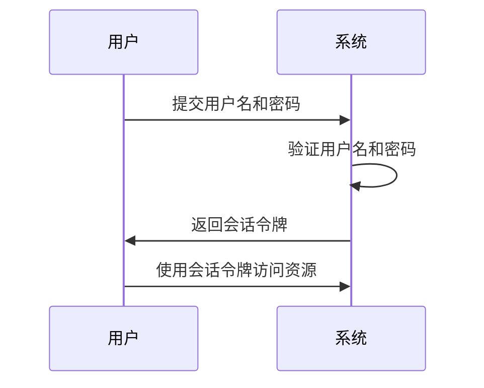
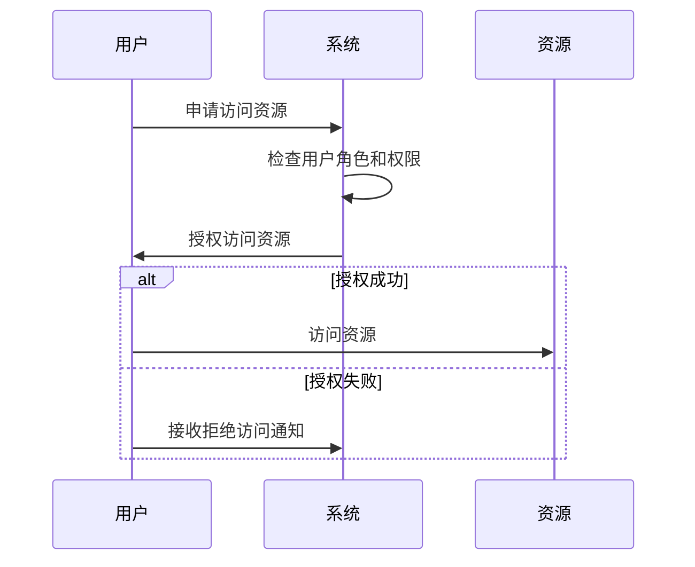
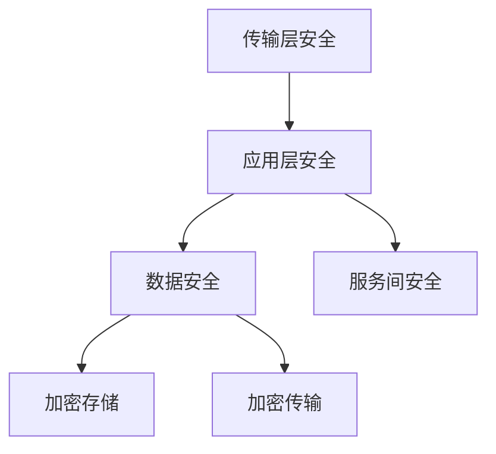

                 

### 文章标题
### 微服务安全最佳实践：认证、授权与加密

#### 关键词
- 微服务安全
- 认证
- 授权
- 加密
- 安全架构

#### 摘要
本文将深入探讨微服务环境下的安全性，重点关注认证、授权和加密三个关键领域。通过详细分析每种机制的工作原理、最佳实践以及实际应用案例，我们旨在为开发者提供一套全面的微服务安全解决方案。

----------------------------------------------------------------

## 引言
### 微服务安全的重要性
微服务架构以其灵活、可扩展和易于维护的优势，成为了现代软件系统开发的主流模式。然而，随着微服务架构的广泛应用，安全问题也逐渐凸显。微服务因其分布式特性，容易成为攻击者的目标。此外，微服务之间的交互复杂，单一故障可能导致整个系统的瘫痪。因此，确保微服务安全性至关重要。

### 本书的目标读者
本书旨在为软件开发者、系统架构师和网络安全专家提供关于微服务安全性的全面指南。无论您是刚接触微服务的新手，还是经验丰富的专业人士，都能从本书中获得宝贵知识和实践经验。

### 本书结构概述
本文将分为以下几个部分：
1. **微服务安全基础**：介绍微服务的基本概念、架构和安全挑战。
2. **认证机制**：详细讨论微服务中的认证方法，包括原理、优势和最佳实践。
3. **授权机制**：深入探讨微服务中的授权方法，包括原理、实现方式和最佳实践。
4. **加密技术**：讲解微服务中常用的加密技术，如对称加密、非对称加密和哈希函数。
5. **安全架构设计**：介绍如何设计一个安全的微服务架构。
6. **实战案例**：通过实际案例展示如何应用上述安全机制。
7. **附录**：提供额外的资源，如工具、标准和规范。

----------------------------------------------------------------

## 微服务安全基础
### 微服务概述
微服务是一种软件架构风格，它将应用程序划分为多个独立、可复用的小服务。这些服务通过轻量级通信协议（如HTTP/HTTPS、gRPC等）相互通信，以实现完整的业务功能。

### 微服务架构的特点
- **模块化**：每个微服务独立开发、部署和扩展，降低了系统耦合度。
- **松耦合**：服务之间通过接口通信，相互独立，便于管理和维护。
- **可扩展性**：可以针对特定服务进行水平扩展，提高系统性能。
- **灵活性**：服务可以独立更新和替换，提高了系统的适应能力。

### 微服务常见的安全挑战
- **分布式攻击**：由于微服务是分布式的，攻击者可以利用这一点进行分布式拒绝服务（DDoS）攻击。
- **服务间通信安全**：服务之间的通信容易受到中间人攻击（MITM）等威胁。
- **数据安全**：微服务架构中的数据分散存储，数据泄露风险增加。
- **身份验证和授权**：分布式环境中的身份验证和授权变得更加复杂。

### 微服务安全的整体架构
微服务安全架构应涵盖以下几个方面：
- **认证和授权**：确保只有授权用户可以访问系统。
- **数据加密**：保护数据在传输和存储过程中的安全性。
- **服务隔离**：通过容器化技术（如Docker）实现服务之间的隔离。
- **监控和日志**：实时监控系统状态，快速发现和响应异常事件。

----------------------------------------------------------------

## 认证机制
### 认证的原理和目的
认证是确保系统用户身份真实性的过程。其目的是防止未经授权的访问，保护系统资源和数据。

### 常见的认证方式
#### 用户名密码认证
用户名密码认证是最常见的认证方式，用户通过输入用户名和密码来证明自己的身份。

#### 单点登录（SSO）
单点登录允许用户使用一个账号登录多个系统，提高了用户体验和安全性。

#### OAuth 2.0
OAuth 2.0是一种授权协议，用于实现第三方认证和授权。它允许用户授权第三方服务访问其资源，而无需泄露用户密码。

#### OpenID Connect
OpenID Connect是OAuth 2.0的扩展协议，提供了一种认证用户身份的机制。

### 认证流程详解
认证流程通常包括以下几个步骤：
1. 用户提交用户名和密码。
2. 系统验证用户名和密码。
3. 如果验证成功，系统生成一个会话令牌（如JWT），并将其返回给用户。
4. 用户使用会话令牌访问受保护的资源。

### 认证机制的最佳实践
- **使用强密码策略**：鼓励用户使用复杂密码，并定期更新。
- **启用多因素认证**：增加一层额外的安全措施，如短信验证码或生物识别。
- **定期审计和监控**：及时发现和解决潜在的安全问题。

### 认证机制的Mermaid流程图

----------------------------------------------------------------

## 授权机制
### 授权的原理和目的
授权是确保用户在系统中可以访问其权限内的资源的机制。其目的是确保只有授权用户可以执行特定的操作，保护系统资源和数据。

### 常见的授权方式
#### 基于角色的访问控制（RBAC）
RBAC通过将用户和角色关联起来，角色和权限关联起来，实现授权控制。

#### 基于属性的访问控制（ABAC）
ABAC通过评估用户的属性（如角色、权限、环境等）来决定是否授权访问资源。

#### OAuth 2.0中的授权
OAuth 2.0提供了一种授权机制，允许用户授权第三方服务访问其资源。

### 授权流程详解
授权流程通常包括以下几个步骤：
1. 用户向系统申请访问资源。
2. 系统根据用户的角色和权限进行授权检查。
3. 如果授权成功，系统允许用户访问资源；否则，拒绝访问。

### 授权机制的最佳实践
- **最小权限原则**：用户只拥有执行特定操作所需的最低权限。
- **动态权限管理**：根据用户行为和上下文动态调整权限。
- **日志记录**：记录所有授权操作，方便后续审计和监控。

### 授权机制的Mermaid流程图

----------------------------------------------------------------

## 加密技术
### 对称加密与非对称加密
- **对称加密**：加密和解密使用相同的密钥，如AES。
- **非对称加密**：加密和解密使用不同的密钥，如RSA。

### 哈希函数
哈希函数将数据映射为固定长度的字符串，如MD5、SHA-256。

### 证书与密钥管理
证书用于验证实体身份，密钥用于加密和解密数据。有效的密钥管理是确保加密安全性的关键。

### 实际应用案例
- **HTTPS**：使用TLS协议，确保数据在传输过程中的安全性。
- **数据加密存储**：使用AES加密存储敏感数据。

----------------------------------------------------------------

## 安全架构设计
### 安全架构设计的原则
- **最小权限原则**：用户和组件仅拥有执行特定操作所需的最低权限。
- **防御深度原则**：在系统各个层次实施安全措施，形成多层防护。
- **安全分解原则**：将安全功能分散到系统的不同部分，降低攻击面。

### 安全层次设计
- **传输层安全**：使用TLS保护数据传输。
- **应用层安全**：实现身份认证、授权和访问控制。
- **数据安全**：加密存储和传输敏感数据。
- **服务间安全**：确保服务间通信的安全性。

### 安全策略和最佳实践
- **定期安全审计**：及时发现和解决潜在的安全问题。
- **安全培训**：提高开发者和运维人员的安全意识。
- **异常检测和响应**：实时监控系统，快速响应异常事件。

### 安全架构的Mermaid流程图

----------------------------------------------------------------

## 实战案例
### 案例一：认证与授权在微服务中的应用
- **场景**：开发一个在线购物平台，用户需要登录后才能访问购物车和订单页面。
- **解决方案**：
  - **认证**：使用OAuth 2.0和OpenID Connect实现第三方认证和单点登录。
  - **授权**：使用基于角色的访问控制（RBAC）限制用户访问权限。

### 案例二：使用加密技术保护数据传输
- **场景**：保护用户在购物平台上的支付信息。
- **解决方案**：
  - **传输层安全**：使用HTTPS和TLS保护数据传输。
  - **数据加密存储**：使用AES加密支付信息，存储在数据库中。

### 案例三：构建安全的微服务架构
- **场景**：设计一个分布式微服务架构，确保系统安全。
- **解决方案**：
  - **容器化与隔离**：使用Docker容器化服务，确保服务之间的隔离。
  - **服务网关**：通过服务网关实现统一的认证和授权。
  - **日志与监控**：实时监控系统日志，快速发现和响应异常事件。

----------------------------------------------------------------

## 附录
### 常用工具和库
- **认证和授权**：Spring Security、Keycloak、OAuth2Server。
- **加密**：Bouncy Castle、JSSE。

### 安全标准和规范
- **OAuth 2.0**：RFC 6749。
- **OpenID Connect**：RFC 6749。
- **HTTPS/TLS**：RFC 5246。

### 拓展阅读
- **微服务安全**：《微服务安全指南》（Microservices Security: Designing and Implementing Security for Microservice Architectures）。
- **加密技术**：《密码学：实践与攻击》（Cryptographic Techniques: Principles and Practice）。

----------------------------------------------------------------

## 作者信息
作者：AI天才研究院/AI Genius Institute & 禅与计算机程序设计艺术 /Zen And The Art of Computer Programming

----------------------------------------------------------------

### 结束语
微服务安全性是现代软件开发中不可忽视的重要方面。通过本文的探讨，我们了解了认证、授权和加密在微服务安全中的关键作用。希望本文能为您提供一套实用的安全解决方案，助力构建安全的微服务架构。如果您在微服务安全方面有更多疑问或经验，欢迎在评论区交流分享。期待与您共同探讨微服务安全领域的更多话题！

