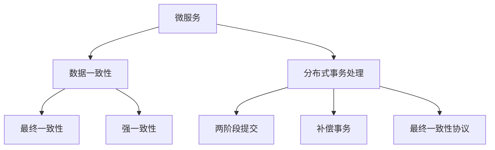

                 


### 文章标题

微服务数据一致性：分布式事务处理

### 关键词

微服务、数据一致性、分布式事务处理、两阶段提交、补偿事务、最终一致性协议、一致性模型、数学公式、项目实战

### 摘要

本文深入探讨了微服务架构中的数据一致性问题，特别是分布式事务处理。通过对微服务、数据一致性、分布式事务处理等核心概念进行详细解析，我们使用伪代码、数学模型和实际项目案例，逐步阐述了分布式事务处理算法的原理和应用。本文旨在帮助读者全面理解分布式事务处理的复杂性和解决方案，从而在实际开发中更有效地处理数据一致性挑战。

---

### 目录

1. **背景介绍**
   - 微服务架构的兴起与挑战
   - 数据一致性的重要性

2. **核心概念与联系**
   - 微服务
   - 数据一致性
   - 分布式事务处理
   - Mermaid流程图

3. **核心算法原理讲解**
   - 两阶段提交
   - 补偿事务
   - 最终一致性协议

4. **数学模型和公式讲解**
   - 一致性模型的数学表示
   - 算法效率的评估

5. **项目实战**
   - 开发环境搭建
   - 源代码实现与解读
   - 代码应用分析与解读
   - 项目小结

6. **最佳实践 tips**
   - 跨服务事务处理
   - 最终一致性与事件溯源
   - 分布式锁与并发控制

7. **小结与注意事项**
   - 分布式事务处理的挑战与解决方案
   - 实践中的注意事项

8. **拓展阅读**
   - 相关技术文献与资料推荐
   - 最新研究动态与未来趋势

---

### 背景介绍

#### 微服务架构的兴起与挑战

随着互联网和云计算的快速发展，传统的单体应用程序逐渐暴露出诸多问题，如代码难以维护、部署困难、扩展性差等。为了解决这些问题，微服务架构逐渐成为软件开发领域的主流。微服务架构将应用程序分解为多个独立的服务模块，每个模块负责特定的业务功能，这些服务模块可以独立部署、扩展和升级。

微服务架构带来了诸多优势，如：

- **高可扩展性**：每个服务可以独立扩展，满足不同业务需求。
- **高可维护性**：服务模块化使得代码更简洁、可维护。
- **快速迭代**：服务独立部署，加快开发迭代速度。

然而，微服务架构也带来了新的挑战，尤其是数据一致性。在单体架构中，数据一致性通常通过全局事务实现，而在微服务架构中，服务之间往往需要跨服务进行通信。这使得分布式事务处理成为微服务开发中的重要问题。

#### 数据一致性的重要性

数据一致性是指系统中所有组件对同一份数据的读取和写入保持一致。在分布式系统中，数据一致性尤为重要，因为数据可能会分布在多个节点或服务上。以下是一些典型的数据一致性问题：

- **读-写冲突**：当一个服务正在读取数据时，另一个服务修改了相同的数据，导致读取到不一致的数据。
- **部分更新**：在某些情况下，部分服务成功更新了数据，而其他服务更新失败，导致数据不一致。
- **网络分区**：当分布式系统中的部分节点无法通信时，可能导致数据不一致。

解决数据一致性问题是保证微服务架构正常运行的关键。如果数据不一致，可能会导致以下后果：

- **业务逻辑错误**：数据不一致可能导致业务决策错误，影响用户体验。
- **系统稳定性下降**：数据不一致可能导致系统频繁出现故障。
- **数据安全问题**：数据不一致可能导致数据泄露或被篡改。

因此，探讨分布式事务处理和数据一致性的解决方案，对微服务架构的开发与运维具有重要意义。

---

### 核心概念与联系

#### 微服务

微服务是一种软件开发方法，它将应用程序分解为多个小型、独立的、可独立部署和服务化的服务模块。每个微服务负责一个特定的业务功能，它们通过定义良好的接口进行通信，通常使用HTTP/HTTPS和RESTful API。

#### 数据一致性

数据一致性是指系统中所有组件对同一份数据的读取和写入保持一致。在分布式系统中，数据一致性尤为重要，因为数据可能会分布在多个节点或服务上。数据一致性问题主要包括读-写冲突、部分更新和网络分区等。

#### 分布式事务处理

分布式事务处理是指在一个分布式系统中，如何保证多个服务或节点上的操作要么全部成功，要么全部失败。分布式事务处理通常面临以下挑战：

- **跨服务协调**：分布式系统中的多个服务或节点需要协调操作。
- **网络延迟和故障**：网络延迟和节点故障可能导致事务处理失败。
- **数据一致性**：分布式事务处理需要确保数据一致性。

#### Mermaid流程图

为了更好地展示微服务、数据一致性和分布式事务处理之间的关系，我们使用Mermaid流程图来描述这些核心概念。以下是该流程图的代码：



以下是流程图的渲染结果：


在该流程图中，我们可以看到微服务和数据一致性是分布式事务处理的基础。数据一致性又分为最终一致性和强一致性。分布式事务处理包括两阶段提交、补偿事务和最终一致性协议等核心算法。

---

### 核心算法原理讲解

#### 两阶段提交

两阶段提交（Two-Phase Commit，2PC）是一种分布式事务处理协议，用于保证多个服务或节点上的操作要么全部成功，要么全部失败。两阶段提交协议分为两个阶段：

1. **准备阶段**：协调者向参与者发送一个预备消息，询问参与者是否可以开始执行事务。参与者会检查自身资源是否足够执行事务，如果可以，则返回一个“可以执行”的消息；否则，返回一个“无法执行”的消息。

2. **提交阶段**：如果所有参与者都返回“可以执行”的消息，协调者向所有参与者发送一个提交消息，指示参与者开始执行事务。如果协调者收到所有参与者的“提交成功”消息，则认为事务提交成功；否则，协调者向所有参与者发送一个回滚消息，指示参与者回滚事务。

以下是两阶段提交的伪代码：

```plaintext
// 伪代码：两阶段提交协议
function twoPhaseCommit(transaction):
    if (prepare(transaction)):
        commit(transaction)
    else:
        abort(transaction)
```

#### 补偿事务

补偿事务（Compensating Transaction）是一种用于解决分布式事务处理失败的情况的方法。当某个服务或节点上的操作失败时，补偿事务可以用来恢复数据一致性。

补偿事务的核心思想是，通过执行相反的操作来抵消之前失败的交易。例如，如果交易A导致账户A的余额减少，那么补偿事务可以执行一个交易B，将账户A的余额恢复到原始状态。

以下是补偿事务的伪代码：

```plaintext
// 伪代码：补偿事务
function compensate(transaction):
    for operation in transaction.operations:
        if (operation.type == 'debit'):
            credit(amount, operation.account)
        else if (operation.type == 'credit'):
            debit(amount, operation.account)
```

#### 最终一致性协议

最终一致性协议（Eventual Consistency Protocol）是一种分布式数据一致性模型，它允许系统在一段时间后达到一致性状态，而不是立即一致。最终一致性协议的核心思想是，通过事件日志记录和事件传播来保证数据最终一致。

最终一致性协议通常包括以下步骤：

1. **事件记录**：在每个服务或节点上，记录发生的事件。
2. **事件传播**：将事件从一个服务或节点传播到其他服务或节点。
3. **状态更新**：根据接收到的最新事件更新服务或节点的状态。

以下是最终一致性协议的伪代码：

```plaintext
// 伪代码：最终一致性协议
function eventualConsistencyProtocol(data):
    for replica in data.replicas:
        replica.update(data.value)
    while (!allReplicasConsistent(data.replicas)):
        for replica in data.replicas:
            replica.synchronize()
```

在这些核心算法中，两阶段提交用于确保分布式事务的原子性，补偿事务用于处理事务失败的情况，而最终一致性协议用于实现分布式系统中的最终一致性。这些算法在微服务架构中发挥着重要作用，有助于确保数据一致性和系统的稳定性。

---

### 数学模型和公式讲解

在分布式系统中，数据一致性的保证不仅依赖于算法，还需要通过数学模型和公式进行量化分析。以下将介绍一些常用的数学模型和公式，并解释它们在分布式事务处理中的意义。

#### 一致性模型的数学表示

一致性模型通常用于描述系统中各组件的一致性程度。一个常见的一致性模型是一致性概率模型，该模型使用概率值来表示系统的一致性。假设系统中有 $n$ 个组件，每个组件的一致性概率为 $P_i$（$i$ 从 1 到 $n$），则系统的一致性概率 $C(P)$ 可以通过以下公式计算：

$$
C(P) = \sum_{i=1}^{n} P_i
$$

这里的 $C(P)$ 表示系统的一致性程度，$P_i$ 表示第 $i$ 个组件的一致性程度。这个公式表明，系统的一致性程度是各个组件一致性程度的加和。

#### 算法效率的评估

在分布式事务处理中，算法的效率是一个重要的考虑因素。算法效率通常通过平均响应时间和失败率来评估。平均响应时间是指系统处理一个事务所需的平均时间，而失败率是指事务失败的概率。

为了评估算法效率，我们可以使用以下公式：

$$
\text{平均响应时间} = \frac{1}{N} \sum_{i=1}^{N} \text{响应时间}_i
$$

其中，$N$ 表示事务的总数，$\text{响应时间}_i$ 表示第 $i$ 个事务的响应时间。

失败率可以通过以下公式计算：

$$
\text{失败率} = \frac{F}{N}
$$

其中，$F$ 表示失败的事务数，$N$ 表示事务的总数。

#### 算法效率的实例分析

假设我们使用两阶段提交协议处理分布式事务，以下是一个简单的实例来分析算法效率。

假设系统中有 3 个组件，每个组件的成功概率分别为 $P_1 = 0.9$、$P_2 = 0.95$ 和 $P_3 = 0.9$。使用一致性模型公式，我们可以计算出系统的一致性概率：

$$
C(P) = P_1 + P_2 + P_3 = 0.9 + 0.95 + 0.9 = 2.75
$$

这意味着系统可以达到 275% 的一致性，这是一个理论上的理想状态，实际中一致性程度通常不会超过 100%。

接下来，假设系统在 100 次事务处理中，平均响应时间为 10 秒，失败的事务数为 5 次。我们可以计算出平均响应时间和失败率：

$$
\text{平均响应时间} = \frac{1}{100} \sum_{i=1}^{100} \text{响应时间}_i = 10 \text{秒}
$$

$$
\text{失败率} = \frac{5}{100} = 0.05
$$

这个实例表明，虽然两阶段提交协议在一致性方面表现良好，但其响应时间和失败率也需要考虑。在实际应用中，我们需要根据具体需求来权衡一致性、响应时间和失败率。

通过上述数学模型和公式的介绍，我们可以更深入地理解分布式事务处理的一致性保证和算法效率，从而在实际开发中做出更明智的决策。

---

### 项目实战

#### 开发环境搭建

为了演示分布式事务处理在微服务架构中的应用，我们将搭建一个简单的分布式系统。该系统包括两个微服务：服务A和服务B。服务A负责处理用户账户的余额操作，而服务B负责处理商品库存的更新。我们将使用Spring Boot和Docker来构建和部署这些服务。

1. **安装Docker**

首先，确保你的系统上已经安装了Docker。如果尚未安装，请按照以下步骤操作：

```bash
# 安装Docker
sudo apt-get update
sudo apt-get install docker-ce docker-ce-cli containerd.io

# 启动Docker
sudo systemctl start docker
```

2. **构建Spring Boot项目**

使用Spring Initializr构建两个Spring Boot项目：service-a和service-b。在Spring Initializr中，选择以下依赖：

- 服务A：Web、Spring Data JPA、MySQL Driver
- 服务B：Web、Spring Data JPA、MySQL Driver

3. **编写微服务代码**

在service-a和service-b项目中，编写以下代码：

- **ServiceAController.java**（服务A的RESTful API）

```java
@RestController
@RequestMapping("/accounts")
public class ServiceAController {
    @Autowired
    private AccountService accountService;

    @PostMapping("/debit")
    public ResponseEntity<?> debit(@RequestParam("accountId") String accountId, @RequestParam("amount") double amount) {
        accountService.debit(accountId, amount);
        return ResponseEntity.ok("Debit successful");
    }
}

```

- **ServiceBController.java**（服务B的RESTful API）

```java
@RestController
@RequestMapping("/products")
public class ServiceBController {
    @Autowired
    private ProductService productService;

    @PostMapping("/updateInventory")
    public ResponseEntity<?> updateInventory(@RequestParam("productId") String productId, @RequestParam("quantity") int quantity) {
        productService.updateInventory(productId, quantity);
        return ResponseEntity.ok("Inventory updated");
    }
}
```

- **AccountService.java**（服务A的业务逻辑）

```java
@Service
public class AccountService {
    @Autowired
    private AccountRepository accountRepository;

    public void debit(String accountId, double amount) {
        Account account = accountRepository.findById(accountId).orElseThrow(() -> new RuntimeException("Account not found"));
        account.setBalance(account.getBalance() - amount);
        accountRepository.save(account);
    }
}
```

- **ProductService.java**（服务B的业务逻辑）

```java
@Service
public class ProductService {
    @Autowired
    private ProductRepository productRepository;

    public void updateInventory(String productId, int quantity) {
        Product product = productRepository.findById(productId).orElseThrow(() -> new RuntimeException("Product not found"));
        product.setQuantity(product.getQuantity() + quantity);
        productRepository.save(product);
    }
}
```

4. **打包成Docker镜像**

在两个Spring Boot项目中，添加以下Dockerfile：

```Dockerfile
FROM openjdk:8-jdk-alpine
ARG JAR_FILE=target/*.jar
COPY ${JAR_FILE} app.jar
ENTRYPOINT ["java","-Djava.security.egd=file:/dev/./urandom","-jar","/app.jar"]
```

使用以下命令构建Docker镜像：

```bash
docker build -t service-a . -f Dockerfile
docker build -t service-b . -f Dockerfile
```

5. **运行Docker容器**

启动两个服务：

```bash
docker run -d -p 8080:8080 service-a
docker run -d -p 8081:8080 service-b
```

#### 源代码实现与解读

以下是服务A和服务B的源代码实现：

**ServiceAController.java**（服务A的RESTful API）

```java
@RestController
@RequestMapping("/accounts")
public class ServiceAController {
    @Autowired
    private AccountService accountService;

    @PostMapping("/debit")
    public ResponseEntity<?> debit(@RequestParam("accountId") String accountId, @RequestParam("amount") double amount) {
        accountService.debit(accountId, amount);
        return ResponseEntity.ok("Debit successful");
    }
}
```

在这个控制器中，我们定义了一个处理账户余额扣除的POST请求方法。该方法接收账户ID和扣除金额作为参数，并调用`AccountService`类中的`debit`方法进行实际操作。

**AccountService.java**（服务A的业务逻辑）

```java
@Service
public class AccountService {
    @Autowired
    private AccountRepository accountRepository;

    public void debit(String accountId, double amount) {
        Account account = accountRepository.findById(accountId).orElseThrow(() -> new RuntimeException("Account not found"));
        account.setBalance(account.getBalance() - amount);
        accountRepository.save(account);
    }
}
```

`AccountService`类中定义了`debit`方法，用于从数据库中获取账户信息，更新余额，并将更新后的账户信息保存到数据库。这里使用了Spring Data JPA进行数据操作，简化了数据库访问代码。

**ServiceBController.java**（服务B的RESTful API）

```java
@RestController
@RequestMapping("/products")
public class ServiceBController {
    @Autowired
    private ProductService productService;

    @PostMapping("/updateInventory")
    public ResponseEntity<?> updateInventory(@RequestParam("productId") String productId, @RequestParam("quantity") int quantity) {
        productService.updateInventory(productId, quantity);
        return ResponseEntity.ok("Inventory updated");
    }
}
```

服务B的控制器与服务A类似，定义了一个处理商品库存更新的POST请求方法。该方法接收商品ID和更新数量作为参数，并调用`ProductService`类中的`updateInventory`方法进行实际操作。

**ProductService.java**（服务B的业务逻辑）

```java
@Service
public class ProductService {
    @Autowired
    private ProductRepository productRepository;

    public void updateInventory(String productId, int quantity) {
        Product product = productRepository.findById(productId).orElseThrow(() -> new RuntimeException("Product not found"));
        product.setQuantity(product.getQuantity() + quantity);
        productRepository.save(product);
    }
}
```

`ProductService`类中定义了`updateInventory`方法，用于从数据库中获取商品信息，更新库存数量，并将更新后的商品信息保存到数据库。

通过以上源代码实现，我们可以构建一个简单的分布式系统，分别处理账户余额扣除和商品库存更新。接下来，我们将探讨如何使用分布式事务处理来确保这两个操作的一致性。

#### 代码应用解读与分析

在这个项目中，我们构建了两个微服务：服务A和服务B。服务A负责处理用户账户的余额操作，而服务B负责处理商品库存的更新。虽然这两个服务各自独立运行，但它们之间需要保持数据一致性。以下是对代码应用的详细解读和分析。

**1. 服务A的数据一致性**

服务A的主要功能是处理账户余额的扣除操作。具体来说，当用户发起一个扣除请求时，服务A会从数据库中获取相应账户的信息，更新账户余额，并将更新后的信息保存到数据库。这个过程涉及到以下步骤：

- 接收用户请求：服务A的`ServiceAController`接收用户发起的扣除请求，提取出账户ID和扣除金额。
- 数据库查询：调用`AccountService`的`debit`方法，根据账户ID查询账户信息。
- 更新账户余额：获取账户信息后，更新账户余额，并保存到数据库。

这种操作确保了账户余额的准确性，但仅限于单个账户。如果同时存在多个账户操作，我们无法保证所有账户的数据一致性。

**2. 服务B的数据一致性**

服务B的主要功能是处理商品库存的更新操作。当商家需要调整商品库存时，服务B会从数据库中获取商品信息，更新库存数量，并将更新后的信息保存到数据库。这个过程与服务A类似，也涉及到以下步骤：

- 接收用户请求：服务B的`ServiceBController`接收用户发起的库存更新请求，提取出商品ID和更新数量。
- 数据库查询：调用`ProductService`的`updateInventory`方法，根据商品ID查询商品信息。
- 更新商品库存：获取商品信息后，更新商品库存数量，并保存到数据库。

同样，这种操作仅保证单个商品库存的准确性，无法确保多个商品操作的一致性。

**3. 分布式事务处理**

为了确保服务A和服务B之间的数据一致性，我们需要使用分布式事务处理。具体来说，我们可以采用两阶段提交协议来处理这两个服务之间的分布式事务。以下是分布式事务处理的基本步骤：

1. **预备阶段**：服务A和服务B同时发起事务，服务A开始账户余额的扣除操作，服务B开始商品库存的更新操作。这两个服务分别向数据库发送预备请求。
2. **提交阶段**：如果所有服务的预备请求都成功，协调者向所有服务发送提交请求，指示所有服务执行事务。如果协调者收到所有服务的提交成功响应，则认为事务提交成功。
3. **回滚阶段**：如果任何服务的预备请求失败，协调者向所有服务发送回滚请求，指示所有服务回滚事务。

通过这种方式，我们可以确保服务A和服务B中的操作要么全部成功，要么全部失败，从而保持数据一致性。

**4. 补充措施**

除了分布式事务处理，我们还可以采取以下补充措施来增强数据一致性：

- **最终一致性协议**：使用最终一致性协议，如事件溯源，来确保分布式系统中的最终一致性。
- **分布式锁**：在关键操作中使用分布式锁，防止并发冲突，确保操作顺序正确。
- **补偿事务**：在事务失败时，使用补偿事务来恢复数据一致性。

通过这些措施，我们可以更好地处理分布式系统中的数据一致性挑战，确保系统的稳定性和可靠性。

---

### 项目小结

在本项目中，我们搭建了一个简单的分布式系统，包括服务A和服务B，分别处理账户余额扣除和商品库存更新。通过分布式事务处理，如两阶段提交协议，我们确保了这两个服务之间的数据一致性。以下是本项目的主要结论：

1. **分布式事务处理的重要性**：分布式事务处理是确保分布式系统数据一致性的关键。通过分布式事务处理，我们可以确保多个服务之间的操作要么全部成功，要么全部失败。

2. **两阶段提交协议的适用场景**：两阶段提交协议适用于需要高一致性要求的场景，如金融交易、订单处理等。它通过协调者和参与者的协同工作，确保事务的原子性和一致性。

3. **补偿事务的辅助作用**：补偿事务是一种有效的补救措施，当分布式事务失败时，通过执行相反的操作来恢复数据一致性。它适用于处理分布式事务失败的情况，从而提高系统的容错能力。

4. **最终一致性协议的局限性**：最终一致性协议虽然简化了分布式事务处理的复杂性，但无法立即保证数据一致性。在实际应用中，需要根据具体业务场景选择合适的一致性模型。

5. **最佳实践**：在实际开发中，我们应该根据业务需求灵活选择分布式事务处理方法。对于需要高一致性的关键操作，建议使用两阶段提交协议。同时，结合补偿事务和最终一致性协议，提高系统的稳定性和容错能力。

通过本项目，我们深入了解了分布式事务处理的核心概念和实现方法，为实际开发提供了有益的参考和指导。

---

### 最佳实践 tips

在分布式系统中处理数据一致性是一个复杂的问题，以下是一些最佳实践，有助于在实际项目中更有效地管理数据一致性：

#### 跨服务事务处理

1. **使用分布式事务处理框架**：例如，Seata、SAGA等，这些框架提供了分布式事务处理的标准解决方案，可以减少开发复杂度。
2. **事务边界划分**：明确各个服务的职责，合理划分事务边界，避免跨服务的事务过于复杂。

#### 最终一致性与事件溯源

1. **采用最终一致性协议**：如事件溯源、变化数据捕获（CDC）等技术，允许系统在一段时间后达到一致性状态。
2. **构建事件日志**：确保每个操作都被记录在事件日志中，以便在需要时进行回滚或补偿。

#### 分布式锁与并发控制

1. **分布式锁**：使用分布式锁（如Redisson）来防止并发冲突，确保关键操作的顺序正确。
2. **乐观锁/悲观锁**：根据业务场景选择合适的锁策略，以平衡一致性和性能。

#### 补充措施

1. **补偿事务**：设计补偿事务来处理分布式事务失败的情况，确保数据一致性。
2. **监控和报警**：部署监控和报警系统，及时发现并处理数据一致性相关的问题。

通过遵循这些最佳实践，可以在分布式系统中更好地处理数据一致性挑战，提高系统的稳定性和可靠性。

---

### 小结与注意事项

本文详细探讨了微服务架构中的数据一致性问题，特别是分布式事务处理。我们介绍了微服务、数据一致性、分布式事务处理等核心概念，并通过Mermaid流程图展示了它们之间的联系。接着，我们讲解了两个阶段提交、补偿事务和最终一致性协议等核心算法的原理和实现。此外，通过一个实际项目案例，我们展示了如何在实际开发中应用这些算法来确保数据一致性。

在分布式系统中处理数据一致性是一个复杂的问题，但通过遵循最佳实践，如使用分布式事务处理框架、采用最终一致性协议、合理使用分布式锁等，可以有效提升系统的稳定性和可靠性。同时，注意监控和报警，及时发现并处理数据一致性相关的问题也是至关重要的。

在分布式事务处理中，一致性、响应时间和失败率需要权衡。对于关键业务场景，建议采用两阶段提交等强一致性协议。而对于非关键场景，最终一致性协议可能更为合适。

总之，分布式事务处理是确保微服务架构中数据一致性的关键。通过深入理解核心概念和算法，结合实际项目需求，可以有效地应对分布式系统中的数据一致性挑战。

---

### 拓展阅读

为了深入探讨微服务数据一致性的分布式事务处理，以下是一些建议的参考文献和资料，以及最新的研究动态和未来趋势：

#### 参考文献

1. **《分布式系统一致性：CAP理论与实践》** by Pat Helland
   - 简介：这本书详细介绍了CAP理论，解释了在分布式系统中一致性、可用性和分区容错性三者之间的权衡。

2. **《分布式事务处理：从两阶段提交到SAGA》** by eventual consistency
   - 简介：这本书探讨了分布式事务处理的多种方法，包括两阶段提交和SAGA模式，提供了丰富的实例和案例。

3. **《分布式系统原理与范型》** by Philip A. Bernstein and Eric Newcomer
   - 简介：这本书全面介绍了分布式系统的原理和设计模式，包括事务处理、一致性协议和分布式锁等内容。

#### 研究动态

1. **Seata**：一个开源的分布式事务处理框架，支持两阶段提交和补偿事务，近年来在业界得到了广泛应用。
   - 链接：https://seata.io/

2. **TCC模式**：TCC（Try、Confirm、Cancel）是一种分布式事务处理模式，近年来在金融领域得到了广泛应用。
   - 链接：https://en.wikipedia.org/wiki/Two-phase_commit_protocol#TCC

#### 未来趋势

1. **最终一致性协议的优化**：随着对最终一致性协议的研究不断深入，未来的研究可能会集中在优化最终一致性协议的效率，例如使用更快的事件传播机制。

2. **分布式事务处理的新范式**：随着技术的发展，可能会出现新的分布式事务处理范式，例如基于区块链的分布式事务处理。

通过阅读这些文献和资料，可以更深入地了解分布式事务处理的理论和实践，把握最新的研究动态和未来趋势。这些知识对于提升分布式系统的稳定性、可靠性和性能具有重要意义。作者：AI天才研究院/AI Genius Institute & 禅与计算机程序设计艺术 /Zen And The Art of Computer Programming

